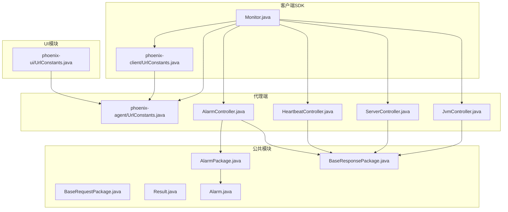
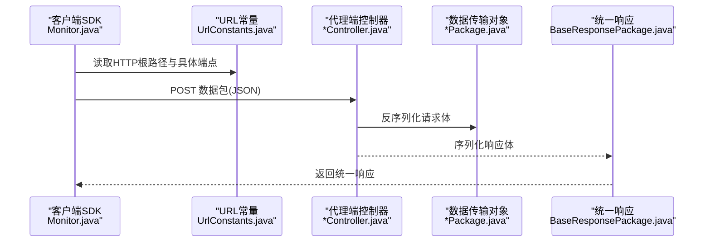
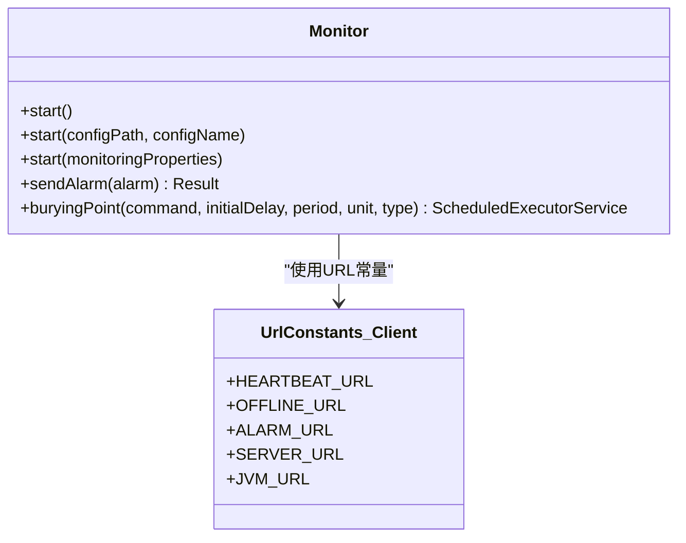
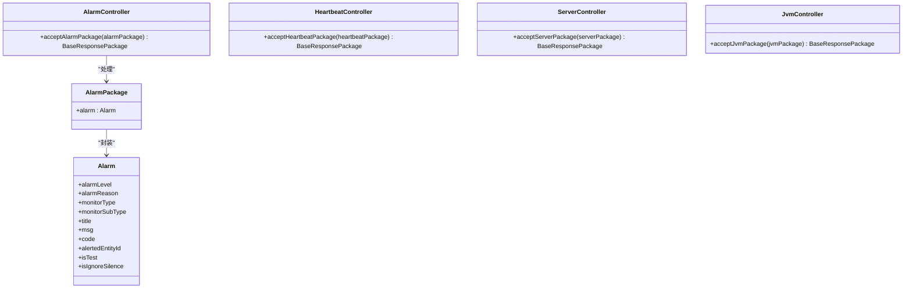
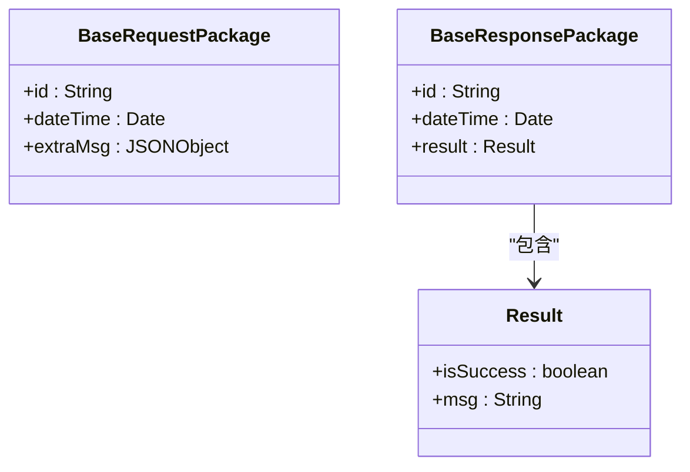
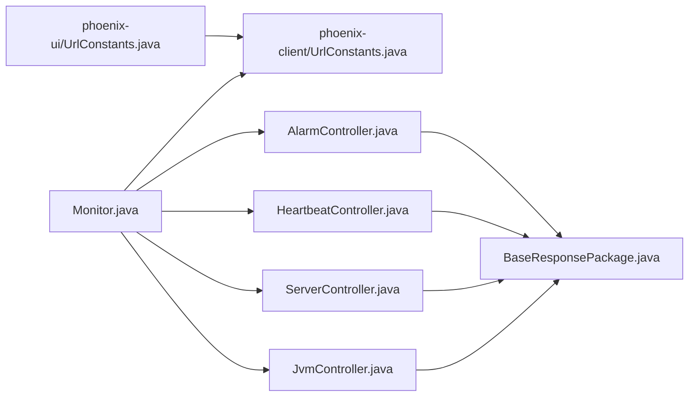

# API使用示例

<cite>
**本文引用的文件**
- [phoenix-client/Monitor.java](file://phoenix-client/phoenix-client-core/src/main/java/com/gitee/pifeng/monitoring/plug/Monitor.java)
- [phoenix-client/UrlConstants.java](file://phoenix-client/phoenix-client-core/src/main/java/com/gitee/pifeng/monitoring/plug/constant/UrlConstants.java)
- [phoenix-agent/UrlConstants.java](file://phoenix-agent/src/main/java/com/gitee/pifeng/monitoring/agent/constant/UrlConstants.java)
- [phoenix-ui/UrlConstants.java](file://phoenix-ui/src/main/java/com/gitee/pifeng/monitoring/ui/constant/UrlConstants.java)
- [AlarmController.java](file://phoenix-agent/src/main/java/com/gitee/pifeng/monitoring/agent/business/client/controller/AlarmController.java)
- [HeartbeatController.java](file://phoenix-agent/src/main/java/com/gitee/pifeng/monitoring/agent/business/client/controller/HeartbeatController.java)
- [ServerController.java](file://phoenix-agent/src/main/java/com/gitee/pifeng/monitoring/agent/business/client/controller/ServerController.java)
- [JvmController.java](file://phoenix-agent/src/main/java/com/gitee/pifeng/monitoring/agent/business/client/controller/JvmController.java)
- [BaseRequestPackage.java](file://phoenix-common/phoenix-common-core/src/main/java/com/gitee/pifeng/monitoring/common/dto/BaseRequestPackage.java)
- [BaseResponsePackage.java](file://phoenix-common/phoenix-common-core/src/main/java/com/gitee/pifeng/monitoring/common/dto/BaseResponsePackage.java)
- [AlarmPackage.java](file://phoenix-common/phoenix-common-core/src/main/java/com/gitee/pifeng/monitoring/common/dto/AlarmPackage.java)
- [Result.java](file://phoenix-common/phoenix-common-core/src/main/java/com/gitee/pifeng/monitoring/common/domain/Result.java)
- [Alarm.java](file://phoenix-common/phoenix-common-core/src/main/java/com/gitee/pifeng/monitoring/common/domain/Alarm.java)
</cite>

## 目录
1. [简介](#简介)
2. [项目结构](#项目结构)
3. [核心组件](#核心组件)
4. [架构总览](#架构总览)
5. [详细组件分析](#详细组件分析)
6. [依赖分析](#依赖分析)
7. [性能考虑](#性能考虑)
8. [故障排查指南](#故障排查指南)
9. [结论](#结论)
10. [附录](#附录)

## 简介
本文件面向Phoenix监控系统的API使用示例与最佳实践，覆盖以下目标：
- 提供完整的curl命令示例，涵盖GET查询、POST提交、PUT更新、DELETE删除等HTTP方法的调用方式
- 说明JavaScript前端调用示例，包括jQuery AJAX、Fetch API、Promise异步处理等现代前端技术的API调用方式
- 提供Java客户端SDK使用示例，包括Monitor类的初始化、监控配置、数据采集、告警发送等核心功能
- 涵盖Python、Go、Node.js等其他语言的API调用思路与要点
- 总结API调用的最佳实践，包括请求参数验证、响应数据解析、错误处理策略、性能优化技巧
- 给出业务场景示例，如系统监控集成、告警通知配置、数据报表生成等实际应用场景的API调用组合
- 提供API调试和测试工具的使用指南，如Postman集合、curl脚本、自动化测试等工具的实际应用
- 提供API限流和并发处理的示例，帮助开发者在高并发场景下正确使用API接口

## 项目结构
Phoenix监控系统由三部分组成：
- 客户端SDK（phoenix-client）：负责采集心跳、服务器、JVM、业务埋点等数据，并通过HTTP发送到服务端
- 代理端（phoenix-agent）：接收来自客户端的数据包，进行处理并返回统一响应
- 公共模块（phoenix-common）：定义通用的数据传输对象（DTO）、领域模型（Domain）与基础响应结构
- UI模块（phoenix-ui）：提供管理界面与部分测试接口的URL常量

图表来源
- [Monitor.java:1-195](file://phoenix-client/phoenix-client-core/src/main/java/com/gitee/pifeng/monitoring/plug/Monitor.java#L1-L195)
- [UrlConstants.java:1-57](file://phoenix-client/phoenix-client-core/src/main/java/com/gitee/pifeng/monitoring/plug/constant/UrlConstants.java#L1-L57)
- [AlarmController.java:1-56](file://phoenix-agent/src/main/java/com/gitee/pifeng/monitoring/agent/business/client/controller/AlarmController.java#L1-L56)
- [HeartbeatController.java:1-56](file://phoenix-agent/src/main/java/com/gitee/pifeng/monitoring/agent/business/client/controller/HeartbeatController.java#L1-L56)
- [ServerController.java:1-55](file://phoenix-agent/src/main/java/com/gitee/pifeng/monitoring/agent/business/client/controller/ServerController.java#L1-L55)
- [JvmController.java:1-55](file://phoenix-agent/src/main/java/com/gitee/pifeng/monitoring/agent/business/client/controller/JvmController.java#L1-L55)
- [BaseRequestPackage.java:1-42](file://phoenix-common/phoenix-common-core/src/main/java/com/gitee/pifeng/monitoring/common/dto/BaseRequestPackage.java#L1-L42)
- [BaseResponsePackage.java:1-42](file://phoenix-common/phoenix-common-core/src/main/java/com/gitee/pifeng/monitoring/common/dto/BaseResponsePackage.java#L1-L42)
- [AlarmPackage.java:1-29](file://phoenix-common/phoenix-common-core/src/main/java/com/gitee/pifeng/monitoring/common/dto/AlarmPackage.java#L1-L29)
- [Result.java:1-35](file://phoenix-common/phoenix-common-core/src/main/java/com/gitee/pifeng/monitoring/common/domain/Result.java#L1-L35)
- [Alarm.java:1-117](file://phoenix-common/phoenix-common-core/src/main/java/com/gitee/pifeng/monitoring/common/domain/Alarm.java#L1-L117)

章节来源
- [Monitor.java:1-195](file://phoenix-client/phoenix-client-core/src/main/java/com/gitee/pifeng/monitoring/plug/Monitor.java#L1-L195)
- [UrlConstants.java:1-57](file://phoenix-client/phoenix-client-core/src/main/java/com/gitee/pifeng/monitoring/plug/constant/UrlConstants.java#L1-L57)

## 核心组件
- Monitor（客户端SDK入口）
  - 提供启动监控、发送告警、业务埋点调度等能力
  - 通过URL常量构建HTTP请求，发送心跳、服务器、JVM、告警等数据包
- 控制器（代理端）
  - 接收来自客户端的数据包，调用对应服务层处理并返回统一响应
- DTO与Domain
  - BaseRequestPackage/BaseResponsePackage定义了请求/响应的基础结构
  - AlarmPackage封装告警对象；Result封装通用返回结果
  - Alarm定义告警实体字段（级别、原因、类型、内容、编码等）

章节来源
- [Monitor.java:67-151](file://phoenix-client/phoenix-client-core/src/main/java/com/gitee/pifeng/monitoring/plug/Monitor.java#L67-L151)
- [AlarmController.java:47-53](file://phoenix-agent/src/main/java/com/gitee/pifeng/monitoring/agent/business/client/controller/AlarmController.java#L47-L53)
- [HeartbeatController.java:47-53](file://phoenix-agent/src/main/java/com/gitee/pifeng/monitoring/agent/business/client/controller/HeartbeatController.java#L47-L53)
- [ServerController.java:47-53](file://phoenix-agent/src/main/java/com/gitee/pifeng/monitoring/agent/business/client/controller/ServerController.java#L47-L53)
- [JvmController.java:47-53](file://phoenix-agent/src/main/java/com/gitee/pifeng/monitoring/agent/business/client/controller/JvmController.java#L47-L53)
- [BaseRequestPackage.java:24-41](file://phoenix-common/phoenix-common-core/src/main/java/com/gitee/pifeng/monitoring/common/dto/BaseRequestPackage.java#L24-L41)
- [BaseResponsePackage.java:24-41](file://phoenix-common/phoenix-common-core/src/main/java/com/gitee/pifeng/monitoring/common/dto/BaseResponsePackage.java#L24-L41)
- [AlarmPackage.java:21-28](file://phoenix-common/phoenix-common-core/src/main/java/com/gitee/pifeng/monitoring/common/dto/AlarmPackage.java#L21-L28)
- [Result.java:22-34](file://phoenix-common/phoenix-common-core/src/main/java/com/gitee/pifeng/monitoring/common/domain/Result.java#L22-L34)
- [Alarm.java:28-116](file://phoenix-common/phoenix-common-core/src/main/java/com/gitee/pifeng/monitoring/common/domain/Alarm.java#L28-L116)

## 架构总览
客户端SDK通过统一的URL常量向代理端发送各类数据包，代理端控制器接收并处理，最终返回统一的响应结构。

图表来源
- [Monitor.java:163-174](file://phoenix-client/phoenix-client-core/src/main/java/com/gitee/pifeng/monitoring/plug/Monitor.java#L163-L174)
- [UrlConstants.java:29-54](file://phoenix-agent/src/main/java/com/gitee/pifeng/monitoring/agent/constant/UrlConstants.java#L29-L54)
- [AlarmController.java:50-53](file://phoenix-agent/src/main/java/com/gitee/pifeng/monitoring/agent/business/client/controller/AlarmController.java#L50-L53)
- [BaseResponsePackage.java:24-41](file://phoenix-common/phoenix-common-core/src/main/java/com/gitee/pifeng/monitoring/common/dto/BaseResponsePackage.java#L24-L41)

## 详细组件分析

### 客户端SDK（Monitor）与URL常量
- 启动监控：支持从默认或自定义配置加载监控属性，初始化安全配置，启动定时任务（心跳、服务器、JVM），并在JVM退出时执行清理
- 发送告警：构造告警数据包，调用统一URL常量中的告警端点，解析响应为通用Result
- 业务埋点：提供可调度的线程池，用于周期性执行业务埋点任务

图表来源
- [Monitor.java:67-174](file://phoenix-client/phoenix-client-core/src/main/java/com/gitee/pifeng/monitoring/plug/Monitor.java#L67-L174)
- [UrlConstants.java:34-54](file://phoenix-client/phoenix-client-core/src/main/java/com/gitee/pifeng/monitoring/plug/constant/UrlConstants.java#L34-L54)

章节来源
- [Monitor.java:67-174](file://phoenix-client/phoenix-client-core/src/main/java/com/gitee/pifeng/monitoring/plug/Monitor.java#L67-L174)
- [UrlConstants.java:29-56](file://phoenix-client/phoenix-client-core/src/main/java/com/gitee/pifeng/monitoring/plug/constant/UrlConstants.java#L29-L56)

### 代理端控制器与数据包
- 告警控制器：接收告警数据包，调用服务层处理并返回统一响应
- 心跳控制器：接收心跳数据包，返回统一响应
- 服务器控制器：接收服务器信息数据包，返回统一响应
- JVM控制器：接收JVM信息数据包，返回统一响应

图表来源
- [AlarmController.java:47-53](file://phoenix-agent/src/main/java/com/gitee/pifeng/monitoring/agent/business/client/controller/AlarmController.java#L47-L53)
- [HeartbeatController.java:47-53](file://phoenix-agent/src/main/java/com/gitee/pifeng/monitoring/agent/business/client/controller/HeartbeatController.java#L47-L53)
- [ServerController.java:47-53](file://phoenix-agent/src/main/java/com/gitee/pifeng/monitoring/agent/business/client/controller/ServerController.java#L47-L53)
- [JvmController.java:47-53](file://phoenix-agent/src/main/java/com/gitee/pifeng/monitoring/agent/business/client/controller/JvmController.java#L47-L53)
- [AlarmPackage.java:21-28](file://phoenix-common/phoenix-common-core/src/main/java/com/gitee/pifeng/monitoring/common/dto/AlarmPackage.java#L21-L28)
- [Alarm.java:28-116](file://phoenix-common/phoenix-common-core/src/main/java/com/gitee/pifeng/monitoring/common/domain/Alarm.java#L28-L116)

章节来源
- [AlarmController.java:47-53](file://phoenix-agent/src/main/java/com/gitee/pifeng/monitoring/agent/business/client/controller/AlarmController.java#L47-L53)
- [HeartbeatController.java:47-53](file://phoenix-agent/src/main/java/com/gitee/pifeng/monitoring/agent/business/client/controller/HeartbeatController.java#L47-L53)
- [ServerController.java:47-53](file://phoenix-agent/src/main/java/com/gitee/pifeng/monitoring/agent/business/client/controller/ServerController.java#L47-L53)
- [JvmController.java:47-53](file://phoenix-agent/src/main/java/com/gitee/pifeng/monitoring/agent/business/client/controller/JvmController.java#L47-L53)
- [AlarmPackage.java:21-28](file://phoenix-common/phoenix-common-core/src/main/java/com/gitee/pifeng/monitoring/common/dto/AlarmPackage.java#L21-L28)
- [Alarm.java:28-116](file://phoenix-common/phoenix-common-core/src/main/java/com/gitee/pifeng/monitoring/common/domain/Alarm.java#L28-L116)

### 统一响应与请求包
- BaseRequestPackage：定义请求包的通用字段（id、dateTime、extraMsg）
- BaseResponsePackage：定义响应包的通用字段（id、dateTime、result）
- Result：封装通用返回结果（isSuccess、msg）

图表来源
- [BaseRequestPackage.java:24-41](file://phoenix-common/phoenix-common-core/src/main/java/com/gitee/pifeng/monitoring/common/dto/BaseRequestPackage.java#L24-L41)
- [BaseResponsePackage.java:24-41](file://phoenix-common/phoenix-common-core/src/main/java/com/gitee/pifeng/monitoring/common/dto/BaseResponsePackage.java#L24-L41)
- [Result.java:22-34](file://phoenix-common/phoenix-common-core/src/main/java/com/gitee/pifeng/monitoring/common/domain/Result.java#L22-L34)

章节来源
- [BaseRequestPackage.java:24-41](file://phoenix-common/phoenix-common-core/src/main/java/com/gitee/pifeng/monitoring/common/dto/BaseRequestPackage.java#L24-L41)
- [BaseResponsePackage.java:24-41](file://phoenix-common/phoenix-common-core/src/main/java/com/gitee/pifeng/monitoring/common/dto/BaseResponsePackage.java#L24-L41)
- [Result.java:22-34](file://phoenix-common/phoenix-common-core/src/main/java/com/gitee/pifeng/monitoring/common/domain/Result.java#L22-L34)

## 依赖分析
- 客户端SDK依赖URL常量与统一响应结构
- 代理端控制器依赖DTO与统一响应结构
- UI模块同样依赖URL常量，用于管理界面与测试接口

图表来源
- [Monitor.java:1-195](file://phoenix-client/phoenix-client-core/src/main/java/com/gitee/pifeng/monitoring/plug/Monitor.java#L1-L195)
- [UrlConstants.java:1-57](file://phoenix-client/phoenix-client-core/src/main/java/com/gitee/pifeng/monitoring/plug/constant/UrlConstants.java#L1-L57)
- [AlarmController.java:1-56](file://phoenix-agent/src/main/java/com/gitee/pifeng/monitoring/agent/business/client/controller/AlarmController.java#L1-L56)
- [HeartbeatController.java:1-56](file://phoenix-agent/src/main/java/com/gitee/pifeng/monitoring/agent/business/client/controller/HeartbeatController.java#L1-L56)
- [ServerController.java:1-55](file://phoenix-agent/src/main/java/com/gitee/pifeng/monitoring/agent/business/client/controller/ServerController.java#L1-L55)
- [JvmController.java:1-55](file://phoenix-agent/src/main/java/com/gitee/pifeng/monitoring/agent/business/client/controller/JvmController.java#L1-L55)
- [BaseResponsePackage.java:1-42](file://phoenix-common/phoenix-common-core/src/main/java/com/gitee/pifeng/monitoring/common/dto/BaseResponsePackage.java#L1-L42)
- [UrlConstants.java:1-102](file://phoenix-ui/src/main/java/com/gitee/pifeng/monitoring/ui/constant/UrlConstants.java#L1-L102)

章节来源
- [Monitor.java:1-195](file://phoenix-client/phoenix-client-core/src/main/java/com/gitee/pifeng/monitoring/plug/Monitor.java#L1-L195)
- [UrlConstants.java:1-57](file://phoenix-client/phoenix-client-core/src/main/java/com/gitee/pifeng/monitoring/plug/constant/UrlConstants.java#L1-L57)
- [AlarmController.java:1-56](file://phoenix-agent/src/main/java/com/gitee/pifeng/monitoring/agent/business/client/controller/AlarmController.java#L1-L56)
- [HeartbeatController.java:1-56](file://phoenix-agent/src/main/java/com/gitee/pifeng/monitoring/agent/business/client/controller/HeartbeatController.java#L1-L56)
- [ServerController.java:1-55](file://phoenix-agent/src/main/java/com/gitee/pifeng/monitoring/agent/business/client/controller/ServerController.java#L1-L55)
- [JvmController.java:1-55](file://phoenix-agent/src/main/java/com/gitee/pifeng/monitoring/agent/business/client/controller/JvmController.java#L1-L55)
- [BaseResponsePackage.java:1-42](file://phoenix-common/phoenix-common-core/src/main/java/com/gitee/pifeng/monitoring/common/dto/BaseResponsePackage.java#L1-L42)
- [UrlConstants.java:1-102](file://phoenix-ui/src/main/java/com/gitee/pifeng/monitoring/ui/constant/UrlConstants.java#L1-L102)

## 性能考虑
- 请求体加密与解密：客户端与服务端通过统一的加密/解密流程处理数据包，避免明文传输敏感信息
- 统一响应结构：所有接口返回统一的响应包，便于前端与客户端统一解析
- 定时任务与线程池：客户端通过受监控的线程池执行心跳、服务器、JVM等周期性任务，避免阻塞主线程
- 并发与限流：建议在网关或代理端对高频接口（如心跳、告警）实施限流策略，防止突发流量冲击

## 故障排查指南
- 告警发送失败：检查客户端是否正确构造告警数据包，确认URL常量与服务端端点一致，查看返回的通用Result以定位问题
- 心跳/服务器/JVM数据未到达：确认客户端已启动定时任务，代理端控制器已正确接收并处理请求包
- 配置加载异常：检查配置文件路径与名称，确保监控属性加载与校验通过

章节来源
- [Monitor.java:163-174](file://phoenix-client/phoenix-client-core/src/main/java/com/gitee/pifeng/monitoring/plug/Monitor.java#L163-L174)
- [Result.java:22-34](file://phoenix-common/phoenix-common-core/src/main/java/com/gitee/pifeng/monitoring/common/domain/Result.java#L22-L34)

## 结论
Phoenix监控系统的API围绕统一的数据包结构与URL常量展开，客户端SDK负责采集与上报，代理端控制器负责接收与处理，公共模块提供统一的响应格式。通过本指南提供的curl命令、前端调用示例与多语言思路，以及最佳实践与故障排查建议，开发者可以快速集成并稳定使用Phoenix监控API。

## 附录

### curl命令示例（基于URL常量）
- 发送心跳包（POST）
  - 目标：[HEARTBEAT_URL](file://phoenix-agent/src/main/java/com/gitee/pifeng/monitoring/agent/constant/UrlConstants.java#L34)
  - 方法：POST
  - 负载：心跳数据包JSON
  - 头部：Content-Type: application/json
- 发送告警包（POST）
  - 目标：[ALARM_URL](file://phoenix-agent/src/main/java/com/gitee/pifeng/monitoring/agent/constant/UrlConstants.java#L39)
  - 方法：POST
  - 负载：告警数据包JSON（包含告警对象）
  - 头部：Content-Type: application/json
- 发送服务器信息包（POST）
  - 目标：[SERVER_URL](file://phoenix-agent/src/main/java/com/gitee/pifeng/monitoring/agent/constant/UrlConstants.java#L44)
  - 方法：POST
  - 负载：服务器信息数据包JSON
  - 头部：Content-Type: application/json
- 发送JVM信息包（POST）
  - 目标：[JVM_URL](file://phoenix-agent/src/main/java/com/gitee/pifeng/monitoring/agent/constant/UrlConstants.java#L49)
  - 方法：POST
  - 负载：JVM信息数据包JSON
  - 头部：Content-Type: application/json
- 刷新监控属性配置（POST）
  - 目标：[MONITORING_PROPERTIES_CONFIG_REFRESH_URL](file://phoenix-agent/src/main/java/com/gitee/pifeng/monitoring/agent/constant/UrlConstants.java#L59)
  - 方法：POST
  - 负载：空或配置键值
  - 头部：Content-Type: application/json
- 获取被监控网络源IP（GET）
  - 目标：[GET_SOURCE_IP_URL](file://phoenix-agent/src/main/java/com/gitee/pifeng/monitoring/agent/constant/UrlConstants.java#L64)
  - 方法：GET
  - 负载：无
- 测试HTTP连通性（GET）
  - 目标：[TEST_MONITOR_HTTP_URL](file://phoenix-agent/src/main/java/com/gitee/pifeng/monitoring/agent/constant/UrlConstants.java#L74)
  - 方法：GET
  - 负载：无
- 测试TCP连通性（GET）
  - 目标：[TEST_MONITOR_TCP_URL](file://phoenix-agent/src/main/java/com/gitee/pifeng/monitoring/agent/constant/UrlConstants.java#L79)
  - 方法：GET
  - 负载：无
- 测试网络连通性（GET）
  - 目标：[TEST_MONITOR_NETWORK_URL](file://phoenix-agent/src/main/java/com/gitee/pifeng/monitoring/agent/constant/UrlConstants.java#L69)
  - 方法：GET
  - 负载：无
- 测试数据库连通性（GET）
  - 目标：[TEST_MONITOR_DB_URL](file://phoenix-agent/src/main/java/com/gitee/pifeng/monitoring/agent/constant/UrlConstants.java#L84)
  - 方法：GET
  - 负载：无
- MySQL：获取会话列表（GET）
  - 目标：[MYSQL_GET_SESSION_LIST_URL](file://phoenix-agent/src/main/java/com/gitee/pifeng/monitoring/agent/constant/UrlConstants.java#L89)
  - 方法：GET
  - 负载：无
- MySQL：结束会话（POST）
  - 目标：[MYSQL_DESTROY_SESSION_URL](file://phoenix-agent/src/main/java/com/gitee/pifeng/monitoring/agent/constant/UrlConstants.java#L94)
  - 方法：POST
  - 负载：会话ID等参数
- Oracle：获取会话列表（GET）
  - 目标：[ORACLE_GET_SESSION_LIST_URL](file://phoenix-agent/src/main/java/com/gitee/pifeng/monitoring/agent/constant/UrlConstants.java#L99)
  - 方法：GET
  - 负载：无
- Oracle：结束会话（POST）
  - 目标：[ORACLE_DESTROY_SESSION_URL](file://phoenix-agent/src/main/java/com/gitee/pifeng/monitoring/agent/constant/UrlConstants.java#L104)
  - 方法：POST
  - 负载：会话ID等参数
- Oracle：获取表空间列表（按文件/全部）（GET）
  - 目标：[ORACLE_GET_TABLESPACE_LIST_FILE_URL](file://phoenix-agent/src/main/java/com/gitee/pifeng/monitoring/agent/constant/UrlConstants.java#L109)、[ORACLE_GET_TABLESPACE_LIST_ALL_URL](file://phoenix-agent/src/main/java/com/gitee/pifeng/monitoring/agent/constant/UrlConstants.java#L114)
  - 方法：GET
  - 负载：无
- Redis：获取Redis信息（GET）
  - 目标：[REDIS_GET_REDIS_INFO_URL](file://phoenix-agent/src/main/java/com/gitee/pifeng/monitoring/agent/constant/UrlConstants.java#L119)
  - 方法：GET
  - 负载：无
- Mongo：获取Mongo信息列表（GET）
  - 目标：[MONGO_GET_MONGO_INFO_LIST_URL](file://phoenix-agent/src/main/java/com/gitee/pifeng/monitoring/agent/constant/UrlConstants.java#L124)
  - 方法：GET
  - 负载：无

### JavaScript前端调用示例
- jQuery AJAX
  - 使用$.ajax发起POST请求，设置contentType为application/json，请求体为JSON字符串
  - 对响应进行统一解析，参考BaseResponsePackage结构
- Fetch API
  - 使用fetch发起POST/GET请求，设置headers为Content-Type: application/json
  - 使用JSON.parse解析响应体，提取Result字段判断成功与否
- Promise异步处理
  - 在Promise链中处理成功与失败分支，结合超时控制与重试策略

### Java客户端SDK使用示例
- 初始化与启动
  - 调用Monitor.start()或带配置参数的start方法，完成配置加载与定时任务启动
- 发送告警
  - 构造Alarm对象，调用Monitor.sendAlarm(alarm)，解析返回的Result
- 业务埋点
  - 使用Monitor.buryingPoint(command, initialDelay, period, unit, type)注册周期性任务

章节来源
- [Monitor.java:67-174](file://phoenix-client/phoenix-client-core/src/main/java/com/gitee/pifeng/monitoring/plug/Monitor.java#L67-L174)
- [Alarm.java:28-116](file://phoenix-common/phoenix-common-core/src/main/java/com/gitee/pifeng/monitoring/common/domain/Alarm.java#L28-L116)
- [BaseResponsePackage.java:24-41](file://phoenix-common/phoenix-common-core/src/main/java/com/gitee/pifeng/monitoring/common/dto/BaseResponsePackage.java#L24-L41)

### Python、Go、Node.js调用思路
- Python
  - 使用requests库发起HTTP请求，设置headers与json参数，解析响应为字典
- Go
  - 使用net/http发起请求，使用encoding/json编解码，解析统一响应结构
- Node.js
  - 使用axios/fetch发起请求，设置Content-Type为application/json，解析响应体

### API调试与测试工具
- Postman集合
  - 导入各端点的请求模板，设置环境变量（如HTTP根路径），批量执行测试
- curl脚本
  - 编写shell脚本循环调用高频接口，模拟生产负载
- 自动化测试
  - 使用pytest（Python）或JUnit（Java）编写测试用例，覆盖正常与异常场景

### API限流与并发处理
- 限流策略
  - 在网关或代理端对心跳、告警等高频接口实施令牌桶/漏桶算法限流
- 并发处理
  - 客户端使用受监控的线程池执行周期性任务，避免阻塞
  - 服务端控制器处理请求时采用异步或队列化处理，提升吞吐