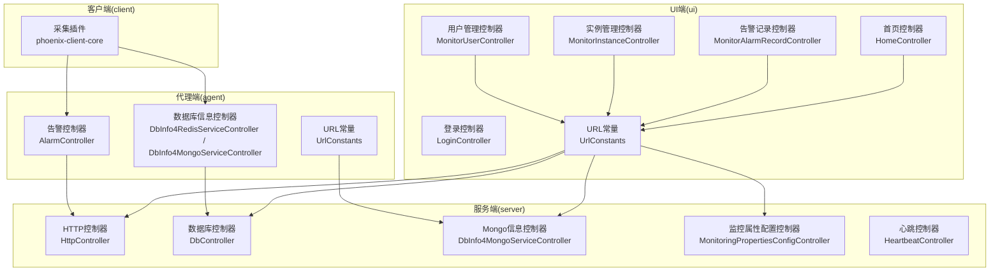
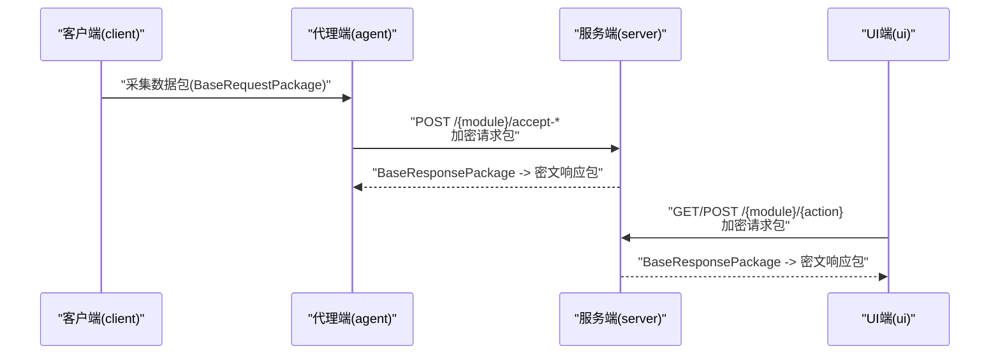
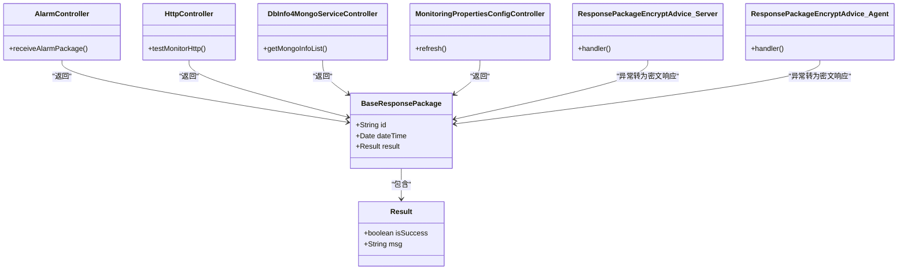

# API接口参考

<cite>
**本文引用的文件**
- [phoenix-agent/src/main/java/com/gitee/pifeng/monitoring/agent/business/client/controller/AlarmController.java](file://phoenix-agent/src/main/java/com/gitee/pifeng/monitoring/agent/business/client/controller/AlarmController.java)
- [phoenix-agent/src/main/java/com/gitee/pifeng/monitoring/agent/business/client/controller/DbInfo4MongoServiceController.java](file://phoenix-agent/src/main/java/com/gitee/pifeng/monitoring/agent/business/client/controller/DbInfo4MongoServiceController.java)
- [phoenix-agent/src/main/java/com/gitee/pifeng/monitoring/agent/business/client/controller/DbInfo4RedisServiceController.java](file://phoenix-agent/src/main/java/com/gitee/pifeng/monitoring/agent/business/client/controller/DbInfo4RedisServiceController.java)
- [phoenix-agent/src/main/java/com/gitee/pifeng/monitoring/agent/constant/UrlConstants.java](file://phoenix-agent/src/main/java/com/gitee/pifeng/monitoring/agent/constant/UrlConstants.java)
- [phoenix-agent/src/main/java/com/gitee/pifeng/monitoring/agent/component/ResponsePackageEncryptAdvice.java](file://phoenix-agent/src/main/java/com/gitee/pifeng/monitoring/agent/component/ResponsePackageEncryptAdvice.java)
- [phoenix-server/src/main/java/com/gitee/pifeng/monitoring/server/business/server/controller/HttpController.java](file://phoenix-server/src/main/java/com/gitee/pifeng/monitoring/server/business/server/controller/HttpController.java)
- [phoenix-server/src/main/java/com/gitee/pifeng/monitoring/server/business/server/controller/DbController.java](file://phoenix-server/src/main/java/com/gitee/pifeng/monitoring/server/business/server/controller/DbController.java)
- [phoenix-server/src/main/java/com/gitee/pifeng/monitoring/server/business/server/controller/DbInfo4MongoServiceController.java](file://phoenix-server/src/main/java/com/gitee/pifeng/monitoring/server/business/server/controller/DbInfo4MongoServiceController.java)
- [phoenix-server/src/main/java/com/gitee/pifeng/monitoring/server/business/server/controller/MonitoringPropertiesConfigController.java](file://phoenix-server/src/main/java/com/gitee/pifeng/monitoring/server/business/server/controller/MonitoringPropertiesConfigController.java)
- [phoenix-server/src/main/java/com/gitee/pifeng/monitoring/server/business/server/controller/HeartbeatController.java](file://phoenix-server/src/main/java/com/gitee/pifeng/monitoring/server/business/server/controller/HeartbeatController.java)
- [phoenix-server/src/main/java/com/gitee/pifeng/monitoring/server/business/server/component/ResponsePackageEncryptAdvice.java](file://phoenix-server/src/main/java/com/gitee/pifeng/monitoring/server/business/server/component/ResponsePackageEncryptAdvice.java)
- [phoenix-server/src/main/java/com/gitee/pifeng/monitoring/server/business/server/monitor/http/HttpMonitorJob.java](file://phoenix-server/src/main/java/com/gitee/pifeng/monitoring/server/business/server/monitor/http/HttpMonitorJob.java)
- [phoenix-common/phoenix-common-core/src/main/java/com/gitee/pifeng/monitoring/common/domain/Result.java](file://phoenix-common/phoenix-common-core/src/main/java/com/gitee/pifeng/monitoring/common/domain/Result.java)
- [phoenix-common/phoenix-common-core/src/main/java/com/gitee/pifeng/monitoring/common/dto/BaseResponsePackage.java](file://phoenix-common/phoenix-common-core/src/main/java/com/gitee/pifeng/monitoring/common/dto/BaseResponsePackage.java)
- [phoenix-common/phoenix-common-core/src/main/java/com/gitee/pifeng/monitoring/common/domain/Alarm.java](file://phoenix-common/phoenix-common-core/src/main/java/com/gitee/pifeng/monitoring/common/domain/Alarm.java)
- [phoenix-common/phoenix-common-core/src/main/java/com/gitee/pifeng/monitoring/common/constant/ResultMsgConstants.java](file://phoenix-common/phoenix-common-core/src/main/java/com/gitee/pifeng/monitoring/common/constant/ResultMsgConstants.java)
- [phoenix-common/phoenix-common-core/src/main/java/com/gitee/pifeng/monitoring/common/constant/EndpointTypeEnums.java](file://phoenix-common/phoenix-common-core/src/main/java/com/gitee/pifeng/monitoring/common/constant/EndpointTypeEnums.java)
- [phoenix-ui/src/main/java/com/gitee/pifeng/monitoring/ui/constant/UrlConstants.java](file://phoenix-ui/src/main/java/com/gitee/pifeng/monitoring/ui/constant/UrlConstants.java)
- [phoenix-ui/src/main/java/com/gitee/pifeng/monitoring/ui/business/web/controller/LoginController.java](file://phoenix-ui/src/main/java/com/gitee/pifeng/monitoring/ui/business/web/controller/LoginController.java)
- [phoenix-ui/src/main/java/com/gitee/pifeng/monitoring/ui/business/web/controller/MonitorUserController.java](file://phoenix-ui/src/main/java/com/gitee/pifeng/monitoring/ui/business/web/controller/MonitorUserController.java)
- [phoenix-ui/src/main/java/com/gitee/pifeng/monitoring/ui/business/web/controller/MonitorInstanceController.java](file://phoenix-ui/src/main/java/com/gitee/pifeng/monitoring/ui/business/web/controller/MonitorInstanceController.java)
- [phoenix-ui/src/main/java/com/gitee/pifeng/monitoring/ui/business/web/controller/MonitorAlarmRecordController.java](file://phoenix-ui/src/main/java/com/gitee/pifeng/monitoring/ui/business/web/controller/MonitorAlarmRecordController.java)
- [phoenix-ui/src/main/java/com/gitee/pifeng/monitoring/ui/business/web/controller/HomeController.java](file://phoenix-ui/src/main/java/com/gitee/pifeng/monitoring/ui/business/web/controller/HomeController.java)
- [phoenix-ui/src/main/java/com/gitee/pifeng/monitoring/ui/constant/WebResponseConstants.java](file://phoenix-ui/src/main/java/com/gitee/pifeng/monitoring/ui/constant/WebResponseConstants.java)
- [phoenix-ui/src/main/java/com/gitee/pifeng/monitoring/ui/property/auth/AuthProperties.java](file://phoenix-ui/src/main/java/com/gitee/pifeng/monitoring/ui/property/auth/AuthProperties.java)
- [phoenix-ui/src/main/java/com/gitee/pifeng/monitoring/ui/property/auth/AuthTypeEnums.java](file://phoenix-ui/src/main/java/com/gitee/pifeng/monitoring/ui/property/auth/AuthTypeEnums.java)
- [phoenix-ui/src/main/java/com/gitee/pifeng/monitoring/ui/config/springsecurity/SpringSecurityConfig.java](file://phoenix-ui/src/main/java/com/gitee/pifeng/monitoring/ui/config/springsecurity/SpringSecurityConfig.java)
- [phoenix-ui/src/main/resources/static/modules/db/dbInfo4redis.js](file://phoenix-ui/src/main/resources/static/modules/db/dbInfo4redis.js)
- [doc/数据库设计/sql/mysql/phoenix.sql](file://doc/数据库设计/sql/mysql/phoenix.sql)
</cite>

## 目录
1. [简介](#简介)
2. [项目结构](#项目结构)
3. [核心组件](#核心组件)
4. [架构总览](#架构总览)
5. [详细组件分析](#详细组件分析)
6. [依赖关系分析](#依赖关系分析)
7. [性能与最佳实践](#性能与最佳实践)
8. [故障排查指南](#故障排查指南)
9. [结论](#结论)
10. [附录](#附录)

## 简介
本文件为Phoenix监控系统的API接口参考文档，覆盖RESTful API设计规范、请求/响应格式、状态码定义、认证与授权机制、错误码与错误处理策略、API使用示例、版本管理与兼容性说明，以及性能优化建议与最佳实践。文档面向开发者与运维人员，既提供高层概览也提供代码级映射，便于快速定位实现细节。

## 项目结构
Phoenix由四端构成：客户端（client）、代理端（agent）、服务端（server）、UI端（ui）。API主要分布在agent与server端的控制器层，UI端提供管理与展示页面及部分业务接口，client通过插件集成采集与上报。

图表来源
- [phoenix-agent/src/main/java/com/gitee/pifeng/monitoring/agent/business/client/controller/AlarmController.java:1-41](file://phoenix-agent/src/main/java/com/gitee/pifeng/monitoring/agent/business/client/controller/AlarmController.java#L1-L41)
- [phoenix-agent/src/main/java/com/gitee/pifeng/monitoring/agent/business/client/controller/DbInfo4RedisServiceController.java:1-36](file://phoenix-agent/src/main/java/com/gitee/pifeng/monitoring/agent/business/client/controller/DbInfo4RedisServiceController.java#L1-L36)
- [phoenix-agent/src/main/java/com/gitee/pifeng/monitoring/agent/business/client/controller/DbInfo4MongoServiceController.java:1-58](file://phoenix-agent/src/main/java/com/gitee/pifeng/monitoring/agent/business/client/controller/DbInfo4MongoServiceController.java#L1-L58)
- [phoenix-agent/src/main/java/com/gitee/pifeng/monitoring/agent/constant/UrlConstants.java:1-127](file://phoenix-agent/src/main/java/com/gitee/pifeng/monitoring/agent/constant/UrlConstants.java#L1-L127)
- [phoenix-server/src/main/java/com/gitee/pifeng/monitoring/server/business/server/controller/HttpController.java:1-68](file://phoenix-server/src/main/java/com/gitee/pifeng/monitoring/server/business/server/controller/HttpController.java#L1-L68)
- [phoenix-server/src/main/java/com/gitee/pifeng/monitoring/server/business/server/controller/DbController.java:1-33](file://phoenix-server/src/main/java/com/gitee/pifeng/monitoring/server/business/server/controller/DbController.java#L1-L33)
- [phoenix-server/src/main/java/com/gitee/pifeng/monitoring/server/business/server/controller/DbInfo4MongoServiceController.java:1-35](file://phoenix-server/src/main/java/com/gitee/pifeng/monitoring/server/business/server/controller/DbInfo4MongoServiceController.java#L1-L35)
- [phoenix-server/src/main/java/com/gitee/pifeng/monitoring/server/business/server/controller/MonitoringPropertiesConfigController.java:1-35](file://phoenix-server/src/main/java/com/gitee/pifeng/monitoring/server/business/server/controller/MonitoringPropertiesConfigController.java#L1-L35)
- [phoenix-server/src/main/java/com/gitee/pifeng/monitoring/server/business/server/controller/HeartbeatController.java:1-33](file://phoenix-server/src/main/java/com/gitee/pifeng/monitoring/server/business/server/controller/HeartbeatController.java#L1-L33)
- [phoenix-ui/src/main/java/com/gitee/pifeng/monitoring/ui/constant/UrlConstants.java:1-102](file://phoenix-ui/src/main/java/com/gitee/pifeng/monitoring/ui/constant/UrlConstants.java#L1-L102)

章节来源
- [phoenix-agent/src/main/java/com/gitee/pifeng/monitoring/agent/constant/UrlConstants.java:26-127](file://phoenix-agent/src/main/java/com/gitee/pifeng/monitoring/agent/constant/UrlConstants.java#L26-L127)
- [phoenix-ui/src/main/java/com/gitee/pifeng/monitoring/ui/constant/UrlConstants.java:26-102](file://phoenix-ui/src/main/java/com/gitee/pifeng/monitoring/ui/constant/UrlConstants.java#L26-L102)

## 核心组件
- 统一响应模型
  - 基础响应包：包含ID、时间戳、结果对象
  - 结果对象：包含是否成功、消息
- 加解密与安全
  - 请求/响应包统一加密/解密封装
  - 控制器层异常统一捕获并返回密文响应包
- 端点类型
  - 支持服务端、代理端、客户端、UI端四种端点类型

章节来源
- [phoenix-common/phoenix-common-core/src/main/java/com/gitee/pifeng/monitoring/common/dto/BaseResponsePackage.java:1-42](file://phoenix-common/phoenix-common-core/src/main/java/com/gitee/pifeng/monitoring/common/dto/BaseResponsePackage.java#L1-L42)
- [phoenix-common/phoenix-common-core/src/main/java/com/gitee/pifeng/monitoring/common/domain/Result.java:1-35](file://phoenix-common/phoenix-common-core/src/main/java/com/gitee/pifeng/monitoring/common/domain/Result.java#L1-L35)
- [phoenix-common/phoenix-common-core/src/main/java/com/gitee/pifeng/monitoring/common/constant/EndpointTypeEnums.java:1-50](file://phoenix-common/phoenix-common-core/src/main/java/com/gitee/pifeng/monitoring/common/constant/EndpointTypeEnums.java#L1-L50)
- [phoenix-server/src/main/java/com/gitee/pifeng/monitoring/server/business/server/component/ResponsePackageEncryptAdvice.java:30-63](file://phoenix-server/src/main/java/com/gitee/pifeng/monitoring/server/business/server/component/ResponsePackageEncryptAdvice.java#L30-L63)
- [phoenix-agent/src/main/java/com/gitee/pifeng/monitoring/agent/component/ResponsePackageEncryptAdvice.java:30-63](file://phoenix-agent/src/main/java/com/gitee/pifeng/monitoring/agent/component/ResponsePackageEncryptAdvice.java#L30-L63)

## 架构总览
Phoenix采用“采集端（agent/client）—服务端（server）—UI端（ui）”三层架构。采集端负责监控数据采集与上报，服务端负责业务处理与存储，UI端提供管理与可视化。

图表来源
- [phoenix-agent/src/main/java/com/gitee/pifeng/monitoring/agent/constant/UrlConstants.java:32-125](file://phoenix-agent/src/main/java/com/gitee/pifeng/monitoring/agent/constant/UrlConstants.java#L32-L125)
- [phoenix-server/src/main/java/com/gitee/pifeng/monitoring/server/business/server/controller/HttpController.java:62-68](file://phoenix-server/src/main/java/com/gitee/pifeng/monitoring/server/business/server/controller/HttpController.java#L62-L68)
- [phoenix-ui/src/main/java/com/gitee/pifeng/monitoring/ui/constant/UrlConstants.java:32-100](file://phoenix-ui/src/main/java/com/gitee/pifeng/monitoring/ui/constant/UrlConstants.java#L32-L100)

## 详细组件分析

### RESTful API 设计规范
- HTTP方法
  - POST：提交数据或触发动作（如测试连通性、接收心跳/告警包）
  - GET：查询列表或详情
  - PUT：更新状态或配置
- URL路径设计
  - 以资源为中心，采用名词复数形式，模块/动作清晰分层
  - 示例：/http/test-monitor-http、/db-session4mysql/get-session-list
- 请求/响应格式
  - 请求体：BaseRequestPackage（加密）
  - 响应体：BaseResponsePackage（加密）
  - 统一结果对象：Result（isSuccess、msg）
- 状态码
  - 服务端统一返回200，具体业务成功与否由Result.isSuccess标识
  - 异常统一通过异常处理器转换为密文响应包并记录日志

章节来源
- [phoenix-server/src/main/java/com/gitee/pifeng/monitoring/server/business/server/controller/HttpController.java:62-68](file://phoenix-server/src/main/java/com/gitee/pifeng/monitoring/server/business/server/controller/HttpController.java#L62-L68)
- [phoenix-common/phoenix-common-core/src/main/java/com/gitee/pifeng/monitoring/common/dto/BaseResponsePackage.java:24-41](file://phoenix-common/phoenix-common-core/src/main/java/com/gitee/pifeng/monitoring/common/dto/BaseResponsePackage.java#L24-L41)
- [phoenix-common/phoenix-common-core/src/main/java/com/gitee/pifeng/monitoring/common/domain/Result.java:22-34](file://phoenix-common/phoenix-common-core/src/main/java/com/gitee/pifeng/monitoring/common/domain/Result.java#L22-L34)
- [phoenix-server/src/main/java/com/gitee/pifeng/monitoring/server/business/server/component/ResponsePackageEncryptAdvice.java:52-61](file://phoenix-server/src/main/java/com/gitee/pifeng/monitoring/server/business/server/component/ResponsePackageEncryptAdvice.java#L52-L61)

### 监控数据采集接口
- 心跳包
  - 方法：POST
  - 路径：/heartbeat/accept-heartbeat-package
  - 请求：BaseRequestPackage（加密）
  - 响应：BaseResponsePackage（加密）
- HTTP连通性测试
  - 方法：POST
  - 路径：/http/test-monitor-http
  - 请求：BaseRequestPackage（加密）
  - 响应：BaseResponsePackage（加密）
- TCP/网络/数据库连通性测试
  - 方法：POST
  - 路径：/tcp/test-monitor-tcp、/network/test-monitor-network、/db/test-monitor-db
  - 请求：BaseRequestPackage（加密）
  - 响应：BaseResponsePackage（加密）

章节来源
- [phoenix-agent/src/main/java/com/gitee/pifeng/monitoring/agent/constant/UrlConstants.java:32-84](file://phoenix-agent/src/main/java/com/gitee/pifeng/monitoring/agent/constant/UrlConstants.java#L32-L84)
- [phoenix-server/src/main/java/com/gitee/pifeng/monitoring/server/business/server/controller/HttpController.java:62-68](file://phoenix-server/src/main/java/com/gitee/pifeng/monitoring/server/business/server/controller/HttpController.java#L62-L68)

### 配置管理接口
- 刷新监控属性配置
  - 方法：POST
  - 路径：/monitoring-properties-config/refresh
  - 请求：无（服务端加载配置）
  - 响应：BaseResponsePackage（加密）

章节来源
- [phoenix-agent/src/main/java/com/gitee/pifeng/monitoring/agent/constant/UrlConstants.java:56-60](file://phoenix-agent/src/main/java/com/gitee/pifeng/monitoring/agent/constant/UrlConstants.java#L56-L60)
- [phoenix-server/src/main/java/com/gitee/pifeng/monitoring/server/business/server/controller/MonitoringPropertiesConfigController.java:32-35](file://phoenix-server/src/main/java/com/gitee/pifeng/monitoring/server/business/server/controller/MonitoringPropertiesConfigController.java#L32-L35)

### 告警管理接口
- 接收告警包
  - 方法：POST
  - 路径：/alarm/accept-alarm-package
  - 请求：BaseRequestPackage（加密）
  - 响应：BaseResponsePackage（加密）
- 告警记录查询
  - 方法：GET
  - 路径：/monitor-alarm-record/get-monitor-alarm-record-list
  - 查询参数：current、size、type、level、way、status、title、content、notSendReason、insertDate
  - 响应：UI层统一响应对象（非加密）

章节来源
- [phoenix-agent/src/main/java/com/gitee/pifeng/monitoring/agent/constant/UrlConstants.java:36-40](file://phoenix-agent/src/main/java/com/gitee/pifeng/monitoring/agent/constant/UrlConstants.java#L36-L40)
- [phoenix-ui/src/main/java/com/gitee/pifeng/monitoring/ui/business/web/controller/MonitorAlarmRecordController.java:103-115](file://phoenix-ui/src/main/java/com/gitee/pifeng/monitoring/ui/business/web/controller/MonitorAlarmRecordController.java#L103-L115)

### 用户管理接口
- 用户列表查询
  - 方法：GET
  - 路径：/user/get-monitor-user-list
  - 查询参数：current、size、account、username、email
  - 响应：UI层统一响应对象（非加密）
- 用户列表页面
  - 方法：GET
  - 路径：/user/list
  - 响应：页面视图

章节来源
- [phoenix-ui/src/main/java/com/gitee/pifeng/monitoring/ui/business/web/controller/MonitorUserController.java:83-96](file://phoenix-ui/src/main/java/com/gitee/pifeng/monitoring/ui/business/web/controller/MonitorUserController.java#L83-L96)

### 实例管理接口
- 应用实例列表查询
  - 方法：GET
  - 路径：/instance/get-monitor-instance-list
  - 查询参数：current、size、instanceName、endpoint、isOnline、appServerType、instanceDesc、isEnableMonitor、isEnableAlarm、language
  - 响应：UI层统一响应对象（非加密）
- 设置是否开启监控
  - 方法：PUT
  - 路径：/instance/set-is-enable-monitor
  - 查询参数：id、instanceId、isEnableMonitor
  - 响应：UI层统一响应对象（非加密）
- 获取应用实例（Map形式）
  - 方法：POST
  - 路径：/instance/get-monitor-instance-to-map
  - 响应：UI层统一响应对象（非加密）

章节来源
- [phoenix-ui/src/main/java/com/gitee/pifeng/monitoring/ui/business/web/controller/MonitorInstanceController.java:123-132](file://phoenix-ui/src/main/java/com/gitee/pifeng/monitoring/ui/business/web/controller/MonitorInstanceController.java#L123-L132)
- [phoenix-ui/src/main/java/com/gitee/pifeng/monitoring/ui/business/web/controller/MonitorInstanceController.java:310-320](file://phoenix-ui/src/main/java/com/gitee/pifeng/monitoring/ui/business/web/controller/MonitorInstanceController.java#L310-L320)
- [phoenix-ui/src/main/java/com/gitee/pifeng/monitoring/ui/business/web/controller/MonitorInstanceController.java:358-366](file://phoenix-ui/src/main/java/com/gitee/pifeng/monitoring/ui/business/web/controller/MonitorInstanceController.java#L358-L366)

### 数据库信息接口
- Redis信息
  - 方法：POST
  - 路径：/db-info4redis/get-redis-info
  - 请求：BaseRequestPackage（加密）
  - 响应：BaseResponsePackage（加密）
- Mongo信息列表
  - 方法：POST
  - 路径：/db-info4mongo/get-mongo-info-list
  - 请求：BaseRequestPackage（加密）
  - 响应：BaseResponsePackage（加密）

章节来源
- [phoenix-agent/src/main/java/com/gitee/pifeng/monitoring/agent/constant/UrlConstants.java:116-124](file://phoenix-agent/src/main/java/com/gitee/pifeng/monitoring/agent/constant/UrlConstants.java#L116-L124)
- [phoenix-server/src/main/java/com/gitee/pifeng/monitoring/server/business/server/controller/DbInfo4MongoServiceController.java:32-35](file://phoenix-server/src/main/java/com/gitee/pifeng/monitoring/server/business/server/controller/DbInfo4MongoServiceController.java#L32-L35)
- [phoenix-agent/src/main/java/com/gitee/pifeng/monitoring/agent/business/client/controller/DbInfo4RedisServiceController.java:30-36](file://phoenix-agent/src/main/java/com/gitee/pifeng/monitoring/agent/business/client/controller/DbInfo4RedisServiceController.java#L30-L36)
- [phoenix-agent/src/main/java/com/gitee/pifeng/monitoring/agent/business/client/controller/DbInfo4MongoServiceController.java:50-56](file://phoenix-agent/src/main/java/com/gitee/pifeng/monitoring/agent/business/client/controller/DbInfo4MongoServiceController.java#L50-L56)

### 登录与首页接口
- 登录页面
  - 方法：GET
  - 路径：/login
  - 响应：页面视图
- 首页最新5条告警记录
  - 方法：POST
  - 路径：/home/get-last-5-alarm-record
  - 响应：UI层统一响应对象（非加密）

章节来源
- [phoenix-ui/src/main/java/com/gitee/pifeng/monitoring/ui/business/web/controller/LoginController.java:41-43](file://phoenix-ui/src/main/java/com/gitee/pifeng/monitoring/ui/business/web/controller/LoginController.java#L41-L43)
- [phoenix-ui/src/main/java/com/gitee/pifeng/monitoring/ui/business/web/controller/HomeController.java:200-207](file://phoenix-ui/src/main/java/com/gitee/pifeng/monitoring/ui/business/web/controller/HomeController.java#L200-L207)

## 依赖关系分析

图表来源
- [phoenix-common/phoenix-common-core/src/main/java/com/gitee/pifeng/monitoring/common/domain/Result.java:22-34](file://phoenix-common/phoenix-common-core/src/main/java/com/gitee/pifeng/monitoring/common/domain/Result.java#L22-L34)
- [phoenix-common/phoenix-common-core/src/main/java/com/gitee/pifeng/monitoring/common/dto/BaseResponsePackage.java:24-41](file://phoenix-common/phoenix-common-core/src/main/java/com/gitee/pifeng/monitoring/common/dto/BaseResponsePackage.java#L24-L41)
- [phoenix-server/src/main/java/com/gitee/pifeng/monitoring/server/business/server/component/ResponsePackageEncryptAdvice.java:52-61](file://phoenix-server/src/main/java/com/gitee/pifeng/monitoring/server/business/server/component/ResponsePackageEncryptAdvice.java#L52-L61)
- [phoenix-agent/src/main/java/com/gitee/pifeng/monitoring/agent/component/ResponsePackageEncryptAdvice.java:55-63](file://phoenix-agent/src/main/java/com/gitee/pifeng/monitoring/agent/component/ResponsePackageEncryptAdvice.java#L55-L63)

章节来源
- [phoenix-common/phoenix-common-core/src/main/java/com/gitee/pifeng/monitoring/common/domain/Result.java:1-35](file://phoenix-common/phoenix-common-core/src/main/java/com/gitee/pifeng/monitoring/common/domain/Result.java#L1-L35)
- [phoenix-common/phoenix-common-core/src/main/java/com/gitee/pifeng/monitoring/common/dto/BaseResponsePackage.java:1-42](file://phoenix-common/phoenix-common-core/src/main/java/com/gitee/pifeng/monitoring/common/dto/BaseResponsePackage.java#L1-L42)

## 性能与最佳实践
- 使用POST提交加密数据包，避免明文传输
- 合理设置定时任务与轮询间隔，避免频繁请求
- 对长耗时操作（如HTTP连通性测试）增加超时控制与重试策略
- 在UI端使用分页查询，避免一次性拉取大量数据
- 对于高频接口，建议结合缓存与限流策略

## 故障排查指南
- 统一异常处理
  - 服务端与代理端异常处理器将Throwable转换为密文响应包，包含isSuccess=false与异常信息
- 常见问题定位
  - 检查请求/响应包是否正确加密/解密
  - 核对URL常量与实际控制器路径是否一致
  - 关注Result.isSuccess与msg字段判断业务结果
- 告警链路
  - HTTP监控异常时会触发告警，检查告警记录与发送状态

章节来源
- [phoenix-server/src/main/java/com/gitee/pifeng/monitoring/server/business/server/component/ResponsePackageEncryptAdvice.java:52-61](file://phoenix-server/src/main/java/com/gitee/pifeng/monitoring/server/business/server/component/ResponsePackageEncryptAdvice.java#L52-L61)
- [phoenix-agent/src/main/java/com/gitee/pifeng/monitoring/agent/component/ResponsePackageEncryptAdvice.java:55-63](file://phoenix-agent/src/main/java/com/gitee/pifeng/monitoring/agent/component/ResponsePackageEncryptAdvice.java#L55-L63)
- [phoenix-server/src/main/java/com/gitee/pifeng/monitoring/server/business/server/monitor/http/HttpMonitorJob.java:291-310](file://phoenix-server/src/main/java/com/gitee/pifeng/monitoring/server/business/server/monitor/http/HttpMonitorJob.java#L291-L310)

## 结论
Phoenix的API遵循统一的加密传输、标准化响应模型与异常处理机制，覆盖采集、配置、告警、用户与实例管理等核心业务。通过清晰的URL设计与统一的加解密流程，确保了系统的安全性与可维护性。建议在实际接入时严格遵循本文档的请求/响应格式与错误处理策略，并结合性能与安全最佳实践进行优化。

## 附录

### 请求/响应格式规范
- 请求体
  - BaseRequestPackage（加密）
- 响应体
  - BaseResponsePackage（加密）
  - BaseResponsePackage.result.isSuccess：布尔型，表示业务是否成功
  - BaseResponsePackage.result.msg：字符串，描述业务信息
- 字段命名约定
  - 使用驼峰命名
  - 时间字段统一使用日期类型
- 必填参数标识
  - 控制器参数标注为必填时，需在调用方显式传入

章节来源
- [phoenix-common/phoenix-common-core/src/main/java/com/gitee/pifeng/monitoring/common/dto/BaseResponsePackage.java:24-41](file://phoenix-common/phoenix-common-core/src/main/java/com/gitee/pifeng/monitoring/common/dto/BaseResponsePackage.java#L24-L41)
- [phoenix-common/phoenix-common-core/src/main/java/com/gitee/pifeng/monitoring/common/domain/Result.java:22-34](file://phoenix-common/phoenix-common-core/src/main/java/com/gitee/pifeng/monitoring/common/domain/Result.java#L22-L34)

### 认证与授权机制
- 认证类型
  - 自己认证（SELF）与第三方认证（THIRD）
- 配置属性
  - phoenix.auth.type：默认SELF
- 安全配置
  - Spring Security启用与会话管理
  - 页面访问控制与权限注解（如@PreAuthorize）

章节来源
- [phoenix-ui/src/main/java/com/gitee/pifeng/monitoring/ui/property/auth/AuthTypeEnums.java:11-23](file://phoenix-ui/src/main/java/com/gitee/pifeng/monitoring/ui/property/auth/AuthTypeEnums.java#L11-L23)
- [phoenix-ui/src/main/java/com/gitee/pifeng/monitoring/ui/property/auth/AuthProperties.java:17-27](file://phoenix-ui/src/main/java/com/gitee/pifeng/monitoring/ui/property/auth/AuthProperties.java#L17-L27)
- [phoenix-ui/src/main/java/com/gitee/pifeng/monitoring/ui/config/springsecurity/SpringSecurityConfig.java:1-19](file://phoenix-ui/src/main/java/com/gitee/pifeng/monitoring/ui/config/springsecurity/SpringSecurityConfig.java#L1-L19)

### 错误码与错误处理
- 通用返回信息常量
  - 成功/失败提示
- UI端返回常量
  - success/fail/exist/verifyFail/refreshFail/requiredIsNull/dataIntegrityViolation
- 统一异常处理
  - 所有控制器异常被捕获并转换为密文响应包，包含isSuccess=false与异常信息

章节来源
- [phoenix-common/phoenix-common-core/src/main/java/com/gitee/pifeng/monitoring/common/constant/ResultMsgConstants.java:24-34](file://phoenix-common/phoenix-common-core/src/main/java/com/gitee/pifeng/monitoring/common/constant/ResultMsgConstants.java#L24-L34)
- [phoenix-ui/src/main/java/com/gitee/pifeng/monitoring/ui/constant/WebResponseConstants.java:24-59](file://phoenix-ui/src/main/java/com/gitee/pifeng/monitoring/ui/constant/WebResponseConstants.java#L24-L59)
- [phoenix-server/src/main/java/com/gitee/pifeng/monitoring/server/business/server/component/ResponsePackageEncryptAdvice.java:52-61](file://phoenix-server/src/main/java/com/gitee/pifeng/monitoring/server/business/server/component/ResponsePackageEncryptAdvice.java#L52-L61)

### API使用示例
- curl示例（以HTTP连通性测试为例）
  - POST {server-root}/http/test-monitor-http
  - Content-Type: application/json
  - Body: BaseRequestPackage（加密）
- SDK使用示例
  - 参考采集插件中的发送器与包构造器，统一构造BaseRequestPackage并加密后发送
- 常见业务场景
  - 心跳上报：POST /heartbeat/accept-heartbeat-package
  - HTTP连通性测试：POST /http/test-monitor-http
  - 刷新监控配置：POST /monitoring-properties-config/refresh
  - 获取Redis/Mongo信息：POST /db-info4redis/get-redis-info、POST /db-info4mongo/get-mongo-info-list

章节来源
- [phoenix-agent/src/main/java/com/gitee/pifeng/monitoring/agent/constant/UrlConstants.java:32-125](file://phoenix-agent/src/main/java/com/gitee/pifeng/monitoring/agent/constant/UrlConstants.java#L32-L125)
- [phoenix-server/src/main/java/com/gitee/pifeng/monitoring/server/business/server/controller/HttpController.java:62-68](file://phoenix-server/src/main/java/com/gitee/pifeng/monitoring/server/business/server/controller/HttpController.java#L62-L68)

### API版本管理与兼容性
- 版本控制策略
  - 通过URL路径与模块划分实现版本隔离
- 废弃API处理
  - 保持向后兼容，逐步引导迁移
- 迁移指南
  - 更新URL常量与调用方逻辑，确保加密包结构不变

章节来源
- [phoenix-agent/src/main/java/com/gitee/pifeng/monitoring/agent/constant/UrlConstants.java:26-127](file://phoenix-agent/src/main/java/com/gitee/pifeng/monitoring/agent/constant/UrlConstants.java#L26-L127)
- [phoenix-ui/src/main/java/com/gitee/pifeng/monitoring/ui/constant/UrlConstants.java:26-102](file://phoenix-ui/src/main/java/com/gitee/pifeng/monitoring/ui/constant/UrlConstants.java#L26-L102)

### 数据模型与字段说明
- 告警记录表（摘录）
  - WAY：告警方式（SMS、MAIL等）
  - NUMBER：被告警人号码（手机号码、电子邮箱等）
  - STATUS：告警发送状态（0：失败；1：成功）
  - INSERT_TIME：告警时间
  - UPDATE_TIME：告警结果获取时间
- 应用实例表（摘录）
  - ENDPOINT：端点（client、agent、server、ui）
  - INSTANCE_NAME：应用实例名
  - LANGUAGE：编程语言
  - IP：IP地址
  - IS_ONLINE：应用状态（0：离线；1：在线）

章节来源
- [doc/数据库设计/sql/mysql/phoenix.sql:76-89](file://doc/数据库设计/sql/mysql/phoenix.sql#L76-L89)
- [doc/数据库设计/sql/mysql/phoenix.sql:275-285](file://doc/数据库设计/sql/mysql/phoenix.sql#L275-L285)