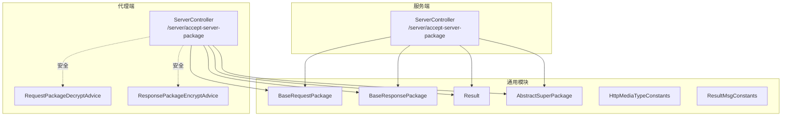
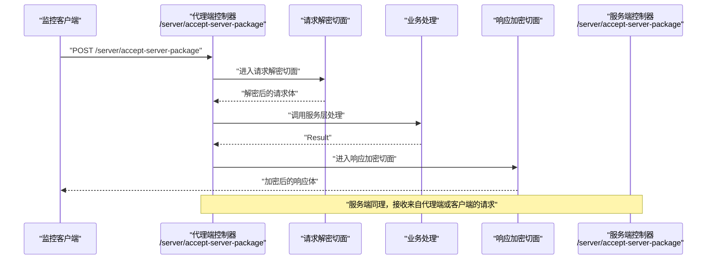
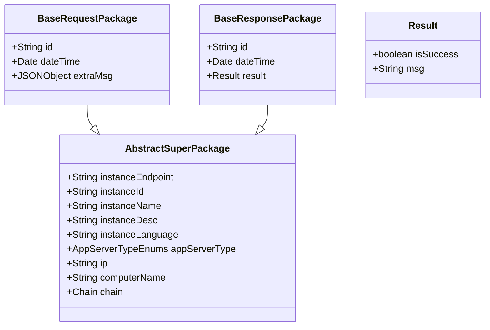
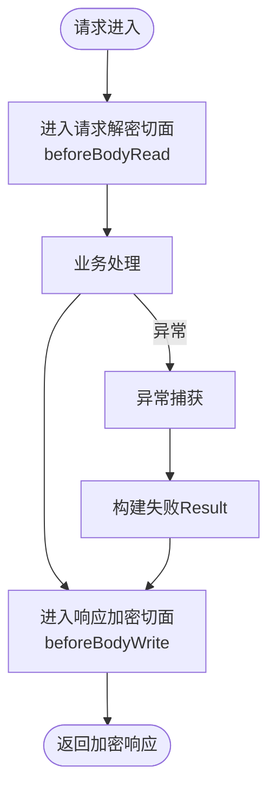
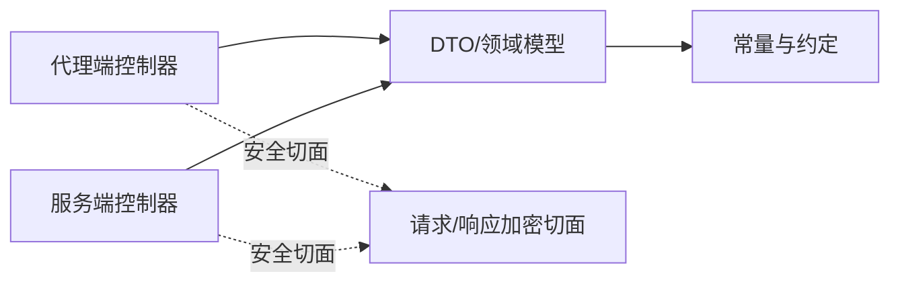

# API设计规范

<cite>
**本文引用的文件**
- [phoenix-agent/src/main/java/com/gitee/pifeng/monitoring/agent/business/client/controller/ServerController.java](file://phoenix-agent/src/main/java/com/gitee/pifeng/monitoring/agent/business/client/controller/ServerController.java)
- [phoenix-server/src/main/java/com/gitee/pifeng/monitoring/server/business/server/controller/ServerController.java](file://phoenix-server/src/main/java/com/gitee/pifeng/monitoring/server/business/server/controller/ServerController.java)
- [phoenix-common/phoenix-common-core/src/main/java/com/gitee/pifeng/monitoring/common/dto/BaseRequestPackage.java](file://phoenix-common/phoenix-common-core/src/main/java/com/gitee/pifeng/monitoring/common/dto/BaseRequestPackage.java)
- [phoenix-common/phoenix-common-core/src/main/java/com/gitee/pifeng/monitoring/common/dto/BaseResponsePackage.java](file://phoenix-common/phoenix-common-core/src/main/java/com/gitee/pifeng/monitoring/common/dto/BaseResponsePackage.java)
- [phoenix-common/phoenix-common-core/src/main/java/com/gitee/pifeng/monitoring/common/domain/Result.java](file://phoenix-common/phoenix-common-core/src/main/java/com/gitee/pifeng/monitoring/common/domain/Result.java)
- [phoenix-common/phoenix-common-core/src/main/java/com/gitee/pifeng/monitoring/common/constant/HttpMediaTypeConstants.java](file://phoenix-common/phoenix-common-core/src/main/java/com/gitee/pifeng/monitoring/common/constant/HttpMediaTypeConstants.java)
- [phoenix-common/phoenix-common-core/src/main/java/com/gitee/pifeng/monitoring/common/constant/ResultMsgConstants.java](file://phoenix-common/phoenix-common-core/src/main/java/com/gitee/pifeng/monitoring/common/constant/ResultMsgConstants.java)
- [phoenix-common/phoenix-common-core/src/main/java/com/gitee/pifeng/monitoring/common/abs/AbstractSuperPackage.java](file://phoenix-common/phoenix-common-core/src/main/java/com/gitee/pifeng/monitoring/common/abs/AbstractSuperPackage.java)
- [phoenix-agent/src/main/java/com/gitee/pifeng/monitoring/agent/component/RequestPackageDecryptAdvice.java](file://phoenix-agent/src/main/java/com/gitee/pifeng/monitoring/agent/component/RequestPackageDecryptAdvice.java)
- [phoenix-agent/src/main/java/com/gitee/pifeng/monitoring/agent/component/ResponsePackageEncryptAdvice.java](file://phoenix-agent/src/main/java/com/gitee/pifeng/monitoring/agent/component/ResponsePackageEncryptAdvice.java)
</cite>

## 目录
1. 引言
2. 项目结构
3. 核心组件
4. 架构总览
5. 详细组件分析
6. 依赖分析
7. 性能考虑
8. 故障排查指南
9. 结论
10. 附录

## 引言
本规范面向Phoenix监控系统的API设计与实现，基于现有代码库中的控制器、数据传输对象、领域模型与安全组件，总结RESTful API设计原则、请求/响应格式、版本管理策略、文档生成规范、性能与安全设计以及测试规范。目标是统一接口风格、提升可维护性与可扩展性，并为后续演进提供清晰的约束与指引。

## 项目结构
Phoenix由“代理端”“服务端”“通用模块”三部分组成，API主要分布在代理端与服务端的业务控制器中；通用模块提供DTO、领域模型与常量等共享能力；安全方面通过全局切面实现请求解密与响应加密。

图表来源
- [phoenix-agent/src/main/java/com/gitee/pifeng/monitoring/agent/business/client/controller/ServerController.java:1-55](file://phoenix-agent/src/main/java/com/gitee/pifeng/monitoring/agent/business/client/controller/ServerController.java#L1-L55)
- [phoenix-server/src/main/java/com/gitee/pifeng/monitoring/server/business/server/controller/ServerController.java:1-77](file://phoenix-server/src/main/java/com/gitee/pifeng/monitoring/server/business/server/controller/ServerController.java#L1-L77)
- [phoenix-common/phoenix-common-core/src/main/java/com/gitee/pifeng/monitoring/common/dto/BaseRequestPackage.java:1-42](file://phoenix-common/phoenix-common-core/src/main/java/com/gitee/pifeng/monitoring/common/dto/BaseRequestPackage.java#L1-L42)
- [phoenix-common/phoenix-common-core/src/main/java/com/gitee/pifeng/monitoring/common/dto/BaseResponsePackage.java:1-42](file://phoenix-common/phoenix-common-core/src/main/java/com/gitee/pifeng/monitoring/common/dto/BaseResponsePackage.java#L1-L42)
- [phoenix-common/phoenix-common-core/src/main/java/com/gitee/pifeng/monitoring/common/domain/Result.java:1-35](file://phoenix-common/phoenix-common-core/src/main/java/com/gitee/pifeng/monitoring/common/domain/Result.java#L1-L35)
- [phoenix-common/phoenix-common-core/src/main/java/com/gitee/pifeng/monitoring/common/abs/AbstractSuperPackage.java:1-72](file://phoenix-common/phoenix-common-core/src/main/java/com/gitee/pifeng/monitoring/common/abs/AbstractSuperPackage.java#L1-L72)
- [phoenix-common/phoenix-common-core/src/main/java/com/gitee/pifeng/monitoring/common/constant/HttpMediaTypeConstants.java:1-24](file://phoenix-common/phoenix-common-core/src/main/java/com/gitee/pifeng/monitoring/common/constant/HttpMediaTypeConstants.java#L1-L24)
- [phoenix-common/phoenix-common-core/src/main/java/com/gitee/pifeng/monitoring/common/constant/ResultMsgConstants.java:1-35](file://phoenix-common/phoenix-common-core/src/main/java/com/gitee/pifeng/monitoring/common/constant/ResultMsgConstants.java#L1-L35)
- [phoenix-agent/src/main/java/com/gitee/pifeng/monitoring/agent/component/RequestPackageDecryptAdvice.java:1-56](file://phoenix-agent/src/main/java/com/gitee/pifeng/monitoring/agent/component/RequestPackageDecryptAdvice.java#L1-L56)
- [phoenix-agent/src/main/java/com/gitee/pifeng/monitoring/agent/component/ResponsePackageEncryptAdvice.java:1-84](file://phoenix-agent/src/main/java/com/gitee/pifeng/monitoring/agent/component/ResponsePackageEncryptAdvice.java#L1-L84)

章节来源
- [phoenix-agent/src/main/java/com/gitee/pifeng/monitoring/agent/business/client/controller/ServerController.java:1-55](file://phoenix-agent/src/main/java/com/gitee/pifeng/monitoring/agent/business/client/controller/ServerController.java#L1-L55)
- [phoenix-server/src/main/java/com/gitee/pifeng/monitoring/server/business/server/controller/ServerController.java:1-77](file://phoenix-server/src/main/java/com/gitee/pifeng/monitoring/server/business/server/controller/ServerController.java#L1-L77)
- [phoenix-common/phoenix-common-core/src/main/java/com/gitee/pifeng/monitoring/common/dto/BaseRequestPackage.java:1-42](file://phoenix-common/phoenix-common-core/src/main/java/com/gitee/pifeng/monitoring/common/dto/BaseRequestPackage.java#L1-L42)
- [phoenix-common/phoenix-common-core/src/main/java/com/gitee/pifeng/monitoring/common/dto/BaseResponsePackage.java:1-42](file://phoenix-common/phoenix-common-core/src/main/java/com/gitee/pifeng/monitoring/common/dto/BaseResponsePackage.java#L1-L42)
- [phoenix-common/phoenix-common-core/src/main/java/com/gitee/pifeng/monitoring/common/domain/Result.java:1-35](file://phoenix-common/phoenix-common-core/src/main/java/com/gitee/pifeng/monitoring/common/domain/Result.java#L1-L35)
- [phoenix-common/phoenix-common-core/src/main/java/com/gitee/pifeng/monitoring/common/abs/AbstractSuperPackage.java:1-72](file://phoenix-common/phoenix-common-core/src/main/java/com/gitee/pifeng/monitoring/common/abs/AbstractSuperPackage.java#L1-L72)
- [phoenix-common/phoenix-common-core/src/main/java/com/gitee/pifeng/monitoring/common/constant/HttpMediaTypeConstants.java:1-24](file://phoenix-common/phoenix-common-core/src/main/java/com/gitee/pifeng/monitoring/common/constant/HttpMediaTypeConstants.java#L1-L24)
- [phoenix-common/phoenix-common-core/src/main/java/com/gitee/pifeng/monitoring/common/constant/ResultMsgConstants.java:1-35](file://phoenix-common/phoenix-common-core/src/main/java/com/gitee/pifeng/monitoring/common/constant/ResultMsgConstants.java#L1-L35)
- [phoenix-agent/src/main/java/com/gitee/pifeng/monitoring/agent/component/RequestPackageDecryptAdvice.java:1-56](file://phoenix-agent/src/main/java/com/gitee/pifeng/monitoring/agent/component/RequestPackageDecryptAdvice.java#L1-L56)
- [phoenix-agent/src/main/java/com/gitee/pifeng/monitoring/agent/component/ResponsePackageEncryptAdvice.java:1-84](file://phoenix-agent/src/main/java/com/gitee/pifeng/monitoring/agent/component/ResponsePackageEncryptAdvice.java#L1-L84)

## 核心组件
- 控制器层：代理端与服务端均提供统一的服务器信息包接收接口，采用POST方法，路径为“/server/accept-server-package”，便于集中处理与扩展。
- DTO与领域模型：统一使用BaseRequestPackage/BaseResponsePackage作为请求/响应载体，内部封装Result作为结果承载，确保跨模块一致的数据结构。
- 基础属性抽象：AbstractSuperPackage统一承载实例端点、实例标识、应用服务器类型、网络信息与链路信息等公共元数据，便于在不同组件间复用。
- 常量与约定：HttpMediaTypeConstants统一声明JSON与表单媒体类型；ResultMsgConstants提供成功/失败消息常量，便于统一返回语义。

章节来源
- [phoenix-agent/src/main/java/com/gitee/pifeng/monitoring/agent/business/client/controller/ServerController.java:26-53](file://phoenix-agent/src/main/java/com/gitee/pifeng/monitoring/agent/business/client/controller/ServerController.java#L26-L53)
- [phoenix-server/src/main/java/com/gitee/pifeng/monitoring/server/business/server/controller/ServerController.java:32-74](file://phoenix-server/src/main/java/com/gitee/pifeng/monitoring/server/business/server/controller/ServerController.java#L32-L74)
- [phoenix-common/phoenix-common-core/src/main/java/com/gitee/pifeng/monitoring/common/dto/BaseRequestPackage.java:18-41](file://phoenix-common/phoenix-common-core/src/main/java/com/gitee/pifeng/monitoring/common/dto/BaseRequestPackage.java#L18-L41)
- [phoenix-common/phoenix-common-core/src/main/java/com/gitee/pifeng/monitoring/common/dto/BaseResponsePackage.java:18-41](file://phoenix-common/phoenix-common-core/src/main/java/com/gitee/pifeng/monitoring/common/dto/BaseResponsePackage.java#L18-L41)
- [phoenix-common/phoenix-common-core/src/main/java/com/gitee/pifeng/monitoring/common/domain/Result.java:15-34](file://phoenix-common/phoenix-common-core/src/main/java/com/gitee/pifeng/monitoring/common/domain/Result.java#L15-L34)
- [phoenix-common/phoenix-common-core/src/main/java/com/gitee/pifeng/monitoring/common/abs/AbstractSuperPackage.java:19-71](file://phoenix-common/phoenix-common-core/src/main/java/com/gitee/pifeng/monitoring/common/abs/AbstractSuperPackage.java#L19-L71)
- [phoenix-common/phoenix-common-core/src/main/java/com/gitee/pifeng/monitoring/common/constant/HttpMediaTypeConstants.java:11-23](file://phoenix-common/phoenix-common-core/src/main/java/com/gitee/pifeng/monitoring/common/constant/HttpMediaTypeConstants.java#L11-L23)
- [phoenix-common/phoenix-common-core/src/main/java/com/gitee/pifeng/monitoring/common/constant/ResultMsgConstants.java:11-34](file://phoenix-common/phoenix-common-core/src/main/java/com/gitee/pifeng/monitoring/common/constant/ResultMsgConstants.java#L11-L34)

## 架构总览
下图展示代理端与服务端之间的API交互流程，包括请求解密、业务处理、响应加密与统一返回结构。

图表来源
- [phoenix-agent/src/main/java/com/gitee/pifeng/monitoring/agent/business/client/controller/ServerController.java:47-53](file://phoenix-agent/src/main/java/com/gitee/pifeng/monitoring/agent/business/client/controller/ServerController.java#L47-L53)
- [phoenix-server/src/main/java/com/gitee/pifeng/monitoring/server/business/server/controller/ServerController.java:59-74](file://phoenix-server/src/main/java/com/gitee/pifeng/monitoring/server/business/server/controller/ServerController.java#L59-L74)
- [phoenix-agent/src/main/java/com/gitee/pifeng/monitoring/agent/component/RequestPackageDecryptAdvice.java:22-55](file://phoenix-agent/src/main/java/com/gitee/pifeng/monitoring/agent/component/RequestPackageDecryptAdvice.java#L22-L55)
- [phoenix-agent/src/main/java/com/gitee/pifeng/monitoring/agent/component/ResponsePackageEncryptAdvice.java:31-83](file://phoenix-agent/src/main/java/com/gitee/pifeng/monitoring/agent/component/ResponsePackageEncryptAdvice.java#L31-L83)

## 详细组件分析

### 控制器与路由设计
- 统一路径：/server/accept-server-package，使用POST方法提交服务器信息包，便于幂等性控制与负载均衡。
- 路由分层：代理端与服务端分别提供相同路径的控制器，便于在不同阶段进行解密/加密与处理。
- 文档标注：使用Swagger注解描述接口用途、请求体与响应体类型，便于自动生成API文档。

章节来源
- [phoenix-agent/src/main/java/com/gitee/pifeng/monitoring/agent/business/client/controller/ServerController.java:26-53](file://phoenix-agent/src/main/java/com/gitee/pifeng/monitoring/agent/business/client/controller/ServerController.java#L26-L53)
- [phoenix-server/src/main/java/com/gitee/pifeng/monitoring/server/business/server/controller/ServerController.java:32-74](file://phoenix-server/src/main/java/com/gitee/pifeng/monitoring/server/business/server/controller/ServerController.java#L32-L74)

### 请求/响应数据模型
- 请求载体：BaseRequestPackage，包含id、dateTime、extraMsg等字段，作为所有请求的统一入口。
- 响应载体：BaseResponsePackage，包含id、dateTime、result，其中result承载业务结果状态与消息。
- 结果模型：Result，包含isSuccess与msg，统一表达成功/失败与提示信息。
- 公共元数据：AbstractSuperPackage，统一承载实例端点、实例标识、应用服务器类型、网络信息与链路信息等。

图表来源
- [phoenix-common/phoenix-common-core/src/main/java/com/gitee/pifeng/monitoring/common/dto/BaseRequestPackage.java:18-41](file://phoenix-common/phoenix-common-core/src/main/java/com/gitee/pifeng/monitoring/common/dto/BaseRequestPackage.java#L18-L41)
- [phoenix-common/phoenix-common-core/src/main/java/com/gitee/pifeng/monitoring/common/dto/BaseResponsePackage.java:18-41](file://phoenix-common/phoenix-common-core/src/main/java/com/gitee/pifeng/monitoring/common/dto/BaseResponsePackage.java#L18-L41)
- [phoenix-common/phoenix-common-core/src/main/java/com/gitee/pifeng/monitoring/common/domain/Result.java:15-34](file://phoenix-common/phoenix-common-core/src/main/java/com/gitee/pifeng/monitoring/common/domain/Result.java#L15-L34)
- [phoenix-common/phoenix-common-core/src/main/java/com/gitee/pifeng/monitoring/common/abs/AbstractSuperPackage.java:19-71](file://phoenix-common/phoenix-common-core/src/main/java/com/gitee/pifeng/monitoring/common/abs/AbstractSuperPackage.java#L19-L71)

章节来源
- [phoenix-common/phoenix-common-core/src/main/java/com/gitee/pifeng/monitoring/common/dto/BaseRequestPackage.java:18-41](file://phoenix-common/phoenix-common-core/src/main/java/com/gitee/pifeng/monitoring/common/dto/BaseRequestPackage.java#L18-L41)
- [phoenix-common/phoenix-common-core/src/main/java/com/gitee/pifeng/monitoring/common/dto/BaseResponsePackage.java:18-41](file://phoenix-common/phoenix-common-core/src/main/java/com/gitee/pifeng/monitoring/common/dto/BaseResponsePackage.java#L18-L41)
- [phoenix-common/phoenix-common-core/src/main/java/com/gitee/pifeng/monitoring/common/domain/Result.java:15-34](file://phoenix-common/phoenix-common-core/src/main/java/com/gitee/pifeng/monitoring/common/domain/Result.java#L15-L34)
- [phoenix-common/phoenix-common-core/src/main/java/com/gitee/pifeng/monitoring/common/abs/AbstractSuperPackage.java:19-71](file://phoenix-common/phoenix-common-core/src/main/java/com/gitee/pifeng/monitoring/common/abs/AbstractSuperPackage.java#L19-L71)

### 安全与加密流程
- 请求解密：通过@RestControllerAdvice拦截请求，在beforeBodyRead阶段对输入消息进行解密包装，确保进入业务逻辑前的数据已解密。
- 响应加密：通过ResponseBodyAdvice拦截响应，在beforeBodyWrite阶段对输出进行加密包装，统一返回密文包。
- 异常处理：在响应加密切面中捕获异常，构造失败的Result并加密返回，避免明文错误信息泄露。

图表来源
- [phoenix-agent/src/main/java/com/gitee/pifeng/monitoring/agent/component/RequestPackageDecryptAdvice.java:22-55](file://phoenix-agent/src/main/java/com/gitee/pifeng/monitoring/agent/component/RequestPackageDecryptAdvice.java#L22-L55)
- [phoenix-agent/src/main/java/com/gitee/pifeng/monitoring/agent/component/ResponsePackageEncryptAdvice.java:31-83](file://phoenix-agent/src/main/java/com/gitee/pifeng/monitoring/agent/component/ResponsePackageEncryptAdvice.java#L31-L83)

章节来源
- [phoenix-agent/src/main/java/com/gitee/pifeng/monitoring/agent/component/RequestPackageDecryptAdvice.java:22-55](file://phoenix-agent/src/main/java/com/gitee/pifeng/monitoring/agent/component/RequestPackageDecryptAdvice.java#L22-L55)
- [phoenix-agent/src/main/java/com/gitee/pifeng/monitoring/agent/component/ResponsePackageEncryptAdvice.java:31-83](file://phoenix-agent/src/main/java/com/gitee/pifeng/monitoring/agent/component/ResponsePackageEncryptAdvice.java#L31-L83)

### API文档生成规范
- 使用Swagger注解：在控制器方法上使用@Operation、@ApiResponse、@RequestBody等标注接口描述、请求体与响应体类型。
- 类型标注：通过@Schema指定请求/响应体的具体实现类（如CiphertextPackage、ServerPackage），确保文档准确反映数据结构。
- 标签组织：使用@Tag按功能域分组（如“信息包.服务器信息包”），便于在文档中检索与导航。

章节来源
- [phoenix-agent/src/main/java/com/gitee/pifeng/monitoring/agent/business/client/controller/ServerController.java:47-49](file://phoenix-agent/src/main/java/com/gitee/pifeng/monitoring/agent/business/client/controller/ServerController.java#L47-L49)
- [phoenix-server/src/main/java/com/gitee/pifeng/monitoring/server/business/server/controller/ServerController.java:59-61](file://phoenix-server/src/main/java/com/gitee/pifeng/monitoring/server/business/server/controller/ServerController.java#L59-L61)

## 依赖分析
- 控制器依赖：代理端与服务端控制器均依赖统一的DTO与领域模型，减少重复定义，提高一致性。
- 安全组件：请求解密与响应加密切面以@RestControllerAdvice形式横切，不侵入业务代码，便于扩展与维护。
- 常量与约定：HttpMediaTypeConstants与ResultMsgConstants提供统一的媒体类型与消息常量，降低沟通成本。

图表来源
- [phoenix-agent/src/main/java/com/gitee/pifeng/monitoring/agent/business/client/controller/ServerController.java:1-55](file://phoenix-agent/src/main/java/com/gitee/pifeng/monitoring/agent/business/client/controller/ServerController.java#L1-L55)
- [phoenix-server/src/main/java/com/gitee/pifeng/monitoring/server/business/server/controller/ServerController.java:1-77](file://phoenix-server/src/main/java/com/gitee/pifeng/monitoring/server/business/server/controller/ServerController.java#L1-L77)
- [phoenix-common/phoenix-common-core/src/main/java/com/gitee/pifeng/monitoring/common/constant/HttpMediaTypeConstants.java:11-23](file://phoenix-common/phoenix-common-core/src/main/java/com/gitee/pifeng/monitoring/common/constant/HttpMediaTypeConstants.java#L11-L23)
- [phoenix-common/phoenix-common-core/src/main/java/com/gitee/pifeng/monitoring/common/constant/ResultMsgConstants.java:11-34](file://phoenix-common/phoenix-common-core/src/main/java/com/gitee/pifeng/monitoring/common/constant/ResultMsgConstants.java#L11-L34)
- [phoenix-agent/src/main/java/com/gitee/pifeng/monitoring/agent/component/RequestPackageDecryptAdvice.java:1-56](file://phoenix-agent/src/main/java/com/gitee/pifeng/monitoring/agent/component/RequestPackageDecryptAdvice.java#L1-L56)
- [phoenix-agent/src/main/java/com/gitee/pifeng/monitoring/agent/component/ResponsePackageEncryptAdvice.java:1-84](file://phoenix-agent/src/main/java/com/gitee/pifeng/monitoring/agent/component/ResponsePackageEncryptAdvice.java#L1-L84)

章节来源
- [phoenix-agent/src/main/java/com/gitee/pifeng/monitoring/agent/business/client/controller/ServerController.java:1-55](file://phoenix-agent/src/main/java/com/gitee/pifeng/monitoring/agent/business/client/controller/ServerController.java#L1-L55)
- [phoenix-server/src/main/java/com/gitee/pifeng/monitoring/server/business/server/controller/ServerController.java:1-77](file://phoenix-server/src/main/java/com/gitee/pifeng/monitoring/server/business/server/controller/ServerController.java#L1-L77)
- [phoenix-common/phoenix-common-core/src/main/java/com/gitee/pifeng/monitoring/common/constant/HttpMediaTypeConstants.java:11-23](file://phoenix-common/phoenix-common-core/src/main/java/com/gitee/pifeng/monitoring/common/constant/HttpMediaTypeConstants.java#L11-L23)
- [phoenix-common/phoenix-common-core/src/main/java/com/gitee/pifeng/monitoring/common/constant/ResultMsgConstants.java:11-34](file://phoenix-common/phoenix-common-core/src/main/java/com/gitee/pifeng/monitoring/common/constant/ResultMsgConstants.java#L11-L34)
- [phoenix-agent/src/main/java/com/gitee/pifeng/monitoring/agent/component/RequestPackageDecryptAdvice.java:1-56](file://phoenix-agent/src/main/java/com/gitee/pifeng/monitoring/agent/component/RequestPackageDecryptAdvice.java#L1-L56)
- [phoenix-agent/src/main/java/com/gitee/pifeng/monitoring/agent/component/ResponsePackageEncryptAdvice.java:1-84](file://phoenix-agent/src/main/java/com/gitee/pifeng/monitoring/agent/component/ResponsePackageEncryptAdvice.java#L1-L84)

## 性能考虑
- 统计处理耗时：服务端控制器在处理请求前后记录时间，超过阈值时输出告警日志，便于定位慢接口。
- 统一返回结构：通过BaseResponsePackage与Result统一承载结果，减少额外序列化开销。
- 扩展建议（基于现有结构）：分页查询可在DTO中增加page/size字段；批量操作可通过数组字段承载；缓存策略可结合Result.isSuccess与msg进行短期缓存；限流机制可基于实例端点与实例ID进行维度统计。

章节来源
- [phoenix-server/src/main/java/com/gitee/pifeng/monitoring/server/business/server/controller/ServerController.java:63-74](file://phoenix-server/src/main/java/com/gitee/pifeng/monitoring/server/business/server/controller/ServerController.java#L63-L74)
- [phoenix-common/phoenix-common-core/src/main/java/com/gitee/pifeng/monitoring/common/dto/BaseResponsePackage.java:18-41](file://phoenix-common/phoenix-common-core/src/main/java/com/gitee/pifeng/monitoring/common/dto/BaseResponsePackage.java#L18-L41)
- [phoenix-common/phoenix-common-core/src/main/java/com/gitee/pifeng/monitoring/common/domain/Result.java:15-34](file://phoenix-common/phoenix-common-core/src/main/java/com/gitee/pifeng/monitoring/common/domain/Result.java#L15-L34)

## 故障排查指南
- 异常捕获与加密返回：响应加密切面捕获未处理异常，构造失败Result并加密返回，便于前端统一处理。
- 日志定位：异常切面记录客户端IP、URI与异常信息，有助于快速定位问题来源。
- 解密/加密检查：若出现无法解析或无法返回的情况，优先检查请求解密与响应加密切面是否生效。

章节来源
- [phoenix-agent/src/main/java/com/gitee/pifeng/monitoring/agent/component/ResponsePackageEncryptAdvice.java:55-64](file://phoenix-agent/src/main/java/com/gitee/pifeng/monitoring/agent/component/ResponsePackageEncryptAdvice.java#L55-L64)

## 结论
本规范以现有代码为基础，明确了Phoenix监控系统的API设计原则：统一的控制器路由、标准化的请求/响应数据模型、横切的安全处理机制与完善的文档标注。在此基础上，建议逐步引入版本管理策略、分页与批量接口规范、缓存与限流机制，并完善测试体系，以支撑系统的长期演进与高可用运行。

## 附录

### RESTful API设计原则与规范
- HTTP方法选择
  - GET：用于查询资源列表或详情（当前示例以POST提交包为主，建议仅用于只读查询）
  - POST：用于提交资源创建或批量处理（当前统一使用）
  - PUT/DELETE：用于更新与删除资源（建议在新增资源管理接口中采用）
- URL路径设计
  - 使用名词复数形式表达资源集合
  - 层级结构清晰，体现资源关系
  - 参数传递：路径参数用于定位资源，查询参数用于过滤与排序
- 请求/响应格式
  - JSON为默认媒体类型（参考HttpMediaTypeConstants）
  - 字段命名采用驼峰命名，保持与DTO一致
  - 统一使用BaseResponsePackage承载结果，Result表达业务状态

章节来源
- [phoenix-common/phoenix-common-core/src/main/java/com/gitee/pifeng/monitoring/common/constant/HttpMediaTypeConstants.java:11-23](file://phoenix-common/phoenix-common-core/src/main/java/com/gitee/pifeng/monitoring/common/constant/HttpMediaTypeConstants.java#L11-L23)
- [phoenix-common/phoenix-common-core/src/main/java/com/gitee/pifeng/monitoring/common/dto/BaseResponsePackage.java:18-41](file://phoenix-common/phoenix-common-core/src/main/java/com/gitee/pifeng/monitoring/common/dto/BaseResponsePackage.java#L18-L41)
- [phoenix-common/phoenix-common-core/src/main/java/com/gitee/pifeng/monitoring/common/domain/Result.java:15-34](file://phoenix-common/phoenix-common-core/src/main/java/com/gitee/pifeng/monitoring/common/domain/Result.java#L15-L34)

### API版本管理策略
- 版本号设计：建议在URL中加入版本前缀（如“/api/v1/...”），或通过Accept头携带版本信息
- 向后兼容：新增字段采用可选策略，变更字段需提供迁移方案与过渡期
- 废弃API：保留过渡期并在响应头中提示升级路径，最终统一清理

（本节为概念性建议，无需源码引用）

### API文档生成规范
- 注解使用：在控制器方法上使用@Operation/@ApiResponse/@RequestBody/@Schema等
- 接口描述：明确方法用途、请求体与响应体类型，必要时补充示例
- 参数说明：对必填/可选参数进行标注，提供默认值与取值范围

章节来源
- [phoenix-agent/src/main/java/com/gitee/pifeng/monitoring/agent/business/client/controller/ServerController.java:47-49](file://phoenix-agent/src/main/java/com/gitee/pifeng/monitoring/agent/business/client/controller/ServerController.java#L47-L49)
- [phoenix-server/src/main/java/com/gitee/pifeng/monitoring/server/business/server/controller/ServerController.java:59-61](file://phoenix-server/src/main/java/com/gitee/pifeng/monitoring/server/business/server/controller/ServerController.java#L59-L61)

### API性能设计原则
- 分页查询：在DTO中增加page/size字段，限制单页最大条数
- 批量操作：支持数组字段批量提交，服务端进行批量校验与事务处理
- 缓存策略：对高频只读数据进行短期缓存，结合Result.isSuccess与msg进行缓存键设计
- 限流机制：基于实例端点与实例ID进行限流，防止过载

（本节为概念性建议，无需源码引用）

### API安全设计规范
- HTTPS强制：生产环境必须启用TLS，禁止明文传输
- 请求签名验证：建议在请求头中加入签名字段，服务端进行校验
- 防重放攻击：引入时间戳与随机nonce，服务端校验时间窗口与去重
- 敏感数据保护：对敏感字段进行脱敏或加密存储，遵循最小化原则

（本节为概念性建议，无需源码引用）

### API测试规范
- 单元测试：针对控制器与服务层的关键分支进行断言，覆盖正常与异常路径
- 集成测试：模拟完整请求/响应流程，验证解密/加密与返回结构
- 压力测试：评估在高并发下的吞吐与延迟，结合耗时日志定位瓶颈

（本节为概念性建议，无需源码引用）