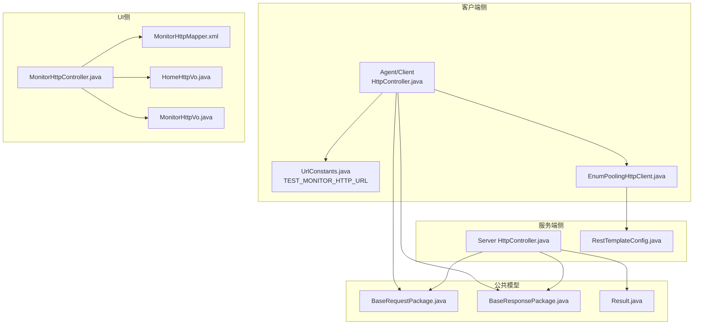
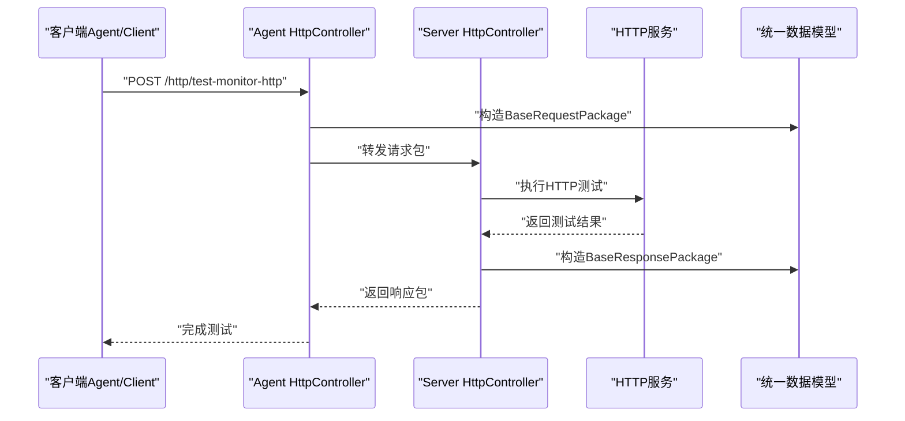
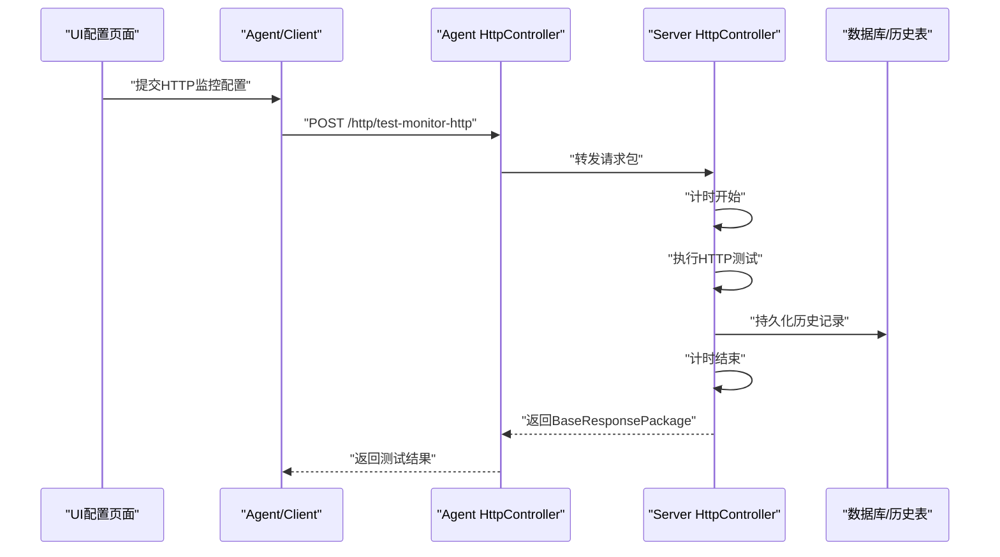
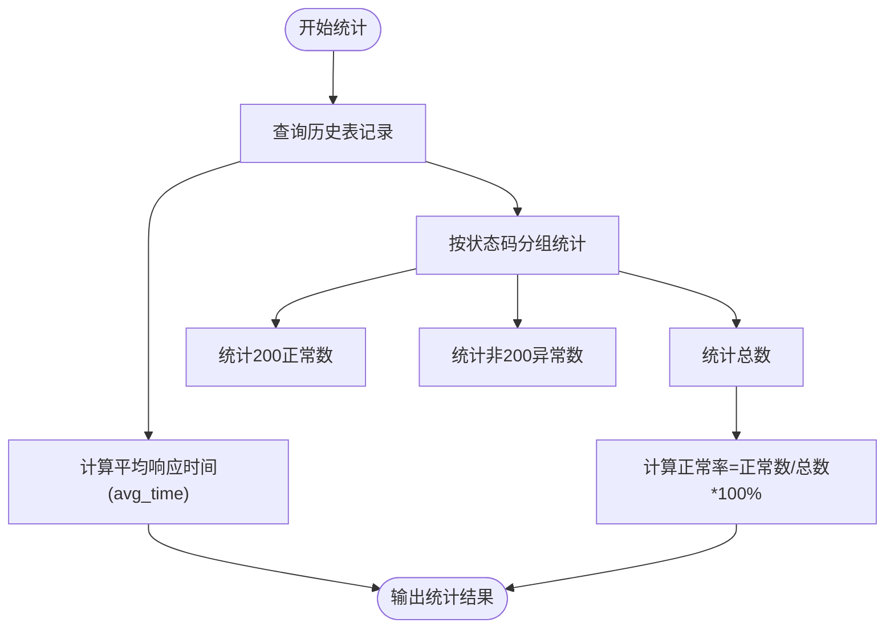
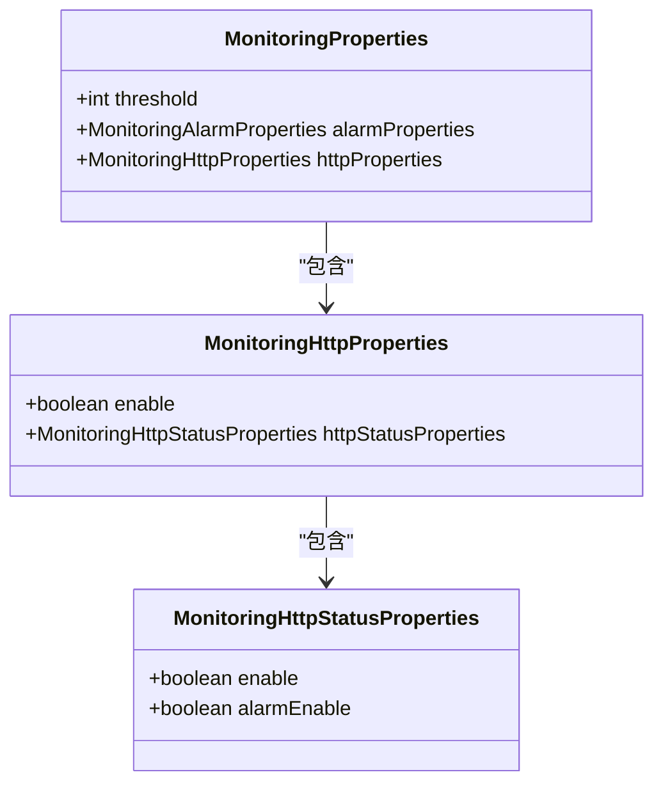
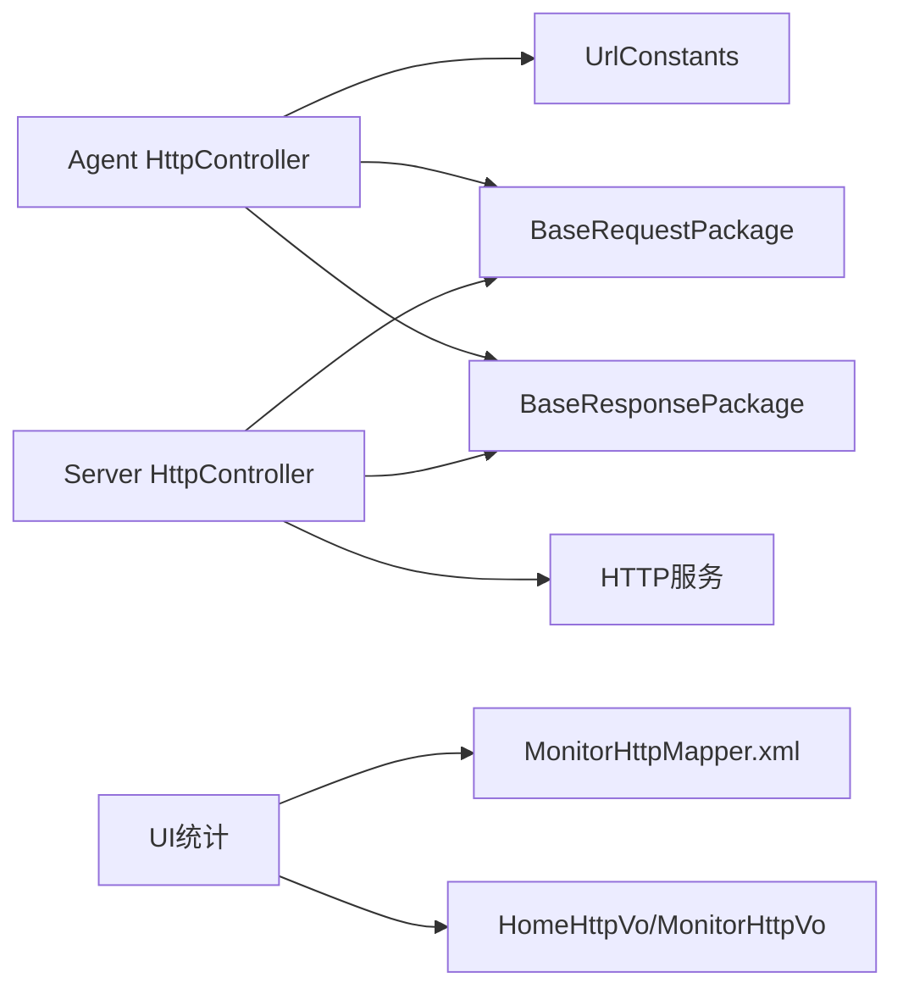

# HTTP监控接口

<cite>
**本文档引用的文件**
- [HttpController.java](file://phoenix-agent/src/main/java/com/gitee/pifeng/monitoring/agent/business/client/controller/HttpController.java)
- [HttpController.java](file://phoenix-server/src/main/java/com/gitee/pifeng/monitoring/server/business/server/controller/HttpController.java)
- [UrlConstants.java](file://phoenix-agent/src/main/java/com/gitee/pifeng/monitoring/agent/constant/UrlConstants.java)
- [UrlConstants.java](file://phoenix-client/phoenix-client-core/src/main/java/com/gitee/pifeng/monitoring/plug/constant/UrlConstants.java)
- [BaseRequestPackage.java](file://phoenix-common/phoenix-common-core/src/main/java/com/gitee/pifeng/monitoring/common/dto/BaseRequestPackage.java)
- [BaseResponsePackage.java](file://phoenix-common/phoenix-common-core/src/main/java/com/gitee/pifeng/monitoring/common/dto/BaseResponsePackage.java)
- [Result.java](file://phoenix-common/phoenix-common-core/src/main/java/com/gitee/pifeng/monitoring/common/domain/Result.java)
- [RestTemplateConfig.java](file://phoenix-agent/src/main/java/com/gitee/pifeng/monitoring/agent/config/RestTemplateConfig.java)
- [RestTemplateConfig.java](file://phoenix-server/src/main/java/com/gitee/pifeng/monitoring/server/config/RestTemplateConfig.java)
- [EnumPoolingHttpClient.java](file://phoenix-client/phoenix-client-core/src/main/java/com/gitee/pifeng/monitoring/plug/core/EnumPoolingHttpClient.java)
- [MonitoringProperties.java](file://phoenix-common/phoenix-common-core/src/main/java/com/gitee/pifeng/monitoring/common/property/server/MonitoringProperties.java)
- [MonitoringHttpProperties.java](file://phoenix-common/phoenix-common-core/src/main/java/com/gitee/pifeng/monitoring/common/property/server/MonitoringHttpProperties.java)
- [MonitoringHttpStatusProperties.java](file://phoenix-common/phoenix-common-core/src/main/java/com/gitee/pifeng/monitoring/common/property/server/MonitoringHttpStatusProperties.java)
- [MonitoringConfigPropertiesLoader.java](file://phoenix-server/src/main/java/com/gitee/pifeng/monitoring/server/business/server/core/MonitoringConfigPropertiesLoader.java)
- [phoenix.sql](file://doc/数据库设计/sql/mysql/phoenix.sql)
- [MonitorHttpMapper.xml](file://phoenix-ui/src/main/java/com/gitee/pifeng/monitoring/ui/business/web/mapper/MonitorHttpMapper.xml)
- [HomeHttpVo.java](file://phoenix-ui/src/main/java/com/gitee/pifeng/monitoring/ui/business/web/vo/HomeHttpVo.java)
- [MonitorHttpVo.java](file://phoenix-ui/src/main/java/com/gitee/pifeng/monitoring/ui/business/web/vo/MonitorHttpVo.java)
- [MonitorHttpController.java](file://phoenix-ui/src/main/java/com/gitee/pifeng/monitoring/ui/business/web/controller/MonitorHttpController.java)
</cite>

## 目录
1. [简介](#简介)
2. [项目结构](#项目结构)
3. [核心组件](#核心组件)
4. [架构总览](#架构总览)
5. [详细组件分析](#详细组件分析)
6. [依赖分析](#依赖分析)
7. [性能考虑](#性能考虑)
8. [故障排查指南](#故障排查指南)
9. [结论](#结论)
10. [附录](#附录)

## 简介
本文件聚焦于HTTP监控接口“/http/test-monitor-http”的功能与实现，系统性说明HTTP监控的指标采集（请求次数、响应时间、状态码分布、错误率、吞吐量等）、数据结构定义（请求URL、HTTP方法、响应状态码、响应时间、请求头与响应头等）、采样策略与阈值配置、告警触发机制，以及对常见HTTP客户端库（Apache HttpClient、OkHttp、Spring WebClient）的集成方式与最佳实践。同时提供监控数据示例与性能优化建议。

## 项目结构
HTTP监控涉及三层协作：
- 客户端侧（Agent/Client）：负责构造HTTP监控请求包，调用服务端测试接口，接收并处理响应。
- 服务端侧（Server）：接收客户端请求，执行HTTP连通性测试，返回统一响应包。
- UI侧（UI）：提供HTTP监控配置、统计展示与详情页面。

图表来源
- [HttpController.java:55-58](file://phoenix-agent/src/main/java/com/gitee/pifeng/monitoring/agent/business/client/controller/HttpController.java#L55-L58)
- [UrlConstants.java:74-74](file://phoenix-agent/src/main/java/com/gitee/pifeng/monitoring/agent/constant/UrlConstants.java#L74-L74)
- [EnumPoolingHttpClient.java:233-240](file://phoenix-client/phoenix-client-core/src/main/java/com/gitee/pifeng/monitoring/plug/core/EnumPoolingHttpClient.java#L233-L240)
- [HttpController.java:62-68](file://phoenix-server/src/main/java/com/gitee/pifeng/monitoring/server/business/server/controller/HttpController.java#L62-L68)
- [RestTemplateConfig.java:54-73](file://phoenix-server/src/main/java/com/gitee/pifeng/monitoring/server/config/RestTemplateConfig.java#L54-L73)
- [BaseRequestPackage.java:24-41](file://phoenix-common/phoenix-common-core/src/main/java/com/gitee/pifeng/monitoring/common/dto/BaseRequestPackage.java#L24-L41)
- [BaseResponsePackage.java:24-41](file://phoenix-common/phoenix-common-core/src/main/java/com/gitee/pifeng/monitoring/common/dto/BaseResponsePackage.java#L24-L41)
- [Result.java:22-34](file://phoenix-common/phoenix-common-core/src/main/java/com/gitee/pifeng/monitoring/common/domain/Result.java#L22-L34)
- [MonitorHttpMapper.xml:6-18](file://phoenix-ui/src/main/java/com/gitee/pifeng/monitoring/ui/business/web/mapper/MonitorHttpMapper.xml#L6-L18)
- [HomeHttpVo.java:25-42](file://phoenix-ui/src/main/java/com/gitee/pifeng/monitoring/ui/business/web/vo/HomeHttpVo.java#L25-L42)
- [MonitorHttpVo.java:107-130](file://phoenix-ui/src/main/java/com/gitee/pifeng/monitoring/ui/business/web/vo/MonitorHttpVo.java#L107-L130)

章节来源
- [HttpController.java:1-61](file://phoenix-agent/src/main/java/com/gitee/pifeng/monitoring/agent/business/client/controller/HttpController.java#L1-L61)
- [HttpController.java:1-68](file://phoenix-server/src/main/java/com/gitee/pifeng/monitoring/server/business/server/controller/HttpController.java#L1-L68)
- [UrlConstants.java:1-127](file://phoenix-agent/src/main/java/com/gitee/pifeng/monitoring/agent/constant/UrlConstants.java#L1-L127)
- [UrlConstants.java:1-57](file://phoenix-client/phoenix-client-core/src/main/java/com/gitee/pifeng/monitoring/plug/constant/UrlConstants.java#L1-L57)
- [BaseRequestPackage.java:1-42](file://phoenix-common/phoenix-common-core/src/main/java/com/gitee/pifeng/monitoring/common/dto/BaseRequestPackage.java#L1-L42)
- [BaseResponsePackage.java:1-42](file://phoenix-common/phoenix-common-core/src/main/java/com/gitee/pifeng/monitoring/common/dto/BaseResponsePackage.java#L1-L42)
- [Result.java:1-35](file://phoenix-common/phoenix-common-core/src/main/java/com/gitee/pifeng/monitoring/common/domain/Result.java#L1-L35)
- [RestTemplateConfig.java:25-98](file://phoenix-agent/src/main/java/com/gitee/pifeng/monitoring/agent/config/RestTemplateConfig.java#L25-L98)
- [RestTemplateConfig.java:25-97](file://phoenix-server/src/main/java/com/gitee/pifeng/monitoring/server/config/RestTemplateConfig.java#L25-L97)
- [EnumPoolingHttpClient.java:30-240](file://phoenix-client/phoenix-client-core/src/main/java/com/gitee/pifeng/monitoring/plug/core/EnumPoolingHttpClient.java#L30-L240)
- [MonitorHttpMapper.xml:1-20](file://phoenix-ui/src/main/java/com/gitee/pifeng/monitoring/ui/business/web/mapper/MonitorHttpMapper.xml#L1-L20)
- [HomeHttpVo.java:1-42](file://phoenix-ui/src/main/java/com/gitee/pifeng/monitoring/ui/business/web/vo/HomeHttpVo.java#L1-L42)
- [MonitorHttpVo.java:86-130](file://phoenix-ui/src/main/java/com/gitee/pifeng/monitoring/ui/business/web/vo/MonitorHttpVo.java#L86-L130)

## 核心组件
- 客户端HTTP控制器：封装“测试HTTP连通性”请求，将通用请求包转发至服务端。
- 服务端HTTP控制器：接收请求包，执行HTTP测试，返回统一响应包。
- 统一数据模型：BaseRequestPackage/BaseResponsePackage/Result，保证跨模块数据一致性。
- HTTP客户端配置：RestTemplate与Apache HttpClient连接池配置，确保高并发下的稳定性。
- 监控配置属性：HTTP监控开关、告警开关、阈值等，集中管理监控策略。
- UI统计与详情：提供HTTP监控统计视图与单条记录详情。

章节来源
- [HttpController.java:55-58](file://phoenix-agent/src/main/java/com/gitee/pifeng/monitoring/agent/business/client/controller/HttpController.java#L55-L58)
- [HttpController.java:62-68](file://phoenix-server/src/main/java/com/gitee/pifeng/monitoring/server/business/server/controller/HttpController.java#L62-L68)
- [BaseRequestPackage.java:24-41](file://phoenix-common/phoenix-common-core/src/main/java/com/gitee/pifeng/monitoring/common/dto/BaseRequestPackage.java#L24-L41)
- [BaseResponsePackage.java:24-41](file://phoenix-common/phoenix-common-core/src/main/java/com/gitee/pifeng/monitoring/common/dto/BaseResponsePackage.java#L24-L41)
- [Result.java:22-34](file://phoenix-common/phoenix-common-core/src/main/java/com/gitee/pifeng/monitoring/common/domain/Result.java#L22-L34)
- [RestTemplateConfig.java:54-73](file://phoenix-server/src/main/java/com/gitee/pifeng/monitoring/server/config/RestTemplateConfig.java#L54-L73)
- [MonitoringHttpProperties.java:18-30](file://phoenix-common/phoenix-common-core/src/main/java/com/gitee/pifeng/monitoring/common/property/server/MonitoringHttpProperties.java#L18-L30)
- [MonitoringHttpStatusProperties.java:18-30](file://phoenix-common/phoenix-common-core/src/main/java/com/gitee/pifeng/monitoring/common/property/server/MonitoringHttpStatusProperties.java#L18-L30)
- [MonitoringProperties.java:19-61](file://phoenix-common/phoenix-common-core/src/main/java/com/gitee/pifeng/monitoring/common/property/server/MonitoringProperties.java#L19-L61)

## 架构总览
HTTP监控从客户端发起测试请求，经由统一请求包封装，到达服务端后通过RestTemplate或Apache HttpClient执行HTTP测试，最终返回统一响应包。UI侧提供统计与详情展示。

图表来源
- [HttpController.java:55-58](file://phoenix-agent/src/main/java/com/gitee/pifeng/monitoring/agent/business/client/controller/HttpController.java#L55-L58)
- [HttpController.java:62-68](file://phoenix-server/src/main/java/com/gitee/pifeng/monitoring/server/business/server/controller/HttpController.java#L62-L68)
- [BaseRequestPackage.java:24-41](file://phoenix-common/phoenix-common-core/src/main/java/com/gitee/pifeng/monitoring/common/dto/BaseRequestPackage.java#L24-L41)
- [BaseResponsePackage.java:24-41](file://phoenix-common/phoenix-common-core/src/main/java/com/gitee/pifeng/monitoring/common/dto/BaseResponsePackage.java#L24-L41)

## 详细组件分析

### 接口定义与调用流程
- 客户端控制器提供“测试HTTP连通性”端点，使用统一请求包作为载体，将目标URL、方法、头、体等参数传递给服务端。
- 服务端控制器接收请求包，计时并执行HTTP测试，返回包含结果与时间戳的统一响应包。
- URL常量集中定义了服务端根地址与具体端点，便于客户端动态拼接。

图表来源
- [MonitorHttpController.java:380-410](file://phoenix-ui/src/main/java/com/gitee/pifeng/monitoring/ui/business/web/controller/MonitorHttpController.java#L380-L410)
- [HttpController.java:55-58](file://phoenix-agent/src/main/java/com/gitee/pifeng/monitoring/agent/business/client/controller/HttpController.java#L55-L58)
- [HttpController.java:62-68](file://phoenix-server/src/main/java/com/gitee/pifeng/monitoring/server/business/server/controller/HttpController.java#L62-L68)
- [UrlConstants.java:74-74](file://phoenix-agent/src/main/java/com/gitee/pifeng/monitoring/agent/constant/UrlConstants.java#L74-L74)

章节来源
- [HttpController.java:55-58](file://phoenix-agent/src/main/java/com/gitee/pifeng/monitoring/agent/business/client/controller/HttpController.java#L55-L58)
- [HttpController.java:62-68](file://phoenix-server/src/main/java/com/gitee/pifeng/monitoring/server/business/server/controller/HttpController.java#L62-L68)
- [UrlConstants.java:74-74](file://phoenix-agent/src/main/java/com/gitee/pifeng/monitoring/agent/constant/UrlConstants.java#L74-L74)

### 数据结构与字段说明
- 统一请求包（BaseRequestPackage）
  - 字段：id、dateTime、extraMsg（JSON对象，承载HTTP监控参数）
  - extraMsg典型字段：url、method、contentType、headerParameter、bodyParameter、desc
- 统一响应包（BaseResponsePackage）
  - 字段：id、dateTime、result（包含isSuccess、msg）
- 结果对象（Result）
  - 字段：isSuccess、msg

章节来源
- [BaseRequestPackage.java:24-41](file://phoenix-common/phoenix-common-core/src/main/java/com/gitee/pifeng/monitoring/common/dto/BaseRequestPackage.java#L24-L41)
- [BaseResponsePackage.java:24-41](file://phoenix-common/phoenix-common-core/src/main/java/com/gitee/pifeng/monitoring/common/dto/BaseResponsePackage.java#L24-L41)
- [Result.java:22-34](file://phoenix-common/phoenix-common-core/src/main/java/com/gitee/pifeng/monitoring/common/domain/Result.java#L22-L34)

### 指标采集与统计
- 请求次数：基于历史表记录数统计
- 平均响应时间：avg_time（毫秒）
- 状态码分布：status字段（200表示正常，非200表示异常）
- 错误率：异常次数占比
- 吞吐量：单位时间内请求次数（可结合时间窗口计算）

图表来源
- [MonitorHttpMapper.xml:6-18](file://phoenix-ui/src/main/java/com/gitee/pifeng/monitoring/ui/business/web/mapper/MonitorHttpMapper.xml#L6-L18)
- [HomeHttpVo.java:25-42](file://phoenix-ui/src/main/java/com/gitee/pifeng/monitoring/ui/business/web/vo/HomeHttpVo.java#L25-L42)

章节来源
- [MonitorHttpMapper.xml:6-18](file://phoenix-ui/src/main/java/com/gitee/pifeng/monitoring/ui/business/web/mapper/MonitorHttpMapper.xml#L6-L18)
- [HomeHttpVo.java:25-42](file://phoenix-ui/src/main/java/com/gitee/pifeng/monitoring/ui/business/web/vo/HomeHttpVo.java#L25-L42)

### 采样策略、阈值与告警
- 采样策略：按配置周期性发起HTTP测试（由客户端定时任务驱动），服务端按需执行HTTP请求。
- 阈值设置：threshold（全局阈值）、HTTP状态监控开关与告警开关（enable/alarmEnable）。
- 告警触发：当状态异常或响应时间超过阈值时，结合告警配置进行通知。

图表来源
- [MonitoringProperties.java:19-61](file://phoenix-common/phoenix-common-core/src/main/java/com/gitee/pifeng/monitoring/common/property/server/MonitoringProperties.java#L19-L61)
- [MonitoringHttpProperties.java:18-30](file://phoenix-common/phoenix-common-core/src/main/java/com/gitee/pifeng/monitoring/common/property/server/MonitoringHttpProperties.java#L18-L30)
- [MonitoringHttpStatusProperties.java:18-30](file://phoenix-common/phoenix-common-core/src/main/java/com/gitee/pifeng/monitoring/common/property/server/MonitoringHttpStatusProperties.java#L18-L30)
- [MonitoringConfigPropertiesLoader.java:148-151](file://phoenix-server/src/main/java/com/gitee/pifeng/monitoring/server/business/server/core/MonitoringConfigPropertiesLoader.java#L148-L151)

章节来源
- [MonitoringProperties.java:19-61](file://phoenix-common/phoenix-common-core/src/main/java/com/gitee/pifeng/monitoring/common/property/server/MonitoringProperties.java#L19-L61)
- [MonitoringHttpProperties.java:18-30](file://phoenix-common/phoenix-common-core/src/main/java/com/gitee/pifeng/monitoring/common/property/server/MonitoringHttpProperties.java#L18-L30)
- [MonitoringHttpStatusProperties.java:18-30](file://phoenix-common/phoenix-common-core/src/main/java/com/gitee/pifeng/monitoring/common/property/server/MonitoringHttpStatusProperties.java#L18-L30)
- [MonitoringConfigPropertiesLoader.java:148-151](file://phoenix-server/src/main/java/com/gitee/pifeng/monitoring/server/business/server/core/MonitoringConfigPropertiesLoader.java#L148-L151)

### 数据库模型与字段
- MONITOR_HTTP：存储HTTP监控配置与实时状态
  - 关键字段：URL_TARGET、METHOD、CONTENT_TYPE、HEADER_PARAMETER、BODY_PARAMETER、AVG_TIME、STATUS、IS_ENABLE_MONITOR
- MONITOR_HTTP_HISTORY：存储历史测试记录
  - 关键字段：HTTP_ID、HOSTNAME_SOURCE、URL_TARGET、METHOD、CONTENT_TYPE、HEADER_PARAMETER、BODY_PARAMETER、RESULT_BODY_SIZE、STATUS、INSERT_TIME

章节来源
- [phoenix.sql:204-246](file://doc/数据库设计/sql/mysql/phoenix.sql#L204-L246)

### 客户端库集成方式
- Apache HttpClient（推荐）
  - 使用连接池配置提升并发与稳定性，支持HTTPS、超时与重试策略。
  - 客户端侧已内置连接池封装类，便于直接调用发送HTTP请求。
- OkHttp
  - 通过自定义拦截器注入请求头与参数，保持与统一请求包一致的字段结构。
- Spring WebClient
  - 以函数式方式构建请求，注意设置超时、重试与背压策略，避免阻塞。
- RestTemplate
  - 服务端侧使用RestTemplate与Apache HttpClient连接工厂，适合同步场景。

章节来源
- [EnumPoolingHttpClient.java:124-200](file://phoenix-client/phoenix-client-core/src/main/java/com/gitee/pifeng/monitoring/plug/core/EnumPoolingHttpClient.java#L124-L200)
- [RestTemplateConfig.java:54-73](file://phoenix-server/src/main/java/com/gitee/pifeng/monitoring/server/config/RestTemplateConfig.java#L54-L73)
- [RestTemplateConfig.java:59-64](file://phoenix-agent/src/main/java/com/gitee/pifeng/monitoring/agent/config/RestTemplateConfig.java#L59-L64)

### 实际监控数据示例
- 请求参数（extraMsg示例字段）
  - url: "https://example.com/api/test"
  - method: "GET"
  - contentType: "application/json"
  - headerParameter: "{...}"
  - bodyParameter: "{...}"
  - desc: "业务接口健康检查"
- 响应结果
  - isSuccess: true/false
  - msg: "测试成功/失败原因"
  - avg_time: 120（毫秒）
  - status: 200/500

章节来源
- [BaseRequestPackage.java:24-41](file://phoenix-common/phoenix-common-core/src/main/java/com/gitee/pifeng/monitoring/common/dto/BaseRequestPackage.java#L24-L41)
- [BaseResponsePackage.java:24-41](file://phoenix-common/phoenix-common-core/src/main/java/com/gitee/pifeng/monitoring/common/dto/BaseResponsePackage.java#L24-L41)
- [Result.java:22-34](file://phoenix-common/phoenix-common-core/src/main/java/com/gitee/pifeng/monitoring/common/domain/Result.java#L22-L34)
- [MonitorHttpVo.java:107-130](file://phoenix-ui/src/main/java/com/gitee/pifeng/monitoring/ui/business/web/vo/MonitorHttpVo.java#L107-L130)

## 依赖分析
- 客户端到服务端：通过统一请求包与URL常量解耦，便于扩展与替换。
- 服务端到HTTP：通过RestTemplate与Apache HttpClient连接池实现高并发与可靠性。
- UI到数据：通过MyBatis映射统计SQL，聚合HTTP监控历史数据。

图表来源
- [HttpController.java:55-58](file://phoenix-agent/src/main/java/com/gitee/pifeng/monitoring/agent/business/client/controller/HttpController.java#L55-L58)
- [UrlConstants.java:74-74](file://phoenix-agent/src/main/java/com/gitee/pifeng/monitoring/agent/constant/UrlConstants.java#L74-L74)
- [HttpController.java:62-68](file://phoenix-server/src/main/java/com/gitee/pifeng/monitoring/server/business/server/controller/HttpController.java#L62-L68)
- [MonitorHttpMapper.xml:6-18](file://phoenix-ui/src/main/java/com/gitee/pifeng/monitoring/ui/business/web/mapper/MonitorHttpMapper.xml#L6-L18)
- [HomeHttpVo.java:25-42](file://phoenix-ui/src/main/java/com/gitee/pifeng/monitoring/ui/business/web/vo/HomeHttpVo.java#L25-L42)
- [MonitorHttpVo.java:107-130](file://phoenix-ui/src/main/java/com/gitee/pifeng/monitoring/ui/business/web/vo/MonitorHttpVo.java#L107-L130)

章节来源
- [HttpController.java:55-58](file://phoenix-agent/src/main/java/com/gitee/pifeng/monitoring/agent/business/client/controller/HttpController.java#L55-L58)
- [HttpController.java:62-68](file://phoenix-server/src/main/java/com/gitee/pifeng/monitoring/server/business/server/controller/HttpController.java#L62-L68)
- [UrlConstants.java:74-74](file://phoenix-agent/src/main/java/com/gitee/pifeng/monitoring/agent/constant/UrlConstants.java#L74-L74)
- [MonitorHttpMapper.xml:6-18](file://phoenix-ui/src/main/java/com/gitee/pifeng/monitoring/ui/business/web/mapper/MonitorHttpMapper.xml#L6-L18)
- [HomeHttpVo.java:25-42](file://phoenix-ui/src/main/java/com/gitee/pifeng/monitoring/ui/business/web/vo/HomeHttpVo.java#L25-L42)
- [MonitorHttpVo.java:107-130](file://phoenix-ui/src/main/java/com/gitee/pifeng/monitoring/ui/business/web/vo/MonitorHttpVo.java#L107-L130)

## 性能考虑
- 连接池与超时：合理设置连接超时、读取超时与连接池大小，避免资源耗尽。
- 异步与限流：在高并发场景下引入异步执行与令牌桶限流，平滑突发流量。
- 压测与容量规划：定期进行压测，评估最大并发与延迟容忍度。
- 缓存与降级：对热点接口进行缓存，异常时快速降级返回兜底数据。

## 故障排查指南
- 常见问题
  - 无法连接：检查URL、代理与防火墙；确认服务端端点可达。
  - 超时：调整连接与读取超时配置；优化服务端处理逻辑。
  - 响应异常：核对请求头与请求体格式；检查服务端日志。
- 日志与追踪
  - 开启服务端与客户端日志，定位请求包与响应包流转过程。
  - 在UI侧查看历史记录与统计，辅助定位异常时段与频率。

章节来源
- [RestTemplateConfig.java:54-73](file://phoenix-server/src/main/java/com/gitee/pifeng/monitoring/server/config/RestTemplateConfig.java#L54-L73)
- [RestTemplateConfig.java:59-64](file://phoenix-agent/src/main/java/com/gitee/pifeng/monitoring/agent/config/RestTemplateConfig.java#L59-L64)

## 结论
HTTP监控接口通过统一请求包与响应包实现跨模块一致性，结合RestTemplate与Apache HttpClient连接池保障高并发稳定性。配合阈值与告警配置，可有效识别异常并及时处置。UI侧提供统计与详情，便于运维与开发团队持续优化系统健康度。

## 附录
- API定义（仅说明字段与含义）
  - 请求端点：POST /http/test-monitor-http
  - 请求体：BaseRequestPackage（包含id、dateTime、extraMsg）
  - extraMsg包含：url、method、contentType、headerParameter、bodyParameter、desc
  - 响应体：BaseResponsePackage（包含id、dateTime、result.isSuccess、result.msg）

章节来源
- [HttpController.java:55-58](file://phoenix-agent/src/main/java/com/gitee/pifeng/monitoring/agent/business/client/controller/HttpController.java#L55-L58)
- [HttpController.java:62-68](file://phoenix-server/src/main/java/com/gitee/pifeng/monitoring/server/business/server/controller/HttpController.java#L62-L68)
- [BaseRequestPackage.java:24-41](file://phoenix-common/phoenix-common-core/src/main/java/com/gitee/pifeng/monitoring/common/dto/BaseRequestPackage.java#L24-L41)
- [BaseResponsePackage.java:24-41](file://phoenix-common/phoenix-common-core/src/main/java/com/gitee/pifeng/monitoring/common/dto/BaseResponsePackage.java#L24-L41)
- [Result.java:22-34](file://phoenix-common/phoenix-common-core/src/main/java/com/gitee/pifeng/monitoring/common/domain/Result.java#L22-L34)