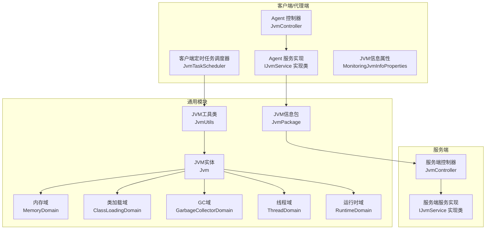
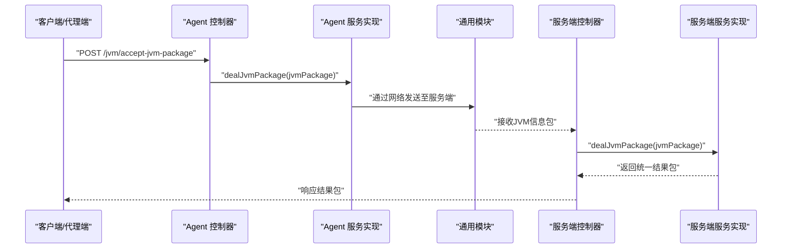
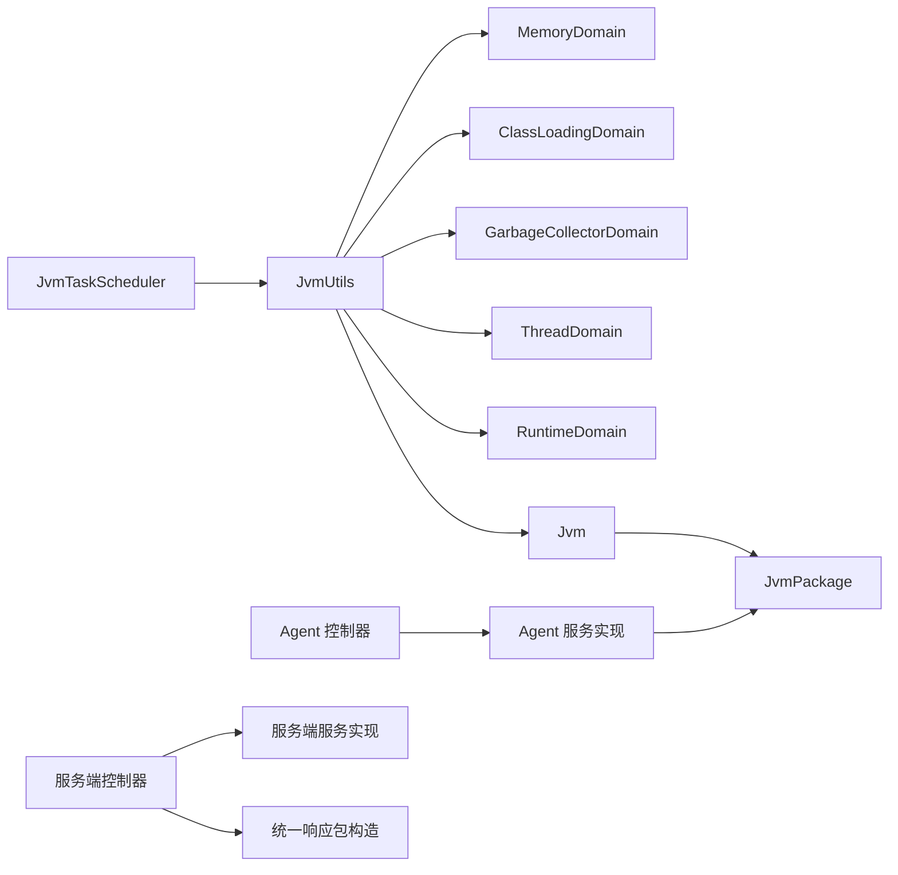
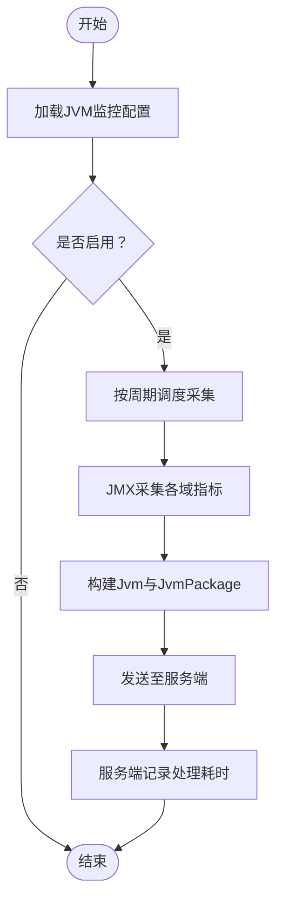

# JVM监控接口

<cite>
**本文引用的文件**
- [phoenix-agent/src/main/java/com/gitee/pifeng/monitoring/agent/business/client/controller/JvmController.java](file://phoenix-agent/src/main/java/com/gitee/pifeng/monitoring/agent/business/client/controller/JvmController.java)
- [phoenix-server/src/main/java/com/gitee/pifeng/monitoring/server/business/server/controller/JvmController.java](file://phoenix-server/src/main/java/com/gitee/pifeng/monitoring/server/business/server/controller/JvmController.java)
- [phoenix-common/src/main/java/com/gitee/pifeng/monitoring/common/dto/JvmPackage.java](file://phoenix-common/src/main/java/com/gitee/pifeng/monitoring/common/dto/JvmPackage.java)
- [phoenix-common/src/main/java/com/gitee/pifeng/monitoring/common/domain/Jvm.java](file://phoenix-common/src/main/java/com/gitee/pifeng/monitoring/common/domain/Jvm.java)
- [phoenix-common/src/main/java/com/gitee/pifeng/monitoring/common/domain/jvm/MemoryDomain.java](file://phoenix-common/src/main/java/com/gitee/pifeng/monitoring/common/domain/jvm/MemoryDomain.java)
- [phoenix-common/src/main/java/com/gitee/pifeng/monitoring/common/domain/jvm/ClassLoadingDomain.java](file://phoenix-common/src/main/java/com/gitee/pifeng/monitoring/common/domain/jvm/ClassLoadingDomain.java)
- [phoenix-common/src/main/java/com/gitee/pifeng/monitoring/common/domain/jvm/GarbageCollectorDomain.java](file://phoenix-common/src/main/java/com/gitee/pifeng/monitoring/common/domain/jvm/GarbageCollectorDomain.java)
- [phoenix-common/src/main/java/com/gitee/pifeng/monitoring/common/domain/jvm/ThreadDomain.java](file://phoenix-common/src/main/java/com/gitee/pifeng/monitoring/common/domain/jvm/ThreadDomain.java)
- [phoenix-common/src/main/java/com/gitee/pifeng/monitoring/common/domain/jvm/RuntimeDomain.java](file://phoenix-common/src/main/java/com/gitee/pifeng/monitoring/common/domain/jvm/RuntimeDomain.java)
- [phoenix-common/src/main/java/com/gitee/pifeng/monitoring/common/util/jvm/JvmUtils.java](file://phoenix-common/src/main/java/com/gitee/pifeng/monitoring/common/util/jvm/JvmUtils.java)
- [phoenix-client/src/main/java/com/gitee/pifeng/monitoring/plug/scheduler/JvmTaskScheduler.java](file://phoenix-client/src/main/java/com/gitee/pifeng/monitoring/plug/scheduler/JvmTaskScheduler.java)
- [phoenix-common/src/main/java/com/gitee/pifeng/monitoring/common/property/client/MonitoringJvmInfoProperties.java](file://phoenix-common/src/main/java/com/gitee/pifeng/monitoring/common/property/client/MonitoringJvmInfoProperties.java)
</cite>

## 目录
1. [简介](#简介)
2. [项目结构](#项目结构)
3. [核心组件](#核心组件)
4. [架构概览](#架构概览)
5. [详细组件分析](#详细组件分析)
6. [依赖分析](#依赖分析)
7. [性能考量](#性能考量)
8. [故障排查指南](#故障排查指南)
9. [结论](#结论)
10. [附录](#附录)

## 简介
本文件面向JVM监控接口的使用者与维护者，系统性阐述“获取JVM监控信息”接口（/jvm/accept-jvm-package）的功能、数据模型、采样与聚合策略、性能开销控制、兼容性说明以及异常处理建议。该接口用于接收来自监控客户端或代理端的JVM信息包，服务端进行处理并返回统一的结果包。

## 项目结构
JVM监控能力横跨三部分：
- 客户端/代理端：负责采集JVM指标并定时发送
- 通用模块：定义JVM数据模型与采集工具
- 服务端：接收JVM信息包并进行处理与持久化

图表来源
- [phoenix-agent/src/main/java/com/gitee/pifeng/monitoring/agent/business/client/controller/JvmController.java:1-55](file://phoenix-agent/src/main/java/com/gitee/pifeng/monitoring/agent/business/client/controller/JvmController.java#L1-L55)
- [phoenix-server/src/main/java/com/gitee/pifeng/monitoring/server/business/server/controller/JvmController.java:1-77](file://phoenix-server/src/main/java/com/gitee/pifeng/monitoring/server/business/server/controller/JvmController.java#L1-L77)
- [phoenix-common/src/main/java/com/gitee/pifeng/monitoring/common/dto/JvmPackage.java:1-34](file://phoenix-common/src/main/java/com/gitee/pifeng/monitoring/common/dto/JvmPackage.java#L1-L34)
- [phoenix-common/src/main/java/com/gitee/pifeng/monitoring/common/domain/Jvm.java:1-51](file://phoenix-common/src/main/java/com/gitee/pifeng/monitoring/common/domain/Jvm.java#L1-L51)
- [phoenix-common/src/main/java/com/gitee/pifeng/monitoring/common/util/jvm/JvmUtils.java:1-235](file://phoenix-common/src/main/java/com/gitee/pifeng/monitoring/common/util/jvm/JvmUtils.java#L1-L235)
- [phoenix-client/src/main/java/com/gitee/pifeng/monitoring/plug/scheduler/JvmTaskScheduler.java:1-51](file://phoenix-client/src/main/java/com/gitee/pifeng/monitoring/plug/scheduler/JvmTaskScheduler.java#L1-L51)

章节来源
- [phoenix-agent/src/main/java/com/gitee/pifeng/monitoring/agent/business/client/controller/JvmController.java:1-55](file://phoenix-agent/src/main/java/com/gitee/pifeng/monitoring/agent/business/client/controller/JvmController.java#L1-L55)
- [phoenix-server/src/main/java/com/gitee/pifeng/monitoring/server/business/server/controller/JvmController.java:1-77](file://phoenix-server/src/main/java/com/gitee/pifeng/monitoring/server/business/server/controller/JvmController.java#L1-L77)
- [phoenix-common/src/main/java/com/gitee/pifeng/monitoring/common/dto/JvmPackage.java:1-34](file://phoenix-common/src/main/java/com/gitee/pifeng/monitoring/common/dto/JvmPackage.java#L1-L34)
- [phoenix-common/src/main/java/com/gitee/pifeng/monitoring/common/domain/Jvm.java:1-51](file://phoenix-common/src/main/java/com/gitee/pifeng/monitoring/common/domain/Jvm.java#L1-L51)
- [phoenix-common/src/main/java/com/gitee/pifeng/monitoring/common/util/jvm/JvmUtils.java:1-235](file://phoenix-common/src/main/java/com/gitee/pifeng/monitoring/common/util/jvm/JvmUtils.java#L1-L235)
- [phoenix-client/src/main/java/com/gitee/pifeng/monitoring/plug/scheduler/JvmTaskScheduler.java:1-51](file://phoenix-client/src/main/java/com/gitee/pifeng/monitoring/plug/scheduler/JvmTaskScheduler.java#L1-L51)

## 核心组件
- 接口入口
  - 客户端/代理端控制器：接收JVM信息包并调用服务层处理
  - 服务端控制器：接收JVM信息包，记录耗时并返回统一结果包
- 数据模型
  - JvmPackage：承载Jvm对象与采样频率
  - Jvm：聚合各域信息（类加载、GC、内存、运行时、线程）
  - 各域子模型：MemoryDomain、ClassLoadingDomain、GarbageCollectorDomain、ThreadDomain、RuntimeDomain
- 采集与调度
  - JvmUtils：基于JMX采集各域指标
  - JvmTaskScheduler：按配置周期调度采集与发送
  - MonitoringJvmInfoProperties：客户端JVM监控开关与采样频率

章节来源
- [phoenix-agent/src/main/java/com/gitee/pifeng/monitoring/agent/business/client/controller/JvmController.java:1-55](file://phoenix-agent/src/main/java/com/gitee/pifeng/monitoring/agent/business/client/controller/JvmController.java#L1-L55)
- [phoenix-server/src/main/java/com/gitee/pifeng/monitoring/server/business/server/controller/JvmController.java:1-77](file://phoenix-server/src/main/java/com/gitee/pifeng/monitoring/server/business/server/controller/JvmController.java#L1-L77)
- [phoenix-common/src/main/java/com/gitee/pifeng/monitoring/common/dto/JvmPackage.java:1-34](file://phoenix-common/src/main/java/com/gitee/pifeng/monitoring/common/dto/JvmPackage.java#L1-L34)
- [phoenix-common/src/main/java/com/gitee/pifeng/monitoring/common/domain/Jvm.java:1-51](file://phoenix-common/src/main/java/com/gitee/pifeng/monitoring/common/domain/Jvm.java#L1-L51)
- [phoenix-common/src/main/java/com/gitee/pifeng/monitoring/common/util/jvm/JvmUtils.java:1-235](file://phoenix-common/src/main/java/com/gitee/pifeng/monitoring/common/util/jvm/JvmUtils.java#L1-L235)
- [phoenix-client/src/main/java/com/gitee/pifeng/monitoring/plug/scheduler/JvmTaskScheduler.java:1-51](file://phoenix-client/src/main/java/com/gitee/pifeng/monitoring/plug/scheduler/JvmTaskScheduler.java#L1-L51)
- [phoenix-common/src/main/java/com/gitee/pifeng/monitoring/common/property/client/MonitoringJvmInfoProperties.java:1-33](file://phoenix-common/src/main/java/com/gitee/pifeng/monitoring/common/property/client/MonitoringJvmInfoProperties.java#L1-L33)

## 架构概览
下图展示从客户端采集到服务端处理的关键流程与组件交互：

图表来源
- [phoenix-agent/src/main/java/com/gitee/pifeng/monitoring/agent/business/client/controller/JvmController.java:1-55](file://phoenix-agent/src/main/java/com/gitee/pifeng/monitoring/agent/business/client/controller/JvmController.java#L1-L55)
- [phoenix-server/src/main/java/com/gitee/pifeng/monitoring/server/business/server/controller/JvmController.java:1-77](file://phoenix-server/src/main/java/com/gitee/pifeng/monitoring/server/business/server/controller/JvmController.java#L1-L77)
- [phoenix-common/src/main/java/com/gitee/pifeng/monitoring/common/dto/JvmPackage.java:1-34](file://phoenix-common/src/main/java/com/gitee/pifeng/monitoring/common/dto/JvmPackage.java#L1-L34)

## 详细组件分析

### 接口定义与请求处理
- 接口路径：/jvm/accept-jvm-package
- 方法：POST
- 请求体：CiphertextPackage（封装后的JVM信息包）
- 响应体：BaseResponsePackage（统一加密响应包）
- 控制器职责：
  - 客户端/代理端控制器：接收请求，调用服务层处理
  - 服务端控制器：接收请求，记录处理耗时，调用服务层，构造统一响应

章节来源
- [phoenix-agent/src/main/java/com/gitee/pifeng/monitoring/agent/business/client/controller/JvmController.java:1-55](file://phoenix-agent/src/main/java/com/gitee/pifeng/monitoring/agent/business/client/controller/JvmController.java#L1-L55)
- [phoenix-server/src/main/java/com/gitee/pifeng/monitoring/server/business/server/controller/JvmController.java:1-77](file://phoenix-server/src/main/java/com/gitee/pifeng/monitoring/server/business/server/controller/JvmController.java#L1-L77)

### 数据模型与字段说明

#### JvmPackage（JVM信息包）
- 字段
  - jvm：Jvm对象
  - rate：采样频率（秒）

章节来源
- [phoenix-common/src/main/java/com/gitee/pifeng/monitoring/common/dto/JvmPackage.java:1-34](file://phoenix-common/src/main/java/com/gitee/pifeng/monitoring/common/dto/JvmPackage.java#L1-L34)

#### Jvm（JVM聚合信息）
- 字段
  - classLoadingDomain：类加载域
  - garbageCollectorDomain：GC域
  - memoryDomain：内存域
  - runtimeDomain：运行时域
  - threadDomain：线程域

章节来源
- [phoenix-common/src/main/java/com/gitee/pifeng/monitoring/common/domain/Jvm.java:1-51](file://phoenix-common/src/main/java/com/gitee/pifeng/monitoring/common/domain/Jvm.java#L1-L51)

#### MemoryDomain（内存域）
- 字段
  - memoryUsageDomainMap：键为内存池/类型名（如 Heap、Non_Heap、各MemoryPool），值为MemoryUsageDomain
- MemoryUsageDomain（内存使用量）
  - init：初始内存量（字节）
  - used：已用内存量（字节）
  - committed：已提交内存量（字节）
  - max：最大内存量（字节；未定义时为特殊标记字符串）

章节来源
- [phoenix-common/src/main/java/com/gitee/pifeng/monitoring/common/domain/jvm/MemoryDomain.java:1-66](file://phoenix-common/src/main/java/com/gitee/pifeng/monitoring/common/domain/jvm/MemoryDomain.java#L1-L66)

#### ClassLoadingDomain（类加载域）
- 字段
  - totalLoadedClassCount：累计加载类总数
  - loadedClassCount：当前加载类数量
  - unloadedClassCount：累计卸载类总数
  - isVerbose：是否启用类加载详细输出

章节来源
- [phoenix-common/src/main/java/com/gitee/pifeng/monitoring/common/domain/jvm/ClassLoadingDomain.java:1-44](file://phoenix-common/src/main/java/com/gitee/pifeng/monitoring/common/domain/jvm/ClassLoadingDomain.java#L1-L44)

#### GarbageCollectorDomain（GC域）
- 字段
  - garbageCollectorInfoDomains：GC详情列表
- GarbageCollectorInfoDomain（单个GC收集器详情）
  - name：内存管理器名称
  - collectionCount：GC总次数（未定义时为特殊标记字符串）
  - collectionTime：GC总耗时（毫秒；未定义时为特殊标记字符串）

章节来源
- [phoenix-common/src/main/java/com/gitee/pifeng/monitoring/common/domain/jvm/GarbageCollectorDomain.java:1-67](file://phoenix-common/src/main/java/com/gitee/pifeng/monitoring/common/domain/jvm/GarbageCollectorDomain.java#L1-L67)

#### ThreadDomain（线程域）
- 字段
  - threadCount：当前活动线程数
  - peakThreadCount：线程峰值
  - totalStartedThreadCount：累计已启动线程总数
  - daemonThreadCount：当前活动守护线程数
  - threadInfos：按字典序排序的线程信息列表（字符串）

章节来源
- [phoenix-common/src/main/java/com/gitee/pifeng/monitoring/common/domain/jvm/ThreadDomain.java:1-52](file://phoenix-common/src/main/java/com/gitee/pifeng/monitoring/common/domain/jvm/ThreadDomain.java#L1-L52)

#### RuntimeDomain（运行时域）
- 字段
  - name：运行中的JVM名称
  - vmName/vmVendor/vmVersion：JVM实现名称/供应商/版本
  - specName/specVendor/specVersion：JVM规范名称/供应商/版本
  - managementSpecVersion：管理规范版本
  - classPath/libraryPath：类路径/库路径
  - isBootClassPathSupported/bootClassPath：是否支持引导类路径/引导类路径
  - inputArguments：JVM入参列表
  - uptime：运行时长（格式化字符串）
  - startTime：JVM启动时间

章节来源
- [phoenix-common/src/main/java/com/gitee/pifeng/monitoring/common/domain/jvm/RuntimeDomain.java:1-103](file://phoenix-common/src/main/java/com/gitee/pifeng/monitoring/common/domain/jvm/RuntimeDomain.java#L1-L103)

### 采集与调度策略
- 采集来源：基于JMX的ManagementFactory接口族
  - 运行时：RuntimeMXBean
  - 线程：ThreadMXBean
  - 类加载：ClassLoadingMXBean
  - 内存：MemoryMXBean + MemoryPoolMXBeans
  - GC：GarbageCollectorMXBeans
- 采集实现：JvmUtils
  - getRuntimeInfo、getThreadInfo、getClassLoadingInfo、getMemoryInfo、getGarbageCollectorInfo、getJvmInfo
- 定时调度：JvmTaskScheduler
  - 依据MonitoringJvmInfoProperties配置决定是否启用与采样周期
  - 默认延迟后以固定周期执行采集与发送

章节来源
- [phoenix-common/src/main/java/com/gitee/pifeng/monitoring/common/util/jvm/JvmUtils.java:1-235](file://phoenix-common/src/main/java/com/gitee/pifeng/monitoring/common/util/jvm/JvmUtils.java#L1-L235)
- [phoenix-client/src/main/java/com/gitee/pifeng/monitoring/plug/scheduler/JvmTaskScheduler.java:1-51](file://phoenix-client/src/main/java/com/gitee/pifeng/monitoring/plug/scheduler/JvmTaskScheduler.java#L1-L51)
- [phoenix-common/src/main/java/com/gitee/pifeng/monitoring/common/property/client/MonitoringJvmInfoProperties.java:1-33](file://phoenix-common/src/main/java/com/gitee/pifeng/monitoring/common/property/client/MonitoringJvmInfoProperties.java#L1-L33)

### 采样策略、数据聚合与性能开销
- 采样策略
  - 客户端侧按配置周期采集并发送，避免高频轮询造成JMX开销
  - 服务端对单次处理耗时进行记录，超过阈值（例如1秒）进行告警
- 数据聚合
  - 内存域：聚合堆、非堆及各内存池的使用量，形成Map结构便于多维度查询
  - 线程域：汇总活动线程数、峰值、守护线程数与累计启动数，并提供有序线程信息列表
  - GC域：聚合各收集器的次数与时长，统一格式化输出
- 性能开销控制
  - 使用ManagementFactory一次性获取所需MXBean，减少重复访问
  - 对线程信息进行必要裁剪与排序，避免过大数据量传输
  - 服务端处理耗时监控，及时发现异常

章节来源
- [phoenix-common/src/main/java/com/gitee/pifeng/monitoring/common/util/jvm/JvmUtils.java:1-235](file://phoenix-common/src/main/java/com/gitee/pifeng/monitoring/common/util/jvm/JvmUtils.java#L1-L235)
- [phoenix-server/src/main/java/com/gitee/pifeng/monitoring/server/business/server/controller/JvmController.java:1-77](file://phoenix-server/src/main/java/com/gitee/pifeng/monitoring/server/business/server/controller/JvmController.java#L1-L77)

### 兼容性说明
- 本项目通过标准JMX接口采集JVM指标，适用于遵循JDK规范的JVM实现（如HotSpot、OpenJ9等）。由于JMX是Java标准，不同实现的差异主要体现在具体MXBean行为与可用性上。若特定MXBean不可用，采集逻辑会以“未定义”标记进行兜底，确保接口稳定性。

[本节为概念性说明，不直接分析具体源码文件]

### 实际监控数据示例
以下为典型字段的示例说明（仅描述字段含义与取值范围，不展示真实数据）：
- 内存域
  - Heap：init/used/committed/max（字节）
  - Non_Heap：init/used/committed/max（字节）
  - 各MemoryPool：按池名映射的使用量
- 类加载域
  - totalLoadedClassCount：整型计数
  - loadedClassCount：当前加载数
  - unloadedClassCount：整型计数
  - isVerbose：布尔
- GC域
  - name：字符串标识
  - collectionCount：整型计数或“未定义”
  - collectionTime：毫秒字符串或“未定义”
- 线程域
  - threadCount/peakThreadCount/daemonThreadCount：整型
  - totalStartedThreadCount：整型
  - threadInfos：字符串列表（按字典序）
- 运行时域
  - name/vmName/vmVendor/vmVersion/specName/specVendor/specVersion：字符串
  - managementSpecVersion/classPath/libraryPath/bootClassPath：字符串
  - isBootClassPathSupported：布尔
  - inputArguments：字符串列表
  - uptime：格式化时长字符串
  - startTime：时间戳

[本节为概念性说明，不直接分析具体源码文件]

### 异常情况处理方案
- 采集失败或MXBean不可用
  - 采用“未定义”标记兜底，保证接口可返回稳定结构
- 服务端处理耗时过长
  - 记录耗时并发出告警，提示关注JVM负载或网络状况
- 网络传输异常
  - 统一加密响应包封装，便于上层统一处理错误与重试

章节来源
- [phoenix-common/src/main/java/com/gitee/pifeng/monitoring/common/util/jvm/JvmUtils.java:1-235](file://phoenix-common/src/main/java/com/gitee/pifeng/monitoring/common/util/jvm/JvmUtils.java#L1-L235)
- [phoenix-server/src/main/java/com/gitee/pifeng/monitoring/server/business/server/controller/JvmController.java:1-77](file://phoenix-server/src/main/java/com/gitee/pifeng/monitoring/server/business/server/controller/JvmController.java#L1-L77)

## 依赖分析
JVM监控模块的依赖关系如下：

图表来源
- [phoenix-client/src/main/java/com/gitee/pifeng/monitoring/plug/scheduler/JvmTaskScheduler.java:1-51](file://phoenix-client/src/main/java/com/gitee/pifeng/monitoring/plug/scheduler/JvmTaskScheduler.java#L1-L51)
- [phoenix-common/src/main/java/com/gitee/pifeng/monitoring/common/util/jvm/JvmUtils.java:1-235](file://phoenix-common/src/main/java/com/gitee/pifeng/monitoring/common/util/jvm/JvmUtils.java#L1-L235)
- [phoenix-common/src/main/java/com/gitee/pifeng/monitoring/common/domain/Jvm.java:1-51](file://phoenix-common/src/main/java/com/gitee/pifeng/monitoring/common/domain/Jvm.java#L1-L51)
- [phoenix-common/src/main/java/com/gitee/pifeng/monitoring/common/dto/JvmPackage.java:1-34](file://phoenix-common/src/main/java/com/gitee/pifeng/monitoring/common/dto/JvmPackage.java#L1-L34)
- [phoenix-agent/src/main/java/com/gitee/pifeng/monitoring/agent/business/client/controller/JvmController.java:1-55](file://phoenix-agent/src/main/java/com/gitee/pifeng/monitoring/agent/business/client/controller/JvmController.java#L1-L55)
- [phoenix-server/src/main/java/com/gitee/pifeng/monitoring/server/business/server/controller/JvmController.java:1-77](file://phoenix-server/src/main/java/com/gitee/pifeng/monitoring/server/business/server/controller/JvmController.java#L1-L77)

## 性能考量
- 采集频率：通过MonitoringJvmInfoProperties.rate控制，默认延迟后按固定周期执行，避免频繁JMX访问
- 数据体积：线程信息列表按需排序，内存域聚合多池信息但不展开冗余细节
- 服务端耗时：服务端控制器记录处理耗时并在超限时告警，便于定位瓶颈
- 稳定性：MXBean不可用时以“未定义”标记兜底，保障接口可用性

章节来源
- [phoenix-client/src/main/java/com/gitee/pifeng/monitoring/plug/scheduler/JvmTaskScheduler.java:1-51](file://phoenix-client/src/main/java/com/gitee/pifeng/monitoring/plug/scheduler/JvmTaskScheduler.java#L1-L51)
- [phoenix-common/src/main/java/com/gitee/pifeng/monitoring/common/property/client/MonitoringJvmInfoProperties.java:1-33](file://phoenix-common/src/main/java/com/gitee/pifeng/monitoring/common/property/client/MonitoringJvmInfoProperties.java#L1-L33)
- [phoenix-server/src/main/java/com/gitee/pifeng/monitoring/server/business/server/controller/JvmController.java:1-77](file://phoenix-server/src/main/java/com/gitee/pifeng/monitoring/server/business/server/controller/JvmController.java#L1-L77)
- [phoenix-common/src/main/java/com/gitee/pifeng/monitoring/common/util/jvm/JvmUtils.java:1-235](file://phoenix-common/src/main/java/com/gitee/pifeng/monitoring/common/util/jvm/JvmUtils.java#L1-L235)

## 故障排查指南
- 接口无响应或超时
  - 检查客户端/代理端是否正确启用JVM监控与设置采样频率
  - 核对服务端控制器处理耗时日志，定位慢点
- 数据为空或“未定义”
  - 确认JMX接口可用性与目标JVM实现兼容性
  - 检查各MXBean是否支持对应字段
- 线程信息异常
  - 确认线程信息采集逻辑未被外部线程安全策略阻断
- 网络传输问题
  - 统一加密响应包封装，检查上层解密与重试机制

章节来源
- [phoenix-client/src/main/java/com/gitee/pifeng/monitoring/plug/scheduler/JvmTaskScheduler.java:1-51](file://phoenix-client/src/main/java/com/gitee/pifeng/monitoring/plug/scheduler/JvmTaskScheduler.java#L1-L51)
- [phoenix-server/src/main/java/com/gitee/pifeng/monitoring/server/business/server/controller/JvmController.java:1-77](file://phoenix-server/src/main/java/com/gitee/pifeng/monitoring/server/business/server/controller/JvmController.java#L1-L77)
- [phoenix-common/src/main/java/com/gitee/pifeng/monitoring/common/util/jvm/JvmUtils.java:1-235](file://phoenix-common/src/main/java/com/gitee/pifeng/monitoring/common/util/jvm/JvmUtils.java#L1-L235)

## 结论
JVM监控接口通过标准化的数据模型与稳定的JMX采集策略，实现了对堆内存、非堆内存、类加载、GC、线程与运行时等多维度指标的统一采集与传输。结合客户端定时调度与服务端耗时监控，能够在保证性能的同时提供可靠的监控数据。针对不同JVM实现，接口通过“未定义”兜底策略提升兼容性。

[本节为总结性内容，不直接分析具体源码文件]

## 附录
- 关键流程图（采集到发送）

图表来源
- [phoenix-client/src/main/java/com/gitee/pifeng/monitoring/plug/scheduler/JvmTaskScheduler.java:1-51](file://phoenix-client/src/main/java/com/gitee/pifeng/monitoring/plug/scheduler/JvmTaskScheduler.java#L1-L51)
- [phoenix-common/src/main/java/com/gitee/pifeng/monitoring/common/util/jvm/JvmUtils.java:1-235](file://phoenix-common/src/main/java/com/gitee/pifeng/monitoring/common/util/jvm/JvmUtils.java#L1-L235)
- [phoenix-common/src/main/java/com/gitee/pifeng/monitoring/common/dto/JvmPackage.java:1-34](file://phoenix-common/src/main/java/com/gitee/pifeng/monitoring/common/dto/JvmPackage.java#L1-L34)
- [phoenix-server/src/main/java/com/gitee/pifeng/monitoring/server/business/server/controller/JvmController.java:1-77](file://phoenix-server/src/main/java/com/gitee/pifeng/monitoring/server/business/server/controller/JvmController.java#L1-L77)