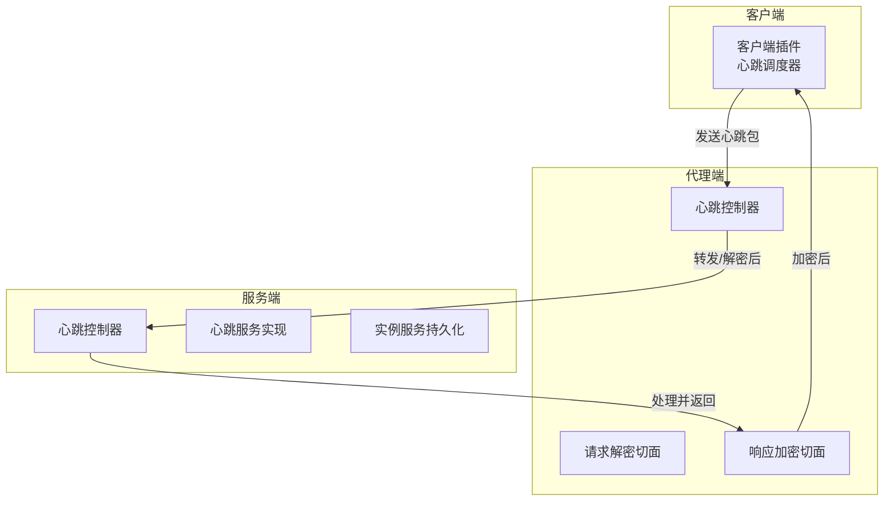
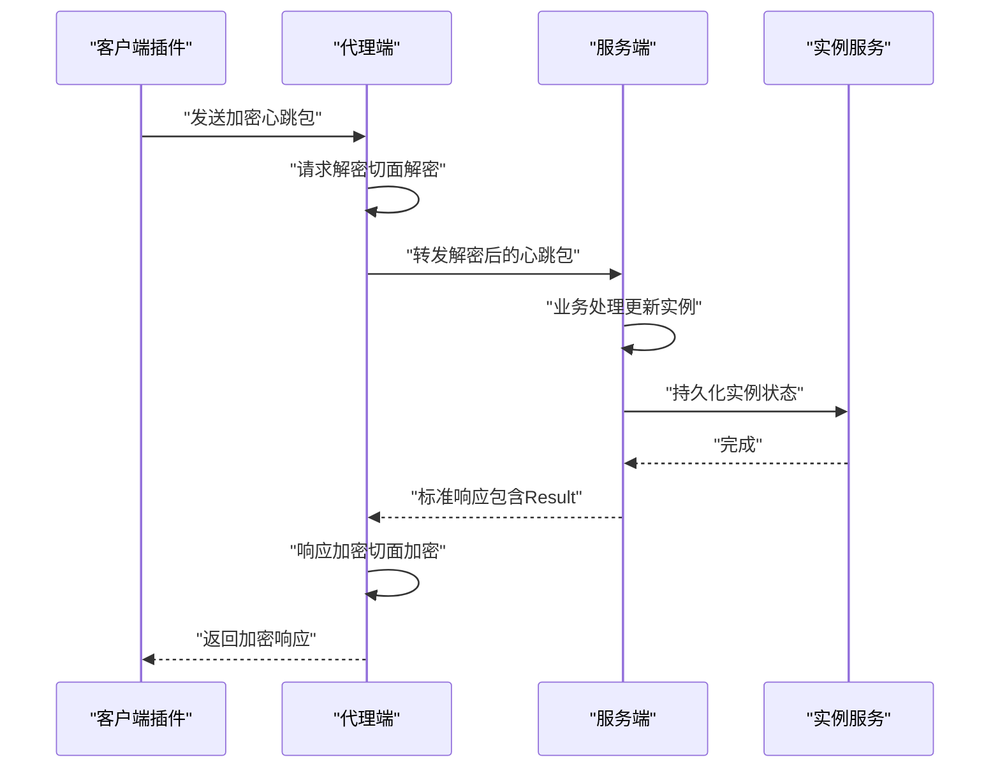
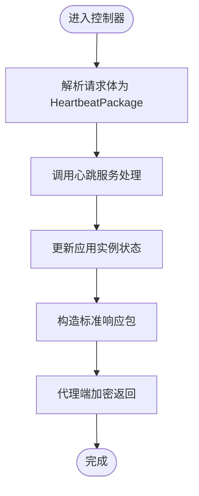
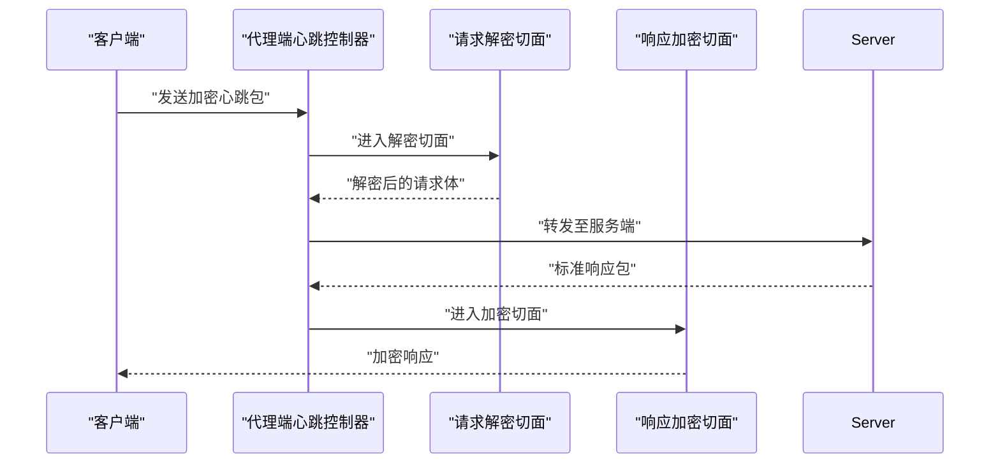
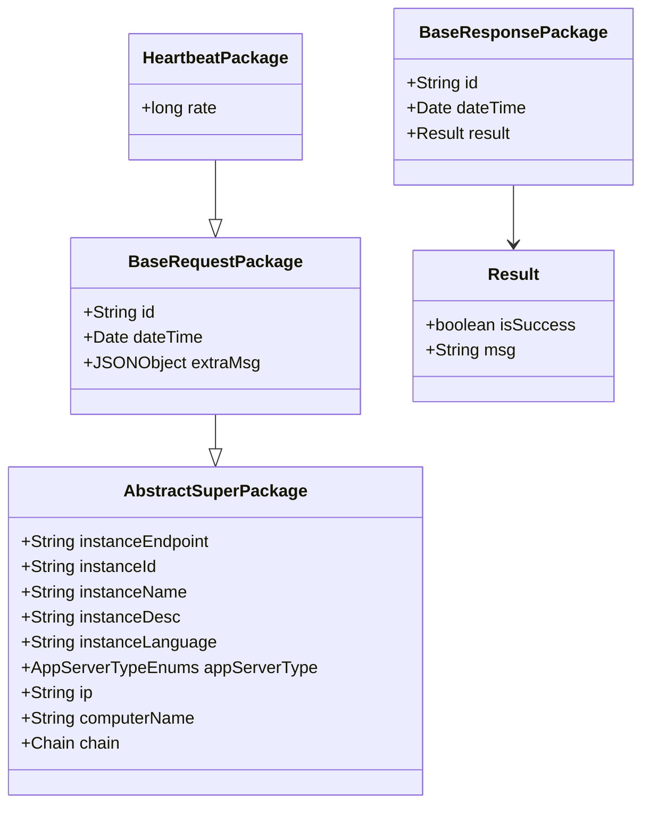

# 心跳包接口

<cite>
**本文引用的文件**
- [HeartbeatController.java](file://phoenix-server/src/main/java/com/gitee/pifeng/monitoring/server/business/server/controller/HeartbeatController.java)
- [IHeartbeatService.java](file://phoenix-server/src/main/java/com/gitee/pifeng/monitoring/server/business/server/service/IHeartbeatService.java)
- [HeartbeatServiceImpl.java](file://phoenix-server/src/main/java/com/gitee/pifeng/monitoring/server/business/server/service/impl/HeartbeatServiceImpl.java)
- [HeartbeatPackage.java](file://phoenix-common/phoenix-common-core/src/main/java/com/gitee/pifeng/monitoring/common/dto/HeartbeatPackage.java)
- [BaseRequestPackage.java](file://phoenix-common/phoenix-common-core/src/main/java/com/gitee/pifeng/monitoring/common/dto/BaseRequestPackage.java)
- [BaseResponsePackage.java](file://phoenix-common/phoenix-common-core/src/main/java/com/gitee/pifeng/monitoring/common/dto/BaseResponsePackage.java)
- [Result.java](file://phoenix-common/phoenix-common-core/src/main/java/com/gitee/pifeng/monitoring/common/domain/Result.java)
- [AbstractSuperPackage.java](file://phoenix-common/phoenix-common-core/src/main/java/com/gitee/pifeng/monitoring/common/abs/AbstractSuperPackage.java)
- [UrlConstants.java（Agent）](file://phoenix-agent/src/main/java/com/gitee/pifeng/monitoring/agent/constant/UrlConstants.java)
- [RequestPackageDecryptAdvice.java](file://phoenix-agent/src/main/java/com/gitee/pifeng/monitoring/agent/component/RequestPackageDecryptAdvice.java)
- [ResponsePackageEncryptAdvice.java](file://phoenix-agent/src/main/java/com/gitee/pifeng/monitoring/agent/component/ResponsePackageEncryptAdvice.java)
- [HeartbeatTaskScheduler.java](file://phoenix-client/phoenix-client-core/src/main/java/com/gitee/pifeng/monitoring/plug/scheduler/HeartbeatTaskScheduler.java)
- [MonitoringHeartbeatProperties.java](file://phoenix-common/phoenix-common-core/src/main/java/com/gitee/pifeng/monitoring/common/property/client/MonitoringHeartbeatProperties.java)
</cite>

## 目录
1. [简介](#简介)
2. [项目结构](#项目结构)
3. [核心组件](#核心组件)
4. [架构总览](#架构总览)
5. [详细组件分析](#详细组件分析)
6. [依赖关系分析](#依赖关系分析)
7. [性能与可靠性](#性能与可靠性)
8. [故障排查指南](#故障排查指南)
9. [结论](#结论)
10. [附录](#附录)

## 简介
本文件面向开发者，系统化地阐述“心跳包接收接口”的API设计与实现细节，涵盖请求与响应数据结构、加密与解密机制、时间戳与频率控制、错误处理与超时重连策略，并提供 curl 示例与调用参考，帮助快速集成与稳定运行。

## 项目结构
心跳包接口涉及三层角色：
- 客户端插件：周期性生成心跳包并定时发送
- 代理端：转发心跳包至服务端，负责加解密与异常兜底
- 服务端：接收心跳包，更新应用实例状态并返回标准响应

图表来源
- [HeartbeatTaskScheduler.java:39-43](file://phoenix-client/phoenix-client-core/src/main/java/com/gitee/pifeng/monitoring/plug/scheduler/HeartbeatTaskScheduler.java#L39-L43)
- [HeartbeatController.java（Agent）:50-53](file://phoenix-agent/src/main/java/com/gitee/pifeng/monitoring/agent/business/client/controller/HeartbeatController.java#L50-L53)
- [RequestPackageDecryptAdvice.java:50-53](file://phoenix-agent/src/main/java/com/gitee/pifeng/monitoring/agent/component/RequestPackageDecryptAdvice.java#L50-L53)
- [ResponsePackageEncryptAdvice.java:72-81](file://phoenix-agent/src/main/java/com/gitee/pifeng/monitoring/agent/component/ResponsePackageEncryptAdvice.java#L72-L81)
- [HeartbeatController.java（Server）:64-77](file://phoenix-server/src/main/java/com/gitee/pifeng/monitoring/server/business/server/controller/HeartbeatController.java#L64-L77)
- [HeartbeatServiceImpl.java:40-45](file://phoenix-server/src/main/java/com/gitee/pifeng/monitoring/server/business/server/service/impl/HeartbeatServiceImpl.java#L40-L45)

章节来源
- [HeartbeatController.java（Server）:34-77](file://phoenix-server/src/main/java/com/gitee/pifeng/monitoring/server/business/server/controller/HeartbeatController.java#L34-L77)
- [HeartbeatController.java（Agent）:26-53](file://phoenix-agent/src/main/java/com/gitee/pifeng/monitoring/agent/business/client/controller/HeartbeatController.java#L26-L53)
- [HeartbeatTaskScheduler.java:39-43](file://phoenix-client/phoenix-client-core/src/main/java/com/gitee/pifeng/monitoring/plug/scheduler/HeartbeatTaskScheduler.java#L39-L43)

## 核心组件
- 接口路径：/heartbeat/accept-heartbeat-package
- 方法：POST
- 功能：接收来自客户端或代理端的心跳包，更新应用实例状态并返回标准响应

请求体与响应体均采用统一的加密/解密包装（CiphertextPackage），服务端通过包构造器生成 BaseResponsePackage，内部封装 Result。

章节来源
- [HeartbeatController.java（Server）:61-77](file://phoenix-server/src/main/java/com/gitee/pifeng/monitoring/server/business/server/controller/HeartbeatController.java#L61-L77)
- [HeartbeatController.java（Agent）:47-53](file://phoenix-agent/src/main/java/com/gitee/pifeng/monitoring/agent/business/client/controller/HeartbeatController.java#L47-L53)
- [CiphertextPackage.java:21-33](file://phoenix-common/phoenix-common-core/src/main/java/com/gitee/pifeng/monitoring/common/dto/CiphertextPackage.java#L21-L33)
- [BaseResponsePackage.java:24-41](file://phoenix-common/phoenix-common-core/src/main/java/com/gitee/pifeng/monitoring/common/dto/BaseResponsePackage.java#L24-L41)
- [Result.java:22-34](file://phoenix-common/phoenix-common-core/src/main/java/com/gitee/pifeng/monitoring/common/domain/Result.java#L22-L34)

## 架构总览
心跳包在监控系统中的作用：
- 连接健康度检测：通过心跳频率与时间戳判断代理端与客户端存活
- 实例状态同步：服务端根据心跳包更新应用实例的在线状态与元信息
- 异常快速发现：代理端对异常进行加密兜底返回，便于定位问题

图表来源
- [HeartbeatController.java（Server）:64-77](file://phoenix-server/src/main/java/com/gitee/pifeng/monitoring/server/business/server/controller/HeartbeatController.java#L64-L77)
- [HeartbeatServiceImpl.java:40-45](file://phoenix-server/src/main/java/com/gitee/pifeng/monitoring/server/business/server/service/impl/HeartbeatServiceImpl.java#L40-L45)
- [RequestPackageDecryptAdvice.java:50-53](file://phoenix-agent/src/main/java/com/gitee/pifeng/monitoring/agent/component/RequestPackageDecryptAdvice.java#L50-L53)
- [ResponsePackageEncryptAdvice.java:72-81](file://phoenix-agent/src/main/java/com/gitee/pifeng/monitoring/agent/component/ResponsePackageEncryptAdvice.java#L72-L81)

## 详细组件分析

### 接口定义与路由
- 路径：/heartbeat/accept-heartbeat-package
- 方法：POST
- 控制器：
  - 服务端：HeartbeatController（Server）
  - 代理端：HeartbeatController（Agent）

章节来源
- [HeartbeatController.java（Server）:64-77](file://phoenix-server/src/main/java/com/gitee/pifeng/monitoring/server/business/server/controller/HeartbeatController.java#L64-L77)
- [HeartbeatController.java（Agent）:50-53](file://phoenix-agent/src/main/java/com/gitee/pifeng/monitoring/agent/business/client/controller/HeartbeatController.java#L50-L53)

### 请求与响应数据结构

#### 心跳包（HeartbeatPackage）
- 继承自 BaseRequestPackage，扩展字段：
  - rate：心跳频率（秒）
- 基础字段（继承自 BaseRequestPackage）：
  - id、dateTime、extraMsg
- 实例标识（继承自 AbstractSuperPackage）：
  - instanceEndpoint、instanceId、instanceName、instanceDesc、instanceLanguage、appServerType、ip、computerName、chain

章节来源
- [HeartbeatPackage.java:20-27](file://phoenix-common/phoenix-common-core/src/main/java/com/gitee/pifeng/monitoring/common/dto/HeartbeatPackage.java#L20-L27)
- [BaseRequestPackage.java:24-41](file://phoenix-common/phoenix-common-core/src/main/java/com/gitee/pifeng/monitoring/common/dto/BaseRequestPackage.java#L24-L41)
- [AbstractSuperPackage.java:24-71](file://phoenix-common/phoenix-common-core/src/main/java/com/gitee/pifeng/monitoring/common/abs/AbstractSuperPackage.java#L24-L71)

#### 标准响应包（BaseResponsePackage）
- 字段：
  - id、dateTime、result（Result）
- Result：
  - isSuccess（布尔）、msg（字符串）

章节来源
- [BaseResponsePackage.java:24-41](file://phoenix-common/phoenix-common-core/src/main/java/com/gitee/pifeng/monitoring/common/dto/BaseResponsePackage.java#L24-L41)
- [Result.java:22-34](file://phoenix-common/phoenix-common-core/src/main/java/com/gitee/pifeng/monitoring/common/domain/Result.java#L22-L34)

#### 加密包装（CiphertextPackage）
- ciphertext：加密后的数据
- isUnGzipEnabled：是否需要先解压再解密（或反之）

章节来源
- [CiphertextPackage.java:21-33](file://phoenix-common/phoenix-common-core/src/main/java/com/gitee/pifeng/monitoring/common/dto/CiphertextPackage.java#L21-L33)

### 业务处理流程

#### 服务端处理链路
- 控制器接收 HeartbeatPackage
- 调用 IHeartbeatService.dealHeartbeatPackage
- 服务实现更新实例状态
- 使用包构造器生成 BaseResponsePackage
- 返回给代理端

图表来源
- [HeartbeatController.java（Server）:64-77](file://phoenix-server/src/main/java/com/gitee/pifeng/monitoring/server/business/server/controller/HeartbeatController.java#L64-L77)
- [HeartbeatServiceImpl.java:40-45](file://phoenix-server/src/main/java/com/gitee/pifeng/monitoring/server/business/server/service/impl/HeartbeatServiceImpl.java#L40-L45)

章节来源
- [IHeartbeatService.java:15-28](file://phoenix-server/src/main/java/com/gitee/pifeng/monitoring/server/business/server/service/IHeartbeatService.java#L15-L28)
- [HeartbeatServiceImpl.java:40-45](file://phoenix-server/src/main/java/com/gitee/pifeng/monitoring/server/business/server/service/impl/HeartbeatServiceImpl.java#L40-L45)

#### 代理端处理链路
- 请求解密切面：拦截请求，对输入消息进行解密
- 响应加密切面：拦截响应，对输出消息进行加密
- 心跳控制器：转发心跳包至服务端

图表来源
- [RequestPackageDecryptAdvice.java:50-53](file://phoenix-agent/src/main/java/com/gitee/pifeng/monitoring/agent/component/RequestPackageDecryptAdvice.java#L50-L53)
- [ResponsePackageEncryptAdvice.java:72-81](file://phoenix-agent/src/main/java/com/gitee/pifeng/monitoring/agent/component/ResponsePackageEncryptAdvice.java#L72-L81)
- [HeartbeatController.java（Agent）:50-53](file://phoenix-agent/src/main/java/com/gitee/pifeng/monitoring/agent/business/client/controller/HeartbeatController.java#L50-L53)

章节来源
- [RequestPackageDecryptAdvice.java:26-55](file://phoenix-agent/src/main/java/com/gitee/pifeng/monitoring/agent/component/RequestPackageDecryptAdvice.java#L26-L55)
- [ResponsePackageEncryptAdvice.java:36-83](file://phoenix-agent/src/main/java/com/gitee/pifeng/monitoring/agent/component/ResponsePackageEncryptAdvice.java#L36-L83)

### 时间戳与频率控制
- 心跳频率（rate）来源于客户端配置，调度器以固定延迟启动后，按 rate 秒周期发送
- 服务端控制器记录处理耗时，超过阈值会输出警告日志

章节来源
- [MonitoringHeartbeatProperties.java:20-27](file://phoenix-common/phoenix-common-core/src/main/java/com/gitee/pifeng/monitoring/common/property/client/MonitoringHeartbeatProperties.java#L20-L27)
- [HeartbeatTaskScheduler.java:39-43](file://phoenix-client/phoenix-client-core/src/main/java/com/gitee/pifeng/monitoring/plug/scheduler/HeartbeatTaskScheduler.java#L39-L43)
- [HeartbeatController.java（Server）:66-76](file://phoenix-server/src/main/java/com/gitee/pifeng/monitoring/server/business/server/controller/HeartbeatController.java#L66-L76)

### 错误处理与异常兜底
- 代理端响应加密切面捕获异常，构造失败的 Result 并加密返回
- 服务端控制器未显式抛出异常，但服务层可能抛出网络相关异常（NetException）

章节来源
- [ResponsePackageEncryptAdvice.java:55-64](file://phoenix-agent/src/main/java/com/gitee/pifeng/monitoring/agent/component/ResponsePackageEncryptAdvice.java#L55-L64)
- [HeartbeatController.java（Server）:57-58](file://phoenix-server/src/main/java/com/gitee/pifeng/monitoring/server/business/server/controller/HeartbeatController.java#L57-L58)

## 依赖关系分析

图表来源
- [HeartbeatPackage.java:20-27](file://phoenix-common/phoenix-common-core/src/main/java/com/gitee/pifeng/monitoring/common/dto/HeartbeatPackage.java#L20-L27)
- [BaseRequestPackage.java:24-41](file://phoenix-common/phoenix-common-core/src/main/java/com/gitee/pifeng/monitoring/common/dto/BaseRequestPackage.java#L24-L41)
- [AbstractSuperPackage.java:24-71](file://phoenix-common/phoenix-common-core/src/main/java/com/gitee/pifeng/monitoring/common/abs/AbstractSuperPackage.java#L24-L71)
- [BaseResponsePackage.java:24-41](file://phoenix-common/phoenix-common-core/src/main/java/com/gitee/pifeng/monitoring/common/dto/BaseResponsePackage.java#L24-L41)
- [Result.java:22-34](file://phoenix-common/phoenix-common-core/src/main/java/com/gitee/pifeng/monitoring/common/domain/Result.java#L22-L34)

章节来源
- [HeartbeatPackage.java:20-27](file://phoenix-common/phoenix-common-core/src/main/java/com/gitee/pifeng/monitoring/common/dto/HeartbeatPackage.java#L20-L27)
- [BaseRequestPackage.java:24-41](file://phoenix-common/phoenix-common-core/src/main/java/com/gitee/pifeng/monitoring/common/dto/BaseRequestPackage.java#L24-L41)
- [BaseResponsePackage.java:24-41](file://phoenix-common/phoenix-common-core/src/main/java/com/gitee/pifeng/monitoring/common/dto/BaseResponsePackage.java#L24-L41)
- [Result.java:22-34](file://phoenix-common/phoenix-common-core/src/main/java/com/gitee/pifeng/monitoring/common/domain/Result.java#L22-L34)

## 性能与可靠性
- 处理耗时监控：服务端控制器记录处理耗时，超过1秒输出警告，便于及时发现性能瓶颈
- 加密开销：代理端切面负责加解密与压缩/解压，需关注 CPU 与带宽占用
- 心跳频率：客户端按配置周期发送，建议结合网络质量与服务端负载合理设置

章节来源
- [HeartbeatController.java（Server）:72-76](file://phoenix-server/src/main/java/com/gitee/pifeng/monitoring/server/business/server/controller/HeartbeatController.java#L72-L76)
- [ResponsePackageEncryptAdvice.java:72-81](file://phoenix-agent/src/main/java/com/gitee/pifeng/monitoring/agent/component/ResponsePackageEncryptAdvice.java#L72-L81)
- [HeartbeatTaskScheduler.java:39-43](file://phoenix-client/phoenix-client-core/src/main/java/com/gitee/pifeng/monitoring/plug/scheduler/HeartbeatTaskScheduler.java#L39-L43)

## 故障排查指南
- 无法解密请求
  - 检查代理端请求解密切面是否生效
  - 确认请求体为 CiphertextPackage，且包含有效 ciphertext
- 无法加密响应
  - 检查代理端响应加密切面是否生效
  - 确认返回对象可被加密包装器处理
- 服务端处理慢
  - 关注控制器日志中的耗时提示
  - 检查实例服务持久化性能
- 心跳不达预期
  - 核对客户端心跳频率配置
  - 检查网络连通性与防火墙策略

章节来源
- [RequestPackageDecryptAdvice.java:26-55](file://phoenix-agent/src/main/java/com/gitee/pifeng/monitoring/agent/component/RequestPackageDecryptAdvice.java#L26-L55)
- [ResponsePackageEncryptAdvice.java:36-83](file://phoenix-agent/src/main/java/com/gitee/pifeng/monitoring/agent/component/ResponsePackageEncryptAdvice.java#L36-L83)
- [HeartbeatController.java（Server）:72-76](file://phoenix-server/src/main/java/com/gitee/pifeng/monitoring/server/business/server/controller/HeartbeatController.java#L72-L76)
- [MonitoringHeartbeatProperties.java:20-27](file://phoenix-common/phoenix-common-core/src/main/java/com/gitee/pifeng/monitoring/common/property/client/MonitoringHeartbeatProperties.java#L20-L27)

## 结论
心跳包接口通过统一的数据结构与加解密机制，实现了跨端的心跳收发与状态同步。服务端以最小成本完成实例状态更新，并通过标准响应包反馈结果；代理端负责透明的加解密与异常兜底，保障通信安全与稳定性。开发者可据此接口快速集成心跳功能，并结合频率与超时策略优化整体监控系统的可靠性。

## 附录

### API 规范
- 地址：/heartbeat/accept-heartbeat-package
- 方法：POST
- 内容类型：application/json（经加密包装）
- 请求体：CiphertextPackage（内部承载 HeartbeatPackage）
- 响应体：CiphertextPackage（内部承载 BaseResponsePackage）

章节来源
- [HeartbeatController.java（Server）:61-63](file://phoenix-server/src/main/java/com/gitee/pifeng/monitoring/server/business/server/controller/HeartbeatController.java#L61-L63)
- [HeartbeatController.java（Agent）:47-49](file://phoenix-agent/src/main/java/com/gitee/pifeng/monitoring/agent/business/client/controller/HeartbeatController.java#L47-L49)
- [CiphertextPackage.java:21-33](file://phoenix-common/phoenix-common-core/src/main/java/com/gitee/pifeng/monitoring/common/dto/CiphertextPackage.java#L21-L33)

### 请求与响应字段说明
- 心跳包（HeartbeatPackage）
  - rate：心跳频率（秒）
  - 继承字段：id、dateTime、extraMsg
  - 实例标识：instanceEndpoint、instanceId、instanceName、instanceDesc、instanceLanguage、appServerType、ip、computerName、chain
- 标准响应包（BaseResponsePackage）
  - id、dateTime、result.isSuccess、result.msg

章节来源
- [HeartbeatPackage.java:20-27](file://phoenix-common/phoenix-common-core/src/main/java/com/gitee/pifeng/monitoring/common/dto/HeartbeatPackage.java#L20-L27)
- [BaseRequestPackage.java:24-41](file://phoenix-common/phoenix-common-core/src/main/java/com/gitee/pifeng/monitoring/common/dto/BaseRequestPackage.java#L24-L41)
- [AbstractSuperPackage.java:24-71](file://phoenix-common/phoenix-common-core/src/main/java/com/gitee/pifeng/monitoring/common/abs/AbstractSuperPackage.java#L24-L71)
- [BaseResponsePackage.java:24-41](file://phoenix-common/phoenix-common-core/src/main/java/com/gitee/pifeng/monitoring/common/dto/BaseResponsePackage.java#L24-L41)
- [Result.java:22-34](file://phoenix-common/phoenix-common-core/src/main/java/com/gitee/pifeng/monitoring/common/domain/Result.java#L22-L34)

### 配置项与默认行为
- 心跳频率（rate）：来源于客户端配置，调度器以固定延迟启动后按 rate 秒周期发送
- 默认启动延迟：约35秒
- 服务端处理耗时：超过1秒输出警告日志

章节来源
- [MonitoringHeartbeatProperties.java:20-27](file://phoenix-common/phoenix-common-core/src/main/java/com/gitee/pifeng/monitoring/common/property/client/MonitoringHeartbeatProperties.java#L20-L27)
- [HeartbeatTaskScheduler.java:39-43](file://phoenix-client/phoenix-client-core/src/main/java/com/gitee/pifeng/monitoring/plug/scheduler/HeartbeatTaskScheduler.java#L39-L43)
- [HeartbeatController.java（Server）:72-76](file://phoenix-server/src/main/java/com/gitee/pifeng/monitoring/server/business/server/controller/HeartbeatController.java#L72-L76)

### curl 示例（概念性说明）
- 说明：由于请求与响应均为加密包装，直接使用 curl 发送明文无效
- 步骤建议：
  - 在客户端侧构造 HeartbeatPackage 并交由包构造器生成 CiphertextPackage
  - 通过 SDK 或客户端工具发送至 /heartbeat/accept-heartbeat-package
  - 代理端自动完成解密与加密，返回 CiphertextPackage

[本节为概念性说明，不直接分析具体文件]

### 代码调用示例（概念性说明）
- 客户端侧：使用心跳调度器启动发送流程
- 代理端侧：通过控制器与切面完成转发与加解密
- 服务端侧：通过控制器与服务实现完成处理与响应

章节来源
- [HeartbeatTaskScheduler.java:39-43](file://phoenix-client/phoenix-client-core/src/main/java/com/gitee/pifeng/monitoring/plug/scheduler/HeartbeatTaskScheduler.java#L39-L43)
- [HeartbeatController.java（Agent）:50-53](file://phoenix-agent/src/main/java/com/gitee/pifeng/monitoring/agent/business/client/controller/HeartbeatController.java#L50-L53)
- [HeartbeatController.java（Server）:64-77](file://phoenix-server/src/main/java/com/gitee/pifeng/monitoring/server/business/server/controller/HeartbeatController.java#L64-L77)