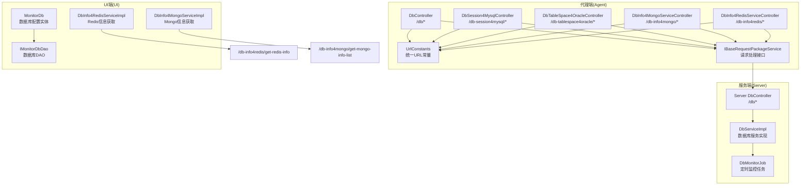
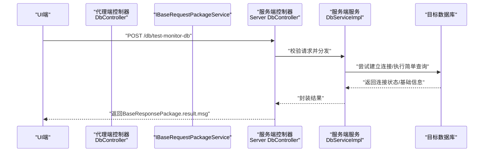
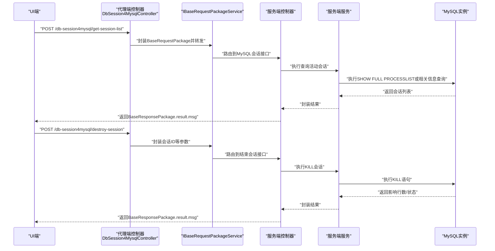
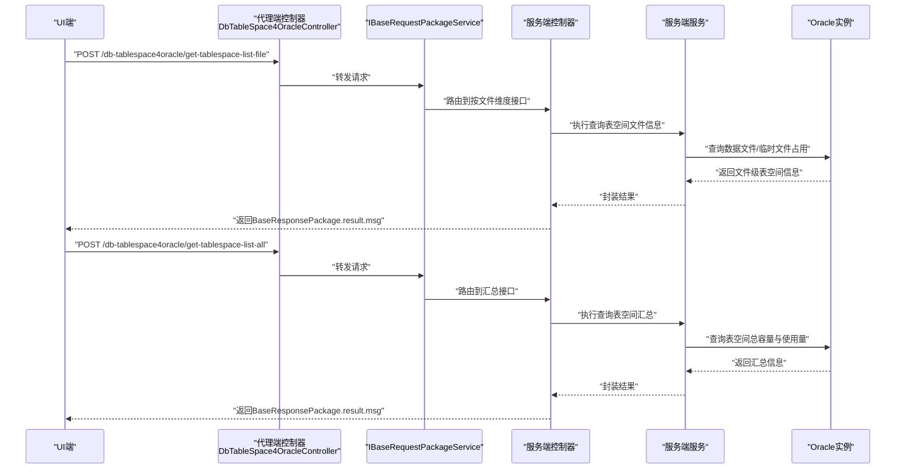
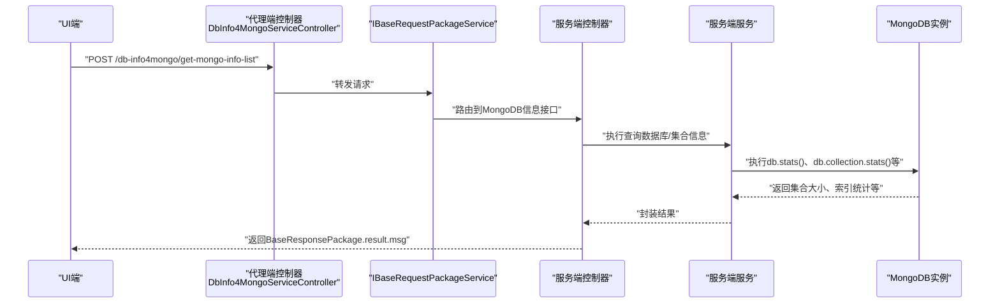
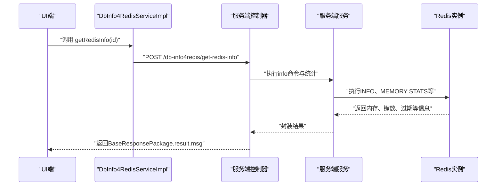
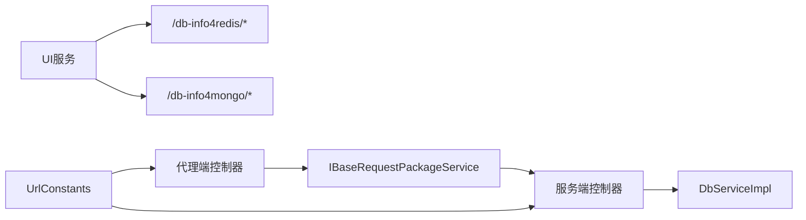

# 数据库监控接口

<cite>
**本文引用的文件**
- [DbController.java](file://phoenix-agent/src/main/java/com/gitee/pifeng/monitoring/agent/business/client/controller/DbController.java)
- [DbSession4MysqlController.java](file://phoenix-agent/src/main/java/com/gitee/pifeng/monitoring/agent/business/client/controller/DbSession4MysqlController.java)
- [DbTableSpace4OracleController.java](file://phoenix-agent/src/main/java/com/gitee/pifeng/monitoring/agent/business/client/controller/DbTableSpace4OracleController.java)
- [DbInfo4MongoServiceController.java](file://phoenix-agent/src/main/java/com/gitee/pifeng/monitoring/agent/business/client/controller/DbInfo4MongoServiceController.java)
- [DbInfo4RedisServiceController.java](file://phoenix-agent/src/main/java/com/gitee/pifeng/monitoring/agent/business/client/controller/DbInfo4RedisServiceController.java)
- [UrlConstants.java](file://phoenix-agent/src/main/java/com/gitee/pifeng/monitoring/agent/constant/UrlConstants.java)
- [IBaseRequestPackageService.java](file://phoenix-agent/src/main/java/com/gitee/pifeng/monitoring/agent/business/client/service/IBaseRequestPackageService.java)
- [BaseRequestPackage.java](file://phoenix-common/phoenix-common-core/src/main/java/com/gitee/pifeng/monitoring/common/dto/BaseRequestPackage.java)
- [BaseResponsePackage.java](file://phoenix-common/phoenix-common-core/src/main/java/com/gitee/pifeng/monitoring/common/dto/BaseResponsePackage.java)
- [CiphertextPackage.java](file://phoenix-common/phoenix-common-core/src/main/java/com/gitee/pifeng/monitoring/common/dto/CiphertextPackage.java)
- [DbController.java](file://phoenix-server/src/main/java/com/gitee/pifeng/monitoring/server/business/server/controller/DbController.java)
- [DbServiceImpl.java](file://phoenix-server/src/main/java/com/gitee/pifeng/monitoring/server/business/server/service/impl/DbServiceImpl.java)
- [DbMonitorJob.java](file://phoenix-server/src/main/java/com/gitee/pifeng/monitoring/server/business/server/monitor/db/DbMonitorJob.java)
- [DbInfo4RedisServiceImpl.java](file://phoenix-ui/src/main/java/com/gitee/pifeng/monitoring/ui/business/web/service/impl/DbInfo4RedisServiceImpl.java)
- [DbInfo4MongoServiceImpl.java](file://phoenix-ui/src/main/java/com/gitee/pifeng/monitoring/ui/business/web/service/impl/DbInfo4MongoServiceImpl.java)
- [MonitorDb.java](file://phoenix-ui/src/main/java/com/gitee/pifeng/monitoring/ui/business/web/entity/MonitorDb.java)
- [IMonitorDbDao.java](file://phoenix-ui/src/main/java/com/gitee/pifeng/monitoring/ui/business/web/dao/IMonitorDbDao.java)
</cite>

## 目录
1. [简介](#简介)
2. [项目结构](#项目结构)
3. [核心组件](#核心组件)
4. [架构总览](#架构总览)
5. [详细组件分析](#详细组件分析)
6. [依赖分析](#依赖分析)
7. [性能考虑](#性能考虑)
8. [故障排查指南](#故障排查指南)
9. [结论](#结论)
10. [附录](#附录)

## 简介
本文件面向数据库监控接口的使用者与维护者，系统性梳理并说明以下接口的用途、调用流程、数据结构与监控指标：
- 数据库连接信息获取：/db/test-monitor-db
- 数据库会话管理（MySQL）：/db-session4mysql/get-session-list、/db-session4mysql/destroy-session
- 数据库表空间监控（Oracle）：/db-tablespace4oracle/get-tablespace-list-file、/db-tablespace4oracle/get-tablespace-list-all
- MongoDB信息获取：/db-info4mongo/get-mongo-info-list
- Redis信息获取：/db-info4redis/get-redis-info

同时，结合系统中已实现的控制器与服务层，给出各接口在代理端（Agent）、服务端（Server）、UI端的职责分工与交互序列，帮助读者快速定位问题、理解数据流转与扩展新的监控项。

## 项目结构
该系统采用“代理端-服务端-UI端”三层协作模式：
- 代理端（Agent）负责采集与封装监控请求，转发至服务端。
- 服务端（Server）接收请求，执行具体数据库连接与查询，返回结果。
- UI端（UI）负责展示与调用，向服务端发送请求并解析响应。

图表来源
- [DbController.java:1-61](file://phoenix-agent/src/main/java/com/gitee/pifeng/monitoring/agent/business/client/controller/DbController.java#L1-L61)
- [DbSession4MysqlController.java:1-77](file://phoenix-agent/src/main/java/com/gitee/pifeng/monitoring/agent/business/client/controller/DbSession4MysqlController.java#L1-L77)
- [DbTableSpace4OracleController.java:1-77](file://phoenix-agent/src/main/java/com/gitee/pifeng/monitoring/agent/business/client/controller/DbTableSpace4OracleController.java#L1-L77)
- [DbInfo4MongoServiceController.java:1-59](file://phoenix-agent/src/main/java/com/gitee/pifeng/monitoring/agent/business/client/controller/DbInfo4MongoServiceController.java#L1-L59)
- [DbInfo4RedisServiceController.java:1-61](file://phoenix-agent/src/main/java/com/gitee/pifeng/monitoring/agent/business/client/controller/DbInfo4RedisServiceController.java#L1-L61)
- [UrlConstants.java:1-127](file://phoenix-agent/src/main/java/com/gitee/pifeng/monitoring/agent/constant/UrlConstants.java#L1-L127)
- [DbController.java:1-33](file://phoenix-server/src/main/java/com/gitee/pifeng/monitoring/server/business/server/controller/DbController.java#L1-L33)
- [DbServiceImpl.java:1-35](file://phoenix-server/src/main/java/com/gitee/pifeng/monitoring/server/business/server/service/impl/DbServiceImpl.java#L1-L35)
- [DbMonitorJob.java:184-226](file://phoenix-server/src/main/java/com/gitee/pifeng/monitoring/server/business/server/monitor/db/DbMonitorJob.java#L184-L226)
- [DbInfo4RedisServiceImpl.java:1-79](file://phoenix-ui/src/main/java/com/gitee/pifeng/monitoring/ui/business/web/service/impl/DbInfo4RedisServiceImpl.java#L1-L79)
- [DbInfo4MongoServiceImpl.java:1-36](file://phoenix-ui/src/main/java/com/gitee/pifeng/monitoring/ui/business/web/service/impl/DbInfo4MongoServiceImpl.java#L1-L36)
- [MonitorDb.java:1-53](file://phoenix-ui/src/main/java/com/gitee/pifeng/monitoring/ui/business/web/entity/MonitorDb.java#L1-L53)
- [IMonitorDbDao.java:1-29](file://phoenix-ui/src/main/java/com/gitee/pifeng/monitoring/ui/business/web/dao/IMonitorDbDao.java#L1-L29)

章节来源
- [UrlConstants.java:1-127](file://phoenix-agent/src/main/java/com/gitee/pifeng/monitoring/agent/constant/UrlConstants.java#L1-L127)
- [DbController.java:1-61](file://phoenix-agent/src/main/java/com/gitee/pifeng/monitoring/agent/business/client/controller/DbController.java#L1-L61)
- [DbSession4MysqlController.java:1-77](file://phoenix-agent/src/main/java/com/gitee/pifeng/monitoring/agent/business/client/controller/DbSession4MysqlController.java#L1-L77)
- [DbTableSpace4OracleController.java:1-77](file://phoenix-agent/src/main/java/com/gitee/pifeng/monitoring/agent/business/client/controller/DbTableSpace4OracleController.java#L1-L77)
- [DbInfo4MongoServiceController.java:1-59](file://phoenix-agent/src/main/java/com/gitee/pifeng/monitoring/agent/business/client/controller/DbInfo4MongoServiceController.java#L1-L59)
- [DbInfo4RedisServiceController.java:1-61](file://phoenix-agent/src/main/java/com/gitee/pifeng/monitoring/agent/business/client/controller/DbInfo4RedisServiceController.java#L1-L61)

## 核心组件
- 请求/响应数据模型
  - BaseRequestPackage：通用请求包，包含标识、时间戳与附加参数。
  - BaseResponsePackage：通用响应包，包含标识、时间戳与Result结果对象。
  - CiphertextPackage：密文数据包，用于传输加密数据。
- 统一URL常量：集中管理所有服务端接口地址，便于代理端转发与UI端调用。
- 控制器层：代理端各控制器负责将业务请求封装为BaseRequestPackage并通过IBaseRequestPackageService转发至服务端。
- 服务端控制器与服务：服务端控制器接收请求，服务层执行数据库操作并返回结果。
- UI服务：UI端通过Sender发送请求，解析响应中的Result.msg字段以展示监控信息。

章节来源
- [BaseRequestPackage.java:1-42](file://phoenix-common/phoenix-common-core/src/main/java/com/gitee/pifeng/monitoring/common/dto/BaseRequestPackage.java#L1-L42)
- [BaseResponsePackage.java:1-42](file://phoenix-common/phoenix-common-core/src/main/java/com/gitee/pifeng/monitoring/common/dto/BaseResponsePackage.java#L1-L42)
- [CiphertextPackage.java:1-34](file://phoenix-common/phoenix-common-core/src/main/java/com/gitee/pifeng/monitoring/common/dto/CiphertextPackage.java#L1-L34)
- [UrlConstants.java:1-127](file://phoenix-agent/src/main/java/com/gitee/pifeng/monitoring/agent/constant/UrlConstants.java#L1-L127)
- [IBaseRequestPackageService.java:1-30](file://phoenix-agent/src/main/java/com/gitee/pifeng/monitoring/agent/business/client/service/IBaseRequestPackageService.java#L1-L30)

## 架构总览
下图展示了典型一次数据库监控请求的端到端流程，以“测试数据库连通性”为例，其他接口遵循相同模式。

图表来源
- [DbController.java:1-61](file://phoenix-agent/src/main/java/com/gitee/pifeng/monitoring/agent/business/client/controller/DbController.java#L1-L61)
- [UrlConstants.java:82-84](file://phoenix-agent/src/main/java/com/gitee/pifeng/monitoring/agent/constant/UrlConstants.java#L82-L84)
- [DbController.java:1-33](file://phoenix-server/src/main/java/com/gitee/pifeng/monitoring/server/business/server/controller/DbController.java#L1-L33)
- [DbServiceImpl.java:1-35](file://phoenix-server/src/main/java/com/gitee/pifeng/monitoring/server/business/server/service/impl/DbServiceImpl.java#L1-L35)

## 详细组件分析

### 接口一览与职责
- /db/test-monitor-db
  - 代理端控制器：DbController
  - 服务端控制器：Server DbController
  - 功能：测试数据库连通性，返回连接状态与基础信息。
  - 关键URL常量：TEST_MONITOR_DB_URL
- /db-session4mysql/get-session-list
  - 代理端控制器：DbSession4MysqlController
  - 功能：获取MySQL活动会话列表。
  - 关键URL常量：MYSQL_GET_SESSION_LIST_URL
- /db-session4mysql/destroy-session
  - 代理端控制器：DbSession4MysqlController
  - 功能：结束指定MySQL会话。
  - 关键URL常量：MYSQL_DESTROY_SESSION_URL
- /db-tablespace4oracle/get-tablespace-list-file
  - 代理端控制器：DbTableSpace4OracleController
  - 功能：按文件维度获取Oracle表空间信息。
  - 关键URL常量：ORACLE_GET_TABLESPACE_LIST_FILE_URL
- /db-tablespace4oracle/get-tablespace-list-all
  - 代理端控制器：DbTableSpace4OracleController
  - 功能：获取Oracle表空间汇总信息。
  - 关键URL常量：ORACLE_GET_TABLESPACE_LIST_ALL_URL
- /db-info4mongo/get-mongo-info-list
  - 代理端控制器：DbInfo4MongoServiceController
  - 功能：获取MongoDB信息列表。
  - 关键URL常量：MONGO_GET_MONGO_INFO_LIST_URL
- /db-info4redis/get-redis-info
  - 代理端控制器：DbInfo4RedisServiceController
  - 功能：获取Redis信息。
  - 关键URL常量：REDIS_GET_REDIS_INFO_URL

章节来源
- [DbController.java:1-61](file://phoenix-agent/src/main/java/com/gitee/pifeng/monitoring/agent/business/client/controller/DbController.java#L1-L61)
- [DbSession4MysqlController.java:1-77](file://phoenix-agent/src/main/java/com/gitee/pifeng/monitoring/agent/business/client/controller/DbSession4MysqlController.java#L1-L77)
- [DbTableSpace4OracleController.java:1-77](file://phoenix-agent/src/main/java/com/gitee/pifeng/monitoring/agent/business/client/controller/DbTableSpace4OracleController.java#L1-L77)
- [DbInfo4MongoServiceController.java:1-59](file://phoenix-agent/src/main/java/com/gitee/pifeng/monitoring/agent/business/client/controller/DbInfo4MongoServiceController.java#L1-L59)
- [DbInfo4RedisServiceController.java:1-61](file://phoenix-agent/src/main/java/com/gitee/pifeng/monitoring/agent/business/client/controller/DbInfo4RedisServiceController.java#L1-L61)
- [UrlConstants.java:82-124](file://phoenix-agent/src/main/java/com/gitee/pifeng/monitoring/agent/constant/UrlConstants.java#L82-L124)

### 数据模型与监控指标

#### 通用数据模型
- BaseRequestPackage
  - 字段：id、dateTime、extraMsg（JSON对象）
  - 用途：承载请求标识、时间戳与业务参数
- BaseResponsePackage
  - 字段：id、dateTime、result（Result对象）
  - 用途：承载响应标识、时间戳与结果对象
- CiphertextPackage
  - 字段：ciphertext（密文字符串）、isUnGzipEnabled（布尔）
  - 用途：承载加密数据及解压开关

章节来源
- [BaseRequestPackage.java:1-42](file://phoenix-common/phoenix-common-core/src/main/java/com/gitee/pifeng/monitoring/common/dto/BaseRequestPackage.java#L1-L42)
- [BaseResponsePackage.java:1-42](file://phoenix-common/phoenix-common-core/src/main/java/com/gitee/pifeng/monitoring/common/dto/BaseResponsePackage.java#L1-L42)
- [CiphertextPackage.java:1-34](file://phoenix-common/phoenix-common-core/src/main/java/com/gitee/pifeng/monitoring/common/dto/CiphertextPackage.java#L1-L34)

#### 数据库类型监控指标
- MySQL
  - 指标：连接数、查询性能、锁等待、会话列表、活跃事务
  - 实现参考：/db-session4mysql/* 接口
- Oracle
  - 指标：表空间使用率、SGA/PGA内存分配、数据文件与临时文件占用
  - 实现参考：/db-tablespace4oracle/* 接口
- MongoDB
  - 指标：集合大小、索引使用情况、存储引擎、慢查询统计
  - 实现参考：/db-info4mongo/* 接口
- Redis
  - 指标：内存使用、键过期策略、持久化状态、客户端连接数
  - 实现参考：/db-info4redis/* 接口

说明：以上指标基于系统中已实现的接口与服务逻辑进行归纳，具体字段与计算方式以服务端实现为准。

### 调用序列与数据流

#### MySQL会话管理

图表来源
- [DbSession4MysqlController.java:1-77](file://phoenix-agent/src/main/java/com/gitee/pifeng/monitoring/agent/business/client/controller/DbSession4MysqlController.java#L1-L77)
- [UrlConstants.java:87-94](file://phoenix-agent/src/main/java/com/gitee/pifeng/monitoring/agent/constant/UrlConstants.java#L87-L94)
- [DbServiceImpl.java:1-35](file://phoenix-server/src/main/java/com/gitee/pifeng/monitoring/server/business/server/service/impl/DbServiceImpl.java#L1-L35)

#### Oracle表空间监控

图表来源
- [DbTableSpace4OracleController.java:1-77](file://phoenix-agent/src/main/java/com/gitee/pifeng/monitoring/agent/business/client/controller/DbTableSpace4OracleController.java#L1-L77)
- [UrlConstants.java:107-114](file://phoenix-agent/src/main/java/com/gitee/pifeng/monitoring/agent/constant/UrlConstants.java#L107-L114)
- [DbServiceImpl.java:1-35](file://phoenix-server/src/main/java/com/gitee/pifeng/monitoring/server/business/server/service/impl/DbServiceImpl.java#L1-L35)

#### MongoDB信息获取

图表来源
- [DbInfo4MongoServiceController.java:1-59](file://phoenix-agent/src/main/java/com/gitee/pifeng/monitoring/agent/business/client/controller/DbInfo4MongoServiceController.java#L1-L59)
- [UrlConstants.java:121-124](file://phoenix-agent/src/main/java/com/gitee/pifeng/monitoring/agent/constant/UrlConstants.java#L121-L124)
- [DbServiceImpl.java:1-35](file://phoenix-server/src/main/java/com/gitee/pifeng/monitoring/server/business/server/service/impl/DbServiceImpl.java#L1-L35)

#### Redis信息获取

图表来源
- [DbInfo4RedisServiceImpl.java:1-79](file://phoenix-ui/src/main/java/com/gitee/pifeng/monitoring/ui/business/web/service/impl/DbInfo4RedisServiceImpl.java#L1-L79)
- [DbInfo4RedisServiceController.java:1-61](file://phoenix-agent/src/main/java/com/gitee/pifeng/monitoring/agent/business/client/controller/DbInfo4RedisServiceController.java#L1-L61)
- [UrlConstants.java:117-119](file://phoenix-agent/src/main/java/com/gitee/pifeng/monitoring/agent/constant/UrlConstants.java#L117-L119)
- [DbServiceImpl.java:1-35](file://phoenix-server/src/main/java/com/gitee/pifeng/monitoring/server/business/server/service/impl/DbServiceImpl.java#L1-L35)

### 数据结构说明
- 请求参数（BaseRequestPackage.extraMsg）
  - MySQL会话：包含数据库连接标识、会话ID等
  - Oracle表空间：包含数据库连接标识、过滤条件等
  - MongoDB：包含数据库连接标识、集合名称等
  - Redis：包含主机、端口、密码等
- 响应体（BaseResponsePackage.result.msg）
  - 返回JSON字符串形式的监控指标，UI端解析后展示
- 错误处理
  - 服务端异常时返回Result对象，包含错误码与消息
  - UI端根据Result.msg展示错误提示

章节来源
- [BaseRequestPackage.java:1-42](file://phoenix-common/phoenix-common-core/src/main/java/com/gitee/pifeng/monitoring/common/dto/BaseRequestPackage.java#L1-L42)
- [BaseResponsePackage.java:1-42](file://phoenix-common/phoenix-common-core/src/main/java/com/gitee/pifeng/monitoring/common/dto/BaseResponsePackage.java#L1-L42)
- [DbInfo4RedisServiceImpl.java:54-78](file://phoenix-ui/src/main/java/com/gitee/pifeng/monitoring/ui/business/web/service/impl/DbInfo4RedisServiceImpl.java#L54-L78)

### 实际监控示例
- MySQL会话列表
  - 请求：POST /db-session4mysql/get-session-list
  - 参数：BaseRequestPackage.extraMsg包含数据库连接标识
  - 响应：BaseResponsePackage.result.msg为会话数组JSON
- Oracle表空间
  - 请求：POST /db-tablespace4oracle/get-tablespace-list-all
  - 参数：BaseRequestPackage.extraMsg包含数据库连接标识
  - 响应：BaseResponsePackage.result.msg为表空间汇总JSON
- MongoDB信息
  - 请求：POST /db-info4mongo/get-mongo-info-list
  - 参数：BaseRequestPackage.extraMsg包含数据库连接标识
  - 响应：BaseResponsePackage.result.msg为集合统计JSON
- Redis信息
  - 请求：POST /db-info4redis/get-redis-info
  - 参数：UI端自动封装host/port/password
  - 响应：BaseResponsePackage.result.msg为Redis INFO解析结果

章节来源
- [DbSession4MysqlController.java:53-56](file://phoenix-agent/src/main/java/com/gitee/pifeng/monitoring/agent/business/client/controller/DbSession4MysqlController.java#L53-L56)
- [DbTableSpace4OracleController.java:71-73](file://phoenix-agent/src/main/java/com/gitee/pifeng/monitoring/agent/business/client/controller/DbTableSpace4OracleController.java#L71-L73)
- [DbInfo4MongoServiceController.java:54-56](file://phoenix-agent/src/main/java/com/gitee/pifeng/monitoring/agent/business/client/controller/DbInfo4MongoServiceController.java#L54-L56)
- [DbInfo4RedisServiceImpl.java:72-77](file://phoenix-ui/src/main/java/com/gitee/pifeng/monitoring/ui/business/web/service/impl/DbInfo4RedisServiceImpl.java#L72-L77)

## 依赖分析
- 控制器到服务层
  - 代理端控制器通过IBaseRequestPackageService将请求转发至服务端
  - 服务端控制器调用DbServiceImpl执行具体数据库操作
- UI到服务端
  - UI端通过Sender直接调用服务端接口，解析Result.msg
- 配置与常量
  - UrlConstants集中管理所有接口URL，避免硬编码

图表来源
- [IBaseRequestPackageService.java:1-30](file://phoenix-agent/src/main/java/com/gitee/pifeng/monitoring/agent/business/client/service/IBaseRequestPackageService.java#L1-L30)
- [UrlConstants.java:1-127](file://phoenix-agent/src/main/java/com/gitee/pifeng/monitoring/agent/constant/UrlConstants.java#L1-L127)
- [DbServiceImpl.java:1-35](file://phoenix-server/src/main/java/com/gitee/pifeng/monitoring/server/business/server/service/impl/DbServiceImpl.java#L1-L35)
- [DbInfo4RedisServiceImpl.java:1-79](file://phoenix-ui/src/main/java/com/gitee/pifeng/monitoring/ui/business/web/service/impl/DbInfo4RedisServiceImpl.java#L1-L79)
- [DbInfo4MongoServiceImpl.java:1-36](file://phoenix-ui/src/main/java/com/gitee/pifeng/monitoring/ui/business/web/service/impl/DbInfo4MongoServiceImpl.java#L1-L36)

章节来源
- [IBaseRequestPackageService.java:1-30](file://phoenix-agent/src/main/java/com/gitee/pifeng/monitoring/agent/business/client/service/IBaseRequestPackageService.java#L1-L30)
- [UrlConstants.java:1-127](file://phoenix-agent/src/main/java/com/gitee/pifeng/monitoring/agent/constant/UrlConstants.java#L1-L127)
- [DbServiceImpl.java:1-35](file://phoenix-server/src/main/java/com/gitee/pifeng/monitoring/server/business/server/service/impl/DbServiceImpl.java#L1-L35)

## 性能考虑
- 请求封装与转发
  - 使用BaseRequestPackage统一承载参数，减少重复封装成本
- 批量查询与缓存
  - 对于频繁查询的指标（如Redis内存、Mongo集合统计），可在服务端增加短期缓存，降低数据库压力
- 连接池与超时
  - 建议为每种数据库配置独立连接池，设置合理的最大连接数与超时时间，避免阻塞
- 压缩与加密
  - 对大体量响应可启用压缩与加密，平衡带宽与安全

## 故障排查指南
- 无法连接数据库
  - 检查URL常量与服务端地址一致性
  - 校验数据库凭据与网络连通性
- 接口返回空数据
  - 确认extraMsg参数是否正确传递（如host/port/password、数据库连接标识）
  - 查看服务端日志，定位SQL执行或命令执行失败点
- Redis/MongoDB信息为空
  - 确认UI端已正确解析MonitorDb配置并封装BaseRequestPackage
  - 检查服务端对相应数据库的连接与权限
- 异常处理
  - 服务端异常会返回Result对象，UI端根据result.code与result.msg提示用户

章节来源
- [DbInfo4RedisServiceImpl.java:54-78](file://phoenix-ui/src/main/java/com/gitee/pifeng/monitoring/ui/business/web/service/impl/DbInfo4RedisServiceImpl.java#L54-L78)
- [MonitorDb.java:1-53](file://phoenix-ui/src/main/java/com/gitee/pifeng/monitoring/ui/business/web/entity/MonitorDb.java#L1-L53)
- [IMonitorDbDao.java:1-29](file://phoenix-ui/src/main/java/com/gitee/pifeng/monitoring/ui/business/web/dao/IMonitorDbDao.java#L1-L29)

## 结论
本文档系统梳理了数据库监控接口的职责边界、调用流程与数据结构，覆盖MySQL会话管理、Oracle表空间监控、MongoDB与Redis信息获取等场景。通过统一的请求/响应模型与URL常量管理，系统实现了清晰的代理端-服务端-UI端协作。建议在生产环境中结合连接池、缓存与超时策略优化性能，并完善异常处理与日志记录以便快速定位问题。

## 附录
- 数据库配置实体（UI端）
  - MonitorDb：包含数据库连接名、URL、用户名、密码等字段
- DAO层
  - IMonitorDbDao：提供数据库正常率统计等查询能力

章节来源
- [MonitorDb.java:1-53](file://phoenix-ui/src/main/java/com/gitee/pifeng/monitoring/ui/business/web/entity/MonitorDb.java#L1-L53)
- [IMonitorDbDao.java:1-29](file://phoenix-ui/src/main/java/com/gitee/pifeng/monitoring/ui/business/web/dao/IMonitorDbDao.java#L1-L29)