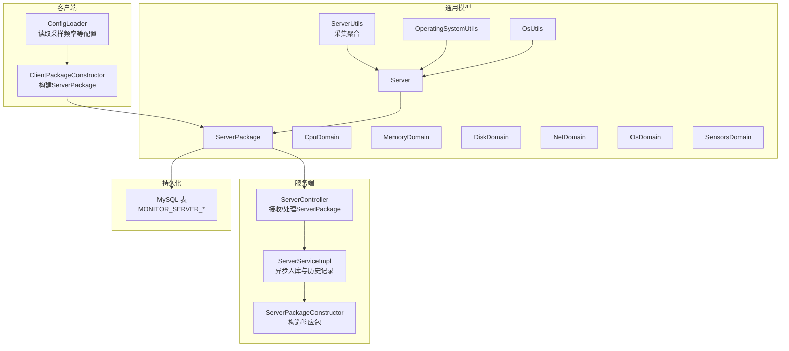
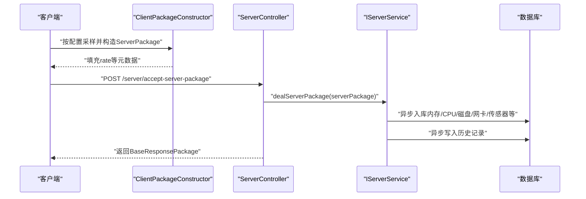
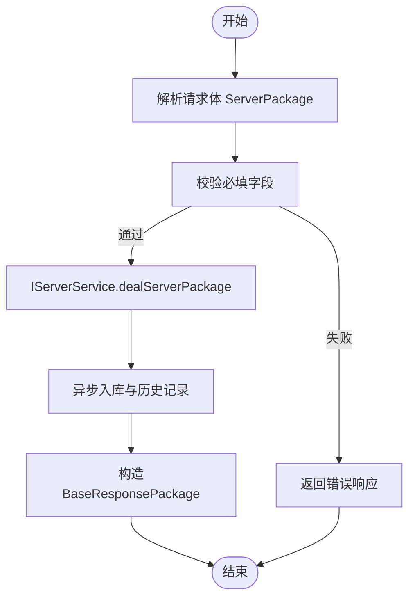
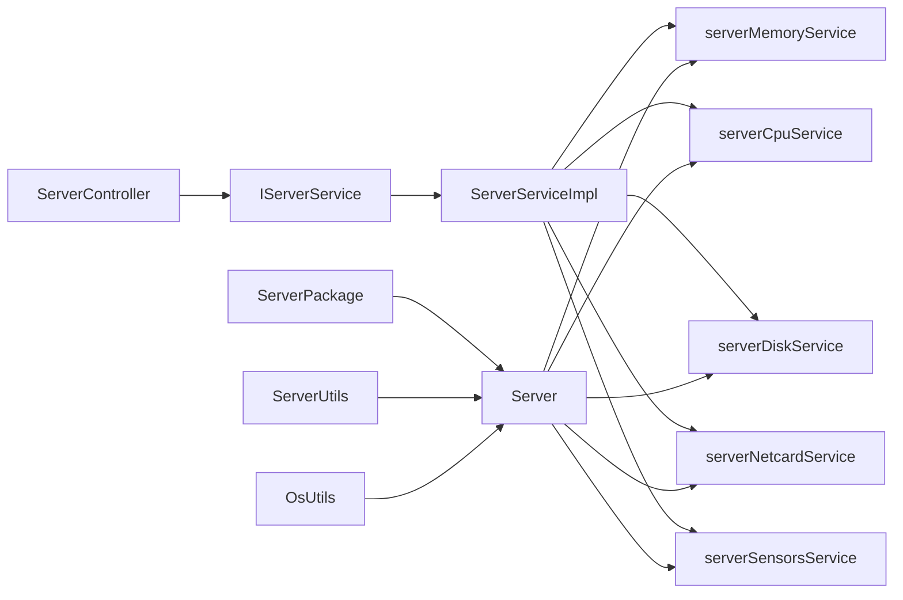
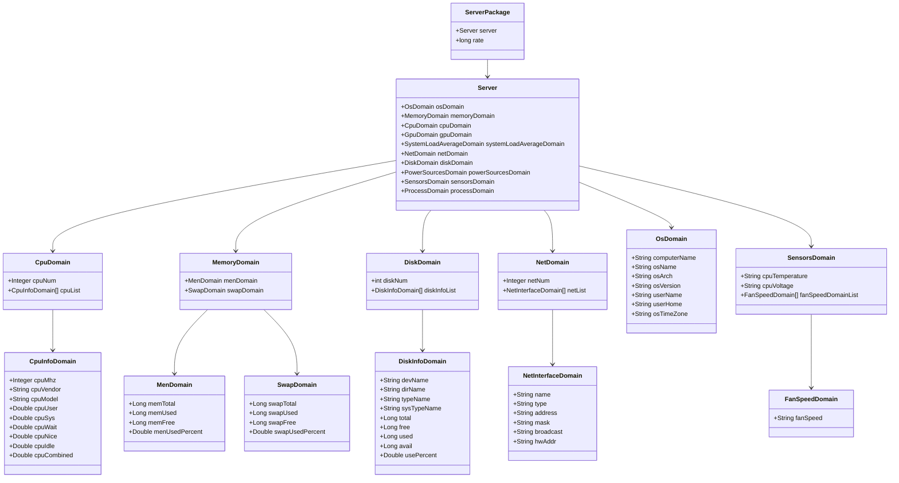

# 服务器监控接口

<cite>
**本文引用的文件**
- [ServerController.java](file://phoenix-server/src/main/java/com/gitee/pifeng/monitoring/server/business/server/controller/ServerController.java)
- [ServerPackage.java](file://phoenix-common/src/main/java/com/gitee/pifeng/monitoring/common/dto/ServerPackage.java)
- [Server.java](file://phoenix-common/src/main/java/com/gitee/pifeng/monitoring/common/domain/Server.java)
- [CpuDomain.java](file://phoenix-common/src/main/java/com/gitee/pifeng/monitoring/common/domain/server/CpuDomain.java)
- [MemoryDomain.java](file://phoenix-common/src/main/java/com/gitee/pifeng/monitoring/common/domain/server/MemoryDomain.java)
- [DiskDomain.java](file://phoenix-common/src/main/java/com/gitee/pifeng/monitoring/common/domain/server/DiskDomain.java)
- [NetDomain.java](file://phoenix-common/src/main/java/com/gitee/pifeng/monitoring/common/domain/server/NetDomain.java)
- [OsDomain.java](file://phoenix-common/src/main/java/com/gitee/pifeng/monitoring/common/domain/server/OsDomain.java)
- [SensorsDomain.java](file://phoenix-common/src/main/java/com/gitee/pifeng/monitoring/common/domain/server/SensorsDomain.java)
- [ServerUtils.java](file://phoenix-common/src/main/java/com/gitee/pifeng/monitoring/common/util/server/ServerUtils.java)
- [OsUtils.java](file://phoenix-common/src/main/java/com/gitee/pifeng/monitoring/common/util/server/OsUtils.java)
- [OperatingSystemUtils.java](file://phoenix-common/src/main/java/com/gitee/pifeng/monitoring/common/util/server/oshi/OperatingSystemUtils.java)
- [ClientPackageConstructor.java](file://phoenix-client/phoenix-client-core/src/main/java/com/gitee/pifeng/monitoring/plug/core/ClientPackageConstructor.java)
- [ConfigLoader.java](file://phoenix-client/phoenix-client-core/src/main/java/com/gitee/pifeng/monitoring/plug/core/ConfigLoader.java)
- [monitoring.properties（客户端）](file://phoenix-client/phoenix-client-core/src/main/resources/monitoring.properties)
- [monitoring.properties（服务端）](file://phoenix-server/src/main/resources/monitoring.properties)
- [ServerServiceImpl.java](file://phoenix-server/src/main/java/com/gitee/pifeng/monitoring/server/business/server/service/impl/ServerServiceImpl.java)
- [phoenix.sql](file://doc/数据库设计/sql/mysql/phoenix.sql)
- [MonitorServerLoadAverage.java](file://phoenix-server/src/main/java/com/gitee/pifeng/monitoring/server/business/server/entity/MonitorServerLoadAverage.java)
- [MonitorServerLoadAverageHistory.java](file://phoenix-server/src/main/java/com/gitee/pifeng/monitoring/server/business/server/entity/MonitorServerLoadAverageHistory.java)
</cite>

## 目录
1. [简介](#简介)
2. [项目结构](#项目结构)
3. [核心组件](#核心组件)
4. [架构总览](#架构总览)
5. [详细组件分析](#详细组件分析)
6. [依赖分析](#依赖分析)
7. [性能考虑](#性能考虑)
8. [故障排查指南](#故障排查指南)
9. [结论](#结论)
10. [附录](#附录)

## 简介
本文件面向“服务器监控接口”的使用者与维护者，聚焦于服务器信息获取接口（/server/accept-server-package）的功能说明、数据结构定义、采样与更新机制、历史数据存储策略，以及跨操作系统的差异处理。目标是帮助读者快速理解从客户端采集到服务端入库与查询的全链路流程，并提供可操作的排障建议。

## 项目结构
该仓库采用多模块结构，与服务器监控接口直接相关的模块与文件如下：
- 服务端控制器与业务：phoenix-server 中的 ServerController、IServerService 实现、ServerPackageConstructor 等
- 通用数据模型与工具：phoenix-common 中的 DTO/Domain、ServerUtils、OsUtils、OperatingSystemUtils 等
- 客户端采集与打包：phoenix-client-core 中的 ClientPackageConstructor、ConfigLoader 及配置文件
- 数据库表结构：doc/数据库设计/sql/mysql/phoenix.sql 中的 MONITOR_* 表

图表来源
- [ServerController.java:59-74](file://phoenix-server/src/main/java/com/gitee/pifeng/monitoring/server/business/server/controller/ServerController.java#L59-L74)
- [ServerPackage.java:21-33](file://phoenix-common/src/main/java/com/gitee/pifeng/monitoring/common/dto/ServerPackage.java#L21-L33)
- [Server.java:23-75](file://phoenix-common/src/main/java/com/gitee/pifeng/monitoring/common/domain/Server.java#L23-L75)
- [CpuDomain.java:23-88](file://phoenix-common/src/main/java/com/gitee/pifeng/monitoring/common/domain/server/CpuDomain.java#L23-L88)
- [MemoryDomain.java:22-95](file://phoenix-common/src/main/java/com/gitee/pifeng/monitoring/common/domain/server/MemoryDomain.java#L22-L95)
- [DiskDomain.java:23-90](file://phoenix-common/src/main/java/com/gitee/pifeng/monitoring/common/domain/server/DiskDomain.java#L23-L90)
- [NetDomain.java:23-65](file://phoenix-common/src/main/java/com/gitee/pifeng/monitoring/common/domain/server/NetDomain.java#L23-L65)
- [OsDomain.java:21-55](file://phoenix-common/src/main/java/com/gitee/pifeng/monitoring/common/domain/server/OsDomain.java#L21-L55)
- [SensorsDomain.java:23-54](file://phoenix-common/src/main/java/com/gitee/pifeng/monitoring/common/domain/server/SensorsDomain.java#L23-L54)
- [ServerUtils.java:68-79](file://phoenix-common/src/main/java/com/gitee/pifeng/monitoring/common/util/server/ServerUtils.java#L68-L79)
- [OperatingSystemUtils.java:25-27](file://phoenix-common/src/main/java/com/gitee/pifeng/monitoring/common/util/server/osgi/OperatingSystemUtils.java#L25-L27)
- [OsUtils.java:56-58](file://phoenix-common/src/main/java/com/gitee/pifeng/monitoring/common/util/server/OsUtils.java#L56-L58)
- [ClientPackageConstructor.java:250-258](file://phoenix-client/phoenix-client-core/src/main/java/com/gitee/pifeng/monitoring/plug/core/ClientPackageConstructor.java#L250-L258)
- [ConfigLoader.java:559-573](file://phoenix-client/phoenix-client-core/src/main/java/com/gitee/pifeng/monitoring/plug/core/ConfigLoader.java#L559-L573)
- [ServerServiceImpl.java:199-223](file://phoenix-server/src/main/java/com/gitee/pifeng/monitoring/server/business/server/service/impl/ServerServiceImpl.java#L199-L223)
- [phoenix.sql:656-707](file://doc/数据库设计/sql/mysql/phoenix.sql#L656-L707)

章节来源
- [ServerController.java:35-77](file://phoenix-server/src/main/java/com/gitee/pifeng/monitoring/server/business/server/controller/ServerController.java#L35-L77)
- [ServerPackage.java:15-33](file://phoenix-common/src/main/java/com/gitee/pifeng/monitoring/common/dto/ServerPackage.java#L15-L33)
- [Server.java:16-75](file://phoenix-common/src/main/java/com/gitee/pifeng/monitoring/common/domain/Server.java#L16-L75)

## 核心组件
- 接口入口：/server/accept-server-package（POST），由 ServerController 提供
- 请求体：ServerPackage（包含 Server 与采样频率 rate）
- 业务处理：IServerService 实现（异步入库与历史记录）
- 响应体：BaseResponsePackage（由 ServerPackageConstructor 构造）

章节来源
- [ServerController.java:59-74](file://phoenix-server/src/main/java/com/gitee/pifeng/monitoring/server/business/server/controller/ServerController.java#L59-L74)
- [ServerPackage.java:21-33](file://phoenix-common/src/main/java/com/gitee/pifeng/monitoring/common/dto/ServerPackage.java#L21-L33)

## 架构总览
下图展示了从客户端采集到服务端入库的关键交互：

图表来源
- [ClientPackageConstructor.java:250-258](file://phoenix-client/phoenix-client-core/src/main/java/com/gitee/pifeng/monitoring/plug/core/ClientPackageConstructor.java#L250-L258)
- [ServerController.java:59-74](file://phoenix-server/src/main/java/com/gitee/pifeng/monitoring/server/business/server/controller/ServerController.java#L59-L74)
- [ServerServiceImpl.java:199-223](file://phoenix-server/src/main/java/com/gitee/pifeng/monitoring/server/business/server/service/impl/ServerServiceImpl.java#L199-L223)

## 详细组件分析

### 接口定义与调用流程
- 路径：/server/accept-server-package
- 方法：POST
- 请求体：ServerPackage（见下节“数据结构”）
- 响应体：BaseResponsePackage（由 ServerPackageConstructor 统一构造）
- 处理耗时：若超过1秒会记录告警日志

图表来源
- [ServerController.java:59-74](file://phoenix-server/src/main/java/com/gitee/pifeng/monitoring/server/business/server/controller/ServerController.java#L59-L74)
- [ServerServiceImpl.java:199-223](file://phoenix-server/src/main/java/com/gitee/pifeng/monitoring/server/business/server/service/impl/ServerServiceImpl.java#L199-L223)

章节来源
- [ServerController.java:59-74](file://phoenix-server/src/main/java/com/gitee/pifeng/monitoring/server/business/server/controller/ServerController.java#L59-L74)

### 数据结构说明

#### ServerPackage（服务器信息包）
- 字段
  - server：Server 对象，承载操作系统、内存、CPU、GPU、系统负载、网卡、磁盘、电源、传感器、进程等子域
  - rate：long，采样频率（秒），来自客户端配置
- 单位与换算
  - CPU 使用率：百分比（0~100）
  - 内存/磁盘/交换区容量：byte
  - 网卡速率：bps（字节/秒）
  - 传感器温度：摄氏度；电压：伏特；风扇转速：rpm
- 关联实体
  - 服务端入库涉及 MONITOR_SERVER_* 系列表（内存、CPU、磁盘、网卡、传感器、负载等）

章节来源
- [ServerPackage.java:21-33](file://phoenix-common/src/main/java/com/gitee/pifeng/monitoring/common/dto/ServerPackage.java#L21-L33)
- [Server.java:23-75](file://phoenix-common/src/main/java/com/gitee/pifeng/monitoring/common/domain/Server.java#L23-L75)

#### Server（服务器聚合域）
- 子域
  - osDomain：操作系统信息
  - memoryDomain：内存与交换区
  - cpuDomain：CPU 列表与使用率
  - gpuDomain：GPU 信息（如可用）
  - systemLoadAverageDomain：系统平均负载
  - netDomain：网卡列表与流量
  - diskDomain：磁盘分区列表与使用率
  - powerSourcesDomain：电源信息
  - sensorsDomain：温度/电压/风扇等
  - processDomain：进程信息

章节来源
- [Server.java:23-75](file://phoenix-common/src/main/java/com/gitee/pifeng/monitoring/common/domain/Server.java#L23-L75)

#### 各子域关键字段与单位
- OsDomain
  - 字段：computerName、osName、osArch、osVersion、userName、userHome、osTimeZone
- MemoryDomain.MenDomain
  - 字段：memTotal、memUsed、memFree、menUsedPercent（byte）
- MemoryDomain.SwapDomain
  - 字段：swapTotal、swapUsed、swapFree、swapUsedPercent（byte）
- CpuDomain.CpuInfoDomain
  - 字段：cpuMhz（MHz）、cpuVendor、cpuModel、cpuUser、cpuSys、cpuWait、cpuNice、cpuIdle、cpuCombined（百分比）
- NetDomain.NetInterfaceDomain
  - 字段：name、type、address、mask、broadcast、hwAddr、描述等；流量相关字段在历史表中体现
- DiskDomain.DiskInfoDomain
  - 字段：devName、dirName、typeName、sysTypeName、total/free/used/avail（byte）、usePercent
- SensorsDomain.FanSpeedDomain
  - 字段：fanSpeed（rpm）

章节来源
- [OsDomain.java:21-55](file://phoenix-common/src/main/java/com/gitee/pifeng/monitoring/common/domain/server/OsDomain.java#L21-L55)
- [MemoryDomain.java:41-92](file://phoenix-common/src/main/java/com/gitee/pifeng/monitoring/common/domain/server/MemoryDomain.java#L41-L92)
- [CpuDomain.java:39-85](file://phoenix-common/src/main/java/com/gitee/pifeng/monitoring/common/domain/server/CpuDomain.java#L39-L85)
- [NetDomain.java:39-65](file://phoenix-common/src/main/java/com/gitee/pifeng/monitoring/common/domain/server/NetDomain.java#L39-L65)
- [DiskDomain.java:40-87](file://phoenix-common/src/main/java/com/gitee/pifeng/monitoring/common/domain/server/DiskDomain.java#L40-L87)
- [SensorsDomain.java:45-51](file://phoenix-common/src/main/java/com/gitee/pifeng/monitoring/common/domain/server/SensorsDomain.java#L45-L51)

### 采样频率与数据更新机制
- 客户端采样频率
  - 来源：monitoring.server-info.rate（秒），默认值见配置文件
  - 最小限制：30 秒
- 服务端接收频率
  - 服务端配置 monitoring.server-info.rate 控制是否启用与频率
- 数据更新策略
  - 实时更新：内存、CPU、磁盘、网卡、传感器等当前值写入“当前表”
  - 历史记录：同时写入对应“历史表”，用于趋势分析与回放

章节来源
- [ConfigLoader.java:559-573](file://phoenix-client/phoenix-client-core/src/main/java/com/gitee/pifeng/monitoring/plug/core/ConfigLoader.java#L559-L573)
- [monitoring.properties（客户端）:32-33](file://phoenix-client/phoenix-client-core/src/main/resources/monitoring.properties#L32-L33)
- [monitoring.properties（服务端）:32-33](file://phoenix-server/src/main/resources/monitoring.properties#L32-L33)
- [ServerServiceImpl.java:199-223](file://phoenix-server/src/main/java/com/gitee/pifeng/monitoring/server/business/server/service/impl/ServerServiceImpl.java#L199-L223)

### 历史数据存储
- 历史表命名规则：MONITOR_SERVER_*_HISTORY
- 典型历史表
  - MONITOR_SERVER_LOAD_AVERAGE_HISTORY：系统平均负载历史
  - MONITOR_SERVER_CPU_HISTORY：CPU 历史
  - MONITOR_SERVER_NETCARD_HISTORY：网卡历史
- 索引与时间字段
  - 常见包含 IP、插入时间、更新时间等索引，便于查询与清理

章节来源
- [MonitorServerLoadAverageHistory.java:27-77](file://phoenix-server/src/main/java/com/gitee/pifeng/monitoring/server/business/server/entity/MonitorServerLoadAverageHistory.java#L27-L77)
- [phoenix.sql:684-707](file://doc/数据库设计/sql/mysql/phoenix.sql#L684-L707)
- [phoenix.sql:926-958](file://doc/数据库设计/sql/mysql/phoenix.sql#L926-L958)

### 不同操作系统下的差异处理
- 操作系统识别
  - 通过 OsUtils.isWindowsOs 判断是否 Windows
- 采集差异
  - 采集工具基于 OSHI（OperatingSystemUtils），统一抽象上层数据模型
  - Windows/Linux 下字段语义一致，但具体数值来源与精度可能不同
- 传感器与电源
  - 传感器/风扇/电压等在部分平台不可用时为空，属于正常现象

章节来源
- [OsUtils.java:56-58](file://phoenix-common/src/main/java/com/gitee/pifeng/monitoring/common/util/server/OsUtils.java#L56-L58)
- [OperatingSystemUtils.java:25-27](file://phoenix-common/src/main/java/com/gitee/pifeng/monitoring/common/util/server/osgi/OperatingSystemUtils.java#L25-L27)
- [ServerUtils.java:68-79](file://phoenix-common/src/main/java/com/gitee/pifeng/monitoring/common/util/server/ServerUtils.java#L68-L79)

### 客户端构建与发送
- 构建流程
  - ClientPackageConstructor.structureServerPackage 生成 ServerPackage
  - 自动注入 rate（来自 ConfigLoader）
- 配置要点
  - monitoring.server-info.enable：是否采集
  - monitoring.server-info.rate：采样周期（秒）
  - monitoring.server-info.ip：本机IP（可选）
  - monitoring.server-info.user-sigar-enable：是否使用 Sigar（可选）

章节来源
- [ClientPackageConstructor.java:250-258](file://phoenix-client/phoenix-client-core/src/main/java/com/gitee/pifeng/monitoring/plug/core/ClientPackageConstructor.java#L250-L258)
- [ConfigLoader.java:559-573](file://phoenix-client/phoenix-client-core/src/main/java/com/gitee/pifeng/monitoring/plug/core/ConfigLoader.java#L559-L573)
- [monitoring.properties（客户端）:31-37](file://phoenix-client/phoenix-client-core/src/main/resources/monitoring.properties#L31-L37)

## 依赖分析
- 控制器依赖
  - ServerController 依赖 ServerPackageConstructor（构造响应）与 IServerService（业务处理）
- 业务层依赖
  - ServerServiceImpl 异步调用多个服务（内存、CPU、磁盘、网卡、传感器、进程等）入库
- 模型依赖
  - ServerPackage 依赖 Server；Server 聚合各子域模型
- 工具依赖
  - ServerUtils 聚合 OsUtils、OSHI 工具类进行采集
- 配置依赖
  - ConfigLoader 从 properties 加载采样频率等参数

图表来源
- [ServerController.java:35-47](file://phoenix-server/src/main/java/com/gitee/pifeng/monitoring/server/business/server/controller/ServerController.java#L35-L47)
- [ServerServiceImpl.java:199-223](file://phoenix-server/src/main/java/com/gitee/pifeng/monitoring/server/business/server/service/impl/ServerServiceImpl.java#L199-L223)
- [ServerPackage.java:21-33](file://phoenix-common/src/main/java/com/gitee/pifeng/monitoring/common/dto/ServerPackage.java#L21-L33)
- [Server.java:23-75](file://phoenix-common/src/main/java/com/gitee/pifeng/monitoring/common/domain/Server.java#L23-L75)
- [ServerUtils.java:68-79](file://phoenix-common/src/main/java/com/gitee/pifeng/monitoring/common/util/server/ServerUtils.java#L68-L79)
- [OsUtils.java:56-58](file://phoenix-common/src/main/java/com/gitee/pifeng/monitoring/common/util/server/OsUtils.java#L56-L58)

章节来源
- [ServerController.java:35-47](file://phoenix-server/src/main/java/com/gitee/pifeng/monitoring/server/business/server/controller/ServerController.java#L35-L47)
- [ServerServiceImpl.java:199-223](file://phoenix-server/src/main/java/com/gitee/pifeng/monitoring/server/business/server/service/impl/ServerServiceImpl.java#L199-L223)

## 性能考虑
- 异步入库：服务端对内存、CPU、磁盘、网卡、传感器、进程等分别异步入库，降低单次请求阻塞
- 日志告警：当处理耗时超过1秒时记录警告日志，便于定位瓶颈
- 历史表索引：建议在高频查询字段（如 IP、INSERT_TIME）建立索引，提升查询效率

章节来源
- [ServerServiceImpl.java:199-223](file://phoenix-server/src/main/java/com/gitee/pifeng/monitoring/server/business/server/service/impl/ServerServiceImpl.java#L199-L223)
- [ServerController.java:64-73](file://phoenix-server/src/main/java/com/gitee/pifeng/monitoring/server/business/server/controller/ServerController.java#L64-L73)

## 故障排查指南
- 常见问题
  - 采样频率过低或过高：检查客户端 monitoring.server-info.rate 与服务端 monitoring.server-info.rate 配置一致性
  - 数据未入库：确认 IServerService 的异步入库线程池与数据库连接正常
  - 响应缓慢：关注服务端处理耗时日志，排查数据库写入性能
- 建议步骤
  - 核对配置文件中的采样频率与启用开关
  - 查看服务端日志中“处理服务器信息包耗时”告警
  - 检查数据库 MONITOR_SERVER_* 与 *_HISTORY 表是否正常写入

章节来源
- [monitoring.properties（客户端）:31-37](file://phoenix-client/phoenix-client-core/src/main/resources/monitoring.properties#L31-L37)
- [monitoring.properties（服务端）:31-33](file://phoenix-server/src/main/resources/monitoring.properties#L31-L33)
- [ServerController.java:64-73](file://phoenix-server/src/main/java/com/gitee/pifeng/monitoring/server/business/server/controller/ServerController.java#L64-L73)

## 结论
服务器监控接口以 ServerPackage 为核心载体，通过客户端定时采样与服务端异步入库，实现了对 CPU、内存、磁盘、网卡、传感器等关键指标的实时监控与历史追踪。跨平台差异由 OSHI 工具统一抽象，确保字段语义一致。建议在生产环境中合理设置采样频率、优化数据库索引，并结合日志与历史表进行持续观测与排障。

## 附录

### API 定义概览
- 路径：/server/accept-server-package
- 方法：POST
- 请求体：ServerPackage
- 响应体：BaseResponsePackage
- 说明：服务端接收后异步入库并返回统一响应包

章节来源
- [ServerController.java:59-74](file://phoenix-server/src/main/java/com/gitee/pifeng/monitoring/server/business/server/controller/ServerController.java#L59-L74)

### 数据模型类图

图表来源
- [ServerPackage.java:21-33](file://phoenix-common/src/main/java/com/gitee/pifeng/monitoring/common/dto/ServerPackage.java#L21-L33)
- [Server.java:23-75](file://phoenix-common/src/main/java/com/gitee/pifeng/monitoring/common/domain/Server.java#L23-L75)
- [CpuDomain.java:23-88](file://phoenix-common/src/main/java/com/gitee/pifeng/monitoring/common/domain/server/CpuDomain.java#L23-L88)
- [MemoryDomain.java:22-95](file://phoenix-common/src/main/java/com/gitee/pifeng/monitoring/common/domain/server/MemoryDomain.java#L22-L95)
- [DiskDomain.java:23-90](file://phoenix-common/src/main/java/com/gitee/pifeng/monitoring/common/domain/server/DiskDomain.java#L23-L90)
- [NetDomain.java:23-65](file://phoenix-common/src/main/java/com/gitee/pifeng/monitoring/common/domain/server/NetDomain.java#L23-L65)
- [OsDomain.java:21-55](file://phoenix-common/src/main/java/com/gitee/pifeng/monitoring/common/domain/server/OsDomain.java#L21-L55)
- [SensorsDomain.java:23-54](file://phoenix-common/src/main/java/com/gitee/pifeng/monitoring/common/domain/server/SensorsDomain.java#L23-L54)