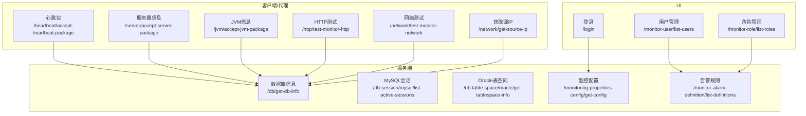
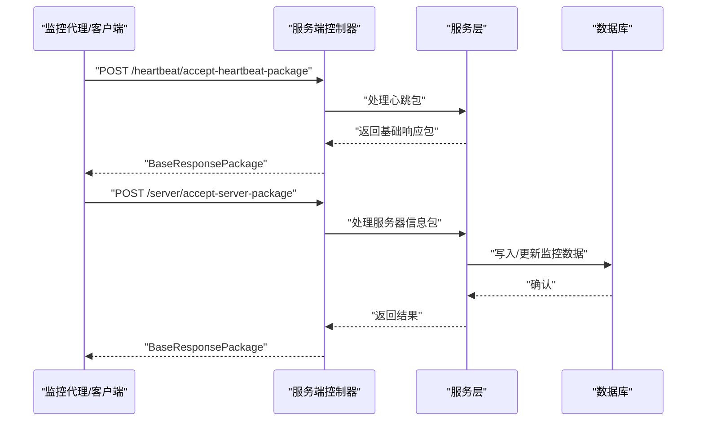
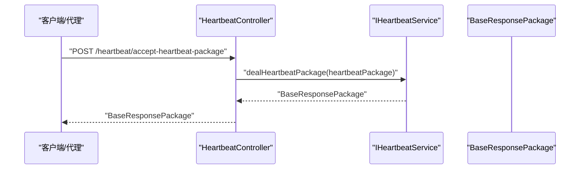
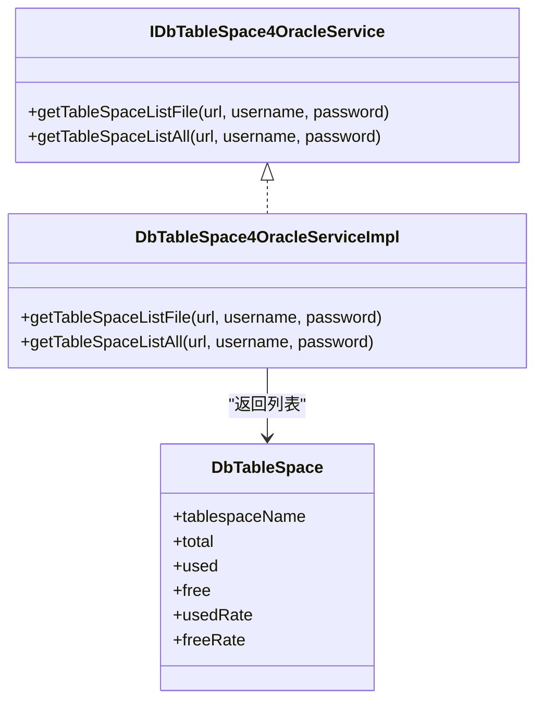
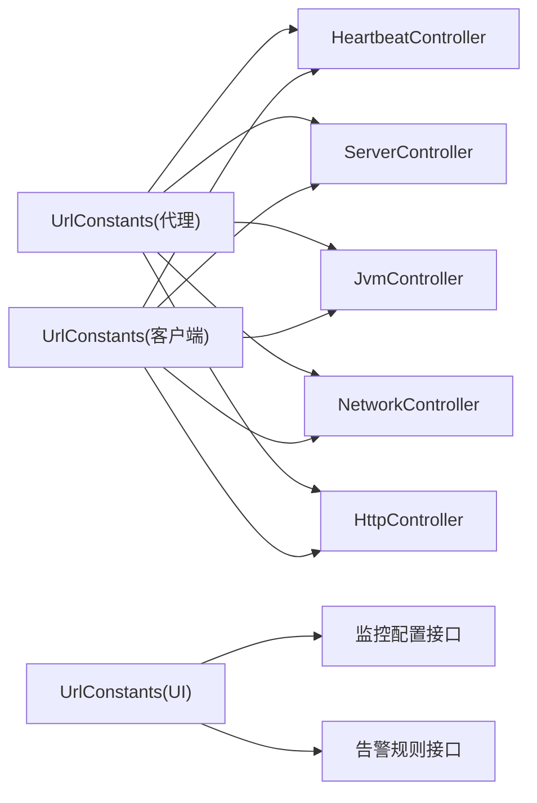

# 核心API接口

<cite>
**本文引用的文件**
- [UrlConstants.java](file://phoenix-agent/src/main/java/com/gitee/pifeng/monitoring/agent/constant/UrlConstants.java)
- [HeartbeatController.java](file://phoenix-agent/src/main/java/com/gitee/pifeng/monitoring/agent/business/client/controller/HeartbeatController.java)
- [ServerController.java](file://phoenix-agent/src/main/java/com/gitee/pifeng/monitoring/agent/business/client/controller/ServerController.java)
- [JvmController.java](file://phoenix-agent/src/main/java/com/gitee/pifeng/monitoring/agent/business/client/controller/JvmController.java)
- [HttpController.java](file://phoenix-agent/src/main/java/com/gitee/pifeng/monitoring/agent/business/client/controller/HttpController.java)
- [NetworkController.java](file://phoenix-agent/src/main/java/com/gitee/pifeng/monitoring/agent/business/client/controller/NetworkController.java)
- [UrlConstants.java](file://phoenix-client/phoenix-client-core/src/main/java/com/gitee/pifeng/monitoring/plug/constant/UrlConstants.java)
- [UrlConstants.java](file://phoenix-ui/src/main/java/com/gitee/pifeng/monitoring/ui/constant/UrlConstants.java)
- [DbController.java](file://phoenix-server/src/main/java/com/gitee/pifeng/monitoring/server/business/server/controller/DbController.java)
- [DbTableSpace4OracleServiceImpl.java](file://phoenix-server/src/main/java/com/gitee/pifeng/monitoring/server/business/server/service/impl/DbTableSpace4OracleServiceImpl.java)
- [IDbTableSpace4OracleService.java](file://phoenix-server/src/main/java/com/gitee/pifeng/monitoring/server/business/server/service/IDbTableSpace4OracleService.java)
- [DbTableSpace.java](file://phoenix-server/src/main/java/com/gitee/pifeng/monitoring/server/business/server/domain/DbTableSpace.java)
- [DbSession4MysqlController.java](file://phoenix-ui/src/main/java/com/gitee/pifeng/monitoring/ui/business/web/controller/DbSession4MysqlController.java)
- [DbTableSpace4OracleController.java](file://phoenix-ui/src/main/java/com/gitee/pifeng/monitoring/ui/business/web/controller/DbTableSpace4OracleController.java)
- [LoginController.java](file://phoenix-ui/src/main/java/com/gitee/pifeng/monitoring/ui/business/web/controller/LoginController.java)
- [MonitorUserController.java](file://phoenix-ui/src/main/java/com/gitee/pifeng/monitoring/ui/business/web/controller/MonitorUserController.java)
- [IMonitorUserService.java](file://phoenix-ui/src/main/java/com/gitee/pifeng/monitoring/ui/business/web/service/IMonitorUserService.java)
- [MonitorUserServiceImpl.java](file://phoenix-ui/src/main/java/com/gitee/pifeng/monitoring/ui/business/web/service/impl/MonitorUserServiceImpl.java)
- [MonitoringConfigPropertiesLoader.java](file://phoenix-server/src/main/java/com/gitee/pifeng/monitoring/server/business/server/core/MonitoringConfigPropertiesLoader.java)
- [MonitoringAlarmProperties.java](file://phoenix-common/phoenix-common-core/src/main/java/com/gitee/pifeng/monitoring/common/property/server/MonitoringAlarmProperties.java)
- [MonitoringNetworkStatusProperties.java](file://phoenix-common/phoenix-common-core/src/main/java/com/gitee/pifeng/monitoring/common/property/server/MonitoringNetworkStatusProperties.java)
- [IAlarmDefinitionService.java](file://phoenix-server/src/main/java/com/gitee/pifeng/monitoring/server/business/server/service/IAlarmDefinitionService.java)
- [AlarmDefinitionServiceImpl.java](file://phoenix-server/src/main/java/com/gitee/pifeng/monitoring/server/business/server/service/impl/AlarmDefinitionServiceImpl.java)
- [MonitorAlarmDefinition.java](file://phoenix-ui/src/main/java/com/gitee/pifeng/monitoring/ui/business/web/entity/MonitorAlarmDefinition.java)
</cite>

## 目录
1. [简介](#简介)
2. [项目结构](#项目结构)
3. [核心组件](#核心组件)
4. [架构总览](#架构总览)
5. [详细组件分析](#详细组件分析)
6. [依赖关系分析](#依赖关系分析)
7. [性能考量](#性能考量)
8. [故障排查指南](#故障排查指南)
9. [结论](#结论)
10. [附录](#附录)

## 简介
本文件面向Phoenix监控系统的使用者与集成开发者，系统化梳理核心API接口，覆盖以下主题：
- 监控数据采集API：心跳包、服务器、JVM、HTTP、网络等
- 数据库监控API：连接信息、会话管理、表空间监控
- 用户管理API：登录认证、用户信息、角色权限
- 配置管理API：监控配置获取、告警规则管理
对每个API提供请求参数说明、响应数据结构、错误码定义与使用示例指引。

## 项目结构
Phoenix采用多模块分层架构：
- 客户端插件与代理模块负责采集与上报
- 服务端模块负责接收、处理与持久化
- UI模块负责用户交互与业务操作
- 公共模块提供通用常量、领域模型与工具

图表来源
- [UrlConstants.java:29-126](file://phoenix-agent/src/main/java/com/gitee/pifeng/monitoring/agent/constant/UrlConstants.java#L29-L126)
- [UrlConstants.java:29-56](file://phoenix-client/phoenix-client-core/src/main/java/com/gitee/pifeng/monitoring/plug/constant/UrlConstants.java#L29-L56)
- [UrlConstants.java:29-101](file://phoenix-ui/src/main/java/com/gitee/pifeng/monitoring/ui/constant/UrlConstants.java#L29-L101)

章节来源
- [UrlConstants.java:29-126](file://phoenix-agent/src/main/java/com/gitee/pifeng/monitoring/agent/constant/UrlConstants.java#L29-L126)
- [UrlConstants.java:29-56](file://phoenix-client/phoenix-client-core/src/main/java/com/gitee/pifeng/monitoring/plug/constant/UrlConstants.java#L29-L56)
- [UrlConstants.java:29-101](file://phoenix-ui/src/main/java/com/gitee/pifeng/monitoring/ui/constant/UrlConstants.java#L29-L101)

## 核心组件
- URL常量与路由映射：统一管理服务端API根路径与各端点，确保客户端、代理与UI一致
- 控制器层：封装HTTP端点、请求体与响应体、参数校验与异常处理
- 服务层：执行业务逻辑，如数据库查询、会话管理、表空间统计
- 领域模型：抽象监控数据结构，如数据库表空间、告警定义等

章节来源
- [UrlConstants.java:29-126](file://phoenix-agent/src/main/java/com/gitee/pifeng/monitoring/agent/constant/UrlConstants.java#L29-L126)
- [HeartbeatController.java:47-53](file://phoenix-agent/src/main/java/com/gitee/pifeng/monitoring/agent/business/client/controller/HeartbeatController.java#L47-L53)
- [ServerController.java:47-53](file://phoenix-agent/src/main/java/com/gitee/pifeng/monitoring/agent/business/client/controller/ServerController.java#L47-L53)
- [JvmController.java:47-53](file://phoenix-agent/src/main/java/com/gitee/pifeng/monitoring/agent/business/client/controller/JvmController.java#L47-L53)
- [HttpController.java:52-58](file://phoenix-agent/src/main/java/com/gitee/pifeng/monitoring/agent/business/client/controller/HttpController.java#L52-L58)
- [NetworkController.java:52-77](file://phoenix-agent/src/main/java/com/gitee/pifeng/monitoring/agent/business/client/controller/NetworkController.java#L52-L77)

## 架构总览
客户端/代理通过统一URL常量向服务端发送监控数据包；服务端控制器接收请求，调用服务层处理后返回标准响应；UI通过相同URL常量进行配置与管理操作。

图表来源
- [HeartbeatController.java:47-53](file://phoenix-agent/src/main/java/com/gitee/pifeng/monitoring/agent/business/client/controller/HeartbeatController.java#L47-L53)
- [ServerController.java:47-53](file://phoenix-agent/src/main/java/com/gitee/pifeng/monitoring/agent/business/client/controller/ServerController.java#L47-L53)

## 详细组件分析

### 心跳包接口
- 接口路径：/heartbeat/accept-heartbeat-package
- 方法：POST
- 请求体：心跳包对象（加密包装）
- 响应体：基础响应包
- 用途：客户端定时上报心跳，服务端验证并返回确认

图表来源
- [HeartbeatController.java:47-53](file://phoenix-agent/src/main/java/com/gitee/pifeng/monitoring/agent/business/client/controller/HeartbeatController.java#L47-L53)
- [UrlConstants.java:34-34](file://phoenix-agent/src/main/java/com/gitee/pifeng/monitoring/agent/constant/UrlConstants.java#L34-L34)
- [UrlConstants.java:34-34](file://phoenix-client/phoenix-client-core/src/main/java/com/gitee/pifeng/monitoring/plug/constant/UrlConstants.java#L34-L34)

章节来源
- [HeartbeatController.java:47-53](file://phoenix-agent/src/main/java/com/gitee/pifeng/monitoring/agent/business/client/controller/HeartbeatController.java#L47-L53)
- [UrlConstants.java:34-34](file://phoenix-agent/src/main/java/com/gitee/pifeng/monitoring/agent/constant/UrlConstants.java#L34-L34)
- [UrlConstants.java:34-34](file://phoenix-client/phoenix-client-core/src/main/java/com/gitee/pifeng/monitoring/plug/constant/UrlConstants.java#L34-L34)

### 服务器监控接口
- 接口路径：/server/accept-server-package
- 方法：POST
- 请求体：服务器信息包（加密包装）
- 响应体：基础响应包
- 用途：上报服务器资源与运行状态

章节来源
- [ServerController.java:47-53](file://phoenix-agent/src/main/java/com/gitee/pifeng/monitoring/agent/business/client/controller/ServerController.java#L47-L53)
- [UrlConstants.java:44-44](file://phoenix-agent/src/main/java/com/gitee/pifeng/monitoring/agent/constant/UrlConstants.java#L44-L44)
- [UrlConstants.java:49-49](file://phoenix-client/phoenix-client-core/src/main/java/com/gitee/pifeng/monitoring/plug/constant/UrlConstants.java#L49-L49)

### JVM监控接口
- 接口路径：/jvm/accept-jvm-package
- 方法：POST
- 请求体：JVM信息包（加密包装）
- 响应体：基础响应包
- 用途：上报JVM堆栈、线程、GC等指标

章节来源
- [JvmController.java:47-53](file://phoenix-agent/src/main/java/com/gitee/pifeng/monitoring/agent/business/client/controller/JvmController.java#L47-L53)
- [UrlConstants.java:49-49](file://phoenix-agent/src/main/java/com/gitee/pifeng/monitoring/agent/constant/UrlConstants.java#L49-L49)
- [UrlConstants.java:54-54](file://phoenix-client/phoenix-client-core/src/main/java/com/gitee/pifeng/monitoring/plug/constant/UrlConstants.java#L54-L54)

### HTTP监控接口
- 接口路径：/http/test-monitor-http
- 方法：POST
- 请求体：基础请求包（加密包装）
- 响应体：基础响应包
- 用途：测试HTTP连通性与可用性

章节来源
- [HttpController.java:52-58](file://phoenix-agent/src/main/java/com/gitee/pifeng/monitoring/agent/business/client/controller/HttpController.java#L52-L58)
- [UrlConstants.java:74-74](file://phoenix-agent/src/main/java/com/gitee/pifeng/monitoring/agent/constant/UrlConstants.java#L74-L74)
- [UrlConstants.java:84-84](file://phoenix-ui/src/main/java/com/gitee/pifeng/monitoring/ui/constant/UrlConstants.java#L84-L84)

### 网络监控接口
- 接口路径
  - /network/get-source-ip：获取被监控网络源IP地址
  - /network/test-monitor-network：测试网络连通性
- 方法：POST
- 请求体：基础请求包（加密包装）
- 响应体：基础响应包
- 用途：网络连通性探测与源IP识别

章节来源
- [NetworkController.java:52-77](file://phoenix-agent/src/main/java/com/gitee/pifeng/monitoring/agent/business/client/controller/NetworkController.java#L52-L77)
- [UrlConstants.java:64-69](file://phoenix-agent/src/main/java/com/gitee/pifeng/monitoring/agent/constant/UrlConstants.java#L64-L69)
- [UrlConstants.java:39-39](file://phoenix-ui/src/main/java/com/gitee/pifeng/monitoring/ui/constant/UrlConstants.java#L39-L39)
- [UrlConstants.java:94-94](file://phoenix-ui/src/main/java/com/gitee/pifeng/monitoring/ui/constant/UrlConstants.java#L94-L94)

### 数据库监控API

#### 数据库连接信息获取
- 接口路径：/db/get-db-info
- 方法：GET/POST（依据具体实现）
- 请求参数：无或由服务端配置决定
- 响应体：数据库连接信息集合
- 用途：获取已配置数据库实例的连接信息

章节来源
- [DbController.java:1-33](file://phoenix-server/src/main/java/com/gitee/pifeng/monitoring/server/business/server/controller/DbController.java#L1-L33)

#### 数据库会话管理（MySQL）
- 接口路径：/db-session/mysql/list-active-sessions
- 方法：GET
- 查询参数：
  - current：当前页（必填）
  - size：每页条数（必填）
  - id：数据库实例ID（必填）
  - user/host/db/command/state/info：过滤条件（可选）
- 响应体：分页结果（含会话列表）
- 用途：查看与筛选MySQL活动会话

章节来源
- [DbSession4MysqlController.java:65-69](file://phoenix-ui/src/main/java/com/gitee/pifeng/monitoring/ui/business/web/controller/DbSession4MysqlController.java#L65-L69)

#### 数据库表空间监控（Oracle）
- 接口路径
  - /db-table-space/oracle/get-tablespace-list-file：按文件维度获取表空间列表
  - /db-table-space/oracle/get-tablespace-list-all：获取全部表空间列表
- 方法：GET
- 查询参数：
  - current：当前页（必填）
  - size：每页条数（必填）
  - id：数据库实例ID（必填）
- 响应体：分页结果（含表空间详情）
- 用途：查看Oracle表空间使用情况

图表来源
- [IDbTableSpace4OracleService.java:16-48](file://phoenix-server/src/main/java/com/gitee/pifeng/monitoring/server/business/server/service/IDbTableSpace4OracleService.java#L16-L48)
- [DbTableSpace4OracleServiceImpl.java:24-46](file://phoenix-server/src/main/java/com/gitee/pifeng/monitoring/server/business/server/service/impl/DbTableSpace4OracleServiceImpl.java#L24-L46)
- [DbTableSpace.java:15-54](file://phoenix-server/src/main/java/com/gitee/pifeng/monitoring/server/business/server/domain/DbTableSpace.java#L15-L54)

章节来源
- [DbTableSpace4OracleServiceImpl.java:24-46](file://phoenix-server/src/main/java/com/gitee/pifeng/monitoring/server/business/server/service/impl/DbTableSpace4OracleServiceImpl.java#L24-L46)
- [IDbTableSpace4OracleService.java:16-48](file://phoenix-server/src/main/java/com/gitee/pifeng/monitoring/server/business/server/service/IDbTableSpace4OracleService.java#L16-L48)
- [DbTableSpace.java:15-54](file://phoenix-server/src/main/java/com/gitee/pifeng/monitoring/server/business/server/domain/DbTableSpace.java#L15-L54)

### 用户管理API

#### 登录认证接口
- 接口路径：/login
- 方法：GET（页面访问）
- 响应：登录页面视图
- 用途：用户访问登录页面

章节来源
- [LoginController.java:41-43](file://phoenix-ui/src/main/java/com/gitee/pifeng/monitoring/ui/business/web/controller/LoginController.java#L41-L43)

#### 用户信息管理
- 接口路径：/monitor-user/list-users
- 方法：GET
- 响应：用户列表页面
- 用途：展示与管理监控用户

章节来源
- [MonitorUserController.java:63-67](file://phoenix-ui/src/main/java/com/gitee/pifeng/monitoring/ui/business/web/controller/MonitorUserController.java#L63-L67)

#### 角色权限管理
- 接口路径：/monitor-role/list-roles
- 方法：GET
- 响应：角色列表页面
- 用途：展示与管理角色权限

章节来源
- [MonitorUserController.java:63-67](file://phoenix-ui/src/main/java/com/gitee/pifeng/monitoring/ui/business/web/controller/MonitorUserController.java#L63-L67)

### 配置管理API

#### 监控配置获取
- 接口路径：/monitoring-properties-config/get-config
- 方法：GET/POST（依据具体实现）
- 响应体：监控配置对象（包含告警、网络、HTTP等子配置）
- 用途：获取当前监控配置

章节来源
- [MonitoringConfigPropertiesLoader.java:126-144](file://phoenix-server/src/main/java/com/gitee/pifeng/monitoring/server/business/server/core/MonitoringConfigPropertiesLoader.java#L126-L144)
- [MonitoringAlarmProperties.java:18-65](file://phoenix-common/phoenix-common-core/src/main/java/com/gitee/pifeng/monitoring/common/property/server/MonitoringAlarmProperties.java#L18-L65)
- [MonitoringNetworkStatusProperties.java:14-31](file://phoenix-common/phoenix-common-core/src/main/java/com/gitee/pifeng/monitoring/common/property/server/MonitoringNetworkStatusProperties.java#L14-L31)

#### 告警规则管理
- 接口路径：/monitor-alarm-definition/list-definitions
- 方法：GET
- 响应体：告警定义列表（包含类型、阈值、级别等）
- 用途：查看与维护告警规则

章节来源
- [IAlarmDefinitionService.java:14-15](file://phoenix-server/src/main/java/com/gitee/pifeng/monitoring/server/business/server/service/IAlarmDefinitionService.java#L14-L15)
- [AlarmDefinitionServiceImpl.java:17-19](file://phoenix-server/src/main/java/com/gitee/pifeng/monitoring/server/business/server/service/impl/AlarmDefinitionServiceImpl.java#L17-L19)
- [MonitorAlarmDefinition.java:26-43](file://phoenix-ui/src/main/java/com/gitee/pifeng/monitoring/ui/business/web/entity/MonitorAlarmDefinition.java#L26-L43)

## 依赖关系分析
- URL常量集中管理：客户端、代理与UI共享根路径，避免硬编码差异
- 控制器到服务层：控制器仅负责编排，业务逻辑下沉至服务层
- 领域模型复用：服务层与UI层共享数据模型，保证一致性

图表来源
- [UrlConstants.java:29-126](file://phoenix-agent/src/main/java/com/gitee/pifeng/monitoring/agent/constant/UrlConstants.java#L29-L126)
- [UrlConstants.java:29-56](file://phoenix-client/phoenix-client-core/src/main/java/com/gitee/pifeng/monitoring/plug/constant/UrlConstants.java#L29-L56)
- [UrlConstants.java:29-101](file://phoenix-ui/src/main/java/com/gitee/pifeng/monitoring/ui/constant/UrlConstants.java#L29-L101)

章节来源
- [UrlConstants.java:29-126](file://phoenix-agent/src/main/java/com/gitee/pifeng/monitoring/agent/constant/UrlConstants.java#L29-L126)
- [UrlConstants.java:29-56](file://phoenix-client/phoenix-client-core/src/main/java/com/gitee/pifeng/monitoring/plug/constant/UrlConstants.java#L29-L56)
- [UrlConstants.java:29-101](file://phoenix-ui/src/main/java/com/gitee/pifeng/monitoring/ui/constant/UrlConstants.java#L29-L101)

## 性能考量
- 批量上报与压缩：建议客户端聚合监控数据后批量上报，减少网络开销
- 异步处理：对非实时性要求的数据采用异步队列处理，提升吞吐
- 缓存策略：对静态配置与只读数据建立缓存，降低数据库压力
- 连接池优化：数据库连接池参数需结合实例规模与QPS调整

## 故障排查指南
- 心跳超时：检查客户端与服务端时间同步、网络连通性与防火墙策略
- 数据缺失：确认客户端插件版本与服务端API版本兼容，核对URL常量一致性
- 权限不足：数据库会话与表空间查询需具备相应权限，确保连接参数正确
- 告警不生效：检查监控配置中的告警级别、静默时段与告警方式设置

## 结论
本文档基于Phoenix代码库梳理了核心API接口，明确了端点职责、请求参数、响应结构与典型流程。建议在生产环境中统一管理URL常量、规范请求签名与加密、完善监控与告警策略，以保障系统稳定与可观测性。

## 附录

### API一览与要点
- 心跳包：/heartbeat/accept-heartbeat-package（POST，心跳包）
- 服务器：/server/accept-server-package（POST，服务器信息包）
- JVM：/jvm/accept-jvm-package（POST，JVM信息包）
- HTTP测试：/http/test-monitor-http（POST，基础请求包）
- 网络测试：/network/test-monitor-network（POST，基础请求包）
- 获取源IP：/network/get-source-ip（POST，基础请求包）
- 数据库连接信息：/db/get-db-info（GET/POST，数据库连接信息）
- MySQL会话列表：/db-session/mysql/list-active-sessions（GET，分页+过滤）
- Oracle表空间列表（按文件）：/db-table-space/oracle/get-tablespace-list-file（GET，分页）
- Oracle表空间列表（全部）：/db-table-space/oracle/get-tablespace-list-all（GET，分页）
- 登录页面：/login（GET，登录页面）
- 用户管理：/monitor-user/list-users（GET，用户列表页面）
- 角色管理：/monitor-role/list-roles（GET，角色列表页面）
- 监控配置：/monitoring-properties-config/get-config（GET/POST，监控配置）
- 告警规则：/monitor-alarm-definition/list-definitions（GET，告警定义列表）

### 错误码定义（示例）
- 400：请求参数缺失或格式错误
- 401：未认证或会话失效
- 403：权限不足
- 404：接口不存在或资源不存在
- 500：服务端内部异常
- 503：服务不可用或超时