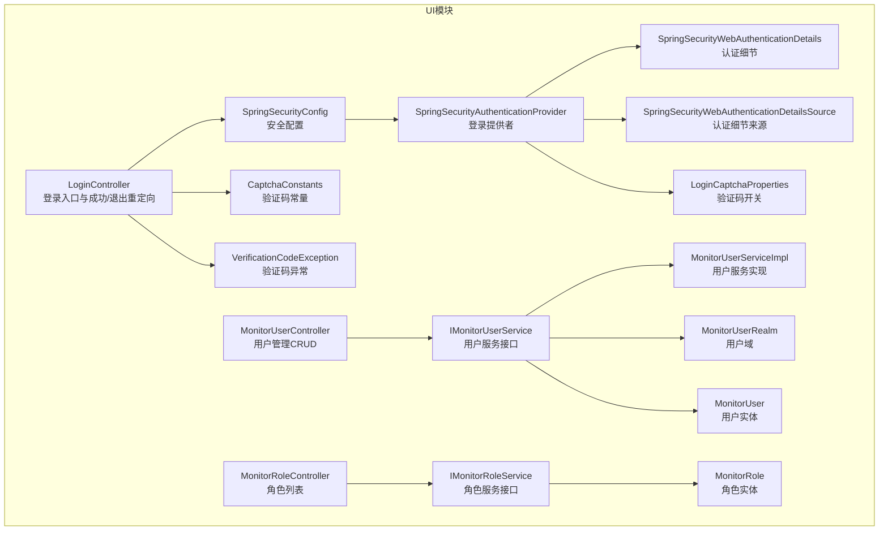
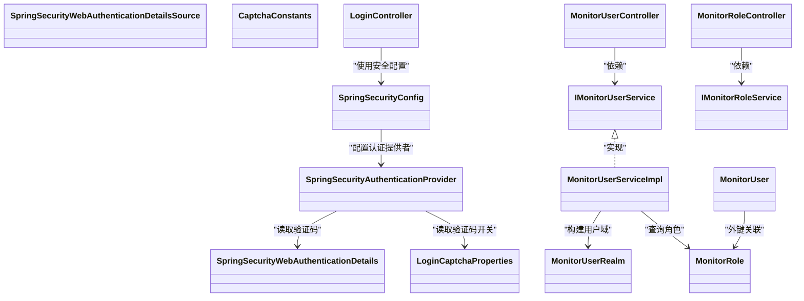

# 用户管理接口

<cite>
**本文引用的文件**
- [phoenix-ui/src/main/java/com/gitee/pifeng/monitoring/ui/business/web/controller/LoginController.java](file://phoenix-ui/src/main/java/com/gitee/pifeng/monitoring/ui/business/web/controller/LoginController.java)
- [phoenix-ui/src/main/resources/templates/user/login.html](file://phoenix-ui/src/main/resources/templates/user/login.html)
- [phoenix-ui/src/main/java/com/gitee/pifeng/monitoring/ui/config/springsecurity/SpringSecurityConfig.java](file://phoenix-ui/src/main/java/com/gitee/pifeng/monitoring/ui/config/springsecurity/SpringSecurityConfig.java)
- [phoenix-ui/src/main/java/com/gitee/pifeng/monitoring/ui/config/springsecurity/SpringSecurityAuthenticationProvider.java](file://phoenix-ui/src/main/java/com/gitee/pifeng/monitoring/ui/config/springsecurity/SpringSecurityAuthenticationProvider.java)
- [phoenix-ui/src/main/java/com/gitee/pifeng/monitoring/ui/config/springsecurity/SpringSecurityWebAuthenticationDetails.java](file://phoenix-ui/src/main/java/com/gitee/pifeng/monitoring/ui/config/springsecurity/SpringSecurityWebAuthenticationDetails.java)
- [phoenix-ui/src/main/java/com/gitee/pifeng/monitoring/ui/config/springsecurity/SpringSecurityWebAuthenticationDetailsSource.java](file://phoenix-ui/src/main/java/com/gitee/pifeng/monitoring/ui/config/springsecurity/SpringSecurityWebAuthenticationDetailsSource.java)
- [phoenix-ui/src/main/java/com/gitee/pifeng/monitoring/ui/constant/CaptchaConstants.java](file://phoenix-ui/src/main/java/com/gitee/pifeng/monitoring/ui/constant/CaptchaConstants.java)
- [phoenix-ui/src/main/java/com/gitee/pifeng/monitoring/ui/exception/VerificationCodeException.java](file://phoenix-ui/src/main/java/com/gitee/pifeng/monitoring/ui/exception/VerificationCodeException.java)
- [phoenix-ui/src/main/java/com/gitee/pifeng/monitoring/ui/property/auth/selfauth/LoginCaptchaProperties.java](file://phoenix-ui/src/main/java/com/gitee/pifeng/monitoring/ui/property/auth/selfauth/LoginCaptchaProperties.java)
- [phoenix-ui/src/main/java/com/gitee/pifeng/monitoring/ui/business/web/controller/MonitorUserController.java](file://phoenix-ui/src/main/java/com/gitee/pifeng/monitoring/ui/business/web/controller/MonitorUserController.java)
- [phoenix-ui/src/main/java/com/gitee/pifeng/monitoring/ui/business/web/controller/MonitorRoleController.java](file://phoenix-ui/src/main/java/com/gitee/pifeng/monitoring/ui/business/web/controller/MonitorRoleController.java)
- [phoenix-ui/src/main/java/com/gitee/pifeng/monitoring/ui/business/web/service/IMonitorUserService.java](file://phoenix-ui/src/main/java/com/gitee/pifeng/monitoring/ui/business/web/service/IMonitorUserService.java)
- [phoenix-ui/src/main/java/com/gitee/pifeng/monitoring/ui/business/web/service/IMonitorRoleService.java](file://phoenix-ui/src/main/java/com/gitee/pifeng/monitoring/ui/business/web/service/IMonitorRoleService.java)
- [phoenix-ui/src/main/java/com/gitee/pifeng/monitoring/ui/business/web/service/impl/MonitorUserServiceImpl.java](file://phoenix-ui/src/main/java/com/gitee/pifeng/monitoring/ui/business/web/service/impl/MonitorUserServiceImpl.java)
- [phoenix-ui/src/main/java/com/gitee/pifeng/monitoring/ui/business/web/realm/MonitorUserRealm.java](file://phoenix-ui/src/main/java/com/gitee/pifeng/monitoring/ui/business/web/realm/MonitorUserRealm.java)
- [phoenix-ui/src/main/java/com/gitee/pifeng/monitoring/ui/business/web/entity/MonitorUser.java](file://phoenix-ui/src/main/java/com/gitee/pifeng/monitoring/ui/business/web/entity/MonitorUser.java)
- [phoenix-ui/src/main/java/com/gitee/pifeng/monitoring/ui/business/web/entity/MonitorRole.java](file://phoenix-ui/src/main/java/com/gitee/pifeng/monitoring/ui/business/web/entity/MonitorRole.java)
- [phoenix-ui/src/main/resources/application.yml](file://phoenix-ui/src/main/resources/application.yml)
</cite>

## 目录
1. [简介](#简介)
2. [项目结构](#项目结构)
3. [核心组件](#核心组件)
4. [架构总览](#架构总览)
5. [详细组件分析](#详细组件分析)
6. [依赖分析](#依赖分析)
7. [性能考量](#性能考量)
8. [故障排查指南](#故障排查指南)
9. [结论](#结论)
10. [附录](#附录)

## 简介
本文件面向用户管理与认证授权接口，围绕以下目标展开：
- 详述登录认证流程与安全机制（用户名密码验证、验证码校验、会话管理）
- 说明用户信息管理接口（用户列表、新增、编辑、删除）
- 说明角色权限管理接口（角色列表）
- 完整的用户数据结构与字段说明
- RBAC权限控制模型与菜单/操作权限的实现思路
- 用户注册、密码修改、权限分配等管理功能的API说明
- 安全最佳实践与常见问题防护

## 项目结构
用户管理与认证授权相关代码集中在 UI 模块（phoenix-ui），采用 Spring Security 进行认证与授权，结合自定义验证码校验与登录提供者，实现图形验证码与用户名密码的双重校验。



图表来源
- [phoenix-ui/src/main/java/com/gitee/pifeng/monitoring/ui/business/web/controller/LoginController.java:1-84](file://phoenix-ui/src/main/java/com/gitee/pifeng/monitoring/ui/business/web/controller/LoginController.java#L1-L84)
- [phoenix-ui/src/main/java/com/gitee/pifeng/monitoring/ui/business/web/controller/MonitorUserController.java:1-220](file://phoenix-ui/src/main/java/com/gitee/pifeng/monitoring/ui/business/web/controller/MonitorUserController.java#L1-L220)
- [phoenix-ui/src/main/java/com/gitee/pifeng/monitoring/ui/business/web/controller/MonitorRoleController.java:1-99](file://phoenix-ui/src/main/java/com/gitee/pifeng/monitoring/ui/business/web/controller/MonitorRoleController.java#L1-L99)
- [phoenix-ui/src/main/java/com/gitee/pifeng/monitoring/ui/config/springsecurity/SpringSecurityConfig.java:97-128](file://phoenix-ui/src/main/java/com/gitee/pifeng/monitoring/ui/config/springsecurity/SpringSecurityConfig.java#L97-L128)
- [phoenix-ui/src/main/java/com/gitee/pifeng/monitoring/ui/config/springsecurity/SpringSecurityAuthenticationProvider.java:1-69](file://phoenix-ui/src/main/java/com/gitee/pifeng/monitoring/ui/config/springsecurity/SpringSecurityAuthenticationProvider.java#L1-L69)
- [phoenix-ui/src/main/java/com/gitee/pifeng/monitoring/ui/config/springsecurity/SpringSecurityWebAuthenticationDetails.java:48-64](file://phoenix-ui/src/main/java/com/gitee/pifeng/monitoring/ui/config/springsecurity/SpringSecurityWebAuthenticationDetails.java#L48-L64)
- [phoenix-ui/src/main/java/com/gitee/pifeng/monitoring/ui/config/springsecurity/SpringSecurityWebAuthenticationDetailsSource.java:1-26](file://phoenix-ui/src/main/java/com/gitee/pifeng/monitoring/ui/config/springsecurity/SpringSecurityWebAuthenticationDetailsSource.java#L1-L26)
- [phoenix-ui/src/main/java/com/gitee/pifeng/monitoring/ui/property/auth/selfauth/LoginCaptchaProperties.java:1-23](file://phoenix-ui/src/main/java/com/gitee/pifeng/monitoring/ui/property/auth/selfauth/LoginCaptchaProperties.java#L1-L23)
- [phoenix-ui/src/main/java/com/gitee/pifeng/monitoring/ui/constant/CaptchaConstants.java:1-24](file://phoenix-ui/src/main/java/com/gitee/pifeng/monitoring/ui/constant/CaptchaConstants.java#L1-L24)
- [phoenix-ui/src/main/java/com/gitee/pifeng/monitoring/ui/exception/VerificationCodeException.java:1-63](file://phoenix-ui/src/main/java/com/gitee/pifeng/monitoring/ui/exception/VerificationCodeException.java#L1-L63)
- [phoenix-ui/src/main/java/com/gitee/pifeng/monitoring/ui/business/web/realm/MonitorUserRealm.java:1-91](file://phoenix-ui/src/main/java/com/gitee/pifeng/monitoring/ui/business/web/realm/MonitorUserRealm.java#L1-L91)
- [phoenix-ui/src/main/java/com/gitee/pifeng/monitoring/ui/business/web/service/IMonitorUserService.java:1-133](file://phoenix-ui/src/main/java/com/gitee/pifeng/monitoring/ui/business/web/service/IMonitorUserService.java#L1-L133)
- [phoenix-ui/src/main/java/com/gitee/pifeng/monitoring/ui/business/web/service/IMonitorRoleService.java:1-32](file://phoenix-ui/src/main/java/com/gitee/pifeng/monitoring/ui/business/web/service/IMonitorRoleService.java#L1-L32)
- [phoenix-ui/src/main/java/com/gitee/pifeng/monitoring/ui/business/web/service/impl/MonitorUserServiceImpl.java:53-97](file://phoenix-ui/src/main/java/com/gitee/pifeng/monitoring/ui/business/web/service/impl/MonitorUserServiceImpl.java#L53-L97)
- [phoenix-ui/src/main/java/com/gitee/pifeng/monitoring/ui/business/web/entity/MonitorUser.java:1-74](file://phoenix-ui/src/main/java/com/gitee/pifeng/monitoring/ui/business/web/entity/MonitorUser.java#L1-L74)
- [phoenix-ui/src/main/java/com/gitee/pifeng/monitoring/ui/business/web/entity/MonitorRole.java:1-54](file://phoenix-ui/src/main/java/com/gitee/pifeng/monitoring/ui/business/web/entity/MonitorRole.java#L1-L54)

章节来源
- [phoenix-ui/src/main/java/com/gitee/pifeng/monitoring/ui/business/web/controller/LoginController.java:1-84](file://phoenix-ui/src/main/java/com/gitee/pifeng/monitoring/ui/business/web/controller/LoginController.java#L1-L84)
- [phoenix-ui/src/main/resources/templates/user/login.html:22-96](file://phoenix-ui/src/main/resources/templates/user/login.html#L22-L96)
- [phoenix-ui/src/main/java/com/gitee/pifeng/monitoring/ui/config/springsecurity/SpringSecurityConfig.java:97-128](file://phoenix-ui/src/main/java/com/gitee/pifeng/monitoring/ui/config/springsecurity/SpringSecurityConfig.java#L97-L128)

## 核心组件
- 登录控制器：负责登录页面渲染、登录成功与退出后的重定向
- Spring Security 安全配置：定义放行路径、登录处理URL、会话超时等
- 登录提供者：扩展用户名密码校验，集成图形验证码校验
- 用户域：封装用户ID、账号、角色ID、权限等信息
- 用户服务接口与实现：提供用户权限解析、密码修改、用户CRUD等能力
- 角色服务接口：提供角色列表查询
- 用户与角色实体：映射数据库表 MONITOR_USER、MONITOR_ROLE

章节来源
- [phoenix-ui/src/main/java/com/gitee/pifeng/monitoring/ui/business/web/controller/LoginController.java:1-84](file://phoenix-ui/src/main/java/com/gitee/pifeng/monitoring/ui/business/web/controller/LoginController.java#L1-L84)
- [phoenix-ui/src/main/java/com/gitee/pifeng/monitoring/ui/config/springsecurity/SpringSecurityConfig.java:97-128](file://phoenix-ui/src/main/java/com/gitee/pifeng/monitoring/ui/config/springsecurity/SpringSecurityConfig.java#L97-L128)
- [phoenix-ui/src/main/java/com/gitee/pifeng/monitoring/ui/config/springsecurity/SpringSecurityAuthenticationProvider.java:1-69](file://phoenix-ui/src/main/java/com/gitee/pifeng/monitoring/ui/config/springsecurity/SpringSecurityAuthenticationProvider.java#L1-L69)
- [phoenix-ui/src/main/java/com/gitee/pifeng/monitoring/ui/business/web/realm/MonitorUserRealm.java:1-91](file://phoenix-ui/src/main/java/com/gitee/pifeng/monitoring/ui/business/web/realm/MonitorUserRealm.java#L1-L91)
- [phoenix-ui/src/main/java/com/gitee/pifeng/monitoring/ui/business/web/service/IMonitorUserService.java:1-133](file://phoenix-ui/src/main/java/com/gitee/pifeng/monitoring/ui/business/web/service/IMonitorUserService.java#L1-L133)
- [phoenix-ui/src/main/java/com/gitee/pifeng/monitoring/ui/business/web/service/IMonitorRoleService.java:1-32](file://phoenix-ui/src/main/java/com/gitee/pifeng/monitoring/ui/business/web/service/IMonitorRoleService.java#L1-L32)
- [phoenix-ui/src/main/java/com/gitee/pifeng/monitoring/ui/business/web/entity/MonitorUser.java:1-74](file://phoenix-ui/src/main/java/com/gitee/pifeng/monitoring/ui/business/web/entity/MonitorUser.java#L1-L74)
- [phoenix-ui/src/main/java/com/gitee/pifeng/monitoring/ui/business/web/entity/MonitorRole.java:1-54](file://phoenix-ui/src/main/java/com/gitee/pifeng/monitoring/ui/business/web/entity/MonitorRole.java#L1-L54)

## 架构总览
下图展示了从浏览器发起登录请求到完成认证与会话建立的关键交互：

```mermaid
sequenceDiagram
participant Browser as "浏览器"
participant LoginCtrl as "LoginController"
participant SecCfg as "SpringSecurityConfig"
participant AuthProv as "SpringSecurityAuthenticationProvider"
participant Details as "SpringSecurityWebAuthenticationDetails"
participant Captcha as "验证码校验"
participant UserSvc as "IMonitorUserService"
participant Realm as "MonitorUserRealm"
Browser->>LoginCtrl : GET /login
LoginCtrl-->>Browser : 渲染登录页(login.html)
Browser->>SecCfg : POST /doLogin (account,password,captcha)
SecCfg->>AuthProv : 触发认证流程
AuthProv->>Details : 读取captcha参数与会话中的验证码
AuthProv->>Captcha : 校验验证码有效性
Captcha-->>AuthProv : 校验结果
AuthProv->>UserSvc : 加载用户详情
UserSvc-->>AuthProv : 返回用户信息
AuthProv->>Realm : 构建用户域(含权限)
Realm-->>AuthProv : 用户域对象
AuthProv-->>SecCfg : 认证成功/失败
SecCfg-->>Browser : 重定向到 /login-success 或错误页
```

图表来源
- [phoenix-ui/src/main/java/com/gitee/pifeng/monitoring/ui/business/web/controller/LoginController.java:41-65](file://phoenix-ui/src/main/java/com/gitee/pifeng/monitoring/ui/business/web/controller/LoginController.java#L41-L65)
- [phoenix-ui/src/main/resources/templates/user/login.html:37-65](file://phoenix-ui/src/main/resources/templates/user/login.html#L37-L65)
- [phoenix-ui/src/main/java/com/gitee/pifeng/monitoring/ui/config/springsecurity/SpringSecurityConfig.java:112-128](file://phoenix-ui/src/main/java/com/gitee/pifeng/monitoring/ui/config/springsecurity/SpringSecurityConfig.java#L112-L128)
- [phoenix-ui/src/main/java/com/gitee/pifeng/monitoring/ui/config/springsecurity/SpringSecurityAuthenticationProvider.java:63-69](file://phoenix-ui/src/main/java/com/gitee/pifeng/monitoring/ui/config/springsecurity/SpringSecurityAuthenticationProvider.java#L63-L69)
- [phoenix-ui/src/main/java/com/gitee/pifeng/monitoring/ui/config/springsecurity/SpringSecurityWebAuthenticationDetails.java:48-64](file://phoenix-ui/src/main/java/com/gitee/pifeng/monitoring/ui/config/springsecurity/SpringSecurityWebAuthenticationDetails.java#L48-L64)
- [phoenix-ui/src/main/java/com/gitee/pifeng/monitoring/ui/business/web/service/IMonitorUserService.java:25-37](file://phoenix-ui/src/main/java/com/gitee/pifeng/monitoring/ui/business/web/service/IMonitorUserService.java#L25-L37)
- [phoenix-ui/src/main/java/com/gitee/pifeng/monitoring/ui/business/web/realm/MonitorUserRealm.java:79-89](file://phoenix-ui/src/main/java/com/gitee/pifeng/monitoring/ui/business/web/realm/MonitorUserRealm.java#L79-L89)

## 详细组件分析

### 登录认证接口
- 接口路径
  - GET /login：访问登录页面
  - POST /doLogin：提交登录凭据（账号、密码、可选验证码）
  - GET /login-success：登录成功后重定向
  - GET /logout-success：退出登录后重定向
- 表单字段
  - account：账号
  - password：密码
  - captcha：图形验证码（可选，取决于验证码开关）
- 安全机制
  - 放行路径：/login、/logout、/doLogin、/captcha.png
  - 登录处理URL：/doLogin
  - 会话超时：30分钟
  - 图形验证码：由登录提供者在认证阶段校验，验证码存储于会话并带过期时间
- 返回行为
  - 成功：重定向到 /login-success
  - 失败：保留错误参数（如验证码为空、不存在、过期、校验失败等）

章节来源
- [phoenix-ui/src/main/java/com/gitee/pifeng/monitoring/ui/business/web/controller/LoginController.java:41-65](file://phoenix-ui/src/main/java/com/gitee/pifeng/monitoring/ui/business/web/controller/LoginController.java#L41-L65)
- [phoenix-ui/src/main/resources/templates/user/login.html:37-96](file://phoenix-ui/src/main/resources/templates/user/login.html#L37-L96)
- [phoenix-ui/src/main/java/com/gitee/pifeng/monitoring/ui/config/springsecurity/SpringSecurityConfig.java:112-128](file://phoenix-ui/src/main/java/com/gitee/pifeng/monitoring/ui/config/springsecurity/SpringSecurityConfig.java#L112-L128)
- [phoenix-ui/src/main/java/com/gitee/pifeng/monitoring/ui/config/springsecurity/SpringSecurityAuthenticationProvider.java:63-69](file://phoenix-ui/src/main/java/com/gitee/pifeng/monitoring/ui/config/springsecurity/SpringSecurityAuthenticationProvider.java#L63-L69)
- [phoenix-ui/src/main/java/com/gitee/pifeng/monitoring/ui/constant/CaptchaConstants.java:11-24](file://phoenix-ui/src/main/java/com/gitee/pifeng/monitoring/ui/constant/CaptchaConstants.java#L11-L24)
- [phoenix-ui/src/main/java/com/gitee/pifeng/monitoring/ui/exception/VerificationCodeException.java:33-61](file://phoenix-ui/src/main/java/com/gitee/pifeng/monitoring/ui/exception/VerificationCodeException.java#L33-L61)
- [phoenix-ui/src/main/java/com/gitee/pifeng/monitoring/ui/property/auth/selfauth/LoginCaptchaProperties.java:14-23](file://phoenix-ui/src/main/java/com/gitee/pifeng/monitoring/ui/property/auth/selfauth/LoginCaptchaProperties.java#L14-L23)
- [phoenix-ui/src/main/resources/application.yml:4-8](file://phoenix-ui/src/main/resources/application.yml#L4-L8)

### 用户信息管理接口
- 接口路径
  - GET /user/list：访问用户列表页面
  - GET /user/get-monitor-user-list：分页获取用户列表（支持按账号/用户名/邮箱筛选）
  - GET /user/add-user-form：访问新增用户表单页面
  - GET /user/edit-user-form：访问编辑用户表单页面（携带用户ID）
  - POST /user/save-user：保存新增用户（需具备“超级管理员”权限）
  - PUT /user/edit-user：更新用户信息（需具备“超级管理员”权限）
  - DELETE /user/delete-user：删除用户（需具备“超级管理员”权限）
- 权限控制
  - 新增、编辑、删除用户接口使用 @PreAuthorize("hasAuthority('超级管理员')") 进行授权校验
- 返回约定
  - 统一返回 LayUiAdminResultVo，data 字段表示操作结果（如 success/fail/exist 等）

章节来源
- [phoenix-ui/src/main/java/com/gitee/pifeng/monitoring/ui/business/web/controller/MonitorUserController.java:63-217](file://phoenix-ui/src/main/java/com/gitee/pifeng/monitoring/ui/business/web/controller/MonitorUserController.java#L63-L217)
- [phoenix-ui/src/main/java/com/gitee/pifeng/monitoring/ui/business/web/service/IMonitorUserService.java:93-131](file://phoenix-ui/src/main/java/com/gitee/pifeng/monitoring/ui/business/web/service/IMonitorUserService.java#L93-L131)

### 角色权限管理接口
- 接口路径
  - GET /role/list：访问角色列表页面
  - GET /role/get-monitor-role-list：分页获取角色列表（支持按角色ID筛选）
- 返回约定
  - 统一返回 LayUiAdminResultVo，data 包含分页数据

章节来源
- [phoenix-ui/src/main/java/com/gitee/pifeng/monitoring/ui/business/web/controller/MonitorRoleController.java:55-96](file://phoenix-ui/src/main/java/com/gitee/pifeng/monitoring/ui/business/web/controller/MonitorRoleController.java#L55-L96)
- [phoenix-ui/src/main/java/com/gitee/pifeng/monitoring/ui/business/web/service/IMonitorRoleService.java](file://phoenix-ui/src/main/java/com/gitee/pifeng/monitoring/ui/business/web/service/IMonitorRoleService.java#L30)

### 用户数据结构说明
- MonitorUser（用户实体）
  - 字段：id、account、username、password、roleId、registerTime、updateTime、email、remarks
  - 说明：用户基本信息与关联角色ID
- MonitorRole（角色实体）
  - 字段：id、roleName、createTime、updateTime
  - 说明：角色名称与时间戳
- MonitorUserRealm（用户域）
  - 字段：id、usrname、account、password、roleId、registerTime、updateTime、email、remarks、authorities
  - 说明：继承 User，承载用户域信息与权限集合

章节来源
- [phoenix-ui/src/main/java/com/gitee/pifeng/monitoring/ui/business/web/entity/MonitorUser.java:32-73](file://phoenix-ui/src/main/java/com/gitee/pifeng/monitoring/ui/business/web/entity/MonitorUser.java#L32-L73)
- [phoenix-ui/src/main/java/com/gitee/pifeng/monitoring/ui/business/web/entity/MonitorRole.java:32-53](file://phoenix-ui/src/main/java/com/gitee/pifeng/monitoring/ui/business/web/entity/MonitorRole.java#L32-L53)
- [phoenix-ui/src/main/java/com/gitee/pifeng/monitoring/ui/business/web/realm/MonitorUserRealm.java:18-89](file://phoenix-ui/src/main/java/com/gitee/pifeng/monitoring/ui/business/web/realm/MonitorUserRealm.java#L18-L89)

### 权限控制机制（RBAC）
- 基于角色的访问控制（RBAC）
  - 用户权限来源于其角色名称，服务端通过角色查询构建 GrantedAuthority 列表
  - 授权注解 @PreAuthorize("hasAuthority('超级管理员')") 控制用户管理接口的访问
- 菜单与操作权限
  - 菜单权限：由角色名称映射（例如“超级管理员”）
  - 操作权限：通过接口上的授权注解与业务逻辑共同实现
- 会话与并发控制
  - 会话超时：30分钟
  - 可结合 SessionRegistry 实现同一账号多处登录的会话管理（服务端预留了 SessionRegistry 注入，便于扩展）

章节来源
- [phoenix-ui/src/main/java/com/gitee/pifeng/monitoring/ui/business/web/service/impl/MonitorUserServiceImpl.java:76-90](file://phoenix-ui/src/main/java/com/gitee/pifeng/monitoring/ui/business/web/service/impl/MonitorUserServiceImpl.java#L76-L90)
- [phoenix-ui/src/main/java/com/gitee/pifeng/monitoring/ui/business/web/controller/MonitorUserController.java:173-212](file://phoenix-ui/src/main/java/com/gitee/pifeng/monitoring/ui/business/web/controller/MonitorUserController.java#L173-L212)
- [phoenix-ui/src/main/resources/application.yml:4-8](file://phoenix-ui/src/main/resources/application.yml#L4-L8)

### 用户注册、密码修改、权限分配
- 用户注册
  - 通过 /user/save-user 接口新增用户，若账号已存在返回提示
- 密码修改
  - 通过 IMonitorUserService.updatePassword 提供旧密码校验与新密码设置
- 权限分配
  - 通过编辑用户接口将用户绑定到角色（roleId），权限随之由角色名称决定

章节来源
- [phoenix-ui/src/main/java/com/gitee/pifeng/monitoring/ui/business/web/controller/MonitorUserController.java:171-197](file://phoenix-ui/src/main/java/com/gitee/pifeng/monitoring/ui/business/web/controller/MonitorUserController.java#L171-L197)
- [phoenix-ui/src/main/java/com/gitee/pifeng/monitoring/ui/business/web/service/IMonitorUserService.java:64-65](file://phoenix-ui/src/main/java/com/gitee/pifeng/monitoring/ui/business/web/service/IMonitorUserService.java#L64-L65)

## 依赖分析
- 组件耦合
  - 登录控制器依赖安全配置与验证码属性
  - 登录提供者依赖用户服务与验证码常量
  - 用户服务实现依赖角色DAO与用户域
- 外部依赖
  - Spring Security：认证与授权
  - Thymeleaf：登录页面模板
  - Druid：数据源配置（与用户管理无直接关系，但影响整体运行环境）



图表来源
- [phoenix-ui/src/main/java/com/gitee/pifeng/monitoring/ui/config/springsecurity/SpringSecurityConfig.java:97-128](file://phoenix-ui/src/main/java/com/gitee/pifeng/monitoring/ui/config/springsecurity/SpringSecurityConfig.java#L97-L128)
- [phoenix-ui/src/main/java/com/gitee/pifeng/monitoring/ui/config/springsecurity/SpringSecurityAuthenticationProvider.java:48-51](file://phoenix-ui/src/main/java/com/gitee/pifeng/monitoring/ui/config/springsecurity/SpringSecurityAuthenticationProvider.java#L48-L51)
- [phoenix-ui/src/main/java/com/gitee/pifeng/monitoring/ui/config/springsecurity/SpringSecurityWebAuthenticationDetails.java:48-64](file://phoenix-ui/src/main/java/com/gitee/pifeng/monitoring/ui/config/springsecurity/SpringSecurityWebAuthenticationDetails.java#L48-L64)
- [phoenix-ui/src/main/java/com/gitee/pifeng/monitoring/ui/property/auth/selfauth/LoginCaptchaProperties.java:14-23](file://phoenix-ui/src/main/java/com/gitee/pifeng/monitoring/ui/property/auth/selfauth/LoginCaptchaProperties.java#L14-L23)
- [phoenix-ui/src/main/java/com/gitee/pifeng/monitoring/ui/business/web/controller/LoginController.java:41-65](file://phoenix-ui/src/main/java/com/gitee/pifeng/monitoring/ui/business/web/controller/LoginController.java#L41-L65)
- [phoenix-ui/src/main/java/com/gitee/pifeng/monitoring/ui/business/web/controller/MonitorUserController.java:45-52](file://phoenix-ui/src/main/java/com/gitee/pifeng/monitoring/ui/business/web/controller/MonitorUserController.java#L45-L52)
- [phoenix-ui/src/main/java/com/gitee/pifeng/monitoring/ui/business/web/controller/MonitorRoleController.java:43-44](file://phoenix-ui/src/main/java/com/gitee/pifeng/monitoring/ui/business/web/controller/MonitorRoleController.java#L43-L44)
- [phoenix-ui/src/main/java/com/gitee/pifeng/monitoring/ui/business/web/service/IMonitorUserService.java](file://phoenix-ui/src/main/java/com/gitee/pifeng/monitoring/ui/business/web/service/IMonitorUserService.java#L25)
- [phoenix-ui/src/main/java/com/gitee/pifeng/monitoring/ui/business/web/service/IMonitorRoleService.java](file://phoenix-ui/src/main/java/com/gitee/pifeng/monitoring/ui/business/web/service/IMonitorRoleService.java#L16)
- [phoenix-ui/src/main/java/com/gitee/pifeng/monitoring/ui/business/web/service/impl/MonitorUserServiceImpl.java:76-90](file://phoenix-ui/src/main/java/com/gitee/pifeng/monitoring/ui/business/web/service/impl/MonitorUserServiceImpl.java#L76-L90)
- [phoenix-ui/src/main/java/com/gitee/pifeng/monitoring/ui/business/web/realm/MonitorUserRealm.java:79-89](file://phoenix-ui/src/main/java/com/gitee/pifeng/monitoring/ui/business/web/realm/MonitorUserRealm.java#L79-L89)
- [phoenix-ui/src/main/java/com/gitee/pifeng/monitoring/ui/business/web/entity/MonitorUser.java:36-56](file://phoenix-ui/src/main/java/com/gitee/pifeng/monitoring/ui/business/web/entity/MonitorUser.java#L36-L56)
- [phoenix-ui/src/main/java/com/gitee/pifeng/monitoring/ui/business/web/entity/MonitorRole.java:36-43](file://phoenix-ui/src/main/java/com/gitee/pifeng/monitoring/ui/business/web/entity/MonitorRole.java#L36-L43)

## 性能考量
- 登录验证码
  - 验证码生成与校验在内存中完成，避免频繁IO
- 会话管理
  - 会话超时30分钟，建议结合前端心跳与服务端并发会话策略优化用户体验
- 接口超时
  - MVC异步请求超时5秒，建议对复杂查询接口增加分页与索引优化

## 故障排查指南
- 验证码相关错误
  - 现象：登录时提示验证码为空、不存在、已过期、校验失败
  - 排查：确认验证码开关配置、会话中验证码是否过期、验证码图片是否正确加载
- 登录失败
  - 现象：账号或密码错误
  - 排查：确认账号是否存在、密码是否正确、验证码是否通过
- 权限不足
  - 现象：新增/编辑/删除用户接口返回未授权
  - 排查：确认当前用户角色是否包含“超级管理员”

章节来源
- [phoenix-ui/src/main/java/com/gitee/pifeng/monitoring/ui/exception/VerificationCodeException.java:33-61](file://phoenix-ui/src/main/java/com/gitee/pifeng/monitoring/ui/exception/VerificationCodeException.java#L33-L61)
- [phoenix-ui/src/main/resources/templates/user/login.html:66-96](file://phoenix-ui/src/main/resources/templates/user/login.html#L66-L96)
- [phoenix-ui/src/main/java/com/gitee/pifeng/monitoring/ui/business/web/controller/MonitorUserController.java:173-212](file://phoenix-ui/src/main/java/com/gitee/pifeng/monitoring/ui/business/web/controller/MonitorUserController.java#L173-L212)

## 结论
本系统通过 Spring Security 与自定义登录提供者实现了用户名密码与图形验证码的双重认证，并以角色名称作为权限标识，配合授权注解实现细粒度的用户管理接口保护。登录页面与安全配置清晰分离，便于维护与扩展。建议后续结合会话注册与并发登录控制进一步完善会话生命周期管理。

## 附录
- 安全最佳实践
  - 强制启用图形验证码（可通过配置开关控制）
  - 严格限制会话超时时间，避免长时间未操作导致的安全风险
  - 对敏感接口（用户管理）仅开放给“超级管理员”角色
  - 建议引入CSRF防护与HTTPS传输
- 常见安全问题
  - 验证码被暴力破解：通过验证码过期时间与错误次数限制缓解
  - 会话固定攻击：确保登录后更换会话ID
  - 权限提升：严格校验角色与授权注解，避免越权操作