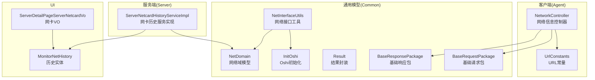
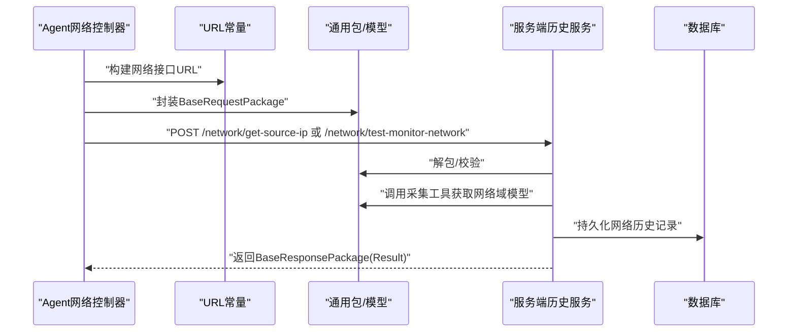
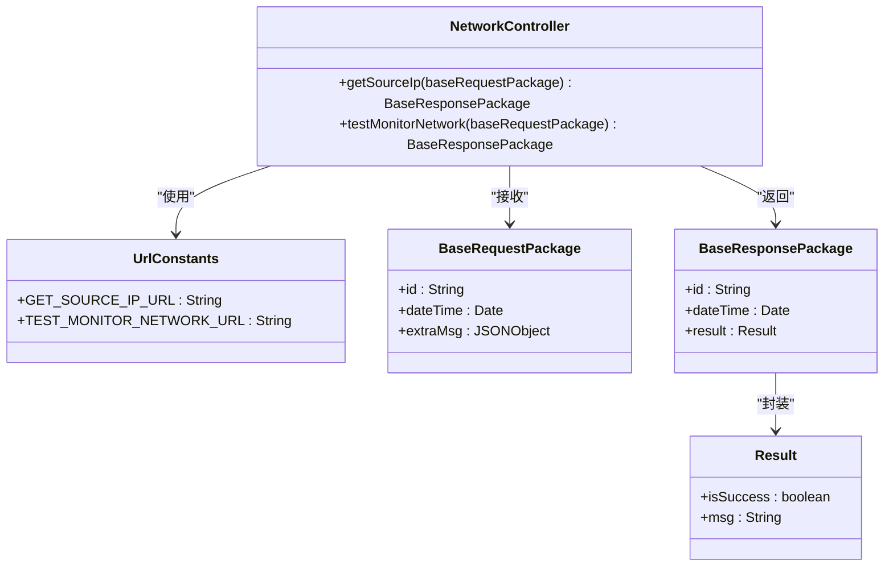
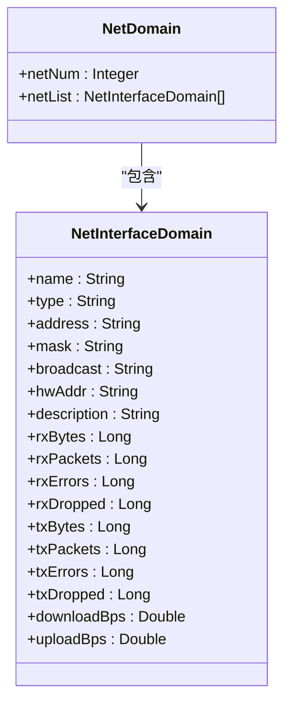
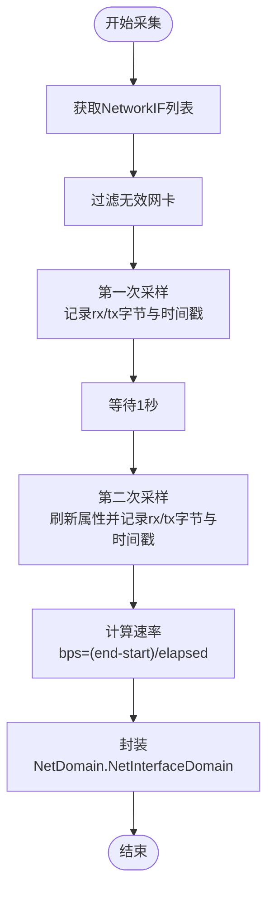
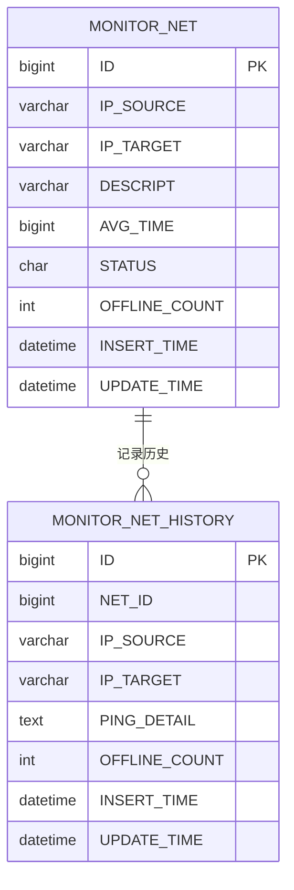
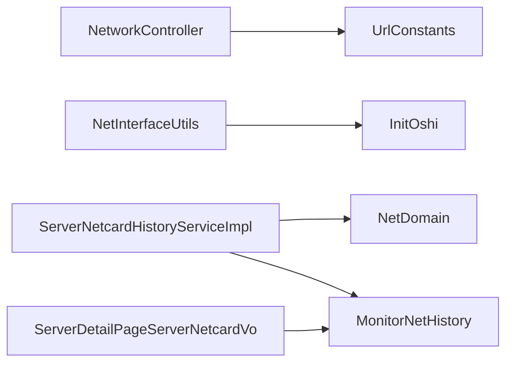

# 网络监控接口

<cite>
**本文引用的文件**
- [NetworkController.java](file://phoenix-agent\src\main\java\com\gitee\pifeng\monitoring\agent\business\client\controller\NetworkController.java)
- [UrlConstants.java](file://phoenix-agent\src\main\java\com\gitee\pifeng\monitoring\agent\constant\UrlConstants.java)
- [NetDomain.java](file://phoenix-common\phoenix-common-core\src\main\java\com\gitee\pifeng\monitoring\common\domain\server\NetDomain.java)
- [NetInterfaceUtils.java](file://phoenix-common\phoenix-common-core\src\main\java\com\gitee\pifeng\monitoring\common\util\server\oshi\NetInterfaceUtils.java)
- [InitOshi.java](file://phoenix-common\phoenix-common-core\src\main\java\com\gitee\pifeng\monitoring\common\init\InitOshi.java)
- [BaseRequestPackage.java](file://phoenix-common\phoenix-common-core\src\main\java\com\gitee\pifeng\monitoring\common\dto\BaseRequestPackage.java)
- [BaseResponsePackage.java](file://phoenix-common\phoenix-common-core\src\main\java\com\gitee\pifeng\monitoring\common\dto\BaseResponsePackage.java)
- [Result.java](file://phoenix-common\phoenix-common-core\src\main\java\com\gitee\pifeng\monitoring\common\domain\Result.java)
- [ServerNetcardHistoryServiceImpl.java](file://phoenix-server\src\main\java\com\gitee\pifeng\monitoring\server\business\server\service\impl\ServerNetcardHistoryServiceImpl.java)
- [MonitorNetHistory.java](file://phoenix-ui\src\main\java\com\gitee\pifeng\monitoring\ui\business\web\entity\MonitorNetHistory.java)
- [ServerDetailPageServerNetcardVo.java](file://phoenix-ui\src\main\java\com\gitee\pifeng\monitoring\ui\business\web\vo\ServerDetailPageServerNetcardVo.java)
- [phoenix.sql](file://doc\数据库设计\sql\mysql\phoenix.sql)
- [MonitoringNetworkProperties.java](file://phoenix-common\phoenix-common-core\src\main\java\com\gitee\pifeng\monitoring\common\property\server\MonitoringNetworkProperties.java)
- [MonitoringNetworkStatusProperties.java](file://phoenix-common\phoenix-common-core\src\main\java\com\gitee\pifeng\monitoring\common\property\server\MonitoringNetworkStatusProperties.java)
</cite>

## 目录
1. [简介](#简介)
2. [项目结构](#项目结构)
3. [核心组件](#核心组件)
4. [架构总览](#架构总览)
5. [详细组件分析](#详细组件分析)
6. [依赖分析](#依赖分析)
7. [性能考虑](#性能考虑)
8. [故障排查指南](#故障排查指南)
9. [结论](#结论)
10. [附录](#附录)

## 简介
本文件面向“网络监控接口”的API文档与实现解析，重点覆盖以下内容：
- 接口功能与用途：采集并返回网络适配器信息、流量统计、速度指标等。
- 指标说明：网络接口流量、连接数、端口状态、网络延迟、丢包率等关键指标的采集方式与数据结构。
- 数据模型：网络适配器信息、IP/MAC/子网掩码、带宽使用情况等字段格式。
- 实时性与采样：采样频率、历史数据存储策略、性能影响评估。
- 协议支持：IPv4/IPv6、TCP/UDP等监控差异与现状。
- 故障诊断与性能优化建议。

## 项目结构
网络监控能力由三部分协作完成：
- 客户端采集层（Agent）：负责采集系统网络信息并通过统一请求包发送到服务端。
- 通用数据模型层（Common）：定义网络域模型、请求/响应包、结果封装等。
- 服务端与UI层（Server/UI）：接收数据、持久化历史记录、提供查询与展示。

**图表来源**
- [NetworkController.java:1-80](file://phoenix-agent\src\main\java\com\gitee\pifeng\monitoring\agent\business\client\controller\NetworkController.java#L1-L80)
- [UrlConstants.java:1-127](file://phoenix-agent\src\main\java\com\gitee\pifeng\monitoring\agent\constant\UrlConstants.java#L1-L127)
- [NetDomain.java:1-122](file://phoenix-common\phoenix-common-core\src\main\java\com\gitee\pifeng\monitoring\common\domain\server\NetDomain.java#L1-L122)
- [NetInterfaceUtils.java:1-138](file://phoenix-common\phoenix-common-core\src\main\java\com\gitee\pifeng\monitoring\common\util\server\oshi\NetInterfaceUtils.java#L1-L138)
- [InitOshi.java:1-40](file://phoenix-common\phoenix-common-core\src\main\java\com\gitee\pifeng\monitoring\common\init\InitOshi.java#L1-L40)
- [BaseRequestPackage.java:1-42](file://phoenix-common\phoenix-common-core\src\main\java\com\gitee\pifeng\monitoring\common\dto\BaseRequestPackage.java#L1-L42)
- [BaseResponsePackage.java:1-42](file://phoenix-common\phoenix-common-core\src\main\java\com\gitee\pifeng\monitoring\common\dto\BaseResponsePackage.java#L1-L42)
- [Result.java:1-35](file://phoenix-common\phoenix-common-core\src\main\java\com\gitee\pifeng\monitoring\common\domain\Result.java#L1-L35)
- [ServerNetcardHistoryServiceImpl.java:60-76](file://phoenix-server\src\main\java\com\gitee\pifeng\monitoring\server\business\server\service\impl\ServerNetcardHistoryServiceImpl.java#L60-L76)
- [MonitorNetHistory.java:1-44](file://phoenix-ui\src\main\java\com\gitee\pifeng\monitoring\ui\business\web\entity\MonitorNetHistory.java#L1-L44)
- [ServerDetailPageServerNetcardVo.java:84-107](file://phoenix-ui\src\main\java\com\gitee\pifeng\monitoring\ui\business\web\vo\ServerDetailPageServerNetcardVo.java#L84-L107)

**章节来源**
- [NetworkController.java:1-80](file://phoenix-agent\src\main\java\com\gitee\pifeng\monitoring\agent\business\client\controller\NetworkController.java#L1-L80)
- [UrlConstants.java:1-127](file://phoenix-agent\src\main\java\com\gitee\pifeng\monitoring\agent\constant\UrlConstants.java#L1-L127)

## 核心组件
- 网络信息控制器（Agent侧）：提供网络相关接口入口，封装请求与响应。
- 网络域模型（Common侧）：定义网络适配器集合与单个适配器的完整字段。
- 网络接口工具（Common侧）：基于Oshi采集系统网络接口配置与统计，并计算速率。
- 历史数据服务（Server侧）：将采集到的网络指标写入历史表，供查询与展示。
- UI实体与视图（UI侧）：映射历史表字段，用于前端展示与导出。

**章节来源**
- [NetDomain.java:1-122](file://phoenix-common\phoenix-common-core\src\main\java\com\gitee\pifeng\monitoring\common\domain\server\NetDomain.java#L1-L122)
- [NetInterfaceUtils.java:1-138](file://phoenix-common\phoenix-common-core\src\main\java\com\gitee\pifeng\monitoring\common\util\server\oshi\NetInterfaceUtils.java#L1-L138)
- [ServerNetcardHistoryServiceImpl.java:60-76](file://phoenix-server\src\main\java\com\gitee\pifeng\monitoring\server\business\server\service\impl\ServerNetcardHistoryServiceImpl.java#L60-L76)
- [MonitorNetHistory.java:1-44](file://phoenix-ui\src\main\java\com\gitee\pifeng\monitoring\ui\business\web\entity\MonitorNetHistory.java#L1-L44)

## 架构总览
下图展示了从Agent采集到Server落库再到UI展示的端到端流程。

**图表来源**
- [NetworkController.java:52-77](file://phoenix-agent\src\main\java\com\gitee\pifeng\monitoring\agent\business\client\controller\NetworkController.java#L52-L77)
- [UrlConstants.java:62-69](file://phoenix-agent\src\main\java\com\gitee\pifeng\monitoring\agent\constant\UrlConstants.java#L62-L69)
- [BaseRequestPackage.java:1-42](file://phoenix-common\phoenix-common-core\src\main\java\com\gitee\pifeng\monitoring\common\dto\BaseRequestPackage.java#L1-L42)
- [BaseResponsePackage.java:1-42](file://phoenix-common\phoenix-common-core\src\main\java\com\gitee\pifeng\monitoring\common\dto\BaseResponsePackage.java#L1-L42)
- [NetInterfaceUtils.java:40-111](file://phoenix-common\phoenix-common-core\src\main\java\com\gitee\pifeng\monitoring\common\util\server\oshi\NetInterfaceUtils.java#L40-L111)
- [ServerNetcardHistoryServiceImpl.java:60-76](file://phoenix-server\src\main\java\com\gitee\pifeng\monitoring\server\business\server\service\impl\ServerNetcardHistoryServiceImpl.java#L60-L76)

## 详细组件分析

### 组件一：网络信息控制器（Agent）
- 路径与职责
  - 控制器位于Agent模块，提供网络相关接口入口。
  - 当前已实现两个接口：获取被监控网络源IP地址、测试网络连通性。
- 请求/响应模型
  - 请求体：BaseRequestPackage（包含id、dateTime、extraMsg）。
  - 响应体：BaseResponsePackage（包含id、dateTime、result）。
- URL映射
  - 获取源IP：/network/get-source-ip
  - 测试网络连通性：/network/test-monitor-network
- 异常处理
  - 统一捕获网络异常并返回响应。

**图表来源**
- [NetworkController.java:1-80](file://phoenix-agent\src\main\java\com\gitee\pifeng\monitoring\agent\business\client\controller\NetworkController.java#L1-L80)
- [UrlConstants.java:62-69](file://phoenix-agent\src\main\java\com\gitee\pifeng\monitoring\agent\constant\UrlConstants.java#L62-L69)
- [BaseRequestPackage.java:1-42](file://phoenix-common\phoenix-common-core\src\main\java\com\gitee\pifeng\monitoring\common\dto\BaseRequestPackage.java#L1-L42)
- [BaseResponsePackage.java:1-42](file://phoenix-common\phoenix-common-core\src\main\java\com\gitee\pifeng\monitoring\common\dto\BaseResponsePackage.java#L1-L42)
- [Result.java:1-35](file://phoenix-common\phoenix-common-core\src\main\java\com\gitee\pifeng\monitoring\common\domain\Result.java#L1-L35)

**章节来源**
- [NetworkController.java:52-77](file://phoenix-agent\src\main\java\com\gitee\pifeng\monitoring\agent\business\client\controller\NetworkController.java#L52-L77)
- [UrlConstants.java:62-69](file://phoenix-agent\src\main\java\com\gitee\pifeng\monitoring\agent\constant\UrlConstants.java#L62-L69)

### 组件二：网络域模型与采集工具（Common）
- 网络域模型
  - NetDomain：包含网卡数量与网卡列表。
  - NetInterfaceDomain：单个网卡的配置与状态信息。
- 关键字段
  - 配置：name、type、address、mask、broadcast、hwAddr、description。
  - 状态：rxBytes、rxPackets、rxErrors、rxDropped；txBytes、txPackets、txErrors、txDropped。
  - 速率：downloadBps（下载字节/秒）、uploadBps（上传字节/秒）。
- 采集逻辑
  - 使用Oshi获取NetworkIF列表，过滤无效网卡后，采集配置与统计。
  - 通过两次采样（间隔1秒）计算速率：(bytesEnd - bytesStart) / 1秒。
  - 将结果封装为NetDomain并返回。

**图表来源**
- [NetDomain.java:1-122](file://phoenix-common\phoenix-common-core\src\main\java\com\gitee\pifeng\monitoring\common\domain\server\NetDomain.java#L1-L122)

**图表来源**
- [NetInterfaceUtils.java:40-111](file://phoenix-common\phoenix-common-core\src\main\java\com\gitee\pifeng\monitoring\common\util\server\oshi\NetInterfaceUtils.java#L40-L111)
- [InitOshi.java:1-40](file://phoenix-common\phoenix-common-core\src\main\java\com\gitee\pifeng\monitoring\common\init\InitOshi.java#L1-L40)

**章节来源**
- [NetDomain.java:1-122](file://phoenix-common\phoenix-common-core\src\main\java\com\gitee\pifeng\monitoring\common\domain\server\NetDomain.java#L1-L122)
- [NetInterfaceUtils.java:40-111](file://phoenix-common\phoenix-common-core\src\main\java\com\gitee\pifeng\monitoring\common\util\server\oshi\NetInterfaceUtils.java#L40-L111)
- [InitOshi.java:1-40](file://phoenix-common\phoenix-common-core\src\main\java\com\gitee\pifeng\monitoring\common\init\InitOshi.java#L1-L40)

### 组件三：服务端历史数据持久化（Server）
- 作用
  - 将采集到的网络域模型转换为历史记录实体并写入数据库。
- 关键字段映射
  - 名称、类型、地址、掩码、广播、MAC、描述。
  - 接收/发送字节、包数、错误数、丢弃数。
  - 下载/上传速率。
- 数据表
  - MONITOR_NET_HISTORY：网络历史记录表。
  - MONITOR_NET：网络信息表（含源/目标IP、连通性等）。

**图表来源**
- [ServerNetcardHistoryServiceImpl.java:60-76](file://phoenix-server\src\main\java\com\gitee\pifeng\monitoring\server\business\server\service\impl\ServerNetcardHistoryServiceImpl.java#L60-L76)
- [MonitorNetHistory.java:1-44](file://phoenix-ui\src\main\java\com\gitee\pifeng\monitoring\ui\business\web\entity\MonitorNetHistory.java#L1-L44)
- [phoenix.sql:539-581](file://doc\数据库设计\sql\mysql\phoenix.sql#L539-L581)

**章节来源**
- [ServerNetcardHistoryServiceImpl.java:60-76](file://phoenix-server\src\main\java\com\gitee\pifeng\monitoring\server\business\server\service\impl\ServerNetcardHistoryServiceImpl.java#L60-L76)
- [phoenix.sql:539-581](file://doc\数据库设计\sql\mysql\phoenix.sql#L539-L581)

### 组件四：UI展示与查询（UI）
- 历史实体
  - MonitorNetHistory：对应MONITOR_NET_HISTORY表，包含网卡历史指标与时间戳。
- 页面VO
  - ServerDetailPageServerNetcardVo：用于服务详情页展示，包含发送/接收字节、包数、错误/丢弃数、下载/上传速度等字段。
- 字段说明
  - 下载/上传速度：以字符串形式序列化显示。
  - 包数/错误/丢弃：以长整型序列化显示。
  - 时间：格式化为“yyyy/MM/dd HH:mm:ss”。

**章节来源**
- [MonitorNetHistory.java:1-44](file://phoenix-ui\src\main\java\com\gitee\pifeng\monitoring\ui\business\web\entity\MonitorNetHistory.java#L1-L44)
- [ServerDetailPageServerNetcardVo.java:84-107](file://phoenix-ui\src\main\java\com\gitee\pifeng\monitoring\ui\business\web\vo\ServerDetailPageServerNetcardVo.java#L84-L107)

## 依赖分析
- 控制器依赖URL常量进行接口路由。
- 采集工具依赖Oshi初始化类以获取系统信息。
- 服务端历史服务依赖网络域模型与历史实体进行落库。
- UI层依赖历史实体与VO进行展示。

**图表来源**
- [NetworkController.java:1-80](file://phoenix-agent\src\main\java\com\gitee\pifeng\monitoring\agent\business\client\controller\NetworkController.java#L1-L80)
- [UrlConstants.java:1-127](file://phoenix-agent\src\main\java\com\gitee\pifeng\monitoring\agent\constant\UrlConstants.java#L1-L127)
- [NetInterfaceUtils.java:1-138](file://phoenix-common\phoenix-common-core\src\main\java\com\gitee\pifeng\monitoring\common\util\server\oshi\NetInterfaceUtils.java#L1-L138)
- [InitOshi.java:1-40](file://phoenix-common\phoenix-common-core\src\main\java\com\gitee\pifeng\monitoring\common\init\InitOshi.java#L1-L40)
- [ServerNetcardHistoryServiceImpl.java:60-76](file://phoenix-server\src\main\java\com\gitee\pifeng\monitoring\server\business\server\service\impl\ServerNetcardHistoryServiceImpl.java#L60-L76)
- [MonitorNetHistory.java:1-44](file://phoenix-ui\src\main\java\com\gitee\pifeng\monitoring\ui\business\web\entity\MonitorNetHistory.java#L1-L44)
- [ServerDetailPageServerNetcardVo.java:84-107](file://phoenix-ui\src\main\java\com\gitee\pifeng\monitoring\ui\business\web\vo\ServerDetailPageServerNetcardVo.java#L84-L107)

**章节来源**
- [NetworkController.java:1-80](file://phoenix-agent\src\main\java\com\gitee\pifeng\monitoring\agent\business\client\controller\NetworkController.java#L1-L80)
- [NetInterfaceUtils.java:1-138](file://phoenix-common\phoenix-common-core\src\main\java\com\gitee\pifeng\monitoring\common\util\server\oshi\NetInterfaceUtils.java#L1-L138)

## 性能考虑
- 采样频率
  - 工具默认以1秒为间隔进行两次采样以计算速率，该频率在大多数场景下可满足实时性需求。
- CPU与I/O开销
  - Oshi采集涉及系统调用与硬件信息读取，建议根据机器规模与监控粒度调整采集频率。
- 历史数据存储
  - 建议按天/周/月归档，清理过期数据，避免历史表无限增长导致查询变慢。
- 网络抖动与丢包
  - 采集速率受系统计数器精度与时间戳间隔影响，网络抖动可能造成瞬时速率波动，建议结合趋势分析与阈值告警。

[本节为通用性能建议，不直接分析具体文件]

## 故障排查指南
- 常见问题
  - 无法获取网卡信息：检查Oshi初始化是否成功、是否存在无效网卡被过滤。
  - 速率异常为0或NaN：确认两次采样之间的时间戳与字节计数有效。
  - 接口返回失败：检查URL常量与服务端路由是否一致，查看响应包中的Result信息。
- 建议步骤
  - 在Agent侧打印采集到的NetDomain结构，核对字段完整性。
  - 在Server侧验证历史表字段映射是否正确。
  - 在UI侧核对VO与实体字段一致性，确保序列化与格式化无误。

**章节来源**
- [NetInterfaceUtils.java:125-135](file://phoenix-common\phoenix-common-core\src\main\java\com\gitee\pifeng\monitoring\common\util\server\oshi\NetInterfaceUtils.java#L125-L135)
- [BaseResponsePackage.java:1-42](file://phoenix-common\phoenix-common-core\src\main\java\com\gitee\pifeng\monitoring\common\dto\BaseResponsePackage.java#L1-L42)
- [Result.java:1-35](file://phoenix-common\phoenix-common-core\src\main\java\com\gitee\pifeng\monitoring\common\domain\Result.java#L1-L35)

## 结论
- 网络监控接口通过Agent采集、Common模型封装与Server落库形成闭环，具备完善的网络适配器信息与速率指标采集能力。
- 当前实现聚焦于IPv4与以太网接口的统计与速率计算，未直接暴露TCP/UDP连接数与丢包率等指标。
- 建议在现有基础上扩展协议维度的监控与阈值告警，完善历史数据归档策略，并结合业务场景优化采样频率。

[本节为总结性内容，不直接分析具体文件]

## 附录

### API定义与数据结构

- 接口定义
  - 获取被监控网络源IP地址
    - 方法：POST
    - 路径：/network/get-source-ip
    - 请求体：BaseRequestPackage
    - 响应体：BaseResponsePackage
  - 测试网络连通性
    - 方法：POST
    - 路径：/network/test-monitor-network
    - 请求体：BaseRequestPackage
    - 响应体：BaseResponsePackage

- 请求/响应包字段
  - BaseRequestPackage
    - id：字符串标识
    - dateTime：时间戳
    - extraMsg：附加信息（JSON对象）
  - BaseResponsePackage
    - id：字符串标识
    - dateTime：时间戳
    - result：Result对象（isSuccess、msg）

- 网络域模型字段
  - NetDomain
    - netNum：网卡数量
    - netList：网卡列表（NetInterfaceDomain）
  - NetInterfaceDomain
    - 配置：name、type、address、mask、broadcast、hwAddr、description
    - 状态：rxBytes、rxPackets、rxErrors、rxDropped；txBytes、txPackets、txErrors、txDropped
    - 速率：downloadBps、uploadBps

- 历史表字段（MONITOR_NET_HISTORY）
  - 主键ID、网络主表ID、源IP、目标IP、Ping详情、离线次数、新增时间、更新时间

- UI展示字段（ServerDetailPageServerNetcardVo）
  - 发送/接收字节、包数、错误/丢弃数、下载/上传速度、新增/更新时间

**章节来源**
- [NetworkController.java:52-77](file://phoenix-agent\src\main\java\com\gitee\pifeng\monitoring\agent\business\client\controller\NetworkController.java#L52-L77)
- [UrlConstants.java:62-69](file://phoenix-agent\src\main\java\com\gitee\pifeng\monitoring\agent\constant\UrlConstants.java#L62-L69)
- [BaseRequestPackage.java:1-42](file://phoenix-common\phoenix-common-core\src\main\java\com\gitee\pifeng\monitoring\common\dto\BaseRequestPackage.java#L1-L42)
- [BaseResponsePackage.java:1-42](file://phoenix-common\phoenix-common-core\src\main\java\com\gitee\pifeng\monitoring\common\dto\BaseResponsePackage.java#L1-L42)
- [Result.java:1-35](file://phoenix-common\phoenix-common-core\src\main\java\com\gitee\pifeng\monitoring\common\domain\Result.java#L1-L35)
- [NetDomain.java:1-122](file://phoenix-common\phoenix-common-core\src\main\java\com\gitee\pifeng\monitoring\common\domain\server\NetDomain.java#L1-L122)
- [phoenix.sql:539-581](file://doc\数据库设计\sql\mysql\phoenix.sql#L539-L581)
- [ServerDetailPageServerNetcardVo.java:84-107](file://phoenix-ui\src\main\java\com\gitee\pifeng\monitoring\ui\business\web\vo\ServerDetailPageServerNetcardVo.java#L84-L107)

### 技术细节与配置
- 采样频率
  - 默认1秒采样间隔，用于计算速率。
- 实时性要求
  - 速率计算为近实时，适合短期趋势观察。
- 历史数据存储策略
  - 建议按时间分区与归档，控制保留周期。
- 协议支持现状
  - 当前实现主要针对IPv4与以太网接口统计，未直接提供TCP/UDP连接数与丢包率指标。
- 配置项
  - MonitoringNetworkProperties：是否启用网络监控、网络状态告警开关等。

**章节来源**
- [NetInterfaceUtils.java:66-69](file://phoenix-common\phoenix-common-core\src\main\java\com\gitee\pifeng\monitoring\common\util\server\oshi\NetInterfaceUtils.java#L66-L69)
- [MonitoringNetworkProperties.java:1-31](file://phoenix-common\phoenix-common-core\src\main\java\com\gitee\pifeng\monitoring\common\property\server\MonitoringNetworkProperties.java#L1-L31)
- [MonitoringNetworkStatusProperties.java:1-31](file://phoenix-common\phoenix-common-core\src\main\java\com\gitee\pifeng\monitoring\common\property\server\MonitoringNetworkStatusProperties.java#L1-L31)