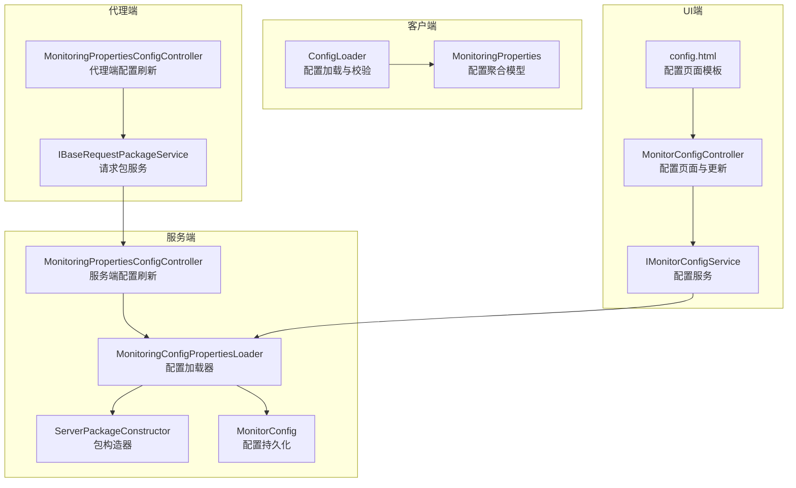
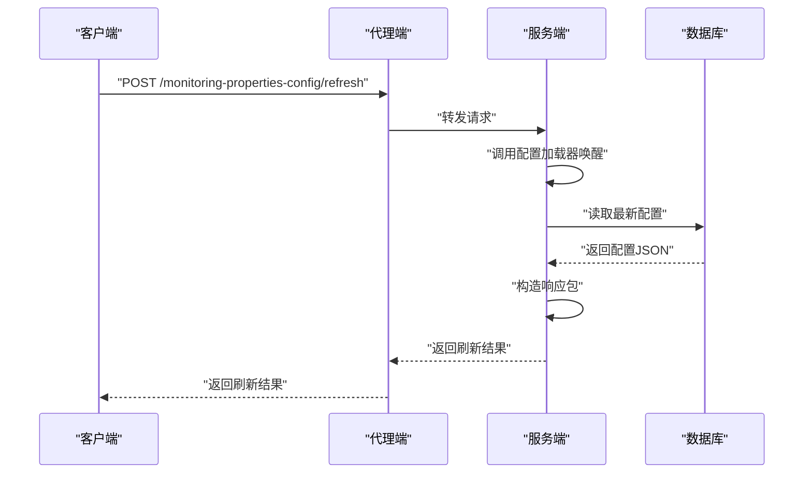
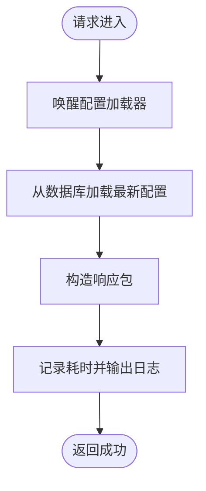
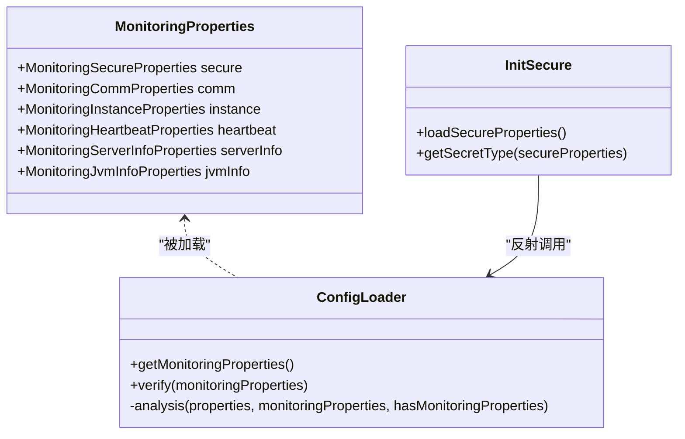
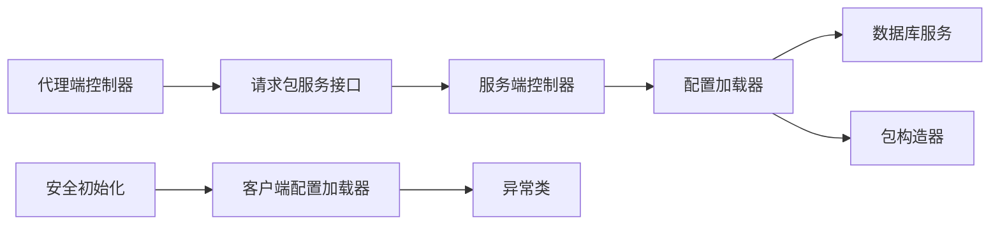

# 配置管理接口

<cite>
**本文引用的文件**
- [MonitoringPropertiesConfigController（服务端）](file://phoenix-server/src/main/java/com/gitee/pifeng/monitoring/server/business/server/controller/MonitoringPropertiesConfigController.java)
- [MonitoringPropertiesConfigController（代理端）](file://phoenix-agent/src/main/java/com/gitee/pifeng/monitoring/agent/business/client/controller/MonitoringPropertiesConfigController.java)
- [MonitorConfigController（UI端）](file://phoenix-ui/src/main/java/com/gitee/pifeng/monitoring/ui/business/web/controller/MonitorConfigController.java)
- [MonitoringConfigPropertiesLoader（服务端配置加载器）](file://phoenix-server/src/main/java/com/gitee/pifeng/monitoring/server/business/server/core/MonitoringConfigPropertiesLoader.java)
- [MonitoringProperties（客户端配置属性聚合）](file://phoenix-common/phoenix-common-core/src/main/java/com/gitee/pifeng/monitoring/common/property/client/MonitoringProperties.java)
- [MonitoringInstanceProperties（客户端实例配置）](file://phoenix-common/phoenix-common-core/src/main/java/com/gitee/pifeng/monitoring/common/property/client/MonitoringInstanceProperties.java)
- [MonitoringNetworkProperties（服务端网络配置）](file://phoenix-common/phoenix-common-core/src/main/java/com/gitee/pifeng/monitoring/common/property/server/MonitoringNetworkProperties.java)
- [ServerPackageConstructor（服务端包构造器）](file://phoenix-server/src/main/java/com/gitee/pifeng/monitoring/server/business/server/core/ServerPackageConstructor.java)
- [IBaseRequestPackageService（代理端请求包服务接口）](file://phoenix-agent/src/main/java/com/gitee/pifeng/monitoring/agent/business/client/service/IBaseRequestPackageService.java)
- [BaseRequestPackageServiceImpl（代理端请求包服务实现）](file://phoenix-agent/src/main/java/com/gitee/pifeng/monitoring/agent/business/client/service/impl/BaseRequestPackageServiceImpl.java)
- [ConfigLoader（客户端配置加载器）](file://phoenix-client/phoenix-client-core/src/main/java/com/gitee/pifeng/monitoring/plug/core/ConfigLoader.java)
- [InitSecure（安全初始化，反射读取配置）](file://phoenix-common/phoenix-common-core/src/main/java/com/gitee/pifeng/monitoring/common/init/InitSecure.java)
- [IMonitorConfigService（UI端配置服务接口）](file://phoenix-ui/src/main/java/com/gitee/pifeng/monitoring/ui/business/web/service/IMonitorConfigService.java)
- [MonitorConfigServiceImpl（UI端配置服务实现）](file://phoenix-ui/src/main/java/com/gitee/pifeng/monitoring/ui/business/web/service/impl/MonitorConfigServiceImpl.java)
- [MonitorConfig（数据库配置实体）](file://phoenix-server/src/main/java/com/gitee/pifeng/monitoring/server/business/server/entity/MonitorConfig.java)
- [Alarm（告警领域模型）](file://phoenix-common/phoenix-common-core/src/main/java/com/gitee/pifeng/monitoring/common/domain/Alarm.java)
- [ErrorConfigParamException（错误配置参数异常）](file://phoenix-common/phoenix-common-core/src/main/java/com/gitee/pifeng/monitoring/common/exception/ErrorConfigParamException.java)
- [NotFoundConfigParamException（缺失配置参数异常）](file://phoenix-common/phoenix-common-core/src/main/java/com/gitee/pifeng/monitoring/common/exception/NotFoundConfigParamException.java)
- [config.html（UI配置页面模板片段）](file://phoenix-ui/src/main/resources/templates/set/config.html)
</cite>

## 目录
1. [简介](#简介)
2. [项目结构](#项目结构)
3. [核心组件](#核心组件)
4. [架构总览](#架构总览)
5. [详细组件分析](#详细组件分析)
6. [依赖分析](#依赖分析)
7. [性能考虑](#性能考虑)
8. [故障排查指南](#故障排查指南)
9. [结论](#结论)
10. [附录](#附录)

## 简介
本文件面向Phoenix监控系统的配置管理接口，聚焦以下目标：
- 说明监控配置相关接口的功能与实现，包括监控配置获取与刷新（服务端/代理端）、配置信息管理（UI端）等。
- 解释监控配置的分类与作用：客户端配置、代理端配置、服务端配置、UI端配置等不同层级的配置项。
- 提供完整的配置数据结构说明：监控开关、采样频率、告警阈值、网络参数等字段的含义、格式与取值范围。
- 说明配置的动态更新机制、配置验证规则、默认值处理等技术细节。
- 涵盖配置导入导出、配置备份恢复、配置版本管理等能力的API说明与最佳实践。
- 提供配置优化建议与常见问题的解决方案。

## 项目结构
Phoenix采用多模块架构，配置管理涉及客户端、代理端、服务端与UI端四个层面：
- 客户端：负责采集与上报，配置加载与校验由客户端插件完成。
- 代理端：作为客户端与服务端之间的桥梁，转发配置刷新请求。
- 服务端：持久化配置、定时拉取最新配置、构建响应包。
- UI端：提供配置页面与更新入口，触发配置变更并通知服务端。

图表来源
- [MonitoringPropertiesConfigController（服务端）:1-75](file://phoenix-server/src/main/java/com/gitee/pifeng/monitoring/server/business/server/controller/MonitoringPropertiesConfigController.java#L1-L75)
- [MonitoringPropertiesConfigController（代理端）:1-57](file://phoenix-agent/src/main/java/com/gitee/pifeng/monitoring/agent/business/client/controller/MonitoringPropertiesConfigController.java#L1-L57)
- [MonitoringConfigPropertiesLoader（服务端配置加载器）:1-202](file://phoenix-server/src/main/java/com/gitee/pifeng/monitoring/server/business/server/core/MonitoringConfigPropertiesLoader.java#L1-L202)
- [ServerPackageConstructor（服务端包构造器）:23-66](file://phoenix-server/src/main/java/com/gitee/pifeng/monitoring/server/business/server/core/ServerPackageConstructor.java#L23-L66)
- [IBaseRequestPackageService（代理端请求包服务接口）:1-29](file://phoenix-agent/src/main/java/com/gitee/pifeng/monitoring/agent/business/client/service/IBaseRequestPackageService.java#L1-L29)
- [BaseRequestPackageServiceImpl（代理端请求包服务实现）:1-37](file://phoenix-agent/src/main/java/com/gitee/pifeng/monitoring/agent/business/client/service/impl/BaseRequestPackageServiceImpl.java#L1-L37)
- [ConfigLoader（客户端配置加载器）:37-402](file://phoenix-client/phoenix-client-core/src/main/java/com/gitee/pifeng/monitoring/plug/core/ConfigLoader.java#L37-L402)
- [MonitoringProperties（客户端配置属性聚合）:1-55](file://phoenix-common/phoenix-common-core/src/main/java/com/gitee/pifeng/monitoring/common/property/client/MonitoringProperties.java#L1-L55)
- [MonitorConfig（数据库配置实体）](file://phoenix-server/src/main/java/com/gitee/pifeng/monitoring/server/business/server/entity/MonitorConfig.java)

章节来源
- [MonitoringPropertiesConfigController（服务端）:1-75](file://phoenix-server/src/main/java/com/gitee/pifeng/monitoring/server/business/server/controller/MonitoringPropertiesConfigController.java#L1-L75)
- [MonitoringPropertiesConfigController（代理端）:1-57](file://phoenix-agent/src/main/java/com/gitee/pifeng/monitoring/agent/business/client/controller/MonitoringPropertiesConfigController.java#L1-L57)
- [MonitoringConfigPropertiesLoader（服务端配置加载器）:1-202](file://phoenix-server/src/main/java/com/gitee/pifeng/monitoring/server/business/server/core/MonitoringConfigPropertiesLoader.java#L1-L202)
- [ServerPackageConstructor（服务端包构造器）:23-66](file://phoenix-server/src/main/java/com/gitee/pifeng/monitoring/server/business/server/core/ServerPackageConstructor.java#L23-L66)
- [IBaseRequestPackageService（代理端请求包服务接口）:1-29](file://phoenix-agent/src/main/java/com/gitee/pifeng/monitoring/agent/business/client/service/IBaseRequestPackageService.java#L1-L29)
- [BaseRequestPackageServiceImpl（代理端请求包服务实现）:1-37](file://phoenix-agent/src/main/java/com/gitee/pifeng/monitoring/agent/business/client/service/impl/BaseRequestPackageServiceImpl.java#L1-L37)
- [ConfigLoader（客户端配置加载器）:37-402](file://phoenix-client/phoenix-client-core/src/main/java/com/gitee/pifeng/monitoring/plug/core/ConfigLoader.java#L37-L402)
- [MonitoringProperties（客户端配置属性聚合）:1-55](file://phoenix-common/phoenix-common-core/src/main/java/com/gitee/pifeng/monitoring/common/property/client/MonitoringProperties.java#L1-L55)
- [MonitorConfig（数据库配置实体）](file://phoenix-server/src/main/java/com/gitee/pifeng/monitoring/server/business/server/entity/MonitorConfig.java)

## 核心组件
- 服务端配置刷新控制器：接收刷新请求，唤醒配置加载器，构造响应包。
- 代理端配置刷新控制器：接收客户端请求，转发至服务端。
- 服务端配置加载器：从数据库读取最新配置，定时轮询更新内存配置。
- 服务端包构造器：封装通用响应包，用于返回刷新结果。
- 客户端配置加载器：解析配置、校验参数、设置默认值。
- UI端配置控制器与服务：提供配置页面、接收更新请求、调用服务端刷新。
- 配置持久化实体：存储配置JSON与时间戳，支持备份与版本管理。

章节来源
- [MonitoringPropertiesConfigController（服务端）:35-75](file://phoenix-server/src/main/java/com/gitee/pifeng/monitoring/server/business/server/controller/MonitoringPropertiesConfigController.java#L35-L75)
- [MonitoringPropertiesConfigController（代理端）:30-57](file://phoenix-agent/src/main/java/com/gitee/pifeng/monitoring/agent/business/client/controller/MonitoringPropertiesConfigController.java#L30-L57)
- [MonitoringConfigPropertiesLoader（服务端配置加载器）:31-202](file://phoenix-server/src/main/java/com/gitee/pifeng/monitoring/server/business/server/core/MonitoringConfigPropertiesLoader.java#L31-L202)
- [ServerPackageConstructor（服务端包构造器）:40-66](file://phoenix-server/src/main/java/com/gitee/pifeng/monitoring/server/business/server/core/ServerPackageConstructor.java#L40-L66)
- [ConfigLoader（客户端配置加载器）:37-402](file://phoenix-client/phoenix-client-core/src/main/java/com/gitee/pifeng/monitoring/plug/core/ConfigLoader.java#L37-L402)
- [MonitorConfig（数据库配置实体）](file://phoenix-server/src/main/java/com/gitee/pifeng/monitoring/server/business/server/entity/MonitorConfig.java)

## 架构总览
下图展示配置刷新的端到端流程：客户端或UI端发起刷新，代理端转发，服务端加载最新配置并返回响应。

图表来源
- [MonitoringPropertiesConfigController（代理端）:50-54](file://phoenix-agent/src/main/java/com/gitee/pifeng/monitoring/agent/business/client/controller/MonitoringPropertiesConfigController.java#L50-L54)
- [MonitoringPropertiesConfigController（服务端）:60-72](file://phoenix-server/src/main/java/com/gitee/pifeng/monitoring/server/business/server/controller/MonitoringPropertiesConfigController.java#L60-L72)
- [MonitoringConfigPropertiesLoader（服务端配置加载器）:197-200](file://phoenix-server/src/main/java/com/gitee/pifeng/monitoring/server/business/server/core/MonitoringConfigPropertiesLoader.java#L197-L200)

## 详细组件分析

### 服务端配置刷新接口
- 接口路径：/monitoring-properties-config/refresh
- 请求方式：POST
- 功能：唤醒配置加载器，从数据库读取最新配置，构造成功响应包。
- 性能：内置计时器，超过1秒进行告警日志输出，便于发现配置加载卡顿。

图表来源
- [MonitoringPropertiesConfigController（服务端）:60-72](file://phoenix-server/src/main/java/com/gitee/pifeng/monitoring/server/business/server/controller/MonitoringPropertiesConfigController.java#L60-L72)
- [MonitoringConfigPropertiesLoader（服务端配置加载器）:197-200](file://phoenix-server/src/main/java/com/gitee/pifeng/monitoring/server/business/server/core/MonitoringConfigPropertiesLoader.java#L197-L200)

章节来源
- [MonitoringPropertiesConfigController（服务端）:57-72](file://phoenix-server/src/main/java/com/gitee/pifeng/monitoring/server/business/server/controller/MonitoringPropertiesConfigController.java#L57-L72)
- [MonitoringConfigPropertiesLoader（服务端配置加载器）:197-200](file://phoenix-server/src/main/java/com/gitee/pifeng/monitoring/server/business/server/core/MonitoringConfigPropertiesLoader.java#L197-L200)

### 代理端配置刷新接口
- 接口路径：/monitoring-properties-config/refresh
- 请求方式：POST
- 功能：接收客户端请求，通过请求包服务转发至服务端，返回服务端响应。
- 适用场景：客户端侧触发配置刷新，代理端作为网关转发。

章节来源
- [MonitoringPropertiesConfigController（代理端）:48-54](file://phoenix-agent/src/main/java/com/gitee/pifeng/monitoring/agent/business/client/controller/MonitoringPropertiesConfigController.java#L48-L54)
- [IBaseRequestPackageService（代理端请求包服务接口）:16-27](file://phoenix-agent/src/main/java/com/gitee/pifeng/monitoring/agent/business/client/service/IBaseRequestPackageService.java#L16-L27)
- [BaseRequestPackageServiceImpl（代理端请求包服务实现）:31-35](file://phoenix-agent/src/main/java/com/gitee/pifeng/monitoring/agent/business/client/service/impl/BaseRequestPackageServiceImpl.java#L31-L35)

### UI端配置管理接口
- 页面访问：GET /monitor-config/config
- 更新配置：PUT /monitor-config/update-monitor-config
- 功能：渲染配置页面，接收表单并调用服务层更新配置，同时尝试刷新服务端配置。
- 权限：需要超级管理员权限。

章节来源
- [MonitorConfigController（UI端）:50-81](file://phoenix-ui/src/main/java/com/gitee/pifeng/monitoring/ui/business/web/controller/MonitorConfigController.java#L50-L81)
- [IMonitorConfigService（UI端配置服务接口）:18-45](file://phoenix-ui/src/main/java/com/gitee/pifeng/monitoring/ui/business/web/service/IMonitorConfigService.java#L18-L45)

### 客户端配置加载与验证
- 配置聚合模型：MonitoringProperties，包含安全、通信、实例、心跳、服务器、JVM等子配置。
- 加载与校验：ConfigLoader负责解析配置、设置默认值、抛出参数异常。
- 默认值示例：HTTP连接超时默认15000ms；网络监控默认关闭等。
- 反射集成：InitSecure通过反射从ConfigLoader获取MonitoringProperties，以加载安全配置。

图表来源
- [MonitoringProperties（客户端配置属性聚合）:22-55](file://phoenix-common/phoenix-common-core/src/main/java/com/gitee/pifeng/monitoring/common/property/client/MonitoringProperties.java#L22-L55)
- [ConfigLoader（客户端配置加载器）:57-78](file://phoenix-client/phoenix-client-core/src/main/java/com/gitee/pifeng/monitoring/plug/core/ConfigLoader.java#L57-L78)
- [InitSecure（安全初始化，反射读取配置）:98-142](file://phoenix-common/phoenix-common-core/src/main/java/com/gitee/pifeng/monitoring/common/init/InitSecure.java#L98-L142)

章节来源
- [MonitoringProperties（客户端配置属性聚合）:22-55](file://phoenix-common/phoenix-common-core/src/main/java/com/gitee/pifeng/monitoring/common/property/client/MonitoringProperties.java#L22-L55)
- [ConfigLoader（客户端配置加载器）:170-179](file://phoenix-client/phoenix-client-core/src/main/java/com/gitee/pifeng/monitoring/plug/core/ConfigLoader.java#L170-L179)
- [InitSecure（安全初始化，反射读取配置）:98-142](file://phoenix-common/phoenix-common-core/src/main/java/com/gitee/pifeng/monitoring/common/init/InitSecure.java#L98-L142)

### 服务端配置持久化与定时刷新
- 持久化：MonitorConfig实体保存配置JSON与时间戳，支持备份与版本管理。
- 定时刷新：配置加载器每5分钟从数据库拉取最新配置，更新内存中的MonitoringProperties。
- 刷新触发：服务端控制器的refresh接口可手动唤醒加载器。

章节来源
- [MonitoringConfigPropertiesLoader（服务端配置加载器）:176-187](file://phoenix-server/src/main/java/com/gitee/pifeng/monitoring/server/business/server/core/MonitoringConfigPropertiesLoader.java#L176-L187)
- [MonitoringConfigPropertiesLoader（服务端配置加载器）:197-200](file://phoenix-server/src/main/java/com/gitee/pifeng/monitoring/server/business/server/core/MonitoringConfigPropertiesLoader.java#L197-L200)
- [MonitorConfig（数据库配置实体）](file://phoenix-server/src/main/java/com/gitee/pifeng/monitoring/server/business/server/entity/MonitorConfig.java)

### 配置数据结构说明
- 客户端配置（MonitoringProperties）
  - 安全配置（secure）：加密算法类型等。
  - 通信配置（comm）：HTTP服务器地址、连接超时、套接字超时、连接请求超时等。
  - 实例配置（instance）：实例次序、端点类型、名称、描述、语言等。
  - 心跳配置（heartbeat）：心跳周期等。
  - 服务器信息配置（serverInfo）：CPU、负载、磁盘、内存等监控开关与阈值。
  - JVM信息配置（jvmInfo）：JVM指标监控开关与阈值。
- 服务端网络配置（MonitoringNetworkProperties）
  - enable：是否启用网络监控。
  - networkStatusProperties：网络状态配置属性。
- 告警配置（Alarm）
  - 告警级别（alarmLevel）、告警方式（alarmWay）、告警静默等。

章节来源
- [MonitoringProperties（客户端配置属性聚合）:22-55](file://phoenix-common/phoenix-common-core/src/main/java/com/gitee/pifeng/monitoring/common/property/client/MonitoringProperties.java#L22-L55)
- [MonitoringInstanceProperties（客户端实例配置）:20-47](file://phoenix-common/phoenix-common-core/src/main/java/com/gitee/pifeng/monitoring/common/property/client/MonitoringInstanceProperties.java#L20-L47)
- [MonitoringNetworkProperties（服务端网络配置）:19-31](file://phoenix-common/phoenix-common-core/src/main/java/com/gitee/pifeng/monitoring/common/property/server/MonitoringNetworkProperties.java#L19-L31)
- [Alarm（告警领域模型）:37-83](file://phoenix-common/phoenix-common-core/src/main/java/com/gitee/pifeng/monitoring/common/domain/Alarm.java#L37-L83)

### 配置验证规则与默认值处理
- 参数校验：ConfigLoader在analysis阶段封装各子配置，遇到缺失或错误参数抛出异常。
- 异常类型：NotFoundConfigParamException（缺少参数）、ErrorConfigParamException（参数错误）。
- 默认值策略：未显式设置时采用默认值（如HTTP超时默认15000ms）。

章节来源
- [ConfigLoader（客户端配置加载器）:170-179](file://phoenix-client/phoenix-client-core/src/main/java/com/gitee/pifeng/monitoring/plug/core/ConfigLoader.java#L170-L179)
- [ErrorConfigParamException（错误配置参数异常）:1-25](file://phoenix-common/phoenix-common-core/src/main/java/com/gitee/pifeng/monitoring/common/exception/ErrorConfigParamException.java#L1-L25)
- [NotFoundConfigParamException（缺失配置参数异常）:1-26](file://phoenix-common/phoenix-common-core/src/main/java/com/gitee/pifeng/monitoring/common/exception/NotFoundConfigParamException.java#L1-L26)

### 配置导入导出、备份恢复与版本管理
- 导入导出：通过UI端配置页面提交表单，服务端写入数据库；可基于MonitorConfig实体导出/导入配置JSON。
- 备份恢复：MonitorConfig记录插入与更新时间，可用于版本回滚与恢复。
- 版本管理：通过更新时间字段实现版本对比与差异追踪。

章节来源
- [MonitorConfigController（UI端）:74-81](file://phoenix-ui/src/main/java/com/gitee/pifeng/monitoring/ui/business/web/controller/MonitorConfigController.java#L74-L81)
- [MonitorConfig（数据库配置实体）](file://phoenix-server/src/main/java/com/gitee/pifeng/monitoring/server/business/server/entity/MonitorConfig.java)
- [config.html（UI配置页面模板片段）:44-100](file://phoenix-ui/src/main/resources/templates/set/config.html#L44-L100)

## 依赖分析
- 控制器依赖：服务端控制器依赖配置加载器与包构造器；代理端控制器依赖请求包服务接口。
- 服务端依赖：配置加载器依赖数据库服务与定时任务；包构造器依赖通用包构造抽象类。
- 客户端依赖：ConfigLoader依赖异常类与工具类；InitSecure通过反射依赖ConfigLoader。

图表来源
- [MonitoringPropertiesConfigController（代理端）:35-54](file://phoenix-agent/src/main/java/com/gitee/pifeng/monitoring/agent/business/client/controller/MonitoringPropertiesConfigController.java#L35-L54)
- [MonitoringPropertiesConfigController（服务端）:40-46](file://phoenix-server/src/main/java/com/gitee/pifeng/monitoring/server/business/server/controller/MonitoringPropertiesConfigController.java#L40-L46)
- [MonitoringConfigPropertiesLoader（服务端配置加载器）:11-14](file://phoenix-server/src/main/java/com/gitee/pifeng/monitoring/server/business/server/core/MonitoringConfigPropertiesLoader.java#L11-L14)
- [ServerPackageConstructor（服务端包构造器）:40-66](file://phoenix-server/src/main/java/com/gitee/pifeng/monitoring/server/business/server/core/ServerPackageConstructor.java#L40-L66)
- [ConfigLoader（客户端配置加载器）:37-402](file://phoenix-client/phoenix-client-core/src/main/java/com/gitee/pifeng/monitoring/plug/core/ConfigLoader.java#L37-L402)
- [InitSecure（安全初始化，反射读取配置）:98-142](file://phoenix-common/phoenix-common-core/src/main/java/com/gitee/pifeng/monitoring/common/init/InitSecure.java#L98-L142)

章节来源
- [MonitoringPropertiesConfigController（代理端）:35-54](file://phoenix-agent/src/main/java/com/gitee/pifeng/monitoring/agent/business/client/controller/MonitoringPropertiesConfigController.java#L35-L54)
- [MonitoringPropertiesConfigController（服务端）:40-46](file://phoenix-server/src/main/java/com/gitee/pifeng/monitoring/server/business/server/controller/MonitoringPropertiesConfigController.java#L40-L46)
- [MonitoringConfigPropertiesLoader（服务端配置加载器）:11-14](file://phoenix-server/src/main/java/com/gitee/pifeng/monitoring/server/business/server/core/MonitoringConfigPropertiesLoader.java#L11-L14)
- [ServerPackageConstructor（服务端包构造器）:40-66](file://phoenix-server/src/main/java/com/gitee/pifeng/monitoring/server/business/server/core/ServerPackageConstructor.java#L40-L66)
- [ConfigLoader（客户端配置加载器）:37-402](file://phoenix-client/phoenix-client-core/src/main/java/com/gitee/pifeng/monitoring/plug/core/ConfigLoader.java#L37-L402)
- [InitSecure（安全初始化，反射读取配置）:98-142](file://phoenix-common/phoenix-common-core/src/main/java/com/gitee/pifeng/monitoring/common/init/InitSecure.java#L98-L142)

## 性能考虑
- 定时刷新：服务端配置加载器每5分钟轮询一次，避免频繁I/O。
- 耗时监控：服务端刷新接口内置计时器，超过1秒输出警告日志，便于定位性能瓶颈。
- 连接超时：客户端HTTP连接超时默认15000ms，可根据网络状况调整。
- 建议：在高并发场景下，适当增加连接池大小与线程池容量；对配置变更进行批量处理，减少频繁刷新。

## 故障排查指南
- 配置加载异常
  - 现象：刷新后配置未生效或报错。
  - 排查：检查服务端日志中的耗时告警；确认数据库中MonitorConfig记录是否存在且最新。
- 参数校验失败
  - 现象：启动或刷新时报“缺少参数”或“参数错误”。
  - 排查：对照ConfigLoader的analysis逻辑，补齐必填项或修正取值范围。
- 代理端转发失败
  - 现象：客户端调用代理端接口后无响应。
  - 排查：确认代理端请求包服务实现是否正确转发至服务端；检查网络连通性。
- UI端权限不足
  - 现象：更新配置时报权限不足。
  - 排查：确保当前用户具备“超级管理员”权限。

章节来源
- [MonitoringPropertiesConfigController（服务端）:66-71](file://phoenix-server/src/main/java/com/gitee/pifeng/monitoring/server/business/server/controller/MonitoringPropertiesConfigController.java#L66-L71)
- [MonitoringConfigPropertiesLoader（服务端配置加载器）:176-187](file://phoenix-server/src/main/java/com/gitee/pifeng/monitoring/server/business/server/core/MonitoringConfigPropertiesLoader.java#L176-L187)
- [ConfigLoader（客户端配置加载器）:170-179](file://phoenix-client/phoenix-client-core/src/main/java/com/gitee/pifeng/monitoring/plug/core/ConfigLoader.java#L170-L179)
- [MonitorConfigController（UI端）:77-81](file://phoenix-ui/src/main/java/com/gitee/pifeng/monitoring/ui/business/web/controller/MonitorConfigController.java#L77-L81)

## 结论
Phoenix配置管理接口围绕“客户端—代理端—服务端—UI端”的链路实现了配置的统一管理与动态更新。通过数据库持久化与定时刷新机制，确保配置的实时性与一致性；通过客户端加载器与异常体系，保障配置的合法性与健壮性。结合UI端的页面与权限控制，形成完整的配置生命周期闭环。

## 附录
- 配置优化建议
  - 合理设置HTTP超时与重试策略，避免因网络波动导致配置加载失败。
  - 在生产环境启用配置备份与版本回滚，降低变更风险。
  - 对高频配置变更进行合并处理，减少服务端轮询压力。
- 常见问题
  - 配置未生效：检查服务端定时任务是否正常运行，以及数据库记录是否更新。
  - 参数校验失败：核对配置键名与取值范围，参考客户端加载器的默认值策略。
  - 权限不足：确认UI端操作用户的权限角色。