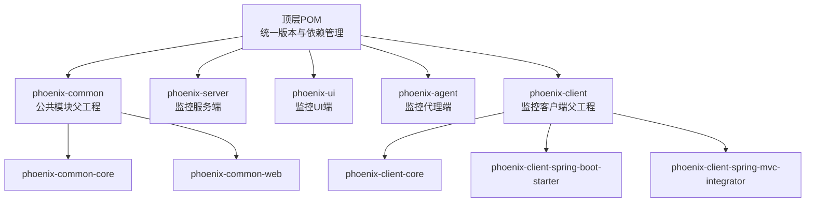
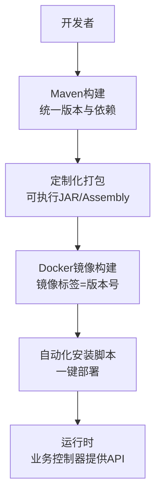
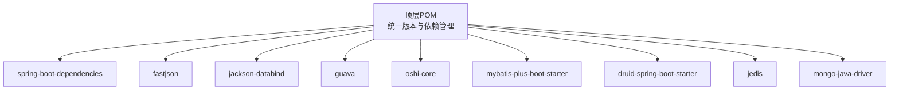

# 版本管理与兼容性

<cite>
**本文档引用的文件**
- [pom.xml](file://pom.xml)
- [phoenix-agent\pom.xml](file://phoenix-agent\pom.xml)
- [phoenix-server\pom.xml](file://phoenix-server\pom.xml)
- [phoenix-ui\pom.xml](file://phoenix-ui\pom.xml)
- [phoenix-client\pom.xml](file://phoenix-client\pom.xml)
- [phoenix-common\pom.xml](file://phoenix-common\pom.xml)
- [doc\Docker\install.sh](file://doc\Docker\install.sh)
- [doc\Docker\install.1.2.6.RELEASE-CR3.sh](file://doc\Docker\install.1.2.6.RELEASE-CR3.sh)
- [doc\Docker\install.1.2.6.RELEASE-CR4.sh](file://doc\Docker\install.1.2.6.RELEASE-CR4.sh)
- [doc\Docker\install.1.2.6.RELEASE-CR5.sh](file://doc\Docker\install.1.2.6.RELEASE-CR5.sh)
- [doc\Docker\mysql\run_container.1.2.6.RELEASE-CR3.sh](file://doc\Docker\mysql\run_container.1.2.6.RELEASE-CR3.sh)
- [doc\Docker\mysql\run_container.1.2.6.RELEASE-CR4.sh](file://doc\Docker\mysql\run_container.1.2.6.RELEASE-CR4.sh)
- [doc\Docker\mysql\run_container.1.2.6.RELEASE-CR5.sh](file://doc\Docker\mysql\run_container.1.2.6.RELEASE-CR5.sh)
- [doc\Docker\phoenix-server\run_container.1.2.6.RELEASE-CR3.sh](file://doc\Docker\phoenix-server\run_container.1.2.6.RELEASE-CR3.sh)
- [doc\Docker\phoenix-server\run_container.1.2.6.RELEASE-CR4.sh](file://doc\Docker\phoenix-server\run_container.1.2.6.RELEASE-CR4.sh)
- [doc\Docker\phoenix-server\run_container.1.2.6.RELEASE-CR5.sh](file://doc\Docker\phoenix-server\run_container.1.2.6.RELEASE-CR5.sh)
- [doc\Docker\phoenix-ui\run_container.1.2.6.RELEASE-CR3.sh](file://doc\Docker\phoenix-ui\run_container.1.2.6.RELEASE-CR3.sh)
- [doc\Docker\phoenix-ui\run_container.1.2.6.RELEASE-CR4.sh](file://doc\Docker\phoenix-ui\run_container.1.2.6.RELEASE-CR4.sh)
- [doc\Docker\phoenix-ui\run_container.1.2.6.RELEASE-CR5.sh](file://doc\Docker\phoenix-ui\run_container.1.2.6.RELEASE-CR5.sh)
- [doc\LinuxServices\build_phoenix.sh](file://doc\LinuxServices\build_phoenix.sh)
- [doc\LinuxServices\auto_package.sh](file://doc\LinuxServices\auto_package.sh)
- [phoenix-server\src\main\java\com\gitee\pifeng\monitoring\server\business\server\controller\HttpController.java](file://phoenix-server\src\main\java\com\gitee\pifeng\monitoring\server\business\server\controller\HttpController.java)
- [phoenix-server\src\main\java\com\gitee\pifeng\monitoring\server\business\server\controller\HeartbeatController.java](file://phoenix-server\src\main\java\com\gitee\pifeng\monitoring\server\business\server\controller\HeartbeatController.java)
</cite>

## 目录
1. [引言](#引言)
2. [项目结构](#项目结构)
3. [核心组件](#核心组件)
4. [架构总览](#架构总览)
5. [详细组件分析](#详细组件分析)
6. [依赖关系分析](#依赖关系分析)
7. [性能考量](#性能考量)
8. [故障排查指南](#故障排查指南)
9. [结论](#结论)
10. [附录](#附录)

## 引言
本文件面向Phoenix监控系统，提供一套完整的版本管理与兼容性策略，覆盖版本号命名规范、发布周期、向后兼容性保证、升级与回滚流程、废弃API处理、兼容性矩阵、发布前测试要求、版本监控与反馈机制以及版本文档维护规范。内容基于仓库中的Maven多模块结构、Docker与安装脚本、以及核心业务控制器接口进行归纳总结。

## 项目结构
Phoenix采用多模块Maven工程组织，顶层统一版本号与依赖管理，子模块按“公共模块”“服务端”“UI端”“代理端”“客户端”划分，便于版本对齐与发布。

图表来源
- [pom.xml:1-26](file://pom.xml#L1-L26)
- [phoenix-common\pom.xml:1-45](file://phoenix-common\pom.xml#L1-L45)
- [phoenix-client\pom.xml:1-54](file://phoenix-client\pom.xml#L1-L54)
- [phoenix-server\pom.xml:1-145](file://phoenix-server\pom.xml#L1-L145)
- [phoenix-ui\pom.xml:1-160](file://phoenix-ui\pom.xml#L1-L160)
- [phoenix-agent\pom.xml:1-82](file://phoenix-agent\pom.xml#L1-L82)

章节来源
- [pom.xml:1-26](file://pom.xml#L1-L26)
- [phoenix-common\pom.xml:1-45](file://phoenix-common\pom.xml#L1-L45)
- [phoenix-client\pom.xml:1-54](file://phoenix-client\pom.xml#L1-L54)
- [phoenix-server\pom.xml:1-145](file://phoenix-server\pom.xml#L1-L145)
- [phoenix-ui\pom.xml:1-160](file://phoenix-ui\pom.xml#L1-L160)
- [phoenix-agent\pom.xml:1-82](file://phoenix-agent\pom.xml#L1-L82)

## 核心组件
- 版本号与命名规范
  - 使用“主版本.次版本.修订版本.阶段-修订号”的格式，例如“1.2.7.RELEASE”“1.2.6.RELEASE-CR5”。其中“RELEASE”表示稳定版，“CRx”表示候选发布版本。
  - 顶层POM统一声明版本号，子模块通过父POM继承，确保版本对齐。
- 发布与打包
  - 子模块默认跳过独立部署（如代理、服务端、UI），由顶层统一打包与发布；同时提供Docker镜像与自动化安装脚本，便于快速部署。
- 兼容性与依赖
  - 顶层POM集中管理第三方依赖版本，子模块通过依赖管理统一拉取，降低版本漂移带来的兼容性问题。

章节来源
- [pom.xml:10](file://pom.xml#L10)
- [phoenix-agent\pom.xml:11](file://phoenix-agent\pom.xml#L11)
- [phoenix-server\pom.xml:11](file://phoenix-server\pom.xml#L11)
- [phoenix-ui\pom.xml:11](file://phoenix-ui\pom.xml#L11)
- [phoenix-client\pom.xml:11](file://phoenix-client\pom.xml#L11)
- [phoenix-common\pom.xml:11](file://phoenix-common\pom.xml#L11)

## 架构总览
Phoenix版本管理与兼容性贯穿于“构建—发布—部署—运行”全链路。顶层POM统一版本与依赖，子模块按需继承；Docker与安装脚本提供跨环境一致的部署体验；业务控制器作为API边界，承载对外接口契约。

图表来源
- [pom.xml:394-700](file://pom.xml#L394-L700)
- [phoenix-server\pom.xml:103-145](file://phoenix-server\pom.xml#L103-L145)
- [phoenix-ui\pom.xml:118-160](file://phoenix-ui\pom.xml#L118-L160)
- [phoenix-agent\pom.xml:40-82](file://phoenix-agent\pom.xml#L40-L82)
- [doc\Docker\install.sh:1-22](file://doc\Docker\install.sh#L1-L22)
- [doc\LinuxServices\build_phoenix.sh:1-48](file://doc\LinuxServices\build_phoenix.sh#L1-L48)

## 详细组件分析

### 版本号命名规范与发布周期
- 命名规范
  - 主版本.次版本.修订版本.阶段-修订号，如“1.2.7.RELEASE”“1.2.6.RELEASE-CR5”。
  - 稳定版使用“RELEASE”，候选版本使用“CRx”后缀。
- 发布周期
  - 候选发布（CRx）用于功能冻结与回归测试，稳定发布（RELEASE）用于正式上线。
  - Docker镜像标签与安装脚本均与版本号保持一致，便于追踪与回滚。
- 版本对齐
  - 顶层POM统一版本，子模块继承，避免版本漂移导致的兼容性问题。

章节来源
- [pom.xml:10](file://pom.xml#L10)
- [phoenix-agent\pom.xml:11](file://phoenix-agent\pom.xml#L11)
- [phoenix-server\pom.xml:11](file://phoenix-server\pom.xml#L11)
- [phoenix-ui\pom.xml:11](file://phoenix-ui\pom.xml#L11)
- [phoenix-client\pom.xml:11](file://phoenix-client\pom.xml#L11)
- [phoenix-common\pom.xml:11](file://phoenix-common\pom.xml#L11)
- [doc\Docker\mysql\run_container.1.2.6.RELEASE-CR3.sh:7](file://doc\Docker\mysql\run_container.1.2.6.RELEASE-CR3.sh#L7)
- [doc\Docker\mysql\run_container.1.2.6.RELEASE-CR4.sh:7](file://doc\Docker\mysql\run_container.1.2.6.RELEASE-CR4.sh#L7)
- [doc\Docker\mysql\run_container.1.2.6.RELEASE-CR5.sh:7](file://doc\Docker\mysql\run_container.1.2.6.RELEASE-CR5.sh#L7)
- [doc\Docker\phoenix-server\run_container.1.2.6.RELEASE-CR3.sh:7](file://doc\Docker\phoenix-server\run_container.1.2.6.RELEASE-CR3.sh#L7)
- [doc\Docker\phoenix-server\run_container.1.2.6.RELEASE-CR4.sh:7](file://doc\Docker\phoenix-server\run_container.1.2.6.RELEASE-CR4.sh#L7)
- [doc\Docker\phoenix-server\run_container.1.2.6.RELEASE-CR5.sh:7](file://doc\Docker\phoenix-server\run_container.1.2.6.RELEASE-CR5.sh#L7)
- [doc\Docker\phoenix-ui\run_container.1.2.6.RELEASE-CR3.sh:7](file://doc\Docker\phoenix-ui\run_container.1.2.6.RELEASE-CR3.sh#L7)
- [doc\Docker\phoenix-ui\run_container.1.2.6.RELEASE-CR4.sh:7](file://doc\Docker\phoenix-ui\run_container.1.2.6.RELEASE-CR4.sh#L7)
- [doc\Docker\phoenix-ui\run_container.1.2.6.RELEASE-CR5.sh:7](file://doc\Docker\phoenix-ui\run_container.1.2.6.RELEASE-CR5.sh#L7)

### 向后兼容性保证原则
- API契约稳定
  - 业务控制器作为对外API边界，保持请求/响应包结构稳定，避免破坏性变更。
- 依赖版本锁定
  - 顶层POM集中管理第三方依赖版本，子模块统一拉取，降低因依赖版本不一致引发的兼容性问题。
- 发布策略
  - 仅在稳定版（RELEASE）引入破坏性变更；候选版（CRx）聚焦修复与回归测试。

章节来源
- [phoenix-server\src\main\java\com\gitee\pifeng\monitoring\server\business\server\controller\HttpController.java:1-33](file://phoenix-server\src\main\java\com\gitee\pifeng\monitoring\server\business\server\controller\HttpController.java#L1-L33)
- [phoenix-server\src\main\java\com\gitee\pifeng\monitoring\server\business\server\controller\HeartbeatController.java:1-33](file://phoenix-server\src\main\java\com\gitee\pifeng\monitoring\server\business\server\controller\HeartbeatController.java#L1-L33)
- [pom.xml:131-392](file://pom.xml#L131-L392)

### 版本升级指南
- 新旧版本差异对比
  - 对照不同版本的Docker安装脚本与容器运行脚本，识别镜像标签、依赖版本与部署方式变化。
- 升级步骤
  - 备份现有配置与数据。
  - 下载目标版本安装脚本并执行，或直接拉取对应版本的Docker镜像。
  - 启动服务端与UI端，确认健康状态。
  - 验证监控代理端接入与数据上报。
- 数据迁移注意事项
  - 若涉及数据库结构变更，需先备份数据库，再执行迁移脚本，最后验证数据完整性。
- 兼容性测试要求
  - 功能回归测试、接口连通性测试、性能基准测试、安全扫描。

章节来源
- [doc\Docker\install.sh:1-22](file://doc\Docker\install.sh#L1-L22)
- [doc\LinuxServices\build_phoenix.sh:1-48](file://doc\LinuxServices\build_phoenix.sh#L1-L48)
- [doc\LinuxServices\auto_package.sh:1-24](file://doc\LinuxServices\auto_package.sh#L1-L24)

### 废弃API处理流程
- 废弃时间表制定
  - 在候选版本（CRx）中引入废弃标记，明确废弃计划与替代方案。
- 替代方案提供
  - 提供新接口或参数迁移路径，并在安装脚本与部署文档中标注。
- 过渡期支持策略
  - 在稳定版（RELEASE）中保留兼容层一段时间，逐步引导用户迁移。
- 弃用通知机制
  - 通过版本日志、安装脚本提示与Docker镜像说明，告知用户弃用信息与迁移指引。

章节来源
- [doc\Docker\install.1.2.6.RELEASE-CR3.sh:1-10](file://doc\Docker\install.1.2.6.RELEASE-CR3.sh#L1-L10)
- [doc\Docker\install.1.2.6.RELEASE-CR4.sh:1-10](file://doc\Docker\install.1.2.6.RELEASE-CR4.sh#L1-L10)
- [doc\Docker\install.1.2.6.RELEASE-CR5.sh:1-10](file://doc\Docker\install.1.2.6.RELEASE-CR5.sh#L1-L10)

### 版本兼容性矩阵（示例）
以下矩阵展示不同版本间的关键兼容点与依赖参考。实际矩阵应结合具体版本的Docker镜像标签、安装脚本与依赖版本进行填充。

- 版本维度
  - 1.2.6.RELEASE-CR3
  - 1.2.6.RELEASE-CR4
  - 1.2.6.RELEASE-CR5
  - 1.2.7.RELEASE
- 兼容性要点
  - Docker镜像标签与安装脚本版本一致。
  - 服务端、UI端、代理端镜像版本同步。
  - 数据库驱动与第三方依赖版本在各版本间保持兼容。

章节来源
- [doc\Docker\mysql\run_container.1.2.6.RELEASE-CR3.sh:7](file://doc\Docker\mysql\run_container.1.2.6.RELEASE-CR3.sh#L7)
- [doc\Docker\mysql\run_container.1.2.6.RELEASE-CR4.sh:7](file://doc\Docker\mysql\run_container.1.2.6.RELEASE-CR4.sh#L7)
- [doc\Docker\mysql\run_container.1.2.6.RELEASE-CR5.sh:7](file://doc\Docker\mysql\run_container.1.2.6.RELEASE-CR5.sh#L7)
- [doc\Docker\phoenix-server\run_container.1.2.6.RELEASE-CR3.sh:7](file://doc\Docker\phoenix-server\run_container.1.2.6.RELEASE-CR3.sh#L7)
- [doc\Docker\phoenix-server\run_container.1.2.6.RELEASE-CR4.sh:7](file://doc\Docker\phoenix-server\run_container.1.2.6.RELEASE-CR4.sh#L7)
- [doc\Docker\phoenix-server\run_container.1.2.6.RELEASE-CR5.sh:7](file://doc\Docker\phoenix-server\run_container.1.2.6.RELEASE-CR5.sh#L7)
- [doc\Docker\phoenix-ui\run_container.1.2.6.RELEASE-CR3.sh:7](file://doc\Docker\phoenix-ui\run_container.1.2.6.RELEASE-CR3.sh#L7)
- [doc\Docker\phoenix-ui\run_container.1.2.6.RELEASE-CR4.sh:7](file://doc\Docker\phoenix-ui\run_container.1.2.6.RELEASE-CR4.sh#L7)
- [doc\Docker\phoenix-ui\run_container.1.2.6.RELEASE-CR5.sh:7](file://doc\Docker\phoenix-ui\run_container.1.2.6.RELEASE-CR5.sh#L7)

### 版本回滚策略
- 回滚条件判断
  - 上线后出现严重功能异常、性能退化、安全漏洞或数据不一致。
- 回滚步骤说明
  - 停止当前版本服务端与UI端，回切至上一稳定版本（RELEASE）的Docker镜像或安装脚本。
  - 恢复备份的配置与数据库。
  - 验证服务可用性与数据一致性。
- 数据一致性保证
  - 回滚前完成数据库快照与配置备份；回滚后执行一致性校验。
- 回滚风险评估
  - 评估回滚窗口、影响范围与恢复时间；准备应急预案与演练。

章节来源
- [doc\Docker\install.sh:1-22](file://doc\Docker\install.sh#L1-L22)
- [doc\LinuxServices\build_phoenix.sh:1-48](file://doc\LinuxServices\build_phoenix.sh#L1-L48)

### 版本发布前测试要求
- 单元测试覆盖率
  - 使用JaCoCo插件统计覆盖率，确保关键模块达到预期阈值。
- 集成测试验证
  - 覆盖服务端、UI端与代理端的端到端流程，验证API连通性与数据流转。
- 性能测试评估
  - 基准负载测试，评估CPU、内存、网络与数据库压力下的表现。
- 安全测试检查
  - 依赖漏洞扫描与敏感信息检查，确保第三方组件无高危风险。

章节来源
- [pom.xml:584-682](file://pom.xml#L584-L682)

### 版本监控与反馈机制
- 运行时监控
  - 业务控制器提供心跳与HTTP等接口，作为健康检查与告警入口。
- 日志与审计
  - 统一日志配置，记录版本信息与异常堆栈，便于问题定位。
- 用户反馈
  - 通过安装脚本与Docker说明文档收集用户反馈，持续优化版本策略。

章节来源
- [phoenix-server\src\main\java\com\gitee\pifeng\monitoring\server\business\server\controller\HttpController.java:1-33](file://phoenix-server\src\main\java\com\gitee\pifeng\monitoring\server\business\server\controller\HttpController.java#L1-L33)
- [phoenix-server\src\main\java\com\gitee\pifeng\monitoring\server\business\server\controller\HeartbeatController.java:1-33](file://phoenix-server\src\main\java\com\gitee\pifeng\monitoring\server\business\server\controller\HeartbeatController.java#L1-L33)

### 版本文档维护规范
- 文档与代码同步
  - 版本发布时同步更新安装脚本、Docker说明与部署文档，确保与实际产物一致。
- 版本说明
  - 在安装脚本与Docker镜像中明确标注版本号与变更摘要，便于追溯。

章节来源
- [doc\Docker\install.sh:1-22](file://doc\Docker\install.sh#L1-L22)
- [doc\LinuxServices\auto_package.sh:1-24](file://doc\LinuxServices\auto_package.sh#L1-L24)

## 依赖关系分析
Phoenix版本管理通过顶层POM集中控制依赖版本，子模块通过依赖管理统一拉取，形成强内聚、低耦合的依赖体系。

图表来源
- [pom.xml:131-392](file://pom.xml#L131-L392)

章节来源
- [pom.xml:131-392](file://pom.xml#L131-L392)

## 性能考量
- 依赖版本稳定性
  - 通过集中依赖管理降低版本冲突，减少运行时性能抖动。
- 构建与打包效率
  - 使用Maven插件与Docker插件提升构建与打包效率，缩短发布周期。
- 运行时性能
  - 业务控制器接口简洁明确，有助于降低网络与序列化开销。

## 故障排查指南
- 版本不一致
  - 检查子模块是否正确继承顶层版本；核对Docker镜像标签与安装脚本版本。
- 依赖冲突
  - 使用依赖树分析工具排查冲突模块，必要时在顶层POM调整版本。
- 部署失败
  - 查看安装脚本与Docker构建日志，确认镜像拉取与容器启动状态。

章节来源
- [pom.xml:1-26](file://pom.xml#L1-L26)
- [doc\Docker\install.sh:1-22](file://doc\Docker\install.sh#L1-L22)

## 结论
Phoenix监控系统的版本管理以“统一版本、集中依赖、清晰命名、稳定发布”为核心原则，配合Docker与自动化脚本实现跨环境一致的部署体验。通过严格的兼容性保证、完善的升级与回滚策略、全面的测试要求与监控反馈机制，确保系统在演进过程中保持稳定性与可维护性。

## 附录
- 版本命名示例
  - 1.2.7.RELEASE
  - 1.2.6.RELEASE-CR3
  - 1.2.6.RELEASE-CR4
  - 1.2.6.RELEASE-CR5
- 相关文件索引
  - 顶层POM：[pom.xml](file://pom.xml)
  - 子模块POM：[phoenix-agent\pom.xml](file://phoenix-agent\pom.xml)、[phoenix-server\pom.xml](file://phoenix-server\pom.xml)、[phoenix-ui\pom.xml](file://phoenix-ui\pom.xml)、[phoenix-client\pom.xml](file://phoenix-client\pom.xml)、[phoenix-common\pom.xml](file://phoenix-common\pom.xml)
  - 安装与部署脚本：[doc\Docker\install.sh](file://doc\Docker\install.sh)、[doc\LinuxServices\build_phoenix.sh](file://doc\LinuxServices\build_phoenix.sh)、[doc\LinuxServices\auto_package.sh](file://doc\LinuxServices\auto_package.sh)
  - Docker容器脚本：[doc\Docker\mysql\run_container.1.2.6.RELEASE-CR3.sh](file://doc\Docker\mysql\run_container.1.2.6.RELEASE-CR3.sh)、[doc\Docker\mysql\run_container.1.2.6.RELEASE-CR4.sh](file://doc\Docker\mysql\run_container.1.2.6.RELEASE-CR4.sh)、[doc\Docker\mysql\run_container.1.2.6.RELEASE-CR5.sh](file://doc\Docker\mysql\run_container.1.2.6.RELEASE-CR5.sh)、[doc\Docker\phoenix-server\run_container.1.2.6.RELEASE-CR3.sh](file://doc\Docker\phoenix-server\run_container.1.2.6.RELEASE-CR3.sh)、[doc\Docker\phoenix-server\run_container.1.2.6.RELEASE-CR4.sh](file://doc\Docker\phoenix-server\run_container.1.2.6.RELEASE-CR4.sh)、[doc\Docker\phoenix-server\run_container.1.2.6.RELEASE-CR5.sh](file://doc\Docker\phoenix-server\run_container.1.2.6.RELEASE-CR5.sh)、[doc\Docker\phoenix-ui\run_container.1.2.6.RELEASE-CR3.sh](file://doc\Docker\phoenix-ui\run_container.1.2.6.RELEASE-CR3.sh)、[doc\Docker\phoenix-ui\run_container.1.2.6.RELEASE-CR4.sh](file://doc\Docker\phoenix-ui\run_container.1.2.6.RELEASE-CR4.sh)、[doc\Docker\phoenix-ui\run_container.1.2.6.RELEASE-CR5.sh](file://doc\Docker\phoenix-ui\run_container.1.2.6.RELEASE-CR5.sh)