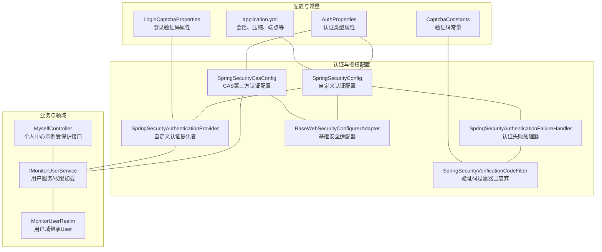
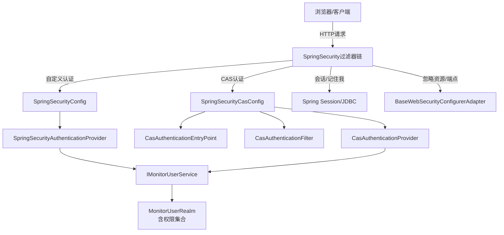
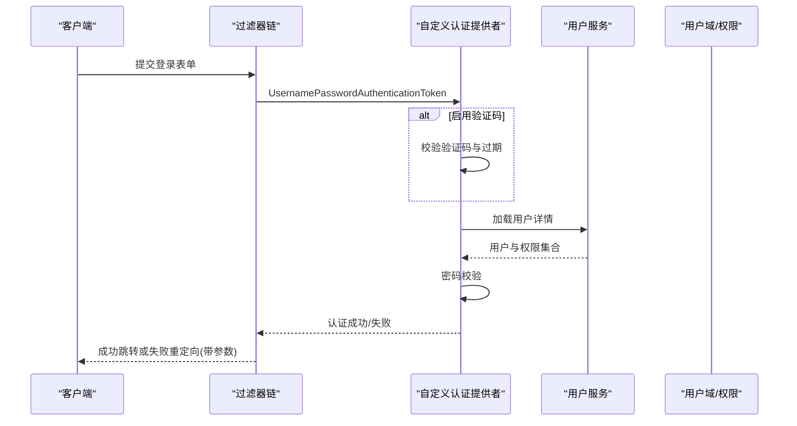
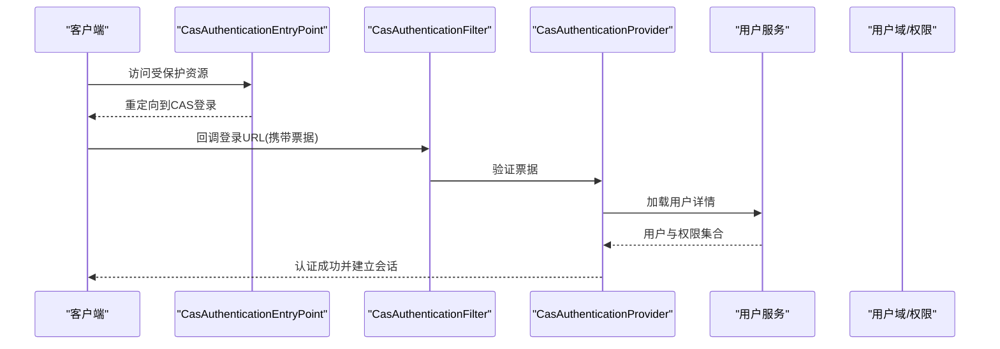
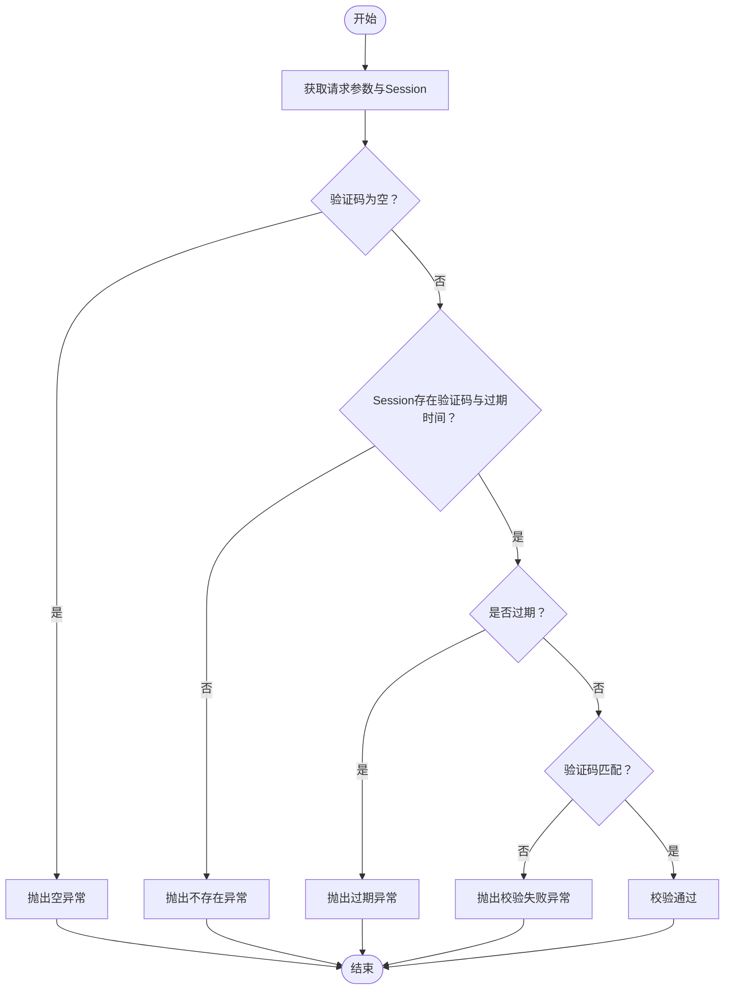
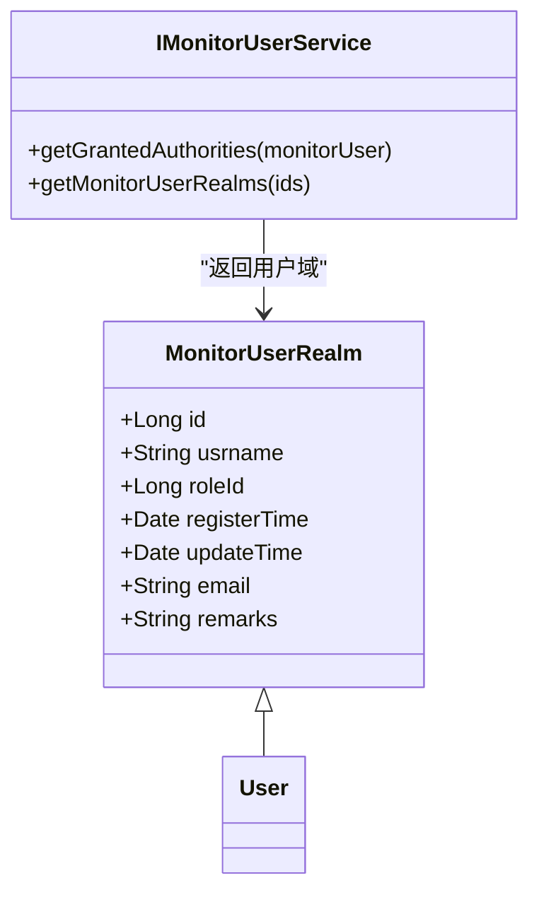
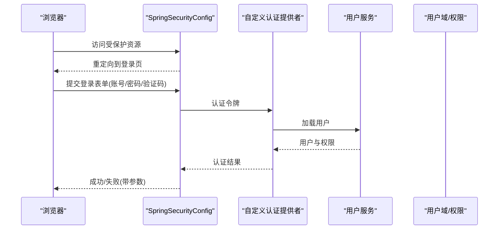
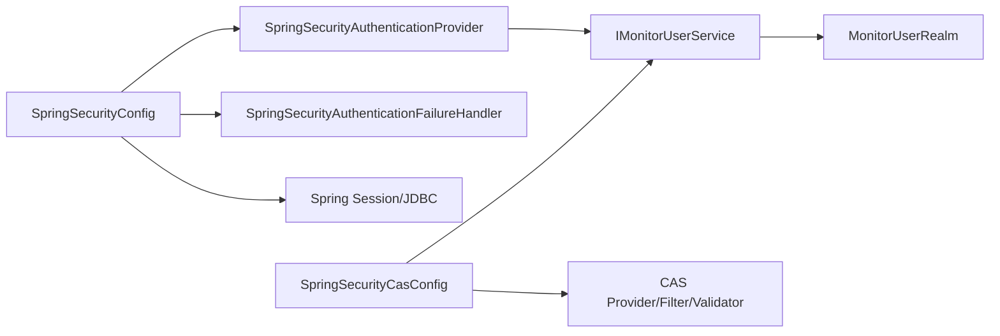

# 认证与授权

<cite>
**本文引用的文件**
- [SpringSecurityConfig.java](file://phoenix-ui/src/main/java/com/gitee/pifeng/monitoring/ui/config/springsecurity/SpringSecurityConfig.java)
- [SpringSecurityCasConfig.java](file://phoenix-ui/src/main/java/com/gitee/pifeng/monitoring/ui/config/springsecurity/SpringSecurityCasConfig.java)
- [SpringSecurityAuthenticationProvider.java](file://phoenix-ui/src/main/java/com/gitee/pifeng/monitoring/ui/config/springsecurity/SpringSecurityAuthenticationProvider.java)
- [SpringSecurityVerificationCodeFilter.java](file://phoenix-ui/src/main/java/com/gitee/pifeng/monitoring/ui/config/springsecurity/SpringSecurityVerificationCodeFilter.java)
- [SpringSecurityAuthenticationFailureHandler.java](file://phoenix-ui/src/main/java/com/gitee/pifeng/monitoring/ui/config/springsecurity/SpringSecurityAuthenticationFailureHandler.java)
- [BaseWebSecurityConfigurerAdapter.java](file://phoenix-ui/src/main/java/com/gitee/pifeng/monitoring/ui/config/springsecurity/BaseWebSecurityConfigurerAdapter.java)
- [AuthProperties.java](file://phoenix-ui/src/main/java/com/gitee/pifeng/monitoring/ui/property/auth/AuthProperties.java)
- [LoginCaptchaProperties.java](file://phoenix-ui/src/main/java/com/gitee/pifeng/monitoring/ui/property/auth/selfauth/LoginCaptchaProperties.java)
- [CaptchaConstants.java](file://phoenix-ui/src/main/java/com/gitee/pifeng/monitoring/ui/constant/CaptchaConstants.java)
- [IMonitorUserService.java](file://phoenix-ui/src/main/java/com/gitee/pifeng/monitoring/ui/business/web/service/IMonitorUserService.java)
- [MonitorUserRealm.java](file://phoenix-ui/src/main/java/com/gitee/pifeng/monitoring/ui/business/web/realm/MonitorUserRealm.java)
- [application.yml](file://phoenix-ui/src/main/resources/application.yml)
- [MyselfController.java](file://phoenix-ui/src/main/java/com/gitee/pifeng/monitoring/ui/business/web/controller/MyselfController.java)
- [VerificationCodeException.java](file://phoenix-ui/src/main/java/com/gitee/pifeng/monitoring/ui/exception/VerificationCodeException.java)
</cite>

## 目录
1. [简介](#简介)
2. [项目结构](#项目结构)
3. [核心组件](#核心组件)
4. [架构总览](#架构总览)
5. [详细组件分析](#详细组件分析)
6. [依赖分析](#依赖分析)
7. [性能考量](#性能考量)
8. [故障排查指南](#故障排查指南)
9. [结论](#结论)
10. [附录](#附录)

## 简介
本文件面向Phoenix监控系统的认证与授权模块，聚焦以下目标：
- 自定义认证（SelfAuth）与第三方认证（CAS）两种模式的配置与使用
- 登录验证码机制（图形验证码）的生成、校验与防暴力破解策略
- 基于Spring Security的过滤器链、认证提供者、方法级权限控制
- 权限控制模型（RBAC）与菜单/数据权限的实现思路
- 接口访问控制策略（白名单、会话管理、记住我）
- 认证失败处理与错误响应格式
- 完整认证流程示例（从登录到API访问）

## 项目结构
Phoenix UI采用Spring Boot + Spring Security构建，认证与授权相关代码集中在springsecurity包内，并通过配置属性驱动不同认证模式。

图表来源
- [SpringSecurityConfig.java:33-235](file://phoenix-ui/src/main/java/com/gitee/pifeng/monitoring/ui/config/springsecurity/SpringSecurityConfig.java#L33-L235)
- [SpringSecurityCasConfig.java:42-317](file://phoenix-ui/src/main/java/com/gitee/pifeng/monitoring/ui/config/springsecurity/SpringSecurityCasConfig.java#L42-L317)
- [SpringSecurityAuthenticationProvider.java:28-93](file://phoenix-ui/src/main/java/com/gitee/pifeng/monitoring/ui/config/springsecurity/SpringSecurityAuthenticationProvider.java#L28-L93)
- [SpringSecurityVerificationCodeFilter.java:26-99](file://phoenix-ui/src/main/java/com/gitee/pifeng/monitoring/ui/config/springsecurity/SpringSecurityVerificationCodeFilter.java#L26-L99)
- [SpringSecurityAuthenticationFailureHandler.java:23-66](file://phoenix-ui/src/main/java/com/gitee/pifeng/monitoring/ui/config/springsecurity/SpringSecurityAuthenticationFailureHandler.java#L23-L66)
- [BaseWebSecurityConfigurerAdapter.java:13-51](file://phoenix-ui/src/main/java/com/gitee/pifeng/monitoring/ui/config/springsecurity/BaseWebSecurityConfigurerAdapter.java#L13-L51)
- [IMonitorUserService.java:25-132](file://phoenix-ui/src/main/java/com/gitee/pifeng/monitoring/ui/business/web/service/IMonitorUserService.java#L25-L132)
- [MonitorUserRealm.java:18-90](file://phoenix-ui/src/main/java/com/gitee/pifeng/monitoring/ui/business/web/realm/MonitorUserRealm.java#L18-L90)
- [MyselfController.java:37-142](file://phoenix-ui/src/main/java/com/gitee/pifeng/monitoring/ui/business/web/controller/MyselfController.java#L37-L142)
- [AuthProperties.java:17-27](file://phoenix-ui/src/main/java/com/gitee/pifeng/monitoring/ui/property/auth/AuthProperties.java#L17-L27)
- [LoginCaptchaProperties.java:14-23](file://phoenix-ui/src/main/java/com/gitee/pifeng/monitoring/ui/property/auth/selfauth/LoginCaptchaProperties.java#L14-L23)
- [CaptchaConstants.java:11-23](file://phoenix-ui/src/main/java/com/gitee/pifeng/monitoring/ui/constant/CaptchaConstants.java#L11-L23)
- [application.yml:1-238](file://phoenix-ui/src/main/resources/application.yml#L1-L238)

章节来源
- [SpringSecurityConfig.java:33-235](file://phoenix-ui/src/main/java/com/gitee/pifeng/monitoring/ui/config/springsecurity/SpringSecurityConfig.java#L33-L235)
- [SpringSecurityCasConfig.java:42-317](file://phoenix-ui/src/main/java/com/gitee/pifeng/monitoring/ui/config/springsecurity/SpringSecurityCasConfig.java#L42-L317)
- [application.yml:1-238](file://phoenix-ui/src/main/resources/application.yml#L1-L238)

## 核心组件
- 自定义认证配置（SelfAuth）
  - 通过条件注解按配置选择启用，配置忽略静态资源与特定端点，表单登录、记住我、会话管理、退出登录等均在此配置中定义。
  - 参考路径：[SpringSecurityConfig.java:33-235](file://phoenix-ui/src/main/java/com/gitee/pifeng/monitoring/ui/config/springsecurity/SpringSecurityConfig.java#L33-L235)
- 第三方认证（CAS）
  - 通过条件注解启用，配置CAS入口、过滤器、提供者、单点注销等，适合企业统一认证场景。
  - 参考路径：[SpringSecurityCasConfig.java:42-317](file://phoenix-ui/src/main/java/com/gitee/pifeng/monitoring/ui/config/springsecurity/SpringSecurityCasConfig.java#L42-L317)
- 自定义认证提供者
  - 在认证前校验登录验证码（若启用），随后委托父类完成密码校验。
  - 参考路径：[SpringSecurityAuthenticationProvider.java:28-93](file://phoenix-ui/src/main/java/com/gitee/pifeng/monitoring/ui/config/springsecurity/SpringSecurityAuthenticationProvider.java#L28-L93)
- 验证码过滤器（已废弃）
  - 曾作为独立过滤器校验验证码，现由自定义认证提供者接管。
  - 参考路径：[SpringSecurityVerificationCodeFilter.java:26-99](file://phoenix-ui/src/main/java/com/gitee/pifeng/monitoring/ui/config/springsecurity/SpringSecurityVerificationCodeFilter.java#L26-L99)
- 认证失败处理器
  - 将验证码异常映射为登录页带参提示，便于前端友好提示。
  - 参考路径：[SpringSecurityAuthenticationFailureHandler.java:23-66](file://phoenix-ui/src/main/java/com/gitee/pifeng/monitoring/ui/config/springsecurity/SpringSecurityAuthenticationFailureHandler.java#L23-L66)
- 基础安全适配器
  - 统一定义忽略URL与静态资源，供两类配置复用。
  - 参考路径：[BaseWebSecurityConfigurerAdapter.java:13-51](file://phoenix-ui/src/main/java/com/gitee/pifeng/monitoring/ui/config/springsecurity/BaseWebSecurityConfigurerAdapter.java#L13-L51)
- 用户服务与权限加载
  - 实现UserDetailsService与CAS断言加载接口，负责加载用户权限集合。
  - 参考路径：[IMonitorUserService.java:25-132](file://phoenix-ui/src/main/java/com/gitee/pifeng/monitoring/ui/business/web/service/IMonitorUserService.java#L25-L132)
- 用户域（RBAC载体）
  - 扩展Spring Security的User，承载用户ID、角色ID、邮箱等信息，配合权限集合实现RBAC。
  - 参考路径：[MonitorUserRealm.java:18-90](file://phoenix-ui/src/main/java/com/gitee/pifeng/monitoring/ui/business/web/realm/MonitorUserRealm.java#L18-L90)
- 配置属性
  - 认证类型（自建/第三方）、登录验证码开关等。
  - 参考路径：
    - [AuthProperties.java:17-27](file://phoenix-ui/src/main/java/com/gitee/pifeng/monitoring/ui/property/auth/AuthProperties.java#L17-L27)
    - [LoginCaptchaProperties.java:14-23](file://phoenix-ui/src/main/java/com/gitee/pifeng/monitoring/ui/property/auth/selfauth/LoginCaptchaProperties.java#L14-L23)
- 常量与应用配置
  - 验证码参数名、会话超时、压缩、端点暴露等。
  - 参考路径：
    - [CaptchaConstants.java:11-23](file://phoenix-ui/src/main/java/com/gitee/pifeng/monitoring/ui/constant/CaptchaConstants.java#L11-L23)
    - [application.yml:1-238](file://phoenix-ui/src/main/resources/application.yml#L1-L238)

章节来源
- [SpringSecurityConfig.java:33-235](file://phoenix-ui/src/main/java/com/gitee/pifeng/monitoring/ui/config/springsecurity/SpringSecurityConfig.java#L33-L235)
- [SpringSecurityCasConfig.java:42-317](file://phoenix-ui/src/main/java/com/gitee/pifeng/monitoring/ui/config/springsecurity/SpringSecurityCasConfig.java#L42-L317)
- [SpringSecurityAuthenticationProvider.java:28-93](file://phoenix-ui/src/main/java/com/gitee/pifeng/monitoring/ui/config/springsecurity/SpringSecurityAuthenticationProvider.java#L28-L93)
- [SpringSecurityVerificationCodeFilter.java:26-99](file://phoenix-ui/src/main/java/com/gitee/pifeng/monitoring/ui/config/springsecurity/SpringSecurityVerificationCodeFilter.java#L26-L99)
- [SpringSecurityAuthenticationFailureHandler.java:23-66](file://phoenix-ui/src/main/java/com/gitee/pifeng/monitoring/ui/config/springsecurity/SpringSecurityAuthenticationFailureHandler.java#L23-L66)
- [BaseWebSecurityConfigurerAdapter.java:13-51](file://phoenix-ui/src/main/java/com/gitee/pifeng/monitoring/ui/config/springsecurity/BaseWebSecurityConfigurerAdapter.java#L13-L51)
- [IMonitorUserService.java:25-132](file://phoenix-ui/src/main/java/com/gitee/pifeng/monitoring/ui/business/web/service/IMonitorUserService.java#L25-L132)
- [MonitorUserRealm.java:18-90](file://phoenix-ui/src/main/java/com/gitee/pifeng/monitoring/ui/business/web/realm/MonitorUserRealm.java#L18-L90)
- [AuthProperties.java:17-27](file://phoenix-ui/src/main/java/com/gitee/pifeng/monitoring/ui/property/auth/AuthProperties.java#L17-L27)
- [LoginCaptchaProperties.java:14-23](file://phoenix-ui/src/main/java/com/gitee/pifeng/monitoring/ui/property/auth/selfauth/LoginCaptchaProperties.java#L14-L23)
- [CaptchaConstants.java:11-23](file://phoenix-ui/src/main/java/com/gitee/pifeng/monitoring/ui/constant/CaptchaConstants.java#L11-L23)
- [application.yml:1-238](file://phoenix-ui/src/main/resources/application.yml#L1-L238)

## 架构总览
下图展示了两种认证模式的总体交互：自定义认证与CAS认证分别通过不同的配置类装配过滤器链、认证提供者与用户服务。

图表来源
- [SpringSecurityConfig.java:33-235](file://phoenix-ui/src/main/java/com/gitee/pifeng/monitoring/ui/config/springsecurity/SpringSecurityConfig.java#L33-L235)
- [SpringSecurityCasConfig.java:42-317](file://phoenix-ui/src/main/java/com/gitee/pifeng/monitoring/ui/config/springsecurity/SpringSecurityCasConfig.java#L42-L317)
- [SpringSecurityAuthenticationProvider.java:28-93](file://phoenix-ui/src/main/java/com/gitee/pifeng/monitoring/ui/config/springsecurity/SpringSecurityAuthenticationProvider.java#L28-L93)
- [IMonitorUserService.java:25-132](file://phoenix-ui/src/main/java/com/gitee/pifeng/monitoring/ui/business/web/service/IMonitorUserService.java#L25-L132)
- [MonitorUserRealm.java:18-90](file://phoenix-ui/src/main/java/com/gitee/pifeng/monitoring/ui/business/web/realm/MonitorUserRealm.java#L18-L90)
- [BaseWebSecurityConfigurerAdapter.java:13-51](file://phoenix-ui/src/main/java/com/gitee/pifeng/monitoring/ui/config/springsecurity/BaseWebSecurityConfigurerAdapter.java#L13-L51)

## 详细组件分析

### 自定义认证（SelfAuth）配置与流程
- 配置要点
  - 忽略静态资源与健康端点
  - 表单登录参数、登录页、处理URL、成功/失败URL
  - 认证细节来源与失败处理器注入
  - 会话超时、并发会话控制、记住我（JDBC持久化）
  - 退出登录、禁用缓存与frameOptions
- 认证流程（简化）
  1) 客户端提交登录表单至处理URL
  2) 过滤器链进入自定义认证提供者
  3) 若启用验证码，校验验证码与过期时间
  4) 委托用户服务加载用户与权限
  5) 密码校验通过后建立会话与记住我
  6) 失败时交由失败处理器重定向并携带错误参数

图表来源
- [SpringSecurityConfig.java:111-166](file://phoenix-ui/src/main/java/com/gitee/pifeng/monitoring/ui/config/springsecurity/SpringSecurityConfig.java#L111-L166)
- [SpringSecurityAuthenticationProvider.java:63-91](file://phoenix-ui/src/main/java/com/gitee/pifeng/monitoring/ui/config/springsecurity/SpringSecurityAuthenticationProvider.java#L63-L91)
- [IMonitorUserService.java:25-132](file://phoenix-ui/src/main/java/com/gitee/pifeng/monitoring/ui/business/web/service/IMonitorUserService.java#L25-L132)
- [MonitorUserRealm.java:18-90](file://phoenix-ui/src/main/java/com/gitee/pifeng/monitoring/ui/business/web/realm/MonitorUserRealm.java#L18-L90)

章节来源
- [SpringSecurityConfig.java:80-166](file://phoenix-ui/src/main/java/com/gitee/pifeng/monitoring/ui/config/springsecurity/SpringSecurityConfig.java#L80-L166)
- [SpringSecurityAuthenticationProvider.java:63-91](file://phoenix-ui/src/main/java/com/gitee/pifeng/monitoring/ui/config/springsecurity/SpringSecurityAuthenticationProvider.java#L63-L91)

### 第三方认证（CAS）配置与流程
- 配置要点
  - CAS入口点、服务属性（客户端登录完整URL）
  - CAS认证过滤器、提供者、票据验证器（支持CAS/CAS3）
  - 单点注销过滤器与登出过滤器
  - 与自定义用户服务对接，加载用户与权限
- 流程概述
  1) 未认证访问受保护资源，重定向至CAS登录
  2) CAS登录成功后回调客户端登录URL
  3) 过滤器解析票据并调用提供者验证
  4) 加载用户与权限，建立会话
  5) 支持单点注销与登出

图表来源
- [SpringSecurityCasConfig.java:113-142](file://phoenix-ui/src/main/java/com/gitee/pifeng/monitoring/ui/config/springsecurity/SpringSecurityCasConfig.java#L113-L142)
- [SpringSecurityCasConfig.java:154-248](file://phoenix-ui/src/main/java/com/gitee/pifeng/monitoring/ui/config/springsecurity/SpringSecurityCasConfig.java#L154-L248)
- [IMonitorUserService.java:25-132](file://phoenix-ui/src/main/java/com/gitee/pifeng/monitoring/ui/business/web/service/IMonitorUserService.java#L25-L132)

章节来源
- [SpringSecurityCasConfig.java:81-142](file://phoenix-ui/src/main/java/com/gitee/pifeng/monitoring/ui/config/springsecurity/SpringSecurityCasConfig.java#L81-L142)

### 验证码认证机制（图形验证码）
- 生成与存储
  - 验证码与过期时间存入Session，参数名由常量定义
- 校验逻辑
  - 必填性、是否存在、是否过期、是否匹配
  - 失败抛出自定义异常，交由失败处理器映射为登录页参数
- 防暴力破解策略
  - 验证码一次性使用（校验后清理）
  - 过期时间控制
  - 登录失败重定向并提示，鼓励前端刷新验证码

图表来源
- [SpringSecurityAuthenticationProvider.java:63-91](file://phoenix-ui/src/main/java/com/gitee/pifeng/monitoring/ui/config/springsecurity/SpringSecurityAuthenticationProvider.java#L63-L91)
- [SpringSecurityVerificationCodeFilter.java:72-97](file://phoenix-ui/src/main/java/com/gitee/pifeng/monitoring/ui/config/springsecurity/SpringSecurityVerificationCodeFilter.java#L72-L97)
- [CaptchaConstants.java:11-23](file://phoenix-ui/src/main/java/com/gitee/pifeng/monitoring/ui/constant/CaptchaConstants.java#L11-L23)
- [VerificationCodeException.java:33-61](file://phoenix-ui/src/main/java/com/gitee/pifeng/monitoring/ui/exception/VerificationCodeException.java#L33-L61)

章节来源
- [SpringSecurityAuthenticationProvider.java:63-91](file://phoenix-ui/src/main/java/com/gitee/pifeng/monitoring/ui/config/springsecurity/SpringSecurityAuthenticationProvider.java#L63-L91)
- [SpringSecurityVerificationCodeFilter.java:72-97](file://phoenix-ui/src/main/java/com/gitee/pifeng/monitoring/ui/config/springsecurity/SpringSecurityVerificationCodeFilter.java#L72-L97)
- [VerificationCodeException.java:33-61](file://phoenix-ui/src/main/java/com/gitee/pifeng/monitoring/ui/exception/VerificationCodeException.java#L33-L61)

### RBAC权限模型与菜单/数据权限
- 权限载体
  - 用户域扩展自User，持有权限集合；用户服务负责加载权限
- 方法级与URL级控制
  - 启用prePostEnabled，结合注解可实现方法级权限
  - URL授权规则在配置类中集中定义
- 菜单与数据权限
  - 菜单权限：通过URL授权规则与用户域权限集合控制可见性
  - 数据权限：可在业务层根据用户域的角色ID与领域实体关联进行过滤

图表来源
- [MonitorUserRealm.java:18-90](file://phoenix-ui/src/main/java/com/gitee/pifeng/monitoring/ui/business/web/realm/MonitorUserRealm.java#L18-L90)
- [IMonitorUserService.java:25-132](file://phoenix-ui/src/main/java/com/gitee/pifeng/monitoring/ui/business/web/service/IMonitorUserService.java#L25-L132)

章节来源
- [MonitorUserRealm.java:18-90](file://phoenix-ui/src/main/java/com/gitee/pifeng/monitoring/ui/business/web/realm/MonitorUserRealm.java#L18-L90)
- [IMonitorUserService.java:25-132](file://phoenix-ui/src/main/java/com/gitee/pifeng/monitoring/ui/business/web/service/IMonitorUserService.java#L25-L132)

### 会话管理、记住我与并发控制
- 会话超时与并发控制
  - 应用配置中设置会话超时
  - JDBC会话存储与Spring Session集成
  - 并发会话上限与登录行为控制
- 记住我
  - 基于Spring Session的RememberMe服务，有效期配置

章节来源
- [application.yml:4-7](file://phoenix-ui/src/main/resources/application.yml#L4-L7)
- [SpringSecurityConfig.java:140-198](file://phoenix-ui/src/main/java/com/gitee/pifeng/monitoring/ui/config/springsecurity/SpringSecurityConfig.java#L140-L198)

### 接口访问控制策略
- 白名单与忽略资源
  - 静态资源、健康端点等在基础适配器中统一忽略
- 会话与安全头
  - 禁用缓存与frameOptions，避免常见安全风险
- 登录与退出
  - 表单登录、退出URL、Cookie清理、会话失效处理

章节来源
- [BaseWebSecurityConfigurerAdapter.java:16-49](file://phoenix-ui/src/main/java/com/gitee/pifeng/monitoring/ui/config/springsecurity/BaseWebSecurityConfigurerAdapter.java#L16-L49)
- [SpringSecurityConfig.java:111-166](file://phoenix-ui/src/main/java/com/gitee/pifeng/monitoring/ui/config/springsecurity/SpringSecurityConfig.java#L111-L166)

### 认证失败处理与错误响应
- 失败处理器
  - 将验证码异常映射为登录页带参URL，前端可据此提示
- 错误码与消息
  - 验证码异常定义了明确的错误码与消息

章节来源
- [SpringSecurityAuthenticationFailureHandler.java:38-64](file://phoenix-ui/src/main/java/com/gitee/pifeng/monitoring/ui/config/springsecurity/SpringSecurityAuthenticationFailureHandler.java#L38-L64)
- [VerificationCodeException.java:33-61](file://phoenix-ui/src/main/java/com/gitee/pifeng/monitoring/ui/exception/VerificationCodeException.java#L33-L61)

### 完整认证流程示例（自定义认证）
- 步骤
  1) 访问受保护页面，未登录被拦截
  2) 跳转登录页，输入账号/密码与验证码
  3) 提交至登录处理URL，过滤器链进入自定义认证提供者
  4) 校验验证码与密码，加载用户与权限
  5) 成功建立会话，跳转成功页；失败重定向并携带错误参数
  6) 访问受保护API，携带会话或令牌（如后续引入JWT）

图表来源
- [SpringSecurityConfig.java:111-166](file://phoenix-ui/src/main/java/com/gitee/pifeng/monitoring/ui/config/springsecurity/SpringSecurityConfig.java#L111-L166)
- [SpringSecurityAuthenticationProvider.java:63-91](file://phoenix-ui/src/main/java/com/gitee/pifeng/monitoring/ui/config/springsecurity/SpringSecurityAuthenticationProvider.java#L63-L91)
- [IMonitorUserService.java:25-132](file://phoenix-ui/src/main/java/com/gitee/pifeng/monitoring/ui/business/web/service/IMonitorUserService.java#L25-L132)

## 依赖分析
- 组件耦合
  - 自定义认证配置依赖认证提供者、失败处理器、会话注册表与JDBC会话存储
  - CAS配置依赖用户服务与CAS提供者、票据验证器、单点注销/登出过滤器
  - 用户服务与用户域共同构成RBAC权限模型
- 外部依赖
  - Spring Session JDBC、Spring Security、CAS客户端、Hutool验证码

图表来源
- [SpringSecurityConfig.java:33-235](file://phoenix-ui/src/main/java/com/gitee/pifeng/monitoring/ui/config/springsecurity/SpringSecurityConfig.java#L33-L235)
- [SpringSecurityCasConfig.java:42-317](file://phoenix-ui/src/main/java/com/gitee/pifeng/monitoring/ui/config/springsecurity/SpringSecurityCasConfig.java#L42-L317)
- [SpringSecurityAuthenticationProvider.java:28-93](file://phoenix-ui/src/main/java/com/gitee/pifeng/monitoring/ui/config/springsecurity/SpringSecurityAuthenticationProvider.java#L28-L93)
- [IMonitorUserService.java:25-132](file://phoenix-ui/src/main/java/com/gitee/pifeng/monitoring/ui/business/web/service/IMonitorUserService.java#L25-L132)
- [MonitorUserRealm.java:18-90](file://phoenix-ui/src/main/java/com/gitee/pifeng/monitoring/ui/business/web/realm/MonitorUserRealm.java#L18-L90)

## 性能考量
- 会话与压缩
  - 应用配置启用响应压缩与会话超时，有助于降低网络传输与内存占用
- 缓存与并发
  - JDBC会话存储与Spring Session集成，支持集群环境下的会话共享
- 验证码与IO
  - 验证码生成与校验为轻量IO，注意避免频繁刷新导致的抖动

章节来源
- [application.yml:9-13](file://phoenix-ui/src/main/resources/application.yml#L9-L13)
- [application.yml:51-56](file://phoenix-ui/src/main/resources/application.yml#L51-L56)

## 故障排查指南
- 登录失败
  - 检查验证码是否为空、是否存在、是否过期、是否匹配
  - 查看失败处理器重定向参数，定位具体原因
- 会话问题
  - 确认会话超时配置与并发会话上限
  - 检查JDBC会话表是否正确创建与访问
- CAS相关
  - 确认服务属性URL、票据验证器类型与CAS服务端配置一致
  - 检查单点注销与登出过滤器顺序

章节来源
- [SpringSecurityAuthenticationFailureHandler.java:38-64](file://phoenix-ui/src/main/java/com/gitee/pifeng/monitoring/ui/config/springsecurity/SpringSecurityAuthenticationFailureHandler.java#L38-L64)
- [SpringSecurityVerificationCodeFilter.java:72-97](file://phoenix-ui/src/main/java/com/gitee/pifeng/monitoring/ui/config/springsecurity/SpringSecurityVerificationCodeFilter.java#L72-L97)
- [SpringSecurityCasConfig.java:233-248](file://phoenix-ui/src/main/java/com/gitee/pifeng/monitoring/ui/config/springsecurity/SpringSecurityCasConfig.java#L233-L248)

## 结论
Phoenix UI的认证与授权体系以Spring Security为核心，通过条件化的配置类支持自定义认证与CAS两种模式；验证码机制与失败处理器提供了良好的用户体验与安全控制；RBAC模型通过用户域与用户服务实现菜单与数据权限的基础能力。结合会话管理、记住我与并发控制，整体满足企业级监控系统的安全需求。

## 附录
- 配置属性参考
  - 认证类型：phoenix.auth.type（默认自建）
  - 登录验证码：phoenix.auth.self-auth.login-captcha.enable（默认启用）
- 常用端点与资源
  - 登录页：/login
  - 登录处理：/doLogin
  - 验证码：/captcha.png
  - 退出：/logout
  - 忽略资源：静态资源与健康端点

章节来源
- [AuthProperties.java:17-27](file://phoenix-ui/src/main/java/com/gitee/pifeng/monitoring/ui/property/auth/AuthProperties.java#L17-L27)
- [LoginCaptchaProperties.java:14-23](file://phoenix-ui/src/main/java/com/gitee/pifeng/monitoring/ui/property/auth/selfauth/LoginCaptchaProperties.java#L14-L23)
- [BaseWebSecurityConfigurerAdapter.java:16-49](file://phoenix-ui/src/main/java/com/gitee/pifeng/monitoring/ui/config/springsecurity/BaseWebSecurityConfigurerAdapter.java#L16-L49)
- [SpringSecurityConfig.java:111-132](file://phoenix-ui/src/main/java/com/gitee/pifeng/monitoring/ui/config/springsecurity/SpringSecurityConfig.java#L111-L132)