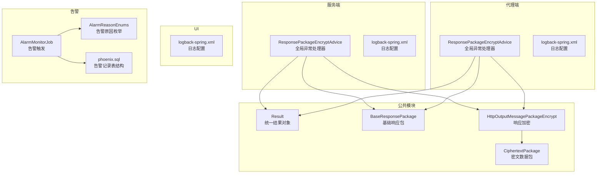
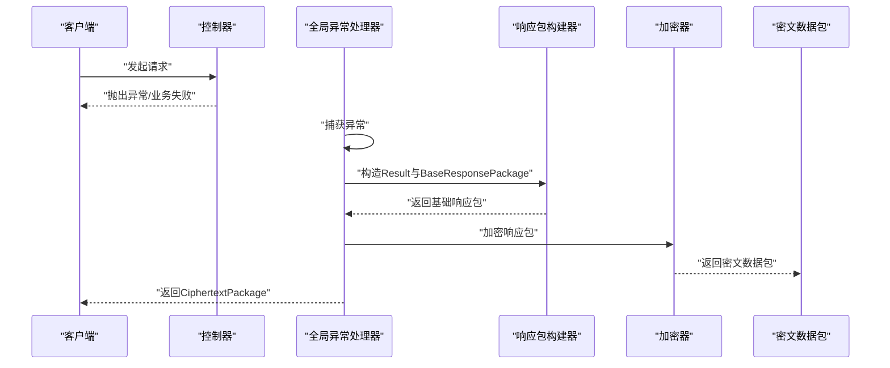
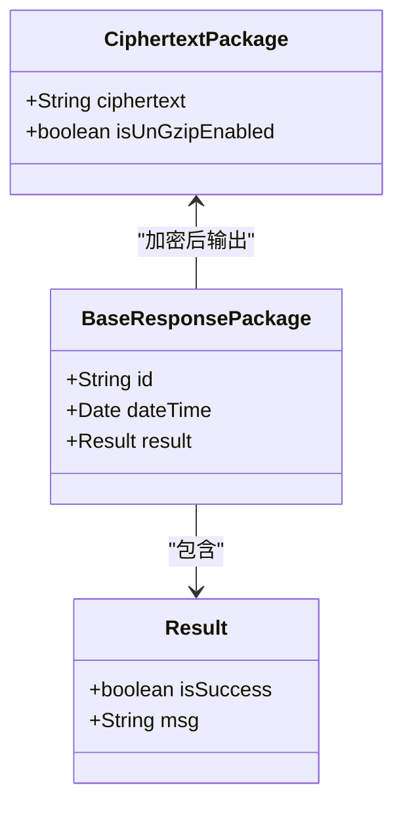
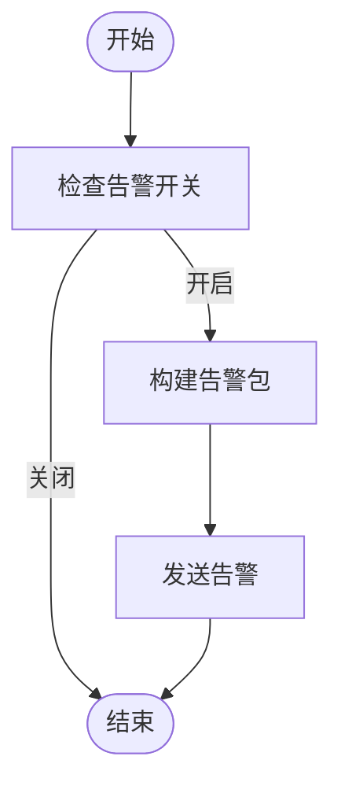
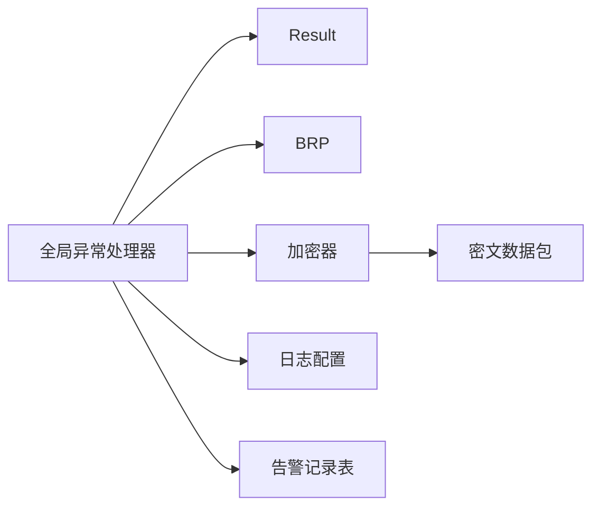

# 错误处理与响应

<cite>
**本文引用的文件**
- [Result.java](file://phoenix-common\phoenix-common-core\src\main\java\com\gitee\pifeng\monitoring\common\domain\Result.java)
- [BaseResponsePackage.java](file://phoenix-common\phoenix-common-core\src\main\java\com\gitee\pifeng\monitoring\common\dto\BaseResponsePackage.java)
- [CiphertextPackage.java](file://phoenix-common\phoenix-common-core\src\main\java\com\gitee\pifeng\monitoring\common\dto\CiphertextPackage.java)
- [HttpOutputMessagePackageEncrypt.java](file://phoenix-common\phoenix-common-web\src\main\java\com\gitee\pifeng\monitoring\common\web\core\http\HttpOutputMessagePackageEncrypt.java)
- [ResponsePackageEncryptAdvice（服务端）.java](file://phoenix-server\src\main\java\com\gitee\pifeng\monitoring\server\business\server\component\ResponsePackageEncryptAdvice.java)
- [ResponsePackageEncryptAdvice（代理端）.java](file://phoenix-agent\src\main\java\com\gitee\pifeng\monitoring\agent\component\ResponsePackageEncryptAdvice.java)
- [MonitoringUniversalException.java](file://phoenix-common\phoenix-common-core\src\main\java\com\gitee\pifeng\monitoring\common\exception\MonitoringUniversalException.java)
- [DbException.java](file://phoenix-common\phoenix-common-core\src\main\java\com\gitee\pifeng\monitoring\common\exception\DbException.java)
- [NetException.java](file://phoenix-common\phoenix-common-core\src\main\java\com\gitee\pifeng\monitoring\common\exception\NetException.java)
- [DecryptionException.java](file://phoenix-common\phoenix-common-core\src\main\java\com\gitee\pifeng\monitoring\common\exception\DecryptionException.java)
- [BadAnnotateParamException.java](file://phoenix-common\phoenix-common-core\src\main\java\com\gitee\pifeng\monitoring\common\exception\BadAnnotateParamException.java)
- [ExceptionUtils.java](file://phoenix-common\phoenix-common-core\src\main\java\com\gitee\pifeng\monitoring\common\util\ExceptionUtils.java)
- [logback-spring.xml（服务端）](file://phoenix-server\src\main\resources\logback-spring.xml)
- [logback-spring.xml（代理端）](file://phoenix-agent\src\main\resources\logback-spring.xml)
- [logback-spring.xml（UI）](file://phoenix-ui\src\main\resources\logback-spring.xml)
- [AlarmMonitorJob.java](file://phoenix-server\src\main\java\com\gitee\pifeng\monitoring\server\business\server\monitor\AlarmMonitorJob.java)
- [AlarmReasonEnums.java](file://phoenix-common\phoenix-common-core\src\main\java\com\gitee\pifeng\monitoring\common\constant\alarm\AlarmReasonEnums.java)
- [phoenix.sql](file://doc\数据库设计\sql\mysql\phoenix.sql)
- [MysqlDistributedLock.java](file://phoenix-server\src\main\java\com\gitee\pifeng\monitoring\server\business\server\core\MysqlDistributedLock.java)
</cite>

## 目录
1. [简介](#简介)
2. [项目结构](#项目结构)
3. [核心组件](#核心组件)
4. [架构总览](#架构总览)
5. [详细组件分析](#详细组件分析)
6. [依赖分析](#依赖分析)
7. [性能考虑](#性能考虑)
8. [故障排查指南](#故障排查指南)
9. [结论](#结论)
10. [附录](#附录)

## 简介
本规范面向Phoenix监控系统，聚焦“统一错误处理与响应”，目标如下：
- 统一响应格式：定义Result对象与基础响应包结构，明确成功与错误响应的统一模板。
- 错误码体系：给出编号规则建议、分类标准与国际化支持思路。
- 异常处理机制：全局异常处理器、异常类型策略、异常信息安全处理。
- HTTP状态码使用：2xx/4xx/5xx的合理场景与建议。
- 错误日志规范：日志级别、敏感信息脱敏、追踪ID生成。
- 客户端处理最佳实践：用户友好提示、重试与降级策略。
- 常见错误场景示例：网络异常、数据库连接失败、认证失败、权限不足等。
- 错误监控与告警：如何利用现有机制快速定位与处置。

## 项目结构
Phoenix由服务端、代理端、UI与公共模块组成。错误处理与响应涉及以下关键路径：
- 服务端与代理端通过@RestControllerAdvice统一捕获异常，封装为加密响应包。
- 公共模块提供Result、BaseResponsePackage、CiphertextPackage以及加密工具。
- 日志配置在各模块独立配置，统一输出到文件与控制台。
- 告警模块基于异常或业务指标触发，记录异常信息与告警记录。

图表来源
- [ResponsePackageEncryptAdvice（服务端）.java:30-63](file://phoenix-server\src\main\java\com\gitee\pifeng\monitoring\server\business\server\component\ResponsePackageEncryptAdvice.java#L30-L63)
- [ResponsePackageEncryptAdvice（代理端）.java:30-63](file://phoenix-agent\src\main\java\com\gitee\pifeng\monitoring\agent\component\ResponsePackageEncryptAdvice.java#L30-L63)
- [Result.java:15-34](file://phoenix-common\phoenix-common-core\src\main\java\com\gitee\pifeng\monitoring\common\domain\Result.java#L15-L34)
- [BaseResponsePackage.java:18-41](file://phoenix-common\phoenix-common-core\src\main\java\com\gitee\pifeng\monitoring\common\dto\BaseResponsePackage.java#L18-L41)
- [CiphertextPackage.java:15-33](file://phoenix-common\phoenix-common-core\src\main\java\com\gitee\pifeng\monitoring\common\dto\CiphertextPackage.java#L15-L33)
- [HttpOutputMessagePackageEncrypt.java:16-40](file://phoenix-common\phoenix-common-web\src\main\java\com\gitee\pifeng\monitoring\common\web\core\http\HttpOutputMessagePackageEncrypt.java#L16-L40)
- [logback-spring.xml（服务端）:114-119](file://phoenix-server\src\main\resources\logback-spring.xml#L114-L119)
- [logback-spring.xml（代理端）:114-119](file://phoenix-agent\src\main\resources\logback-spring.xml#L114-L119)
- [logback-spring.xml（UI）:114-119](file://phoenix-ui\src\main\resources\logback-spring.xml#L114-L119)
- [AlarmMonitorJob.java:101-127](file://phoenix-server\src\main\java\com\gitee\pifeng\monitoring\server\business\server\monitor\AlarmMonitorJob.java#L101-L127)
- [AlarmReasonEnums.java:11-33](file://phoenix-common\phoenix-common-core\src\main\java\com\gitee\pifeng\monitoring\common\constant\alarm\AlarmReasonEnums.java#L11-L33)
- [phoenix.sql:76-89](file://doc\数据库设计\sql\mysql\phoenix.sql#L76-L89)

章节来源
- [ResponsePackageEncryptAdvice（服务端）.java:30-63](file://phoenix-server\src\main\java\com\gitee\pifeng\monitoring\server\business\server\component\ResponsePackageEncryptAdvice.java#L30-L63)
- [ResponsePackageEncryptAdvice（代理端）.java:30-63](file://phoenix-agent\src\main\java\com\gitee\pifeng\monitoring\agent\component\ResponsePackageEncryptAdvice.java#L30-L63)
- [Result.java:15-34](file://phoenix-common\phoenix-common-core\src\main\java\com\gitee\pifeng\monitoring\common\domain\Result.java#L15-L34)
- [BaseResponsePackage.java:18-41](file://phoenix-common\phoenix-common-core\src\main\java\com\gitee\pifeng\monitoring\common\dto\BaseResponsePackage.java#L18-L41)
- [CiphertextPackage.java:15-33](file://phoenix-common\phoenix-common-core\src\main\java\com\gitee\pifeng\monitoring\common\dto\CiphertextPackage.java#L15-L33)
- [HttpOutputMessagePackageEncrypt.java:16-40](file://phoenix-common\phoenix-common-web\src\main\java\com\gitee\pifeng\monitoring\common\web\core\http\HttpOutputMessagePackageEncrypt.java#L16-L40)
- [logback-spring.xml（服务端）:114-119](file://phoenix-server\src\main\resources\logback-spring.xml#L114-L119)
- [logback-spring.xml（代理端）:114-119](file://phoenix-agent\src\main\resources\logback-spring.xml#L114-L119)
- [logback-spring.xml（UI）:114-119](file://phoenix-ui\src\main\resources\logback-spring.xml#L114-L119)
- [AlarmMonitorJob.java:101-127](file://phoenix-server\src\main\java\com\gitee\pifeng\monitoring\server\business\server\monitor\AlarmMonitorJob.java#L101-L127)
- [AlarmReasonEnums.java:11-33](file://phoenix-common\phoenix-common-core\src\main\java\com\gitee\pifeng\monitoring\common\constant\alarm\AlarmReasonEnums.java#L11-L33)
- [phoenix.sql:76-89](file://doc\数据库设计\sql\mysql\phoenix.sql#L76-L89)

## 核心组件
- Result：统一的结果载体，包含是否成功与消息字段，作为所有响应的基础承载对象。
- BaseResponsePackage：在Result之上增加ID、时间戳与链路信息等上下文，形成标准响应包。
- CiphertextPackage：最终对外传输的密文包，包含密文内容与是否需要解压标志。
- HttpOutputMessagePackageEncrypt：负责将明文响应包序列化为JSON后加密，输出密文包。
- ResponsePackageEncryptAdvice：全局异常处理器，统一捕获异常，构造错误Result并加密返回。

章节来源
- [Result.java:15-34](file://phoenix-common\phoenix-common-core\src\main\java\com\gitee\pifeng\monitoring\common\domain\Result.java#L15-L34)
- [BaseResponsePackage.java:18-41](file://phoenix-common\phoenix-common-core\src\main\java\com\gitee\pifeng\monitoring\common\dto\BaseResponsePackage.java#L18-L41)
- [CiphertextPackage.java:15-33](file://phoenix-common\phoenix-common-core\src\main\java\com\gitee\pifeng\monitoring\common\dto\CiphertextPackage.java#L15-L33)
- [HttpOutputMessagePackageEncrypt.java:16-40](file://phoenix-common\phoenix-common-web\src\main\java\com\gitee\pifeng\monitoring\common\web\core\http\HttpOutputMessagePackageEncrypt.java#L16-L40)
- [ResponsePackageEncryptAdvice（服务端）.java:30-63](file://phoenix-server\src\main\java\com\gitee\pifeng\monitoring\server\business\server\component\ResponsePackageEncryptAdvice.java#L30-L63)
- [ResponsePackageEncryptAdvice（代理端）.java:30-63](file://phoenix-agent\src\main\java\com\gitee\pifeng\monitoring\agent\component\ResponsePackageEncryptAdvice.java#L30-L63)

## 架构总览
统一错误处理与响应流程如下：
- 控制器抛出异常或业务失败时，全局异常处理器捕获。
- 构造Result（isSuccess=false），填充错误消息。
- 将Result封装进BaseResponsePackage，附加上下文信息。
- 使用加密工具对响应包进行序列化与加密，输出CiphertextPackage。
- 客户端收到密文后解密，解析为明文JSON，读取Result结构。

图表来源
- [ResponsePackageEncryptAdvice（服务端）.java:52-61](file://phoenix-server\src\main\java\com\gitee\pifeng\monitoring\server\business\server\component\ResponsePackageEncryptAdvice.java#L52-L61)
- [ResponsePackageEncryptAdvice（代理端）.java:55-63](file://phoenix-agent\src\main\java\com\gitee\pifeng\monitoring\agent\component\ResponsePackageEncryptAdvice.java#L55-L63)
- [HttpOutputMessagePackageEncrypt.java:29-38](file://phoenix-common\phoenix-common-web\src\main\java\com\gitee\pifeng\monitoring\common\web\core\http\HttpOutputMessagePackageEncrypt.java#L29-L38)
- [BaseResponsePackage.java:18-41](file://phoenix-common\phoenix-common-core\src\main\java\com\gitee\pifeng\monitoring\common\dto\BaseResponsePackage.java#L18-L41)
- [CiphertextPackage.java:15-33](file://phoenix-common\phoenix-common-core\src\main\java\com\gitee\pifeng\monitoring\common\dto\CiphertextPackage.java#L15-L33)

## 详细组件分析

### 统一响应格式设计
- Result对象
  - 字段：isSuccess（布尔）、msg（字符串）。
  - 作用：承载成功/失败状态与消息，作为所有响应的最小单元。
- BaseResponsePackage
  - 字段：id（唯一标识）、dateTime（时间戳）、result（Result对象）。
  - 作用：在Result基础上附加上下文信息，便于追踪与审计。
- CiphertextPackage
  - 字段：ciphertext（密文数据）、isUnGzipEnabled（是否需要解压）。
  - 作用：对外传输的最终载体，确保数据安全。

图表来源
- [Result.java:15-34](file://phoenix-common\phoenix-common-core\src\main\java\com\gitee\pifeng\monitoring\common\domain\Result.java#L15-L34)
- [BaseResponsePackage.java:18-41](file://phoenix-common\phoenix-common-core\src\main\java\com\gitee\pifeng\monitoring\common\dto\BaseResponsePackage.java#L18-L41)
- [CiphertextPackage.java:15-33](file://phoenix-common\phoenix-common-core\src\main\java\com\gitee\pifeng\monitoring\common\dto\CiphertextPackage.java#L15-L33)

章节来源
- [Result.java:15-34](file://phoenix-common\phoenix-common-core\src\main\java\com\gitee\pifeng\monitoring\common\domain\Result.java#L15-L34)
- [BaseResponsePackage.java:18-41](file://phoenix-common\phoenix-common-core\src\main\java\com\gitee\pifeng\monitoring\common\dto\BaseResponsePackage.java#L18-L41)
- [CiphertextPackage.java:15-33](file://phoenix-common\phoenix-common-core\src\main\java\com\gitee\pifeng\monitoring\common\dto\CiphertextPackage.java#L15-L33)

### 成功响应的标准格式
- 成功时，Result.isSuccess=true，msg为成功信息。
- BaseResponsePackage携带唯一ID与时间戳，便于请求追踪。
- 响应体为明文JSON，客户端可直接解析。

章节来源
- [Result.java:24-32](file://phoenix-common\phoenix-common-core\src\main\java\com\gitee\pifeng\monitoring\common\domain\Result.java#L24-L32)
- [BaseResponsePackage.java:26-39](file://phoenix-common\phoenix-common-core\src\main\java\com\gitee\pifeng\monitoring\common\dto\BaseResponsePackage.java#L26-L39)

### 错误响应的统一模板
- 失败时，Result.isSuccess=false，msg为异常信息或错误描述。
- 全局异常处理器统一捕获异常，构造错误Result并加密返回。
- 客户端收到CiphertextPackage后解密，解析出Result结构。

章节来源
- [ResponsePackageEncryptAdvice（服务端）.java:52-61](file://phoenix-server\src\main\java\com\gitee\pifeng\monitoring\server\business\server\component\ResponsePackageEncryptAdvice.java#L52-L61)
- [ResponsePackageEncryptAdvice（代理端）.java:55-63](file://phoenix-agent\src\main\java\com\gitee\pifeng\monitoring\agent\component\ResponsePackageEncryptAdvice.java#L55-L63)
- [CiphertextPackage.java:15-33](file://phoenix-common\phoenix-common-core\src\main\java\com\gitee\pifeng\monitoring\common\dto\CiphertextPackage.java#L15-L33)

### 错误码体系设计原则
- 编号规则建议
  - 采用分层编号：前两位代表模块（如01=认证、02=授权、03=数据库、04=网络），第三四位代表功能域（如01=登录、02=登出），最后两位为具体错误码。
  - 示例：010101 表示认证模块登录功能域下的具体错误。
- 分类标准
  - 按来源分类：认证类、授权类、网络类、数据库类、业务类、系统类。
  - 按严重程度分类：提示（1xx）、一般错误（4xx）、严重错误（5xx）。
- 国际化支持
  - 错误码与消息分离，消息通过多语言资源文件加载。
  - Result.msg用于存储本地化后的消息文本。

（本节为设计建议，不直接对应具体源码）

### 异常处理机制
- 全局异常处理器
  - 服务端与代理端均配置@RestControllerAdvice，统一捕获Throwable。
  - 记录客户端IP、URI与异常信息，构造错误Result并加密返回。
- 不同异常类型的处理策略
  - 通用异常：MonitoringUniversalException及其子类，统一按错误响应返回。
  - 数据库异常：DbException，建议映射为500服务器错误。
  - 网络异常：NetException，建议映射为502/504网关错误。
  - 解密异常：DecryptionException，建议映射为400客户端错误。
  - 注解参数错误：BadAnnotateParamException，建议映射为400客户端错误。
- 异常信息的安全处理
  - 日志中仅记录必要信息，避免泄露堆栈细节。
  - 对外响应使用统一错误消息，不暴露内部异常细节。

章节来源
- [ResponsePackageEncryptAdvice（服务端）.java:52-61](file://phoenix-server\src\main\java\com\gitee\pifeng\monitoring\server\business\server\component\ResponsePackageEncryptAdvice.java#L52-L61)
- [ResponsePackageEncryptAdvice（代理端）.java:55-63](file://phoenix-agent\src\main\java\com\gitee\pifeng\monitoring\agent\component\ResponsePackageEncryptAdvice.java#L55-L63)
- [MonitoringUniversalException.java:11-30](file://phoenix-common\phoenix-common-core\src\main\java\com\gitee\pifeng\monitoring\common\exception\MonitoringUniversalException.java#L11-L30)
- [DbException.java:11-26](file://phoenix-common\phoenix-common-core\src\main\java\com\gitee\pifeng\monitoring\common\exception\DbException.java#L11-L26)
- [NetException.java:11-22](file://phoenix-common\phoenix-common-core\src\main\java\com\gitee\pifeng\monitoring\common\exception\NetException.java#L11-L22)
- [DecryptionException.java:13-28](file://phoenix-common\phoenix-common-core\src\main\java\com\gitee\pifeng\monitoring\common\exception\DecryptionException.java#L13-L28)
- [BadAnnotateParamException.java:11-26](file://phoenix-common\phoenix-common-core\src\main\java\com\gitee\pifeng\monitoring\common\exception\BadAnnotateParamException.java#L11-L26)

### HTTP状态码使用规范
- 2xx 成功
  - 200 OK：请求成功，返回Result.isSuccess=true。
- 4xx 客户端错误
  - 400 Bad Request：参数错误、解密失败、注解参数错误。
  - 401 Unauthorized：未认证或认证失败。
  - 403 Forbidden：权限不足。
  - 404 Not Found：资源不存在。
- 5xx 服务器错误
  - 500 Internal Server Error：通用服务器错误。
  - 502 Bad Gateway：上游服务不可达或响应异常。
  - 503 Service Unavailable：服务不可用。
  - 504 Gateway Timeout：网关超时。

（本节为使用建议，不直接对应具体源码）

### 错误日志记录规范
- 日志级别
  - INFO：常规运行日志。
  - WARN：潜在问题但不影响功能。
  - ERROR：发生错误，需关注与处理。
- 敏感信息脱敏
  - 日志中避免输出密码、密钥、完整令牌等敏感字段。
  - 对异常堆栈进行脱敏处理，仅保留必要信息。
- 追踪ID生成
  - BaseResponsePackage.id作为请求追踪ID，建议与链路追踪系统集成。
- 日志配置
  - 各模块独立配置logback-spring.xml，统一输出到控制台与滚动文件。

章节来源
- [logback-spring.xml（服务端）:114-119](file://phoenix-server\src\main\resources\logback-spring.xml#L114-L119)
- [logback-spring.xml（代理端）:114-119](file://phoenix-agent\src\main\resources\logback-spring.xml#L114-L119)
- [logback-spring.xml（UI）:114-119](file://phoenix-ui\src\main\resources\logback-spring.xml#L114-L119)
- [BaseResponsePackage.java:26-39](file://phoenix-common\phoenix-common-core\src\main\java\com\gitee\pifeng\monitoring\common\dto\BaseResponsePackage.java#L26-L39)

### 客户端错误处理最佳实践
- 用户友好展示
  - 使用Result.msg向用户展示本地化后的错误信息。
  - 对于技术性错误，提供“错误ID”引导用户反馈。
- 错误重试机制
  - 对瞬时网络异常（如502/504）进行指数退避重试。
  - 对4xx客户端错误不建议自动重试，需提示用户修正。
- 降级处理策略
  - 服务不可用时返回缓存数据或默认值，保证基本可用。
  - 记录降级原因与影响范围，便于后续恢复。

（本节为实践建议，不直接对应具体源码）

### 常见错误场景处理示例
- 网络异常
  - 触发NetException，全局异常处理器返回400/502响应。
  - 建议客户端进行指数退避重试与降级处理。
- 数据库连接失败
  - 触发DbException，映射为500服务器错误。
  - 建议客户端提示稍后重试，并记录错误ID。
- 认证失败
  - 触发401未认证，客户端跳转登录页或刷新令牌。
- 权限不足
  - 触发403禁止访问，客户端提示无权操作并引导联系管理员。

章节来源
- [NetException.java:11-22](file://phoenix-common\phoenix-common-core\src\main\java\com\gitee\pifeng\monitoring\common\exception\NetException.java#L11-L22)
- [DbException.java:11-26](file://phoenix-common\phoenix-common-core\src\main\java\com\gitee\pifeng\monitoring\common\exception\DbException.java#L11-L26)
- [ResponsePackageEncryptAdvice（服务端）.java:52-61](file://phoenix-server\src\main\java\com\gitee\pifeng\monitoring\server\business\server\component\ResponsePackageEncryptAdvice.java#L52-L61)
- [ResponsePackageEncryptAdvice（代理端）.java:55-63](file://phoenix-agent\src\main\java\com\gitee\pifeng\monitoring\agent\component\ResponsePackageEncryptAdvice.java#L55-L63)

### 错误监控与告警机制
- 告警触发
  - AlarmMonitorJob根据配置决定是否发送告警，记录告警原因与监控类型。
- 告警原因枚举
  - 包含正常变异常、异常变正常、发现、忽略等场景。
- 告警记录表
  - phoenix.sql定义了告警记录与告警发送明细表结构，包含异常信息字段。

图表来源
- [AlarmMonitorJob.java:103-124](file://phoenix-server\src\main\java\com\gitee\pifeng\monitoring\server\business\server\monitor\AlarmMonitorJob.java#L103-L124)
- [AlarmReasonEnums.java:11-33](file://phoenix-common\phoenix-common-core\src\main\java\com\gitee\pifeng\monitoring\common\constant\alarm\AlarmReasonEnums.java#L11-L33)
- [phoenix.sql:76-89](file://doc\数据库设计\sql\mysql\phoenix.sql#L76-L89)

章节来源
- [AlarmMonitorJob.java:101-127](file://phoenix-server\src\main\java\com\gitee\pifeng\monitoring\server\business\server\monitor\AlarmMonitorJob.java#L101-L127)
- [AlarmReasonEnums.java:11-33](file://phoenix-common\phoenix-common-core\src\main\java\com\gitee\pifeng\monitoring\common\constant\alarm\AlarmReasonEnums.java#L11-L33)
- [phoenix.sql:76-89](file://doc\数据库设计\sql\mysql\phoenix.sql#L76-L89)

## 依赖分析
- 组件耦合
  - 全局异常处理器依赖Result、BaseResponsePackage与加密器。
  - 加密器依赖CiphertextPackage与消息工具。
- 外部依赖
  - 日志框架Logback，按模块独立配置。
  - 数据库表结构支撑告警记录与明细。

图表来源
- [ResponsePackageEncryptAdvice（服务端）.java:30-63](file://phoenix-server\src\main\java\com\gitee\pifeng\monitoring\server\business\server\component\ResponsePackageEncryptAdvice.java#L30-L63)
- [ResponsePackageEncryptAdvice（代理端）.java:30-63](file://phoenix-agent\src\main\java\com\gitee\pifeng\monitoring\agent\component\ResponsePackageEncryptAdvice.java#L30-L63)
- [HttpOutputMessagePackageEncrypt.java:16-40](file://phoenix-common\phoenix-common-web\src\main\java\com\gitee\pifeng\monitoring\common\web\core\http\HttpOutputMessagePackageEncrypt.java#L16-L40)
- [BaseResponsePackage.java:18-41](file://phoenix-common\phoenix-common-core\src\main\java\com\gitee\pifeng\monitoring\common\dto\BaseResponsePackage.java#L18-L41)
- [CiphertextPackage.java:15-33](file://phoenix-common\phoenix-common-core\src\main\java\com\gitee\pifeng\monitoring\common\dto\CiphertextPackage.java#L15-L33)
- [logback-spring.xml（服务端）:114-119](file://phoenix-server\src\main\resources\logback-spring.xml#L114-L119)
- [phoenix.sql:76-89](file://doc\数据库设计\sql\mysql\phoenix.sql#L76-L89)

章节来源
- [ResponsePackageEncryptAdvice（服务端）.java:30-63](file://phoenix-server\src\main\java\com\gitee\pifeng\monitoring\server\business\server\component\ResponsePackageEncryptAdvice.java#L30-L63)
- [ResponsePackageEncryptAdvice（代理端）.java:30-63](file://phoenix-agent\src\main\java\com\gitee\pifeng\monitoring\agent\component\ResponsePackageEncryptAdvice.java#L30-L63)
- [HttpOutputMessagePackageEncrypt.java:16-40](file://phoenix-common\phoenix-common-web\src\main\java\com\gitee\pifeng\monitoring\common\web\core\http\HttpOutputMessagePackageEncrypt.java#L16-L40)
- [BaseResponsePackage.java:18-41](file://phoenix-common\phoenix-common-core\src\main\java\com\gitee\pifeng\monitoring\common\dto\BaseResponsePackage.java#L18-L41)
- [CiphertextPackage.java:15-33](file://phoenix-common\phoenix-common-core\src\main\java\com\gitee\pifeng\monitoring\common\dto\CiphertextPackage.java#L15-L33)
- [logback-spring.xml（服务端）:114-119](file://phoenix-server\src\main\resources\logback-spring.xml#L114-L119)
- [logback-spring.xml（代理端）:114-119](file://phoenix-agent\src\main\resources\logback-spring.xml#L114-L119)
- [logback-spring.xml（UI）:114-119](file://phoenix-ui\src\main\resources\logback-spring.xml#L114-L119)
- [phoenix.sql:76-89](file://doc\数据库设计\sql\mysql\phoenix.sql#L76-L89)

## 性能考虑
- 指数退避重试
  - 在分布式锁与网络重试场景中采用指数退避+抖动，避免雪崩效应。
- 日志滚动与级别过滤
  - 按级别分离日志文件，减少IO压力，提升查询效率。
- 响应加密成本
  - 在保证安全的前提下，尽量减少不必要的序列化与加密步骤。

章节来源
- [MysqlDistributedLock.java:94-125](file://phoenix-server\src\main\java\com\gitee\pifeng\monitoring\server\business\server\core\MysqlDistributedLock.java#L94-L125)
- [logback-spring.xml（服务端）:24-109](file://phoenix-server\src\main\resources\logback-spring.xml#L24-L109)
- [logback-spring.xml（代理端）:24-109](file://phoenix-agent\src\main\resources\logback-spring.xml#L24-L109)
- [logback-spring.xml（UI）:24-109](file://phoenix-ui\src\main\resources\logback-spring.xml#L24-L109)

## 故障排查指南
- 如何定位异常
  - 查看BaseResponsePackage.id与日志中的请求上下文，结合异常信息定位问题。
  - 对于解密异常，确认密文与解密流程是否正确。
- 常见问题
  - 400错误：检查请求参数与解密逻辑。
  - 500错误：查看服务端日志与堆栈信息。
  - 502/504错误：检查上游服务连通性与超时配置。
- 告警联动
  - 通过AlarmMonitorJob与phoenix.sql中的告警记录表，核对告警原因与处理状态。

章节来源
- [DecryptionException.java:13-28](file://phoenix-common\phoenix-common-core\src\main\java\com\gitee\pifeng\monitoring\common\exception\DecryptionException.java#L13-L28)
- [AlarmMonitorJob.java:101-127](file://phoenix-server\src\main\java\com\gitee\pifeng\monitoring\server\business\server\monitor\AlarmMonitorJob.java#L101-L127)
- [phoenix.sql:76-89](file://doc\数据库设计\sql\mysql\phoenix.sql#L76-L89)

## 结论
Phoenix监控系统的错误处理与响应已形成统一闭环：Result承载结果、BaseResponsePackage附加上下文、CiphertextPackage保障安全传输，全局异常处理器统一捕获并加密返回。配合完善的日志与告警机制，能够有效支撑问题定位与快速恢复。建议在实际落地中补充错误码体系与国际化消息管理，进一步提升用户体验与运维效率。

## 附录
- 关键流程图与类图已在前述章节中给出，读者可据此对照源码理解实现细节。
- 若需扩展错误码与国际化，可在Result.msg之外引入错误码字段，并通过资源文件管理多语言消息。