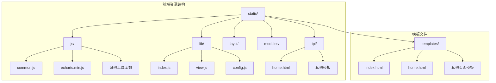
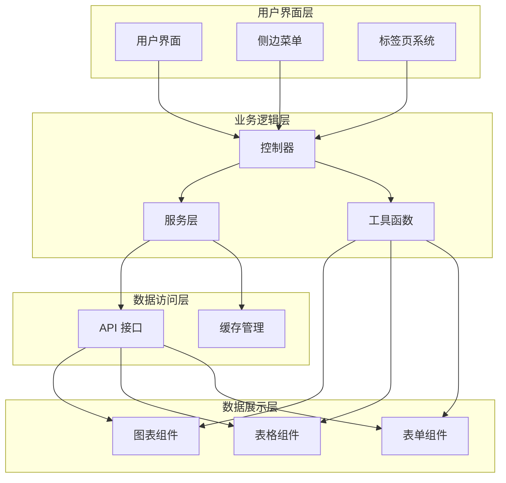
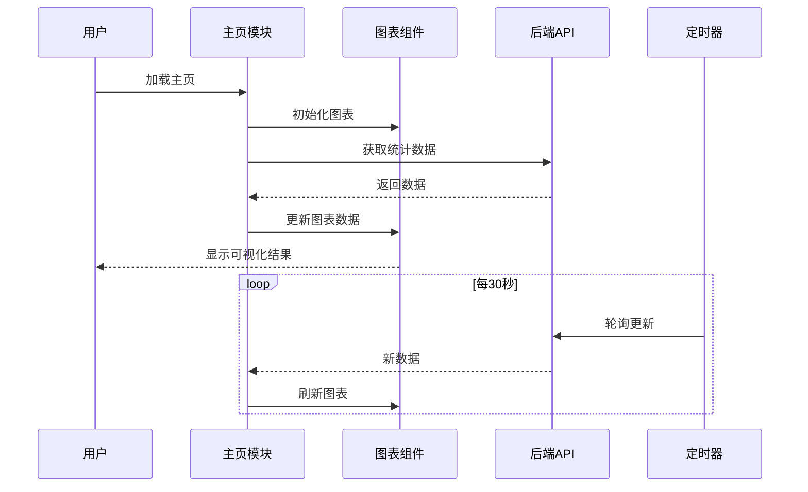
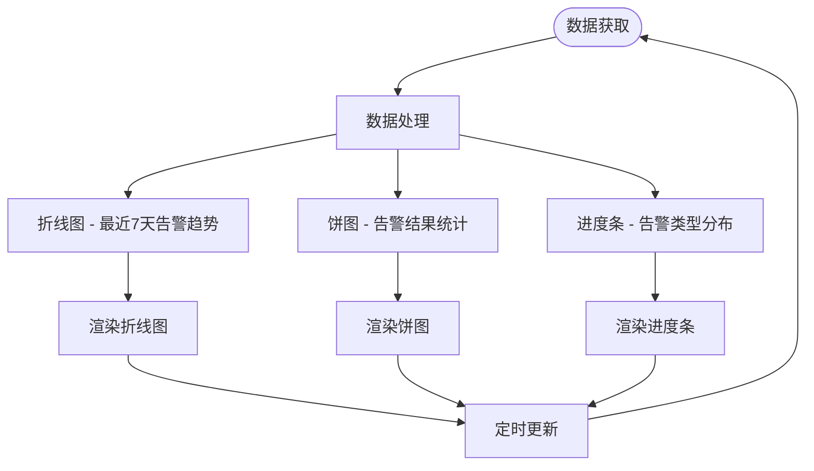
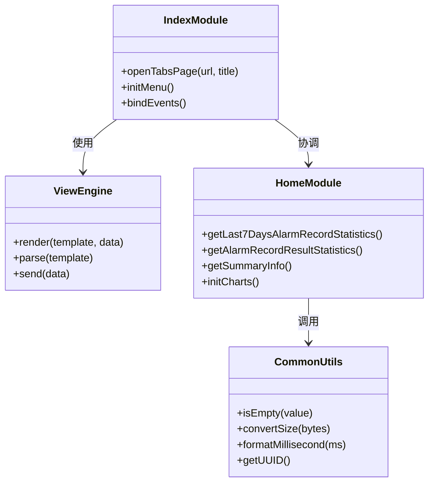
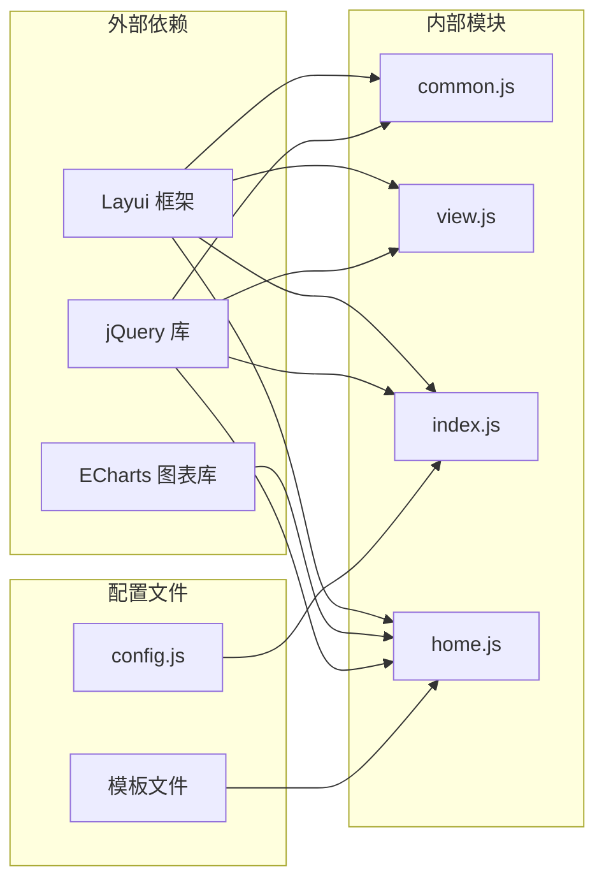

# Javascript 前端

<cite>
**本文档引用的文件**
- [common.js](file://phoenix-ui/src/main/resources/static/js/common.js)
- [index.js](file://phoenix-ui/src/main/resources/static/lib/index.js)
- [view.js](file://phoenix-ui/src/main/resources/static/lib/view.js)
- [config.js](file://phoenix-ui/src/main/resources/static/config.js)
- [home.js](file://phoenix-ui/src/main/resources/static/modules/home.js)
- [index.html](file://phoenix-ui/src/main/resources/templates/index.html)
- [home.html](file://phoenix-ui/src/main/resources/templates/home.html)
- [echarts.min.js](file://phoenix-ui/src/main/resources/static/js/echarts.min.js)
</cite>

## 目录
1. [简介](#简介)
2. [项目结构](#项目结构)
3. [核心组件](#核心组件)
4. [架构概览](#架构概览)
5. [详细组件分析](#详细组件分析)
6. [依赖关系分析](#依赖关系分析)
7. [性能考虑](#性能考虑)
8. [故障排除指南](#故障排除指南)
9. [结论](#结论)

## 简介

Phoenix 监控系统前端采用现代化的 JavaScript 技术栈构建，基于 Layui Admin 框架开发，提供完整的监控平台用户界面。该前端系统主要负责数据可视化展示、用户交互控制以及与后端 API 的通信。

系统特点包括：
- 响应式布局设计
- 实时数据更新机制
- 多种图表可视化组件
- 用户权限管理系统
- 动态模板渲染

## 项目结构

Phoenix 前端项目采用模块化组织方式，主要分为以下几个核心目录：

**图表来源**
- [index.html:1-318](file://phoenix-ui/src/main/resources/templates/index.html#L1-L318)
- [home.html:1-360](file://phoenix-ui/src/main/resources/templates/home.html#L1-L360)

**章节来源**
- [index.html:1-318](file://phoenix-ui/src/main/resources/templates/index.html#L1-L318)
- [home.html:1-360](file://phoenix-ui/src/main/resources/templates/home.html#L1-L360)

## 核心组件

### 1. 工具函数库 (common.js)

提供通用的 JavaScript 工具函数，涵盖数据处理、格式化、验证等常用功能：

**主要功能模块：**
- **常量定义**：统一的状态码和消息常量
- **表格合并**：多行数据的单元格合并功能
- **数据验证**：字符串、对象、数组的验证工具
- **数学计算**：UUID生成、内存转换、时间格式化
- **数组操作**：去重、筛选、映射等高级操作

**章节来源**
- [common.js:1-333](file://phoenix-ui/src/main/resources/static/js/common.js#L1-L333)

### 2. 模板渲染引擎 (view.js)

基于 Layui 框架的模板渲染系统，负责动态页面内容的加载和渲染：

**核心特性：**
- **异步加载**：支持 AJAX 请求和模板文件加载
- **数据绑定**：模板与数据的双向绑定机制
- **错误处理**：完善的异常捕获和错误提示
- **缓存管理**：智能的模板缓存策略

**章节来源**
- [view.js:1-142](file://phoenix-ui/src/main/resources/static/lib/view.js#L1-L142)

### 3. 主入口模块 (index.js)

应用的主控制器，负责页面初始化、路由管理和组件协调：

**主要职责：**
- **页面初始化**：加载基础配置和依赖模块
- **路由管理**：处理页面间的导航和切换
- **标签页控制**：管理多页面标签的打开和关闭
- **事件绑定**：注册全局事件处理器

**章节来源**
- [index.js:1-21](file://phoenix-ui/src/main/resources/static/lib/index.js#L1-L21)

### 4. 配置管理 (config.js)

全局配置中心，定义应用的基础设置和行为规范：

**配置类别：**
- **基础设置**：容器、路径、视图引擎等
- **调试配置**：开发模式和错误输出控制
- **响应规范**：API 响应格式和状态码定义
- **主题配置**：界面主题和颜色方案

**章节来源**
- [config.js:1-132](file://phoenix-ui/src/main/resources/static/config.js#L1-L132)

## 架构概览

Phoenix 前端采用 MVC 架构模式，结合模块化设计理念：

**图表来源**
- [index.js:1-21](file://phoenix-ui/src/main/resources/static/lib/index.js#L1-L21)
- [view.js:1-142](file://phoenix-ui/src/main/resources/static/lib/view.js#L1-L142)
- [home.js:1-567](file://phoenix-ui/src/main/resources/static/modules/home.js#L1-L567)

## 详细组件分析

### 主页模块 (home.js)

主页模块是整个监控平台的核心展示组件，负责实时数据的可视化呈现：

**图表来源**
- [home.js:40-564](file://phoenix-ui/src/main/resources/static/modules/home.js#L40-L564)

**核心功能特性：**
- **实时数据更新**：每30秒自动刷新监控数据
- **多维度统计**：服务器、应用程序、数据库等多指标展示
- **可视化图表**：ECharts 图表库集成，支持多种图表类型
- **响应式设计**：适配不同屏幕尺寸的设备

**章节来源**
- [home.js:1-567](file://phoenix-ui/src/main/resources/static/modules/home.js#L1-L567)

### 数据可视化组件

系统集成了丰富的数据可视化功能：

**图表来源**
- [home.js:40-325](file://phoenix-ui/src/main/resources/static/modules/home.js#L40-L325)

**图表类型包括：**
- **折线图**：展示告警趋势变化
- **饼图**：显示告警结果占比
- **进度条**：表示各类告警的分布情况

**章节来源**
- [home.js:28-325](file://phoenix-ui/src/main/resources/static/modules/home.js#L28-L325)

### 用户界面组件

前端采用 Layui 框架构建用户界面：

**图表来源**
- [index.js:1-21](file://phoenix-ui/src/main/resources/static/lib/index.js#L1-L21)
- [view.js:1-142](file://phoenix-ui/src/main/resources/static/lib/view.js#L1-L142)
- [common.js:1-333](file://phoenix-ui/src/main/resources/static/js/common.js#L1-L333)

**章节来源**
- [index.js:1-21](file://phoenix-ui/src/main/resources/static/lib/index.js#L1-L21)
- [view.js:1-142](file://phoenix-ui/src/main/resources/static/lib/view.js#L1-L142)
- [common.js:1-333](file://phoenix-ui/src/main/resources/static/js/common.js#L1-L333)

## 依赖关系分析

前端系统的主要依赖关系如下：

**图表来源**
- [config.js:42-47](file://phoenix-ui/src/main/resources/static/config.js#L42-L47)
- [echarts.min.js:1-23](file://phoenix-ui/src/main/resources/static/js/echarts.min.js#L1-L23)

**依赖特点：**
- **轻量级框架**：基于 Layui 的轻量级设计
- **模块化开发**：清晰的模块边界和职责分离
- **插件化扩展**：支持第三方库的灵活集成
- **版本管理**：明确的依赖版本控制

**章节来源**
- [config.js:42-47](file://phoenix-ui/src/main/resources/static/config.js#L42-L47)
- [echarts.min.js:1-23](file://phoenix-ui/src/main/resources/static/js/echarts.min.js#L1-L23)

## 性能考虑

### 1. 数据加载优化

- **延迟加载**：非关键资源采用延迟加载策略
- **缓存机制**：合理利用浏览器缓存减少重复请求
- **分页处理**：大数据量采用分页或虚拟滚动技术

### 2. 图表渲染优化

- **增量更新**：只更新发生变化的数据点
- **动画控制**：根据数据量调整动画效果
- **分辨率适配**：动态调整图表分辨率适应设备

### 3. 内存管理

- **对象池**：复用频繁创建的对象
- **事件解绑**：及时清理不再使用的事件监听器
- **垃圾回收**：定期清理大对象引用

## 故障排除指南

### 常见问题及解决方案

**1. 图表不显示问题**
- 检查 ECharts 库是否正确加载
- 验证容器元素的尺寸设置
- 确认数据格式符合要求

**2. 数据更新异常**
- 检查网络连接状态
- 验证 API 接口的可用性
- 查看浏览器控制台的错误信息

**3. 页面布局错乱**
- 确认响应式断点设置
- 检查 CSS 样式冲突
- 验证浏览器兼容性

**章节来源**
- [view.js:13-48](file://phoenix-ui/src/main/resources/static/lib/view.js#L13-L48)
- [home.js:192-195](file://phoenix-ui/src/main/resources/static/modules/home.js#L192-L195)

## 结论

Phoenix 监控系统的前端架构展现了现代 Web 应用开发的最佳实践：

**技术优势：**
- **模块化设计**：清晰的职责分离和依赖管理
- **数据驱动**：基于实时数据的动态可视化展示
- **用户体验**：流畅的交互体验和响应式设计
- **可维护性**：良好的代码结构和文档规范

**未来改进方向：**
- **性能优化**：进一步提升大数据量下的渲染性能
- **功能扩展**：增加更多类型的图表和可视化组件
- **移动端适配**：增强移动设备的用户体验
- **国际化支持**：扩展多语言界面支持

该前端系统为 Phoenix 监控平台提供了稳定、高效、易用的用户界面，有效支撑了整个监控系统的业务需求。