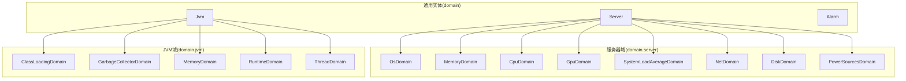
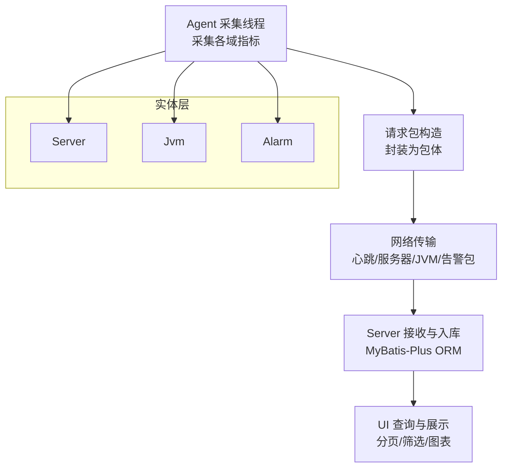
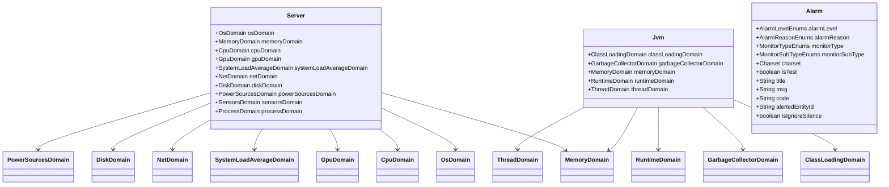

# 公共实体定义

<cite>
**本文引用的文件**
- [Server.java](file://phoenix-common/phoenix-common-core/src/main/java/com/gitee/pifeng/monitoring/common/domain/Server.java)
- [Jvm.java](file://phoenix-common/phoenix-common-core/src/main/java/com/gitee/pifeng/monitoring/common/domain/Jvm.java)
- [Alarm.java](file://phoenix-common/phoenix-common-core/src/main/java/com/gitee/pifeng/monitoring/common/domain/Alarm.java)
- [CpuDomain.java](file://phoenix-common/phoenix-common-core/src/main/java/com/gitee/pifeng/monitoring/common/domain/server/CpuDomain.java)
- [MemoryDomain.java](file://phoenix-common/phoenix-common-core/src/main/java/com/gitee/pifeng/monitoring/common/domain/server/MemoryDomain.java)
- [NetDomain.java](file://phoenix-common/phoenix-common-core/src/main/java/com/gitee/pifeng/monitoring/common/domain/server/NetDomain.java)
- [OsDomain.java](file://phoenix-common/phoenix-common-core/src/main/java/com/gitee/pifeng/monitoring/common/domain/server/OsDomain.java)
- [DiskDomain.java](file://phoenix-common/phoenix-common-core/src/main/java/com/gitee/pifeng/monitoring/common/domain/server/DiskDomain.java)
- [GpuDomain.java](file://phoenix-common/phoenix-common-core/src/main/java/com/gitee/pifeng/monitoring/common/domain/server/GpuDomain.java)
- [SystemLoadAverageDomain.java](file://phoenix-common/phoenix-common-core/src/main/java/com/gitee/pifeng/monitoring/common/domain/server/SystemLoadAverageDomain.java)
- [PowerSourcesDomain.java](file://phoenix-common/phoenix-common-core/src/main/java/com/gitee/pifeng/monitoring/common/domain/server/PowerSourcesDomain.java)
- [ClassLoadingDomain.java](file://phoenix-common/phoenix-common-core/src/main/java/com/gitee/pifeng/monitoring/common/domain/jvm/ClassLoadingDomain.java)
- [GarbageCollectorDomain.java](file://phoenix-common/phoenix-common-core/src/main/java/com/gitee/pifeng/monitoring/common/domain/jvm/GarbageCollectorDomain.java)
- [MemoryDomain.java](file://phoenix-common/phoenix-common-core/src/main/java/com/gitee/pifeng/monitoring/common/domain/jvm/MemoryDomain.java)
- [RuntimeDomain.java](file://phoenix-common/phoenix-common-core/src/main/java/com/gitee/pifeng/monitoring/common/domain/jvm/RuntimeDomain.java)
- [ThreadDomain.java](file://phoenix-common/phoenix-common-core/src/main/java/com/gitee/pifeng/monitoring/common/domain/jvm/ThreadDomain.java)
</cite>

## 目录
1. [引言](#引言)
2. [项目结构](#项目结构)
3. [核心组件](#核心组件)
4. [架构总览](#架构总览)
5. [详细组件分析](#详细组件分析)
6. [依赖分析](#依赖分析)
7. [性能考虑](#性能考虑)
8. [故障排查指南](#故障排查指南)
9. [结论](#结论)
10. [附录](#附录)

## 引言
本文件聚焦于Phoenix监控系统中的“公共实体定义”，系统性梳理并解释以下核心数据模型：
- 服务器监控实体：Server、CpuDomain、MemoryDomain、NetDomain、OsDomain、DiskDomain、GpuDomain、SystemLoadAverageDomain、PowerSourcesDomain 等
- JVM监控实体：Jvm 及其子域（ClassLoadingDomain、GarbageCollectorDomain、MemoryDomain、RuntimeDomain、ThreadDomain）
- 告警实体：Alarm

文档从设计理念、字段定义、数据类型、约束条件、业务规则出发，结合实体间关系映射，给出序列化与反序列化最佳实践及与数据库ORM框架的集成建议。

## 项目结构
公共实体位于通用模块的domain与domain.server、domain.jvm包下，采用分层组织：
- domain：顶层聚合实体（Server、Jvm、Alarm）
- domain.server：服务器侧硬件与系统信息域
- domain.jvm：JVM侧运行与性能信息域

图表来源
- [Server.java:23-75](file://phoenix-common/phoenix-common-core/src/main/java/com/gitee/pifeng/monitoring/common/domain/Server.java#L23-L75)
- [Jvm.java:23-50](file://phoenix-common/phoenix-common-core/src/main/java/com/gitee/pifeng/monitoring/common/domain/Jvm.java#L23-L50)
- [Alarm.java:28-116](file://phoenix-common/phoenix-common-core/src/main/java/com/gitee/pifeng/monitoring/common/domain/Alarm.java#L28-L116)

章节来源
- [Server.java:1-76](file://phoenix-common/phoenix-common-core/src/main/java/com/gitee/pifeng/monitoring/common/domain/Server.java#L1-L76)
- [Jvm.java:1-51](file://phoenix-common/phoenix-common-core/src/main/java/com/gitee/pifeng/monitoring/common/domain/Jvm.java#L1-L51)
- [Alarm.java:1-117](file://phoenix-common/phoenix-common-core/src/main/java/com/gitee/pifeng/monitoring/common/domain/Alarm.java#L1-L117)

## 核心组件
本节概述三大类实体的设计目标与职责边界：
- Server：服务器全量监控聚合，承载操作系统、CPU、内存、GPU、系统负载、网络、磁盘、电源、传感器、进程等子域
- Jvm：JVM全量监控聚合，承载类加载、GC、内存、运行时、线程等子域
- Alarm：告警聚合，承载告警级别、原因、监控类型、字符集、测试标记、标题、内容、编码、被告警主体ID、是否无视静默等

章节来源
- [Server.java:23-75](file://phoenix-common/phoenix-common-core/src/main/java/com/gitee/pifeng/monitoring/common/domain/Server.java#L23-L75)
- [Jvm.java:23-50](file://phoenix-common/phoenix-common-core/src/main/java/com/gitee/pifeng/monitoring/common/domain/Jvm.java#L23-L50)
- [Alarm.java:28-116](file://phoenix-common/phoenix-common-core/src/main/java/com/gitee/pifeng/monitoring/common/domain/Alarm.java#L28-L116)

## 架构总览
公共实体作为跨模块共享的数据契约，贯穿Agent采集、Server存储与UI展示链路。下图展示实体在系统中的角色与流向：

图表来源
- [Server.java:23-75](file://phoenix-common/phoenix-common-core/src/main/java/com/gitee/pifeng/monitoring/common/domain/Server.java#L23-L75)
- [Jvm.java:23-50](file://phoenix-common/phoenix-common-core/src/main/java/com/gitee/pifeng/monitoring/common/domain/Jvm.java#L23-L50)
- [Alarm.java:28-116](file://phoenix-common/phoenix-common-core/src/main/java/com/gitee/pifeng/monitoring/common/domain/Alarm.java#L28-L116)

## 详细组件分析

### 服务器监控实体（Server 及子域）

#### Server 聚合实体
- 职责：聚合所有服务器侧监控子域，作为对外统一的数据载体
- 关键点：通过组合多个子域表达完整的主机画像

章节来源
- [Server.java:23-75](file://phoenix-common/phoenix-common-core/src/main/java/com/gitee/pifeng/monitoring/common/domain/Server.java#L23-L75)

#### 操作系统域（OsDomain）
- 字段与类型：计算机名、系统名、架构、版本、用户名、用户主目录、时区等字符串型字段
- 业务规则：用于标识主机环境与上下文，便于告警定位与报表统计

章节来源
- [OsDomain.java:21-55](file://phoenix-common/phoenix-common-core/src/main/java/com/gitee/pifeng/monitoring/common/domain/server/OsDomain.java#L21-L55)

#### CPU域（CpuDomain）
- 结构：包含CPU数量与CPU信息列表
- CPU信息子域（CpuInfoDomain）：频率、厂商、型号、用户/系统/等待/错误/空闲/综合使用率等
- 业务规则：综合使用率用于判断CPU负载；配合系统负载平均值进行容量评估

章节来源
- [CpuDomain.java:23-88](file://phoenix-common/phoenix-common-core/src/main/java/com/gitee/pifeng/monitoring/common/domain/server/CpuDomain.java#L23-L88)

#### 内存域（MemoryDomain）
- 结构：物理内存（MenDomain）与交换区（SwapDomain）
- MenDomain：总/已用/空闲（byte）、使用率
- SwapDomain：总/已用/空闲（byte）、使用率
- 业务规则：内存使用率阈值触发告警；swap使用率异常指示内存压力

章节来源
- [MemoryDomain.java:22-94](file://phoenix-common/phoenix-common-core/src/main/java/com/gitee/pifeng/monitoring/common/domain/server/MemoryDomain.java#L22-L94)

#### 网络域（NetDomain）
- 结构：网卡数量与网卡信息列表
- 网卡信息子域（NetInterfaceDomain）：名称、类型、地址、掩码、广播、MAC、描述；接收/发送字节、包数、错误与丢弃；下载/上传速度
- 业务规则：带宽利用率与丢包率用于网络健康评估

章节来源
- [NetDomain.java:23-121](file://phoenix-common/phoenix-common-core/src/main/java/com/gitee/pifeng/monitoring/common/domain/server/NetDomain.java#L23-L121)

#### 磁盘域（DiskDomain）
- 结构：磁盘数量与磁盘信息列表
- 磁盘信息子域（DiskInfoDomain）：分区盘符、路径、文件系统类型、总/已用/剩余/可用（byte）、使用率
- 业务规则：使用率与可用空间阈值触发告警；IO瓶颈可通过读写队列与延迟推断

章节来源
- [DiskDomain.java:23-89](file://phoenix-common/phoenix-common-core/src/main/java/com/gitee/pifeng/monitoring/common/domain/server/DiskDomain.java#L23-L89)

#### GPU域（GpuDomain）
- 结构：GPU数量与GPU信息列表
- GPU信息子域（GpuInfoDomain）：显卡名称、设备ID、厂商、版本信息、显存总量（byte）
- 业务规则：显存使用率与温度阈值用于图形/AI场景健康监控

章节来源
- [GpuDomain.java:23-68](file://phoenix-common/phoenix-common-core/src/main/java/com/gitee/pifeng/monitoring/common/domain/server/GpuDomain.java#L23-L68)

#### 系统负载平均域（SystemLoadAverageDomain）
- 字段：逻辑CPU核数、1/5/15分钟负载平均值
- 业务规则：结合CPU核数与负载均值评估系统过载风险

章节来源
- [SystemLoadAverageDomain.java:22-44](file://phoenix-common/phoenix-common-core/src/main/java/com/gitee/pifeng/monitoring/common/domain/server/SystemLoadAverageDomain.java#L22-L44)

#### 电源域（PowerSourcesDomain）
- 结构：电源数量与电源信息列表
- 电源信息子域（PowerSourceDomain）：名称、设备名、剩余容量百分比、剩余时间估算/瞬时、功率/电压/电流、是否外接电源/充电/放电、容量与循环计数、化学成分、生产日期/厂商/序列号、温度
- 业务规则：剩余时间与充电状态用于预测续航；异常温度/功率触发告警

章节来源
- [PowerSourcesDomain.java:24-147](file://phoenix-common/phoenix-common-core/src/main/java/com/gitee/pifeng/monitoring/common/domain/server/PowerSourcesDomain.java#L24-L147)

### JVM监控实体（Jvm 及子域）

#### Jvm 聚合实体
- 职责：聚合JVM运行与性能相关子域，形成统一JVM画像
- 关键点：与服务器域并列，共同构成主机监控视图

章节来源
- [Jvm.java:23-50](file://phoenix-common/phoenix-common-core/src/main/java/com/gitee/pifeng/monitoring/common/domain/Jvm.java#L23-L50)

#### 类加载域（ClassLoadingDomain）
- 字段：总加载类数、当前加载类数、总卸载类数、是否启用详细输出
- 业务规则：异常的类卸载或加载停滞可能指示类泄漏或类隔离问题

章节来源
- [ClassLoadingDomain.java:22-43](file://phoenix-common/phoenix-common-core/src/main/java/com/gitee/pifeng/monitoring/common/domain/jvm/ClassLoadingDomain.java#L22-L43)

#### 垃圾回收域（GarbageCollectorDomain）
- 结构：GC信息列表
- GC信息子域（GarbageCollectorInfoDomain）：内存管理器名称、GC总次数、GC总耗时（ms）
- 业务规则：GC频率与耗时异常反映内存压力与回收策略问题

章节来源
- [GarbageCollectorDomain.java:24-66](file://phoenix-common/phoenix-common-core/src/main/java/com/gitee/pifeng/monitoring/common/domain/jvm/GarbageCollectorDomain.java#L24-L66)

#### JVM内存域（MemoryDomain）
- 结构：内存类型到内存用量的映射
- 内存用量子域（MemoryUsageDomain）：初始/已用/提交/最大（byte，最大可能未定义）
- 业务规则：不同代的内存使用趋势与晋升失败次数共同决定GC调优方向

章节来源
- [MemoryDomain.java:24-62](file://phoenix-common/phoenix-common-core/src/main/java/com/gitee/pifeng/monitoring/common/domain/jvm/MemoryDomain.java#L24-L62)

#### 运行时域（RuntimeDomain）
- 字段：进程名、JVM实现/供应商/版本、规范信息、管理规范版本、类路径/库路径、引导类路径支持与路径、输入参数、运行时（ms）、启动时间
- 业务规则：版本与参数一致性校验、启动时间用于存活检测

章节来源
- [RuntimeDomain.java:25-102](file://phoenix-common/phoenix-common-core/src/main/java/com/gitee/pifeng/monitoring/common/domain/jvm/RuntimeDomain.java#L25-L102)

#### 线程域（ThreadDomain）
- 字段：当前活动线程数、峰值、总启动线程数、守护线程数、线程信息列表
- 业务规则：线程池饱和与死锁可通过峰值与长时间活跃线程数识别

章节来源
- [ThreadDomain.java:24-51](file://phoenix-common/phoenix-common-core/src/main/java/com/gitee/pifeng/monitoring/common/domain/jvm/ThreadDomain.java#L24-L51)

### 告警实体（Alarm）

#### Alarm 设计要点
- 告警级别：默认警告级别，可按监控类型覆盖
- 告警原因：默认忽略，用于区分触发来源
- 监控类型/子类型：默认自定义，支持细分
- 字符集：非UTF-8时需指定
- 测试标记：测试告警不发送消息
- 标题/内容：支持通过编码从数据库覆盖
- 编码：自定义业务告警的唯一标识，用于查表覆盖级别/标题/内容
- 被告警主体ID：关联被监控对象
- 无视静默：在静默时段仍需通知

章节来源
- [Alarm.java:28-116](file://phoenix-common/phoenix-common-core/src/main/java/com/gitee/pifeng/monitoring/common/domain/Alarm.java#L28-L116)

## 依赖分析
- 组合关系：Server 组合多个 server.* 域；Jvm 组合多个 jvm.* 域；Alarm 为独立聚合
- 复杂度与耦合：实体均为纯数据载体，无循环依赖；通过组合降低耦合
- 外部依赖：实体继承抽象基类，便于统一扩展与序列化

图表来源
- [Server.java:23-75](file://phoenix-common/phoenix-common-core/src/main/java/com/gitee/pifeng/monitoring/common/domain/Server.java#L23-L75)
- [Jvm.java:23-50](file://phoenix-common/phoenix-common-core/src/main/java/com/gitee/pifeng/monitoring/common/domain/Jvm.java#L23-L50)
- [Alarm.java:28-116](file://phoenix-common/phoenix-common-core/src/main/java/com/gitee/pifeng/monitoring/common/domain/Alarm.java#L28-L116)

## 性能考虑
- 序列化/反序列化
  - 使用轻量级JSON库（如Jackson或Gson）进行包体序列化，避免冗余字段
  - 对大字段（如线程信息列表）按需裁剪，仅保留必要快照
- 数据压缩
  - 对高频上报数据进行压缩传输，降低带宽占用
- 批量入库
  - Server/Jvm/Alarm等实体按批次写入，减少事务开销
- 索引与查询
  - 建议对告警编码、被告警主体ID、监控类型/子类型、时间戳建立索引，提升查询效率

## 故障排查指南
- 告警级别覆盖异常
  - 若设置自定义业务告警且配置了编码，数据库中对应级别/标题/内容会覆盖直接设置的值。请检查编码是否存在且配置正确
- 测试告警不发消息
  - isTest=true时服务端不会发送告警消息，属于预期行为
- 非UTF-8字符集
  - 若消息内容包含非UTF-8字符，请明确设置字符集，避免解码异常
- 无视静默告警
  - isIgnoreSilence=true时，即使处于静默时间段也会发送告警，适用于紧急事件

章节来源
- [Alarm.java:31-116](file://phoenix-common/phoenix-common-core/src/main/java/com/gitee/pifeng/monitoring/common/domain/Alarm.java#L31-L116)

## 结论
公共实体定义以清晰的分层与组合模式，将服务器与JVM监控指标抽象为可复用的数据契约。通过严格的字段命名、类型约束与业务规则标注，既满足采集端的高吞吐需求，也便于服务端的持久化与UI端的可视化呈现。建议在实际落地中结合ORM框架与序列化库，遵循最小暴露原则与性能优化策略，确保系统稳定与可观测性。

## 附录

### 实体关系映射与复杂关系说明
- 一对多关系
  - Server → 多个 server.* 子域（如CPU列表、网卡列表、磁盘列表、电源列表）
  - Jvm → 多个 jvm.* 子域（如多个内存池、多个GC记录）
- 多对多关系
  - 本仓库未直接体现多对多实体；若业务扩展涉及中间表（如告警与标签、实例与组），建议通过DAO层映射
- 关系建模建议
  - 使用ORM框架的注解或XML映射，明确外键与联结策略
  - 对高频查询字段建立复合索引，避免N+1查询

### 序列化与反序列化最佳实践
- 字段命名
  - 保持与数据库字段一致的命名风格，便于ORM自动映射
- 可选字段
  - 对可能为空的字段使用包装类型或可选容器，避免默认值误导
- 时间与时区
  - 统一使用UTC时间戳存储，应用侧转换为本地时区显示
- 大字段处理
  - 对长文本（如线程堆栈、告警详情）采用分表或压缩存储，控制单条记录体积

### 与数据库ORM框架的集成方案
- MyBatis-Plus
  - 使用自动填充注解（如创建/更新时间）与分页插件，简化CRUD
  - 自定义SQL注入器用于批量操作与复杂查询
- 字段映射
  - 通过驼峰映射或注解指定字段名，保证SQL生成与实体字段一致
- 事务与并发
  - 对写密集场景使用批量提交与乐观锁，减少锁冲突