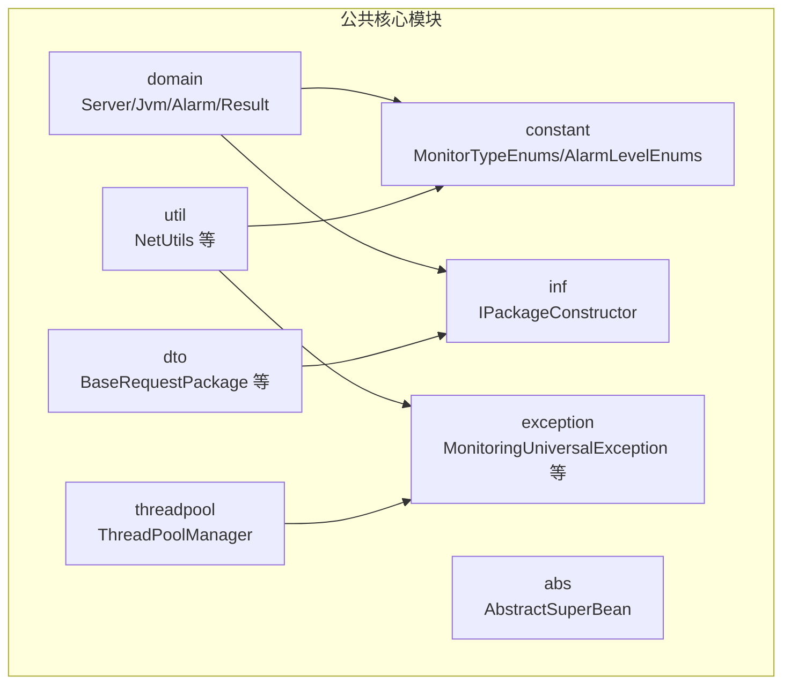
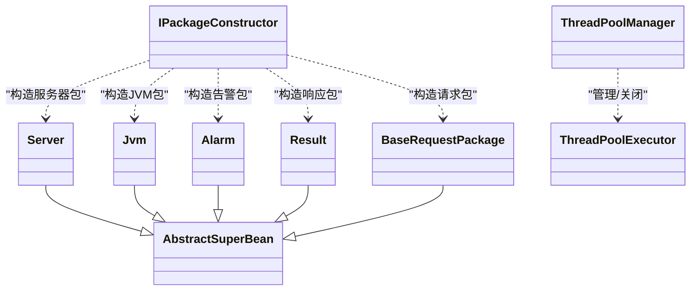
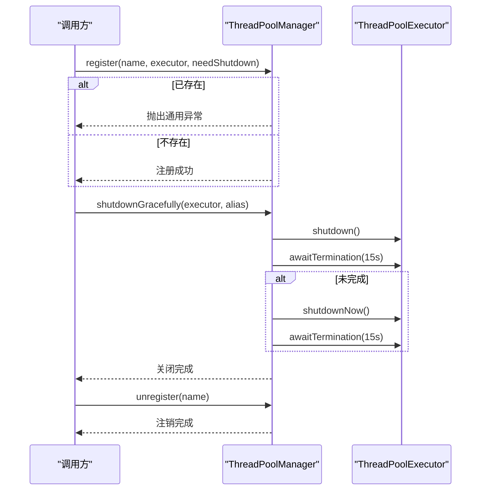
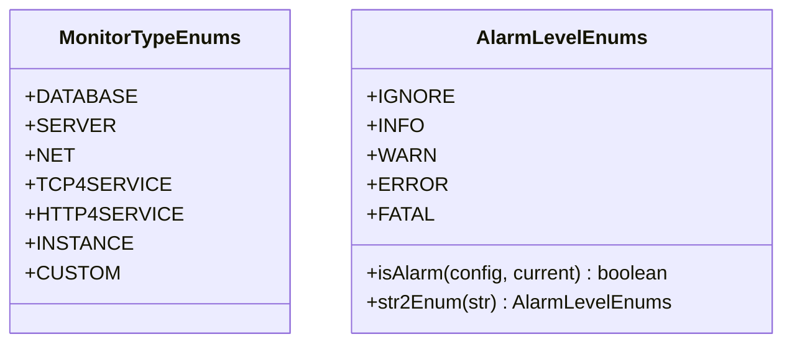
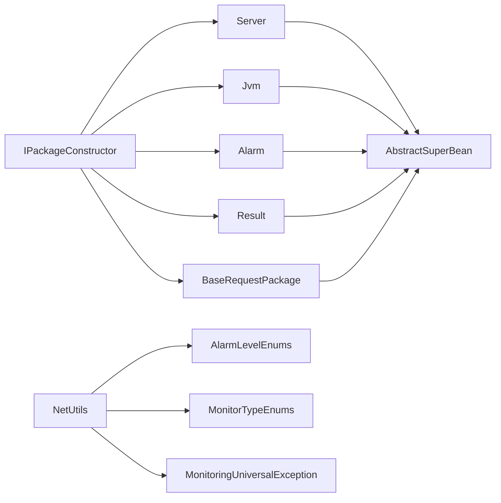

# 公共核心模块

<cite>
**本文引用的文件**   
- [Server.java](file://phoenix-common/phoenix-common-core/src/main/java/com/gitee/pifeng/monitoring/common/domain/Server.java)
- [Jvm.java](file://phoenix-common/phoenix-common-core/src/main/java/com/gitee/pifeng/monitoring/common/domain/Jvm.java)
- [Alarm.java](file://phoenix-common/phoenix-common-core/src/main/java/com/gitee/pifeng/monitoring/common/domain/Alarm.java)
- [Result.java](file://phoenix-common/phoenix-common-core/src/main/java/com/gitee/pifeng/monitoring/common/domain/Result.java)
- [BaseRequestPackage.java](file://phoenix-common/phoenix-common-core/src/main/java/com/gitee/pifeng/monitoring/common/dto/BaseRequestPackage.java)
- [MonitorTypeEnums.java](file://phoenix-common/phoenix-common-core/src/main/java/com/gitee/pifeng/monitoring/common/constant/MonitorTypeEnums.java)
- [AlarmLevelEnums.java](file://phoenix-common/phoenix-common-core/src/main/java/com/gitee/pifeng/monitoring/common/constant/alarm/AlarmLevelEnums.java)
- [MonitoringUniversalException.java](file://phoenix-common/phoenix-common-core/src/main/java/com/gitee/pifeng/monitoring/common/exception/MonitoringUniversalException.java)
- [NetUtils.java](file://phoenix-common/phoenix-common-core/src/main/java/com/gitee/pifeng/monitoring/common/util/server/NetUtils.java)
- [AbstractSuperBean.java](file://phoenix-common/phoenix-common-core/src/main/java/com/gitee/pifeng/monitoring/common/abs/AbstractSuperBean.java)
- [IPackageConstructor.java](file://phoenix-common/phoenix-common-core/src/main/java/com/gitee/pifeng/monitoring/common/inf/IPackageConstructor.java)
- [ThreadPoolManager.java](file://phoenix-common/phoenix-common-core/src/main/java/com/gitee/pifeng/monitoring/common/threadpool/ThreadPoolManager.java)
</cite>

## 目录
1. [简介](#简介)
2. [项目结构](#项目结构)
3. [核心组件](#核心组件)
4. [架构总览](#架构总览)
5. [详细组件分析](#详细组件分析)
6. [依赖分析](#依赖分析)
7. [性能考量](#性能考量)
8. [故障排查指南](#故障排查指南)
9. [结论](#结论)
10. [附录](#附录)

## 简介
本文件面向“公共核心模块”，旨在为跨模块复用的实体、工具、异常、枚举、配置与线程池管理提供系统化技术文档。重点覆盖以下方面：
- 公共实体：Server、Jvm、Alarm、Result、数据包DTO等的设计思路、字段语义与业务规则
- 工具与常量：网络工具、系统信息采集辅助、数据包构造接口等
- 异常体系：通用异常类型、异常处理策略与错误码建议
- 枚举体系：监控类型、告警级别等常用枚举的设计原则与使用场景
- 线程池管理：注册、注销与优雅关闭策略
- 扩展指南：如何在其他模块复用公共能力、扩展工具类与实体
- 测试策略：单元测试与集成测试最佳实践

## 项目结构
公共核心模块位于 phoenix-common/phoenix-common-core，主要包结构如下：
- domain：公共领域模型（Server、Jvm、Alarm、Result 等）
- dto：传输对象（请求/响应包）
- constant：常量与枚举（监控类型、告警级别等）
- exception：异常体系
- util：工具类（如网络工具）
- abs：抽象基类
- inf：接口契约（如包构造器）
- threadpool：线程池管理

图表来源
- [Server.java:1-76](file://phoenix-common/phoenix-common-core/src/main/java/com/gitee/pifeng/monitoring/common/domain/Server.java#L1-L76)
- [Jvm.java:1-51](file://phoenix-common/phoenix-common-core/src/main/java/com/gitee/pifeng/monitoring/common/domain/Jvm.java#L1-L51)
- [Alarm.java:1-117](file://phoenix-common/phoenix-common-core/src/main/java/com/gitee/pifeng/monitoring/common/domain/Alarm.java#L1-L117)
- [Result.java:1-35](file://phoenix-common/phoenix-common-core/src/main/java/com/gitee/pifeng/monitoring/common/domain/Result.java#L1-L35)
- [BaseRequestPackage.java:1-42](file://phoenix-common/phoenix-common-core/src/main/java/com/gitee/pifeng/monitoring/common/dto/BaseRequestPackage.java#L1-L42)
- [MonitorTypeEnums.java:1-49](file://phoenix-common/phoenix-common-core/src/main/java/com/gitee/pifeng/monitoring/common/constant/MonitorTypeEnums.java#L1-L49)
- [AlarmLevelEnums.java:1-118](file://phoenix-common/phoenix-common-core/src/main/java/com/gitee/pifeng/monitoring/common/constant/alarm/AlarmLevelEnums.java#L1-L118)
- [MonitoringUniversalException.java:1-31](file://phoenix-common/phoenix-common-core/src/main/java/com/gitee/pifeng/monitoring/common/exception/MonitoringUniversalException.java#L1-L31)
- [NetUtils.java:1-594](file://phoenix-common/phoenix-common-core/src/main/java/com/gitee/pifeng/monitoring/common/util/server/NetUtils.java#L1-L594)
- [AbstractSuperBean.java:1-15](file://phoenix-common/phoenix-common-core/src/main/java/com/gitee/pifeng/monitoring/common/abs/AbstractSuperBean.java#L1-L15)
- [IPackageConstructor.java:1-114](file://phoenix-common/phoenix-common-core/src/main/java/com/gitee/pifeng/monitoring/common/inf/IPackageConstructor.java#L1-L114)
- [ThreadPoolManager.java:1-131](file://phoenix-common/phoenix-common-core/src/main/java/com/gitee/pifeng/monitoring/common/threadpool/ThreadPoolManager.java#L1-L131)

章节来源
- [Server.java:1-76](file://phoenix-common/phoenix-common-core/src/main/java/com/gitee/pifeng/monitoring/common/domain/Server.java#L1-L76)
- [Jvm.java:1-51](file://phoenix-common/phoenix-common-core/src/main/java/com/gitee/pifeng/monitoring/common/domain/Jvm.java#L1-L51)
- [Alarm.java:1-117](file://phoenix-common/phoenix-common-core/src/main/java/com/gitee/pifeng/monitoring/common/domain/Alarm.java#L1-L117)
- [Result.java:1-35](file://phoenix-common/phoenix-common-core/src/main/java/com/gitee/pifeng/monitoring/common/domain/Result.java#L1-L35)
- [BaseRequestPackage.java:1-42](file://phoenix-common/phoenix-common-core/src/main/java/com/gitee/pifeng/monitoring/common/dto/BaseRequestPackage.java#L1-L42)
- [MonitorTypeEnums.java:1-49](file://phoenix-common/phoenix-common-core/src/main/java/com/gitee/pifeng/monitoring/common/constant/MonitorTypeEnums.java#L1-L49)
- [AlarmLevelEnums.java:1-118](file://phoenix-common/phoenix-common-core/src/main/java/com/gitee/pifeng/monitoring/common/constant/alarm/AlarmLevelEnums.java#L1-L118)
- [MonitoringUniversalException.java:1-31](file://phoenix-common/phoenix-common-core/src/main/java/com/gitee/pifeng/monitoring/common/exception/MonitoringUniversalException.java#L1-L31)
- [NetUtils.java:1-594](file://phoenix-common/phoenix-common-core/src/main/java/com/gitee/pifeng/monitoring/common/util/server/NetUtils.java#L1-L594)
- [AbstractSuperBean.java:1-15](file://phoenix-common/phoenix-common-core/src/main/java/com/gitee/pifeng/monitoring/common/abs/AbstractSuperBean.java#L1-L15)
- [IPackageConstructor.java:1-114](file://phoenix-common/phoenix-common-core/src/main/java/com/gitee/pifeng/monitoring/common/inf/IPackageConstructor.java#L1-L114)
- [ThreadPoolManager.java:1-131](file://phoenix-common/phoenix-common-core/src/main/java/com/gitee/pifeng/monitoring/common/threadpool/ThreadPoolManager.java#L1-L131)

## 核心组件
本节聚焦公共实体、数据包、接口契约与线程池管理器。

- Server：服务器全量监控聚合实体，包含操作系统、内存、CPU、GPU、系统负载、网卡、磁盘、电源、传感器、进程等子域
- Jvm：JVM监控聚合实体，包含类加载、垃圾回收、内存、运行时、线程等子域
- Alarm：告警实体，支持告警级别、原因、监控类型/子类型、字符集、测试标记、标题/内容、编码、被告警主体ID、静默豁免等
- Result：统一返回结果，包含是否成功与消息
- BaseRequestPackage：基础请求包，包含ID、时间戳与附加JSON消息
- IPackageConstructor：包构造器接口，定义各类数据包的构造契约
- ThreadPoolManager：线程池注册、注销与优雅关闭管理器

章节来源
- [Server.java:1-76](file://phoenix-common/phoenix-common-core/src/main/java/com/gitee/pifeng/monitoring/common/domain/Server.java#L1-L76)
- [Jvm.java:1-51](file://phoenix-common/phoenix-common-core/src/main/java/com/gitee/pifeng/monitoring/common/domain/Jvm.java#L1-L51)
- [Alarm.java:1-117](file://phoenix-common/phoenix-common-core/src/main/java/com/gitee/pifeng/monitoring/common/domain/Alarm.java#L1-L117)
- [Result.java:1-35](file://phoenix-common/phoenix-common-core/src/main/java/com/gitee/pifeng/monitoring/common/domain/Result.java#L1-L35)
- [BaseRequestPackage.java:1-42](file://phoenix-common/phoenix-common-core/src/main/java/com/gitee/pifeng/monitoring/common/dto/BaseRequestPackage.java#L1-L42)
- [IPackageConstructor.java:1-114](file://phoenix-common/phoenix-common-core/src/main/java/com/gitee/pifeng/monitoring/common/inf/IPackageConstructor.java#L1-L114)
- [ThreadPoolManager.java:1-131](file://phoenix-common/phoenix-common-core/src/main/java/com/gitee/pifeng/monitoring/common/threadpool/ThreadPoolManager.java#L1-L131)

## 架构总览
公共核心模块通过“抽象父类 + 接口契约 + 实体/DTO + 工具/枚举/异常”的分层设计，向上游提供稳定的跨模块能力。

图表来源
- [AbstractSuperBean.java:1-15](file://phoenix-common/phoenix-common-core/src/main/java/com/gitee/pifeng/monitoring/common/abs/AbstractSuperBean.java#L1-L15)
- [Server.java:1-76](file://phoenix-common/phoenix-common-core/src/main/java/com/gitee/pifeng/monitoring/common/domain/Server.java#L1-L76)
- [Jvm.java:1-51](file://phoenix-common/phoenix-common-core/src/main/java/com/gitee/pifeng/monitoring/common/domain/Jvm.java#L1-L51)
- [Alarm.java:1-117](file://phoenix-common/phoenix-common-core/src/main/java/com/gitee/pifeng/monitoring/common/domain/Alarm.java#L1-L117)
- [Result.java:1-35](file://phoenix-common/phoenix-common-core/src/main/java/com/gitee/pifeng/monitoring/common/domain/Result.java#L1-L35)
- [BaseRequestPackage.java:1-42](file://phoenix-common/phoenix-common-core/src/main/java/com/gitee/pifeng/monitoring/common/dto/BaseRequestPackage.java#L1-L42)
- [IPackageConstructor.java:1-114](file://phoenix-common/phoenix-common-core/src/main/java/com/gitee/pifeng/monitoring/common/inf/IPackageConstructor.java#L1-L114)
- [ThreadPoolManager.java:1-131](file://phoenix-common/phoenix-common-core/src/main/java/com/gitee/pifeng/monitoring/common/threadpool/ThreadPoolManager.java#L1-L131)

## 详细组件分析

### Server 实体
- 设计要点
  - 聚合式设计：将操作系统、内存、CPU、GPU、系统负载、网卡、磁盘、电源、传感器、进程等子域整合为单一服务器视图
  - 继承抽象父类，具备统一的公共行为与扩展点
- 字段与业务规则
  - 各子域字段用于承载对应硬件/系统指标，便于上层按需组合展示与告警
- 使用建议
  - 在采集端按需装配子域，避免冗余字段
  - 与监控类型枚举配合，标识采集维度

章节来源
- [Server.java:1-76](file://phoenix-common/phoenix-common-core/src/main/java/com/gitee/pifeng/monitoring/common/domain/Server.java#L1-L76)

### Jvm 实体
- 设计要点
  - 聚合JVM关键指标：类加载、GC、内存、运行时、线程
- 字段与业务规则
  - 与告警策略联动，如GC频率/内存占用阈值触发告警
- 使用建议
  - 与包构造器结合，生成JvmPackage上报

章节来源
- [Jvm.java:1-51](file://phoenix-common/phoenix-common-core/src/main/java/com/gitee/pifeng/monitoring/common/domain/Jvm.java#L1-L51)

### Alarm 实体
- 设计要点
  - 支持内置告警级别与原因、监控类型/子类型
  - 支持“自定义业务告警”：通过编码从数据库映射级别/标题/内容，优先级高于直接设置
  - 支持测试告警（不发送）、静默豁免、字符集指定
- 关键字段说明
  - alarmLevel：告警级别，默认WARN
  - alarmReason：告警原因，默认IGNORE
  - monitorType/monitorSubType：监控类型与子类型
  - code/title/msg：自定义编码与标题/内容，可覆盖默认值
  - isTest/isIgnoreSilence：测试与静默豁免
  - charset：字符集（非UTF-8时需显式设置）
  - alertedEntityId：被告警主体唯一ID
- 使用建议
  - 对于业务自定义告警，建议统一维护编码字典，避免硬编码

章节来源
- [Alarm.java:1-117](file://phoenix-common/phoenix-common-core/src/main/java/com/gitee/pifeng/monitoring/common/domain/Alarm.java#L1-L117)
- [AlarmLevelEnums.java:1-118](file://phoenix-common/phoenix-common-core/src/main/java/com/gitee/pifeng/monitoring/common/constant/alarm/AlarmLevelEnums.java#L1-L118)
- [MonitorTypeEnums.java:1-49](file://phoenix-common/phoenix-common-core/src/main/java/com/gitee/pifeng/monitoring/common/constant/MonitorTypeEnums.java#L1-L49)

### Result 实体
- 设计要点
  - 统一返回结构，简化调用方判断
- 字段与业务规则
  - isSuccess：是否成功
  - msg：结果描述信息

章节来源
- [Result.java:1-35](file://phoenix-common/phoenix-common-core/src/main/java/com/gitee/pifeng/monitoring/common/domain/Result.java#L1-L35)

### BaseRequestPackage 数据包
- 设计要点
  - 基础请求包抽象，包含ID、时间戳与附加JSON消息
- 字段与业务规则
  - id：请求唯一标识
  - dateTime：请求时间
  - extraMsg：扩展信息载体
- 使用建议
  - 作为各监控端点上报的基础载体，配合包构造器生成具体包

章节来源
- [BaseRequestPackage.java:1-42](file://phoenix-common/phoenix-common-core/src/main/java/com/gitee/pifeng/monitoring/common/dto/BaseRequestPackage.java#L1-L42)

### IPackageConstructor 接口
- 设计要点
  - 抽象工厂风格：屏蔽构建细节，使用者仅需调用即可获得目标数据包
- 关键方法
  - structureAlarmPackage、structureHeartbeatPackage、structureServerPackage、structureJvmPackage、structureBaseResponsePackage、structureBaseRequestPackage、structureOfflinePackage
- 使用建议
  - 不同监控端点实现该接口，按需扩展新的数据包类型

章节来源
- [IPackageConstructor.java:1-114](file://phoenix-common/phoenix-common-core/src/main/java/com/gitee/pifeng/monitoring/common/inf/IPackageConstructor.java#L1-L114)

### ThreadPoolManager 线程池管理器
- 设计要点
  - 提供线程池注册、注销与优雅关闭能力
  - 分类管理“需要关闭”与“不需要关闭”的线程池
- 关键流程
  - register：注册线程池，若已存在则抛出通用异常
  - unregister：移除注册
  - shutdownGracefully：优雅关闭，超时后强制关闭并保留中断状态
  - shutdownAllGracefullyAndUnregister：批量优雅关闭并取消注册
- 使用建议
  - 在应用生命周期末尾统一调用优雅关闭，确保资源释放

图表来源
- [ThreadPoolManager.java:1-131](file://phoenix-common/phoenix-common-core/src/main/java/com/gitee/pifeng/monitoring/common/threadpool/ThreadPoolManager.java#L1-L131)

章节来源
- [ThreadPoolManager.java:1-131](file://phoenix-common/phoenix-common-core/src/main/java/com/gitee/pifeng/monitoring/common/threadpool/ThreadPoolManager.java#L1-L131)

### NetUtils 网络工具类
- 设计要点
  - 提供本机MAC/IP/子网掩码获取、Ping连通性检测、Telnet连通性检测等
  - 多实现回退策略：InetAddress → Oshi → Sigar
- 关键方法
  - getLocalMac/getLocalIp/getLocalSubnetMask：多策略回退
  - isConnect/ping：跨平台ping，解析平均时延
  - telnet/telnetVT200：Telnet连通性检测
- 使用建议
  - 在采集端前置校验网络可达性，避免无效上报
  - 注意字符集与异常处理（NetException）

章节来源
- [NetUtils.java:1-594](file://phoenix-common/phoenix-common-core/src/main/java/com/gitee/pifeng/monitoring/common/util/server/NetUtils.java#L1-L594)

### AbstractSuperBean 抽象父类
- 设计要点
  - 统一Bean的公共行为，作为domain与dto的父类
- 使用建议
  - 新增实体时继承该类，保持一致性

章节来源
- [AbstractSuperBean.java:1-15](file://phoenix-common/phoenix-common-core/src/main/java/com/gitee/pifeng/monitoring/common/abs/AbstractSuperBean.java#L1-L15)

### 枚举体系
- MonitorTypeEnums：监控类型（数据库、服务器、网络、TCP服务、HTTP服务、应用实例、自定义）
- AlarmLevelEnums：告警级别（忽略、消息、警告、错误、严重），并提供级别比较与字符串转换工具方法

图表来源
- [MonitorTypeEnums.java:1-49](file://phoenix-common/phoenix-common-core/src/main/java/com/gitee/pifeng/monitoring/common/constant/MonitorTypeEnums.java#L1-L49)
- [AlarmLevelEnums.java:1-118](file://phoenix-common/phoenix-common-core/src/main/java/com/gitee/pifeng/monitoring/common/constant/alarm/AlarmLevelEnums.java#L1-L118)

章节来源
- [MonitorTypeEnums.java:1-49](file://phoenix-common/phoenix-common-core/src/main/java/com/gitee/pifeng/monitoring/common/constant/MonitorTypeEnums.java#L1-L49)
- [AlarmLevelEnums.java:1-118](file://phoenix-common/phoenix-common-core/src/main/java/com/gitee/pifeng/monitoring/common/constant/alarm/AlarmLevelEnums.java#L1-L118)

### 异常体系
- MonitoringUniversalException：通用运行时异常，提供空参、消息、消息+原因构造
- NetException：网络相关异常（由NetUtils抛出）
- 建议
  - 统一捕获通用异常，结合业务上下文封装为带明确错误码与提示的消息
  - 对外暴露稳定错误码，内部保留堆栈以便定位

章节来源
- [MonitoringUniversalException.java:1-31](file://phoenix-common/phoenix-common-core/src/main/java/com/gitee/pifeng/monitoring/common/exception/MonitoringUniversalException.java#L1-L31)

## 依赖分析
- 组件内聚与耦合
  - domain与dto均继承抽象父类，降低重复代码
  - IPackageConstructor定义了稳定的包构造契约，便于不同端点实现
  - NetUtils与异常体系解耦，通过异常向上抛出
- 外部依赖
  - 第三方库：Hutool、Guava、Apache Commons等
  - 平台差异：Windows/Linux分支逻辑在NetUtils中体现

图表来源
- [Server.java:1-76](file://phoenix-common/phoenix-common-core/src/main/java/com/gitee/pifeng/monitoring/common/domain/Server.java#L1-L76)
- [Jvm.java:1-51](file://phoenix-common/phoenix-common-core/src/main/java/com/gitee/pifeng/monitoring/common/domain/Jvm.java#L1-L51)
- [Alarm.java:1-117](file://phoenix-common/phoenix-common-core/src/main/java/com/gitee/pifeng/monitoring/common/domain/Alarm.java#L1-L117)
- [Result.java:1-35](file://phoenix-common/phoenix-common-core/src/main/java/com/gitee/pifeng/monitoring/common/domain/Result.java#L1-L35)
- [BaseRequestPackage.java:1-42](file://phoenix-common/phoenix-common-core/src/main/java/com/gitee/pifeng/monitoring/common/dto/BaseRequestPackage.java#L1-L42)
- [IPackageConstructor.java:1-114](file://phoenix-common/phoenix-common-core/src/main/java/com/gitee/pifeng/monitoring/common/inf/IPackageConstructor.java#L1-L114)
- [AlarmLevelEnums.java:1-118](file://phoenix-common/phoenix-common-core/src/main/java/com/gitee/pifeng/monitoring/common/constant/alarm/AlarmLevelEnums.java#L1-L118)
- [MonitorTypeEnums.java:1-49](file://phoenix-common/phoenix-common-core/src/main/java/com/gitee/pifeng/monitoring/common/constant/MonitorTypeEnums.java#L1-L49)
- [MonitoringUniversalException.java:1-31](file://phoenix-common/phoenix-common-core/src/main/java/com/gitee/pifeng/monitoring/common/exception/MonitoringUniversalException.java#L1-L31)

## 性能考量
- 线程池管理
  - 采用“优雅关闭 + 超时中断”的两阶段策略，兼顾稳定性与资源回收
  - 建议在应用停机前统一调用批量优雅关闭
- 网络探测
  - Ping/Telnet采用短超时与最小重试，避免阻塞主流程
  - 跨平台命令参数差异化处理，减少失败重试成本
- 数据包构造
  - 通过接口契约屏蔽构建细节，降低序列化/传输开销

## 故障排查指南
- 常见问题与定位
  - 网络采集失败：检查MAC/IP/子网掩码获取回退链路，确认异常类型（NetException）
  - 告警级别判定异常：核对配置告警级别与当前级别比较逻辑
  - 线程池无法关闭：查看优雅关闭阶段日志，确认awaitTermination超时与中断状态
- 建议流程
  - 统一捕获通用异常，记录上下文与错误码
  - 对网络/IO类异常进行分级处理，必要时降级或重试

章节来源
- [NetUtils.java:1-594](file://phoenix-common/phoenix-common-core/src/main/java/com/gitee/pifeng/monitoring/common/util/server/NetUtils.java#L1-L594)
- [AlarmLevelEnums.java:1-118](file://phoenix-common/phoenix-common-core/src/main/java/com/gitee/pifeng/monitoring/common/constant/alarm/AlarmLevelEnums.java#L1-L118)
- [ThreadPoolManager.java:1-131](file://phoenix-common/phoenix-common-core/src/main/java/com/gitee/pifeng/monitoring/common/threadpool/ThreadPoolManager.java#L1-L131)
- [MonitoringUniversalException.java:1-31](file://phoenix-common/phoenix-common-core/src/main/java/com/gitee/pifeng/monitoring/common/exception/MonitoringUniversalException.java#L1-L31)

## 结论
公共核心模块以“抽象父类 + 接口契约 + 实体/DTO + 工具/枚举/异常 + 线程池管理”为核心，形成高内聚、低耦合、易扩展的基础设施层。通过标准化的数据包构造与统一异常处理，有效支撑各监控端点的稳定运行与跨模块复用。

## 附录

### 扩展指南
- 复用公共功能
  - 新增实体：继承抽象父类，遵循统一字段命名与默认值策略
  - 新增数据包：实现包构造器接口，按需扩展
  - 新增工具类：遵循现有工具类命名与异常处理规范
- 扩展新的工具类与实体
  - 工具类：提供静态方法与异常封装，避免副作用
  - 实体：明确业务语义与默认值，避免过度聚合
- 配置与默认值
  - 通过属性绑定与默认值策略，保证在不同环境的一致性

### 测试策略
- 单元测试
  - 对工具类方法进行边界与异常场景覆盖（如网络工具的异常分支）
  - 对枚举比较与转换方法进行等价类划分测试
- 集成测试
  - 对包构造器进行端到端验证，确保数据包结构与字段正确
  - 对线程池管理器进行优雅关闭流程验证