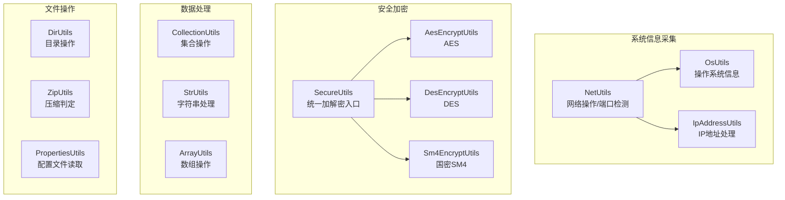
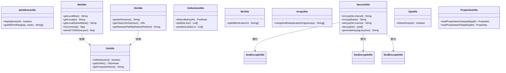
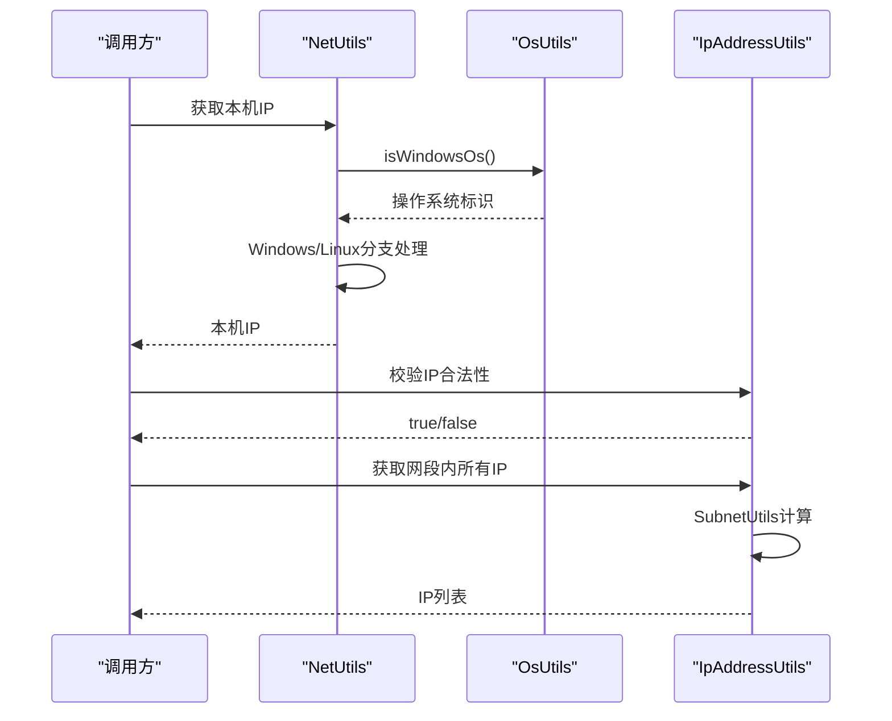
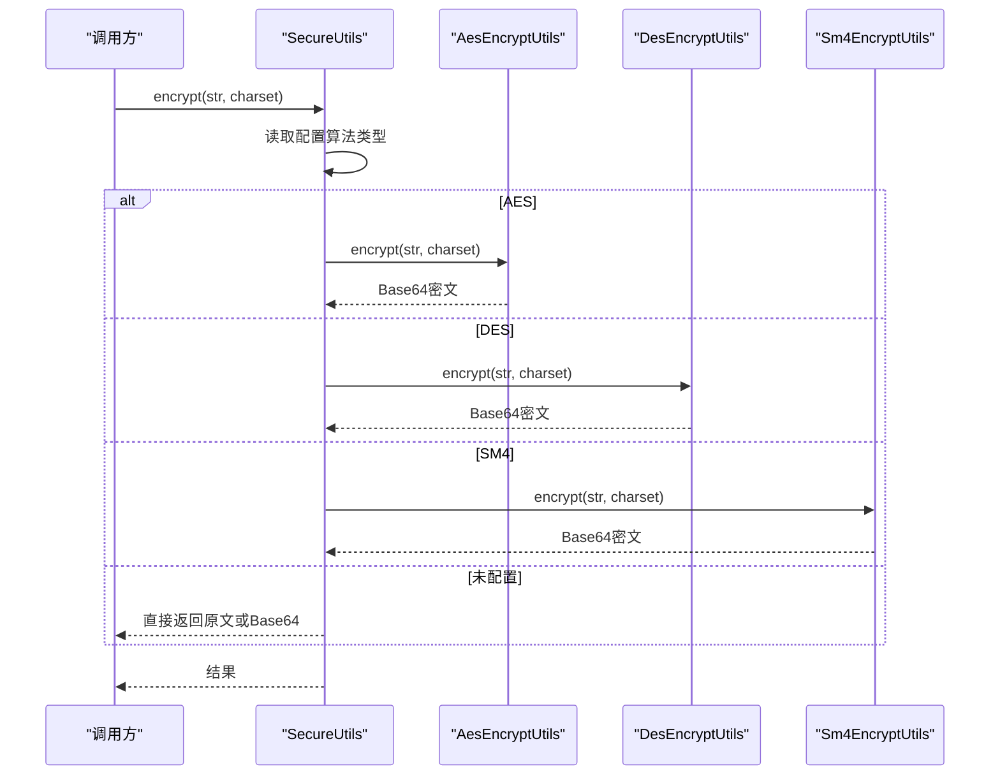
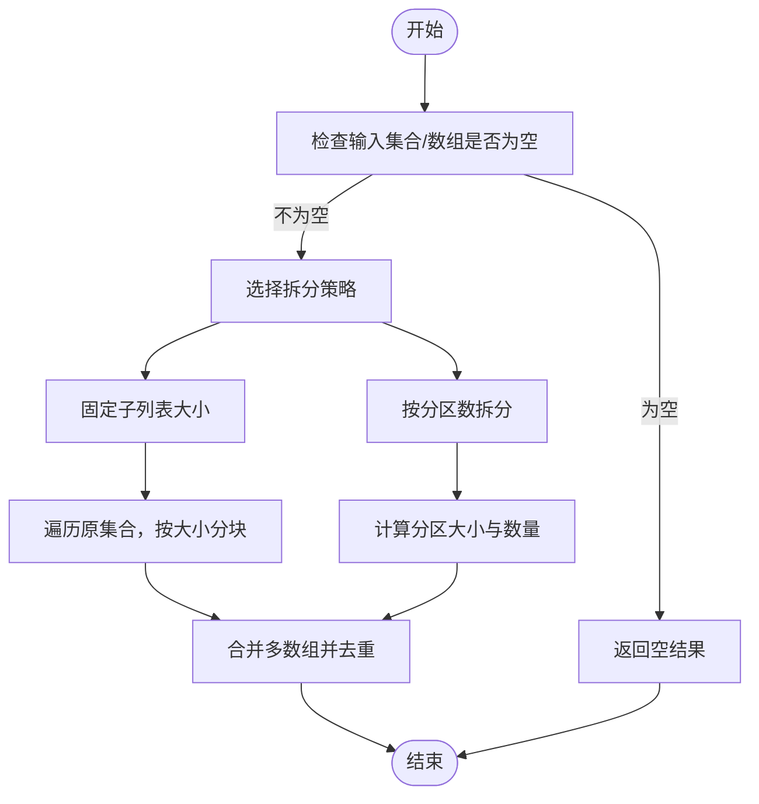
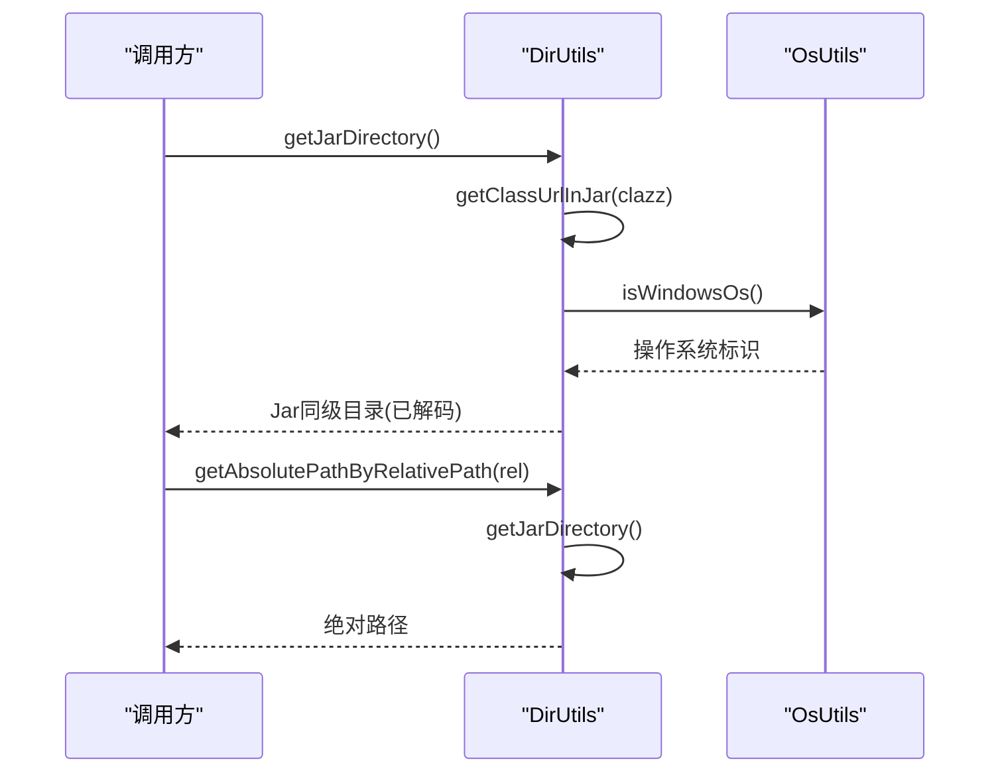
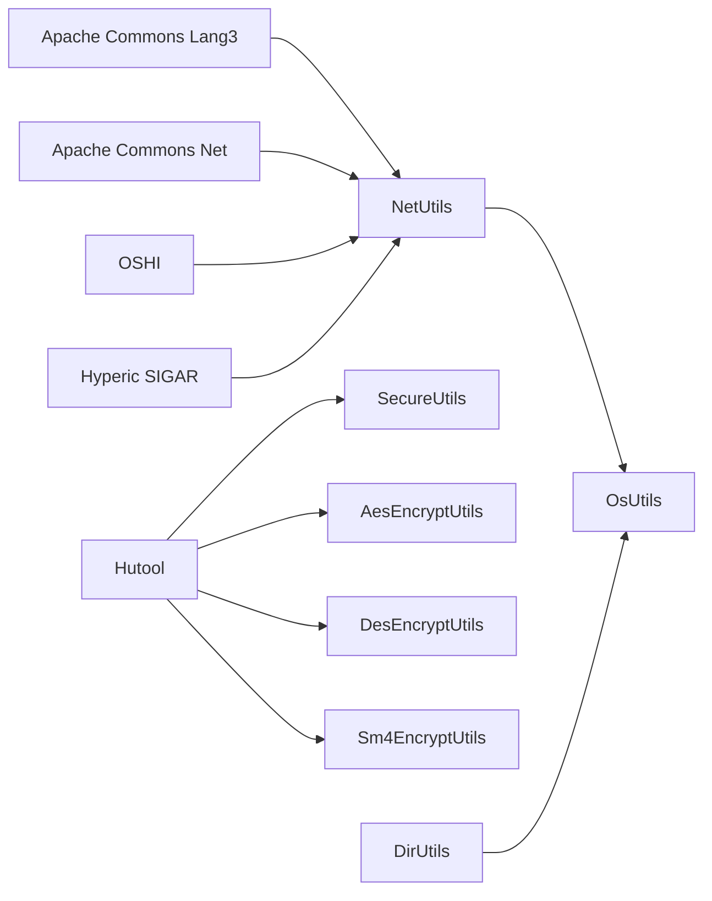

# 工具类集合

<cite>
**本文引用的文件**
- [IpAddressUtils.java](file://phoenix-common/phoenix-common-core/src/main/java/com/gitee/pifeng/monitoring/common/util/server/IpAddressUtils.java)
- [NetUtils.java](file://phoenix-common/phoenix-common-core/src/main/java/com/gitee/pifeng/monitoring/common/util/server/NetUtils.java)
- [OsUtils.java](file://phoenix-common/phoenix-common-core/src/main/java/com/gitee/pifeng/monitoring/common/util/server/OsUtils.java)
- [AesEncryptUtils.java](file://phoenix-common/phoenix-common-core/src/main/java/com/gitee/pifeng/monitoring/common/util/secure/AesEncryptUtils.java)
- [DesEncryptUtils.java](file://phoenix-common/phoenix-common-core/src/main/java/com/gitee/pifeng/monitoring/common/util/secure/DesEncryptUtils.java)
- [Sm4EncryptUtils.java](file://phoenix-common/phoenix-common-core/src/main/java/com/gitee/pifeng/monitoring/common/util/secure/Sm4EncryptUtils.java)
- [SecureUtils.java](file://phoenix-common/phoenix-common-core/src/main/java/com/gitee/pifeng/monitoring/common/util/secure/SecureUtils.java)
- [CollectionUtils.java](file://phoenix-common/phoenix-common-core/src/main/java/com/gitee/pifeng/monitoring/common/util/CollectionUtils.java)
- [StrUtils.java](file://phoenix-common/phoenix-common-core/src/main/java/com/gitee/pifeng/monitoring/common/util/StrUtils.java)
- [ArrayUtils.java](file://phoenix-common/phoenix-common-core/src/main/java/com/gitee/pifeng/monitoring/common/util/ArrayUtils.java)
- [DirUtils.java](file://phoenix-common/phoenix-common-core/src/main/java/com/gitee/pifeng/monitoring/common/util/DirUtils.java)
- [ZipUtils.java](file://phoenix-common/phoenix-common-core/src/main/java/com/gitee/pifeng/monitoring/common/util/ZipUtils.java)
- [PropertiesUtils.java](file://phoenix-common/phoenix-common-core/src/main/java/com/gitee/pifeng/monitoring/common/util/PropertiesUtils.java)
</cite>

## 目录
1. [简介](#简介)
2. [项目结构](#项目结构)
3. [核心组件](#核心组件)
4. [架构总览](#架构总览)
5. [详细组件分析](#详细组件分析)
6. [依赖分析](#依赖分析)
7. [性能考虑](#性能考虑)
8. [故障排查指南](#故障排查指南)
9. [结论](#结论)
10. [附录](#附录)

## 简介
本文件面向Phoenix监控系统的工具类集合，系统性梳理并解析以下工具域：
- 系统信息采集：OsUtils、IpAddressUtils、NetUtils
- 安全加密：AesEncryptUtils、DesEncryptUtils、Sm4EncryptUtils、SecureUtils
- 数据处理：CollectionUtils、StrUtils、ArrayUtils
- 文件操作：DirUtils、ZipUtils、PropertiesUtils

文档以循序渐进的方式呈现，先给出整体架构与各组件职责，再深入到实现细节、调用流程与性能考量，并提供可复用的最佳实践与排障建议。

## 项目结构
工具类主要位于公共模块的工具包下，按功能域划分：
- server工具：OsUtils、IpAddressUtils、NetUtils
- secure工具：AesEncryptUtils、DesEncryptUtils、Sm4EncryptUtils、SecureUtils
- 数据处理：CollectionUtils、StrUtils、ArrayUtils
- 文件操作：DirUtils、ZipUtils、PropertiesUtils

图表来源
- [OsUtils.java:1-120](file://phoenix-common/phoenix-common-core/src/main/java/com/gitee/pifeng/monitoring/common/util/server/OsUtils.java#L1-L120)
- [IpAddressUtils.java:1-75](file://phoenix-common/phoenix-common-core/src/main/java/com/gitee/pifeng/monitoring/common/util/server/IpAddressUtils.java#L1-L75)
- [NetUtils.java:1-594](file://phoenix-common/phoenix-common-core/src/main/java/com/gitee/pifeng/monitoring/common/util/server/NetUtils.java#L1-L594)
- [SecureUtils.java:1-113](file://phoenix-common/phoenix-common-core/src/main/java/com/gitee/pifeng/monitoring/common/util/secure/SecureUtils.java#L1-L113)
- [AesEncryptUtils.java:1-82](file://phoenix-common/phoenix-common-core/src/main/java/com/gitee/pifeng/monitoring/common/util/secure/AesEncryptUtils.java#L1-L82)
- [DesEncryptUtils.java:1-82](file://phoenix-common/phoenix-common-core/src/main/java/com/gitee/pifeng/monitoring/common/util/secure/DesEncryptUtils.java#L1-L82)
- [Sm4EncryptUtils.java:1-82](file://phoenix-common/phoenix-common-core/src/main/java/com/gitee/pifeng/monitoring/common/util/secure/Sm4EncryptUtils.java#L1-L82)
- [CollectionUtils.java:1-126](file://phoenix-common/phoenix-common-core/src/main/java/com/gitee/pifeng/monitoring/common/util/CollectionUtils.java#L1-L126)
- [StrUtils.java:1-50](file://phoenix-common/phoenix-common-core/src/main/java/com/gitee/pifeng/monitoring/common/util/StrUtils.java#L1-L50)
- [ArrayUtils.java:1-53](file://phoenix-common/phoenix-common-core/src/main/java/com/gitee/pifeng/monitoring/common/util/ArrayUtils.java#L1-L53)
- [DirUtils.java:1-118](file://phoenix-common/phoenix-common-core/src/main/java/com/gitee/pifeng/monitoring/common/util/DirUtils.java#L1-L118)
- [ZipUtils.java:1-55](file://phoenix-common/phoenix-common-core/src/main/java/com/gitee/pifeng/monitoring/common/util/ZipUtils.java#L1-L55)
- [PropertiesUtils.java:1-89](file://phoenix-common/phoenix-common-core/src/main/java/com/gitee/pifeng/monitoring/common/util/PropertiesUtils.java#L1-L89)

章节来源
- [OsUtils.java:1-120](file://phoenix-common/phoenix-common-core/src/main/java/com/gitee/pifeng/monitoring/common/util/server/OsUtils.java#L1-L120)
- [IpAddressUtils.java:1-75](file://phoenix-common/phoenix-common-core/src/main/java/com/gitee/pifeng/monitoring/common/util/server/IpAddressUtils.java#L1-L75)
- [NetUtils.java:1-594](file://phoenix-common/phoenix-common-core/src/main/java/com/gitee/pifeng/monitoring/common/util/server/NetUtils.java#L1-L594)
- [AesEncryptUtils.java:1-82](file://phoenix-common/phoenix-common-core/src/main/java/com/gitee/pifeng/monitoring/common/util/secure/AesEncryptUtils.java#L1-L82)
- [DesEncryptUtils.java:1-82](file://phoenix-common/phoenix-common-core/src/main/java/com/gitee/pifeng/monitoring/common/util/secure/DesEncryptUtils.java#L1-L82)
- [Sm4EncryptUtils.java:1-82](file://phoenix-common/phoenix-common-core/src/main/java/com/gitee/pifeng/monitoring/common/util/secure/Sm4EncryptUtils.java#L1-L82)
- [SecureUtils.java:1-113](file://phoenix-common/phoenix-common-core/src/main/java/com/gitee/pifeng/monitoring/common/util/secure/SecureUtils.java#L1-L113)
- [CollectionUtils.java:1-126](file://phoenix-common/phoenix-common-core/src/main/java/com/gitee/pifeng/monitoring/common/util/CollectionUtils.java#L1-L126)
- [StrUtils.java:1-50](file://phoenix-common/phoenix-common-core/src/main/java/com/gitee/pifeng/monitoring/common/util/StrUtils.java#L1-L50)
- [ArrayUtils.java:1-53](file://phoenix-common/phoenix-common-core/src/main/java/com/gitee/pifeng/monitoring/common/util/ArrayUtils.java#L1-L53)
- [DirUtils.java:1-118](file://phoenix-common/phoenix-common-core/src/main/java/com/gitee/pifeng/monitoring/common/util/DirUtils.java#L1-L118)
- [ZipUtils.java:1-55](file://phoenix-common/phoenix-common-core/src/main/java/com/gitee/pifeng/monitoring/common/util/ZipUtils.java#L1-L55)
- [PropertiesUtils.java:1-89](file://phoenix-common/phoenix-common-core/src/main/java/com/gitee/pifeng/monitoring/common/util/PropertiesUtils.java#L1-L89)

## 核心组件
- 系统信息采集：OsUtils提供操作系统信息与计算机名；IpAddressUtils提供IP合法性校验与网段内IP枚举；NetUtils提供MAC/IP/子网掩码获取、Ping连通性检测、Telnet连通性检测等。
- 安全加密：AesEncryptUtils/DesEncryptUtils/Sm4EncryptUtils分别封装AES/DES/SM4加解密；SecureUtils作为统一入口，依据配置动态选择具体算法。
- 数据处理：CollectionUtils提供去重谓词、等分拆分与按分区数拆分；StrUtils提供以末尾字母切分为两段的工具；ArrayUtils提供多数组合并去重。
- 文件操作：DirUtils提供Jar同级目录定位、类所在Jar URL解析、相对路径转绝对路径；ZipUtils提供字符串是否需要GZIP压缩的判定；PropertiesUtils提供类路径与文件路径的Properties加载。

章节来源
- [OsUtils.java:1-120](file://phoenix-common/phoenix-common-core/src/main/java/com/gitee/pifeng/monitoring/common/util/server/OsUtils.java#L1-L120)
- [IpAddressUtils.java:1-75](file://phoenix-common/phoenix-common-core/src/main/java/com/gitee/pifeng/monitoring/common/util/server/IpAddressUtils.java#L1-L75)
- [NetUtils.java:1-594](file://phoenix-common/phoenix-common-core/src/main/java/com/gitee/pifeng/monitoring/common/util/server/NetUtils.java#L1-L594)
- [AesEncryptUtils.java:1-82](file://phoenix-common/phoenix-common-core/src/main/java/com/gitee/pifeng/monitoring/common/util/secure/AesEncryptUtils.java#L1-L82)
- [DesEncryptUtils.java:1-82](file://phoenix-common/phoenix-common-core/src/main/java/com/gitee/pifeng/monitoring/common/util/secure/DesEncryptUtils.java#L1-L82)
- [Sm4EncryptUtils.java:1-82](file://phoenix-common/phoenix-common-core/src/main/java/com/gitee/pifeng/monitoring/common/util/secure/Sm4EncryptUtils.java#L1-L82)
- [SecureUtils.java:1-113](file://phoenix-common/phoenix-common-core/src/main/java/com/gitee/pifeng/monitoring/common/util/secure/SecureUtils.java#L1-L113)
- [CollectionUtils.java:1-126](file://phoenix-common/phoenix-common-core/src/main/java/com/gitee/pifeng/monitoring/common/util/CollectionUtils.java#L1-L126)
- [StrUtils.java:1-50](file://phoenix-common/phoenix-common-core/src/main/java/com/gitee/pifeng/monitoring/common/util/StrUtils.java#L1-L50)
- [ArrayUtils.java:1-53](file://phoenix-common/phoenix-common-core/src/main/java/com/gitee/pifeng/monitoring/common/util/ArrayUtils.java#L1-L53)
- [DirUtils.java:1-118](file://phoenix-common/phoenix-common-core/src/main/java/com/gitee/pifeng/monitoring/common/util/DirUtils.java#L1-L118)
- [ZipUtils.java:1-55](file://phoenix-common/phoenix-common-core/src/main/java/com/gitee/pifeng/monitoring/common/util/ZipUtils.java#L1-L55)
- [PropertiesUtils.java:1-89](file://phoenix-common/phoenix-common-core/src/main/java/com/gitee/pifeng/monitoring/common/util/PropertiesUtils.java#L1-L89)

## 架构总览
工具类采用“按域分包、按职责分类”的组织方式，核心要点：
- 无状态工具类，全部为静态方法，便于全局复用
- 依赖外部库：Apache Commons Lang3、Commons Net、Hutool、OSHI、Hyperic SIGAR等
- 统一异常模型：网络相关异常使用专用异常类型，通用异常用于文件/路径等场景

图表来源
- [OsUtils.java:1-120](file://phoenix-common/phoenix-common-core/src/main/java/com/gitee/pifeng/monitoring/common/util/server/OsUtils.java#L1-L120)
- [IpAddressUtils.java:1-75](file://phoenix-common/phoenix-common-core/src/main/java/com/gitee/pifeng/monitoring/common/util/server/IpAddressUtils.java#L1-L75)
- [NetUtils.java:1-594](file://phoenix-common/phoenix-common-core/src/main/java/com/gitee/pifeng/monitoring/common/util/server/NetUtils.java#L1-L594)
- [SecureUtils.java:1-113](file://phoenix-common/phoenix-common-core/src/main/java/com/gitee/pifeng/monitoring/common/util/secure/SecureUtils.java#L1-L113)
- [AesEncryptUtils.java:1-82](file://phoenix-common/phoenix-common-core/src/main/java/com/gitee/pifeng/monitoring/common/util/secure/AesEncryptUtils.java#L1-L82)
- [DesEncryptUtils.java:1-82](file://phoenix-common/phoenix-common-core/src/main/java/com/gitee/pifeng/monitoring/common/util/secure/DesEncryptUtils.java#L1-L82)
- [Sm4EncryptUtils.java:1-82](file://phoenix-common/phoenix-common-core/src/main/java/com/gitee/pifeng/monitoring/common/util/secure/Sm4EncryptUtils.java#L1-L82)
- [CollectionUtils.java:1-126](file://phoenix-common/phoenix-common-core/src/main/java/com/gitee/pifeng/monitoring/common/util/CollectionUtils.java#L1-L126)
- [StrUtils.java:1-50](file://phoenix-common/phoenix-common-core/src/main/java/com/gitee/pifeng/monitoring/common/util/StrUtils.java#L1-L50)
- [ArrayUtils.java:1-53](file://phoenix-common/phoenix-common-core/src/main/java/com/gitee/pifeng/monitoring/common/util/ArrayUtils.java#L1-L53)
- [DirUtils.java:1-118](file://phoenix-common/phoenix-common-core/src/main/java/com/gitee/pifeng/monitoring/common/util/DirUtils.java#L1-L118)
- [ZipUtils.java:1-55](file://phoenix-common/phoenix-common-core/src/main/java/com/gitee/pifeng/monitoring/common/util/ZipUtils.java#L1-L55)
- [PropertiesUtils.java:1-89](file://phoenix-common/phoenix-common-core/src/main/java/com/gitee/pifeng/monitoring/common/util/PropertiesUtils.java#L1-L89)

## 详细组件分析

### 系统信息采集工具类
- OsUtils
  - 职责：判断操作系统类型、获取系统属性与环境变量、封装计算机名获取逻辑
  - 关键点：Windows通过环境变量获取，非Windows通过本地主机名获取
- IpAddressUtils
  - 职责：IP合法性校验、基于子网掩码计算网段内所有IP
  - 关键点：正则表达式限定格式范围；使用子网工具类生成全量地址
- NetUtils
  - 职责：MAC/IP/子网掩码获取；Ping/Telnet连通性检测
  - 关键点：多策略回退获取MAC；跨平台Ping参数差异；Telnet VT200终端类型避免中文乱码

图表来源
- [NetUtils.java:188-280](file://phoenix-common/phoenix-common-core/src/main/java/com/gitee/pifeng/monitoring/common/util/server/NetUtils.java#L188-L280)
- [OsUtils.java:56-63](file://phoenix-common/phoenix-common-core/src/main/java/com/gitee/pifeng/monitoring/common/util/server/OsUtils.java#L56-L63)
- [IpAddressUtils.java:43-72](file://phoenix-common/phoenix-common-core/src/main/java/com/gitee/pifeng/monitoring/common/util/server/IpAddressUtils.java#L43-L72)

章节来源
- [OsUtils.java:1-120](file://phoenix-common/phoenix-common-core/src/main/java/com/gitee/pifeng/monitoring/common/util/server/OsUtils.java#L1-L120)
- [IpAddressUtils.java:1-75](file://phoenix-common/phoenix-common-core/src/main/java/com/gitee/pifeng/monitoring/common/util/server/IpAddressUtils.java#L1-L75)
- [NetUtils.java:1-594](file://phoenix-common/phoenix-common-core/src/main/java/com/gitee/pifeng/monitoring/common/util/server/NetUtils.java#L1-L594)

### 安全加密工具类
- AesEncryptUtils/DesEncryptUtils/Sm4EncryptUtils
  - 职责：基于密钥进行字符串与字节数组的加解密，返回Base64编码字符串
  - 关键点：密钥来自配置解码；统一字符集；提供字符串与字节数组两种接口
- SecureUtils
  - 职责：统一入口，依据配置选择具体算法；支持对称密钥生成

图表来源
- [SecureUtils.java:34-58](file://phoenix-common/phoenix-common-core/src/main/java/com/gitee/pifeng/monitoring/common/util/secure/SecureUtils.java#L34-L58)
- [AesEncryptUtils.java:30-33](file://phoenix-common/phoenix-common-core/src/main/java/com/gitee/pifeng/monitoring/common/util/secure/AesEncryptUtils.java#L30-L33)
- [DesEncryptUtils.java:30-33](file://phoenix-common/phoenix-common-core/src/main/java/com/gitee/pifeng/monitoring/common/util/secure/DesEncryptUtils.java#L30-L33)
- [Sm4EncryptUtils.java:30-33](file://phoenix-common/phoenix-common-core/src/main/java/com/gitee/pifeng/monitoring/common/util/secure/Sm4EncryptUtils.java#L30-L33)

章节来源
- [AesEncryptUtils.java:1-82](file://phoenix-common/phoenix-common-core/src/main/java/com/gitee/pifeng/monitoring/common/util/secure/AesEncryptUtils.java#L1-L82)
- [DesEncryptUtils.java:1-82](file://phoenix-common/phoenix-common-core/src/main/java/com/gitee/pifeng/monitoring/common/util/secure/DesEncryptUtils.java#L1-L82)
- [Sm4EncryptUtils.java:1-82](file://phoenix-common/phoenix-common-core/src/main/java/com/gitee/pifeng/monitoring/common/util/secure/Sm4EncryptUtils.java#L1-L82)
- [SecureUtils.java:1-113](file://phoenix-common/phoenix-common-core/src/main/java/com/gitee/pifeng/monitoring/common/util/secure/SecureUtils.java#L1-L113)

### 数据处理工具类
- CollectionUtils
  - 去重谓词：基于并发Map实现线程安全的去重
  - 拆分：支持固定子列表大小与按分区数拆分两种策略
- StrUtils
  - 以末尾字母起点分割，便于解析带单位的数值字符串
- ArrayUtils
  - 多数组合并并保持插入顺序去重

图表来源
- [CollectionUtils.java:60-90](file://phoenix-common/phoenix-common-core/src/main/java/com/gitee/pifeng/monitoring/common/util/CollectionUtils.java#L60-L90)
- [CollectionUtils.java:104-123](file://phoenix-common/phoenix-common-core/src/main/java/com/gitee/pifeng/monitoring/common/util/CollectionUtils.java#L104-L123)
- [ArrayUtils.java:38-51](file://phoenix-common/phoenix-common-core/src/main/java/com/gitee/pifeng/monitoring/common/util/ArrayUtils.java#L38-L51)
- [StrUtils.java:28-47](file://phoenix-common/phoenix-common-core/src/main/java/com/gitee/pifeng/monitoring/common/util/StrUtils.java#L28-L47)

章节来源
- [CollectionUtils.java:1-126](file://phoenix-common/phoenix-common-core/src/main/java/com/gitee/pifeng/monitoring/common/util/CollectionUtils.java#L1-L126)
- [StrUtils.java:1-50](file://phoenix-common/phoenix-common-core/src/main/java/com/gitee/pifeng/monitoring/common/util/StrUtils.java#L1-L50)
- [ArrayUtils.java:1-53](file://phoenix-common/phoenix-common-core/src/main/java/com/gitee/pifeng/monitoring/common/util/ArrayUtils.java#L1-L53)

### 文件操作工具类
- DirUtils
  - 获取Jar同级目录、解析类所在Jar URL、根据相对路径获取绝对路径
  - 关键点：Windows路径前导斜杠处理、URL解码、回退到用户工作目录
- ZipUtils
  - 当字符串长度超过阈值时判定需要GZIP压缩
- PropertiesUtils
  - 支持从类路径与文件路径加载Properties

图表来源
- [DirUtils.java:44-67](file://phoenix-common/phoenix-common-core/src/main/java/com/gitee/pifeng/monitoring/common/util/DirUtils.java#L44-L67)
- [DirUtils.java:80-93](file://phoenix-common/phoenix-common-core/src/main/java/com/gitee/pifeng/monitoring/common/util/DirUtils.java#L80-L93)
- [DirUtils.java:105-115](file://phoenix-common/phoenix-common-core/src/main/java/com/gitee/pifeng/monitoring/common/util/DirUtils.java#L105-L115)
- [OsUtils.java:56-63](file://phoenix-common/phoenix-common-core/src/main/java/com/gitee/pifeng/monitoring/common/util/server/OsUtils.java#L56-L63)

章节来源
- [DirUtils.java:1-118](file://phoenix-common/phoenix-common-core/src/main/java/com/gitee/pifeng/monitoring/common/util/DirUtils.java#L1-L118)
- [ZipUtils.java:1-55](file://phoenix-common/phoenix-common-core/src/main/java/com/gitee/pifeng/monitoring/common/util/ZipUtils.java#L1-L55)
- [PropertiesUtils.java:1-89](file://phoenix-common/phoenix-common-core/src/main/java/com/gitee/pifeng/monitoring/common/util/PropertiesUtils.java#L1-L89)

## 依赖分析
- 外部依赖
  - Apache Commons：Lang3、Net（正则、子网、Telnet）
  - Hutool：加密、数据大小单位、日期计时
  - OSHI：操作系统与网络接口信息
  - Hyperic SIGAR：网络接口底层信息（兼容层）
- 内部依赖
  - NetUtils依赖OsUtils与OSHI/SIGAR
  - DirUtils依赖OsUtils
  - SecureUtils依赖具体算法工具类

图表来源
- [NetUtils.java:1-50](file://phoenix-common/phoenix-common-core/src/main/java/com/gitee/pifeng/monitoring/common/util/server/NetUtils.java#L1-L50)
- [AesEncryptUtils.java:1-10](file://phoenix-common/phoenix-common-core/src/main/java/com/gitee/pifeng/monitoring/common/util/secure/AesEncryptUtils.java#L1-L10)
- [DesEncryptUtils.java:1-10](file://phoenix-common/phoenix-common-core/src/main/java/com/gitee/pifeng/monitoring/common/util/secure/DesEncryptUtils.java#L1-L10)
- [Sm4EncryptUtils.java:1-10](file://phoenix-common/phoenix-common-core/src/main/java/com/gitee/pifeng/monitoring/common/util/secure/Sm4EncryptUtils.java#L1-L10)
- [DirUtils.java:1-12](file://phoenix-common/phoenix-common-core/src/main/java/com/gitee/pifeng/monitoring/common/util/DirUtils.java#L1-L12)

章节来源
- [NetUtils.java:1-594](file://phoenix-common/phoenix-common-core/src/main/java/com/gitee/pifeng/monitoring/common/util/server/NetUtils.java#L1-L594)
- [DirUtils.java:1-118](file://phoenix-common/phoenix-common-core/src/main/java/com/gitee/pifeng/monitoring/common/util/DirUtils.java#L1-L118)

## 性能考虑
- 网络探测
  - Ping/Telnet均为IO密集型，建议设置合理超时（如3秒），并避免频繁并发调用
  - Windows/Linux命令参数差异已在实现中处理，注意编码问题（GBK）
- 加密
  - 使用Hutool进行加解密，避免重复初始化密钥与算法实例
  - 对称密钥生成建议一次性生成并持久化管理
- 集合与数组
  - 去重使用并发Map，拆分时避免过小的子块导致过多对象
  - 合并数组去重使用有序去重集合，减少重复元素带来的额外开销
- 文件与压缩
  - GZIP阈值为64KB，避免对小文本进行压缩造成额外CPU消耗
  - Properties读取建议缓存至内存，避免重复IO

## 故障排查指南
- 网络相关
  - MAC/IP/子网掩码获取失败：检查权限与网络接口状态；NetUtils提供多策略回退
  - Ping/Telnet失败：确认目标可达、端口监听状态、防火墙策略
- 加密相关
  - 算法类型未配置：SecureUtils将直接返回原文或Base64，需检查配置项
  - 密钥解码失败：确认密钥Base64编码正确
- 文件与路径
  - Jar目录解析失败：确认运行环境为JAR模式；回退到用户工作目录
  - Properties加载失败：确认文件路径存在且可读

章节来源
- [NetUtils.java:58-76](file://phoenix-common/phoenix-common-core/src/main/java/com/gitee/pifeng/monitoring/common/util/server/NetUtils.java#L58-L76)
- [DirUtils.java:44-67](file://phoenix-common/phoenix-common-core/src/main/java/com/gitee/pifeng/monitoring/common/util/DirUtils.java#L44-L67)
- [SecureUtils.java:34-58](file://phoenix-common/phoenix-common-core/src/main/java/com/gitee/pifeng/monitoring/common/util/secure/SecureUtils.java#L34-L58)

## 结论
本工具类集合覆盖系统信息采集、安全加密、数据处理与文件操作四大领域，具备良好的可复用性与跨平台能力。建议在实际工程中：
- 明确算法与密钥管理策略，统一通过SecureUtils入口
- 合理设置网络探测超时与并发度，避免阻塞
- 对集合与数组操作采用合适的拆分策略，兼顾吞吐与延迟
- 缓存Properties与常用系统信息，降低重复IO与计算成本

## 附录
- 最佳实践
  - 在业务层仅依赖统一入口（如SecureUtils），屏蔽具体算法差异
  - 对外暴露的工具方法应尽量幂等且无副作用
  - 对于高并发场景，优先使用线程安全的工具方法或做好外部同步
- 复用策略
  - 将工具类集中于公共模块，按域分包，避免循环依赖
  - 对外提供清晰的API文档与异常说明，便于跨模块协作