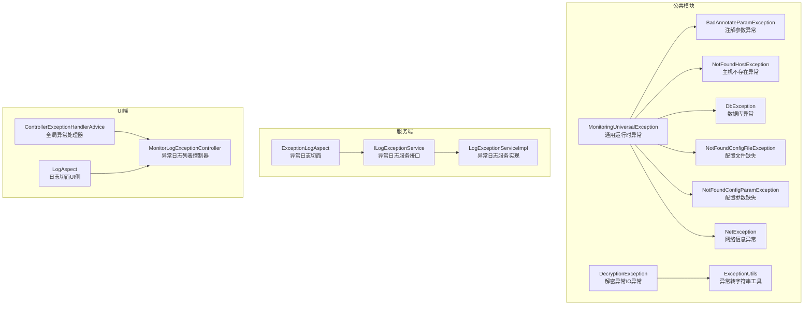
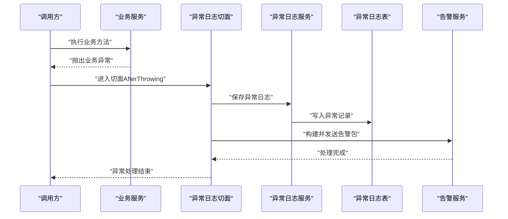
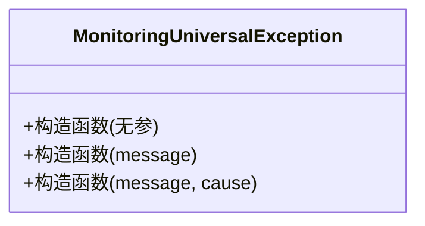
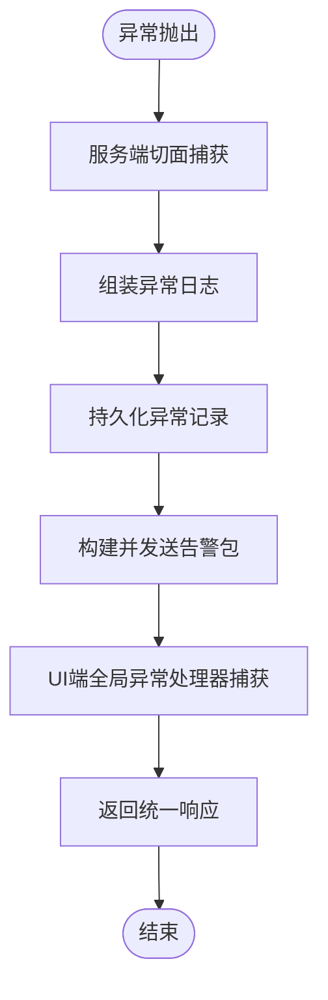
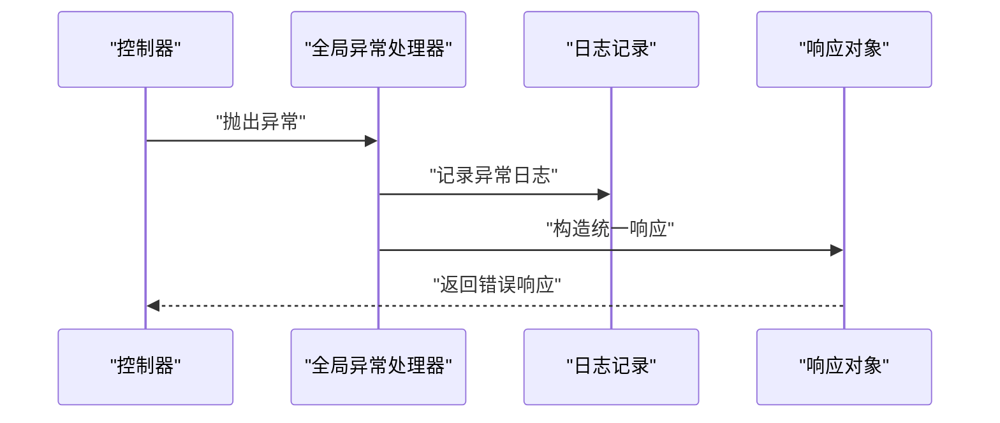
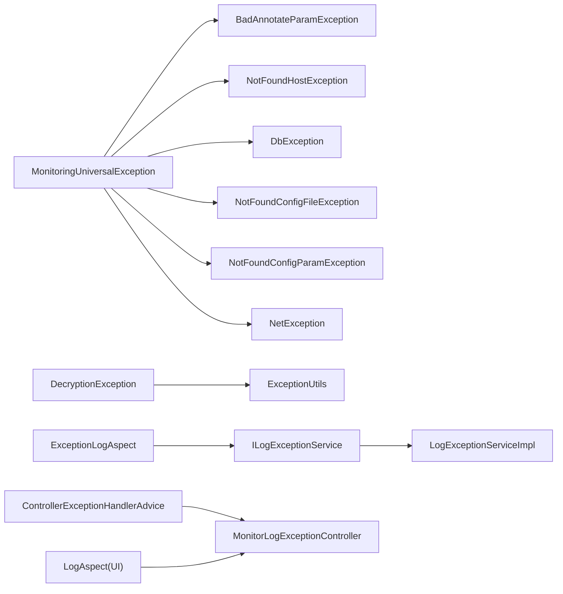

# 异常处理机制

<cite>
**本文引用的文件**
- [MonitoringUniversalException.java](file://phoenix-common/phoenix-common-core/src/main/java/com/gitee/pifeng/monitoring/common/exception/MonitoringUniversalException.java)
- [BadAnnotateParamException.java](file://phoenix-common/phoenix-common-core/src/main/java/com/gitee/pifeng/monitoring/common/exception/BadAnnotateParamException.java)
- [NotFoundHostException.java](file://phoenix-common/phoenix-common-core/src/main/java/com/gitee/pifeng/monitoring/common/exception/NotFoundHostException.java)
- [DbException.java](file://phoenix-common/phoenix-common-core/src/main/java/com/gitee/pifeng/monitoring/common/exception/DbException.java)
- [NotFoundConfigFileException.java](file://phoenix-common/phoenix-common-core/src/main/java/com/gitee/pifeng/monitoring/common/exception/NotFoundConfigFileException.java)
- [NotFoundConfigParamException.java](file://phoenix-common/phoenix-common-core/src/main/java/com/gitee/pifeng/monitoring/common/exception/NotFoundConfigParamException.java)
- [NetException.java](file://phoenix-common/phoenix-common-core/src/main/java/com/gitee/pifeng/monitoring/common/exception/NetException.java)
- [DecryptionException.java](file://phoenix-common/phoenix-common-core/src/main/java/com/gitee/pifeng/monitoring/common/exception/DecryptionException.java)
- [ExceptionLogAspect.java](file://phoenix-server/src/main/java/com/gitee/pifeng/monitoring/server/business/server/component/ExceptionLogAspect.java)
- [ILogExceptionService.java](file://phoenix-server/src/main/java/com/gitee/pifeng/monitoring/server/business/server/service/ILogExceptionService.java)
- [LogExceptionServiceImpl.java](file://phoenix-server/src/main/java/com/gitee/pifeng/monitoring/server/business/server/service/impl/LogExceptionServiceImpl.java)
- [ControllerExceptionHandlerAdvice.java](file://phoenix-ui/src/main/java/com/gitee/pifeng/monitoring/ui/business/web/component/ControllerExceptionHandlerAdvice.java)
- [MonitorLogExceptionController.java](file://phoenix-ui/src/main/java/com/gitee/pifeng/monitoring/ui/business/web/controller/MonitorLogExceptionController.java)
- [LogAspect.java](file://phoenix-ui/src/main/java/com/gitee/pifeng/monitoring/ui/business/web/component/LogAspect.java)
- [ExceptionUtils.java](file://phoenix-common/phoenix-common-core/src/main/java/com/gitee/pifeng/monitoring/common/util/ExceptionUtils.java)
- [AlarmReasonEnums.java](file://phoenix-common/phoenix-common-core/src/main/java/com/gitee/pifeng/monitoring/common/constant/alarm/AlarmReasonEnums.java)
- [LanguageTypeConstants.java](file://phoenix-common/phoenix-common-core/src/main/java/com/gitee/pifeng/monitoring/common/constant/LanguageTypeConstants.java)
- [WebResponseConstants.java](file://phoenix-ui/src/main/java/com/gitee/pifeng/monitoring/ui/constant/WebResponseConstants.java)
- [VerificationCodeException.java](file://phoenix-ui/src/main/java/com/gitee/pifeng/monitoring/ui/exception/VerificationCodeException.java)
- [monitoring-dev.properties](file://phoenix-server/src/main/resources/monitoring-dev.properties)
- [monitoring-prod.properties](file://phoenix-server/src/main/resources/monitoring-prod.properties)
</cite>

## 目录
1. [简介](#简介)
2. [项目结构](#项目结构)
3. [核心组件](#核心组件)
4. [架构总览](#架构总览)
5. [详细组件分析](#详细组件分析)
6. [依赖分析](#依赖分析)
7. [性能考量](#性能考量)
8. [故障排查指南](#故障排查指南)
9. [结论](#结论)
10. [附录](#附录)

## 简介
本文件系统性梳理Phoenix监控平台的异常处理机制，围绕通用异常MonitoringUniversalException展开，覆盖异常继承体系、常见业务异常类型（如参数注解异常、主机不存在异常、数据库异常等）、异常传播与捕获策略、统一异常处理（全局异常处理器、异常日志记录与告警）、最佳实践与测试调试建议。文档旨在帮助开发者快速理解并正确使用异常体系，提升系统稳定性与可观测性。

## 项目结构
异常处理涉及三个层面：
- 通用异常与工具：位于公共模块，定义通用异常基类与异常工具
- 服务端异常记录与告警：通过切面记录异常并落库，同时触发告警
- UI端全局异常捕获：对Web控制器异常进行统一返回

图表来源
- [MonitoringUniversalException.java:11-30](file://phoenix-common/phoenix-common-core/src/main/java/com/gitee/pifeng/monitoring/common/exception/MonitoringUniversalException.java#L11-L30)
- [BadAnnotateParamException.java:11-26](file://phoenix-common/phoenix-common-core/src/main/java/com/gitee/pifeng/monitoring/common/exception/BadAnnotateParamException.java#L11-L26)
- [NotFoundHostException.java:11-26](file://phoenix-common/phoenix-common-core/src/main/java/com/gitee/pifeng/monitoring/common/exception/NotFoundHostException.java#L11-L26)
- [DbException.java:11-26](file://phoenix-common/phoenix-common-core/src/main/java/com/gitee/pifeng/monitoring/common/exception/DbException.java#L11-L26)
- [NotFoundConfigFileException.java:11-26](file://phoenix-common/phoenix-common-core/src/main/java/com/gitee/pifeng/monitoring/common/exception/NotFoundConfigFileException.java#L11-L26)
- [NotFoundConfigParamException.java:11-26](file://phoenix-common/phoenix-common-core/src/main/java/com/gitee/pifeng/monitoring/common/exception/NotFoundConfigParamException.java#L11-L26)
- [NetException.java:11-22](file://phoenix-common/phoenix-common-core/src/main/java/com/gitee/pifeng/monitoring/common/exception/NetException.java#L11-L22)
- [DecryptionException.java:13-28](file://phoenix-common/phoenix-common-core/src/main/java/com/gitee/pifeng/monitoring/common/exception/DecryptionException.java#L13-L28)
- [ExceptionLogAspect.java:48-223](file://phoenix-server/src/main/java/com/gitee/pifeng/monitoring/server/business/server/component/ExceptionLogAspect.java#L48-L223)
- [ILogExceptionService.java:14-16](file://phoenix-server/src/main/java/com/gitee/pifeng/monitoring/server/business/server/service/ILogExceptionService.java#L14-L16)
- [LogExceptionServiceImpl.java:18-20](file://phoenix-server/src/main/java/com/gitee/pifeng/monitoring/server/business/server/service/impl/LogExceptionServiceImpl.java#L18-L20)
- [ControllerExceptionHandlerAdvice.java:20-43](file://phoenix-ui/src/main/java/com/gitee/pifeng/monitoring/ui/business/web/component/ControllerExceptionHandlerAdvice.java#L20-L43)
- [MonitorLogExceptionController.java:31-74](file://phoenix-ui/src/main/java/com/gitee/pifeng/monitoring/ui/business/web/controller/MonitorLogExceptionController.java#L31-L74)
- [LogAspect.java:233-256](file://phoenix-ui/src/main/java/com/gitee/pifeng/monitoring/ui/business/web/component/LogAspect.java#L233-L256)
- [ExceptionUtils.java:36-42](file://phoenix-common/phoenix-common-core/src/main/java/com/gitee/pifeng/monitoring/common/util/ExceptionUtils.java#L36-L42)

章节来源
- [MonitoringUniversalException.java:11-30](file://phoenix-common/phoenix-common-core/src/main/java/com/gitee/pifeng/monitoring/common/exception/MonitoringUniversalException.java#L11-L30)
- [ExceptionLogAspect.java:48-223](file://phoenix-server/src/main/java/com/gitee/pifeng/monitoring/server/business/server/component/ExceptionLogAspect.java#L48-L223)
- [ControllerExceptionHandlerAdvice.java:20-43](file://phoenix-ui/src/main/java/com/gitee/pifeng/monitoring/ui/business/web/component/ControllerExceptionHandlerAdvice.java#L20-L43)

## 核心组件
- 通用异常基类：提供标准构造函数，支持message与cause，便于异常链维护
- 业务异常子类：按领域划分，如注解参数、主机不存在、数据库、配置缺失、网络、解密等
- 异常工具：提供堆栈转字符串能力，便于日志与告警展示
- 统一异常处理：UI端@RestControllerAdvice统一捕获异常并返回标准化结果
- 异常日志与告警：服务端切面AfterThrowing捕获异常，记录到数据库并触发告警

章节来源
- [MonitoringUniversalException.java:11-30](file://phoenix-common/phoenix-common-core/src/main/java/com/gitee/pifeng/monitoring/common/exception/MonitoringUniversalException.java#L11-L30)
- [ExceptionUtils.java:36-42](file://phoenix-common/phoenix-common-core/src/main/java/com/gitee/pifeng/monitoring/common/util/ExceptionUtils.java#L36-L42)
- [ControllerExceptionHandlerAdvice.java:20-43](file://phoenix-ui/src/main/java/com/gitee/pifeng/monitoring/ui/business/web/component/ControllerExceptionHandlerAdvice.java#L20-L43)
- [ExceptionLogAspect.java:48-223](file://phoenix-server/src/main/java/com/gitee/pifeng/monitoring/server/business/server/component/ExceptionLogAspect.java#L48-L223)

## 架构总览
异常处理贯穿“异常抛出—异常捕获—日志记录—告警—前端统一返回”的闭环流程。服务端通过切面拦截异常，组装异常日志与告警包，持久化后通知；UI端通过全局异常处理器统一返回错误信息，保证用户体验一致。

图表来源
- [ExceptionLogAspect.java:48-223](file://phoenix-server/src/main/java/com/gitee/pifeng/monitoring/server/business/server/component/ExceptionLogAspect.java#L48-L223)
- [ILogExceptionService.java:14-16](file://phoenix-server/src/main/java/com/gitee/pifeng/monitoring/server/business/server/service/ILogExceptionService.java#L14-L16)
- [LogExceptionServiceImpl.java:18-20](file://phoenix-server/src/main/java/com/gitee/pifeng/monitoring/server/business/server/service/impl/LogExceptionServiceImpl.java#L18-L20)

## 详细组件分析

### 通用异常MonitoringUniversalException
- 设计理念：作为所有业务异常的父类，统一异常行为，支持message与cause，便于异常链传递
- 关键点：提供多参构造，确保上层可携带原始异常，利于定位根因
- 使用场景：作为业务异常的基类，避免直接使用JDK异常污染业务语义

图表来源
- [MonitoringUniversalException.java:11-30](file://phoenix-common/phoenix-common-core/src/main/java/com/gitee/pifeng/monitoring/common/exception/MonitoringUniversalException.java#L11-L30)

章节来源
- [MonitoringUniversalException.java:11-30](file://phoenix-common/phoenix-common-core/src/main/java/com/gitee/pifeng/monitoring/common/exception/MonitoringUniversalException.java#L11-L30)

### 业务异常类型与处理逻辑

#### 参数注解异常BadAnnotateParamException
- 场景：注解参数非法或缺失导致的异常
- 处理：继承通用异常，保持与通用异常一致的行为与日志风格

章节来源
- [BadAnnotateParamException.java:11-26](file://phoenix-common/phoenix-common-core/src/main/java/com/gitee/pifeng/monitoring/common/exception/BadAnnotateParamException.java#L11-L26)

#### 主机不存在异常NotFoundHostException
- 场景：无法解析或定位目标主机
- 处理：用于标识主机不可达或配置错误，便于上层重试或提示

章节来源
- [NotFoundHostException.java:11-26](file://phoenix-common/phoenix-common-core/src/main/java/com/gitee/pifeng/monitoring/common/exception/NotFoundHostException.java#L11-L26)

#### 数据库异常DbException
- 场景：数据库连接、SQL执行、驱动等异常
- 处理：统一包装为业务异常，便于统一处理与日志记录

章节来源
- [DbException.java:11-26](file://phoenix-common/phoenix-common-core/src/main/java/com/gitee/pifeng/monitoring/common/exception/DbException.java#L11-L26)

#### 配置相关异常
- NotFoundConfigFileException：配置文件缺失
- NotFoundConfigParamException：配置参数缺失
- 处理：明确区分文件与参数两类问题，便于运维快速定位

章节来源
- [NotFoundConfigFileException.java:11-26](file://phoenix-common/phoenix-common-core/src/main/java/com/gitee/pifeng/monitoring/common/exception/NotFoundConfigFileException.java#L11-L26)
- [NotFoundConfigParamException.java:11-26](file://phoenix-common/phoenix-common-core/src/main/java/com/gitee/pifeng/monitoring/common/exception/NotFoundConfigParamException.java#L11-L26)

#### 网络异常NetException
- 场景：采集或获取网络信息失败
- 处理：继承通用异常，便于统一捕获与记录

章节来源
- [NetException.java:11-22](file://phoenix-common/phoenix-common-core/src/main/java/com/gitee/pifeng/monitoring/common/exception/NetException.java#L11-L22)

#### 解密异常DecryptionException
- 场景：解密过程发生IO错误
- 处理：继承IOException，便于与IO相关异常策略协同

章节来源
- [DecryptionException.java:13-28](file://phoenix-common/phoenix-common-core/src/main/java/com/gitee/pifeng/monitoring/common/exception/DecryptionException.java#L13-L28)

### 异常传播机制与捕获策略
- 传播路径：业务层抛出具体异常，服务端切面AfterThrowing捕获，组装日志与告警，持久化后返回；UI端@RestControllerAdvice统一捕获，返回标准化响应
- 包装与解包：通用异常支持携带cause，便于异常链传递；工具类提供堆栈转字符串，便于记录与展示
- 异常链维护：通过构造函数传递cause，保留原始异常上下文

图表来源
- [ExceptionLogAspect.java:48-223](file://phoenix-server/src/main/java/com/gitee/pifeng/monitoring/server/business/server/component/ExceptionLogAspect.java#L48-L223)
- [ControllerExceptionHandlerAdvice.java:20-43](file://phoenix-ui/src/main/java/com/gitee/pifeng/monitoring/ui/business/web/component/ControllerExceptionHandlerAdvice.java#L20-L43)

章节来源
- [ExceptionLogAspect.java:48-223](file://phoenix-server/src/main/java/com/gitee/pifeng/monitoring/server/business/server/component/ExceptionLogAspect.java#L48-L223)
- [ControllerExceptionHandlerAdvice.java:20-43](file://phoenix-ui/src/main/java/com/gitee/pifeng/monitoring/ui/business/web/component/ControllerExceptionHandlerAdvice.java#L20-L43)

### 统一异常处理机制
- 服务端：基于@Aspect的ExceptionLogAspect在方法抛出异常后记录日志并触发告警，异常日志服务接口与实现负责持久化
- UI端：@RestControllerAdvice对指定包下的控制器异常进行统一捕获，记录日志并返回标准化结果对象

图表来源
- [ControllerExceptionHandlerAdvice.java:20-43](file://phoenix-ui/src/main/java/com/gitee/pifeng/monitoring/ui/business/web/component/ControllerExceptionHandlerAdvice.java#L20-L43)

章节来源
- [ControllerExceptionHandlerAdvice.java:20-43](file://phoenix-ui/src/main/java/com/gitee/pifeng/monitoring/ui/business/web/component/ControllerExceptionHandlerAdvice.java#L20-L43)
- [MonitorLogExceptionController.java:31-74](file://phoenix-ui/src/main/java/com/gitee/pifeng/monitoring/ui/business/web/controller/MonitorLogExceptionController.java#L31-L74)

### 异常日志记录与告警
- 切面职责：AfterThrowing捕获异常，收集请求上下文、方法签名、参数、异常详情，组装异常日志实体
- 持久化：通过ILogExceptionService与LogExceptionServiceImpl写入数据库
- 告警：根据异常类型决定告警级别与原因，必要时忽略某些异常的告警以降低噪音

章节来源
- [ExceptionLogAspect.java:48-223](file://phoenix-server/src/main/java/com/gitee/pifeng/monitoring/server/business/server/component/ExceptionLogAspect.java#L48-L223)
- [ILogExceptionService.java:14-16](file://phoenix-server/src/main/java/com/gitee/pifeng/monitoring/server/business/server/service/ILogExceptionService.java#L14-L16)
- [LogExceptionServiceImpl.java:18-20](file://phoenix-server/src/main/java/com/gitee/pifeng/monitoring/server/business/server/service/impl/LogExceptionServiceImpl.java#L18-L20)
- [AlarmReasonEnums.java:11-33](file://phoenix-common/phoenix-common-core/src/main/java/com/gitee/pifeng/monitoring/common/constant/alarm/AlarmReasonEnums.java#L11-L33)

### 国际化与用户体验
- 国际化支持：语言类型常量表明系统语言维度，便于后续扩展多语言错误文案
- 用户体验：UI端统一返回错误信息，结合前端框架进行友好提示；服务端记录详细日志便于排查

章节来源
- [LanguageTypeConstants.java:11-29](file://phoenix-common/phoenix-common-core/src/main/java/com/gitee/pifeng/monitoring/common/constant/LanguageTypeConstants.java#L11-L29)
- [ControllerExceptionHandlerAdvice.java:20-43](file://phoenix-ui/src/main/java/com/gitee/pifeng/monitoring/ui/business/web/component/ControllerExceptionHandlerAdvice.java#L20-L43)

### 安全认证相关异常
- VerificationCodeException：基于Spring Security的认证异常，携带错误码与消息，便于前端展示与审计

章节来源
- [VerificationCodeException.java:15-63](file://phoenix-ui/src/main/java/com/gitee/pifeng/monitoring/ui/exception/VerificationCodeException.java#L15-L63)

## 依赖分析
- 异常基类与子类：所有业务异常均依赖通用异常，形成清晰的继承层次
- 切面与服务：服务端切面依赖异常日志服务接口与实现，实现日志记录与告警
- UI端：全局异常处理器依赖访问对象工具与响应封装对象，保证统一输出

图表来源
- [MonitoringUniversalException.java:11-30](file://phoenix-common/phoenix-common-core/src/main/java/com/gitee/pifeng/monitoring/common/exception/MonitoringUniversalException.java#L11-L30)
- [BadAnnotateParamException.java:11-26](file://phoenix-common/phoenix-common-core/src/main/java/com/gitee/pifeng/monitoring/common/exception/BadAnnotateParamException.java#L11-L26)
- [NotFoundHostException.java:11-26](file://phoenix-common/phoenix-common-core/src/main/java/com/gitee/pifeng/monitoring/common/exception/NotFoundHostException.java#L11-L26)
- [DbException.java:11-26](file://phoenix-common/phoenix-common-core/src/main/java/com/gitee/pifeng/monitoring/common/exception/DbException.java#L11-L26)
- [NotFoundConfigFileException.java:11-26](file://phoenix-common/phoenix-common-core/src/main/java/com/gitee/pifeng/monitoring/common/exception/NotFoundConfigFileException.java#L11-L26)
- [NotFoundConfigParamException.java:11-26](file://phoenix-common/phoenix-common-core/src/main/java/com/gitee/pifeng/monitoring/common/exception/NotFoundConfigParamException.java#L11-L26)
- [NetException.java:11-22](file://phoenix-common/phoenix-common-core/src/main/java/com/gitee/pifeng/monitoring/common/exception/NetException.java#L11-L22)
- [DecryptionException.java:13-28](file://phoenix-common/phoenix-common-core/src/main/java/com/gitee/pifeng/monitoring/common/exception/DecryptionException.java#L13-L28)
- [ExceptionLogAspect.java:48-223](file://phoenix-server/src/main/java/com/gitee/pifeng/monitoring/server/business/server/component/ExceptionLogAspect.java#L48-L223)
- [ILogExceptionService.java:14-16](file://phoenix-server/src/main/java/com/gitee/pifeng/monitoring/server/business/server/service/ILogExceptionService.java#L14-L16)
- [LogExceptionServiceImpl.java:18-20](file://phoenix-server/src/main/java/com/gitee/pifeng/monitoring/server/business/server/service/impl/LogExceptionServiceImpl.java#L18-L20)
- [ControllerExceptionHandlerAdvice.java:20-43](file://phoenix-ui/src/main/java/com/gitee/pifeng/monitoring/ui/business/web/component/ControllerExceptionHandlerAdvice.java#L20-L43)
- [MonitorLogExceptionController.java:31-74](file://phoenix-ui/src/main/java/com/gitee/pifeng/monitoring/ui/business/web/controller/MonitorLogExceptionController.java#L31-L74)
- [LogAspect.java:233-256](file://phoenix-ui/src/main/java/com/gitee/pifeng/monitoring/ui/business/web/component/LogAspect.java#L233-L256)

章节来源
- [ExceptionLogAspect.java:48-223](file://phoenix-server/src/main/java/com/gitee/pifeng/monitoring/server/business/server/component/ExceptionLogAspect.java#L48-L223)
- [ControllerExceptionHandlerAdvice.java:20-43](file://phoenix-ui/src/main/java/com/gitee/pifeng/monitoring/ui/business/web/component/ControllerExceptionHandlerAdvice.java#L20-L43)

## 性能考量
- 切面开销：AfterThrowing切面仅在异常发生时触发，对正常路径无影响
- 日志与告警：异步化与批量写入策略可进一步降低对主流程的影响
- 堆栈转换：异常转字符串仅在记录日志时使用，避免在高频路径重复计算

## 故障排查指南
- 查看异常日志：通过UI端异常日志列表页面查看异常详情与上下文
- 定位异常来源：结合堆栈字符串与请求参数，快速定位问题方法与输入
- 告警核对：确认告警级别与原因，必要时调整忽略策略
- 配置检查：核对服务端配置文件中的通信与超时参数，避免误判为异常

章节来源
- [MonitorLogExceptionController.java:31-74](file://phoenix-ui/src/main/java/com/gitee/pifeng/monitoring/ui/business/web/controller/MonitorLogExceptionController.java#L31-L74)
- [ExceptionLogAspect.java:48-223](file://phoenix-server/src/main/java/com/gitee/pifeng/monitoring/server/business/server/component/ExceptionLogAspect.java#L48-L223)
- [monitoring-dev.properties:10-17](file://phoenix-server/src/main/resources/monitoring-dev.properties#L10-L17)
- [monitoring-prod.properties:10-17](file://phoenix-server/src/main/resources/monitoring-prod.properties#L10-L17)

## 结论
Phoenix的异常处理机制以MonitoringUniversalException为核心，配合细粒度的业务异常类型、统一的日志记录与告警、以及UI端的全局异常处理，形成了完整的异常治理闭环。遵循该机制可显著提升系统的可观测性与可维护性。

## 附录

### 异常分类与最佳实践
- 分类原则：按业务域细分异常类型，避免过度泛化
- 错误码设计：为关键异常引入稳定错误码，便于前后端约定与自动化处理
- 用户体验：统一错误返回格式，提供可读性强的提示信息
- 国际化：预留语言常量，逐步扩展多语言文案
- 测试策略：针对异常分支编写单元测试与集成测试，覆盖异常抛出、日志记录与告警发送

章节来源
- [WebResponseConstants.java:24-59](file://phoenix-ui/src/main/java/com/gitee/pifeng/monitoring/ui/constant/WebResponseConstants.java#L24-L59)
- [LanguageTypeConstants.java:11-29](file://phoenix-common/phoenix-common-core/src/main/java/com/gitee/pifeng/monitoring/common/constant/LanguageTypeConstants.java#L11-L29)