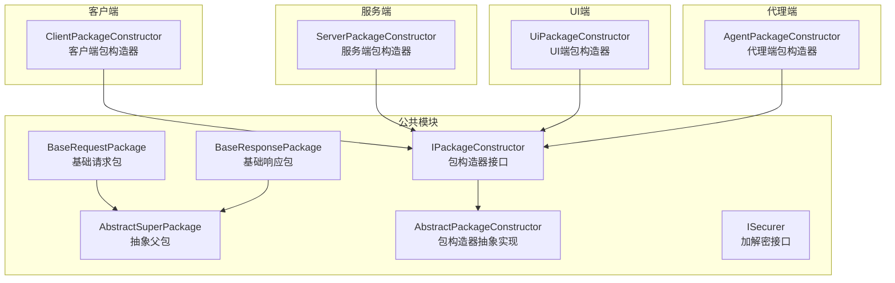
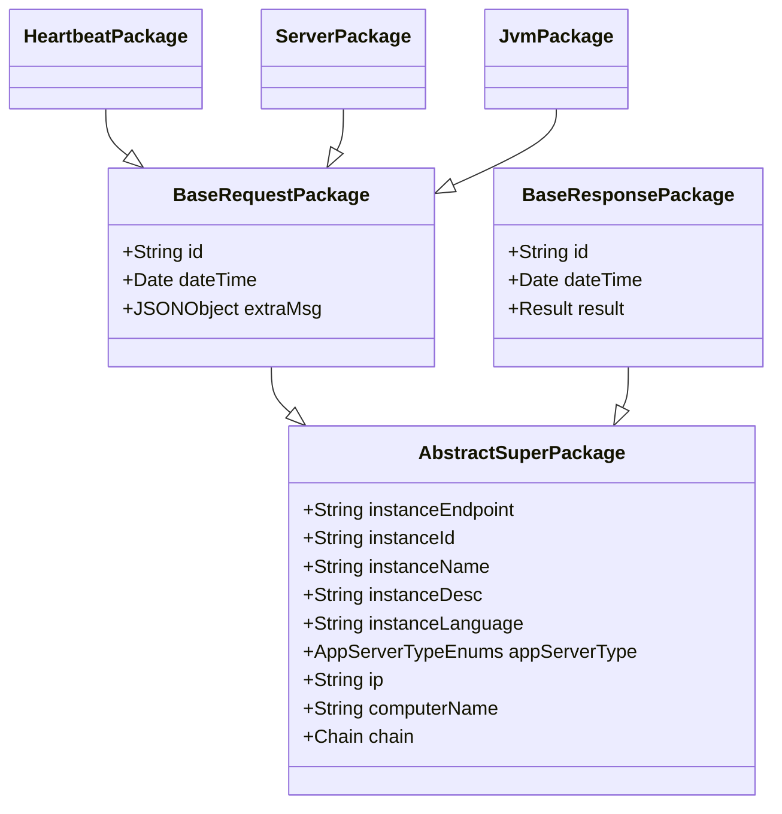
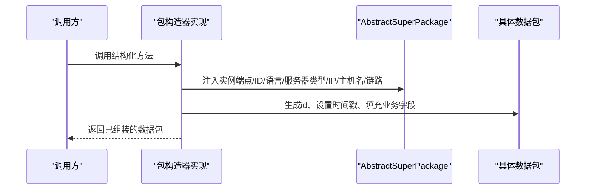
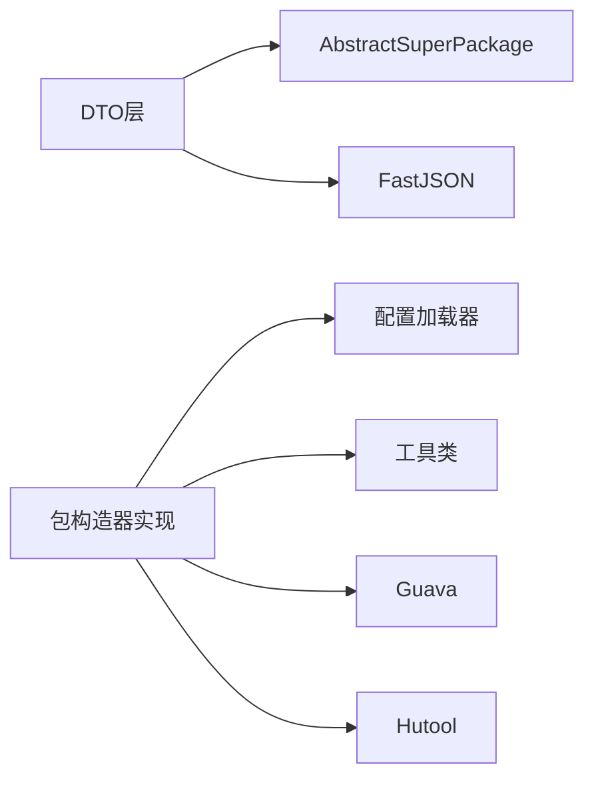
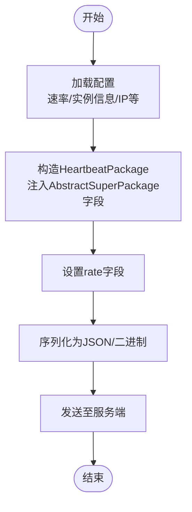

# 数据传输对象

<cite>
**本文引用的文件**
- [BaseRequestPackage.java](file://phoenix-common/phoenix-common-core/src/main/java/com/gitee/pifeng/monitoring/common/dto/BaseRequestPackage.java)
- [BaseResponsePackage.java](file://phoenix-common/phoenix-common-core/src/main/java/com/gitee/pifeng/monitoring/common/dto/BaseResponsePackage.java)
- [AbstractSuperPackage.java](file://phoenix-common/phoenix-common-core/src/main/java/com/gitee/pifeng/monitoring/common/abs/AbstractSuperPackage.java)
- [IPackageConstructor.java](file://phoenix-common/phoenix-common-core/src/main/java/com/gitee/pifeng/monitoring/common/inf/IPackageConstructor.java)
- [ISecurer.java](file://phoenix-common/phoenix-common-core/src/main/java/com/gitee/pifeng/monitoring/common/inf/ISecurer.java)
- [AbstractPackageConstructor.java](file://phoenix-common/phoenix-common-core/src/main/java/com/gitee/pifeng/monitoring/common/abs/AbstractPackageConstructor.java)
- [ClientPackageConstructor.java](file://phoenix-client/phoenix-client-core/src/main/java/com/gitee/pifeng/monitoring/plug/core/ClientPackageConstructor.java)
- [ServerPackageConstructor.java](file://phoenix-server/src/main/java/com/gitee/pifeng/monitoring/server/business/server/core/ServerPackageConstructor.java)
- [UiPackageConstructor.java](file://phoenix-ui/src/main/java/com/gitee/pifeng/monitoring/ui/core/UiPackageConstructor.java)
- [AgentPackageConstructor.java](file://phoenix-agent/src/main/java/com/gitee/pifeng/monitoring/agent/core/AgentPackageConstructor.java)
- [HeartbeatPackage.java](file://phoenix-common/phoenix-common-core/src/main/java/com/gitee/pifeng/monitoring/common/dto/HeartbeatPackage.java)
- [ServerPackage.java](file://phoenix-common/phoenix-common-core/src/main/java/com/gitee/pifeng/monitoring/common/dto/ServerPackage.java)
- [JvmPackage.java](file://phoenix-common/phoenix-common-core/src/main/java/com/gitee/pifeng/monitoring/common/dto/JvmPackage.java)
</cite>

## 目录
1. [引言](#引言)
2. [项目结构](#项目结构)
3. [核心组件](#核心组件)
4. [架构总览](#架构总览)
5. [详细组件分析](#详细组件分析)
6. [依赖关系分析](#依赖关系分析)
7. [性能考虑](#性能考虑)
8. [故障排查指南](#故障排查指南)
9. [结论](#结论)
10. [附录](#附录)

## 引言
本文件围绕Phoenix监控系统中的数据传输对象进行系统化技术文档整理，重点覆盖以下方面：
- 基础数据包：BaseRequestPackage与BaseResponsePackage的设计与职责
- 抽象基类：AbstractSuperPackage统一承载实例元数据与链路信息
- 具体包类型：HeartbeatPackage、ServerPackage、JvmPackage等的字段与用途
- 包构造器：IPackageConstructor接口与各端实现类（客户端、服务端、UI、代理端）
- 序列化与格式：JSON与二进制选择及转换策略
- 安全传输：加密、解密、签名与防重放思路
- 版本管理与兼容：版本演进与平滑升级建议
- 性能优化：压缩、批量、异步等手段

## 项目结构
Phoenix将“数据包”定义在公共模块中，采用DTO+抽象基类+包构造器的分层设计：
- DTO层：定义各类数据包模型（请求/响应、心跳、服务器、JVM等）
- 抽象层：抽象父包统一注入实例元数据与链路信息
- 构造器层：按端点实现IPackageConstructor，负责组装数据包并填充公共字段

图表来源
- [AbstractSuperPackage.java:1-72](file://phoenix-common/phoenix-common-core/src/main/java/com/gitee/pifeng/monitoring/common/abs/AbstractSuperPackage.java#L1-L72)
- [BaseRequestPackage.java:1-42](file://phoenix-common/phoenix-common-core/src/main/java/com/gitee/pifeng/monitoring/common/dto/BaseRequestPackage.java#L1-L42)
- [BaseResponsePackage.java:1-42](file://phoenix-common/phoenix-common-core/src/main/java/com/gitee/pifeng/monitoring/common/dto/BaseResponsePackage.java#L1-L42)
- [IPackageConstructor.java:1-114](file://phoenix-common/phoenix-common-core/src/main/java/com/gitee/pifeng/monitoring/common/inf/IPackageConstructor.java#L1-L114)
- [AbstractPackageConstructor.java:1-133](file://phoenix-common/phoenix-common-core/src/main/java/com/gitee/pifeng/monitoring/common/abs/AbstractPackageConstructor.java#L1-L133)
- [ClientPackageConstructor.java:1-282](file://phoenix-client/phoenix-client-core/src/main/java/com/gitee/pifeng/monitoring/plug/core/ClientPackageConstructor.java#L1-L282)
- [ServerPackageConstructor.java:1-212](file://phoenix-server/src/main/java/com/gitee/pifeng/monitoring/server/business/server/core/ServerPackageConstructor.java#L1-L212)
- [UiPackageConstructor.java:1-154](file://phoenix-ui/src/main/java/com/gitee/pifeng/monitoring/ui/core/UiPackageConstructor.java#L1-L154)
- [AgentPackageConstructor.java:1-202](file://phoenix-agent/src/main/java/com/gitee/pifeng/monitoring/agent/core/AgentPackageConstructor.java#L1-L202)

章节来源
- [BaseRequestPackage.java:1-42](file://phoenix-common/phoenix-common-core/src/main/java/com/gitee/pifeng/monitoring/common/dto/BaseRequestPackage.java#L1-L42)
- [BaseResponsePackage.java:1-42](file://phoenix-common/phoenix-common-core/src/main/java/com/gitee/pifeng/monitoring/common/dto/BaseResponsePackage.java#L1-L42)
- [AbstractSuperPackage.java:1-72](file://phoenix-common/phoenix-common-core/src/main/java/com/gitee/pifeng/monitoring/common/abs/AbstractSuperPackage.java#L1-L72)
- [IPackageConstructor.java:1-114](file://phoenix-common/phoenix-common-core/src/main/java/com/gitee/pifeng/monitoring/common/inf/IPackageConstructor.java#L1-L114)
- [AbstractPackageConstructor.java:1-133](file://phoenix-common/phoenix-common-core/src/main/java/com/gitee/pifeng/monitoring/common/abs/AbstractPackageConstructor.java#L1-L133)
- [ClientPackageConstructor.java:1-282](file://phoenix-client/phoenix-client-core/src/main/java/com/gitee/pifeng/monitoring/plug/core/ClientPackageConstructor.java#L1-L282)
- [ServerPackageConstructor.java:1-212](file://phoenix-server/src/main/java/com/gitee/pifeng/monitoring/server/business/server/core/ServerPackageConstructor.java#L1-L212)
- [UiPackageConstructor.java:1-154](file://phoenix-ui/src/main/java/com/gitee/pifeng/monitoring/ui/core/UiPackageConstructor.java#L1-L154)
- [AgentPackageConstructor.java:1-202](file://phoenix-agent/src/main/java/com/gitee/pifeng/monitoring/agent/core/AgentPackageConstructor.java#L1-L202)

## 核心组件
- 抽象父包 AbstractSuperPackage
  - 统一承载实例端点、实例ID/名称/描述、语言、应用服务器类型、IP、主机名、链路信息等
  - 为所有数据包提供一致的元数据注入能力
- 基础请求包 BaseRequestPackage
  - 扩展AbstractSuperPackage，增加id、dateTime、extraMsg（附加信息）
  - 作为请求侧通用载体，被具体业务包继承复用
- 基础响应包 BaseResponsePackage
  - 扩展AbstractSuperPackage，增加id、dateTime、result（结果封装）
  - 作为响应侧通用载体，被具体业务包继承复用
- 包构造器接口 IPackageConstructor
  - 定义结构化各类数据包的方法族（心跳、服务器、JVM、告警、基础请求/响应、下线等）
  - 采用“抽象工厂”思想，屏蔽构造细节，由各端实现类完成具体组装
- 包构造器抽象 AbstractPackageConstructor
  - 提供默认空实现，便于各端仅覆写所需方法
- 加密接口 ISecurer
  - 定义字符串与字节数组的加解密契约，为后续安全传输提供扩展点

章节来源
- [AbstractSuperPackage.java:19-71](file://phoenix-common/phoenix-common-core/src/main/java/com/gitee/pifeng/monitoring/common/abs/AbstractSuperPackage.java#L19-L71)
- [BaseRequestPackage.java:24-41](file://phoenix-common/phoenix-common-core/src/main/java/com/gitee/pifeng/monitoring/common/dto/BaseRequestPackage.java#L24-L41)
- [BaseResponsePackage.java:24-41](file://phoenix-common/phoenix-common-core/src/main/java/com/gitee/pifeng/monitoring/common/dto/BaseResponsePackage.java#L24-L41)
- [IPackageConstructor.java:22-113](file://phoenix-common/phoenix-common-core/src/main/java/com/gitee/pifeng/monitoring/common/inf/IPackageConstructor.java#L22-L113)
- [AbstractPackageConstructor.java:20-132](file://phoenix-common/phoenix-common-core/src/main/java/com/gitee/pifeng/monitoring/common/abs/AbstractPackageConstructor.java#L20-L132)
- [ISecurer.java:13-65](file://phoenix-common/phoenix-common-core/src/main/java/com/gitee/pifeng/monitoring/common/inf/ISecurer.java#L13-L65)

## 架构总览
各端通过各自的包构造器实现，将采集到的监控数据封装为标准数据包，并自动注入统一的元数据与链路信息。

图表来源
- [AbstractSuperPackage.java:19-71](file://phoenix-common/phoenix-common-core/src/main/java/com/gitee/pifeng/monitoring/common/abs/AbstractSuperPackage.java#L19-L71)
- [BaseRequestPackage.java:24-41](file://phoenix-common/phoenix-common-core/src/main/java/com/gitee/pifeng/monitoring/common/dto/BaseRequestPackage.java#L24-L41)
- [BaseResponsePackage.java:24-41](file://phoenix-common/phoenix-common-core/src/main/java/com/gitee/pifeng/monitoring/common/dto/BaseResponsePackage.java#L24-L41)
- [HeartbeatPackage.java:20-27](file://phoenix-common/phoenix-common-core/src/main/java/com/gitee/pifeng/monitoring/common/dto/HeartbeatPackage.java#L20-L27)
- [ServerPackage.java:21-33](file://phoenix-common/phoenix-common-core/src/main/java/com/gitee/pifeng/monitoring/common/dto/ServerPackage.java#L21-L33)
- [JvmPackage.java:21-33](file://phoenix-common/phoenix-common-core/src/main/java/com/gitee/pifeng/monitoring/common/dto/JvmPackage.java#L21-L33)

## 详细组件分析

### 基础数据包：BaseRequestPackage 与 BaseResponsePackage
- 设计要点
  - 统一携带请求/响应标识id与时间戳，便于追踪与排序
  - 请求包支持附加信息extraMsg，便于扩展字段或上下文
  - 响应包以Result封装返回状态，便于上层统一处理
- 适用场景
  - 请求侧：心跳、服务器、JVM、告警等上报
  - 响应侧：服务端对请求的统一应答

章节来源
- [BaseRequestPackage.java:24-41](file://phoenix-common/phoenix-common-core/src/main/java/com/gitee/pifeng/monitoring/common/dto/BaseRequestPackage.java#L24-L41)
- [BaseResponsePackage.java:24-41](file://phoenix-common/phoenix-common-core/src/main/java/com/gitee/pifeng/monitoring/common/dto/BaseResponsePackage.java#L24-L41)

### 抽象父包：AbstractSuperPackage
- 设计要点
  - 将实例元数据（端点、ID、名称、描述、语言、服务器类型）与网络元信息（IP、主机名）集中管理
  - 链路信息（instanceChain、networkChain、timeChain）用于追踪数据包流转路径
- 作用
  - 保证跨端一致性，避免重复注入
  - 为审计与排障提供可追溯能力

章节来源
- [AbstractSuperPackage.java:24-71](file://phoenix-common/phoenix-common-core/src/main/java/com/gitee/pifeng/monitoring/common/abs/AbstractSuperPackage.java#L24-L71)

### 包构造器：IPackageConstructor 与实现类
- 接口职责
  - 定义结构化各类数据包的标准入口，屏蔽构造细节
- 实现策略
  - 各端继承AbstractPackageConstructor，仅覆写所需方法
  - 在构造过程中统一注入AbstractSuperPackage字段、生成id、设置时间戳、填充链路信息
- 端点差异
  - 客户端：根据配置加载率、监控类型等
  - 服务端：面向请求侧的响应包构造
  - UI端：面向管理端的基础请求包构造
  - 代理端：面向被监控应用的请求包构造

图表来源
- [ClientPackageConstructor.java:122-142](file://phoenix-client/phoenix-client-core/src/main/java/com/gitee/pifeng/monitoring/plug/core/ClientPackageConstructor.java#L122-L142)
- [ServerPackageConstructor.java:96-116](file://phoenix-server/src/main/java/com/gitee/pifeng/monitoring/server/business/server/core/ServerPackageConstructor.java#L96-L116)
- [UiPackageConstructor.java:89-109](file://phoenix-ui/src/main/java/com/gitee/pifeng/monitoring/ui/core/UiPackageConstructor.java#L89-L109)
- [AgentPackageConstructor.java:115-135](file://phoenix-agent/src/main/java/com/gitee/pifeng/monitoring/agent/core/AgentPackageConstructor.java#L115-L135)

章节来源
- [IPackageConstructor.java:22-113](file://phoenix-common/phoenix-common-core/src/main/java/com/gitee/pifeng/monitoring/common/inf/IPackageConstructor.java#L22-L113)
- [AbstractPackageConstructor.java:20-132](file://phoenix-common/phoenix-common-core/src/main/java/com/gitee/pifeng/monitoring/common/abs/AbstractPackageConstructor.java#L20-L132)
- [ClientPackageConstructor.java:122-142](file://phoenix-client/phoenix-client-core/src/main/java/com/gitee/pifeng/monitoring/plug/core/ClientPackageConstructor.java#L122-L142)
- [ServerPackageConstructor.java:96-116](file://phoenix-server/src/main/java/com/gitee/pifeng/monitoring/server/business/server/core/ServerPackageConstructor.java#L96-L116)
- [UiPackageConstructor.java:89-109](file://phoenix-ui/src/main/java/com/gitee/pifeng/monitoring/ui/core/UiPackageConstructor.java#L89-L109)
- [AgentPackageConstructor.java:115-135](file://phoenix-agent/src/main/java/com/gitee/pifeng/monitoring/agent/core/AgentPackageConstructor.java#L115-L135)

### 具体数据包类型
- HeartbeatPackage（心跳包）
  - 继承BaseRequestPackage，新增rate字段表示心跳周期
  - 由客户端构造器按配置生成
- ServerPackage（服务器包）
  - 继承BaseRequestPackage，包含Server实体与rate字段
  - 由客户端构造器按配置生成
- JvmPackage（JVM包）
  - 继承BaseRequestPackage，包含Jvm实体与rate字段
  - 由客户端构造器按配置生成

章节来源
- [HeartbeatPackage.java:20-27](file://phoenix-common/phoenix-common-core/src/main/java/com/gitee/pifeng/monitoring/common/dto/HeartbeatPackage.java#L20-L27)
- [ServerPackage.java:21-33](file://phoenix-common/phoenix-common-core/src/main/java/com/gitee/pifeng/monitoring/common/dto/ServerPackage.java#L21-L33)
- [JvmPackage.java:21-33](file://phoenix-common/phoenix-common-core/src/main/java/com/gitee/pifeng/monitoring/common/dto/JvmPackage.java#L21-L33)
- [ClientPackageConstructor.java:206-214](file://phoenix-client/phoenix-client-core/src/main/java/com/gitee/pifeng/monitoring/plug/core/ClientPackageConstructor.java#L206-L214)
- [ClientPackageConstructor.java:249-258](file://phoenix-client/phoenix-client-core/src/main/java/com/gitee/pifeng/monitoring/plug/core/ClientPackageConstructor.java#L249-L258)
- [ClientPackageConstructor.java:271-280](file://phoenix-client/phoenix-client-core/src/main/java/com/gitee/pifeng/monitoring/plug/core/ClientPackageConstructor.java#L271-L280)

### 序列化与格式策略
- JSON格式
  - 请求包中的extraMsg采用JSONObject存储，便于动态扩展
  - 响应包中的result采用Result封装，便于统一序列化
- 二进制格式
  - 可基于包内字段进行二进制编码（如id、dateTime、rate、实体字段），减少体积
  - 建议在传输层统一编解码策略，保持与JSON的等价语义
- 转换策略
  - 优先使用JSON便于调试与可观测性
  - 对高频小包可考虑二进制以降低带宽与CPU开销
  - 通过统一的编解码器在构造器与发送器之间解耦

章节来源
- [BaseRequestPackage.java:39](file://phoenix-common/phoenix-common-core/src/main/java/com/gitee/pifeng/monitoring/common/dto/BaseRequestPackage.java#L39)
- [BaseResponsePackage.java:39](file://phoenix-common/phoenix-common-core/src/main/java/com/gitee/pifeng/monitoring/common/dto/BaseResponsePackage.java#L39)
- [ClientPackageConstructor.java:156-166](file://phoenix-client/phoenix-client-core/src/main/java/com/gitee/pifeng/monitoring/plug/core/ClientPackageConstructor.java#L156-L166)
- [ServerPackageConstructor.java:130-139](file://phoenix-server/src/main/java/com/gitee/pifeng/monitoring/server/business/server/core/ServerPackageConstructor.java#L130-L139)
- [UiPackageConstructor.java:123-132](file://phoenix-ui/src/main/java/com/gitee/pifeng/monitoring/ui/core/UiPackageConstructor.java#L123-L132)
- [AgentPackageConstructor.java:149-158](file://phoenix-agent/src/main/java/com/gitee/pifeng/monitoring/agent/core/AgentPackageConstructor.java#L149-L158)

### 安全传输机制
- 加密与解密
  - ISecurer接口定义字符串与字节数组的加解密方法，可用于对敏感字段或整个包体进行保护
  - 建议对关键字段（如鉴权令牌、业务敏感数据）单独加密
- 数字签名
  - 可基于包体摘要与私钥生成签名，接收端使用公钥验证完整性与来源
- 防重放攻击
  - 在包头引入nonce与timestamp，服务端校验时间窗口与nonce唯一性
  - 结合会话ID与限流策略，降低重放风险
- 传输层安全
  - 建议在HTTP/TCP层启用TLS，结合证书固定与SNI校验

章节来源
- [ISecurer.java:13-65](file://phoenix-common/phoenix-common-core/src/main/java/com/gitee/pifeng/monitoring/common/inf/ISecurer.java#L13-L65)

### 版本管理与兼容
- 版本字段
  - 建议在AbstractSuperPackage或包头增加version字段，用于标识协议版本
- 向后兼容
  - 新增字段采用可选策略，旧端忽略未知字段
  - 对于破坏性变更，提供过渡期双格式支持与灰度发布
- 平滑升级
  - 通过配置开关控制新旧格式切换
  - 提供迁移工具与回滚策略

章节来源
- [AbstractSuperPackage.java:24-71](file://phoenix-common/phoenix-common-core/src/main/java/com/gitee/pifeng/monitoring/common/abs/AbstractSuperPackage.java#L24-L71)

## 依赖关系分析
- 组件耦合
  - DTO层仅依赖抽象父类，低耦合高内聚
  - 包构造器依赖配置加载器与工具类，但通过接口隔离外部依赖
- 外部依赖
  - FastJSON用于JSON处理
  - Guava用于集合与链路信息构建
  - Hutool用于ID生成与工具方法
- 潜在循环依赖
  - 当前结构清晰，未见循环导入

图表来源
- [ClientPackageConstructor.java:14-26](file://phoenix-client/phoenix-client-core/src/main/java/com/gitee/pifeng/monitoring/plug/core/ClientPackageConstructor.java#L14-L26)
- [ServerPackageConstructor.java:15-28](file://phoenix-server/src/main/java/com/gitee/pifeng/monitoring/server/business/server/core/ServerPackageConstructor.java#L15-L28)
- [UiPackageConstructor.java:11-19](file://phoenix-ui/src/main/java/com/gitee/pifeng/monitoring/ui/core/UiPackageConstructor.java#L11-L19)
- [AgentPackageConstructor.java:13-26](file://phoenix-agent/src/main/java/com/gitee/pifeng/monitoring/agent/core/AgentPackageConstructor.java#L13-L26)

章节来源
- [ClientPackageConstructor.java:14-26](file://phoenix-client/phoenix-client-core/src/main/java/com/gitee/pifeng/monitoring/plug/core/ClientPackageConstructor.java#L14-L26)
- [ServerPackageConstructor.java:15-28](file://phoenix-server/src/main/java/com/gitee/pifeng/monitoring/server/business/server/core/ServerPackageConstructor.java#L15-L28)
- [UiPackageConstructor.java:11-19](file://phoenix-ui/src/main/java/com/gitee/pifeng/monitoring/ui/core/UiPackageConstructor.java#L11-L19)
- [AgentPackageConstructor.java:13-26](file://phoenix-agent/src/main/java/com/gitee/pifeng/monitoring/agent/core/AgentPackageConstructor.java#L13-L26)

## 性能考虑
- 压缩
  - 对大体量包（如JVM/服务器快照）启用Gzip/LZ4等压缩，降低带宽占用
- 批量传输
  - 将多个小包合并为批次，减少握手与序列化开销
- 异步处理
  - 发送线程池与背压控制，避免阻塞业务线程
- 编解码优化
  - 优先使用二进制协议，减少GC与反射开销
  - 对热点字段采用定长编码或缓存策略

## 故障排查指南
- 常见问题
  - 链路信息缺失：检查构造器是否正确注入instanceChain/networkChain/timeChain
  - 时间戳异常：确认系统时间同步与时区配置
  - 字段为空：核对配置加载器与默认值设置
- 定位手段
  - 通过包id与时间戳进行端到端追踪
  - 开启传输层日志与序列化前后对比
- 修复建议
  - 补充默认值与边界检查
  - 增加重试与降级策略

章节来源
- [ClientPackageConstructor.java:80-109](file://phoenix-client/phoenix-client-core/src/main/java/com/gitee/pifeng/monitoring/plug/core/ClientPackageConstructor.java#L80-L109)
- [ServerPackageConstructor.java:54-83](file://phoenix-server/src/main/java/com/gitee/pifeng/monitoring/server/business/server/core/ServerPackageConstructor.java#L54-L83)
- [UiPackageConstructor.java:47-76](file://phoenix-ui/src/main/java/com/gitee/pifeng/monitoring/ui/core/UiPackageConstructor.java#L47-L76)
- [AgentPackageConstructor.java:73-102](file://phoenix-agent/src/main/java/com/gitee/pifeng/monitoring/agent/core/AgentPackageConstructor.java#L73-L102)

## 结论
Phoenix的数据传输对象体系以“抽象父包+包构造器+DTO模型”为核心，实现了跨端一致的元数据注入与标准化数据包结构。通过接口化的包构造器与可扩展的加解密接口，系统具备良好的可维护性与安全性扩展空间。配合合理的序列化策略、版本管理与性能优化手段，可在保证稳定性的同时满足高并发场景下的实时监控需求。

## 附录
- 关键流程图：心跳包构造与下发

图表来源
- [ClientPackageConstructor.java:206-214](file://phoenix-client/phoenix-client-core/src/main/java/com/gitee/pifeng/monitoring/plug/core/ClientPackageConstructor.java#L206-L214)
- [AbstractSuperPackage.java:24-71](file://phoenix-common/phoenix-common-core/src/main/java/com/gitee/pifeng/monitoring/common/abs/AbstractSuperPackage.java#L24-L71)