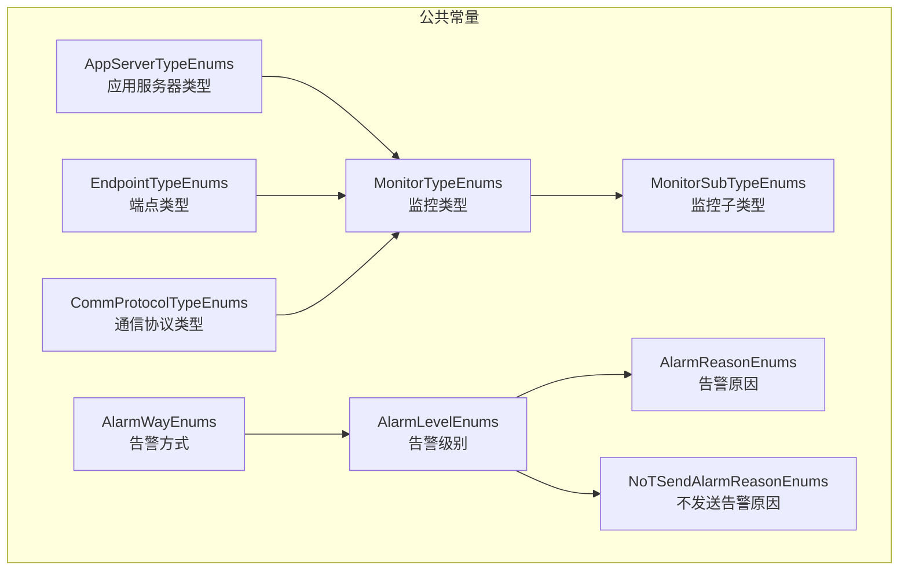
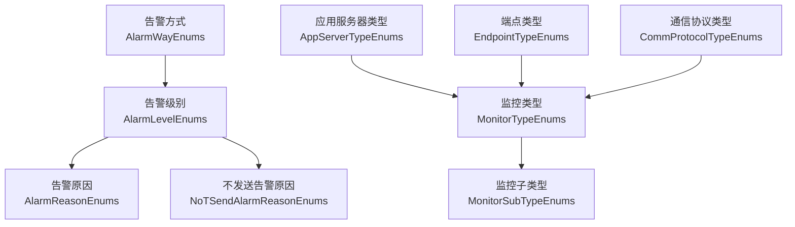
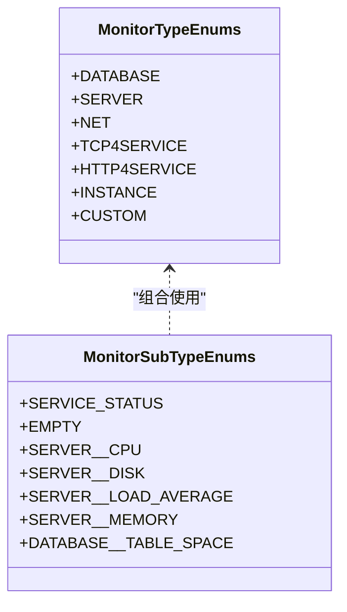
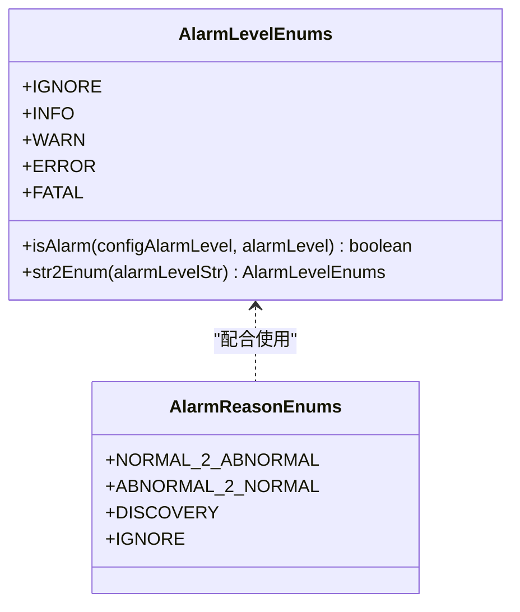
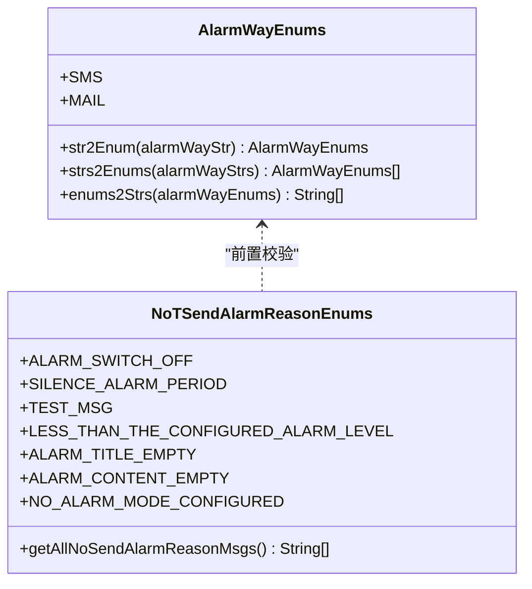
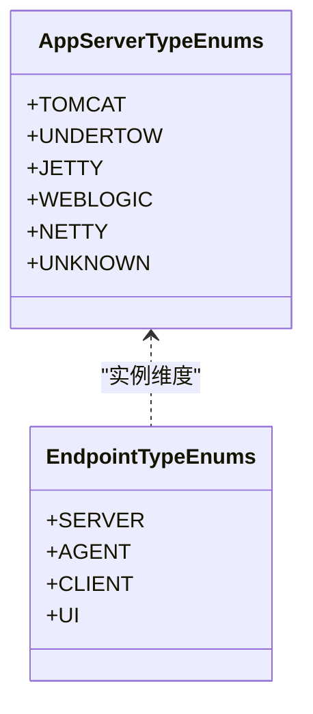
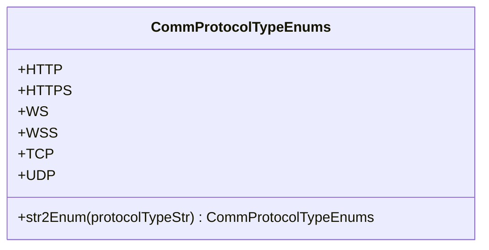
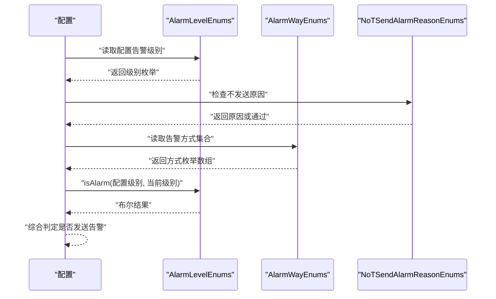
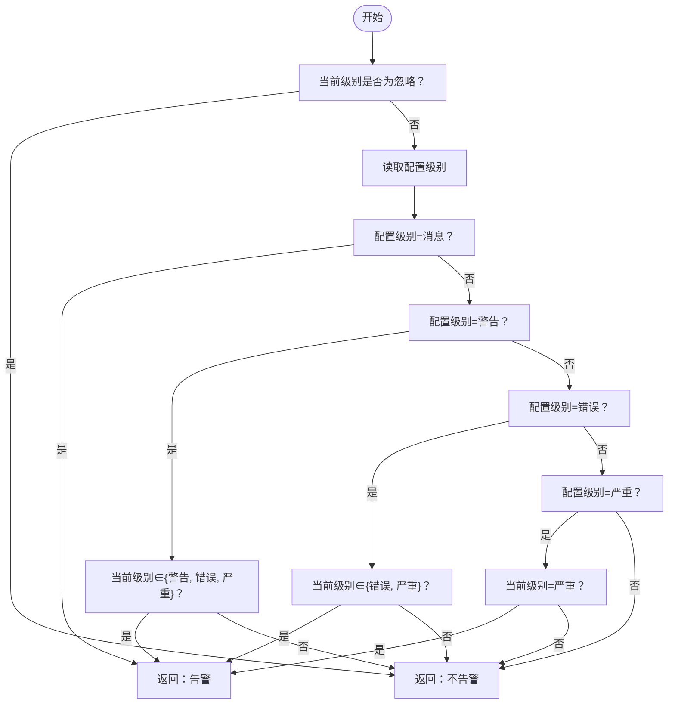
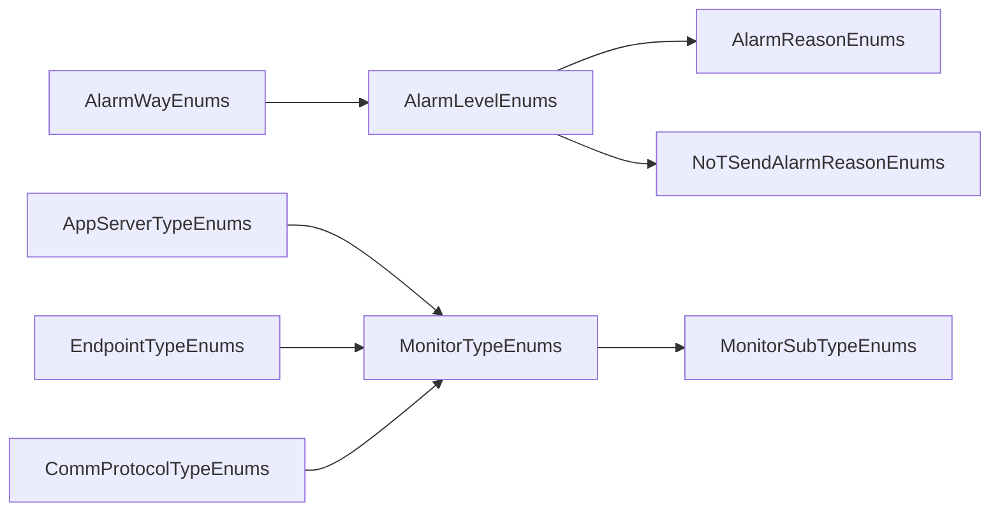

# 枚举类型体系

<cite>
**本文引用的文件**
- [MonitorTypeEnums.java](file://phoenix-common/phoenix-common-core/src/main/java/com/gitee/pifeng/monitoring/common/constant/MonitorTypeEnums.java)
- [MonitorTypeEnums.java（监控子类型）](file://phoenix-common/phoenix-common-core/src/main/java/com/gitee/pifeng/monitoring/common/constant/monitortype/MonitorTypeEnums.java)
- [MonitorSubTypeEnums.java](file://phoenix-common/phoenix-common-core/src/main/java/com/gitee/pifeng/monitoring/common/constant/monitortype/MonitorSubTypeEnums.java)
- [AlarmLevelEnums.java](file://phoenix-common/phoenix-common-core/src/main/java/com/gitee/pifeng/monitoring/common/constant/alarm/AlarmLevelEnums.java)
- [AlarmReasonEnums.java](file://phoenix-common/phoenix-common-core/src/main/java/com/gitee/pifeng/monitoring/common/constant/alarm/AlarmReasonEnums.java)
- [NoTSendAlarmReasonEnums.java](file://phoenix-common/phoenix-common-core/src/main/java/com/gitee/pifeng/monitoring/common/constant/alarm/NoTSendAlarmReasonEnums.java)
- [AlarmWayEnums.java](file://phoenix-common/phoenix-common-core/src/main/java/com/gitee/pifeng/monitoring/common/constant/alarm/AlarmWayEnums.java)
- [AppServerTypeEnums.java](file://phoenix-common/phoenix-common-core/src/main/java/com/gitee/pifeng/monitoring/common/constant/AppServerTypeEnums.java)
- [EndpointTypeEnums.java](file://phoenix-common/phoenix-common-core/src/main/java/com/gitee/pifeng/monitoring/common/constant/EndpointTypeEnums.java)
- [CommProtocolTypeEnums.java](file://phoenix-common/phoenix-common-core/src/main/java/com/gitee/pifeng/monitoring/common/constant/CommProtocolTypeEnums.java)
- [phoenix.sql](file://doc/数据库设计/sql/mysql/phoenix.sql)
- [AlarmController.java（Agent）](file://phoenix-agent/src/main/java/com/gitee/pifeng/monitoring/agent/business/client/controller/AlarmController.java)
- [AlarmController.java（Server）](file://phoenix-server/src/main/java/com/gitee/pifeng/monitoring/server/business/server/controller/AlarmController.java)
- [MonitoringDbProperties.java](file://phoenix-common/phoenix-common-core/src/main/java/com/gitee/pifeng/monitoring/common/property/server/MonitoringDbProperties.java)
</cite>

## 目录
1. [简介](#简介)
2. [项目结构](#项目结构)
3. [核心组件](#核心组件)
4. [架构总览](#架构总览)
5. [详细组件分析](#详细组件分析)
6. [依赖关系分析](#依赖关系分析)
7. [性能考量](#性能考量)
8. [故障排查指南](#故障排查指南)
9. [结论](#结论)
10. [附录](#附录)

## 简介
本文件系统性梳理并阐述本项目的枚举类型体系，重点覆盖以下方面：
- 监控类型与子类型：服务器监控、数据库监控、网络监控、HTTP/TCP服务监控、应用实例监控、自定义监控等分类与标识。
- 告警相关枚举：告警级别（严重、错误、警告、消息、忽略）、告警原因（正常变异常、异常变正常、发现、忽略）、告警方式（短信、邮件）、不发送告警原因（多种策略与场景）。
- 系统类型枚举：应用服务器类型（Tomcat、Jetty、Undertow、WebLogic、Netty、未知）。
- 端点类型枚举：服务端、代理端、客户端、UI端。
- 通信协议类型：HTTP、HTTPS、WS、WSS、TCP、UDP。
- 扩展机制与最佳实践：如何新增枚举值、如何在配置中使用、如何在业务流程中正确处理。

## 项目结构
本项目的枚举主要集中在公共模块的常量包下，采用按功能域分层组织：
- 监控类型与子类型：位于 monitortype 包，便于扩展更细粒度的监控维度。
- 告警相关枚举：位于 alarm 子包，集中管理告警级别的判断、告警原因、告警方式及不发送告警的原因。
- 其他通用枚举：如应用服务器类型、端点类型、通信协议类型等。

图表来源
- [MonitorTypeEnums.java:11-48](file://phoenix-common/phoenix-common-core/src/main/java/com/gitee/pifeng/monitoring/common/constant/MonitorTypeEnums.java#L11-L48)
- [MonitorSubTypeEnums.java:11-52](file://phoenix-common/phoenix-common-core/src/main/java/com/gitee/pifeng/monitoring/common/constant/monitortype/MonitorSubTypeEnums.java#L11-L52)
- [AlarmLevelEnums.java:13-38](file://phoenix-common/phoenix-common-core/src/main/java/com/gitee/pifeng/monitoring/common/constant/alarm/AlarmLevelEnums.java#L13-L38)
- [AlarmReasonEnums.java:11-33](file://phoenix-common/phoenix-common-core/src/main/java/com/gitee/pifeng/monitoring/common/constant/alarm/AlarmReasonEnums.java#L11-L33)
- [NoTSendAlarmReasonEnums.java:21-56](file://phoenix-common/phoenix-common-core/src/main/java/com/gitee/pifeng/monitoring/common/constant/alarm/NoTSendAlarmReasonEnums.java#L21-L56)
- [AlarmWayEnums.java:16-26](file://phoenix-common/phoenix-common-core/src/main/java/com/gitee/pifeng/monitoring/common/constant/alarm/AlarmWayEnums.java#L16-L26)
- [AppServerTypeEnums.java:18-48](file://phoenix-common/phoenix-common-core/src/main/java/com/gitee/pifeng/monitoring/common/constant/AppServerTypeEnums.java#L18-L48)
- [EndpointTypeEnums.java:18-38](file://phoenix-common/phoenix-common-core/src/main/java/com/gitee/pifeng/monitoring/common/constant/EndpointTypeEnums.java#L18-L38)
- [CommProtocolTypeEnums.java:14-44](file://phoenix-common/phoenix-common-core/src/main/java/com/gitee/pifeng/monitoring/common/constant/CommProtocolTypeEnums.java#L14-L44)

章节来源
- [MonitorTypeEnums.java:11-48](file://phoenix-common/phoenix-common-core/src/main/java/com/gitee/pifeng/monitoring/common/constant/MonitorTypeEnums.java#L11-L48)
- [MonitorTypeEnums.java（监控子类型）:11-48](file://phoenix-common/phoenix-common-core/src/main/java/com/gitee/pifeng/monitoring/common/constant/monitortype/MonitorTypeEnums.java#L11-L48)
- [MonitorSubTypeEnums.java:11-52](file://phoenix-common/phoenix-common-core/src/main/java/com/gitee/pifeng/monitoring/common/constant/monitortype/MonitorSubTypeEnums.java#L11-L52)

## 核心组件
本节对关键枚举进行逐项说明，包括用途、取值语义、常用方法与典型使用场景。

- 监控类型枚举（MonitorTypeEnums）
  - 作用：统一标识监控对象的主类型，便于路由到不同的采集与处理逻辑。
  - 主要取值：数据库、服务器、网络、TCP服务、HTTP服务、应用实例、自定义。
  - 使用建议：作为配置项与数据模型字段的基础类型，确保跨模块一致。

- 监控子类型枚举（MonitorSubTypeEnums）
  - 作用：在主类型基础上进一步细分监控维度，例如服务器监控下的 CPU、磁盘、内存、平均负载等。
  - 主要取值：服务状态、空（无）、服务器监控子类型（CPU、磁盘、平均负载、内存）、数据库监控子类型（表空间）。
  - 使用建议：与主类型配合，形成“主类型__子类型”的命名规范，便于扩展与查询。

- 告警级别枚举（AlarmLevelEnums）
  - 作用：定义告警严重程度等级，支持“是否告警”的判定与字符串转换。
  - 主要取值：忽略、消息、警告、错误、严重。
  - 关键方法：isAlarm(configAlarmLevel, alarmLevel)、str2Enum(alarmLevelStr)。
  - 使用建议：结合配置项控制告警阈值，避免低级别噪声干扰。

- 告警原因枚举（AlarmReasonEnums）
  - 作用：标识一次告警事件的触发原因，便于归档与统计。
  - 主要取值：正常变异常、异常变正常、发现、忽略。
  - 使用建议：与告警级别配合，形成“原因+级别”的双维度归档。

- 告警方式枚举（AlarmWayEnums）
  - 作用：标识告警通知渠道，支持字符串与枚举之间的双向转换。
  - 主要取值：短信、邮件。
  - 关键方法：str2Enum、strs2Enums、enums2Strs。
  - 使用建议：在配置中以逗号分隔字符串形式声明多通道告警。

- 不发送告警原因枚举（NoTSendAlarmReasonEnums）
  - 作用：明确不发送告警的具体原因，便于问题定位与审计。
  - 主要取值：告警开关关闭、静默告警期、测试信息、低于配置级别、告警标题/内容为空、未配置告警方式。
  - 关键方法：getAllNoSendAlarmReasonMsgs()。
  - 使用建议：在告警前置校验中逐一检查，快速短路。

- 应用服务器类型枚举（AppServerTypeEnums）
  - 作用：识别运行环境的应用服务器类型，用于差异化处理与展示。
  - 主要取值：Tomcat、Jetty、Undertow、WebLogic、Netty、未知。
  - 使用建议：与实例信息联动，用于 UI 展示与运维策略选择。

- 端点类型枚举（EndpointTypeEnums）
  - 作用：标识应用实例所处的端点位置，便于区分服务端、代理端、客户端、UI端。
  - 主要取值：服务端、代理端、客户端、UI端。
  - 使用建议：作为实例注册与查询的关键维度之一。

- 通信协议类型枚举（CommProtocolTypeEnums）
  - 作用：标识监控目标使用的通信协议，支持字符串到枚举的转换。
  - 主要取值：HTTP、HTTPS、WS、WSS、TCP、UDP。
  - 关键方法：str2Enum(protocolTypeStr)。
  - 使用建议：在 HTTP/TCP/WS 等监控场景中统一协议识别。

章节来源
- [MonitorTypeEnums.java:11-48](file://phoenix-common/phoenix-common-core/src/main/java/com/gitee/pifeng/monitoring/common/constant/MonitorTypeEnums.java#L11-L48)
- [MonitorSubTypeEnums.java:11-52](file://phoenix-common/phoenix-common-core/src/main/java/com/gitee/pifeng/monitoring/common/constant/monitortype/MonitorSubTypeEnums.java#L11-L52)
- [AlarmLevelEnums.java:13-38](file://phoenix-common/phoenix-common-core/src/main/java/com/gitee/pifeng/monitoring/common/constant/alarm/AlarmLevelEnums.java#L13-L38)
- [AlarmReasonEnums.java:11-33](file://phoenix-common/phoenix-common-core/src/main/java/com/gitee/pifeng/monitoring/common/constant/alarm/AlarmReasonEnums.java#L11-L33)
- [NoTSendAlarmReasonEnums.java:21-56](file://phoenix-common/phoenix-common-core/src/main/java/com/gitee/pifeng/monitoring/common/constant/alarm/NoTSendAlarmReasonEnums.java#L21-L56)
- [AlarmWayEnums.java:16-26](file://phoenix-common/phoenix-common-core/src/main/java/com/gitee/pifeng/monitoring/common/constant/alarm/AlarmWayEnums.java#L16-L26)
- [AppServerTypeEnums.java:18-48](file://phoenix-common/phoenix-common-core/src/main/java/com/gitee/pifeng/monitoring/common/constant/AppServerTypeEnums.java#L18-L48)
- [EndpointTypeEnums.java:18-38](file://phoenix-common/phoenix-common-core/src/main/java/com/gitee/pifeng/monitoring/common/constant/EndpointTypeEnums.java#L18-L38)
- [CommProtocolTypeEnums.java:14-44](file://phoenix-common/phoenix-common-core/src/main/java/com/gitee/pifeng/monitoring/common/constant/CommProtocolTypeEnums.java#L14-L44)

## 架构总览
下图展示了监控类型与子类型、告警相关枚举以及系统类型/端点/协议枚举之间的关系与交互方向。

图表来源
- [MonitorTypeEnums.java:11-48](file://phoenix-common/phoenix-common-core/src/main/java/com/gitee/pifeng/monitoring/common/constant/MonitorTypeEnums.java#L11-L48)
- [MonitorSubTypeEnums.java:11-52](file://phoenix-common/phoenix-common-core/src/main/java/com/gitee/pifeng/monitoring/common/constant/monitortype/MonitorSubTypeEnums.java#L11-L52)
- [AlarmLevelEnums.java:13-38](file://phoenix-common/phoenix-common-core/src/main/java/com/gitee/pifeng/monitoring/common/constant/alarm/AlarmLevelEnums.java#L13-L38)
- [AlarmReasonEnums.java:11-33](file://phoenix-common/phoenix-common-core/src/main/java/com/gitee/pifeng/monitoring/common/constant/alarm/AlarmReasonEnums.java#L11-L33)
- [NoTSendAlarmReasonEnums.java:21-56](file://phoenix-common/phoenix-common-core/src/main/java/com/gitee/pifeng/monitoring/common/constant/alarm/NoTSendAlarmReasonEnums.java#L21-L56)
- [AlarmWayEnums.java:16-26](file://phoenix-common/phoenix-common-core/src/main/java/com/gitee/pifeng/monitoring/common/constant/alarm/AlarmWayEnums.java#L16-L26)
- [AppServerTypeEnums.java:18-48](file://phoenix-common/phoenix-common-core/src/main/java/com/gitee/pifeng/monitoring/common/constant/AppServerTypeEnums.java#L18-L48)
- [EndpointTypeEnums.java:18-38](file://phoenix-common/phoenix-common-core/src/main/java/com/gitee/pifeng/monitoring/common/constant/EndpointTypeEnums.java#L18-L38)
- [CommProtocolTypeEnums.java:14-44](file://phoenix-common/phoenix-common-core/src/main/java/com/gitee/pifeng/monitoring/common/constant/CommProtocolTypeEnums.java#L14-L44)

## 详细组件分析

### 监控类型与子类型
- 设计要点
  - 主类型用于路由与聚合，子类型用于细化与统计。
  - 子类型采用“主类型__子类型”的命名风格，便于扩展与检索。
- 典型使用
  - 在配置中指定监控类型与子类型，驱动采集器执行相应任务。
  - 在 UI 与报表中按主/子类型组合展示趋势与告警。

图表来源
- [MonitorTypeEnums.java:11-48](file://phoenix-common/phoenix-common-core/src/main/java/com/gitee/pifeng/monitoring/common/constant/MonitorTypeEnums.java#L11-L48)
- [MonitorSubTypeEnums.java:11-52](file://phoenix-common/phoenix-common-core/src/main/java/com/gitee/pifeng/monitoring/common/constant/monitortype/MonitorSubTypeEnums.java#L11-L52)

章节来源
- [MonitorTypeEnums.java:11-48](file://phoenix-common/phoenix-common-core/src/main/java/com/gitee/pifeng/monitoring/common/constant/MonitorTypeEnums.java#L11-L48)
- [MonitorSubTypeEnums.java:11-52](file://phoenix-common/phoenix-common-core/src/main/java/com/gitee/pifeng/monitoring/common/constant/monitortype/MonitorSubTypeEnums.java#L11-L52)

### 告警级别与告警原因
- 设计要点
  - 告警级别提供“是否告警”的判定逻辑，支持从字符串到枚举的转换。
  - 告警原因用于事件归档与统计，区分异常状态变化与发现事件。
- 典型使用
  - 在告警前置校验中先判断级别与原因，再决定是否发送与如何发送。

图表来源
- [AlarmLevelEnums.java:13-38](file://phoenix-common/phoenix-common-core/src/main/java/com/gitee/pifeng/monitoring/common/constant/alarm/AlarmLevelEnums.java#L13-L38)
- [AlarmReasonEnums.java:11-33](file://phoenix-common/phoenix-common-core/src/main/java/com/gitee/pifeng/monitoring/common/constant/alarm/AlarmReasonEnums.java#L11-L33)

章节来源
- [AlarmLevelEnums.java:13-38](file://phoenix-common/phoenix-common-core/src/main/java/com/gitee/pifeng/monitoring/common/constant/alarm/AlarmLevelEnums.java#L13-L38)
- [AlarmReasonEnums.java:11-33](file://phoenix-common/phoenix-common-core/src/main/java/com/gitee/pifeng/monitoring/common/constant/alarm/AlarmReasonEnums.java#L11-L33)

### 告警方式与不发送告警原因
- 设计要点
  - 告警方式支持短信与邮件两种渠道，提供字符串与枚举互转能力。
  - 不发送告警原因用于快速定位告警被阻断的场景，便于运维与审计。
- 典型使用
  - 在配置中声明告警方式集合，结合级别与原因进行最终决策。

图表来源
- [AlarmWayEnums.java:16-26](file://phoenix-common/phoenix-common-core/src/main/java/com/gitee/pifeng/monitoring/common/constant/alarm/AlarmWayEnums.java#L16-L26)
- [NoTSendAlarmReasonEnums.java:21-56](file://phoenix-common/phoenix-common-core/src/main/java/com/gitee/pifeng/monitoring/common/constant/alarm/NoTSendAlarmReasonEnums.java#L21-L56)

章节来源
- [AlarmWayEnums.java:16-26](file://phoenix-common/phoenix-common-core/src/main/java/com/gitee/pifeng/monitoring/common/constant/alarm/AlarmWayEnums.java#L16-L26)
- [NoTSendAlarmReasonEnums.java:21-56](file://phoenix-common/phoenix-common-core/src/main/java/com/gitee/pifeng/monitoring/common/constant/alarm/NoTSendAlarmReasonEnums.java#L21-L56)

### 应用服务器类型与端点类型
- 设计要点
  - 应用服务器类型用于识别运行环境，便于差异化处理与展示。
  - 端点类型用于区分实例所处位置，便于路由与权限控制。
- 典型使用
  - 在实例注册时写入服务器类型与端点类型，用于 UI 展示与策略匹配。

图表来源
- [AppServerTypeEnums.java:18-48](file://phoenix-common/phoenix-common-core/src/main/java/com/gitee/pifeng/monitoring/common/constant/AppServerTypeEnums.java#L18-L48)
- [EndpointTypeEnums.java:18-38](file://phoenix-common/phoenix-common-core/src/main/java/com/gitee/pifeng/monitoring/common/constant/EndpointTypeEnums.java#L18-L38)

章节来源
- [AppServerTypeEnums.java:18-48](file://phoenix-common/phoenix-common-core/src/main/java/com/gitee/pifeng/monitoring/common/constant/AppServerTypeEnums.java#L18-L48)
- [EndpointTypeEnums.java:18-38](file://phoenix-common/phoenix-common-core/src/main/java/com/gitee/pifeng/monitoring/common/constant/EndpointTypeEnums.java#L18-L38)

### 通信协议类型
- 设计要点
  - 统一识别 HTTP/HTTPS/WS/WSS/TCP/UDP 等协议，支持字符串到枚举的转换。
- 典型使用
  - 在 HTTP/TCP/WS 等监控场景中，根据协议类型选择相应的采集与解析策略。

图表来源
- [CommProtocolTypeEnums.java:14-44](file://phoenix-common/phoenix-common-core/src/main/java/com/gitee/pifeng/monitoring/common/constant/CommProtocolTypeEnums.java#L14-L44)

章节来源
- [CommProtocolTypeEnums.java:14-44](file://phoenix-common/phoenix-common-core/src/main/java/com/gitee/pifeng/monitoring/common/constant/CommProtocolTypeEnums.java#L14-L44)

### 告警判定流程（序列图）
该序列图展示告警前置校验与判定的核心流程，体现级别、原因与方式之间的协作关系。

图表来源
- [AlarmLevelEnums.java:51-81](file://phoenix-common/phoenix-common-core/src/main/java/com/gitee/pifeng/monitoring/common/constant/alarm/AlarmLevelEnums.java#L51-L81)
- [AlarmWayEnums.java:38-91](file://phoenix-common/phoenix-common-core/src/main/java/com/gitee/pifeng/monitoring/common/constant/alarm/AlarmWayEnums.java#L38-L91)
- [NoTSendAlarmReasonEnums.java:71-75](file://phoenix-common/phoenix-common-core/src/main/java/com/gitee/pifeng/monitoring/common/constant/alarm/NoTSendAlarmReasonEnums.java#L71-L75)

章节来源
- [AlarmLevelEnums.java:51-81](file://phoenix-common/phoenix-common-core/src/main/java/com/gitee/pifeng/monitoring/common/constant/alarm/AlarmLevelEnums.java#L51-L81)
- [AlarmWayEnums.java:38-91](file://phoenix-common/phoenix-common-core/src/main/java/com/gitee/pifeng/monitoring/common/constant/alarm/AlarmWayEnums.java#L38-L91)
- [NoTSendAlarmReasonEnums.java:71-75](file://phoenix-common/phoenix-common-core/src/main/java/com/gitee/pifeng/monitoring/common/constant/alarm/NoTSendAlarmReasonEnums.java#L71-L75)

### 告警级别判定流程（流程图）
该流程图直观展示告警级别判定的分支逻辑。

图表来源
- [AlarmLevelEnums.java:51-81](file://phoenix-common/phoenix-common-core/src/main/java/com/gitee/pifeng/monitoring/common/constant/alarm/AlarmLevelEnums.java#L51-L81)

章节来源
- [AlarmLevelEnums.java:51-81](file://phoenix-common/phoenix-common-core/src/main/java/com/gitee/pifeng/monitoring/common/constant/alarm/AlarmLevelEnums.java#L51-L81)

## 依赖关系分析
- 枚举之间的耦合
  - 监控类型与子类型：强关联，子类型必须依附于主类型存在。
  - 告警级别与告警原因：弱耦合，共同参与事件归档。
  - 告警方式与不发送告警原因：前置校验关系，前者决定发送渠道，后者决定是否发送。
  - 应用服务器类型与端点类型：实例维度的组合，用于区分运行环境与位置。
  - 通信协议类型：与监控类型中的 HTTP/TCP/WS 场景强关联。
- 外部依赖
  - 字符串与枚举互转广泛使用 Apache Commons Lang 的字符串比较工具。
  - 告警方式支持 Guava 的集合工具类。

图表来源
- [MonitorTypeEnums.java:11-48](file://phoenix-common/phoenix-common-core/src/main/java/com/gitee/pifeng/monitoring/common/constant/MonitorTypeEnums.java#L11-L48)
- [MonitorSubTypeEnums.java:11-52](file://phoenix-common/phoenix-common-core/src/main/java/com/gitee/pifeng/monitoring/common/constant/monitortype/MonitorSubTypeEnums.java#L11-L52)
- [AlarmLevelEnums.java:13-38](file://phoenix-common/phoenix-common-core/src/main/java/com/gitee/pifeng/monitoring/common/constant/alarm/AlarmLevelEnums.java#L13-L38)
- [AlarmReasonEnums.java:11-33](file://phoenix-common/phoenix-common-core/src/main/java/com/gitee/pifeng/monitoring/common/constant/alarm/AlarmReasonEnums.java#L11-L33)
- [NoTSendAlarmReasonEnums.java:21-56](file://phoenix-common/phoenix-common-core/src/main/java/com/gitee/pifeng/monitoring/common/constant/alarm/NoTSendAlarmReasonEnums.java#L21-L56)
- [AlarmWayEnums.java:16-26](file://phoenix-common/phoenix-common-core/src/main/java/com/gitee/pifeng/monitoring/common/constant/alarm/AlarmWayEnums.java#L16-L26)
- [AppServerTypeEnums.java:18-48](file://phoenix-common/phoenix-common-core/src/main/java/com/gitee/pifeng/monitoring/common/constant/AppServerTypeEnums.java#L18-L48)
- [EndpointTypeEnums.java:18-38](file://phoenix-common/phoenix-common-core/src/main/java/com/gitee/pifeng/monitoring/common/constant/EndpointTypeEnums.java#L18-L38)
- [CommProtocolTypeEnums.java:14-44](file://phoenix-common/phoenix-common-core/src/main/java/com/gitee/pifeng/monitoring/common/constant/CommProtocolTypeEnums.java#L14-L44)

章节来源
- [AlarmLevelEnums.java:93-115](file://phoenix-common/phoenix-common-core/src/main/java/com/gitee/pifeng/monitoring/common/constant/alarm/AlarmLevelEnums.java#L93-L115)
- [AlarmWayEnums.java:38-91](file://phoenix-common/phoenix-common-core/src/main/java/com/gitee/pifeng/monitoring/common/constant/alarm/AlarmWayEnums.java#L38-L91)
- [NoTSendAlarmReasonEnums.java:71-75](file://phoenix-common/phoenix-common-core/src/main/java/com/gitee/pifeng/monitoring/common/constant/alarm/NoTSendAlarmReasonEnums.java#L71-L75)

## 性能考量
- 枚举比较与字符串转换
  - 枚举比较为 O(1)，字符串比较使用 equalsIgnoreCase，开销极小。
  - 批量转换（如 AlarmWayEnums.strs2Enums）使用集合工具类，注意输入规模与空值过滤。
- 前置校验短路
  - 不发送告警原因的检查应尽早执行，避免后续昂贵操作。
- 内存占用
  - 枚举实例数量有限，内存占用可忽略；但大量字符串转换会增加临时对象数量，建议复用常量与缓存。

## 故障排查指南
- 常见问题与定位
  - 告警未发送：检查不发送告警原因枚举项，确认是否存在“告警开关关闭”“静默告警期”“低于配置级别”等情况。
  - 告警级别不生效：核对配置的告警级别与当前级别，参考 isAlarm 判定逻辑。
  - 告警方式无效：确认配置字符串与 AlarmWayEnums 支持的枚举名称一致。
  - 协议识别失败：检查协议字符串大小写与枚举映射，必要时抛出异常。
- 排查步骤
  - 查看告警前置校验日志，定位具体不发送原因。
  - 对照告警级别判定流程，确认配置与实际级别是否匹配。
  - 检查告警方式集合是否为空或包含非法值。

章节来源
- [NoTSendAlarmReasonEnums.java:71-75](file://phoenix-common/phoenix-common-core/src/main/java/com/gitee/pifeng/monitoring/common/constant/alarm/NoTSendAlarmReasonEnums.java#L71-L75)
- [AlarmLevelEnums.java:51-81](file://phoenix-common/phoenix-common-core/src/main/java/com/gitee/pifeng/monitoring/common/constant/alarm/AlarmLevelEnums.java#L51-L81)
- [AlarmWayEnums.java:38-91](file://phoenix-common/phoenix-common-core/src/main/java/com/gitee/pifeng/monitoring/common/constant/alarm/AlarmWayEnums.java#L38-L91)
- [CommProtocolTypeEnums.java:56-81](file://phoenix-common/phoenix-common-core/src/main/java/com/gitee/pifeng/monitoring/common/constant/CommProtocolTypeEnums.java#L56-L81)

## 结论
本项目的枚举类型体系以“监控类型—子类型”为主线，辅以告警级别、原因、方式与不发送原因的完整闭环，配合应用服务器类型、端点类型与通信协议类型，形成了清晰、可扩展、易维护的类型体系。通过统一的字符串与枚举互转接口、前置校验与判定流程，能够有效支撑采集、告警与展示等核心业务。

## 附录

### 扩展机制与最佳实践
- 新增监控类型/子类型
  - 在 MonitorTypeEnums 或 MonitorSubTypeEnums 中添加新值，遵循“主类型__子类型”的命名规范。
  - 在采集器与处理器中补充对应分支逻辑，确保新类型可被正确识别与处理。
- 新增告警级别/原因/方式
  - 在 AlarmLevelEnums、AlarmReasonEnums、AlarmWayEnums 中添加新值，并完善字符串转换与批量转换方法。
  - 在告警前置校验与判定流程中补充新分支或条件。
- 新增不发送告警原因
  - 在 NoTSendAlarmReasonEnums 中添加新原因，提供唯一编码与描述，并在 getAllNoSendAlarmReasonMsgs 中保持一致性。
- 新增应用服务器类型/端点类型/通信协议类型
  - 在 AppServerTypeEnums、EndpointTypeEnums、CommProtocolTypeEnums 中添加新值，并完善字符串转换逻辑。
- 配置文件中的使用
  - 告警级别与告警方式通常以字符串形式配置，使用对应的 str2Enum 与 strs2Enums 方法进行转换。
  - 监控类型与子类型在配置中以枚举名称或约定字符串表示，确保大小写与枚举名称一致。
- 最佳实践
  - 统一使用枚举而非原始字符串，减少歧义与错误。
  - 在业务入口处进行前置校验，尽早短路无效路径。
  - 对外暴露的配置项尽量使用枚举名称或受控字符串，避免魔法值。
  - 在数据库与 UI 展示中，优先使用枚举的描述字段（如 AppServerTypeEnums 的 name、EndpointTypeEnums 的 nameCn），提升可读性。

章节来源
- [MonitorTypeEnums.java:11-48](file://phoenix-common/phoenix-common-core/src/main/java/com/gitee/pifeng/monitoring/common/constant/MonitorTypeEnums.java#L11-L48)
- [MonitorSubTypeEnums.java:11-52](file://phoenix-common/phoenix-common-core/src/main/java/com/gitee/pifeng/monitoring/common/constant/monitortype/MonitorSubTypeEnums.java#L11-L52)
- [AlarmLevelEnums.java:93-115](file://phoenix-common/phoenix-common-core/src/main/java/com/gitee/pifeng/monitoring/common/constant/alarm/AlarmLevelEnums.java#L93-L115)
- [AlarmWayEnums.java:38-91](file://phoenix-common/phoenix-common-core/src/main/java/com/gitee/pifeng/monitoring/common/constant/alarm/AlarmWayEnums.java#L38-L91)
- [NoTSendAlarmReasonEnums.java:71-75](file://phoenix-common/phoenix-common-core/src/main/java/com/gitee/pifeng/monitoring/common/constant/alarm/NoTSendAlarmReasonEnums.java#L71-L75)
- [AppServerTypeEnums.java:18-48](file://phoenix-common/phoenix-common-core/src/main/java/com/gitee/pifeng/monitoring/common/constant/AppServerTypeEnums.java#L18-L48)
- [EndpointTypeEnums.java:18-38](file://phoenix-common/phoenix-common-core/src/main/java/com/gitee/pifeng/monitoring/common/constant/EndpointTypeEnums.java#L18-L38)
- [CommProtocolTypeEnums.java:56-81](file://phoenix-common/phoenix-common-core/src/main/java/com/gitee/pifeng/monitoring/common/constant/CommProtocolTypeEnums.java#L56-L81)

### 数据模型与枚举映射参考
- 实例表字段与枚举映射
  - 端点（客户端/代理端/服务端/UI端）：对应 EndpointTypeEnums 的英文简称。
  - 应用服务器类型：对应 AppServerTypeEnums 的名称。
- 参考 SQL 片段
  - 端点字段与应用服务器类型字段在实例表中均有定义，便于前端展示与筛选。

章节来源
- [phoenix.sql:275-285](file://doc/数据库设计/sql/mysql/phoenix.sql#L275-L285)