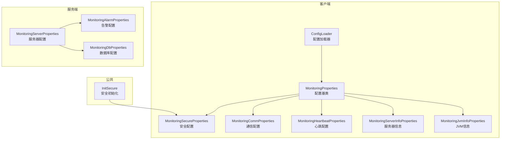
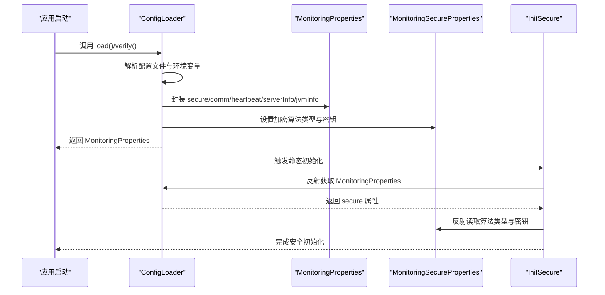
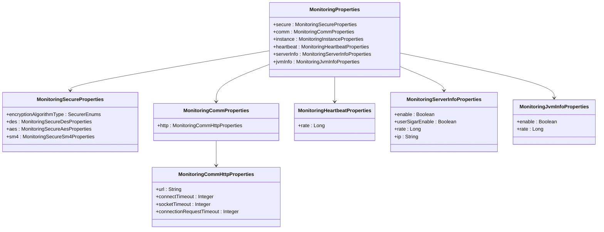
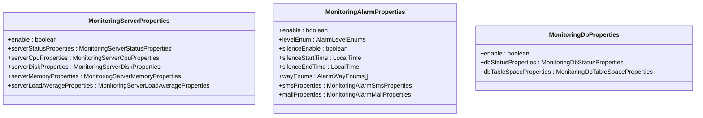
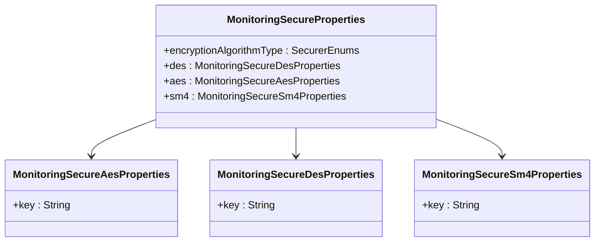
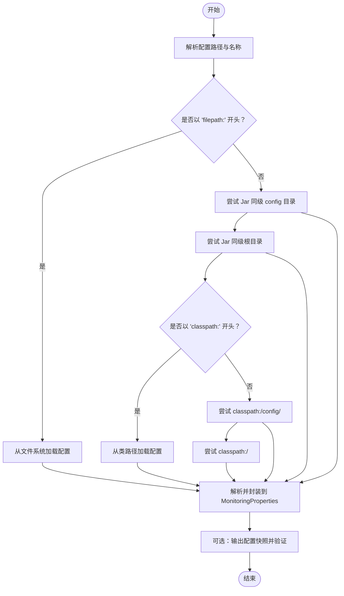
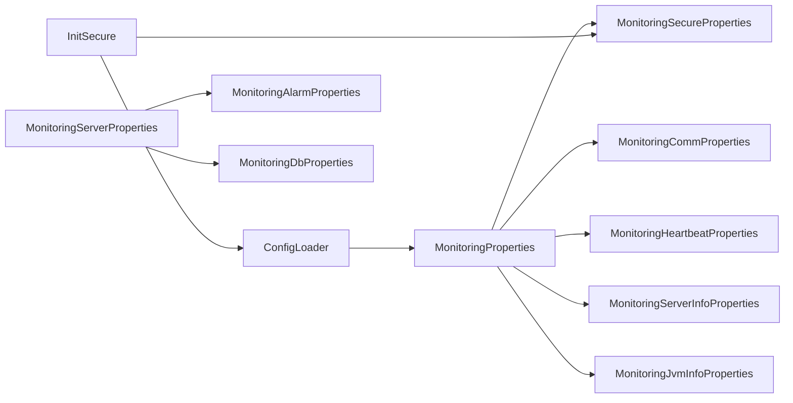

# 配置属性管理

<cite>
**本文引用的文件**
- [MonitoringProperties.java](file://phoenix-common\phoenix-common-core\src\main\java\com\gitee\pifeng\monitoring\common\property\client\MonitoringProperties.java)
- [MonitoringSecureProperties.java](file://phoenix-common\phoenix-common-core\src\main\java\com\gitee\pifeng\monitoring\common\property\client\MonitoringSecureProperties.java)
- [MonitoringSecureAesProperties.java](file://phoenix-common\phoenix-common-core\src\main\java\com\gitee\pifeng\monitoring\common\property\client\MonitoringSecureAesProperties.java)
- [MonitoringSecureDesProperties.java](file://phoenix-common\phoenix-common-core\src\main\java\com\gitee\pifeng\monitoring\common\property\client\MonitoringSecureDesProperties.java)
- [MonitoringSecureSm4Properties.java](file://phoenix-common\phoenix-common-core\src\main\java\com\gitee\pifeng\monitoring\common\property\client\MonitoringSecureSm4Properties.java)
- [MonitoringCommProperties.java](file://phoenix-common\phoenix-common-core\src\main\java\com\gitee\pifeng\monitoring\common\property\client\MonitoringCommProperties.java)
- [MonitoringCommHttpProperties.java](file://phoenix-common\phoenix-common-core\src\main\java\com\gitee\pifeng\monitoring\common\property\client\MonitoringCommHttpProperties.java)
- [MonitoringHeartbeatProperties.java](file://phoenix-common\phoenix-common-core\src\main\java\com\gitee\pifeng\monitoring\common\property\client\MonitoringHeartbeatProperties.java)
- [MonitoringServerInfoProperties.java](file://phoenix-common\phoenix-common-core\src\main\java\com\gitee\pifeng\monitoring\common\property\client\MonitoringServerInfoProperties.java)
- [MonitoringJvmInfoProperties.java](file://phoenix-common\phoenix-common-core\src\main\java\com\gitee\pifeng\monitoring\common\property\client\MonitoringJvmInfoProperties.java)
- [MonitoringServerProperties.java](file://phoenix-common\phoenix-common-core\src\main\java\com\gitee\pifeng\monitoring\common\property\server\MonitoringServerProperties.java)
- [MonitoringAlarmProperties.java](file://phoenix-common\phoenix-common-core\src\main\java\com\gitee\pifeng\monitoring\common\property\server\MonitoringAlarmProperties.java)
- [MonitoringDbProperties.java](file://phoenix-common\phoenix-common-core\src\main\java\com\gitee\pifeng\monitoring\common\property\server\MonitoringDbProperties.java)
- [ConfigLoader.java](file://phoenix-client\phoenix-client-core\src\main\java\com\gitee\pifeng\monitoring\plug\core\ConfigLoader.java)
- [InitSecure.java](file://phoenix-common\phoenix-common-core\src\main\java\com\gitee\pifeng\monitoring\common\init\InitSecure.java)
- [application.yml（服务端）](file://phoenix-server\src\main\resources\application.yml)
- [application.yml（代理端）](file://phoenix-agent\src\main\resources\application.yml)
</cite>

## 目录
1. [简介](#简介)
2. [项目结构](#项目结构)
3. [核心组件](#核心组件)
4. [架构总览](#架构总览)
5. [详细组件分析](#详细组件分析)
6. [依赖分析](#依赖分析)
7. [性能考虑](#性能考虑)
8. [故障排查指南](#故障排查指南)
9. [结论](#结论)
10. [附录](#附录)

## 简介
本文件系统性阐述 Phoenix 监控体系中的“配置属性管理”能力，围绕以下目标展开：
- 设计与实现：以 MonitoringProperties 为核心配置基类，说明其属性绑定、默认值处理与配置验证机制。
- 客户端配置：覆盖通信、心跳、服务器信息、JVM 信息、实例信息等客户端维度的属性定义与用途。
- 服务端配置：覆盖服务器、告警、数据库等服务端维度的属性设计思路。
- 安全配置：覆盖加密算法类型、密钥封装、证书与密钥轮换的策略与实现要点。
- 配置加载：说明 application.yml 的解析、环境变量覆盖、命令行参数优先级等加载策略。
- 动态更新与热加载：给出可落地的动态更新与热加载方案建议。

## 项目结构
Phoenix 的配置属性分布在公共模块与各子工程中：
- 客户端配置属性位于公共模块的 client 包下，服务端配置属性位于 server 包下。
- 客户端通过 ConfigLoader 统一加载与解析配置；服务端通过 Spring Boot 的 application.yml 提供默认配置。
- 安全配置贯穿客户端与公共初始化模块，InitSecure 通过反射读取已加载的安全配置。

图表来源
- [ConfigLoader.java:170-179](file://phoenix-client\phoenix-client-core\src\main\java\com\gitee\pifeng\monitoring\plug\core\ConfigLoader.java#L170-L179)
- [MonitoringProperties.java:22-55](file://phoenix-common\phoenix-common-core\src\main\java\com\gitee\pifeng\monitoring\common\property\client\MonitoringProperties.java#L22-L55)
- [MonitoringSecureProperties.java:23-45](file://phoenix-common\phoenix-common-core\src\main\java\com\gitee\pifeng\monitoring\common\property\client\MonitoringSecureProperties.java#L23-L45)
- [MonitoringCommProperties.java:20-27](file://phoenix-common\phoenix-common-core\src\main\java\com\gitee\pifeng\monitoring\common\property\client\MonitoringCommProperties.java#L20-L27)
- [MonitoringHeartbeatProperties.java:20-27](file://phoenix-common\phoenix-common-core\src\main\java\com\gitee\pifeng\monitoring\common\property\client\MonitoringHeartbeatProperties.java#L20-L27)
- [MonitoringServerInfoProperties.java:20-42](file://phoenix-common\phoenix-common-core\src\main\java\com\gitee\pifeng\monitoring\common\property\client\MonitoringServerInfoProperties.java#L20-L42)
- [MonitoringJvmInfoProperties.java:20-32](file://phoenix-common\phoenix-common-core\src\main\java\com\gitee\pifeng\monitoring\common\property\client\MonitoringJvmInfoProperties.java#L20-L32)
- [MonitoringServerProperties.java:19-51](file://phoenix-common\phoenix-common-core\src\main\java\com\gitee\pifeng\monitoring\common\property\server\MonitoringServerProperties.java#L19-L51)
- [MonitoringAlarmProperties.java:23-65](file://phoenix-common\phoenix-common-core\src\main\java\com\gitee\pifeng\monitoring\common\property\server\MonitoringAlarmProperties.java#L23-L65)
- [MonitoringDbProperties.java:19-36](file://phoenix-common\phoenix-common-core\src\main\java\com\gitee\pifeng\monitoring\common\property\server\MonitoringDbProperties.java#L19-L36)
- [InitSecure.java:50-87](file://phoenix-common\phoenix-common-core\src\main\java\com\gitee\pifeng\monitoring\common\init\InitSecure.java#L50-L87)

章节来源
- [ConfigLoader.java:80-155](file://phoenix-client\phoenix-client-core\src\main\java\com\gitee\pifeng\monitoring\plug\core\ConfigLoader.java#L80-L155)
- [application.yml（服务端）](file://phoenix-server\src\main\resources\application.yml)
- [application.yml（代理端）](file://phoenix-agent\src\main\resources\application.yml)

## 核心组件
本节聚焦于配置基类与关键属性模型，说明其职责、字段含义与默认值策略。

- MonitoringProperties（配置基类）
  - 职责：聚合所有客户端监控相关配置，作为统一入口。
  - 关键字段：secure、comm、instance、heartbeat、serverInfo、jvmInfo。
  - 默认值策略：通过 ConfigLoader 在解析阶段对空值进行兜底，避免运行期空指针。
  - 验证机制：提供 verify 方法，完成解析与日志输出，便于上线前校验。

- MonitoringSecureProperties（安全配置）
  - 职责：封装加密算法类型与各算法密钥。
  - 字段：encryptionAlgorithmType、des、aes、sm4。
  - 反射依赖：InitSecure 通过反射读取该对象及密钥，命名与结构需保持稳定。

- MonitoringCommProperties / MonitoringCommHttpProperties（通信配置）
  - 职责：封装 HTTP 通信参数，如服务端 URL、连接超时、套接字超时、连接池等待超时。
  - 默认值：ConfigLoader 在解析时对缺失字段赋予默认值，确保网络层可用。

- MonitoringHeartbeatProperties（心跳配置）
  - 职责：定义心跳发送频率。
  - 默认值：解析阶段兜底，避免心跳停摆。

- MonitoringServerInfoProperties / MonitoringJvmInfoProperties（采集配置）
  - 职责：开关与采集频率控制，以及服务器信息中的 IP 等细节。
  - 默认值：解析阶段兜底，保证采集任务按预期执行。

章节来源
- [MonitoringProperties.java:22-55](file://phoenix-common\phoenix-common-core\src\main\java\com\gitee\pifeng\monitoring\common\property\client\MonitoringProperties.java#L22-L55)
- [MonitoringSecureProperties.java:23-45](file://phoenix-common\phoenix-common-core\src\main\java\com\gitee\pifeng\monitoring\common\property\client\MonitoringSecureProperties.java#L23-L45)
- [MonitoringCommProperties.java:20-27](file://phoenix-common\phoenix-common-core\src\main\java\com\gitee\pifeng\monitoring\common\property\client\MonitoringCommProperties.java#L20-L27)
- [MonitoringCommHttpProperties.java:20-42](file://phoenix-common\phoenix-common-core\src\main\java\com\gitee\pifeng\monitoring\common\property\client\MonitoringCommHttpProperties.java#L20-L42)
- [MonitoringHeartbeatProperties.java:20-27](file://phoenix-common\phoenix-common-core\src\main\java\com\gitee\pifeng\monitoring\common\property\client\MonitoringHeartbeatProperties.java#L20-L27)
- [MonitoringServerInfoProperties.java:20-42](file://phoenix-common\phoenix-common-core\src\main\java\com\gitee\pifeng\monitoring\common\property\client\MonitoringServerInfoProperties.java#L20-L42)
- [MonitoringJvmInfoProperties.java:20-32](file://phoenix-common\phoenix-common-core\src\main\java\com\gitee\pifeng\monitoring\common\property\client\MonitoringJvmInfoProperties.java#L20-L32)

## 架构总览
客户端与服务端的配置加载与交互如下：

图表来源
- [ConfigLoader.java:95-155](file://phoenix-client\phoenix-client-core\src\main\java\com\gitee\pifeng\monitoring\plug\core\ConfigLoader.java#L95-L155)
- [InitSecure.java:50-87](file://phoenix-common\phoenix-common-core\src\main\java\com\gitee\pifeng\monitoring\common\init\InitSecure.java#L50-L87)

## 详细组件分析

### 客户端配置属性族
- MonitoringProperties（配置基类）
  - 聚合安全、通信、心跳、服务器信息、JVM 信息等配置。
  - 通过 ConfigLoader 的 analysis 流程统一封装，支持 properties 与 MonitoringProperties 两种输入源。

- MonitoringSecureProperties 及其子类
  - 支持 DES/AES/SM4 三种算法，对应各自的密钥封装类。
  - InitSecure 通过反射读取算法类型与密钥，命名与结构需保持稳定。

- MonitoringCommProperties / MonitoringCommHttpProperties
  - 提供服务端 URL 与网络超时参数，ConfigLoader 在解析时提供默认值。

- MonitoringHeartbeatProperties
  - 控制心跳发送频率，解析阶段兜底。

- MonitoringServerInfoProperties / MonitoringJvmInfoProperties
  - 控制采集开关与频率，服务器信息中可指定 IP。

图表来源
- [MonitoringProperties.java:22-55](file://phoenix-common\phoenix-common-core\src\main\java\com\gitee\pifeng\monitoring\common\property\client\MonitoringProperties.java#L22-L55)
- [MonitoringSecureProperties.java:23-45](file://phoenix-common\phoenix-common-core\src\main\java\com\gitee\pifeng\monitoring\common\property\client\MonitoringSecureProperties.java#L23-L45)
- [MonitoringCommProperties.java:20-27](file://phoenix-common\phoenix-common-core\src\main\java\com\gitee\pifeng\monitoring\common\property\client\MonitoringCommProperties.java#L20-L27)
- [MonitoringCommHttpProperties.java:20-42](file://phoenix-common\phoenix-common-core\src\main\java\com\gitee\pifeng\monitoring\common\property\client\MonitoringCommHttpProperties.java#L20-L42)
- [MonitoringHeartbeatProperties.java:20-27](file://phoenix-common\phoenix-common-core\src\main\java\com\gitee\pifeng\monitoring\common\property\client\MonitoringHeartbeatProperties.java#L20-L27)
- [MonitoringServerInfoProperties.java:20-42](file://phoenix-common\phoenix-common-core\src\main\java\com\gitee\pifeng\monitoring\common\property\client\MonitoringServerInfoProperties.java#L20-L42)
- [MonitoringJvmInfoProperties.java:20-32](file://phoenix-common\phoenix-common-core\src\main\java\com\gitee\pifeng\monitoring\common\property\client\MonitoringJvmInfoProperties.java#L20-L32)

章节来源
- [MonitoringProperties.java:22-55](file://phoenix-common\phoenix-common-core\src\main\java\com\gitee\pifeng\monitoring\common\property\client\MonitoringProperties.java#L22-L55)
- [MonitoringSecureProperties.java:23-45](file://phoenix-common\phoenix-common-core\src\main\java\com\gitee\pifeng\monitoring\common\property\client\MonitoringSecureProperties.java#L23-L45)
- [MonitoringCommProperties.java:20-27](file://phoenix-common\phoenix-common-core\src\main\java\com\gitee\pifeng\monitoring\common\property\client\MonitoringCommProperties.java#L20-L27)
- [MonitoringCommHttpProperties.java:20-42](file://phoenix-common\phoenix-common-core\src\main\java\com\gitee\pifeng\monitoring\common\property\client\MonitoringCommHttpProperties.java#L20-L42)
- [MonitoringHeartbeatProperties.java:20-27](file://phoenix-common\phoenix-common-core\src\main\java\com\gitee\pifeng\monitoring\common\property\client\MonitoringHeartbeatProperties.java#L20-L27)
- [MonitoringServerInfoProperties.java:20-42](file://phoenix-common\phoenix-common-core\src\main\java\com\gitee\pifeng\monitoring\common\property\client\MonitoringServerInfoProperties.java#L20-L42)
- [MonitoringJvmInfoProperties.java:20-32](file://phoenix-common\phoenix-common-core\src\main\java\com\gitee\pifeng\monitoring\common\property\client\MonitoringJvmInfoProperties.java#L20-L32)

### 服务端配置属性族
- MonitoringServerProperties
  - 开关与细分子配置：状态、CPU、磁盘、内存、平均负载等。
  - 适合在 application.yml 中集中管理，结合环境变量覆盖。

- MonitoringAlarmProperties
  - 告警开关、级别、静默时段、告警方式（短信/邮箱）等。
  - 与业务告警策略强相关，建议通过配置中心动态下发。

- MonitoringDbProperties
  - 数据库开关与状态、表空间等细分子配置。
  - 结合数据库监控策略与资源阈值。

图表来源
- [MonitoringServerProperties.java:19-51](file://phoenix-common\phoenix-common-core\src\main\java\com\gitee\pifeng\monitoring\common\property\server\MonitoringServerProperties.java#L19-L51)
- [MonitoringAlarmProperties.java:23-65](file://phoenix-common\phoenix-common-core\src\main\java\com\gitee\pifeng\monitoring\common\property\server\MonitoringAlarmProperties.java#L23-L65)
- [MonitoringDbProperties.java:19-36](file://phoenix-common\phoenix-common-core\src\main\java\com\gitee\pifeng\monitoring\common\property\server\MonitoringDbProperties.java#L19-L36)

章节来源
- [MonitoringServerProperties.java:19-51](file://phoenix-common\phoenix-common-core\src\main\java\com\gitee\pifeng\monitoring\common\property\server\MonitoringServerProperties.java#L19-L51)
- [MonitoringAlarmProperties.java:23-65](file://phoenix-common\phoenix-common-core\src\main\java\com\gitee\pifeng\monitoring\common\property\server\MonitoringAlarmProperties.java#L23-L65)
- [MonitoringDbProperties.java:19-36](file://phoenix-common\phoenix-common-core\src\main\java\com\gitee\pifeng\monitoring\common\property\server\MonitoringDbProperties.java#L19-L36)

### 安全配置属性族
- MonitoringSecureProperties
  - 加密算法类型与 DES/AES/SM4 子配置。
  - InitSecure 通过反射读取算法类型与密钥，命名与结构需保持稳定。

- MonitoringSecureAesProperties / MonitoringSecureDesProperties / MonitoringSecureSm4Properties
  - 分别封装 AES/DES/SM4 的密钥字段，密钥名称需与注释要求一致。

图表来源
- [MonitoringSecureProperties.java:23-45](file://phoenix-common\phoenix-common-core\src\main\java\com\gitee\pifeng\monitoring\common\property\client\MonitoringSecureProperties.java#L23-L45)
- [MonitoringSecureAesProperties.java:21-29](file://phoenix-common\phoenix-common-core\src\main\java\com\gitee\pifeng\monitoring\common\property\client\MonitoringSecureAesProperties.java#L21-L29)
- [MonitoringSecureDesProperties.java:21-29](file://phoenix-common\phoenix-common-core\src\main\java\com\gitee\pifeng\monitoring\common\property\client\MonitoringSecureDesProperties.java#L21-L29)
- [MonitoringSecureSm4Properties.java:21-29](file://phoenix-common\phoenix-common-core\src\main\java\com\gitee\pifeng\monitoring\common\property\client\MonitoringSecureSm4Properties.java#L21-L29)

章节来源
- [MonitoringSecureProperties.java:23-45](file://phoenix-common\phoenix-common-core\src\main\java\com\gitee\pifeng\monitoring\common\property\client\MonitoringSecureProperties.java#L23-L45)
- [MonitoringSecureAesProperties.java:21-29](file://phoenix-common\phoenix-common-core\src\main\java\com\gitee\pifeng\monitoring\common\property\client\MonitoringSecureAesProperties.java#L21-L29)
- [MonitoringSecureDesProperties.java:21-29](file://phoenix-common\phoenix-common-core\src\main\java\com\gitee\pifeng\monitoring\common\property\client\MonitoringSecureDesProperties.java#L21-L29)
- [MonitoringSecureSm4Properties.java:21-29](file://phoenix-common\phoenix-common-core\src\main\java\com\gitee\pifeng\monitoring\common\property\client\MonitoringSecureSm4Properties.java#L21-L29)

### 配置加载机制
- 客户端加载流程
  - 支持多种路径来源：显式 filepath:、当前工作目录/config、当前工作目录、classpath:、classpath:/config、classpath:/。
  - 解析后通过 analysis 流程封装到 MonitoringProperties，随后可通过 verify 输出配置快照。
  - 通信参数（URL、超时）在解析阶段提供默认值，确保网络层可用。

- 服务端加载流程
  - 通过 application.yml 提供默认配置，支持 dev/prod 环境切换。
  - 可通过环境变量覆盖 application.yml 中的值，实现多环境差异化部署。

图表来源
- [ConfigLoader.java:95-155](file://phoenix-client\phoenix-client-core\src\main\java\com\gitee\pifeng\monitoring\plug\core\ConfigLoader.java#L95-L155)

章节来源
- [ConfigLoader.java:80-155](file://phoenix-client\phoenix-client-core\src\main\java\com\gitee\pifeng\monitoring\plug\core\ConfigLoader.java#L80-L155)
- [application.yml（服务端）](file://phoenix-server\src\main\resources\application.yml)
- [application.yml（代理端）](file://phoenix-agent\src\main\resources\application.yml)

### 动态更新与热加载方案
- 客户端配置
  - 建议通过外部配置中心（如 Apollo/Nacos）推送变更，客户端定时拉取或订阅变更事件。
  - 对于通信参数（URL、超时），可在运行时重建 HTTP 客户端或刷新连接池。
  - 对于心跳频率、采集开关与频率，建议在调度线程中重新注册任务或调整周期。

- 服务端配置
  - 建议通过 Spring Cloud Config 或本地配置中心，结合 Spring Boot Actuator 的 refresh 端点触发刷新。
  - 对于告警与数据库监控，建议采用条件化 Bean 与 @RefreshScope 注解，确保配置变更后生效。

- 安全配置
  - 密钥轮换建议采用双密钥并行策略：新旧密钥并存一段时间，逐步切换流量，最后清理旧密钥。
  - InitSecure 通过反射读取密钥，因此无需重启即可感知新密钥（需配合客户端/服务端重新初始化安全组件）。

## 依赖分析
- 组件耦合
  - ConfigLoader 依赖 MonitoringProperties 及其子属性类，负责解析与封装。
  - InitSecure 依赖 ConfigLoader 的静态方法与 MonitoringSecureProperties 的结构，通过反射读取密钥。
  - 服务端配置类（MonitoringServerProperties、MonitoringAlarmProperties、MonitoringDbProperties）独立于客户端，通过 application.yml 管理。

- 外部依赖
  - 客户端使用 Apache Commons Lang3 进行字符串处理与反射工具。
  - 服务端使用 Spring Boot 的配置机制与 Actuator（建议）。

图表来源
- [ConfigLoader.java:170-179](file://phoenix-client\phoenix-client-core\src\main\java\com\gitee\pifeng\monitoring\plug\core\ConfigLoader.java#L170-L179)
- [InitSecure.java:50-87](file://phoenix-common\phoenix-common-core\src\main\java\com\gitee\pifeng\monitoring\common\init\InitSecure.java#L50-L87)
- [MonitoringServerProperties.java:19-51](file://phoenix-common\phoenix-common-core\src\main\java\com\gitee\pifeng\monitoring\common\property\server\MonitoringServerProperties.java#L19-L51)
- [MonitoringAlarmProperties.java:23-65](file://phoenix-common\phoenix-common-core\src\main\java\com\gitee\pifeng\monitoring\common\property\server\MonitoringAlarmProperties.java#L23-L65)
- [MonitoringDbProperties.java:19-36](file://phoenix-common\phoenix-common-core\src\main\java\com\gitee\pifeng\monitoring\common\property\server\MonitoringDbProperties.java#L19-L36)

章节来源
- [ConfigLoader.java:170-179](file://phoenix-client\phoenix-client-core\src\main\java\com\gitee\pifeng\monitoring\plug\core\ConfigLoader.java#L170-L179)
- [InitSecure.java:50-87](file://phoenix-common\phoenix-common-core\src\main\java\com\gitee\pifeng\monitoring\common\init\InitSecure.java#L50-L87)

## 性能考虑
- 配置解析
  - 使用 PropertiesUtils 批量加载与解析，减少 IO 次数。
  - 对空值进行兜底，避免运行期多次判空。

- 反射性能
  - InitSecure 中对 Method.setAccessible(true) 进行了安静设置，降低异常开销。
  - 建议在高频场景下缓存反射结果或采用接口注入替代反射。

- 网络层
  - HTTP 超时参数提供默认值，避免阻塞；建议根据网络环境调优。

## 故障排查指南
- 找不到配置文件
  - 客户端：确认路径前缀（filepath:/、classpath:/）与实际文件位置一致。
  - 服务端：确认 application.yml 是否在正确路径，环境变量是否覆盖了关键字段。

- 配置参数错误
  - 使用 verify 输出配置快照，核对关键字段（URL、超时、密钥）。
  - 对于安全配置，确认算法类型与密钥格式符合要求。

- 反射读取失败
  - 检查 MonitoringSecureProperties 及其子类的命名与结构是否与注释要求一致。
  - 确认 InitSecure 能够定位到 ConfigLoader 的 getMonitoringProperties 方法。

章节来源
- [ConfigLoader.java:95-155](file://phoenix-client\phoenix-client-core\src\main\java\com\gitee\pifeng\monitoring\plug\core\ConfigLoader.java#L95-L155)
- [InitSecure.java:98-120](file://phoenix-common\phoenix-common-core\src\main\java\com\gitee\pifeng\monitoring\common\init\InitSecure.java#L98-L120)

## 结论
Phoenix 的配置属性管理以 MonitoringProperties 为核心，通过 ConfigLoader 完成统一解析与封装，并由 InitSecure 通过反射完成安全初始化。客户端与服务端分别采用 properties 与 application.yml 的加载策略，辅以环境变量覆盖。建议在生产环境中引入配置中心与动态刷新机制，配合密钥轮换策略，确保配置的可控性与安全性。

## 附录
- 配置加载优先级（客户端）
  - 显式路径 > Jar 同级 config 目录 > Jar 同级根目录 > 类路径 config 子目录 > 类路径根目录。
- 配置加载优先级（服务端）
  - application.yml（dev/prod）+ 环境变量覆盖 > 命令行参数 > 默认值。