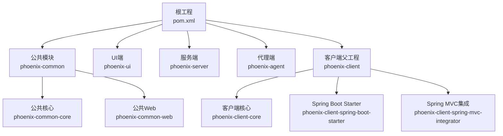
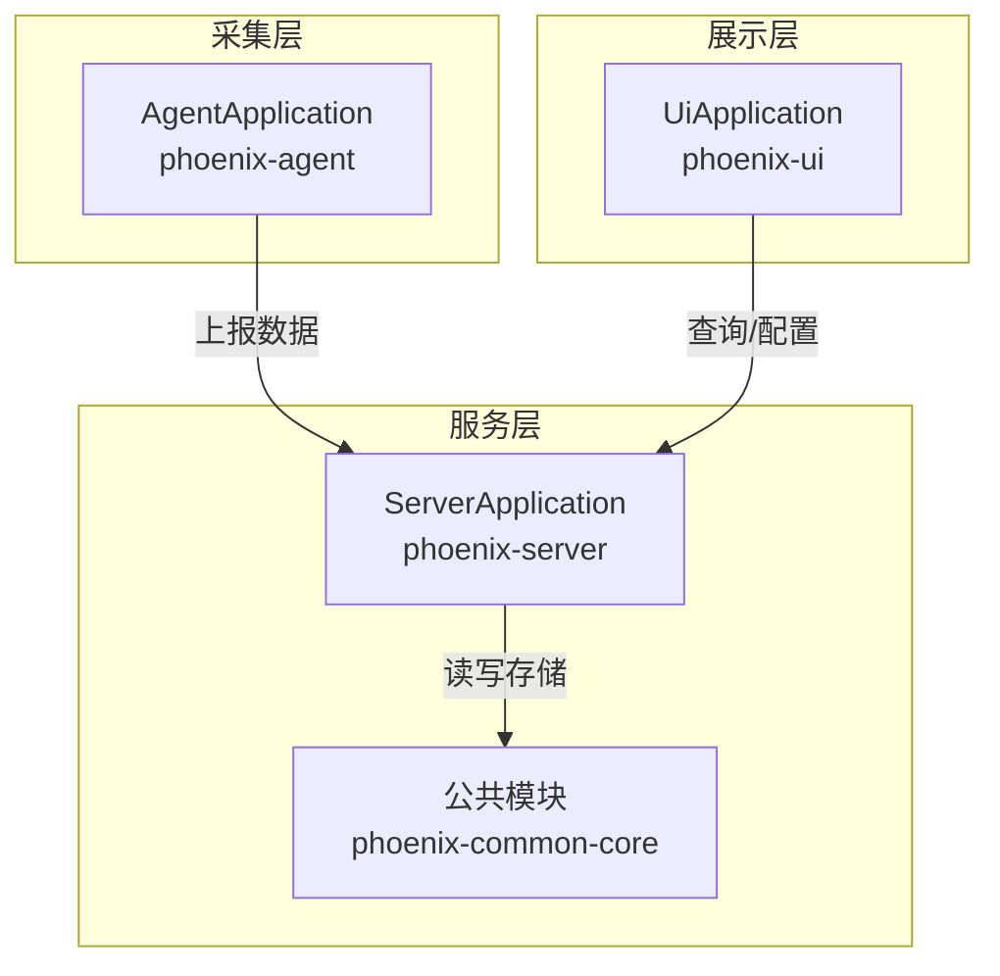
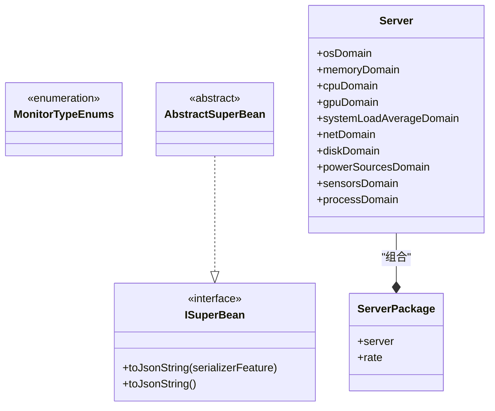
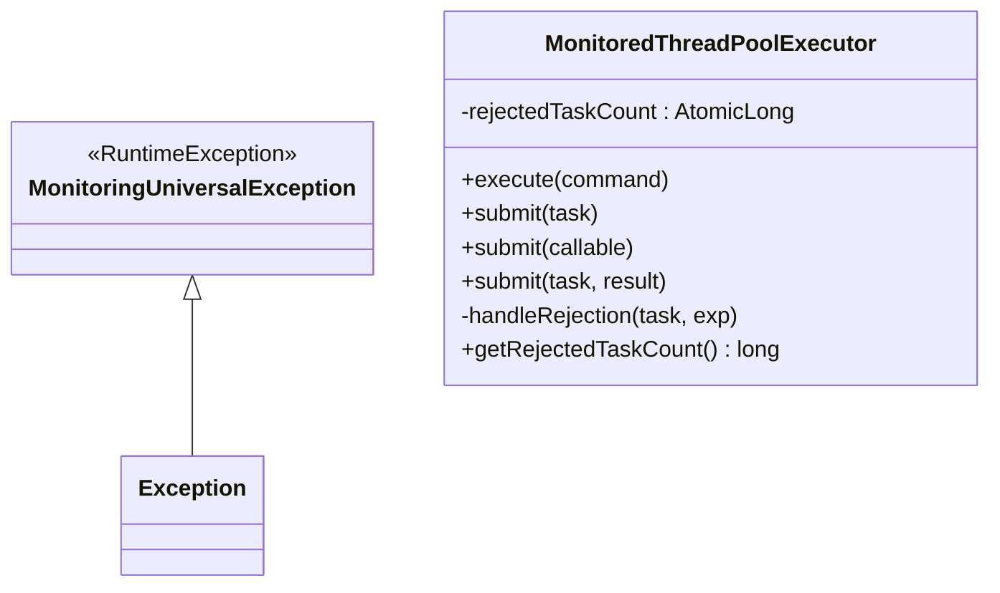
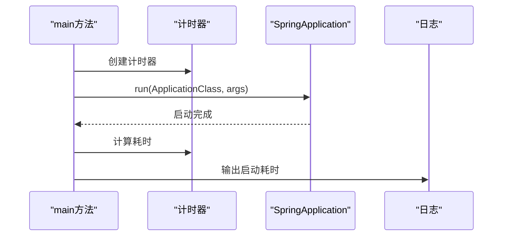
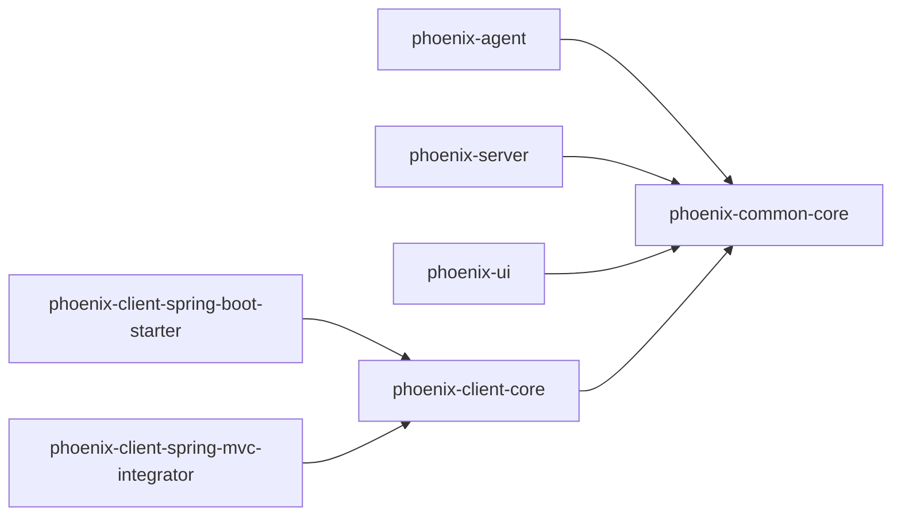

# 代码规范与最佳实践

<cite>
**本文档引用的文件**
- [pom.xml](file://pom.xml)
- [MonitorTypeEnums.java](file://phoenix-common/phoenix-common-core/src/main/java/com/gitee/pifeng/monitoring/common/constant/MonitorTypeEnums.java)
- [Server.java](file://phoenix-common/phoenix-common-core/src/main/java/com/gitee/pifeng/monitoring/common/domain/Server.java)
- [ServerPackage.java](file://phoenix-common/phoenix-common-core/src/main/java/com/gitee/pifeng/monitoring/common/dto/ServerPackage.java)
- [MonitoringUniversalException.java](file://phoenix-common/phoenix-common-core/src/main/java/com/gitee/pifeng/monitoring/common/exception/MonitoringUniversalException.java)
- [AbstractSuperBean.java](file://phoenix-common/phoenix-common-core/src/main/java/com/gitee/pifeng/monitoring/common/abs/AbstractSuperBean.java)
- [ISuperBean.java](file://phoenix-common/phoenix-common-core/src/main/java/com/gitee/pifeng/monitoring/common/inf/ISuperBean.java)
- [MonitoredThreadPoolExecutor.java](file://phoenix-common/phoenix-common-core/src/main/java/com/gitee/pifeng/monitoring/common/threadpool/MonitoredThreadPoolExecutor.java)
- [AgentApplication.java](file://phoenix-agent/src/main/java/com/gitee/pifeng/monitoring/agent/AgentApplication.java)
- [ServerApplication.java](file://phoenix-server/src/main/java/com/gitee/pifeng/monitoring/server/ServerApplication.java)
- [UiApplication.java](file://phoenix-ui/src/main/java/com/gitee/pifeng/monitoring/ui/UiApplication.java)
</cite>

## 目录
1. [引言](#引言)
2. [项目结构](#项目结构)
3. [核心组件](#核心组件)
4. [架构总览](#架构总览)
5. [详细组件分析](#详细组件分析)
6. [依赖分析](#依赖分析)
7. [性能考虑](#性能考虑)
8. [故障排查指南](#故障排查指南)
9. [结论](#结论)
10. [附录](#附录)

## 引言
本指南面向Phoenix监控系统开发团队，旨在建立统一的Java编码规范与最佳实践，覆盖命名约定、注释规范、模块划分、异常处理、日志使用、安全编码、性能优化以及代码审查要点。文档以实际代码为依据，结合模块化架构与Spring Boot生态，形成可落地的质量基线。

## 项目结构
Phoenix采用多模块Maven聚合工程，包含公共模块、UI端、服务端、代理端与客户端模块。公共模块提供跨模块共享的常量、领域模型、DTO、异常、线程池与工具能力；UI、服务端、代理端分别承担前端展示、后端服务与采集代理职责。

图表来源
- [pom.xml:11-22](file://pom.xml#L11-L22)

章节来源
- [pom.xml:1-785](file://pom.xml#L1-L785)

## 核心组件
- 常量与枚举：统一监控类型枚举，确保类型语义一致。
- 领域模型与数据传输对象：通过抽象父类与接口定义通用行为，提升复用性。
- 异常体系：提供通用运行时异常基类，便于统一处理与传播。
- 线程池监控：自定义受管线程池执行器，增强拒绝策略与可观测性。
- 应用入口：各端均提供标准Spring Boot应用入口，统一启动流程与日志统计。

章节来源
- [MonitorTypeEnums.java:1-49](file://phoenix-common/phoenix-common-core/src/main/java/com/gitee/pifeng/monitoring/common/constant/MonitorTypeEnums.java#L1-L49)
- [Server.java:1-76](file://phoenix-common/phoenix-common-core/src/main/java/com/gitee/pifeng/monitoring/common/domain/Server.java#L1-L76)
- [ServerPackage.java:1-34](file://phoenix-common/phoenix-common-core/src/main/java/com/gitee/pifeng/monitoring/common/dto/ServerPackage.java#L1-L34)
- [MonitoringUniversalException.java:1-31](file://phoenix-common/phoenix-common-core/src/main/java/com/gitee/pifeng/monitoring/common/exception/MonitoringUniversalException.java#L1-L31)
- [AbstractSuperBean.java:1-15](file://phoenix-common/phoenix-common-core/src/main/java/com/gitee/pifeng/monitoring/common/abs/AbstractSuperBean.java#L1-L15)
- [ISuperBean.java:1-44](file://phoenix-common/phoenix-common-core/src/main/java/com/gitee/pifeng/monitoring/common/inf/ISuperBean.java#L1-L44)
- [MonitoredThreadPoolExecutor.java:1-213](file://phoenix-common/phoenix-common-core/src/main/java/com/gitee/pifeng/monitoring/common/threadpool/MonitoredThreadPoolExecutor.java#L1-L213)
- [AgentApplication.java:1-40](file://phoenix-agent/src/main/java/com/gitee/pifeng/monitoring/agent/AgentApplication.java#L1-L40)
- [ServerApplication.java:1-48](file://phoenix-server/src/main/java/com/gitee/pifeng/monitoring/server/ServerApplication.java#L1-L48)
- [UiApplication.java:1-49](file://phoenix-ui/src/main/java/com/gitee/pifeng/monitoring/ui/UiApplication.java#L1-L49)

## 架构总览
系统采用“采集代理-服务端-UI”的三层架构。采集代理负责指标采集与上报；服务端负责接收、存储与计算；UI负责展示与配置。公共模块提供跨层共享的模型、常量与基础设施。

图表来源
- [AgentApplication.java:28](file://phoenix-agent/src/main/java/com/gitee/pifeng/monitoring/agent/AgentApplication.java#L28)
- [ServerApplication.java:36](file://phoenix-server/src/main/java/com/gitee/pifeng/monitoring/server/ServerApplication.java#L36)
- [UiApplication.java:37](file://phoenix-ui/src/main/java/com/gitee/pifeng/monitoring/ui/UiApplication.java#L37)

## 详细组件分析

### 组件A：监控类型与领域模型
- 监控类型枚举集中定义，保证类型一致性与扩展性。
- 领域模型通过抽象父类与接口定义通用行为（如JSON序列化），降低重复实现成本。
- DTO承载传输数据，明确字段含义与用途。

图表来源
- [MonitorTypeEnums.java:11-48](file://phoenix-common/phoenix-common-core/src/main/java/com/gitee/pifeng/monitoring/common/constant/MonitorTypeEnums.java#L11-L48)
- [AbstractSuperBean.java:13](file://phoenix-common/phoenix-common-core/src/main/java/com/gitee/pifeng/monitoring/common/abs/AbstractSuperBean.java#L13)
- [ISuperBean.java:14-43](file://phoenix-common/phoenix-common-core/src/main/java/com/gitee/pifeng/monitoring/common/inf/ISuperBean.java#L14-L43)
- [Server.java:23](file://phoenix-common/phoenix-common-core/src/main/java/com/gitee/pifeng/monitoring/common/domain/Server.java#L23)
- [ServerPackage.java:21](file://phoenix-common/phoenix-common-core/src/main/java/com/gitee/pifeng/monitoring/common/dto/ServerPackage.java#L21)

章节来源
- [MonitorTypeEnums.java:1-49](file://phoenix-common/phoenix-common-core/src/main/java/com/gitee/pifeng/monitoring/common/constant/MonitorTypeEnums.java#L1-L49)
- [Server.java:1-76](file://phoenix-common/phoenix-common-core/src/main/java/com/gitee/pifeng/monitoring/common/domain/Server.java#L1-L76)
- [ServerPackage.java:1-34](file://phoenix-common/phoenix-common-core/src/main/java/com/gitee/pifeng/monitoring/common/dto/ServerPackage.java#L1-L34)
- [AbstractSuperBean.java:1-15](file://phoenix-common/phoenix-common-core/src/main/java/com/gitee/pifeng/monitoring/common/abs/AbstractSuperBean.java#L1-L15)
- [ISuperBean.java:1-44](file://phoenix-common/phoenix-common-core/src/main/java/com/gitee/pifeng/monitoring/common/inf/ISuperBean.java#L1-L44)

### 组件B：异常处理与线程池监控
- 通用异常类提供标准构造，便于统一捕获与日志记录。
- 受管线程池执行器在任务拒绝时进行计数与日志记录，便于容量与稳定性观测。

图表来源
- [MonitoringUniversalException.java:11-30](file://phoenix-common/phoenix-common-core/src/main/java/com/gitee/pifeng/monitoring/common/exception/MonitoringUniversalException.java#L11-L30)
- [MonitoredThreadPoolExecutor.java:18-212](file://phoenix-common/phoenix-common-core/src/main/java/com/gitee/pifeng/monitoring/common/threadpool/MonitoredThreadPoolExecutor.java#L18-L212)

章节来源
- [MonitoringUniversalException.java:1-31](file://phoenix-common/phoenix-common-core/src/main/java/com/gitee/pifeng/monitoring/common/exception/MonitoringUniversalException.java#L1-L31)
- [MonitoredThreadPoolExecutor.java:1-213](file://phoenix-common/phoenix-common-core/src/main/java/com/gitee/pifeng/monitoring/common/threadpool/MonitoredThreadPoolExecutor.java#L1-L213)

### 组件C：应用入口与启动流程
- 各端应用入口统一使用Spring Boot启动，内置计时与日志输出，便于启动性能观测。

图表来源
- [AgentApplication.java:30-37](file://phoenix-agent/src/main/java/com/gitee/pifeng/monitoring/agent/AgentApplication.java#L30-L37)
- [ServerApplication.java:38-45](file://phoenix-server/src/main/java/com/gitee/pifeng/monitoring/server/ServerApplication.java#L38-L45)
- [UiApplication.java:39-46](file://phoenix-ui/src/main/java/com/gitee/pifeng/monitoring/ui/UiApplication.java#L39-L46)

章节来源
- [AgentApplication.java:1-40](file://phoenix-agent/src/main/java/com/gitee/pifeng/monitoring/agent/AgentApplication.java#L1-L40)
- [ServerApplication.java:1-48](file://phoenix-server/src/main/java/com/gitee/pifeng/monitoring/server/ServerApplication.java#L1-L48)
- [UiApplication.java:1-49](file://phoenix-ui/src/main/java/com/gitee/pifeng/monitoring/ui/UiApplication.java#L1-L49)

## 依赖分析
- 模块间依赖：UI、服务端、代理端均依赖公共模块；客户端子模块依赖公共模块与Spring生态。
- 外部依赖：统一由根POM管理，确保版本一致性与可维护性。

图表来源
- [pom.xml:11-22](file://pom.xml#L11-L22)

章节来源
- [pom.xml:132-392](file://pom.xml#L132-L392)

## 性能考虑
- 线程池管理：优先使用受管线程池执行器，开启拒绝计数与日志，便于容量评估与告警。
- 启动性能：通过应用入口的计时逻辑，持续监控启动耗时，定位启动瓶颈。
- 序列化开销：统一使用接口默认JSON序列化方法，避免重复实现带来的性能差异。

章节来源
- [MonitoredThreadPoolExecutor.java:18-212](file://phoenix-common/phoenix-common-core/src/main/java/com/gitee/pifeng/monitoring/common/threadpool/MonitoredThreadPoolExecutor.java#L18-L212)
- [AgentApplication.java:30-37](file://phoenix-agent/src/main/java/com/gitee/pifeng/monitoring/agent/AgentApplication.java#L30-L37)
- [ServerApplication.java:38-45](file://phoenix-server/src/main/java/com/gitee/pifeng/monitoring/server/ServerApplication.java#L38-L45)
- [UiApplication.java:39-46](file://phoenix-ui/src/main/java/com/gitee/pifeng/monitoring/ui/UiApplication.java#L39-L46)
- [ISuperBean.java:26-41](file://phoenix-common/phoenix-common-core/src/main/java/com/gitee/pifeng/monitoring/common/inf/ISuperBean.java#L26-L41)

## 故障排查指南
- 异常分类与传播：使用通用异常类作为统一基类，便于全局拦截与日志记录。
- 拒绝任务观测：受管线程池在任务被拒绝时增加计数并记录错误日志，便于定位过载与配置问题。
- 启动耗时分析：通过应用入口的日志输出，快速识别启动阶段的性能问题。

章节来源
- [MonitoringUniversalException.java:11-30](file://phoenix-common/phoenix-common-core/src/main/java/com/gitee/pifeng/monitoring/common/exception/MonitoringUniversalException.java#L11-L30)
- [MonitoredThreadPoolExecutor.java:194-197](file://phoenix-common/phoenix-common-core/src/main/java/com/gitee/pifeng/monitoring/common/threadpool/MonitoredThreadPoolExecutor.java#L194-L197)
- [AgentApplication.java:30-37](file://phoenix-agent/src/main/java/com/gitee/pifeng/monitoring/agent/AgentApplication.java#L30-L37)
- [ServerApplication.java:38-45](file://phoenix-server/src/main/java/com/gitee/pifeng/monitoring/server/ServerApplication.java#L38-L45)
- [UiApplication.java:39-46](file://phoenix-ui/src/main/java/com/gitee/pifeng/monitoring/ui/UiApplication.java#L39-L46)

## 结论
本指南基于Phoenix现有代码与模块结构，提出了统一的编码规范与最佳实践建议。建议在后续迭代中逐步完善注释规范、安全与日志策略，并将线程池与异常处理经验沉淀为通用工具与文档，持续提升系统质量与可维护性。

## 附录

### Java编码规范（命名与格式）
- 类名：采用帕斯卡命名法，使用名词或复合词，体现职责边界。
- 方法名：采用驼峰命名法，使用动词短语，表达意图。
- 变量名：采用驼峰命名法，避免缩写，必要时使用领域内通用缩写。
- 常量名：全部大写，单词以下划线分隔，区分于成员变量。
- 包名：采用反向域名，按模块与层次细分。
- 缩进与括号：统一使用4空格缩进，左花括号独占一行，控制结构与方法体保持一致风格。
- 空行：方法之间保留空行，逻辑分组清晰；类内部按职责分组，组间空行分隔。

### 注释规范
- 类注释：说明类职责、适用场景、关键行为与注意事项。
- 字段注释：简述字段含义、取值范围与约束。
- 方法注释：描述输入、输出、异常、副作用与调用注意事项。
- 包注释：概述包职责、对外接口与使用指引。

### 模块划分原则
- 单一职责：每个模块聚焦特定领域或层次。
- 低耦合高内聚：模块间通过清晰接口交互，避免直接依赖细节。
- 可替换性：公共能力下沉至公共模块，UI/服务端/代理端仅依赖公共接口。
- 接口先行：先定义接口，再实现具体模块，便于测试与替换。

### 异常处理最佳实践
- 分类与命名：按业务与技术维度分类，异常类名清晰表达失败原因。
- 抛出时机：在职责边界处尽早发现并抛出，避免吞掉异常。
- 日志记录：记录异常堆栈与上下文信息，便于定位问题。
- 统一处理：通过全局异常处理器统一处理，保证响应格式一致。

### 日志使用规范
- 级别选择：ERROR记录错误，WARN记录潜在风险，INFO记录关键流程，DEBUG记录调试细节。
- 格式统一：统一日志格式与字段，便于检索与分析。
- 敏感信息脱敏：对密码、令牌等敏感字段进行脱敏处理。

### 安全编码要求
- SQL注入防护：使用参数化查询或ORM映射，避免拼接SQL。
- XSS防护：对输出内容进行HTML转义或白名单过滤。
- 输入验证：在边界处进行严格的参数校验与长度限制。

### 性能优化建议
- 内存管理：避免对象频繁创建与大对象持有，及时释放资源。
- 并发处理：合理设置线程池大小与队列策略，监控拒绝与排队情况。
- 资源释放：使用try-with-resources或finally确保资源释放。

### 代码审查清单
- 命名与注释：类/方法/变量命名是否清晰，注释是否完整。
- 模块与接口：模块划分是否合理，接口设计是否清晰。
- 异常与日志：异常处理是否恰当，日志是否充分。
- 安全与健壮性：输入校验、SQL与XSS防护是否到位。
- 性能与资源：是否存在内存泄漏、阻塞与资源未释放。
- 测试与文档：是否补充单元测试与相关文档。