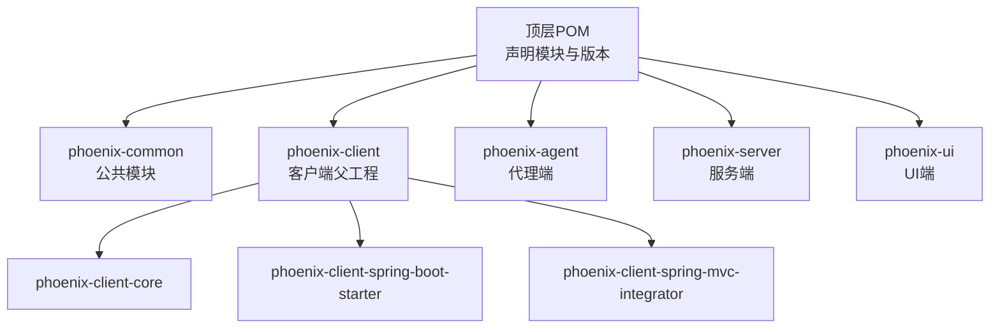
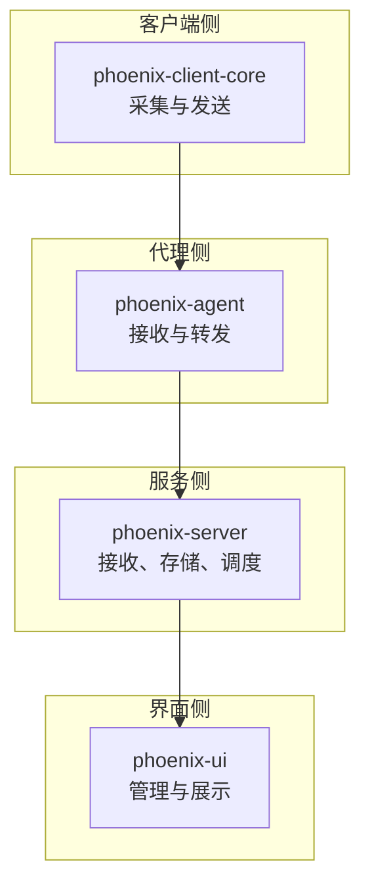
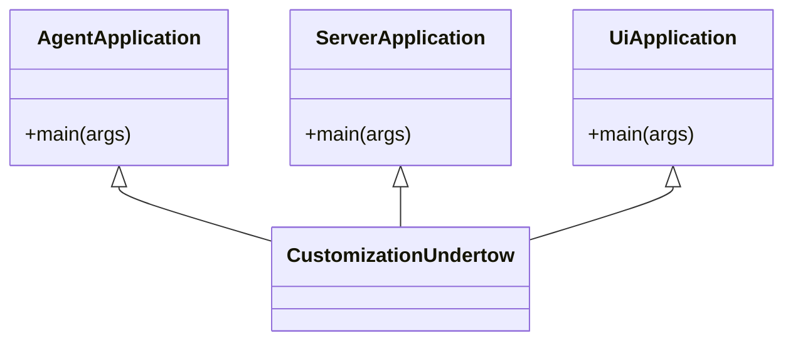
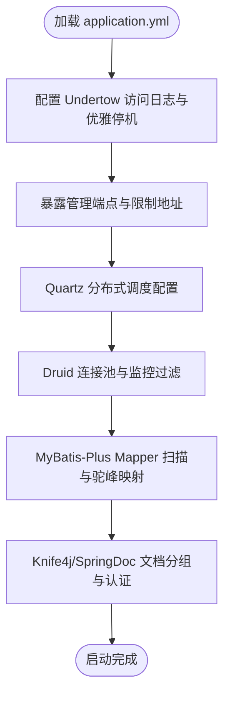
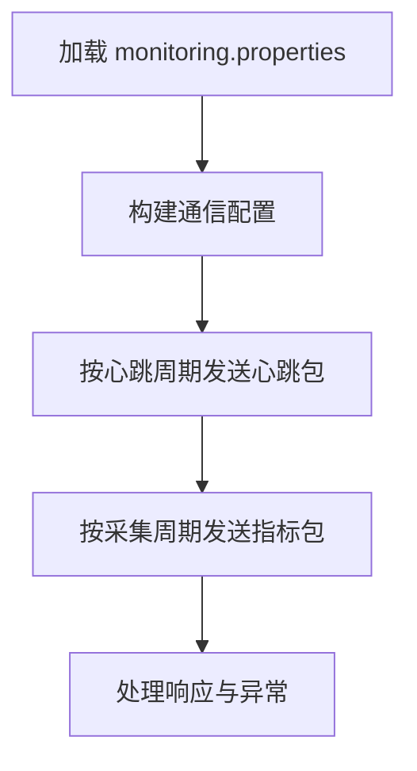
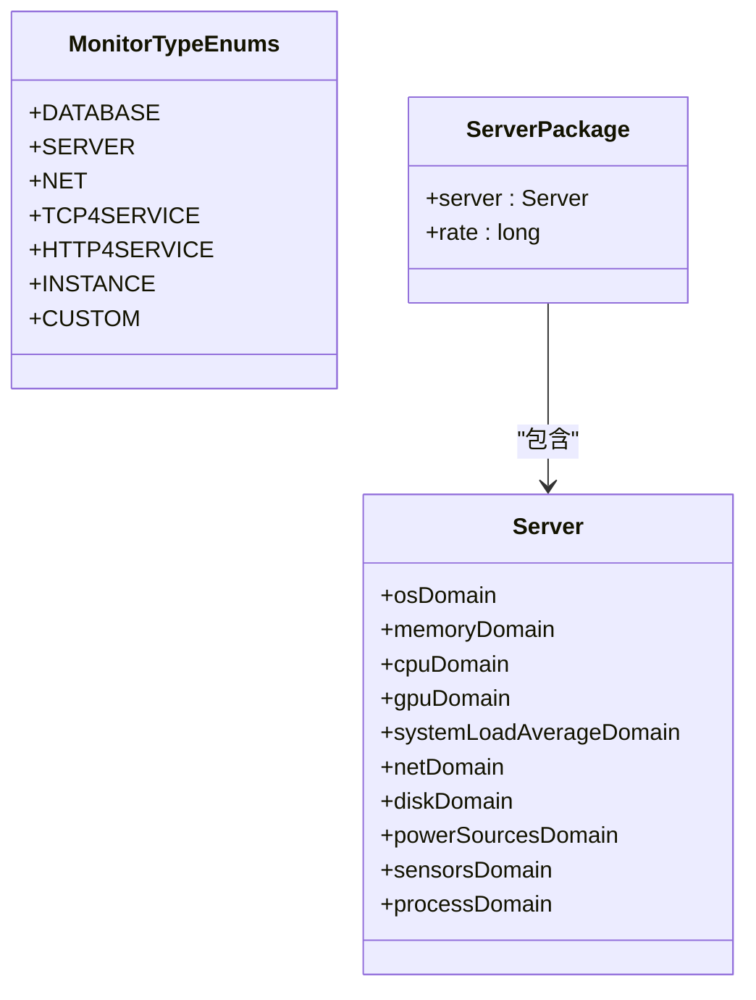
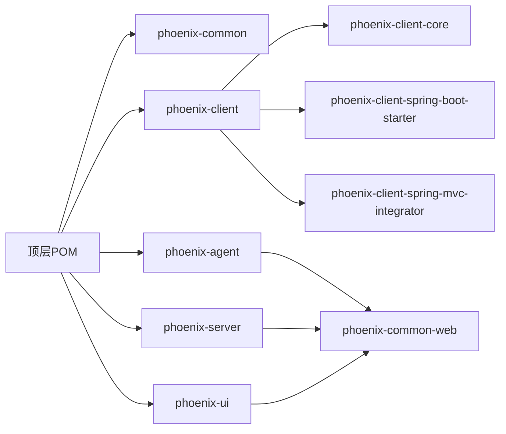

# 开发指南

<cite>
**本文档引用的文件**
- [pom.xml](file://pom.xml)
- [.mvn\wrapper\maven-wrapper.properties](file://.mvn/wrapper/maven-wrapper.properties)
- [phoenix-agent\pom.xml](file://phoenix-agent/pom.xml)
- [phoenix-server\pom.xml](file://phoenix-server/pom.xml)
- [phoenix-ui\pom.xml](file://phoenix-ui/pom.xml)
- [phoenix-client\phoenix-client-core\pom.xml](file://phoenix-client/phoenix-client-core/pom.xml)
- [phoenix-common\phoenix-common-core\pom.xml](file://phoenix-common/phoenix-common-core/pom.xml)
- [phoenix-agent\src\main\resources\application.yml](file://phoenix-agent/src/main/resources/application.yml)
- [phoenix-server\src\main\resources\application.yml](file://phoenix-server/src/main/resources/application.yml)
- [phoenix-ui\src\main\resources\application.yml](file://phoenix-ui/src/main/resources/application.yml)
- [phoenix-client\phoenix-client-core\src\main\resources\monitoring.properties](file://phoenix-client/phoenix-client-core/src/main/resources/monitoring.properties)
- [phoenix-agent\src\main\java\com\gitee\pifeng\monitoring\agent\AgentApplication.java](file://phoenix-agent/src/main/java/com/gitee/pifeng/monitoring/agent/AgentApplication.java)
- [phoenix-server\src\main\java\com\gitee\pifeng\monitoring\server\ServerApplication.java](file://phoenix-server/src/main/java/com/gitee/pifeng/monitoring/server/ServerApplication.java)
- [phoenix-ui\src\main\java\com\gitee\pifeng\monitoring\ui\UiApplication.java](file://phoenix-ui/src/main/java/com/gitee/pifeng/monitoring/ui/UiApplication.java)
- [phoenix-common\phoenix-common-core\src\main\java\com\gitee\pifeng\monitoring\common\constant\MonitorTypeEnums.java](file://phoenix-common/phoenix-common-core/src/main/java/com/gitee/pifeng/monitoring/common/constant/MonitorTypeEnums.java)
- [phoenix-common\phoenix-common-core\src\main\java\com\gitee\pifeng\monitoring\common\domain\Server.java](file://phoenix-common/phoenix-common-core/src/main/java/com/gitee/pifeng/monitoring/common/domain/Server.java)
- [phoenix-common\phoenix-common-core\src\main\java\com\gitee\pifeng\monitoring\common\dto\ServerPackage.java](file://phoenix-common/phoenix-common-core/src/main/java/com/gitee/pifeng/monitoring/common/dto/ServerPackage.java)
</cite>

## 目录
1. [简介](#简介)
2. [项目结构](#项目结构)
3. [核心组件](#核心组件)
4. [架构总览](#架构总览)
5. [详细组件分析](#详细组件分析)
6. [依赖关系分析](#依赖关系分析)
7. [性能考量](#性能考量)
8. [故障排查指南](#故障排查指南)
9. [结论](#结论)
10. [附录](#附录)

## 简介
Phoenix 监控系统是一个基于 Spring Boot 的多模块监控平台，包含监控客户端、代理端、服务端与 UI 端四大核心模块，配合公共模块提供统一的数据模型、常量与基础设施。系统采用 Undertow 作为 Web 服务器，集成 Knife4j/SpringDoc OpenAPI 提供接口文档，使用 Druid 连接池与 MyBatis-Plus 进行数据访问，支持定时任务与缓存策略，并通过 Maven 插件实现打包、Docker 化与覆盖率统计。

## 项目结构
项目采用父子 POM 结构，顶层 POM 声明模块与统一依赖版本，各子模块独立构建与打包。关键模块与职责如下：
- phoenix-common：公共模块，包含通用常量、领域模型、DTO、异常体系与通用 Web 组件。
- phoenix-client：客户端父工程，包含客户端核心模块与 Spring Boot Starter/Integrator。
- phoenix-agent：监控代理端，负责采集与上报监控数据。
- phoenix-server：监控服务端，负责接收、存储与处理监控数据。
- phoenix-ui：监控 UI 端，提供可视化界面与管理功能。

图表来源
- [pom.xml:11-22](file://pom.xml#L11-L22)
- [phoenix-agent\pom.xml:8-13](file://phoenix-agent/pom.xml#L8-L13)
- [phoenix-server\pom.xml:8-13](file://phoenix-server/pom.xml#L8-L13)
- [phoenix-ui\pom.xml:8-13](file://phoenix-ui/pom.xml#L8-L13)
- [phoenix-client\phoenix-client-core\pom.xml:8-13](file://phoenix-client/phoenix-client-core/pom.xml#L8-L13)

章节来源
- [pom.xml:11-22](file://pom.xml#L11-L22)
- [phoenix-agent\pom.xml:8-13](file://phoenix-agent/pom.xml#L8-L13)
- [phoenix-server\pom.xml:8-13](file://phoenix-server/pom.xml#L8-L13)
- [phoenix-ui\pom.xml:8-13](file://phoenix-ui/pom.xml#L8-L13)
- [phoenix-client\phoenix-client-core\pom.xml:8-13](file://phoenix-client/phoenix-client-core/pom.xml#L8-L13)

## 核心组件
- 启动类与容器定制
  - 代理端、服务端、UI 端均通过各自的 Application 类启动，继承统一的 Undertow 定制器，启用重试、缓存、事务与 AOP 等能力。
- 配置与运行时
  - 各模块通过 application.yml 配置 Undertow 访问日志、优雅停机、管理端点、Knife4j 文档、缓存、Quartz 调度、Druid 监控与 MyBatis-Plus 等。
- 客户端配置
  - 客户端通过 monitoring.properties 配置加密算法、HTTP 通信地址、实例信息、心跳与采集周期等。
- 公共模型
  - MonitorTypeEnums 定义监控类型；Server 与 ServerPackage 提供服务器信息与传输包结构。

章节来源
- [phoenix-agent\src\main\java\com\gitee\pifeng\monitoring\agent\AgentApplication.java:28-37](file://phoenix-agent/src/main/java/com/gitee/pifeng/monitoring/agent/AgentApplication.java#L28-L37)
- [phoenix-server\src\main\java\com\gitee\pifeng\monitoring\server\ServerApplication.java:36-45](file://phoenix-server/src/main/java/com/gitee/pifeng/monitoring/server/ServerApplication.java#L36-L45)
- [phoenix-ui\src\main\java\com\gitee\pifeng\monitoring\ui\UiApplication.java:37-46](file://phoenix-ui/src/main/java/com/gitee/pifeng/monitoring/ui/UiApplication.java#L37-L46)
- [phoenix-agent\src\main\resources\application.yml:1-111](file://phoenix-agent/src/main/resources/application.yml#L1-L111)
- [phoenix-server\src\main\resources\application.yml:1-271](file://phoenix-server/src/main/resources/application.yml#L1-L271)
- [phoenix-ui\src\main\resources\application.yml:1-238](file://phoenix-ui/src/main/resources/application.yml#L1-L238)
- [phoenix-client\phoenix-client-core\src\main\resources\monitoring.properties:1-41](file://phoenix-client/phoenix-client-core/src/main/resources/monitoring.properties#L1-L41)
- [phoenix-common\phoenix-common-core\src\main\java\com\gitee\pifeng\monitoring\common\constant\MonitorTypeEnums.java:11-48](file://phoenix-common/phoenix-common-core/src/main/java/com/gitee/pifeng/monitoring/common/constant/MonitorTypeEnums.java#L11-L48)
- [phoenix-common\phoenix-common-core\src\main\java\com\gitee\pifeng\monitoring\common\domain\Server.java:23-75](file://phoenix-common/phoenix-common-core/src/main/java/com/gitee/pifeng/monitoring/common/domain/Server.java#L23-L75)
- [phoenix-common\phoenix-common-core\src\main\java\com\gitee\pifeng\monitoring\common\dto\ServerPackage.java:21-33](file://phoenix-common/phoenix-common-core/src/main/java/com/gitee/pifeng/monitoring/common/dto/ServerPackage.java#L21-L33)

## 架构总览
系统采用“客户端采集 -> 代理端汇聚 -> 服务端处理与存储 -> UI 可视化”的链路，公共模块提供统一的数据模型与基础设施。

图表来源
- [pom.xml:11-22](file://pom.xml#L11-L22)
- [phoenix-agent\pom.xml:27-37](file://phoenix-agent/pom.xml#L27-L37)
- [phoenix-server\pom.xml:27-101](file://phoenix-server/pom.xml#L27-L101)
- [phoenix-ui\pom.xml:27-116](file://phoenix-ui/pom.xml#L27-L116)

## 详细组件分析

### 组件A：启动与容器配置
- 代理端、服务端、UI 端均通过 Application 类启动，启用 Undertow 定制、重试、缓存、事务与 AOP，确保高可用与可维护性。
- 启动类示例路径：
  - [AgentApplication.java:30-37](file://phoenix-agent/src/main/java/com/gitee/pifeng/monitoring/agent/AgentApplication.java#L30-L37)
  - [ServerApplication.java:38-45](file://phoenix-server/src/main/java/com/gitee/pifeng/monitoring/server/ServerApplication.java#L38-L45)
  - [UiApplication.java:39-46](file://phoenix-ui/src/main/java/com/gitee/pifeng/monitoring/ui/UiApplication.java#L39-L46)

图表来源
- [phoenix-agent\src\main\java\com\gitee\pifeng\monitoring\agent\AgentApplication.java:28-37](file://phoenix-agent/src/main/java/com/gitee/pifeng/monitoring/agent/AgentApplication.java#L28-L37)
- [phoenix-server\src\main\java\com\gitee\pifeng\monitoring\server\ServerApplication.java:36-45](file://phoenix-server/src/main/java/com/gitee/pifeng/monitoring/server/ServerApplication.java#L36-L45)
- [phoenix-ui\src\main\java\com\gitee\pifeng\monitoring\ui\UiApplication.java:37-46](file://phoenix-ui/src/main/java/com/gitee/pifeng/monitoring/ui/UiApplication.java#L37-L46)

章节来源
- [phoenix-agent\src\main\java\com\gitee\pifeng\monitoring\agent\AgentApplication.java:28-37](file://phoenix-agent/src/main/java/com/gitee/pifeng/monitoring/agent/AgentApplication.java#L28-L37)
- [phoenix-server\src\main\java\com\gitee\pifeng\monitoring\server\ServerApplication.java:36-45](file://phoenix-server/src/main/java/com/gitee/pifeng/monitoring/server/ServerApplication.java#L36-L45)
- [phoenix-ui\src\main\java\com\gitee\pifeng\monitoring\ui\UiApplication.java:37-46](file://phoenix-ui/src/main/java/com/gitee/pifeng/monitoring/ui/UiApplication.java#L37-L46)

### 组件B：配置与运行时（以服务端为例）
- Undertow 访问日志、优雅停机、管理端点暴露。
- Quartz 分布式调度、Druid 连接池与监控、MyBatis-Plus Mapper 扫描与驼峰映射。
- Knife4j/SpringDoc 文档分组与 Basic 认证。

图表来源
- [phoenix-server\src\main\resources\application.yml:1-271](file://phoenix-server/src/main/resources/application.yml#L1-L271)

章节来源
- [phoenix-server\src\main\resources\application.yml:1-271](file://phoenix-server/src/main/resources/application.yml#L1-L271)

### 组件C：客户端配置与通信
- monitoring.properties 提供加密算法、HTTP 通信地址、实例信息、心跳与采集周期等关键参数。
- 客户端模块通过 HTTP 客户端发送数据包至服务端或代理端。

图表来源
- [phoenix-client\phoenix-client-core\src\main\resources\monitoring.properties:1-41](file://phoenix-client/phoenix-client-core/src/main/resources/monitoring.properties#L1-L41)

章节来源
- [phoenix-client\phoenix-client-core\src\main\resources\monitoring.properties:1-41](file://phoenix-client/phoenix-client-core/src/main/resources/monitoring.properties#L1-L41)

### 组件D：公共模型与数据传输
- MonitorTypeEnums 定义监控类型枚举，便于统一识别与处理。
- Server 与 ServerPackage 提供服务器信息与传输包结构，支撑跨模块数据交换。

图表来源
- [phoenix-common\phoenix-common-core\src\main\java\com\gitee\pifeng\monitoring\common\constant\MonitorTypeEnums.java:11-48](file://phoenix-common/phoenix-common-core/src/main/java/com/gitee/pifeng/monitoring/common/constant/MonitorTypeEnums.java#L11-L48)
- [phoenix-common\phoenix-common-core\src\main\java\com\gitee\pifeng\monitoring\common\domain\Server.java:23-75](file://phoenix-common/phoenix-common-core/src/main/java/com/gitee/pifeng/monitoring/common/domain/Server.java#L23-L75)
- [phoenix-common\phoenix-common-core\src\main\java\com\gitee\pifeng\monitoring\common\dto\ServerPackage.java:21-33](file://phoenix-common/phoenix-common-core/src/main/java/com/gitee/pifeng/monitoring/common/dto/ServerPackage.java#L21-L33)

章节来源
- [phoenix-common\phoenix-common-core\src\main\java\com\gitee\pifeng\monitoring\common\constant\MonitorTypeEnums.java:11-48](file://phoenix-common/phoenix-common-core/src/main/java/com/gitee/pifeng/monitoring/common/constant/MonitorTypeEnums.java#L11-L48)
- [phoenix-common\phoenix-common-core\src\main\java\com\gitee\pifeng\monitoring\common\domain\Server.java:23-75](file://phoenix-common/phoenix-common-core/src/main/java/com/gitee/pifeng/monitoring/common/domain/Server.java#L23-L75)
- [phoenix-common\phoenix-common-core\src\main\java\com\gitee\pifeng\monitoring\common\dto\ServerPackage.java:21-33](file://phoenix-common/phoenix-common-core/src/main/java/com/gitee/pifeng/monitoring/common/dto/ServerPackage.java#L21-L33)

## 依赖关系分析
- 顶层 POM 统一管理版本与插件，子模块按需引入公共依赖。
- 代理端、服务端、UI 端均依赖公共 Web 模块与客户端 Starter，体现模块复用与解耦。

图表来源
- [pom.xml:132-392](file://pom.xml#L132-L392)
- [phoenix-agent\pom.xml:27-37](file://phoenix-agent/pom.xml#L27-L37)
- [phoenix-server\pom.xml:27-37](file://phoenix-server/pom.xml#L27-L37)
- [phoenix-ui\pom.xml:27-37](file://phoenix-ui/pom.xml#L27-L37)

章节来源
- [pom.xml:132-392](file://pom.xml#L132-L392)
- [phoenix-agent\pom.xml:27-37](file://phoenix-agent/pom.xml#L27-L37)
- [phoenix-server\pom.xml:27-37](file://phoenix-server/pom.xml#L27-L37)
- [phoenix-ui\pom.xml:27-37](file://phoenix-ui/pom.xml#L27-L37)

## 性能考量
- Undertow 访问日志与优雅停机：提升可观测性与平滑重启能力。
- Quartz 分布式调度：通过集群配置与线程池参数保障定时任务稳定性。
- Druid 连接池：合理配置初始大小、最大活跃数、超时与慢 SQL 监控，结合 AOP 与过滤器统计。
- MyBatis-Plus 驼峰映射与 Mapper 扫描：减少 SQL 映射成本，提升查询效率。
- 缓存策略：启用 Caffeine 缓存，降低重复查询压力。

章节来源
- [phoenix-server\src\main\resources\application.yml:68-101](file://phoenix-server/src/main/resources/application.yml#L68-L101)
- [phoenix-server\src\main\resources\application.yml:117-184](file://phoenix-server/src/main/resources/application.yml#L117-L184)
- [phoenix-server\src\main\resources\application.yml:187-217](file://phoenix-server/src/main/resources/application.yml#L187-L217)
- [phoenix-server\src\main\resources\application.yml:39-43](file://phoenix-server/src/main/resources/application.yml#L39-L43)

## 故障排查指南
- 启动耗时与日志
  - 启动类内置计时器输出启动耗时，便于定位启动慢问题。
  - 各模块 application.yml 已配置 Undertow 访问日志目录与级别，建议优先检查日志。
- 管理端点与文档
  - 仅本地暴露管理端点，确认地址限制与 Basic 认证配置。
  - Knife4j/SpringDoc 文档分组与认证，便于快速验证接口连通性。
- 数据库与连接池
  - Druid 监控页面与慢 SQL 配置，结合 AOP 统计定位热点接口。
- 客户端通信
  - monitoring.properties 中 HTTP 超时与目标地址配置，确保与服务端/代理端一致。

章节来源
- [phoenix-agent\src\main\resources\application.yml:1-111](file://phoenix-agent/src/main/resources/application.yml#L1-L111)
- [phoenix-server\src\main\resources\application.yml:220-234](file://phoenix-server/src/main/resources/application.yml#L220-L234)
- [phoenix-ui\src\main\resources\application.yml:188-202](file://phoenix-ui/src/main/resources/application.yml#L188-L202)
- [phoenix-client\phoenix-client-core\src\main\resources\monitoring.properties:10-17](file://phoenix-client/phoenix-client-core/src/main/resources/monitoring.properties#L10-L17)

## 结论
Phoenix 监控系统通过清晰的模块划分、统一的公共基础设施与完善的配置体系，实现了从采集、汇聚、存储到可视化的完整链路。遵循本文档的开发与运维实践，可高效推进功能迭代与稳定性保障。

## 附录

### 开发环境搭建（步骤概览）
- JDK 与 Maven
  - 使用 Maven Wrapper（.mvn/wrapper/maven-wrapper.properties）确保团队统一构建工具版本。
- IDE 配置
  - 导入顶层 POM，启用 Lombok 支持，配置运行配置指向各模块 Application 类。
- Git 工作流
  - 建议采用分支策略（如 develop/release/hotfix），提交信息遵循约定式提交。
- 代码规范与最佳实践
  - Java 编码规范：统一缩进、换行与注释风格；类与方法命名遵循驼峰；常量使用全大写与下划线。
  - 注释规范：类与公共方法需提供中文注释；复杂逻辑补充流程说明。
  - 命名约定：包名为反向域名+模块路径；类名使用名词；方法名使用动词短语；常量全大写。
  - 模块划分原则：按功能域拆分模块，保持低耦合高内聚；公共能力下沉至公共模块。
- 测试策略与框架
  - 单元测试：使用 JUnit 与 Spring Boot Test，覆盖核心逻辑与边界条件。
  - 集成测试：基于 @SpringBootTest 启动上下文，验证模块间交互。
  - 端到端测试：结合 Knife4j 文档与接口测试脚本，验证完整链路。
  - 覆盖率：通过 JaCoCo 插件生成报告，设定阈值并持续改进。
- 调试技巧与工具
  - IDE 调试：断点定位、变量观察、调用栈分析；结合启动参数与 JVM 参数优化。
  - 日志分析：关注 Undertow 访问日志与业务日志级别；使用日志聚合工具集中检索。
  - 性能分析：利用 Druid 监控、Quartz 调度统计与 JVM 监控工具定位瓶颈。
  - 网络抓包：使用 Wireshark 或 tcpdump 抓取服务端/代理端通信数据包。
- 贡献指南与 Pull Request 流程
  - Fork 仓库 -> 新建分支 -> 提交代码 -> 创建 PR -> 代码评审 -> 合并。
  - PR 描述需包含变更内容、影响范围与测试结果；评审通过后方可合并。
- 持续集成与持续部署
  - CI/CD 管道：构建（Maven）、测试（Surefire/JaCoCo）、打包（Assembly/Docker）、制品发布。
  - 自动化测试：在 CI 中执行单元与集成测试，失败即阻断。
  - 自动化部署：Docker 镜像构建与推送，结合编排工具部署。
- 扩展开发
  - 插件开发：参考客户端 Starter 与 Integrator 的装配机制，提供可选依赖与自动配置。
  - 自定义监控指标：在公共模块定义 DTO 与常量，服务端/代理端实现采集与上报。
  - 第三方集成：通过配置文件与属性类扩展外部系统对接，确保兼容性与可配置性。