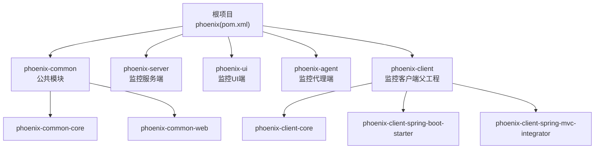
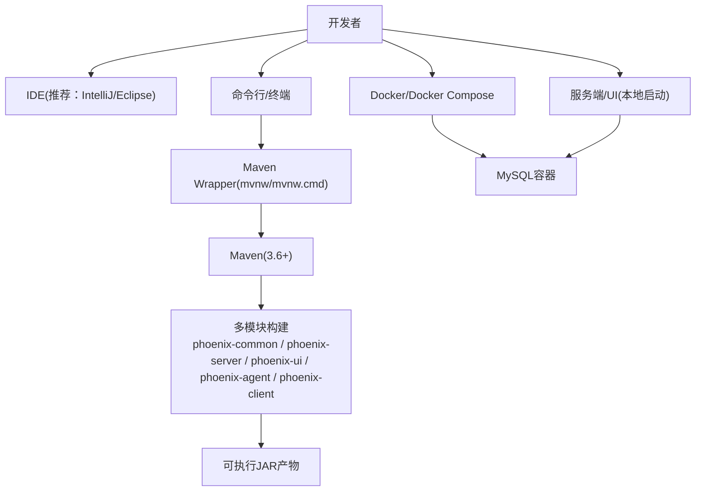
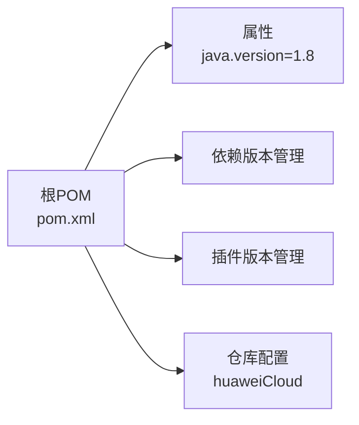

# 开发环境搭建

<cite>
**本文引用的文件**
- [pom.xml](file://pom.xml)
- [.mvn\wrapper\maven-wrapper.properties](file://.mvn\wrapper\maven-wrapper.properties)
- [mvnw.cmd](file://mvnw.cmd)
- [mvnw](file://mvnw)
- [phoenix-agent\src\main\resources\application-dev.yml](file://phoenix-agent\src\main\resources\application-dev.yml)
- [phoenix-server\src\main\resources\application-dev.yml](file://phoenix-server\src\main\resources\application-dev.yml)
- [doc\LinuxServices\download_openjdk.sh](file://doc\LinuxServices\download_openjdk.sh)
- [doc\LinuxServices\download_maven.sh](file://doc\LinuxServices\download_maven.sh)
- [doc\LinuxServices\build_phoenix.sh](file://doc\LinuxServices\build_phoenix.sh)
- [doc\LinuxServices\auto_package.sh](file://doc\LinuxServices\auto_package.sh)
- [doc\Docker\install.sh](file://doc\Docker\install.sh)
- [doc\DockerCompose\install.sh](file://doc\DockerCompose\install.sh)
</cite>

## 目录
1. [简介](#简介)
2. [项目结构](#项目结构)
3. [核心组件](#核心组件)
4. [架构总览](#架构总览)
5. [详细组件分析](#详细组件分析)
6. [依赖关系分析](#依赖关系分析)
7. [性能考虑](#性能考虑)
8. [故障排查指南](#故障排查指南)
9. [结论](#结论)
10. [附录](#附录)

## 简介
本指南面向Phoenix监控系统的开发者，提供从零搭建开发环境的完整步骤，涵盖JDK与Maven安装、IDE推荐配置、Git工作流、项目克隆与初始化、Docker可选配置以及常见问题排查。内容基于仓库中的实际配置文件与脚本进行提炼，确保可操作性与准确性。

## 项目结构
Phoenix采用多模块Maven工程组织，包含公共模块、服务端、UI端、代理端及客户端等子模块。顶层POM定义统一的Java版本、依赖版本与插件配置；各模块拥有独立的资源与打包配置；仓库内提供Windows/Linux脚本与Docker/Docker Compose部署脚本，便于快速搭建运行环境。

图表来源
- [pom.xml](file://pom.xml)

章节来源
- [pom.xml](file://pom.xml)

## 核心组件
- 多模块Maven工程：通过顶层POM统一管理版本与插件，确保跨模块一致性。
- Java版本：顶层属性中声明Java版本为1.8，编译插件按该版本配置。
- Maven Wrapper：提供mvnw/mvnw.cmd封装，自动下载并使用匹配的Maven版本，降低环境差异。
- 开发配置：各模块提供application-dev.yml，包含端口与数据库连接等默认开发参数。
- Docker与Docker Compose：提供一键拉起MySQL、服务端与UI的脚本，便于本地联调。

章节来源
- [pom.xml](file://pom.xml)
- [.mvn\wrapper\maven-wrapper.properties](file://.mvn\wrapper\maven-wrapper.properties)
- [mvnw.cmd](file://mvnw.cmd)
- [mvnw](file://mvnw)
- [phoenix-agent\src\main\resources\application-dev.yml](file://phoenix-agent\src\main\resources\application-dev.yml)
- [phoenix-server\src\main\resources\application-dev.yml](file://phoenix-server\src\main\resources\application-dev.yml)

## 架构总览
下图展示开发环境的关键交互：开发者通过IDE或命令行使用Maven Wrapper构建项目；服务端与UI通过各自application-dev.yml加载默认配置；Docker/Docker Compose脚本负责拉起依赖服务（如MySQL）。

图表来源
- [pom.xml](file://pom.xml)
- [.mvn\wrapper\maven-wrapper.properties](file://.mvn\wrapper\maven-wrapper.properties)
- [mvnw.cmd](file://mvnw.cmd)
- [mvnw](file://mvnw)
- [doc\Docker\install.sh](file://doc\Docker\install.sh)
- [doc\DockerCompose\install.sh](file://doc\DockerCompose\install.sh)

章节来源
- [pom.xml](file://pom.xml)
- [.mvn\wrapper\maven-wrapper.properties](file://.mvn\wrapper\maven-wrapper.properties)
- [mvnw.cmd](file://mvnw.cmd)
- [mvnw](file://mvnw)
- [doc\Docker\install.sh](file://doc\Docker\install.sh)
- [doc\DockerCompose\install.sh](file://doc\DockerCompose\install.sh)

## 详细组件分析

### JDK 1.8+ 安装与配置
- 版本要求：顶层POM声明Java版本为1.8，建议使用JDK 1.8或更高兼容版本进行开发与构建。
- 环境变量：需正确设置JAVA_HOME指向JDK安装目录，并将%JAVA_HOME%\bin（Windows）或$JAVA_HOME/bin（Linux/macOS）加入PATH。
- 版本验证：在终端执行java -version与javac -version，确认输出符合预期。
- 仓库脚本参考：Linux环境可通过doc/LinuxServices/download_openjdk.sh下载并解压OpenJDK17至约定目录，作为自动化安装示例。

章节来源
- [pom.xml](file://pom.xml)
- [doc\LinuxServices\download_openjdk.sh](file://doc\LinuxServices\download_openjdk.sh)

### Maven 3.6+ 安装与配置
- 版本要求：推荐使用Maven 3.6+；仓库提供Maven Wrapper，可在无全局Maven安装的情况下完成构建。
- Maven Wrapper：通过mvnw（Linux/macOS）与mvnw.cmd（Windows）自动下载并使用匹配的Maven版本，减少环境差异。
- settings.xml与镜像源：仓库未内置settings.xml，建议在~/.m2/settings.xml中配置阿里云/华为云镜像加速与本地仓库路径，提升依赖下载速度。
- 本地仓库：可将本地仓库指向自定义目录，便于缓存与共享。

章节来源
- [.mvn\wrapper\maven-wrapper.properties](file://.mvn\wrapper\maven-wrapper.properties)
- [mvnw.cmd](file://mvnw.cmd)
- [mvnw](file://mvnw)

### IDE 开发环境推荐配置
- IntelliJ IDEA
  - 插件：推荐安装Lombok、MyBatis Log、Rainbow Brackets、String Manipulation、Statistic等常用插件。
  - 代码格式化：使用Editor -> Code Style，统一Tab宽度与换行符；启用“Optimize imports”与“Reformat on save”。
  - 断点调试：为phoenix-server与phoenix-ui分别配置Spring Boot主类启动参数，开启断点后直接Run/Debug。
- Eclipse
  - 插件：安装Buildship（Gradle支持）、Mylyn、Eclipse Color Theme等。
  - 代码格式化：Preferences -> Java -> Code Style -> Formatter，导入统一风格；启用Save Actions。
  - 断点调试：新建Debug Configuration，选择对应模块主类，设置JVM参数与环境变量。

（本节为通用实践建议，不直接引用具体文件）

### Git 工作流基本配置
- 分支管理：采用功能分支开发（feature/*），主分支（master/main）仅合并稳定版本；发布前创建release分支。
- 提交规范：使用清晰的提交信息（如feat: 新增功能；fix: 修复问题；docs: 文档更新；refactor: 重构）。
- 远程仓库：默认上游仓库为Gitee（见SCM配置），可按需添加GitHub镜像源以提升访问速度。
- 仓库地址：见SCM与开发者信息，便于克隆与贡献。

章节来源
- [pom.xml](file://pom.xml)

### 项目克隆与初始化
- 克隆仓库后，优先使用Maven Wrapper进行构建，避免本地Maven版本不一致导致的问题。
- 初始化步骤建议：
  1) 安装JDK 1.8+并配置JAVA_HOME。
  2) 安装Maven 3.6+或直接使用mvnw/mvnw.cmd。
  3) 在IDE中导入根目录pom.xml为Maven项目。
  4) 使用Maven Wrapper执行clean package，等待依赖下载与编译完成。
  5) 如需本地数据库，可参考phoenix-server/application-dev.yml配置MySQL连接参数。
  6) 启动phoenix-server与phoenix-ui，验证接口与页面可用性。

章节来源
- [pom.xml](file://pom.xml)
- [mvnw.cmd](file://mvnw.cmd)
- [mvnw](file://mvnw)
- [phoenix-server\src\main\resources\application-dev.yml](file://phoenix-server\src\main\resources\application-dev.yml)

### Docker 环境可选配置
- Docker Desktop：安装Docker Desktop（Windows/macOS）或Docker Engine（Linux），确保Docker守护进程正常运行。
- 单容器脚本：doc/Docker/install.sh提供一键拉起MySQL、服务端与UI的远程脚本示例，便于快速验证。
- Docker Compose：doc/DockerCompose/install.sh提供下载compose文件、创建宿主机数据目录、拉取镜像与启动服务的完整流程，适合本地联调。
- 注意事项：脚本会尝试设置UID/GID并创建数据目录，请根据实际需求调整权限与挂载路径。

章节来源
- [doc\Docker\install.sh](file://doc\Docker\install.sh)
- [doc\DockerCompose\install.sh](file://doc\DockerCompose\install.sh)

## 依赖关系分析
- Java版本与编译插件：顶层POM统一声明java.version为1.8，并在maven-compiler-plugin中应用，确保所有模块编译目标一致。
- 依赖版本管理：通过dependencyManagement集中声明第三方依赖版本，避免版本冲突。
- 插件版本管理：通过pluginManagement统一管理构建插件版本，保证CI/CD一致性。
- 仓库与镜像：顶层POM配置华为云Maven仓库作为私有镜像源，提升依赖下载稳定性。

图表来源
- [pom.xml](file://pom.xml)

章节来源
- [pom.xml](file://pom.xml)

## 性能考虑
- 使用Maven Wrapper避免重复下载Maven与插件，减少网络开销。
- 在IDE中启用增量编译与并行构建，缩短编译时间。
- Docker Compose方式可一次性拉起多个服务，减少手动启动成本。
- 本地仓库建议使用SSD盘，提升依赖读写性能。

（本节为通用指导，不直接引用具体文件）

## 故障排查指南
- JAVA_HOME未设置或无效
  - 现象：mvnw/mvnw.cmd提示找不到JAVA_HOME。
  - 处理：检查JAVA_HOME是否指向JDK安装目录，确认%JAVA_HOME%\bin\java.exe（Windows）或$JAVA_HOME/bin/java（Linux/macOS）存在。
- Maven Wrapper无法下载
  - 现象：mvnw/mvnw.cmd无法下载wrapper或Maven。
  - 处理：检查网络连通性与代理设置；可手动下载.mvn/wrapper目录所需文件；或在~/.m2/settings.xml配置镜像源。
- 本地数据库连接失败
  - 现象：服务端启动时报数据库连接异常。
  - 处理：核对phoenix-server/application-dev.yml中的数据库URL、用户名与密码；确保MySQL服务已启动且端口开放。
- Docker启动权限问题
  - 现象：Docker Compose启动后容器权限不足或数据卷不可写。
  - 处理：按脚本逻辑设置宿主机数据目录权限；必要时使用sudo执行脚本；确认UID/GID映射正确。
- 本地JDK/Maven自动化脚本
  - 参考：doc/LinuxServices/download_openjdk.sh、download_maven.sh、build_phoenix.sh、auto_package.sh，按顺序执行可完成JDK/Maven下载、项目构建与产物转移。

章节来源
- [mvnw.cmd](file://mvnw.cmd)
- [mvnw](file://mvnw)
- [phoenix-server\src\main\resources\application-dev.yml](file://phoenix-server\src\main\resources\application-dev.yml)
- [doc\LinuxServices\download_openjdk.sh](file://doc\LinuxServices\download_openjdk.sh)
- [doc\LinuxServices\download_maven.sh](file://doc\LinuxServices\download_maven.sh)
- [doc\LinuxServices\build_phoenix.sh](file://doc\LinuxServices\build_phoenix.sh)
- [doc\LinuxServices\auto_package.sh](file://doc\LinuxServices\auto_package.sh)

## 结论
通过本指南，开发者可快速完成Phoenix监控系统的开发环境搭建：安装并验证JDK与Maven（优先使用Maven Wrapper），导入多模块项目，按需使用Docker/Docker Compose拉起依赖服务，并结合IDE调试与Git工作流高效迭代。遇到问题时，可依据故障排查章节逐项定位与解决。

## 附录
- 快速命令清单
  - Windows：使用mvnw.cmd执行Maven命令；或在PowerShell中使用mvnw。
  - Linux/macOS：使用mvnw执行Maven命令。
  - Docker：执行doc/Docker/install.sh或doc/DockerCompose/install.sh。
- 参考配置文件路径
  - 根POM：pom.xml
  - Maven Wrapper配置：.mvn/wrapper/maven-wrapper.properties
  - 服务端开发配置：phoenix-server/src/main/resources/application-dev.yml
  - 代理端开发配置：phoenix-agent/src/main/resources/application-dev.yml