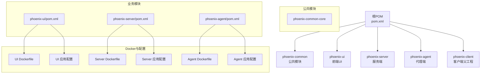
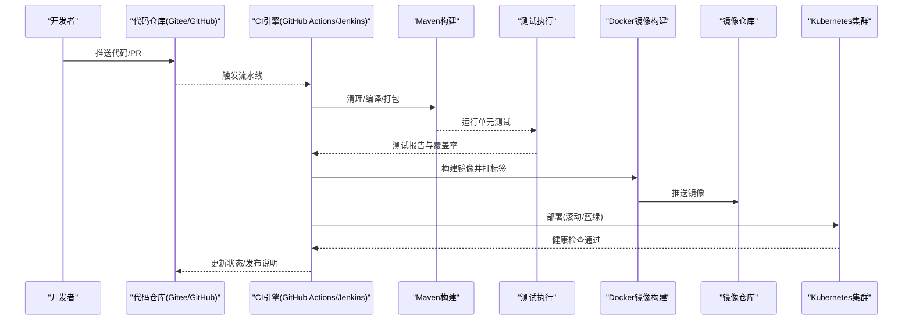
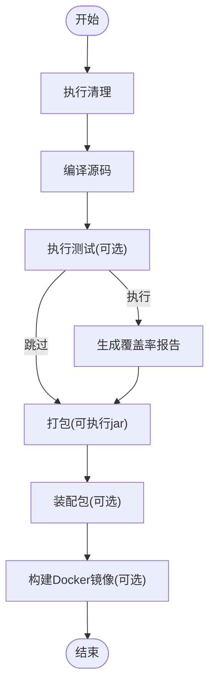
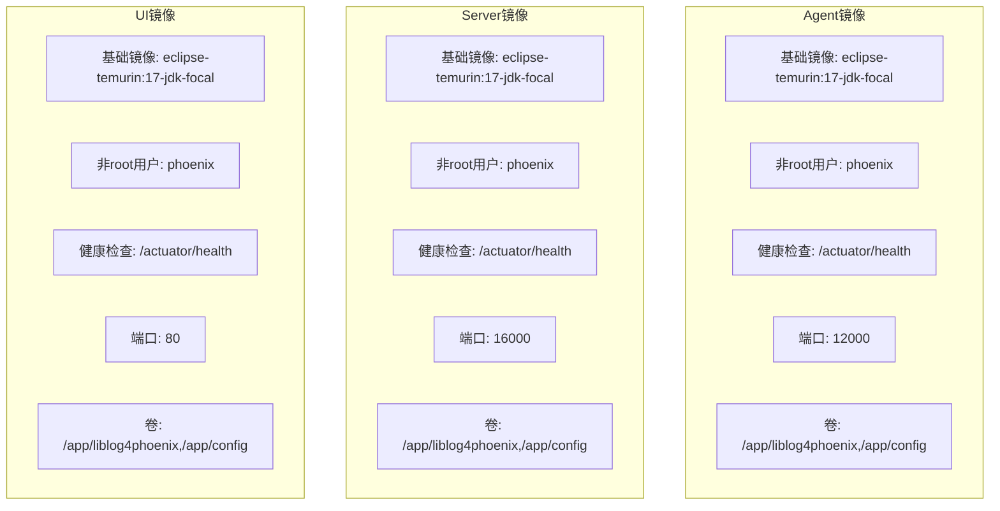
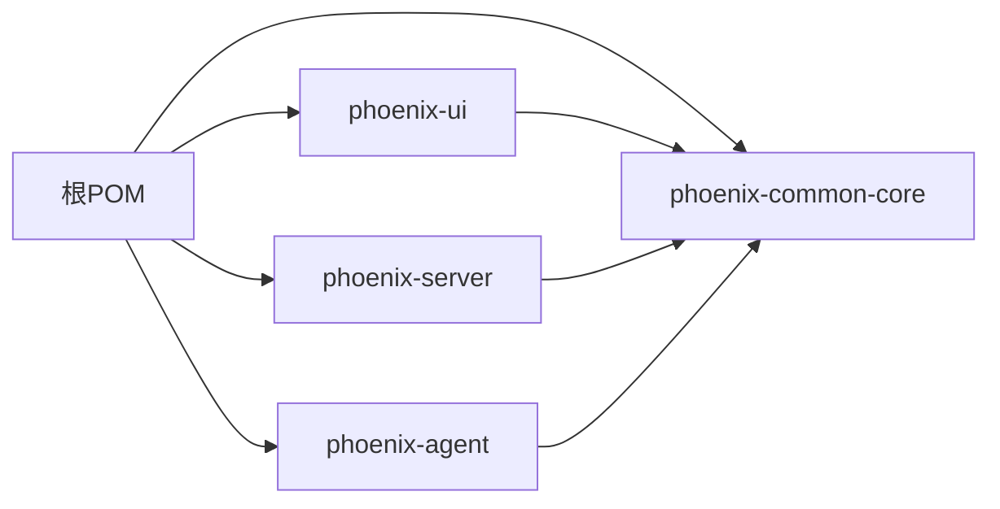

# 持续集成与部署

<cite>
**本文引用的文件**
- [pom.xml](file://pom.xml)
- [phoenix-agent/pom.xml](file://phoenix-agent/pom.xml)
- [phoenix-server/pom.xml](file://phoenix-server/pom.xml)
- [phoenix-ui/pom.xml](file://phoenix-ui/pom.xml)
- [phoenix-common-core/pom.xml](file://phoenix-common/phoenix-common-core/pom.xml)
- [phoenix-agent/src/main/resources/application.yml](file://phoenix-agent/src/main/resources/application.yml)
- [phoenix-server/src/main/resources/application.yml](file://phoenix-server/src/main/resources/application.yml)
- [phoenix-ui/src/main/resources/application.yml](file://phoenix-ui/src/main/resources/application.yml)
- [phoenix-agent/src/main/docker/Dockerfile](file://phoenix-agent/src/main/docker/Dockerfile)
- [phoenix-server/src/main/docker/Dockerfile](file://phoenix-server/src/main/docker/Dockerfile)
- [phoenix-ui/src/main/docker/Dockerfile](file://phoenix-ui/src/main/docker/Dockerfile)
- [doc/LinuxServices/auto_package.sh](file://doc/LinuxServices/auto_package.sh)
- [mvn/mvnw_package.sh](file://mvn/mvnw_package.sh)
</cite>

## 目录
1. [简介](#简介)
2. [项目结构](#项目结构)
3. [核心组件](#核心组件)
4. [架构总览](#架构总览)
5. [详细组件分析](#详细组件分析)
6. [依赖分析](#依赖分析)
7. [性能考量](#性能考量)
8. [故障排查指南](#故障排查指南)
9. [结论](#结论)
10. [附录](#附录)

## 简介
本指南面向Phoenix监控系统的持续集成与持续部署（CI/CD）落地实践，围绕以下目标展开：
- 设计并配置CI/CD流水线，覆盖GitHub Actions、Jenkins等主流CI工具
- 集成自动化测试：构建触发、测试执行、测试报告生成与通知
- 自动化构建：Maven多模块构建、依赖管理、产物生成与归档
- 自动化部署：Docker镜像构建与推送、Kubernetes部署策略（含蓝绿/滚动更新）
- 环境管理：开发/测试/生产环境配置、环境变量与配置文件版本控制
- 发布管理：版本标签、发布说明、回滚策略
- 监控与告警：构建状态、部署成功率、故障告警
- 安全与权限：构建环境安全、部署权限控制、敏感信息保护

## 项目结构
Phoenix采用多模块Maven聚合工程，包含公共模块与三大业务子模块（UI、Server、Agent），并提供Docker镜像与安装脚本，便于CI/CD集成。

图表来源
- [pom.xml:1-26](file://pom.xml#L1-L26)
- [phoenix-ui/pom.xml:1-160](file://phoenix-ui/pom.xml#L1-L160)
- [phoenix-server/pom.xml:1-145](file://phoenix-server/pom.xml#L1-L145)
- [phoenix-agent/pom.xml:1-82](file://phoenix-agent/pom.xml#L1-L82)
- [phoenix-agent/src/main/docker/Dockerfile:1-47](file://phoenix-agent/src/main/docker/Dockerfile#L1-L47)
- [phoenix-server/src/main/docker/Dockerfile:1-48](file://phoenix-server/src/main/docker/Dockerfile#L1-L48)
- [phoenix-ui/src/main/docker/Dockerfile:1-55](file://phoenix-ui/src/main/docker/Dockerfile#L1-L55)

章节来源
- [pom.xml:1-26](file://pom.xml#L1-L26)
- [phoenix-ui/pom.xml:1-160](file://phoenix-ui/pom.xml#L1-L160)
- [phoenix-server/pom.xml:1-145](file://phoenix-server/pom.xml#L1-L145)
- [phoenix-agent/pom.xml:1-82](file://phoenix-agent/pom.xml#L1-L82)

## 核心组件
- 多模块Maven工程：统一版本、依赖与插件管理，确保各模块一致性与可复现性
- Spring Boot应用：UI、Server、Agent均为独立可执行jar，内置 Undertow 与 Actuator
- Docker镜像：基于JDK 17基础镜像，非root运行，健康检查，暴露应用端口
- 自动化脚本：Linux服务安装脚本与Maven包装器一键构建脚本

章节来源
- [pom.xml:29-129](file://pom.xml#L29-L129)
- [phoenix-agent/pom.xml:40-80](file://phoenix-agent/pom.xml#L40-L80)
- [phoenix-server/pom.xml:103-143](file://phoenix-server/pom.xml#L103-L143)
- [phoenix-ui/pom.xml:118-158](file://phoenix-ui/pom.xml#L118-L158)
- [phoenix-agent/src/main/docker/Dockerfile:1-47](file://phoenix-agent/src/main/docker/Dockerfile#L1-L47)
- [phoenix-server/src/main/docker/Dockerfile:1-48](file://phoenix-server/src/main/docker/Dockerfile#L1-L48)
- [phoenix-ui/src/main/docker/Dockerfile:1-55](file://phoenix-ui/src/main/docker/Dockerfile#L1-L55)

## 架构总览
CI/CD整体流程分为“构建—测试—打包—镜像—部署—验证”闭环，结合制品库与容器镜像仓库，实现可追溯、可回滚的发布。

图表来源
- [pom.xml:434-449](file://pom.xml#L434-L449)
- [phoenix-agent/src/main/docker/Dockerfile:34-36](file://phoenix-agent/src/main/docker/Dockerfile#L34-L36)
- [phoenix-server/src/main/docker/Dockerfile:35-36](file://phoenix-server/src/main/docker/Dockerfile#L35-L36)
- [phoenix-ui/src/main/docker/Dockerfile:39-41](file://phoenix-ui/src/main/docker/Dockerfile#L39-L41)

## 详细组件分析

### Maven多模块构建与测试
- 统一版本与依赖管理：根POM集中声明版本、依赖与插件，子模块继承
- 测试策略：默认跳过测试，CI阶段显式启用；Jacoco生成覆盖率报告
- 打包策略：spring-boot-maven-plugin生成可执行jar；maven-assembly-plugin生成装配包；docker-maven-plugin参与镜像构建

图表来源
- [pom.xml:416-559](file://pom.xml#L416-L559)
- [pom.xml:584-609](file://pom.xml#L584-L609)
- [phoenix-agent/pom.xml:44-79](file://phoenix-agent/pom.xml#L44-L79)
- [phoenix-server/pom.xml:107-142](file://phoenix-server/pom.xml#L107-L142)
- [phoenix-ui/pom.xml:122-157](file://phoenix-ui/pom.xml#L122-L157)

章节来源
- [pom.xml:29-129](file://pom.xml#L29-L129)
- [pom.xml:416-559](file://pom.xml#L416-L559)
- [pom.xml:584-609](file://pom.xml#L584-L609)
- [phoenix-agent/pom.xml:44-79](file://phoenix-agent/pom.xml#L44-L79)
- [phoenix-server/pom.xml:107-142](file://phoenix-server/pom.xml#L107-L142)
- [phoenix-ui/pom.xml:122-157](file://phoenix-ui/pom.xml#L122-L157)

### Docker镜像构建与运行
- 基础镜像：JDK 17（Eclipse Temurin），设置时区与编码
- 安全运行：非root用户运行，健康检查基于Actuator健康端点
- 挂载卷：日志与配置目录挂载，便于运维与审计
- 端口暴露：UI 80、Server 16000、Agent 12000

图表来源
- [phoenix-agent/src/main/docker/Dockerfile:1-47](file://phoenix-agent/src/main/docker/Dockerfile#L1-L47)
- [phoenix-server/src/main/docker/Dockerfile:1-48](file://phoenix-server/src/main/docker/Dockerfile#L1-L48)
- [phoenix-ui/src/main/docker/Dockerfile:1-55](file://phoenix-ui/src/main/docker/Dockerfile#L1-L55)

章节来源
- [phoenix-agent/src/main/docker/Dockerfile:1-47](file://phoenix-agent/src/main/docker/Dockerfile#L1-L47)
- [phoenix-server/src/main/docker/Dockerfile:1-48](file://phoenix-server/src/main/docker/Dockerfile#L1-L48)
- [phoenix-ui/src/main/docker/Dockerfile:1-55](file://phoenix-ui/src/main/docker/Dockerfile#L1-L55)

### 应用配置与环境
- 各模块均提供application.yml与profile配置，Actuator端点仅本地暴露，增强安全性
- UI/Server使用Druid连接池与Quartz调度，Agent侧重监控采集
- Knife4j/SpringDoc提供OpenAPI文档，便于联调与发布

章节来源
- [phoenix-agent/src/main/resources/application.yml:1-111](file://phoenix-agent/src/main/resources/application.yml#L1-L111)
- [phoenix-server/src/main/resources/application.yml:1-271](file://phoenix-server/src/main/resources/application.yml#L1-L271)
- [phoenix-ui/src/main/resources/application.yml:1-238](file://phoenix-ui/src/main/resources/application.yml#L1-L238)

### 自动化脚本与本地打包
- Linux服务自动化脚本：下载JDK/Maven/Phoenix并构建
- Maven包装器一键构建脚本：跳过测试快速打包

章节来源
- [doc/LinuxServices/auto_package.sh:1-24](file://doc/LinuxServices/auto_package.sh#L1-L24)
- [mvn/mvnw_package.sh:1-5](file://mvn/mvnw_package.sh#L1-L5)

## 依赖分析
- 依赖管理：根POM集中管理第三方依赖版本，避免冲突
- 插件链路：编译→测试→打包→装配→镜像，按需启用
- 运行时依赖：UI/Server/Agent均依赖common-web与client starter，确保监控能力一致

图表来源
- [pom.xml:131-392](file://pom.xml#L131-L392)
- [phoenix-common-core/pom.xml:22-138](file://phoenix-common/phoenix-common-core/pom.xml#L22-L138)
- [phoenix-ui/pom.xml:27-116](file://phoenix-ui/pom.xml#L27-L116)
- [phoenix-server/pom.xml:27-101](file://phoenix-server/pom.xml#L27-L101)
- [phoenix-agent/pom.xml:27-38](file://phoenix-agent/pom.xml#L27-L38)

章节来源
- [pom.xml:131-392](file://pom.xml#L131-L392)
- [phoenix-common-core/pom.xml:22-138](file://phoenix-common/phoenix-common-core/pom.xml#L22-L138)
- [phoenix-ui/pom.xml:27-116](file://phoenix-ui/pom.xml#L27-L116)
- [phoenix-server/pom.xml:27-101](file://phoenix-server/pom.xml#L27-L101)
- [phoenix-agent/pom.xml:27-38](file://phoenix-agent/pom.xml#L27-L38)

## 性能考量
- 构建性能：启用并行编译与测试，合理配置测试跳过策略
- 镜像体积：基础镜像精简，仅安装必要工具，避免多阶段构建
- 运行性能：Druid连接池参数、Quartz线程池规模、Caffeine缓存策略需结合负载调优

## 故障排查指南
- 构建失败：检查Maven插件版本与仓库镜像配置，确认网络可达性
- 测试异常：查看Surefire配置与测试报告，定位单测失败原因
- 镜像健康检查失败：核对Actuator端点暴露、端口映射与容器内进程状态
- 部署失败：检查Kubernetes资源清单、镜像拉取策略与Secret配置

章节来源
- [pom.xml:702-741](file://pom.xml#L702-L741)
- [phoenix-agent/src/main/docker/Dockerfile:34-36](file://phoenix-agent/src/main/docker/Dockerfile#L34-L36)
- [phoenix-server/src/main/docker/Dockerfile:35-36](file://phoenix-server/src/main/docker/Dockerfile#L35-L36)
- [phoenix-ui/src/main/docker/Dockerfile:39-41](file://phoenix-ui/src/main/docker/Dockerfile#L39-L41)

## 结论
通过统一的Maven多模块工程、标准化的Docker镜像与完善的配置体系，Phoenix监控系统具备良好的CI/CD可实施性。结合本文提供的流水线设计、测试与部署策略、环境管理与安全控制建议，可实现稳定、可追溯、可回滚的持续交付。

## 附录

### CI工具配置要点（GitHub Actions/Jenkins）
- GitHub Actions
  - 触发条件：push、PR、schedule
  - 步骤建议：检出代码→设置Java→使用Maven Wrapper→执行测试→生成报告→构建镜像→推送镜像→部署到K8S
  - 安全：使用加密的Secret管理镜像仓库凭据与K8S kubeconfig
- Jenkins
  - Pipeline：声明式或脚本式，串联Maven、Docker、Kubernetes插件
  - 并行：多分支并行构建，共享缓存与制品库
  - 回滚：基于镜像标签与Deployment滚动回滚策略

### 自动化测试集成
- 测试执行：在CI中显式启用测试，使用Surefire与JUnit
- 报告生成：生成测试报告与JaCoCo覆盖率报告，上传至制品库
- 通知：构建失败/成功通过邮件或IM通知

章节来源
- [pom.xml:434-449](file://pom.xml#L434-L449)
- [pom.xml:584-609](file://pom.xml#L584-L609)

### 自动化构建流程（Maven）
- 多模块构建：根POM统一管理，子模块按需装配
- 产物生成：可执行jar与装配包，供后续镜像与部署使用
- 仓库：私有镜像仓库与制品库，统一版本标签

章节来源
- [pom.xml:416-559](file://pom.xml#L416-L559)
- [phoenix-agent/pom.xml:44-79](file://phoenix-agent/pom.xml#L44-L79)
- [phoenix-server/pom.xml:107-142](file://phoenix-server/pom.xml#L107-L142)
- [phoenix-ui/pom.xml:122-157](file://phoenix-ui/pom.xml#L122-L157)

### 自动化部署流程（Docker/Kubernetes）
- 镜像构建：使用docker-maven-plugin或dockerfile直接构建
- 镜像推送：按版本打标签并推送至镜像仓库
- Kubernetes部署：Deployment/Service/Ingress，滚动更新或蓝绿策略
- 健康检查：基于Actuator健康端点，结合探针

章节来源
- [pom.xml:517-557](file://pom.xml#L517-L557)
- [phoenix-agent/src/main/docker/Dockerfile:34-36](file://phoenix-agent/src/main/docker/Dockerfile#L34-L36)
- [phoenix-server/src/main/docker/Dockerfile:35-36](file://phoenix-server/src/main/docker/Dockerfile#L35-L36)
- [phoenix-ui/src/main/docker/Dockerfile:39-41](file://phoenix-ui/src/main/docker/Dockerfile#L39-L41)

### 环境管理策略
- 配置文件：application.yml与profile分离，敏感配置放入Secret
- 环境变量：通过Kubernetes ConfigMap/Secret注入
- 版本控制：配置文件纳入版本管理，变更走变更流程

章节来源
- [phoenix-agent/src/main/resources/application.yml:48-50](file://phoenix-agent/src/main/resources/application.yml#L48-L50)
- [phoenix-server/src/main/resources/application.yml:56-58](file://phoenix-server/src/main/resources/application.yml#L56-L58)
- [phoenix-ui/src/main/resources/application.yml:65-67](file://phoenix-ui/src/main/resources/application.yml#L65-L67)

### 发布管理流程
- 版本标签：遵循语义化版本，发布前打标签
- 发布说明：自动生成变更摘要，附带测试报告链接
- 回滚策略：基于镜像标签与Deployment回滚，配合金丝雀与蓝绿

章节来源
- [pom.xml:766-784](file://pom.xml#L766-L784)

### 监控与告警机制
- 构建监控：流水线状态、测试通过率、覆盖率趋势
- 部署监控：Pod就绪、健康检查、错误日志
- 告警策略：失败/延迟/容量阈值告警，分级通知

### 安全与权限管理
- 构建安全：最小权限原则，隔离构建环境
- 部署权限：RBAC控制，限制对生产命名空间的操作
- 敏感信息：凭据与密钥使用Secret管理，禁用硬编码