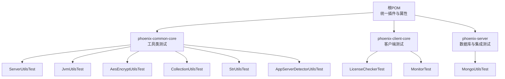
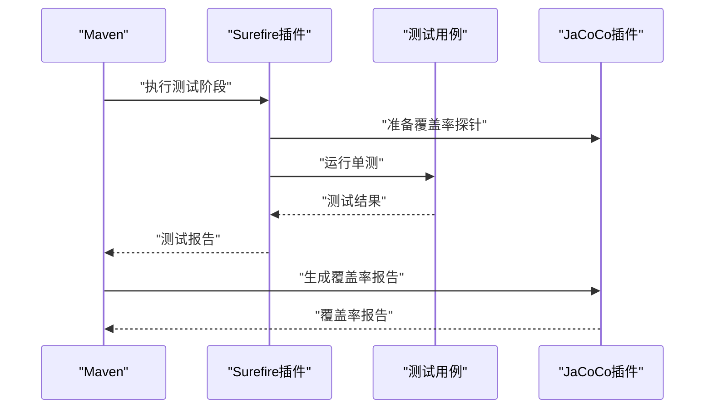
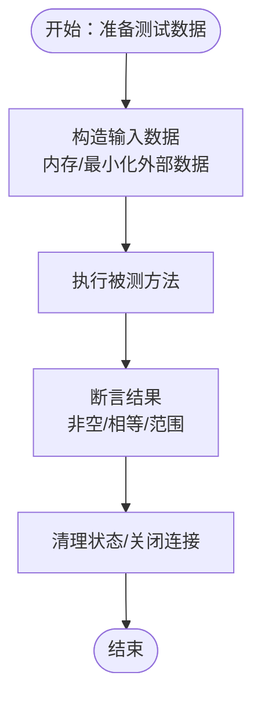
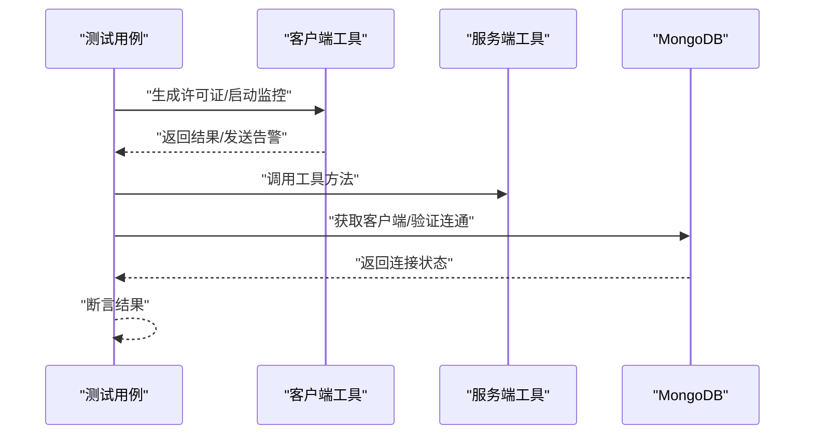
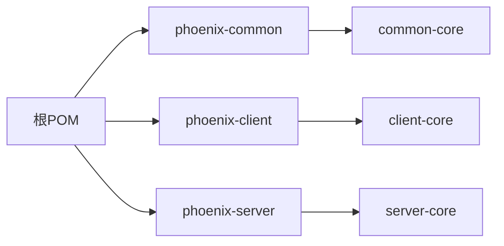

# 单元测试

<cite>
**本文引用的文件**
- [pom.xml](file://pom.xml)
- [ServerUtilsTest.java](file://phoenix-common\phoenix-common-core\src\test\java\com\gitee\pifeng\monitoring\common\util\server\ServerUtilsTest.java)
- [JvmUtilsTest.java](file://phoenix-common\phoenix-common-core\src\test\java\com\gitee\pifeng\monitoring\common\util\jvm\JvmUtilsTest.java)
- [AesEncryptUtilsTest.java](file://phoenix-common\phoenix-common-core\src\test\java\com\gitee\pifeng\monitoring\common\util\secure\AesEncryptUtilsTest.java)
- [LicenseCheckerTest.java](file://phoenix-client\phoenix-client-core\src\test\java\com\gitee\pifeng\monitoring\plug\core\LicenseCheckerTest.java)
- [MongoUtilsTest.java](file://phoenix-server\src\test\java\com\gitee\pifeng\monitoring\server\util\db\MongoUtilsTest.java)
- [CollectionUtilsTest.java](file://phoenix-common\phoenix-common-core\src\test\java\com\gitee\pifeng\monitoring\common\util\CollectionUtilsTest.java)
- [StrUtilsTest.java](file://phoenix-common\phoenix-common-core\src\test\java\com\gitee\pifeng\monitoring\common\util\StrUtilsTest.java)
- [AppServerDetectorUtilsTest.java](file://phoenix-common\phoenix-common-core\src\test\java\com\gitee\pifeng\monitoring\common\util\AppServerDetectorUtilsTest.java)
- [MonitorTest.java](file://phoenix-client\phoenix-client-core\src\test\java\com\gitee\pifeng\monitoring\plug\MonitorTest.java)
</cite>

## 目录
1. [引言](#引言)
2. [项目结构](#项目结构)
3. [核心组件](#核心组件)
4. [架构总览](#架构总览)
5. [详细组件分析](#详细组件分析)
6. [依赖分析](#依赖分析)
7. [性能考虑](#性能考虑)
8. [故障排查指南](#故障排查指南)
9. [结论](#结论)
10. [附录](#附录)

## 引言
本指南面向Phoenix监控系统的单元测试实践，围绕测试设计原则（独立性、可重复性、可维护性）、Mock对象使用、测试数据准备与管理、工具类测试方法、异常测试、覆盖率测量与报告、以及测试执行与结果分析等方面展开。文档结合项目现有测试样例，给出可直接落地的最佳实践与参考路径。

## 项目结构
Phoenix采用多模块Maven工程组织，单元测试分布在各模块的test目录中，统一由根POM管理测试与覆盖率插件。关键测试模块与文件如下：
- 工具类测试：phoenix-common/phoenix-common-core/src/test
- 客户端测试：phoenix-client/phoenix-client-core/src/test
- 服务端测试：phoenix-server/src/test

图表来源
- [pom.xml:433-449](file://pom.xml#L433-L449)
- [ServerUtilsTest.java:1-41](file://phoenix-common\phoenix-common-core\src\test\java\com\gitee\pifeng\monitoring\common\util\server\ServerUtilsTest.java#L1-L41)
- [JvmUtilsTest.java:1-112](file://phoenix-common\phoenix-common-core\src\test\java\com\gitee\pifeng\monitoring\common\util\jvm\JvmUtilsTest.java#L1-L112)
- [AesEncryptUtilsTest.java:1-47](file://phoenix-common\phoenix-common-core\src\test\java\com\gitee\pifeng\monitoring\common\util\secure\AesEncryptUtilsTest.java#L1-L47)
- [CollectionUtilsTest.java:1-67](file://phoenix-common\phoenix-common-core\src\test\java\com\gitee\pifeng\monitoring\common\util\CollectionUtilsTest.java#L1-L67)
- [StrUtilsTest.java:1-33](file://phoenix-common\phoenix-common-core\src\test\java\com\gitee\pifeng\monitoring\common\util\StrUtilsTest.java#L1-L33)
- [AppServerDetectorUtilsTest.java:1-36](file://phoenix-common\phoenix-common-core\src\test\java\com\gitee\pifeng\monitoring\common\util\AppServerDetectorUtilsTest.java#L1-L36)
- [LicenseCheckerTest.java:1-37](file://phoenix-client\phoenix-client-core\src\test\java\com\gitee\pifeng\monitoring\plug\core\LicenseCheckerTest.java#L1-L37)
- [MonitorTest.java:1-56](file://phoenix-client\phoenix-client-core\src\test\java\com\gitee\pifeng\monitoring\plug\MonitorTest.java#L1-L56)
- [MongoUtilsTest.java:1-51](file://phoenix-server\src\test\java\com\gitee\pifeng\monitoring\server\util\db\MongoUtilsTest.java#L1-L51)

章节来源
- [pom.xml:433-449](file://pom.xml#L433-L449)
- [pom.xml:584-609](file://pom.xml#L584-L609)

## 核心组件
- 测试框架与插件
  - JUnit用于断言与测试生命周期；部分测试使用TestCase风格（兼容旧版JUnit API）。
  - Maven Surefire插件负责测试执行与报告生成。
  - JaCoCo插件负责覆盖率采集与报告生成。
- 测试分类
  - 工具类测试：覆盖Server、JVM、安全、集合、字符串、应用服务器检测等工具。
  - 客户端测试：覆盖许可证生成、监控埋点与告警发送。
  - 服务端测试：覆盖MongoDB连接与连通性测试。

章节来源
- [pom.xml:433-449](file://pom.xml#L433-L449)
- [pom.xml:584-609](file://pom.xml#L584-L609)
- [ServerUtilsTest.java:1-41](file://phoenix-common\phoenix-common-core\src\test\java\com\gitee\pifeng\monitoring\common\util\server\ServerUtilsTest.java#L1-L41)
- [JvmUtilsTest.java:1-112](file://phoenix-common\phoenix-common-core\src\test\java\com\gitee\pifeng\monitoring\common\util\jvm\JvmUtilsTest.java#L1-L112)
- [AesEncryptUtilsTest.java:1-47](file://phoenix-common\phoenix-common-core\src\test\java\com\gitee\pifeng\monitoring\common\util\secure\AesEncryptUtilsTest.java#L1-L47)
- [CollectionUtilsTest.java:1-67](file://phoenix-common\phoenix-common-core\src\test\java\com\gitee\pifeng\monitoring\common\util\CollectionUtilsTest.java#L1-L67)
- [StrUtilsTest.java:1-33](file://phoenix-common\phoenix-common-core\src\test\java\com\gitee\pifeng\monitoring\common\util\StrUtilsTest.java#L1-L33)
- [AppServerDetectorUtilsTest.java:1-36](file://phoenix-common\phoenix-common-core\src\test\java\com\gitee\pifeng\monitoring\common\util\AppServerDetectorUtilsTest.java#L1-L36)
- [LicenseCheckerTest.java:1-37](file://phoenix-client\phoenix-client-core\src\test\java\com\gitee\pifeng\monitoring\plug\core\LicenseCheckerTest.java#L1-L37)
- [MonitorTest.java:1-56](file://phoenix-client\phoenix-client-core\src\test\java\com\gitee\pifeng\monitoring\plug\MonitorTest.java#L1-L56)
- [MongoUtilsTest.java:1-51](file://phoenix-server\src\test\java\com\gitee\pifeng\monitoring\server\util\db\MongoUtilsTest.java#L1-L51)

## 架构总览
单元测试在Phoenix中的执行链路如下：
- Maven构建阶段触发Surefire执行测试；
- JaCoCo在测试前注入探针，测试结束后生成覆盖率报告；
- 各模块测试分别针对工具类、客户端与服务端功能进行验证。

图表来源
- [pom.xml:433-449](file://pom.xml#L433-L449)
- [pom.xml:584-609](file://pom.xml#L584-L609)

## 详细组件分析

### 测试设计原则与编写方法
- 独立性：每个测试用例应互不影响，避免共享状态与全局变量。
- 可重复性：测试应在不同环境与时间点均可稳定通过。
- 可维护性：测试命名清晰、断言明确、数据构造简单。
- 建议：优先使用轻量级断言与最小化外部依赖；对IO与网络调用进行隔离或替换。

### Mock对象与行为验证
- 当前测试多为直接调用真实实现或外部资源（如MongoDB）。若需引入Mock，建议：
  - 使用Mockito框架对依赖接口进行模拟，隔离外部系统。
  - 对返回值与调用次数进行验证，确保行为符合预期。
  - 在测试前后清理Mock状态，保证独立性。

### 测试数据准备与管理
- 内存数据：在测试方法内构造小而精的输入数据，避免跨用例共享。
- 外部资源：对于数据库、网络等外部依赖，建议：
  - 使用容器化环境（如Docker）启动测试专用实例；
  - 在测试前初始化最小化数据集，在测试后清理或回滚；
  - 通过配置隔离测试环境（dev/prod），避免污染生产数据。

### 工具类测试示例与最佳实践
- ServerUtils测试要点
  - 覆盖SIGAR与OSHI两种实现路径，断言返回对象非空。
  - 参考路径：[ServerUtilsTest.java:30-38](file://phoenix-common\phoenix-common-core\src\test\java\com\gitee\pifeng\monitoring\common\util\server\ServerUtilsTest.java#L30-L38)
- JvmUtils测试要点
  - 分别测试运行时、线程、类加载、内存、GC与JVM信息，断言各域对象非空。
  - 参考路径：[JvmUtilsTest.java:29-109](file://phoenix-common\phoenix-common-core\src\test\java\com\gitee\pifeng\monitoring\common\util\jvm\JvmUtilsTest.java#L29-L109)
- AesEncryptUtils测试要点
  - 加密与解密双向验证，断言结果一致性。
  - 参考路径：[AesEncryptUtilsTest.java:27-45](file://phoenix-common\phoenix-common-core\src\test\java\com\gitee\pifeng\monitoring\common\util\secure\AesEncryptUtilsTest.java#L27-L45)
- CollectionUtils与StrUtils测试要点
  - 验证集合拆分与字符串分割逻辑，关注边界条件与空输入。
  - 参考路径：
    - [CollectionUtilsTest.java:28-64](file://phoenix-common\phoenix-common-core\src\test\java\com\gitee\pifeng\monitoring\common\util\CollectionUtilsTest.java#L28-L64)
    - [StrUtilsTest.java:25-30](file://phoenix-common\phoenix-common-core\src\test\java\com\gitee\pifeng\monitoring\common\util\StrUtilsTest.java#L25-L30)
- AppServerDetectorUtils测试要点
  - 断言返回枚举类型非空，便于后续分支逻辑验证。
  - 参考路径：[AppServerDetectorUtilsTest.java:30-33](file://phoenix-common\phoenix-common-core\src\test\java\com\gitee\pifeng\monitoring\common\util\AppServerDetectorUtilsTest.java#L30-L33)

### 异常情况测试
- 异常抛出测试：构造导致异常的输入，捕获并断言异常类型。
- 异常消息验证：断言异常消息包含预期关键字或格式。
- 异常堆栈检查：在需要时定位关键栈帧，确保异常来自正确路径。
- 实践建议：为每条异常路径编写独立用例，覆盖边界与非法输入。

### 覆盖率测量与分析
- JaCoCo配置
  - 在测试阶段前注入探针，在测试完成后生成报告。
  - 报告输出目录由插件配置决定。
- 报告解读
  - 关注行覆盖率、分支覆盖率与指令覆盖率；
  - 识别低覆盖率区域，补充针对性用例；
  - 结合模块与类维度分析，定位热点与薄弱环节。

章节来源
- [pom.xml:584-609](file://pom.xml#L584-L609)

### 测试执行与报告生成
- Surefire插件
  - 控制测试跳过、进程复用与编码参数；
  - 支持并行与fork配置，提升执行效率。
- 报告生成
  - 测试报告默认输出至目标目录；
  - 覆盖率报告由JaCoCo在指定阶段生成。

章节来源
- [pom.xml:433-449](file://pom.xml#L433-L449)
- [pom.xml:584-609](file://pom.xml#L584-L609)

### 客户端与服务端测试示例
- 客户端测试（许可证与监控）
  - 许可证生成：构造许可证对象，生成JSON字符串并打印。
    - 参考路径：[LicenseCheckerTest.java:27-34](file://phoenix-client\phoenix-client-core\src\test\java\com\gitee\pifeng\monitoring\plug\core\LicenseCheckerTest.java#L27-L34)
  - 监控埋点与告警发送：启动监控，提交业务埋点任务，发送告警并打印结果。
    - 参考路径：[MonitorTest.java:33-54](file://phoenix-client\phoenix-client-core\src\test\java\com\gitee\pifeng\monitoring\plug\MonitorTest.java#L33-L54)
- 服务端测试（MongoDB）
  - 获取客户端与连通性验证：断言客户端非空与连接成功。
    - 参考路径：
      - [MongoUtilsTest.java:30-34](file://phoenix-server\src\test\java\com\gitee\pifeng\monitoring\server\util\db\MongoUtilsTest.java#L30-L34)
      - [MongoUtilsTest.java:44-50](file://phoenix-server\src\test\java\com\gitee\pifeng\monitoring\server\util\db\MongoUtilsTest.java#L44-L50)

图表来源
- [LicenseCheckerTest.java:27-34](file://phoenix-client\phoenix-client-core\src\test\java\com\gitee\pifeng\monitoring\plug\core\LicenseCheckerTest.java#L27-L34)
- [MonitorTest.java:33-54](file://phoenix-client\phoenix-client-core\src\test\java\com\gitee\pifeng\monitoring\plug\MonitorTest.java#L33-L54)
- [MongoUtilsTest.java:30-50](file://phoenix-server\src\test\java\com\gitee\pifeng\monitoring\server\util\db\MongoUtilsTest.java#L30-L50)

## 依赖分析
- 统一依赖与版本管理：根POM集中管理Spring Boot、MyBatis Plus、Jackson、Guava、Sigar、OSHI、JNA、Bouncy Castle等依赖。
- 测试相关依赖：JUnit、Surefire、JaCoCo等由根POM统一配置。
- 模块间关系：common为client与server提供通用能力，client与server各自维护独立测试。

图表来源
- [pom.xml:132-392](file://pom.xml#L132-L392)

章节来源
- [pom.xml:132-392](file://pom.xml#L132-L392)

## 性能考虑
- 测试执行性能
  - 合理设置forkCount与reuseForks，减少JVM启动开销。
  - 将耗时测试拆分为独立模块或并行执行。
- 覆盖率采集性能
  - 在CI中按需开启覆盖率，避免在开发阶段过度影响速度。
- 外部依赖性能
  - 使用内存型或本地容器化依赖，避免网络抖动影响测试稳定性。

## 故障排查指南
- 测试失败
  - 检查断言与输入数据是否匹配；
  - 确认外部依赖可用（如MongoDB）。
- 覆盖率异常
  - 确认JaCoCo插件已正确注入探针；
  - 检查报告生成阶段是否在测试之后执行。
- 并发与隔离问题
  - 确保测试之间无共享状态；
  - 对数据库与缓存进行事务级回滚或表级清空。

## 结论
Phoenix的单元测试体系以JUnit为核心，配合Surefire与JaCoCo实现高效执行与覆盖率分析。建议在现有基础上进一步引入Mock对象、完善异常路径与边界用例，并加强测试数据隔离与清理机制，持续提升测试质量与可维护性。

## 附录
- 快速参考
  - 测试入口：各模块src/test/java下按功能组织的测试类。
  - 配置入口：根POM中Surefire与JaCoCo插件配置段落。
  - 示例路径：见“详细组件分析”各节中的具体文件与行号。