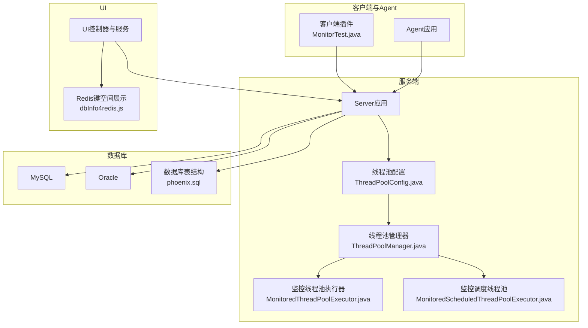
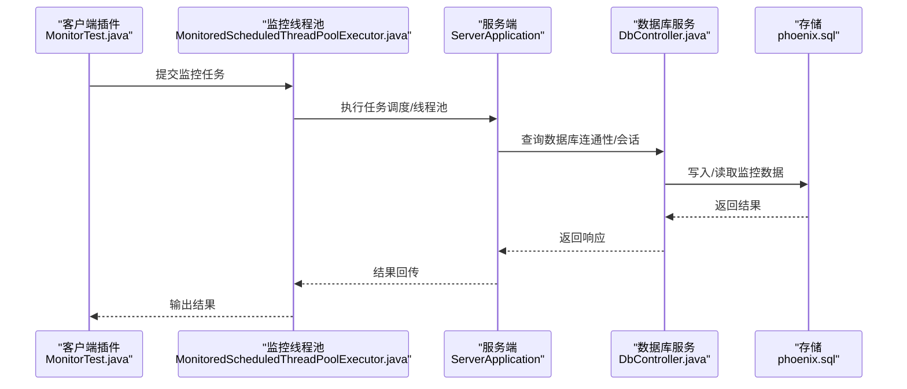
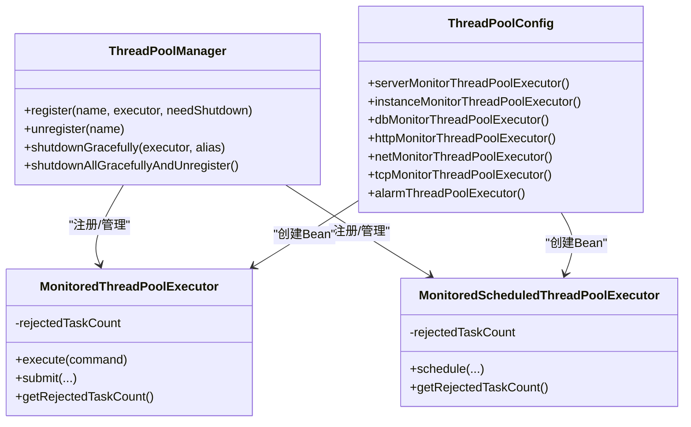
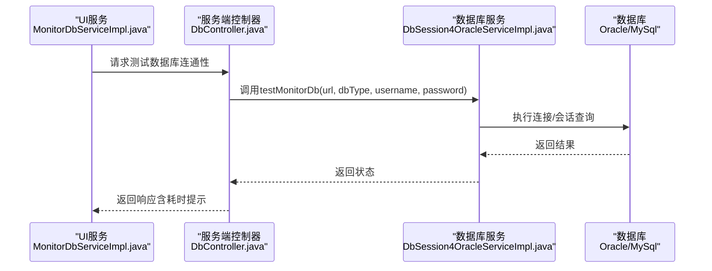
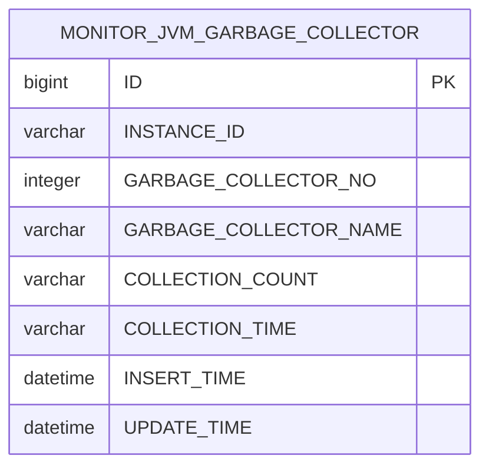
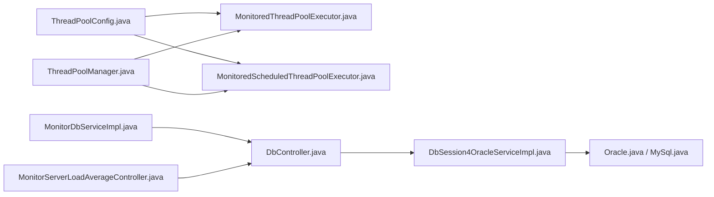

# 性能测试

<cite>
**本文引用的文件**
- [ThreadPoolManager.java](file://phoenix-common/phoenix-common-core/src/main/java/com/gitee/pifeng/monitoring/common/threadpool/ThreadPoolManager.java)
- [MonitoredThreadPoolExecutor.java](file://phoenix-common/phoenix-common-core/src/main/java/com/gitee/pifeng/monitoring/common/threadpool/MonitoredThreadPoolExecutor.java)
- [MonitoredScheduledThreadPoolExecutor.java](file://phoenix-common/phoenix-common-core/src/main/java/com/gitee/pifeng/monitoring/common/threadpool/MonitoredScheduledThreadPoolExecutor.java)
- [ThreadPoolConfig.java](file://phoenix-server/src/main/java/com/gitee/pifeng/monitoring/server/config/ThreadPoolConfig.java)
- [ProcessorsUtils.java](file://phoenix-common/phoenix-common-core/src/main/java/com/gitee/pifeng/monitoring/common/util/server/ProcessorsUtils.java)
- [AbstractPoolSizeCalculator.java](file://phoenix-common/phoenix-common-core/src/main/java/com/gitee/pifeng/monitoring/common/abs/AbstractPoolSizeCalculator.java)
- [AbstractPoolSizeCalculatorTest.java](file://phoenix-common/phoenix-common-core/src/test/java/com/gitee/pifeng/monitoring/common/abs/AbstractPoolSizeCalculatorTest.java)
- [DbController.java](file://phoenix-server/src/main/java/com/gitee/pifeng/monitoring/server/business/server/controller/DbController.java)
- [IDbSession4OracleService.java](file://phoenix-server/src/main/java/com/gitee/pifeng/monitoring/server/business/server/service/IDbSession4OracleService.java)
- [DbSession4OracleServiceImpl.java](file://phoenix-server/src/main/java/com/gitee/pifeng/monitoring/server/business/server/service/impl/DbSession4OracleServiceImpl.java)
- [Oracle.java](file://phoenix-common/phoenix-common-core/src/main/java/com/gitee/pifeng/monitoring/common/constant/sql/Oracle.java)
- [MySql.java](file://phoenix-common/phoenix-common-core/src/main/java/com/gitee/pifeng/monitoring/common/constant/sql/MySql.java)
- [GarbageCollectorDomain.java](file://phoenix-common/phoenix-common-core/src/main/java/com/gitee/pifeng/monitoring/common/domain/jvm/GarbageCollectorDomain.java)
- [MonitorJvmGarbageCollector.java](file://phoenix-server/src/main/java/com/gitee/pifeng/monitoring/server/business/server/entity/MonitorJvmGarbageCollector.java)
- [MonitorJvmGarbageCollectorVo.java](file://phoenix-ui/src/main/java/com/gitee/pifeng/monitoring/ui/business/web/vo/MonitorJvmGarbageCollectorVo.java)
- [phoenix.sql](file://doc/数据库设计/sql/mysql/phoenix.sql)
- [MonitorTest.java](file://phoenix-client/phoenix-client-core/src/test/java/com/gitee/pifeng/monitoring/plug/MonitorTest.java)
- [MonitorServerLoadAverageController.java](file://phoenix-ui/src/main/java/com/gitee/pifeng/monitoring/ui/business/web/controller/MonitorServerLoadAverageController.java)
- [SystemLoadAverageUtilsTest.java](file://phoenix-common/phoenix-common-core/src/test/java/com/gitee/pifeng/monitoring/common/util/server/sigar/SystemLoadAverageUtilsTest.java)
- [dbInfo4redis.js](file://phoenix-ui/src/main/resources/static/modules/db/dbInfo4redis.js)
- [MonitorDbServiceImpl.java](file://phoenix-ui/src/main/java/com/gitee/pifeng/monitoring/ui/business/web/service/impl/MonitorDbServiceImpl.java)
</cite>

## 目录
1. [简介](#简介)
2. [项目结构](#项目结构)
3. [核心组件](#核心组件)
4. [架构总览](#架构总览)
5. [详细组件分析](#详细组件分析)
6. [依赖分析](#依赖分析)
7. [性能考虑](#性能考虑)
8. [故障排查指南](#故障排查指南)
9. [结论](#结论)
10. [附录](#附录)

## 简介
本指南面向Phoenix监控系统的性能与压力测试，覆盖测试准备、测试环境搭建、测试工具选择、测试场景设计、负载测试与压力测试实施、线程池性能测试与优化、数据库性能测试、内存监控与GC分析、关键性能指标采集与分析、优化建议以及测试报告生成流程。文档以代码为依据，结合现有线程池管理、监控采集与数据库访问实现，给出可操作的测试步骤与最佳实践。

## 项目结构
Phoenix由Agent、Server、UI、Client插件与公共模块组成，性能测试应围绕以下关键路径展开：
- 线程池与调度：ThreadPoolManager、MonitoredThreadPoolExecutor、MonitoredScheduledThreadPoolExecutor、ThreadPoolConfig
- 监控采集：JVM GC、内存、服务器负载、数据库连接与会话
- 数据持久化：MySQL表结构与实体映射
- UI与前端：数据库连通性测试、图表展示

**图示来源**
- [ThreadPoolManager.java:21-131](file://phoenix-common/phoenix-common-core/src/main/java/com/gitee/pifeng/monitoring/common/threadpool/ThreadPoolManager.java#L21-L131)
- [MonitoredThreadPoolExecutor.java:17-40](file://phoenix-common/phoenix-common-core/src/main/java/com/gitee/pifeng/monitoring/common/threadpool/MonitoredThreadPoolExecutor.java#L17-L40)
- [MonitoredScheduledThreadPoolExecutor.java:17-91](file://phoenix-common/phoenix-common-core/src/main/java/com/gitee/pifeng/monitoring/common/threadpool/MonitoredScheduledThreadPoolExecutor.java#L17-L91)
- [ThreadPoolConfig.java:21-211](file://phoenix-server/src/main/java/com/gitee/pifeng/monitoring/server/config/ThreadPoolConfig.java#L21-L211)
- [phoenix.sql:343-1114](file://doc/数据库设计/sql/mysql/phoenix.sql#L343-L1114)
- [MonitorTest.java:23-56](file://phoenix-client/phoenix-client-core/src/test/java/com/gitee/pifeng/monitoring/plug/MonitorTest.java#L23-L56)
- [dbInfo4redis.js:131-152](file://phoenix-ui/src/main/resources/static/modules/db/dbInfo4redis.js#L131-L152)

**章节来源**
- [ThreadPoolManager.java:21-131](file://phoenix-common/phoenix-common-core/src/main/java/com/gitee/pifeng/monitoring/common/threadpool/ThreadPoolManager.java#L21-L131)
- [ThreadPoolConfig.java:21-211](file://phoenix-server/src/main/java/com/gitee/pifeng/monitoring/server/config/ThreadPoolConfig.java#L21-L211)
- [phoenix.sql:343-1114](file://doc/数据库设计/sql/mysql/phoenix.sql#L343-L1114)

## 核心组件
- 线程池管理与监控
  - ThreadPoolManager：统一注册/注销线程池，支持优雅关闭
  - MonitoredThreadPoolExecutor：带拒绝计数与日志的线程池执行器
  - MonitoredScheduledThreadPoolExecutor：带拒绝计数与日志的调度线程池
  - ThreadPoolConfig：基于CPU核数与阻塞系数的线程池Bean配置
- 监控采集与存储
  - JVM GC信息模型与实体映射
  - 数据库连接与会话查询常量与服务实现
  - UI层对GC信息的VO转换与展示
- 测试与验证
  - AbstractPoolSizeCalculator：线程池边界计算与测试基类
  - MonitorTest：客户端埋点与告警发送示例
  - UI数据库连通性测试与Redis键空间展示

**章节来源**
- [ThreadPoolManager.java:21-131](file://phoenix-common/phoenix-common-core/src/main/java/com/gitee/pifeng/monitoring/common/threadpool/ThreadPoolManager.java#L21-L131)
- [MonitoredThreadPoolExecutor.java:17-40](file://phoenix-common/phoenix-common-core/src/main/java/com/gitee/pifeng/monitoring/common/threadpool/MonitoredThreadPoolExecutor.java#L17-L40)
- [MonitoredScheduledThreadPoolExecutor.java:17-91](file://phoenix-common/phoenix-common-core/src/main/java/com/gitee/pifeng/monitoring/common/threadpool/MonitoredScheduledThreadPoolExecutor.java#L17-L91)
- [ThreadPoolConfig.java:21-211](file://phoenix-server/src/main/java/com/gitee/pifeng/monitoring/server/config/ThreadPoolConfig.java#L21-L211)
- [AbstractPoolSizeCalculator.java:17-184](file://phoenix-common/phoenix-common-core/src/main/java/com/gitee/pifeng/monitoring/common/abs/AbstractPoolSizeCalculator.java#L17-L184)
- [MonitorTest.java:23-56](file://phoenix-client/phoenix-client-core/src/test/java/com/gitee/pifeng/monitoring/plug/MonitorTest.java#L23-L56)

## 架构总览
性能测试关注的关键链路：
- 客户端插件发起监控任务（如埋点与告警），通过线程池调度执行
- 服务端线程池接收并处理请求，调用数据库服务与监控采集
- 监控数据写入数据库，UI层读取并展示

**图示来源**
- [MonitorTest.java:33-54](file://phoenix-client/phoenix-client-core/src/test/java/com/gitee/pifeng/monitoring/plug/MonitorTest.java#L33-L54)
- [MonitoredScheduledThreadPoolExecutor.java:136-178](file://phoenix-common/phoenix-common-core/src/main/java/com/gitee/pifeng/monitoring/common/threadpool/MonitoredScheduledThreadPoolExecutor.java#L136-L178)
- [DbController.java:67-82](file://phoenix-server/src/main/java/com/gitee/pifeng/monitoring/server/business/server/controller/DbController.java#L67-L82)
- [phoenix.sql:343-1114](file://doc/数据库设计/sql/mysql/phoenix.sql#L343-L1114)

## 详细组件分析

### 线程池性能测试与优化
- 测试目标
  - 评估线程池并发处理能力、拒绝策略表现、任务堆积与恢复能力
  - 识别CPU与IO密集型任务下的最优线程数与队列容量
- 测试方法
  - 使用AbstractPoolSizeCalculator计算最优线程数与队列容量
  - 通过MonitoredThreadPoolExecutor/MonitoredScheduledThreadPoolExecutor记录拒绝次数与日志
  - 在ThreadPoolConfig中调整核心/最大线程数、队列长度与拒绝策略
- 关键指标
  - 拒绝任务数、平均排队时延、执行时延、吞吐量
- 优化建议
  - IO密集型：提高线程数，使用有界队列防止内存膨胀
  - CPU密集型：线程数≈CPU核数，避免过度上下文切换
  - 动态调整：根据监控指标动态调节线程池参数

**图示来源**
- [ThreadPoolManager.java:21-131](file://phoenix-common/phoenix-common-core/src/main/java/com/gitee/pifeng/monitoring/common/threadpool/ThreadPoolManager.java#L21-L131)
- [MonitoredThreadPoolExecutor.java:17-40](file://phoenix-common/phoenix-common-core/src/main/java/com/gitee/pifeng/monitoring/common/threadpool/MonitoredThreadPoolExecutor.java#L17-L40)
- [MonitoredScheduledThreadPoolExecutor.java:17-91](file://phoenix-common/phoenix-common-core/src/main/java/com/gitee/pifeng/monitoring/common/threadpool/MonitoredScheduledThreadPoolExecutor.java#L17-L91)
- [ThreadPoolConfig.java:21-211](file://phoenix-server/src/main/java/com/gitee/pifeng/monitoring/server/config/ThreadPoolConfig.java#L21-L211)

**章节来源**
- [ThreadPoolManager.java:21-131](file://phoenix-common/phoenix-common-core/src/main/java/com/gitee/pifeng/monitoring/common/threadpool/ThreadPoolManager.java#L21-L131)
- [MonitoredThreadPoolExecutor.java:17-40](file://phoenix-common/phoenix-common-core/src/main/java/com/gitee/pifeng/monitoring/common/threadpool/MonitoredThreadPoolExecutor.java#L17-L40)
- [MonitoredScheduledThreadPoolExecutor.java:17-91](file://phoenix-common/phoenix-common-core/src/main/java/com/gitee/pifeng/monitoring/common/threadpool/MonitoredScheduledThreadPoolExecutor.java#L17-L91)
- [ThreadPoolConfig.java:21-211](file://phoenix-server/src/main/java/com/gitee/pifeng/monitoring/server/config/ThreadPoolConfig.java#L21-L211)
- [AbstractPoolSizeCalculator.java:17-184](file://phoenix-common/phoenix-common-core/src/main/java/com/gitee/pifeng/monitoring/common/abs/AbstractPoolSizeCalculator.java#L17-L184)
- [AbstractPoolSizeCalculatorTest.java:18-42](file://phoenix-common/phoenix-common-core/src/test/java/com/gitee/pifeng/monitoring/common/abs/AbstractPoolSizeCalculatorTest.java#L18-L42)

### 数据库性能测试
- 测试目标
  - 连接可用性、查询性能、会话管理、连接池健康度
- 测试方法
  - 使用DbController的数据库连通性测试接口
  - 通过IDbSession4OracleService/DbSession4OracleServiceImpl执行会话查询
  - 使用MySql/Oracle常量SQL进行连接与会话测试
- 关键指标
  - 连接成功率、查询耗时、会话活跃数、锁等待时间
- 优化建议
  - 合理设置连接池大小与超时
  - 对高频查询添加索引，避免全表扫描
  - 监控慢查询与长事务

**图示来源**
- [MonitorDbServiceImpl.java:372-383](file://phoenix-ui/src/main/java/com/gitee/pifeng/monitoring/ui/business/web/service/impl/MonitorDbServiceImpl.java#L372-L383)
- [DbController.java:67-82](file://phoenix-server/src/main/java/com/gitee/pifeng/monitoring/server/business/server/controller/DbController.java#L67-L82)
- [IDbSession4OracleService.java:16-31](file://phoenix-server/src/main/java/com/gitee/pifeng/monitoring/server/business/server/service/IDbSession4OracleService.java#L16-L31)
- [DbSession4OracleServiceImpl.java:42-45](file://phoenix-server/src/main/java/com/gitee/pifeng/monitoring/server/business/server/service/impl/DbSession4OracleServiceImpl.java#L42-L45)
- [Oracle.java:27-52](file://phoenix-common/phoenix-common-core/src/main/java/com/gitee/pifeng/monitoring/common/constant/sql/Oracle.java#L27-L52)
- [MySql.java:27-39](file://phoenix-common/phoenix-common-core/src/main/java/com/gitee/pifeng/monitoring/common/constant/sql/MySql.java#L27-L39)

**章节来源**
- [MonitorDbServiceImpl.java:372-383](file://phoenix-ui/src/main/java/com/gitee/pifeng/monitoring/ui/business/web/service/impl/MonitorDbServiceImpl.java#L372-L383)
- [DbController.java:67-82](file://phoenix-server/src/main/java/com/gitee/pifeng/monitoring/server/business/server/controller/DbController.java#L67-L82)
- [IDbSession4OracleService.java:16-31](file://phoenix-server/src/main/java/com/gitee/pifeng/monitoring/server/business/server/service/IDbSession4OracleService.java#L16-L31)
- [DbSession4OracleServiceImpl.java:42-45](file://phoenix-server/src/main/java/com/gitee/pifeng/monitoring/server/business/server/service/impl/DbSession4OracleServiceImpl.java#L42-L45)
- [Oracle.java:27-52](file://phoenix-common/phoenix-common-core/src/main/java/com/gitee/pifeng/monitoring/common/constant/sql/Oracle.java#L27-L52)
- [MySql.java:27-39](file://phoenix-common/phoenix-common-core/src/main/java/com/gitee/pifeng/monitoring/common/constant/sql/MySql.java#L27-L39)

### 内存与GC监控
- 监控对象
  - JVM GC信息（名称、总次数、总耗时）
  - GC信息实体与VO映射
- 测试与分析
  - 通过GC领域模型与数据库实体映射，采集并存储GC指标
  - UI层展示GC统计，辅助定位内存问题与GC影响
- 关键指标
  - GC次数、GC总耗时、堆内存使用量、元空间/直接内存

**图示来源**
- [MonitorJvmGarbageCollector.java:26-77](file://phoenix-server/src/main/java/com/gitee/pifeng/monitoring/server/business/server/entity/MonitorJvmGarbageCollector.java#L26-L77)
- [GarbageCollectorDomain.java:24-66](file://phoenix-common/phoenix-common-core/src/main/java/com/gitee/pifeng/monitoring/common/domain/jvm/GarbageCollectorDomain.java#L24-L66)
- [MonitorJvmGarbageCollectorVo.java:42-93](file://phoenix-ui/src/main/java/com/gitee/pifeng/monitoring/ui/business/web/vo/MonitorJvmGarbageCollectorVo.java#L42-L93)
- [phoenix.sql:343-347](file://doc/数据库设计/sql/mysql/phoenix.sql#L343-L347)

**章节来源**
- [MonitorJvmGarbageCollector.java:26-77](file://phoenix-server/src/main/java/com/gitee/pifeng/monitoring/server/business/server/entity/MonitorJvmGarbageCollector.java#L26-L77)
- [GarbageCollectorDomain.java:24-66](file://phoenix-common/phoenix-common-core/src/main/java/com/gitee/pifeng/monitoring/common/domain/jvm/GarbageCollectorDomain.java#L24-L66)
- [MonitorJvmGarbageCollectorVo.java:42-93](file://phoenix-ui/src/main/java/com/gitee/pifeng/monitoring/ui/business/web/vo/MonitorJvmGarbageCollectorVo.java#L42-L93)
- [phoenix.sql:343-347](file://doc/数据库设计/sql/mysql/phoenix.sql#L343-L347)

### 服务器负载与平均负载
- 目标
  - 评估系统在高负载下的稳定性与资源占用
- 方法
  - UI控制器提供服务器平均负载接口
  - 单元测试验证系统平均负载工具类
- 关键指标
  - 平均负载、CPU使用率、磁盘I/O、网络吞吐

**章节来源**
- [MonitorServerLoadAverageController.java:16-22](file://phoenix-ui/src/main/java/com/gitee/pifeng/monitoring/ui/business/web/controller/MonitorServerLoadAverageController.java#L16-L22)
- [SystemLoadAverageUtilsTest.java:30-37](file://phoenix-common/phoenix-common-core/src/test/java/com/gitee/pifeng/monitoring/common/util/server/sigar/SystemLoadAverageUtilsTest.java#L30-L37)

## 依赖分析
- 组件耦合
  - 线程池配置Bean与监控执行器强关联，确保统一管理
  - 服务端控制器依赖数据库服务实现，间接依赖SQL常量
  - UI层依赖服务端接口与数据库实体/VO映射
- 外部依赖
  - 数据库驱动与连接池（未在本指南展开）
  - JVM监控与GC指标采集（通过领域模型与实体映射）

**图示来源**
- [ThreadPoolConfig.java:21-211](file://phoenix-server/src/main/java/com/gitee/pifeng/monitoring/server/config/ThreadPoolConfig.java#L21-L211)
- [MonitoredThreadPoolExecutor.java:17-40](file://phoenix-common/phoenix-common-core/src/main/java/com/gitee/pifeng/monitoring/common/threadpool/MonitoredThreadPoolExecutor.java#L17-L40)
- [MonitoredScheduledThreadPoolExecutor.java:17-91](file://phoenix-common/phoenix-common-core/src/main/java/com/gitee/pifeng/monitoring/common/threadpool/MonitoredScheduledThreadPoolExecutor.java#L17-L91)
- [ThreadPoolManager.java:21-131](file://phoenix-common/phoenix-common-core/src/main/java/com/gitee/pifeng/monitoring/common/threadpool/ThreadPoolManager.java#L21-L131)
- [DbController.java:67-82](file://phoenix-server/src/main/java/com/gitee/pifeng/monitoring/server/business/server/controller/DbController.java#L67-L82)
- [DbSession4OracleServiceImpl.java:42-45](file://phoenix-server/src/main/java/com/gitee/pifeng/monitoring/server/business/server/service/impl/DbSession4OracleServiceImpl.java#L42-L45)
- [Oracle.java:27-52](file://phoenix-common/phoenix-common-core/src/main/java/com/gitee/pifeng/monitoring/common/constant/sql/Oracle.java#L27-L52)
- [MySql.java:27-39](file://phoenix-common/phoenix-common-core/src/main/java/com/gitee/pifeng/monitoring/common/constant/sql/MySql.java#L27-L39)
- [MonitorDbServiceImpl.java:372-383](file://phoenix-ui/src/main/java/com/gitee/pifeng/monitoring/ui/business/web/service/impl/MonitorDbServiceImpl.java#L372-L383)
- [MonitorServerLoadAverageController.java:16-22](file://phoenix-ui/src/main/java/com/gitee/pifeng/monitoring/ui/business/web/controller/MonitorServerLoadAverageController.java#L16-L22)

**章节来源**
- [ThreadPoolConfig.java:21-211](file://phoenix-server/src/main/java/com/gitee/pifeng/monitoring/server/config/ThreadPoolConfig.java#L21-L211)
- [DbController.java:67-82](file://phoenix-server/src/main/java/com/gitee/pifeng/monitoring/server/business/server/controller/DbController.java#L67-L82)
- [DbSession4OracleServiceImpl.java:42-45](file://phoenix-server/src/main/java/com/gitee/pifeng/monitoring/server/business/server/service/impl/DbSession4OracleServiceImpl.java#L42-L45)
- [MonitorDbServiceImpl.java:372-383](file://phoenix-ui/src/main/java/com/gitee/pifeng/monitoring/ui/business/web/service/impl/MonitorDbServiceImpl.java#L372-L383)

## 性能考虑
- 线程池
  - IO密集型：提高线程数，使用AbortPolicy或CallerRunsPolicy应对峰值
  - CPU密集型：线程数≈CPU核数，避免过度调度
  - 队列容量：结合内存与任务特征设定，防止OOM
- 数据库
  - 连接池大小与超时合理配置，避免连接泄漏
  - 高频查询加索引，定期分析慢查询日志
- 监控
  - GC与内存指标持续采集，结合UI可视化定位问题
  - 服务器平均负载作为系统健康度参考

[本节为通用指导，无需列出具体文件来源]

## 故障排查指南
- 线程池拒绝
  - 观察MonitoredThreadPoolExecutor/MonitoredScheduledThreadPoolExecutor的拒绝计数与日志
  - 调整线程池参数或降级策略
- 数据库连通性失败
  - 使用DbController的测试接口确认URL/凭据
  - 查看数据库服务实现中的SQL执行与异常
- GC频繁或耗时过长
  - 检查GC实体与VO映射，确认采集字段完整
  - 分析GC总次数与总耗时趋势，定位内存问题

**章节来源**
- [MonitoredThreadPoolExecutor.java:17-40](file://phoenix-common/phoenix-common-core/src/main/java/com/gitee/pifeng/monitoring/common/threadpool/MonitoredThreadPoolExecutor.java#L17-L40)
- [MonitoredScheduledThreadPoolExecutor.java:17-91](file://phoenix-common/phoenix-common-core/src/main/java/com/gitee/pifeng/monitoring/common/threadpool/MonitoredScheduledThreadPoolExecutor.java#L17-L91)
- [DbController.java:67-82](file://phoenix-server/src/main/java/com/gitee/pifeng/monitoring/server/business/server/controller/DbController.java#L67-L82)
- [DbSession4OracleServiceImpl.java:42-45](file://phoenix-server/src/main/java/com/gitee/pifeng/monitoring/server/business/server/service/impl/DbSession4OracleServiceImpl.java#L42-L45)
- [MonitorJvmGarbageCollector.java:26-77](file://phoenix-server/src/main/java/com/gitee/pifeng/monitoring/server/business/server/entity/MonitorJvmGarbageCollector.java#L26-L77)

## 结论
通过线程池管理与监控、数据库连通性与会话查询、GC与内存监控、服务器负载观测，可以构建完整的Phoenix性能测试体系。建议在测试中持续采集吞吐量、响应时间、错误率、拒绝数、GC耗时等关键指标，并结合测试报告进行回归与优化。

[本节为总结性内容，无需列出具体文件来源]

## 附录

### 性能测试实施步骤
- 准备阶段
  - 搭建测试环境（Server/UI/Agent/数据库）
  - 配置线程池参数与监控采集周期
- 负载测试
  - 设定并发用户数与请求频率，观察吞吐量与响应时间
  - 监控线程池拒绝数与数据库连接使用率
- 压力测试
  - 逐步提升负载至系统极限，识别瓶颈（CPU/IO/数据库/内存）
  - 记录系统稳定阈值与恢复时间
- 报告生成
  - 汇总关键指标，输出趋势图与结论

[本节为流程性内容，无需列出具体文件来源]

### 性能指标采集清单
- 线程池：拒绝任务数、平均排队时延、执行时延、吞吐量
- 数据库：连接成功率、查询耗时、会话活跃数、慢查询数
- JVM：GC次数、GC总耗时、堆/非堆内存使用
- 服务器：平均负载、CPU使用率、磁盘I/O、网络吞吐

[本节为清单性内容，无需列出具体文件来源]