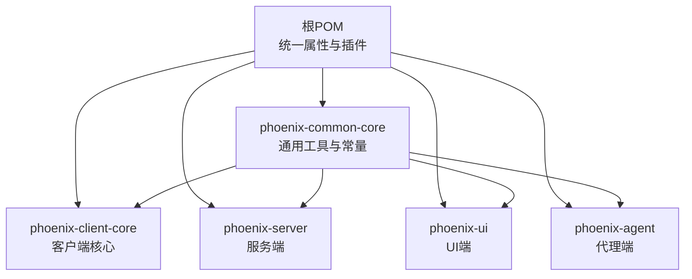
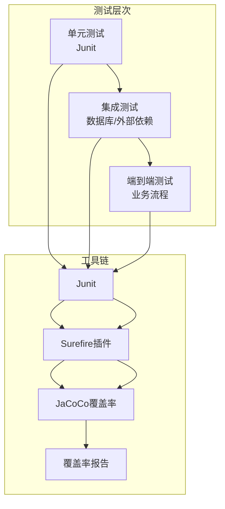
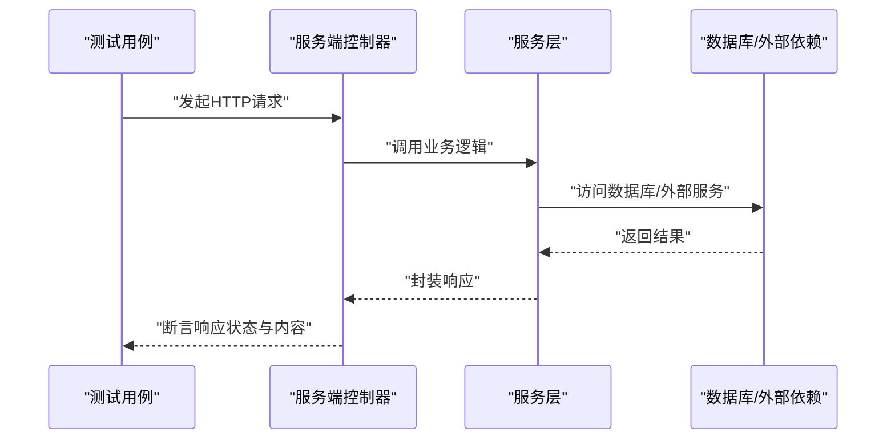
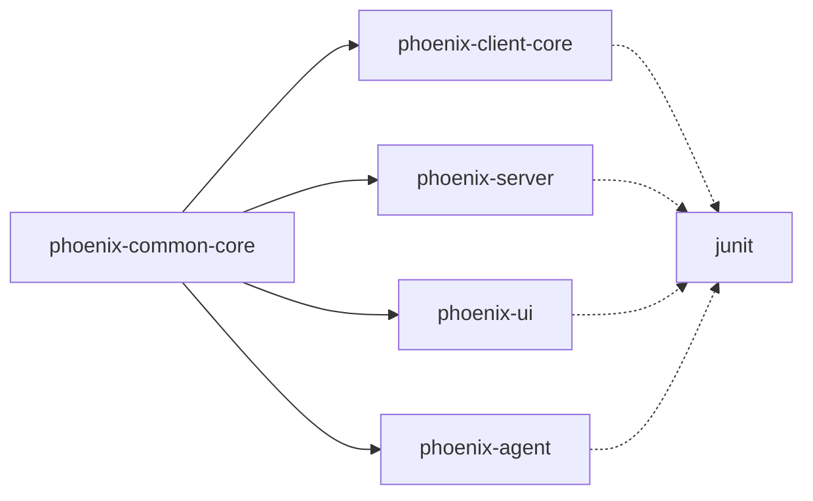

# 测试策略与实施

<cite>
**本文引用的文件**
- [pom.xml](file://pom.xml)
- [phoenix-common-core/pom.xml](file://phoenix-common-core/pom.xml)
- [phoenix-client-core/pom.xml](file://phoenix-client-core/pom.xml)
- [phoenix-server/pom.xml](file://phoenix-server/pom.xml)
- [phoenix-ui/pom.xml](file://phoenix-ui/pom.xml)
- [phoenix-agent/pom.xml](file://phoenix-agent/pom.xml)
- [phoenix-client-core/src/test/java/com/gitee/pifeng/monitoring/plug/MonitorTest.java](file://phoenix-client-core/src/test/java/com/gitee/pifeng/monitoring/plug/MonitorTest.java)
- [phoenix-client-core/src/test/java/com/gitee/pifeng/monitoring/plug/core/LicenseCheckerTest.java](file://phoenix-client-core/src/test/java/com/gitee/pifeng/monitoring/plug/core/LicenseCheckerTest.java)
- [phoenix-server/src/test/java/com/gitee/pifeng/monitoring/server/util/db/MongoUtilsTest.java](file://phoenix-server/src/test/java/com/gitee/pifeng/monitoring/server/util/db/MongoUtilsTest.java)
- [phoenix-common-core/src/test/java/com/gitee/pifeng/monitoring/common/util/secure/AesEncryptUtilsTest.java](file://phoenix-common-core/src/test/java/com/gitee/pifeng/monitoring/common/util/secure/AesEncryptUtilsTest.java)
- [phoenix-client-core/src/test/resources/monitoring.properties](file://phoenix-client-core/src/test/resources/monitoring.properties)
</cite>

## 目录
1. [引言](#引言)
2. [项目结构](#项目结构)
3. [核心组件](#核心组件)
4. [架构总览](#架构总览)
5. [详细组件分析](#详细组件分析)
6. [依赖分析](#依赖分析)
7. [性能考虑](#性能考虑)
8. [故障排查指南](#故障排查指南)
9. [结论](#结论)
10. [附录](#附录)

## 引言
本指南面向Phoenix监控系统的测试策略与实施，覆盖单元测试、集成测试、端到端测试、测试覆盖率、测试环境与自动化、性能与压力测试以及常用测试工具的使用方法。目标是帮助开发者在不同层次上建立稳定、可维护且可度量的测试体系。

## 项目结构
Phoenix采用多模块Maven聚合工程组织，包含公共模块、客户端、服务端、UI端与代理端。测试主要分布在以下模块：
- phoenix-common-core：通用工具与常量的单元测试
- phoenix-client-core：客户端入口与核心组件的单元测试
- phoenix-server：服务端数据库连接与外部依赖的集成测试
- phoenix-ui：UI端业务流程与安全集成的端到端测试（建议）
- phoenix-agent：代理端业务流程与外部依赖的集成测试（建议）

图表来源
- [pom.xml:11-22](file://pom.xml#L11-L22)
- [phoenix-common-core/pom.xml:15-18](file://phoenix-common-core/pom.xml#L15-L18)
- [phoenix-client-core/pom.xml:15-19](file://phoenix-client-core/pom.xml#L15-L19)
- [phoenix-server/pom.xml:15-19](file://phoenix-server/pom.xml#L15-L19)
- [phoenix-ui/pom.xml:15-19](file://phoenix-ui/pom.xml#L15-L19)
- [phoenix-agent/pom.xml:15-19](file://phoenix-agent/pom.xml#L15-L19)

章节来源
- [pom.xml:11-22](file://pom.xml#L11-L22)

## 核心组件
- 单元测试框架：Junit（服务端与公共模块在父POM中统一管理）
- 覆盖率工具：JaCoCo（在根POM中配置，prepare-agent与report阶段）
- 测试跳过控制：maven-surefire-plugin默认跳过测试，可通过命令行或CI取消跳过
- 测试资源：客户端测试配置文件monitoring.properties用于模拟客户端行为

章节来源
- [pom.xml:433-449](file://pom.xml#L433-L449)
- [pom.xml:584-609](file://pom.xml#L584-L609)
- [phoenix-client-core/pom.xml:47-53](file://phoenix-client-core/pom.xml#L47-L53)
- [phoenix-common-core/pom.xml:82-88](file://phoenix-common-core/pom.xml#L82-L88)
- [phoenix-client-core/src/test/resources/monitoring.properties:1-41](file://phoenix-client-core/src/test/resources/monitoring.properties#L1-L41)

## 架构总览
Phoenix测试架构围绕“单元测试-集成测试-端到端测试”三层展开，并通过JaCoCo在构建阶段生成覆盖率报告，确保质量可度量。

图表来源
- [pom.xml:433-449](file://pom.xml#L433-L449)
- [pom.xml:584-609](file://pom.xml#L584-L609)

## 详细组件分析

### 单元测试设计与实施
- 设计原则
  - 每个类/方法一个关注点，用例覆盖正常/异常/边界条件
  - 使用断言验证返回值、状态变化与副作用
  - 对纯函数与工具类优先使用单元测试，避免外部依赖
- Mock对象使用
  - 建议在需要隔离外部依赖时引入Mockito（可在各模块pom中按需添加）
  - 对于客户端埋点与告警发送，建议通过接口抽象与构造器注入便于替换
- 测试数据准备
  - 使用测试资源配置文件（如monitoring.properties）模拟客户端配置
  - 对加解密工具类，使用确定性输入与期望输出进行断言
- 断言方法
  - 使用Junit断言（如assertEquals、assertNotNull、assertTrue）验证结果
  - 对日志输出可结合日志框架进行行为验证（如记录级别与消息片段）

示例参考
- 客户端埋点与告警发送测试：[MonitorTest.java:33-54](file://phoenix-client-core/src/test/java/com/gitee/pifeng/monitoring/plug/MonitorTest.java#L33-L54)
- 许可证生成测试：[LicenseCheckerTest.java:27-34](file://phoenix-client-core/src/test/java/com/gitee/pifeng/monitoring/plug/core/LicenseCheckerTest.java#L27-L34)
- AES加解密工具测试：[AesEncryptUtilsTest.java:27-45](file://phoenix-common-core/src/test/java/com/gitee/pifeng/monitoring/common/util/secure/AesEncryptUtilsTest.java#L27-L45)
- 客户端测试配置：[monitoring.properties:1-41](file://phoenix-client-core/src/test/resources/monitoring.properties#L1-L41)

章节来源
- [phoenix-client-core/src/test/java/com/gitee/pifeng/monitoring/plug/MonitorTest.java:33-54](file://phoenix-client-core/src/test/java/com/gitee/pifeng/monitoring/plug/MonitorTest.java#L33-L54)
- [phoenix-client-core/src/test/java/com/gitee/pifeng/monitoring/plug/core/LicenseCheckerTest.java:27-34](file://phoenix-client-core/src/test/java/com/gitee/pifeng/monitoring/plug/core/LicenseCheckerTest.java#L27-L34)
- [phoenix-common-core/src/test/java/com/gitee/pifeng/monitoring/common/util/secure/AesEncryptUtilsTest.java:27-45](file://phoenix-common-core/src/test/java/com/gitee/pifeng/monitoring/common/util/secure/AesEncryptUtilsTest.java#L27-L45)
- [phoenix-client-core/src/test/resources/monitoring.properties:1-41](file://phoenix-client-core/src/test/resources/monitoring.properties#L1-L41)

### 集成测试实施方案
- 模块间接口测试
  - 通过启动服务端应用上下文，对控制器/服务层接口进行HTTP请求验证
  - 使用Spring Boot Test与RestAssured或WebTestClient进行端口绑定与请求发送
- 数据库连接测试
  - 使用真实数据库（MySQL/Oracle）或内存数据库（H2）进行连接与CRUD验证
  - 对MongoDB连接进行连通性与可用性测试（参考MongoUtilsTest）
- 外部依赖测试
  - 对Redis/MongoDB/HTTP客户端等外部依赖进行连通性与功能验证
  - 参考：[MongoUtilsTest.java:29-50](file://phoenix-server/src/test/java/com/gitee/pifeng/monitoring/server/util/db/MongoUtilsTest.java#L29-L50)

图表来源
- [phoenix-server/src/test/java/com/gitee/pifeng/monitoring/server/util/db/MongoUtilsTest.java:29-50](file://phoenix-server/src/test/java/com/gitee/pifeng/monitoring/server/util/db/MongoUtilsTest.java#L29-L50)

章节来源
- [phoenix-server/src/test/java/com/gitee/pifeng/monitoring/server/util/db/MongoUtilsTest.java:29-50](file://phoenix-server/src/test/java/com/gitee/pifeng/monitoring/server/util/db/MongoUtilsTest.java#L29-L50)

### 端到端测试场景
- 完整业务流程测试
  - 从UI登录到创建监控实例、查看监控数据、接收告警的全流程验证
  - 使用浏览器自动化（如Selenium）或API级E2E（REST Assured）验证
- 用户操作流程测试
  - 登录认证、权限校验、会话管理、验证码校验等
  - 参考UI模块的安全配置与认证流程
- 系统边界测试
  - 超时、限流、异常注入、网络抖动等边界条件验证

（本节为概念性指导，不直接分析具体文件）

### 测试覆盖率与测量
- 覆盖率插件配置
  - 在根POM中启用JaCoCo插件，在prepare-agent阶段注入agent，在prepare-package阶段生成报告
- 报告生成
  - 报告输出至target/site/jacoco目录，可与CI系统集成生成HTML报告
- 覆盖率阈值
  - 建议在CI中设置最低覆盖率阈值（如语句覆盖率≥80%），并在PR中强制检查

章节来源
- [pom.xml:584-609](file://pom.xml#L584-L609)

### 测试环境搭建与管理
- 测试数据库
  - 使用Docker容器快速拉起MySQL/MongoDB/Redis等依赖服务
  - 在CI中使用服务发现与健康检查确保依赖可用
- 测试数据管理
  - 使用SQL脚本初始化测试数据，或通过MyBatis Plus Generator生成测试实体
  - 对敏感数据进行脱敏或使用占位符
- 测试环境隔离
  - 通过profile或环境变量区分开发/测试/生产环境配置
  - 各模块application-dev.yml用于本地测试环境

章节来源
- [phoenix-server/pom.xml:22-24](file://phoenix-server/pom.xml#L22-L24)
- [phoenix-ui/pom.xml:22-24](file://phoenix-ui/pom.xml#L22-L24)
- [phoenix-agent/pom.xml:22-24](file://phoenix-agent/pom.xml#L22-L24)

### 自动化测试实施
- 持续集成中的测试执行
  - 在CI流水线中执行mvn test（或mvn verify），确保测试与覆盖率报告生成
  - 使用maven-surefire-plugin控制测试跳过与fork参数
- 测试报告生成
  - 使用Surefire报告与JaCoCo HTML报告，上传至CI制品库
- 测试结果分析
  - 结合覆盖率阈值与失败用例定位问题，形成回归清单

章节来源
- [pom.xml:433-449](file://pom.xml#L433-L449)
- [pom.xml:584-609](file://pom.xml#L584-L609)

### 性能测试与压力测试
- 负载测试
  - 使用JMeter或Gatling对关键接口施加并发负载，观察吞吐与延迟
- 并发测试
  - 针对线程池与异步任务进行并发压力验证，确保无死锁与资源泄露
- 稳定性测试
  - 长时间运行（如24小时）观察内存泄漏、连接池耗尽等问题

（本节为通用指导，不直接分析具体文件）

### 测试工具使用指南
- JUnit
  - 使用@Test标注测试方法，使用断言验证结果
- Mockito（建议）
  - 通过@Mock/@InjectMocks创建桩对象，验证交互与返回值
- TestNG（可选）
  - 支持更灵活的分组与并行执行，适合复杂场景

（本节为通用指导，不直接分析具体文件）

## 依赖分析
- 模块间依赖
  - phoenix-client-core依赖phoenix-common-core；服务端/UI/代理端均依赖phoenix-common-web与客户端starter
- 测试依赖
  - 各模块在pom中声明junit依赖，便于单元测试
- 工具链依赖
  - 根POM统一管理spring-boot、mybatis-plus、druid、jedis、mongo等依赖

图表来源
- [phoenix-client-core/pom.xml:23-27](file://phoenix-client-core/pom.xml#L23-L27)
- [phoenix-server/pom.xml:27-37](file://phoenix-server/pom.xml#L27-L37)
- [phoenix-ui/pom.xml:26-37](file://phoenix-ui/pom.xml#L26-L37)
- [phoenix-agent/pom.xml:26-37](file://phoenix-agent/pom.xml#L26-L37)
- [phoenix-common-core/pom.xml:82-88](file://phoenix-common-core/pom.xml#L82-L88)

章节来源
- [phoenix-client-core/pom.xml:23-27](file://phoenix-client-core/pom.xml#L23-L27)
- [phoenix-server/pom.xml:27-37](file://phoenix-server/pom.xml#L27-L37)
- [phoenix-ui/pom.xml:26-37](file://phoenix-ui/pom.xml#L26-L37)
- [phoenix-agent/pom.xml:26-37](file://phoenix-agent/pom.xml#L26-L37)
- [phoenix-common-core/pom.xml:82-88](file://phoenix-common-core/pom.xml#L82-L88)

## 性能考虑
- 测试执行性能
  - 使用单fork与reuseForks提升测试执行效率
  - 合理拆分测试套件，避免长时间阻塞
- 覆盖率收集性能
  - JaCoCo agent仅在test阶段注入，不影响生产包大小
- 数据库与外部依赖
  - 使用连接池与超时配置，避免测试阻塞
  - 对MongoDB/Redis等外部依赖使用容器化与预热

章节来源
- [pom.xml:433-449](file://pom.xml#L433-L449)
- [pom.xml:584-609](file://pom.xml#L584-L609)

## 故障排查指南
- 测试跳过
  - 若测试未执行，检查maven-surefire-plugin的skipTests配置
- 覆盖率报告缺失
  - 确认JaCoCo在prepare-package阶段执行report
- 外部依赖不可达
  - 检查Docker容器状态与网络连通性，确认端口映射与凭据
- 断言失败
  - 使用日志输出与断言信息定位输入/期望差异

章节来源
- [pom.xml:433-449](file://pom.xml#L433-L449)
- [pom.xml:584-609](file://pom.xml#L584-L609)
- [phoenix-server/src/test/java/com/gitee/pifeng/monitoring/server/util/db/MongoUtilsTest.java:29-50](file://phoenix-server/src/test/java/com/gitee/pifeng/monitoring/server/util/db/MongoUtilsTest.java#L29-L50)

## 结论
通过分层测试策略与工具链整合，Phoenix监控系统可在单元、集成与端到端层面全面保障质量。结合JaCoCo覆盖率与CI流水线，可实现持续改进与风险可控的交付节奏。

## 附录
- 测试配置要点
  - 在各模块pom中声明junit依赖
  - 在根POM中启用JaCoCo与Surefire插件
  - 使用测试配置文件模拟客户端行为
- 建议补充
  - 引入Mockito进行Mock测试
  - 在UI与Agent模块增加集成与端到端测试
  - 在CI中设置覆盖率阈值与报告归档

章节来源
- [phoenix-client-core/pom.xml:47-53](file://phoenix-client-core/pom.xml#L47-L53)
- [phoenix-common-core/pom.xml:82-88](file://phoenix-common-core/pom.xml#L82-L88)
- [pom.xml:584-609](file://pom.xml#L584-L609)