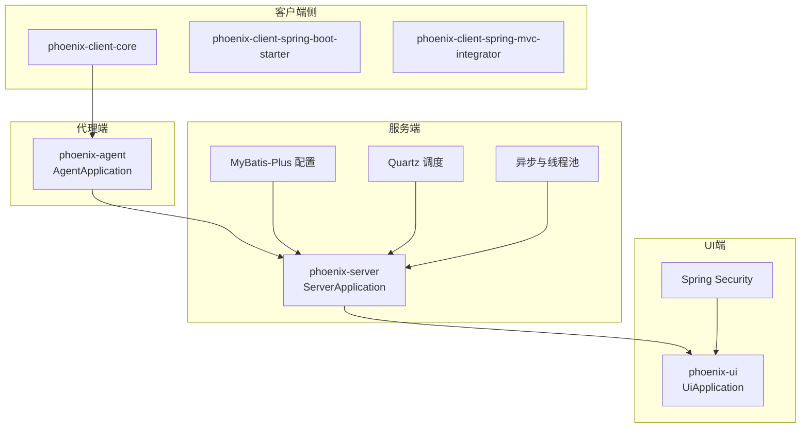
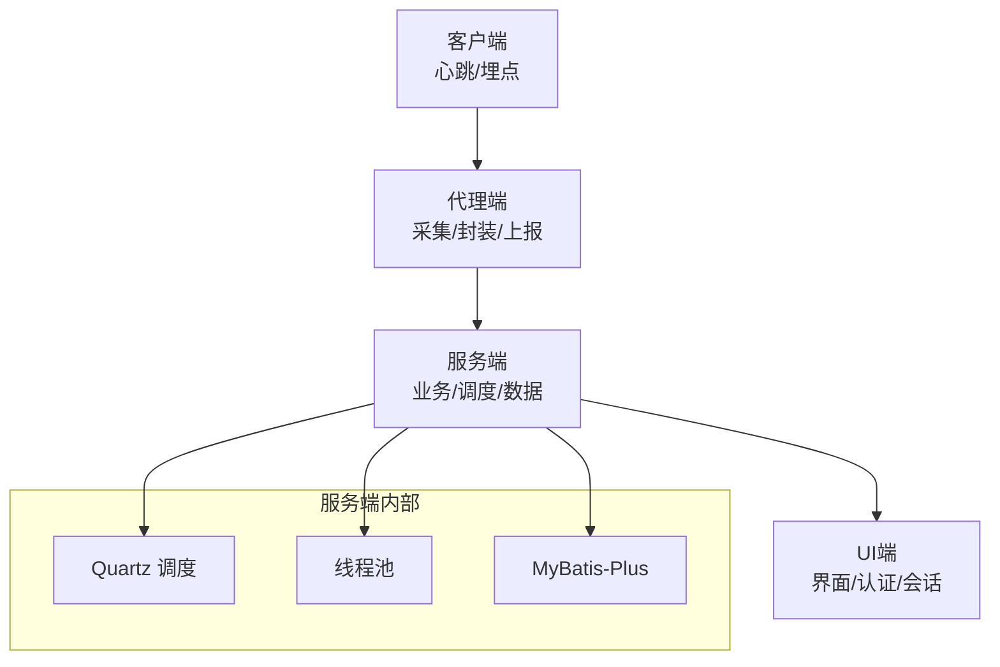
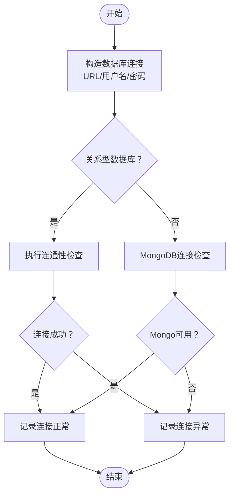
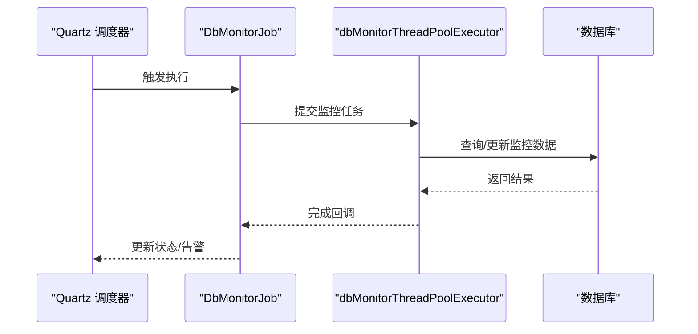
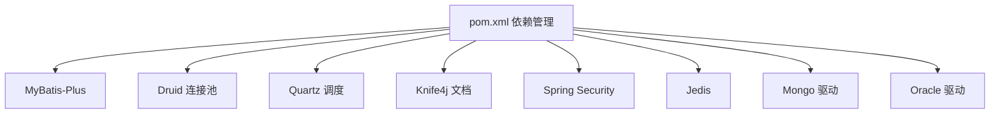

# 集成测试

<cite>
**本文档引用的文件**
- [pom.xml](file://pom.xml)
- [application.yml（服务端）](file://phoenix-server/src/main/resources/application.yml)
- [MybatisPlusConfig（服务端）](file://phoenix-server/src/main/java/com/gitee/pifeng/monitoring/server/config/MybatisPlusConfig.java)
- [application.yml（代理端）](file://phoenix-agent/src/main/resources/application.yml)
- [application.yml（UI端）](file://phoenix-ui/src/main/resources/application.yml)
- [MybatisPlusConfig（UI端）](file://phoenix-ui/src/main/java/com/gitee/pifeng/monitoring/ui/config/mybatisplus/MybatisPlusConfig.java)
- [DbUtils（服务端）](file://phoenix-server/src/main/java/com/gitee/pifeng/monitoring/server/util/db/DbUtils.java)
- [DbServiceImpl（服务端）](file://phoenix-server/src/main/java/com/gitee/pifeng/monitoring/server/business/server/service/impl/DbServiceImpl.java)
- [DbMonitorJob（服务端）](file://phoenix-server/src/main/java/com/gitee/pifeng/monitoring/server/business/server/monitor/db/DbMonitorJob.java)
- [MongoUtilsTest（服务端测试）](file://phoenix-server/src/test/java/com/gitee/pifeng/monitoring/server/util/db/MongoUtilsTest.java)
- [DbDriverClassConstants（UI端）](file://phoenix-ui/src/main/java/com/gitee/pifeng/monitoring/ui/constant/DbDriverClassConstants.java)
- [AsyncConfig（服务端）](file://phoenix-server/src/main/java/com/gitee/pifeng/monitoring/server/config/AsyncConfig.java)
- [ThreadPoolConfig（服务端）](file://phoenix-server/src/main/java/com/gitee/pifeng/monitoring/server/config/ThreadPoolConfig.java)
- [SchedulingConfig（服务端）](file://phoenix-server/src/main/java/com/gitee/pifeng/monitoring/server/config/SchedulingConfig.java)
- [QuartzConfig（服务端）](file://phoenix-server/src/main/java/com/gitee/pifeng/monitoring/server/config/QuartzConfig.java)
- [AlarmMonitorJob（服务端）](file://phoenix-server/src/main/java/com/gitee/pifeng/monitoring/server/business/server/monitor/AlarmMonitorJob.java)
- [SpringSecurityConfig（UI端）](file://phoenix-ui/src/main/java/com/gitee/pifeng/monitoring/ui/config/springsecurity/SpringSecurityConfig.java)
</cite>

## 目录
1. [引言](#引言)
2. [项目结构](#项目结构)
3. [核心组件](#核心组件)
4. [架构总览](#架构总览)
5. [详细组件分析](#详细组件分析)
6. [依赖分析](#依赖分析)
7. [性能考量](#性能考量)
8. [故障排查指南](#故障排查指南)
9. [结论](#结论)
10. [附录](#附录)

## 引言
本指南面向Phoenix监控系统的集成测试实践，聚焦以下目标：
- 模块间接口测试：客户端与代理端、代理端与服务端、服务端与UI端的端到端验证。
- 数据库连接测试：MyBatis-Plus配置、连接池、事务与SQL执行性能插件的验证。
- 外部依赖测试：Redis、MongoDB、Oracle等数据库连接与网络连通性。
- 配置文件验证：多环境配置加载与参数有效性校验。
- 异步任务测试：定时任务触发、线程池使用与结果验证。
- 安全模块测试：Spring Security配置、认证授权、会话与记住我机制。
- 测试环境搭建与管理：测试数据库准备、测试数据导入、环境隔离。

## 项目结构
Phoenix采用多模块Maven工程，核心模块包括：
- 公共模块（phoenix-common）：跨模块通用能力与基础设施。
- 代理端（phoenix-agent）：采集与上报监控数据。
- 服务端（phoenix-server）：核心业务、调度、数据库与接口。
- UI端（phoenix-ui）：前端界面与安全配置。
- 客户端（phoenix-client）：应用侧埋点与心跳上报。

**图表来源**
- [pom.xml](file://pom.xml)
- [application.yml（服务端）](file://phoenix-server/src/main/resources/application.yml)
- [application.yml（代理端）](file://phoenix-agent/src/main/resources/application.yml)
- [application.yml（UI端）](file://phoenix-ui/src/main/resources/application.yml)

**章节来源**
- [pom.xml](file://pom.xml)

## 核心组件
- 配置与运行时
  - 服务端、代理端、UI端均通过application.yml进行环境化配置，包含日志、数据源、MyBatis-Plus、Knife4j文档、Actuator端点等。
  - 服务端引入Quartz、线程池与异步配置，支撑定时任务与高并发监控采集。
- 数据访问
  - MyBatis-Plus配置位于服务端与UI端，分别扫描各自业务DAO包，启用分页、性能插件与自定义SQL注入器。
  - 服务端提供DbUtils与DbServiceImpl用于关系型数据库连接测试与连通性验证。
- 外部依赖
  - MongoDB连接测试由服务端测试用例覆盖，验证客户端可用性与连通性。
  - UI端提供数据库驱动常量，便于识别Redis与Mongo驱动类。
- 安全
  - UI端基于Spring Security的自定义认证提供者与JDBC会话管理，支持记住我与会话并发控制。

**章节来源**
- [application.yml（服务端）](file://phoenix-server/src/main/resources/application.yml)
- [MybatisPlusConfig（服务端）](file://phoenix-server/src/main/java/com/gitee/pifeng/monitoring/server/config/MybatisPlusConfig.java)
- [application.yml（代理端）](file://phoenix-agent/src/main/resources/application.yml)
- [application.yml（UI端）](file://phoenix-ui/src/main/resources/application.yml)
- [MybatisPlusConfig（UI端）](file://phoenix-ui/src/main/java/com/gitee/pifeng/monitoring/ui/config/mybatisplus/MybatisPlusConfig.java)
- [DbUtils（服务端）](file://phoenix-server/src/main/java/com/gitee/pifeng/monitoring/server/util/db/DbUtils.java)
- [DbServiceImpl（服务端）](file://phoenix-server/src/main/java/com/gitee/pifeng/monitoring/server/business/server/service/impl/DbServiceImpl.java)
- [MongoUtilsTest（服务端测试）](file://phoenix-server/src/test/java/com/gitee/pifeng/monitoring/server/util/db/MongoUtilsTest.java)
- [DbDriverClassConstants（UI端）](file://phoenix-ui/src/main/java/com/gitee/pifeng/monitoring/ui/constant/DbDriverClassConstants.java)
- [SpringSecurityConfig（UI端）](file://phoenix-ui/src/main/java/com/gitee/pifeng/monitoring/ui/config/springsecurity/SpringSecurityConfig.java)

## 架构总览
Phoenix监控系统采用“客户端-代理端-服务端-UI端”的链路，结合Quartz定时任务与线程池实现高并发监控采集与告警。

**图表来源**
- [application.yml（服务端）](file://phoenix-server/src/main/resources/application.yml)
- [application.yml（代理端）](file://phoenix-agent/src/main/resources/application.yml)
- [application.yml（UI端）](file://phoenix-ui/src/main/resources/application.yml)
- [QuartzConfig（服务端）](file://phoenix-server/src/main/java/com/gitee/pifeng/monitoring/server/config/QuartzConfig.java)
- [ThreadPoolConfig（服务端）](file://phoenix-server/src/main/java/com/gitee/pifeng/monitoring/server/config/ThreadPoolConfig.java)
- [MybatisPlusConfig（服务端）](file://phoenix-server/src/main/java/com/gitee/pifeng/monitoring/server/config/MybatisPlusConfig.java)

## 详细组件分析

### 客户端与代理端接口测试
- 目标
  - 验证客户端心跳、埋点与代理端采集封装流程的正确性与稳定性。
  - 校验代理端与服务端的通信协议、加解密与响应处理。
- 方法
  - 通过代理端的控制器与服务层，模拟客户端上报包的构造与转发。
  - 使用服务端的定时任务与线程池，验证代理端上报数据的入库与处理。
- 关键点
  - 请求包构造与响应包加密的切面配置。
  - 代理端与服务端的URL常量与接口路径一致性。

**章节来源**
- [application.yml（代理端）](file://phoenix-agent/src/main/resources/application.yml)
- [application.yml（服务端）](file://phoenix-server/src/main/resources/application.yml)

### 代理端与服务端接口测试
- 目标
  - 端到端验证代理端上报数据在服务端的接收、解析、入库与后续处理。
- 方法
  - 通过服务端控制器接收代理端上报包，调用业务服务进行处理。
  - 使用定时任务扫描监控表，验证数据流转与告警逻辑。
- 关键点
  - 加解密切面在请求/响应阶段的应用。
  - 线程池与异步配置对高并发场景的支撑。

**章节来源**
- [AsyncConfig（服务端）](file://phoenix-server/src/main/java/com/gitee/pifeng/monitoring/server/config/AsyncConfig.java)
- [ThreadPoolConfig（服务端）](file://phoenix-server/src/main/java/com/gitee/pifeng/monitoring/server/config/ThreadPoolConfig.java)
- [SchedulingConfig（服务端）](file://phoenix-server/src/main/java/com/gitee/pifeng/monitoring/server/config/SchedulingConfig.java)

### 服务端与UI端接口测试
- 目标
  - 验证UI端对服务端REST接口的访问、鉴权与数据展示。
- 方法
  - 使用Knife4j/Swagger接口文档进行手动与自动化测试。
  - 验证Spring Security的登录、会话与记住我机制。
- 关键点
  - 自定义认证提供者与WebSecurity忽略规则。
  - JDBC会话管理与并发登录控制。

**章节来源**
- [application.yml（UI端）](file://phoenix-ui/src/main/resources/application.yml)
- [SpringSecurityConfig（UI端）](file://phoenix-ui/src/main/java/com/gitee/pifeng/monitoring/ui/config/springsecurity/SpringSecurityConfig.java)

### 数据库连接测试
- 目标
  - 验证MyBatis-Plus配置、连接池、SQL执行性能插件与事务行为。
- 方法
  - 使用DbUtils与DbServiceImpl进行关系型数据库连接测试。
  - 通过MongoUtilsTest验证MongoDB连接可用性。
  - 在开发/测试环境启用PerformanceInterceptor观察SQL执行效率。
- 关键点
  - Druid连接池参数与SQL慢查询统计。
  - MyBatis-Plus分页与自定义SQL注入器。
  - Oracle驱动与JDBC Null映射配置。

**图表来源**
- [DbUtils（服务端）](file://phoenix-server/src/main/java/com/gitee/pifeng/monitoring/server/util/db/DbUtils.java)
- [DbServiceImpl（服务端）](file://phoenix-server/src/main/java/com/gitee/pifeng/monitoring/server/business/server/service/impl/DbServiceImpl.java)
- [MongoUtilsTest（服务端测试）](file://phoenix-server/src/test/java/com/gitee/pifeng/monitoring/server/util/db/MongoUtilsTest.java)
- [application.yml（服务端）](file://phoenix-server/src/main/resources/application.yml)
- [MybatisPlusConfig（服务端）](file://phoenix-server/src/main/java/com/gitee/pifeng/monitoring/server/config/MybatisPlusConfig.java)

**章节来源**
- [application.yml（服务端）](file://phoenix-server/src/main/resources/application.yml)
- [MybatisPlusConfig（服务端）](file://phoenix-server/src/main/java/com/gitee/pifeng/monitoring/server/config/MybatisPlusConfig.java)
- [DbUtils（服务端）](file://phoenix-server/src/main/java/com/gitee/pifeng/monitoring/server/util/db/DbUtils.java)
- [DbServiceImpl（服务端）](file://phoenix-server/src/main/java/com/gitee/pifeng/monitoring/server/business/server/service/impl/DbServiceImpl.java)
- [MongoUtilsTest（服务端测试）](file://phoenix-server/src/test/java/com/gitee/pifeng/monitoring/server/util/db/MongoUtilsTest.java)

### 外部依赖测试
- Redis/MongoDB/Oracle
  - Redis与MongoDB驱动常量在UI端提供，便于识别与配置。
  - MongoDB连接测试用例验证客户端可用性。
  - Oracle驱动在依赖中声明，需在测试环境中配置对应驱动与连接串。
- 网络服务连通性
  - 通过代理端与服务端的健康检查端点与日志，验证网络可达性与服务状态。

**章节来源**
- [DbDriverClassConstants（UI端）](file://phoenix-ui/src/main/java/com/gitee/pifeng/monitoring/ui/constant/DbDriverClassConstants.java)
- [MongoUtilsTest（服务端测试）](file://phoenix-server/src/test/java/com/gitee/pifeng/monitoring/server/util/db/MongoUtilsTest.java)
- [pom.xml](file://pom.xml)

### 配置文件测试验证
- 多环境配置加载
  - 服务端、代理端、UI端均通过profiles.active加载不同环境配置。
  - application.yml中包含dev/prod示例，需在测试环境按需切换。
- 参数有效性验证
  - 数据源、连接池、Quartz、Knife4j、Actuator等关键参数在测试中逐一校验。
  - MyBatis-Plus的mapper扫描路径与数据库ID配置需与实际数据库匹配。

**章节来源**
- [application.yml（服务端）](file://phoenix-server/src/main/resources/application.yml)
- [application.yml（代理端）](file://phoenix-agent/src/main/resources/application.yml)
- [application.yml（UI端）](file://phoenix-ui/src/main/resources/application.yml)

### 异步任务测试
- 定时任务触发
  - QuartzConfig定义多种监控任务的JobDetail与Trigger，包括数据库、HTTP、服务器、网络、TCP与告警清理等。
  - 通过SchedulingConfig与AsyncConfig统一任务调度与异步执行器。
- 线程池使用
  - ThreadPoolConfig提供多类监控专用线程池，满足不同监控维度的并发需求。
- 结果验证
  - 通过任务执行日志与数据库状态更新，验证任务触发与处理结果。

**图表来源**
- [QuartzConfig（服务端）](file://phoenix-server/src/main/java/com/gitee/pifeng/monitoring/server/config/QuartzConfig.java)
- [DbMonitorJob（服务端）](file://phoenix-server/src/main/java/com/gitee/pifeng/monitoring/server/business/server/monitor/db/DbMonitorJob.java)
- [ThreadPoolConfig（服务端）](file://phoenix-server/src/main/java/com/gitee/pifeng/monitoring/server/config/ThreadPoolConfig.java)
- [SchedulingConfig（服务端）](file://phoenix-server/src/main/java/com/gitee/pifeng/monitoring/server/config/SchedulingConfig.java)
- [AsyncConfig（服务端）](file://phoenix-server/src/main/java/com/gitee/pifeng/monitoring/server/config/AsyncConfig.java)

**章节来源**
- [QuartzConfig（服务端）](file://phoenix-server/src/main/java/com/gitee/pifeng/monitoring/server/config/QuartzConfig.java)
- [ThreadPoolConfig（服务端）](file://phoenix-server/src/main/java/com/gitee/pifeng/monitoring/server/config/ThreadPoolConfig.java)
- [SchedulingConfig（服务端）](file://phoenix-server/src/main/java/com/gitee/pifeng/monitoring/server/config/SchedulingConfig.java)
- [AsyncConfig（服务端）](file://phoenix-server/src/main/java/com/gitee/pifeng/monitoring/server/config/AsyncConfig.java)

### 安全模块测试
- Spring Security配置
  - UI端启用WebSecurity、JDBC会话管理与全局方法级安全。
  - 自定义认证提供者与登录失败处理器，支持验证码与记住我。
- 认证授权测试
  - 验证登录接口、会话并发控制、记住我Cookie与会话失效处理。
- 加密解密测试
  - MyBatis-Plus配置中包含加密相关依赖，可在测试中验证敏感字段的处理。

**章节来源**
- [SpringSecurityConfig（UI端）](file://phoenix-ui/src/main/java/com/gitee/pifeng/monitoring/ui/config/springsecurity/SpringSecurityConfig.java)
- [application.yml（UI端）](file://phoenix-ui/src/main/resources/application.yml)

## 依赖分析
- 外部依赖
  - MyBatis-Plus、Druid连接池、Quartz、Knife4j、BCrypt加密、Jedis、Mongo驱动、Oracle驱动等。
- 内部模块耦合
  - 服务端依赖公共模块与UI端的业务模型，代理端与服务端通过协议与线程池解耦。
  - UI端依赖Spring Security与JDBC会话，实现统一认证与会话管理。

**图表来源**
- [pom.xml](file://pom.xml)

**章节来源**
- [pom.xml](file://pom.xml)

## 性能考量
- 连接池与SQL性能
  - Druid连接池参数需结合业务峰值QPS调优，关注最大活跃连接、等待超时与慢SQL统计。
  - MyBatis-Plus在测试环境启用PerformanceInterceptor，定位慢查询与执行计划问题。
- 并发与线程池
  - 不同监控维度使用独立线程池，避免相互影响；线程数与队列容量需与CPU核数与I/O特性匹配。
- 定时任务
  - Quartz集群化配置与分布式锁保障任务幂等与一致性。

## 故障排查指南
- 数据库连接失败
  - 检查URL、用户名、密码与驱动类；确认连接池参数与验证SQL。
- MongoDB不可达
  - 使用MongoUtilsTest验证客户端可用性，检查网络与端口。
- 定时任务未触发
  - 核对Quartz配置、Trigger起始时间与调度器状态。
- 安全登录异常
  - 检查Spring Security配置、忽略规则与认证提供者；验证验证码与记住我Cookie。

**章节来源**
- [DbUtils（服务端）](file://phoenix-server/src/main/java/com/gitee/pifeng/monitoring/server/util/db/DbUtils.java)
- [MongoUtilsTest（服务端测试）](file://phoenix-server/src/test/java/com/gitee/pifeng/monitoring/server/util/db/MongoUtilsTest.java)
- [QuartzConfig（服务端）](file://phoenix-server/src/main/java/com/gitee/pifeng/monitoring/server/config/QuartzConfig.java)
- [SpringSecurityConfig（UI端）](file://phoenix-ui/src/main/java/com/gitee/pifeng/monitoring/ui/config/springsecurity/SpringSecurityConfig.java)

## 结论
通过本集成测试指南，可系统性验证Phoenix监控系统在多模块、多依赖、多环境下的接口连通性、数据一致性、性能与安全。建议在持续集成流水线中纳入上述测试场景，确保系统稳定交付。

## 附录
- 测试环境建议
  - 准备独立的测试数据库与消息中间件，隔离生产数据。
  - 使用Docker Compose快速拉起服务端、代理端、UI端与外部依赖容器。
- 测试用例设计思路
  - 接口层：基于Knife4j/Swagger编写场景化用例，覆盖登录、监控列表、详情与导出。
  - 业务层：围绕定时任务与线程池，验证任务触发频率、并发处理与结果落库。
  - 数据层：验证连接池参数、SQL执行性能与事务边界。
  - 安全层：验证登录流程、会话并发、记住我与登出清理。