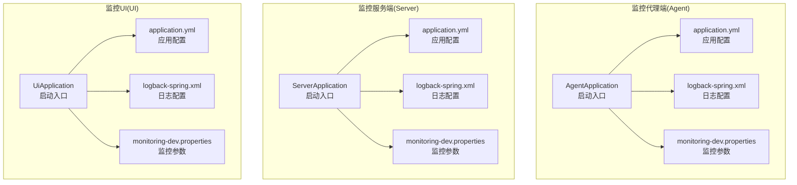
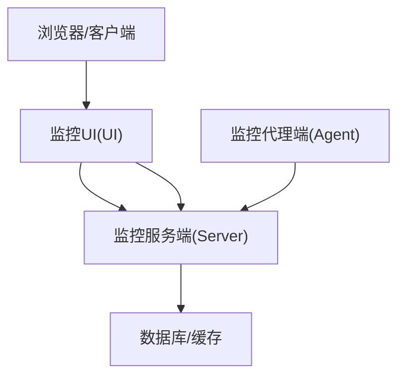
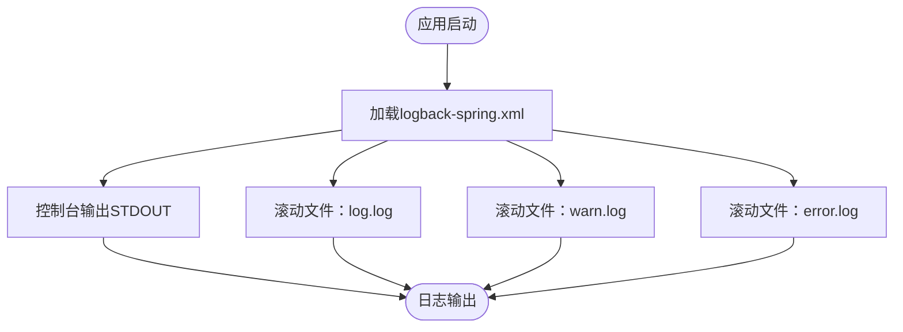
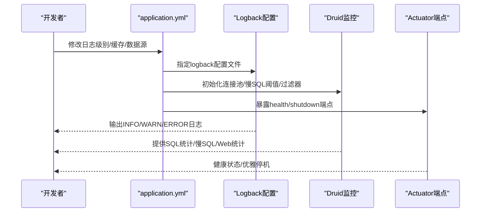
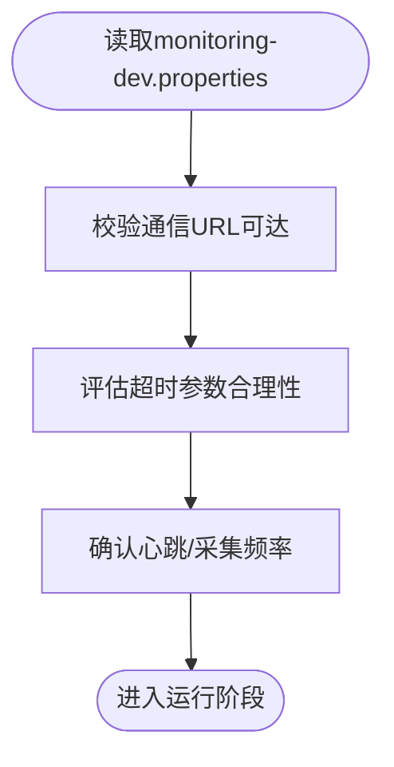
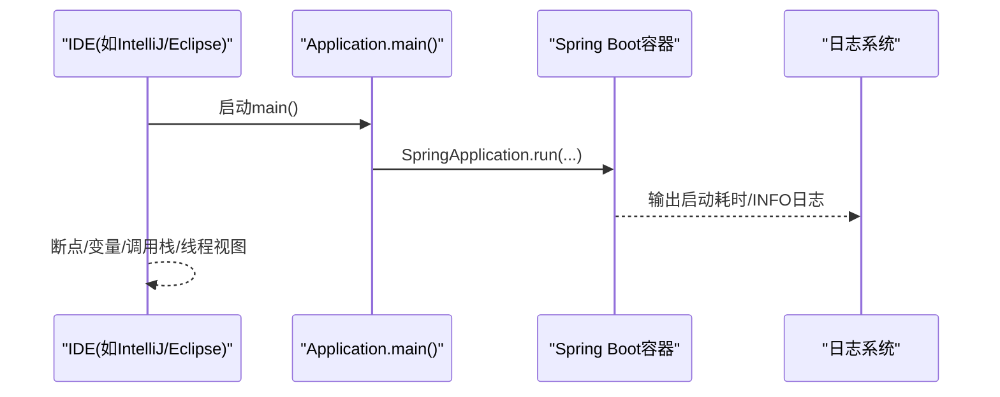
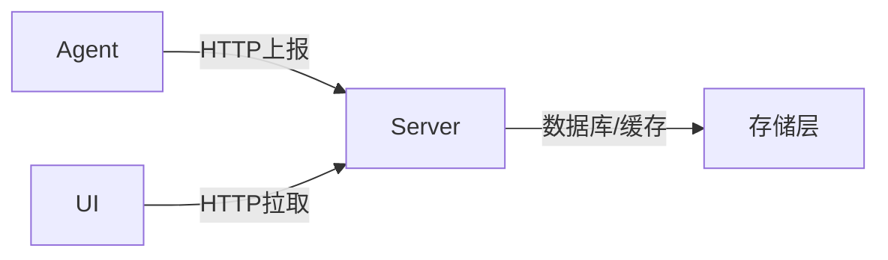

# 调试技巧与工具

<cite>
**本文引用的文件**
- [phoenix-agent/src/main/resources/logback-spring.xml](file://phoenix-agent/src/main/resources/logback-spring.xml)
- [phoenix-server/src/main/resources/logback-spring.xml](file://phoenix-server/src/main/resources/logback-spring.xml)
- [phoenix-ui/src/main/resources/logback-spring.xml](file://phoenix-ui/src/main/resources/logback-spring.xml)
- [phoenix-agent/src/main/resources/application.yml](file://phoenix-agent/src/main/resources/application.yml)
- [phoenix-server/src/main/resources/application.yml](file://phoenix-server/src/main/resources/application.yml)
- [phoenix-ui/src/main/resources/application.yml](file://phoenix-ui/src/main/resources/application.yml)
- [phoenix-agent/src/main/resources/monitoring-dev.properties](file://phoenix-agent/src/main/resources/monitoring-dev.properties)
- [phoenix-server/src/main/resources/monitoring-dev.properties](file://phoenix-server/src/main/resources/monitoring-dev.properties)
- [phoenix-ui/src/main/resources/monitoring-dev.properties](file://phoenix-ui/src/main/resources/monitoring-dev.properties)
- [phoenix-agent/src/main/java/com/gitee/pifeng/monitoring/agent/AgentApplication.java](file://phoenix-agent/src/main/java/com/gitee/pifeng/monitoring/agent/AgentApplication.java)
- [phoenix-server/src/main/java/com/gitee/pifeng/monitoring/server/ServerApplication.java](file://phoenix-server/src/main/java/com/gitee/pifeng/monitoring/server/ServerApplication.java)
- [phoenix-ui/src/main/java/com/gitee/pifeng/monitoring/ui/UiApplication.java](file://phoenix-ui/src/main/java/com/gitee/pifeng/monitoring/ui/UiApplication.java)
</cite>

## 目录
1. [简介](#简介)
2. [项目结构](#项目结构)
3. [核心组件](#核心组件)
4. [架构总览](#架构总览)
5. [详细组件分析](#详细组件分析)
6. [依赖分析](#依赖分析)
7. [性能考量](#性能考量)
8. [故障排查指南](#故障排查指南)
9. [结论](#结论)
10. [附录](#附录)

## 简介
本指南面向Phoenix监控系统的调试与排障，围绕IDE调试配置、日志分析、性能分析工具、网络抓包、数据库调试、分布式调试以及常见问题的系统性排查展开。文档结合项目实际配置文件与启动入口，提供可操作的步骤与可视化图示，帮助开发者快速定位问题并优化系统。

## 项目结构
Phoenix由三部分组成：监控代理端（Agent）、监控服务端（Server）、监控UI（UI）。各模块均采用Spring Boot，具备独立的日志与配置体系，便于分别调试与联调。

图表来源
- [AgentApplication.java:1-40](file://phoenix-agent/src/main/java/com/gitee/pifeng/monitoring/agent/AgentApplication.java#L1-L40)
- [ServerApplication.java:1-48](file://phoenix-server/src/main/java/com/gitee/pifeng/monitoring/server/ServerApplication.java#L1-L48)
- [UiApplication.java:1-49](file://phoenix-ui/src/main/java/com/gitee/pifeng/monitoring/ui/UiApplication.java#L1-L49)
- [application.yml（Agent）:1-111](file://phoenix-agent/src/main/resources/application.yml#L1-L111)
- [application.yml（Server）:1-271](file://phoenix-server/src/main/resources/application.yml#L1-L271)
- [application.yml（UI）:1-238](file://phoenix-ui/src/main/resources/application.yml#L1-L238)
- [logback-spring.xml（Agent）:1-120](file://phoenix-agent/src/main/resources/logback-spring.xml#L1-L120)
- [logback-spring.xml（Server）:1-120](file://phoenix-server/src/main/resources/logback-spring.xml#L1-L120)
- [logback-spring.xml（UI）:1-120](file://phoenix-ui/src/main/resources/logback-spring.xml#L1-L120)
- [monitoring-dev.properties（Agent）:1-41](file://phoenix-agent/src/main/resources/monitoring-dev.properties#L1-L41)
- [monitoring-dev.properties（Server）:1-41](file://phoenix-server/src/main/resources/monitoring-dev.properties#L1-L41)
- [monitoring-dev.properties（UI）:1-41](file://phoenix-ui/src/main/resources/monitoring-dev.properties#L1-L41)

章节来源
- [AgentApplication.java:1-40](file://phoenix-agent/src/main/java/com/gitee/pifeng/monitoring/agent/AgentApplication.java#L1-L40)
- [ServerApplication.java:1-48](file://phoenix-server/src/main/java/com/gitee/pifeng/monitoring/server/ServerApplication.java#L1-L48)
- [UiApplication.java:1-49](file://phoenix-ui/src/main/java/com/gitee/pifeng/monitoring/ui/UiApplication.java#L1-L49)

## 核心组件
- 启动入口：三模块均以Spring Boot入口类启动，入口类负责引导应用、计时与日志输出。
- 配置体系：application.yml集中管理端口、日志、缓存、数据源、管理端点、接口文档等；logback-spring.xml统一日志输出格式与滚动策略；monitoring-dev.properties承载监控通信与采集参数。
- 运行时特性：各模块均启用Undertow访问日志、优雅停机、健康端点暴露等，便于调试与运维。

章节来源
- [application.yml（Agent）:1-111](file://phoenix-agent/src/main/resources/application.yml#L1-L111)
- [application.yml（Server）:1-271](file://phoenix-server/src/main/resources/application.yml#L1-L271)
- [application.yml（UI）:1-238](file://phoenix-ui/src/main/resources/application.yml#L1-L238)
- [logback-spring.xml（Agent）:1-120](file://phoenix-agent/src/main/resources/logback-spring.xml#L1-L120)
- [logback-spring.xml（Server）:1-120](file://phoenix-server/src/main/resources/logback-spring.xml#L1-L120)
- [logback-spring.xml（UI）:1-120](file://phoenix-ui/src/main/resources/logback-spring.xml#L1-L120)
- [monitoring-dev.properties（Agent）:1-41](file://phoenix-agent/src/main/resources/monitoring-dev.properties#L1-L41)
- [monitoring-dev.properties（Server）:1-41](file://phoenix-server/src/main/resources/monitoring-dev.properties#L1-L41)
- [monitoring-dev.properties（UI）:1-41](file://phoenix-ui/src/main/resources/monitoring-dev.properties#L1-L41)

## 架构总览
Phoenix采用“客户端-服务端-UI”三层协作模式：Agent负责采集与上报，Server负责聚合与存储，UI负责展示与交互。通信基于HTTP，配置了超时、连接池与加密算法参数。

图表来源
- [monitoring-dev.properties（Agent）:10-11](file://phoenix-agent/src/main/resources/monitoring-dev.properties#L10-L11)
- [monitoring-dev.properties（Server）:10-11](file://phoenix-server/src/main/resources/monitoring-dev.properties#L10-L11)
- [monitoring-dev.properties（UI）:10-11](file://phoenix-ui/src/main/resources/monitoring-dev.properties#L10-L11)

## 详细组件分析

### 组件A：日志系统（Logback）
- 输出目标：控制台与多文件滚动日志，按日期与大小切割，保留上限与总量上限。
- 日志级别：根级别INFO，同时输出WARN与ERROR专用文件，便于分离告警与异常。
- 模块差异：三模块logback配置一致，日志目录按模块区分，便于分模块排查。

图表来源
- [logback-spring.xml（Agent）:1-120](file://phoenix-agent/src/main/resources/logback-spring.xml#L1-L120)
- [logback-spring.xml（Server）:1-120](file://phoenix-server/src/main/resources/logback-spring.xml#L1-L120)
- [logback-spring.xml（UI）:1-120](file://phoenix-ui/src/main/resources/logback-spring.xml#L1-L120)

章节来源
- [logback-spring.xml（Agent）:1-120](file://phoenix-agent/src/main/resources/logback-spring.xml#L1-L120)
- [logback-spring.xml（Server）:1-120](file://phoenix-server/src/main/resources/logback-spring.xml#L1-L120)
- [logback-spring.xml（UI）:1-120](file://phoenix-ui/src/main/resources/logback-spring.xml#L1-L120)

### 组件B：应用配置（application.yml）
- Undertow访问日志：统一开启accesslog，目录按模块区分，格式为common。
- 日志：通过classpath引入logback配置，设置特定包的日志级别。
- 缓存：Caffeine缓存配置，提升查询性能。
- 数据源与Druid：连接池参数、慢SQL阈值、Web监控与过滤器配置。
- 管理端点：暴露health与shutdown端点，限制本地访问。
- 接口文档：Knife4j与springdoc集成，分组扫描包范围明确。

图表来源
- [application.yml（Server）:1-271](file://phoenix-server/src/main/resources/application.yml#L1-L271)
- [application.yml（UI）:1-238](file://phoenix-ui/src/main/resources/application.yml#L1-L238)
- [application.yml（Agent）:1-111](file://phoenix-agent/src/main/resources/application.yml#L1-L111)

章节来源
- [application.yml（Server）:1-271](file://phoenix-server/src/main/resources/application.yml#L1-L271)
- [application.yml（UI）:1-238](file://phoenix-ui/src/main/resources/application.yml#L1-L238)
- [application.yml（Agent）:1-111](file://phoenix-agent/src/main/resources/application.yml#L1-L111)

### 组件C：监控参数（monitoring-dev.properties）
- 通信URL：指向服务端地址，确保Agent/UI能连通Server。
- 超时参数：连接超时、Socket超时、连接请求超时，建议根据网络与Server负载调整。
- 实例元信息：端点类型、实例名称、语言、心跳与采集频率等。

图表来源
- [monitoring-dev.properties（Agent）:10-17](file://phoenix-agent/src/main/resources/monitoring-dev.properties#L10-L17)
- [monitoring-dev.properties（Server）:10-17](file://phoenix-server/src/main/resources/monitoring-dev.properties#L10-L17)
- [monitoring-dev.properties（UI）:10-17](file://phoenix-ui/src/main/resources/monitoring-dev.properties#L10-L17)

章节来源
- [monitoring-dev.properties（Agent）:1-41](file://phoenix-agent/src/main/resources/monitoring-dev.properties#L1-L41)
- [monitoring-dev.properties（Server）:1-41](file://phoenix-server/src/main/resources/monitoring-dev.properties#L1-L41)
- [monitoring-dev.properties（UI）:1-41](file://phoenix-ui/src/main/resources/monitoring-dev.properties#L1-L41)

### 组件D：启动入口（IDE调试）
- Agent/Server/UI均提供main方法入口，适合在IDE中直接运行与调试。
- 建议在IDE中设置VM参数以启用远程调试、热重载与日志级别调整。

图表来源
- [AgentApplication.java:30-37](file://phoenix-agent/src/main/java/com/gitee/pifeng/monitoring/agent/AgentApplication.java#L30-L37)
- [ServerApplication.java:38-45](file://phoenix-server/src/main/java/com/gitee/pifeng/monitoring/server/ServerApplication.java#L38-L45)
- [UiApplication.java:39-46](file://phoenix-ui/src/main/java/com/gitee/pifeng/monitoring/ui/UiApplication.java#L39-L46)

章节来源
- [AgentApplication.java:1-40](file://phoenix-agent/src/main/java/com/gitee/pifeng/monitoring/agent/AgentApplication.java#L1-L40)
- [ServerApplication.java:1-48](file://phoenix-server/src/main/java/com/gitee/pifeng/monitoring/server/ServerApplication.java#L1-L48)
- [UiApplication.java:1-49](file://phoenix-ui/src/main/java/com/gitee/pifeng/monitoring/ui/UiApplication.java#L1-L49)

## 依赖分析
- 模块内聚：各模块独立的配置文件与启动类，便于单模块调试。
- 外部依赖：日志（Logback）、Web服务器（Undertow）、缓存（Caffeine）、数据库连接池（Druid）、管理端点（Actuator）、接口文档（Knife4j/springdoc）。
- 关键耦合：Agent/UI通过HTTP向Server上报数据；Server依赖数据库与缓存；UI依赖Server提供的接口。

图表来源
- [monitoring-dev.properties（Agent）:10-11](file://phoenix-agent/src/main/resources/monitoring-dev.properties#L10-L11)
- [monitoring-dev.properties（Server）:10-11](file://phoenix-server/src/main/resources/monitoring-dev.properties#L10-L11)
- [monitoring-dev.properties（UI）:10-11](file://phoenix-ui/src/main/resources/monitoring-dev.properties#L10-L11)

章节来源
- [monitoring-dev.properties（Agent）:1-41](file://phoenix-agent/src/main/resources/monitoring-dev.properties#L1-L41)
- [monitoring-dev.properties（Server）:1-41](file://phoenix-server/src/main/resources/monitoring-dev.properties#L1-L41)
- [monitoring-dev.properties（UI）:1-41](file://phoenix-ui/src/main/resources/monitoring-dev.properties#L1-L41)

## 性能考量
- 缓存：启用Caffeine缓存，减少重复查询压力。
- 数据库：Druid慢SQL阈值与Web监控开启，便于发现慢查询与热点SQL。
- 线程与任务：Quartz集群化配置与线程池大小，需结合业务量调优。
- 日志：INFO级别输出为主，配合WARN/ERROR文件分离，避免日志风暴影响性能。

章节来源
- [application.yml（Server）:38-47](file://phoenix-server/src/main/resources/application.yml#L38-L47)
- [application.yml（Server）:117-184](file://phoenix-server/src/main/resources/application.yml#L117-L184)
- [application.yml（UI）:45-50](file://phoenix-ui/src/main/resources/application.yml#L45-L50)
- [application.yml（UI）:84-151](file://phoenix-ui/src/main/resources/application.yml#L84-L151)

## 故障排查指南

### 启动失败
- 检查端口占用与上下文路径冲突（context-path）。
- 查看启动耗时日志，定位初始化瓶颈。
- 确认日志配置正确加载（classpath:logback-spring.xml）。

章节来源
- [application.yml（Agent）:2-18](file://phoenix-agent/src/main/resources/application.yml#L2-L18)
- [application.yml（Server）:1-21](file://phoenix-server/src/main/resources/application.yml#L1-L21)
- [application.yml（UI）:1-28](file://phoenix-ui/src/main/resources/application.yml#L1-L28)
- [logback-spring.xml（Agent）:5-6](file://phoenix-agent/src/main/resources/logback-spring.xml#L5-L6)
- [logback-spring.xml（Server）:5-6](file://phoenix-server/src/main/resources/logback-spring.xml#L5-L6)
- [logback-spring.xml（UI）:5-6](file://phoenix-ui/src/main/resources/logback-spring.xml#L5-L6)

### 连接超时
- 校验monitoring-dev.properties中的HTTP超时参数与目标URL。
- 检查Server端口与防火墙策略，确认Agent/UI可达。
- 观察Druid慢SQL与连接池状态，避免资源枯竭导致超时。

章节来源
- [monitoring-dev.properties（Agent）:12-17](file://phoenix-agent/src/main/resources/monitoring-dev.properties#L12-L17)
- [monitoring-dev.properties（Server）:12-17](file://phoenix-server/src/main/resources/monitoring-dev.properties#L12-L17)
- [monitoring-dev.properties（UI）:12-17](file://phoenix-ui/src/main/resources/monitoring-dev.properties#L12-L17)
- [application.yml（Server）:117-184](file://phoenix-server/src/main/resources/application.yml#L117-L184)
- [application.yml（UI）:84-151](file://phoenix-ui/src/main/resources/application.yml#L84-L151)

### 内存溢出/GC频繁
- 结合日志中的堆栈与GC日志定位热点对象与线程。
- 调整缓存容量与过期策略，观察INFO日志中的缓存命中率。
- 使用性能分析工具（见附录）进行采样与堆快照分析。

章节来源
- [application.yml（Server）:38-47](file://phoenix-server/src/main/resources/application.yml#L38-L47)
- [application.yml（UI）:45-50](file://phoenix-ui/src/main/resources/application.yml#L45-L50)

### 数据库慢查询
- 开启Druid慢SQL阈值与Web监控，定位慢查询SQL。
- 分析SQL执行计划与索引使用情况，必要时添加索引或改写SQL。
- 结合日志中的SQL统计与慢查询记录进行复盘。

章节来源
- [application.yml（Server）:149-151](file://phoenix-server/src/main/resources/application.yml#L149-L151)
- [application.yml（UI）:118-120](file://phoenix-ui/src/main/resources/application.yml#L118-L120)

### 分布式问题（链路/调用）
- 使用日志中的线程名与调用栈定位跨模块调用路径。
- 结合Agent/UI与Server的INFO/WARN/ERROR日志交叉比对。
- 若有分布式追踪能力，建议在后续版本扩展链路追踪组件。

章节来源
- [logback-spring.xml（Agent）:16-17](file://phoenix-agent/src/main/resources/logback-spring.xml#L16-L17)
- [logback-spring.xml（Server）:16-17](file://phoenix-server/src/main/resources/logback-spring.xml#L16-L17)
- [logback-spring.xml（UI）:16-17](file://phoenix-ui/src/main/resources/logback-spring.xml#L16-L17)

### 日志分析方法
- 选择合适的日志级别：开发环境INFO，生产环境结合WARN/ERROR分离告警。
- 使用滚动文件按日期与大小切分，定期清理与归档。
- 解读日志格式：包含时间、级别、线程、Logger与方法名，便于快速定位。

章节来源
- [logback-spring.xml（Agent）:16-21](file://phoenix-agent/src/main/resources/logback-spring.xml#L16-L21)
- [logback-spring.xml（Server）:16-21](file://phoenix-server/src/main/resources/logback-spring.xml#L16-L21)
- [logback-spring.xml（UI）:16-21](file://phoenix-ui/src/main/resources/logback-spring.xml#L16-L21)

### 性能分析工具使用（建议）
- JProfiler/VisualVM：连接本地进程，采样CPU与堆，观察线程状态与GC。
- Arthas：在线诊断，支持方法级采样、SQL分析、动态替换与观测。

章节来源
- [application.yml（Server）:117-184](file://phoenix-server/src/main/resources/application.yml#L117-L184)
- [application.yml（UI）:84-151](file://phoenix-ui/src/main/resources/application.yml#L84-L151)

### 网络抓包工具使用（建议）
- Wireshark/tcpdump：捕获HTTP/TCP流量，分析请求/响应时延与异常包。
- 结合Server的Undertow访问日志，定位异常请求与错误码。

章节来源
- [application.yml（Server）:7-18](file://phoenix-server/src/main/resources/application.yml#L7-L18)
- [application.yml（Agent）:6-16](file://phoenix-agent/src/main/resources/application.yml#L6-L16)
- [application.yml（UI）:14-26](file://phoenix-ui/src/main/resources/application.yml#L14-L26)

### 调试工具组合使用
- 日志+断点：先用日志缩小范围，再在关键路径设置断点验证变量与调用栈。
- 性能分析：结合CPU/堆采样与SQL分析，定位热点与瓶颈。
- 网络抓包：验证请求路径与协议层面的问题。

章节来源
- [logback-spring.xml（Agent）:1-120](file://phoenix-agent/src/main/resources/logback-spring.xml#L1-L120)
- [logback-spring.xml（Server）:1-120](file://phoenix-server/src/main/resources/logback-spring.xml#L1-L120)
- [logback-spring.xml（UI）:1-120](file://phoenix-ui/src/main/resources/logback-spring.xml#L1-L120)

## 结论
通过规范化的日志配置、清晰的应用与监控参数、完善的管理端点与接口文档，Phoenix监控系统具备良好的可观测性与可调试性。结合IDE断点、性能分析与网络抓包工具，可实现从启动到运行的全链路问题定位与优化。

## 附录

### IDE调试配置要点（IntelliJ IDEA/Eclipse）
- VM参数建议：启用远程调试、热重载、日志级别调整。
- 断点设置：在关键业务入口与异常处理路径设置条件断点。
- 变量监视：关注线程名、请求上下文、SQL执行结果与缓存命中率。
- 调用栈查看：定位异常抛出位置与调用链路。

### 日志级别与输出建议
- INFO：常规业务流程与关键事件。
- WARN：潜在风险与异常但可恢复。
- ERROR：严重异常与不可恢复错误。
- 分离输出：INFO/WARN/ERROR分别写入不同文件，便于检索。

### 监控参数核对清单
- 通信URL是否可达
- 超时参数是否合理
- 心跳与采集频率是否匹配
- 加密算法与密钥配置是否一致