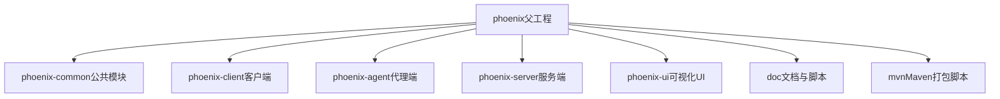
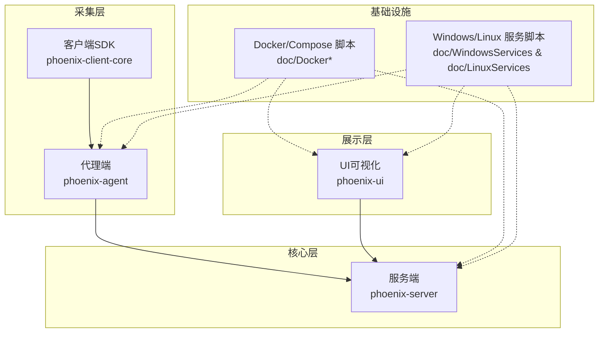
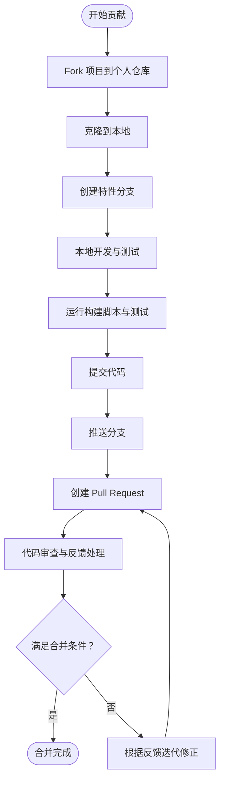
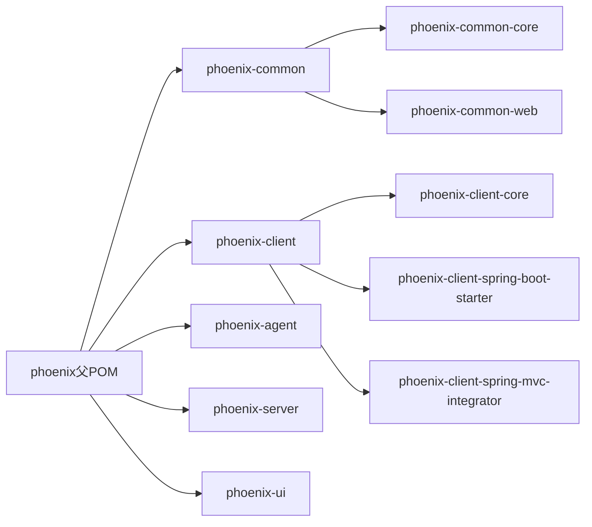

# 贡献指南与协作

<cite>
**本文引用的文件**
- [pom.xml](file://pom.xml)
- [README.md](file://README.md)
- [license.txt](file://license.txt)
- [phoenix-common-core 模块常量类](file://phoenix-common/phoenix-common-core/src/main/java/com/gitee/pifeng/monitoring/common/constant/MonitorTypeEnums.java)
- [phoenix-common-core 模块应用服务器类型枚举](file://phoenix-common/phoenix-common-core/src/main/java/com/gitee/pifeng/monitoring/common/constant/AppServerTypeEnums.java)
- [phoenix-common-core 测试样例集合](file://phoenix-common/phoenix-common-core/src/test/java/com/gitee/pifeng/monitoring/common/util/Md5UtilsTest.java)
- [phoenix-client-core 单元测试样例](file://phoenix-client/phoenix-client-core/src/test/java/com/gitee/pifeng/monitoring/plug/core/LicenseCheckerTest.java)
- [phoenix-client-core 监控测试样例](file://phoenix-client/phoenix-client-core/src/test/java/com/gitee/pifeng/monitoring/plug/MonitorTest.java)
- [Maven 包装器下载器](file://.mvn/wrapper/MavenWrapperDownloader.java)
- [Maven 包装器属性](file://.mvn/wrapper/maven-wrapper.properties)
- [Docker 安装脚本（多版本）](file://doc/Docker/install.1.2.6.RELEASE-CR5.sh)
- [Docker Compose 安装脚本（多版本）](file://doc/DockerCompose/install.1.2.6.RELEASE-CR5.sh)
- [Linux 服务脚本（打包与构建）](file://doc/LinuxServices/build_phoenix.sh)
- [Windows 服务 XML 配置（示例）](file://doc/WindowsServices/phoenix-server/phoenixServer.xml)
- [Windows 服务 XML 配置（示例）](file://doc/WindowsServices/phoenix-ui/phoenixUI.xml)
- [Windows 服务 XML 配置（示例）](file://doc/WindowsServices/phoenix-agent/phoenixAgent.xml)
- [Maven 打包脚本（Linux）](file://mvn/mvn_package.sh)
- [Maven 打包脚本（Windows）](file://mvn/mvnw_package.cmd)
- [Maven 打包脚本（Docker 构建）](file://mvn/mvnw_docker_build.sh)
- [Maven 打包脚本（Docker 构建，Windows）](file://mvn/mvnw_docker_build.cmd)
- [Maven 打包脚本（mvnd）](file://mvn/mvnd_package.sh)
</cite>

## 目录
1. [引言](#引言)
2. [项目结构](#项目结构)
3. [核心组件](#核心组件)
4. [架构总览](#架构总览)
5. [详细组件分析](#详细组件分析)
6. [依赖分析](#依赖分析)
7. [性能考虑](#性能考虑)
8. [故障排查指南](#故障排查指南)
9. [结论](#结论)
10. [附录](#附录)

## 引言
本指南面向希望参与 Phoenix 监控系统贡献的开发者，提供从 Fork 项目、创建分支、提交代码、创建 Pull Request 到代码审查、文档更新、问题报告与功能请求、社区交流、许可证与版权、版本发布以及项目治理的完整协作规范。Phoenix 是一个基于 Spring Boot、Netty 的开源监控平台，覆盖应用、服务器、网络、Docker、数据库、HTTP/TCP 服务与告警能力，并提供可视化 UI 与客户端 SDK。

## 项目结构
Phoenix 采用多模块 Maven 父工程组织，包含公共模块、客户端、代理端、服务端与 UI 等模块。顶层 POM 统一管理版本、依赖与插件；各子模块按功能拆分，便于独立开发与测试。

**图表来源**
- [pom.xml:1-25](file://pom.xml#L1-L25)

**章节来源**
- [pom.xml:8-23](file://pom.xml#L8-L23)
- [README.md:84-111](file://README.md#L84-L111)

## 核心组件
- 公共常量与领域模型：提供监控类型、应用服务器类型等枚举与通用常量，确保跨模块一致性。
- 客户端 SDK：提供与 Spring Boot/Spring MVC 集成的 Starter 与 Integrator，便于快速接入监控。
- 代理端：负责采集服务器、Docker 等信息，并汇聚转发客户端上报数据。
- 服务端：核心分析与告警模块，负责汇聚、分析与告警推送。
- UI：提供可视化配置、用户管理、监控查看与图表展示。
- 文档与脚本：包含 Docker、Docker Compose、Windows/Linux 服务脚本，便于部署与运维。

**章节来源**
- [phoenix-common-core 模块常量类:1-49](file://phoenix-common/phoenix-common-core/src/main/java/com/gitee/pifeng/monitoring/common/constant/MonitorTypeEnums.java#L1-L49)
- [phoenix-common-core 模块应用服务器类型枚举:15-56](file://phoenix-common/phoenix-common-core/src/main/java/com/gitee/pifeng/monitoring/common/constant/AppServerTypeEnums.java#L15-L56)
- [README.md:84-111](file://README.md#L84-L111)

## 架构总览
Phoenix 采用分布式架构，客户端/代理端负责采集与上报，服务端负责汇聚与分析，UI 提供可视化与配置入口。系统支持 Docker 一键安装与多种部署方式。

**图表来源**
- [README.md:169-218](file://README.md#L169-L218)
- [Docker 安装脚本（多版本）:1-1](file://doc/Docker/install.1.2.6.RELEASE-CR5.sh#L1-L1)
- [Docker Compose 安装脚本（多版本）:1-1](file://doc/DockerCompose/install.1.2.6.RELEASE-CR5.sh#L1-L1)
- [Windows 服务 XML 配置（示例）:1-24](file://doc/WindowsServices/phoenix-server/phoenixServer.xml#L1-L24)

## 详细组件分析

### 贡献流程（Fork → 分支 → 提交 → PR）
- Fork 项目至个人仓库，克隆到本地后创建特性分支，建议命名风格为 feat/xxx 或 fix/xxx。
- 在本地开发与测试，遵循模块化与最小变更原则，确保通过单元测试与构建检查。
- 提交前运行构建脚本与测试脚本，保证通过 CI 基线（见附录）。
- 推送分支并创建 Pull Request，选择目标分支（如主干），填写 PR 模板中的必要信息（标题、摘要、变更说明、影响范围、测试验证等）。

[本图为概念性流程示意，无需图表来源]

### 代码审查流程
- PR 创建要求：清晰标题、简要摘要、变更动机、影响范围、兼容性说明、测试验证与风险评估。
- 审查标准：代码风格一致、逻辑清晰、边界处理完备、性能与安全无明显问题、测试覆盖合理。
- 反馈处理：逐条响应审查意见，必要时补充测试或重构；保持沟通礼貌与高效。
- 合并条件：至少一位维护者批准、所有审查意见已处理、构建与测试通过、无阻塞性问题。

[本节为通用流程说明，无需章节来源]

### 文档更新要求
- 文档格式：Markdown，标题层级清晰，段落简洁，必要处配图与来源标注。
- 内容质量：准确、完整、可操作，避免过时信息；新增功能需同步更新使用说明与 API 文档。
- 版本管理：随版本发布更新升级日志与使用说明链接；对重要变更提供迁移指引。

[本节为通用规范说明，无需章节来源]

### 问题报告与功能请求
- Issue 模板：优先使用项目提供的 Issue 模板（Bug 报告、功能请求），按模板字段如实填写。
- 问题描述：包含复现步骤、预期结果、实际结果、环境信息（OS、JDK、依赖版本）、日志片段与截图。
- 功能需求：描述背景、目标、验收标准、影响面与替代方案，必要时附设计草图或原型链接。

[本节为通用规范说明，无需章节来源]

### 社区交流方式
- 讨论与咨询：通过 README 中提供的 QQ 群、微信公众号、个人博客等渠道进行技术交流与问题咨询。
- 平台与渠道：GitHub/Gitee 仓库 Issues/PR、QQ 群、微信公众号文章评论区等。

**章节来源**
- [README.md:340-343](file://README.md#L340-L343)

### 许可证与版权
- 许可证：项目采用 GPLv3 许可证，分发与使用需遵循 GPL v3 条款。
- 版权声明：请在项目中保留原始版权声明与许可证文本；不得移除或篡改版权标识。
- 贡献者协议：贡献即表示接受 GPLv3 条款，遵守项目贡献流程与规范。

**章节来源**
- [pom.xml:757-764](file://pom.xml#L757-L764)
- [README.md:6-6](file://README.md#L6-L6)

### 版本发布流程
- 版本号管理：遵循语义化版本（MAJOR.MINOR.PATCH），在 POM 中统一维护版本号。
- 发布前检查：确保所有测试通过、文档更新、变更日志完善、许可证与版权信息齐全。
- 发布说明：撰写发布说明，列出新增功能、修复问题、已知限制与升级注意事项。
- 发布执行：在 CI/CD 环境中执行打包、签名与发布至中央仓库（如适用）。

**章节来源**
- [pom.xml:10-10](file://pom.xml#L10-L10)
- [pom.xml:744-755](file://pom.xml#L744-L755)

### 项目治理结构
- 维护者职责：负责代码审查、发布决策、问题跟踪与社区协调，保障项目健康演进。
- 决策流程：重大变更通过 Issues 讨论与 PR 审查，维护者最终拍板；日常维护由维护者直接处理。
- 社区规则：尊重、包容、专业、高效；遵守 GPLv3 与项目贡献规范。

[本节为通用治理说明，无需章节来源]

## 依赖分析
Phoenix 采用 Maven 多模块结构，统一管理依赖与插件，确保各模块间版本一致与构建一致性。

**图表来源**
- [pom.xml:11-22](file://pom.xml#L11-L22)

**章节来源**
- [pom.xml:28-129](file://pom.xml#L28-L129)

## 性能考虑
- 构建性能：使用 Maven Wrapper 与并行构建；在 CI 中缓存依赖与本地仓库，减少重复下载。
- 测试性能：启用单元测试与覆盖率插件，确保关键路径有测试覆盖；避免在测试中引入外部依赖。
- 运行性能：关注客户端与代理端的上报频率与批处理策略，避免过度采集导致资源压力。

[本节为通用指导，无需章节来源]

## 故障排查指南
- 构建失败：检查 Java 版本、Maven 版本与网络环境；使用提供的打包脚本进行本地验证。
- Docker 构建：确认 Docker 版本与镜像标签；参考 doc/Docker 与 doc/DockerCompose 脚本。
- Windows/Linux 服务：核对服务配置文件与启动脚本，确保路径与权限正确。
- 单元测试：参考现有测试样例，确保新增代码具备充分测试覆盖。

**章节来源**
- [Maven 包装器下载器:1-1](file://.mvn/wrapper/MavenWrapperDownloader.java#L1-L1)
- [Maven 包装器属性:1-1](file://.mvn/wrapper/maven-wrapper.properties#L1-L1)
- [Maven 打包脚本（Linux）:1-5](file://mvn/mvn_package.sh#L1-L5)
- [Maven 打包脚本（Windows）:1-7](file://mvn/mvnw_package.cmd#L1-L7)
- [Maven 打包脚本（Docker 构建）:1-5](file://mvn/mvnw_docker_build.sh#L1-L5)
- [Maven 打包脚本（Docker 构建，Windows）:1-7](file://mvn/mvnw_docker_build.cmd#L1-L7)
- [Linux 服务脚本（打包与构建）:181-222](file://doc/LinuxServices/build_phoenix.sh#L181-L222)
- [Windows 服务 XML 配置（示例）:1-24](file://doc/WindowsServices/phoenix-server/phoenixServer.xml#L1-L24)
- [Windows 服务 XML 配置（示例）:1-24](file://doc/WindowsServices/phoenix-ui/phoenixUI.xml#L1-L24)
- [Windows 服务 XML 配置（示例）:1-24](file://doc/WindowsServices/phoenix-agent/phoenixAgent.xml#L1-L24)
- [phoenix-client-core 单元测试样例:1-1](file://phoenix-client/phoenix-client-core/src/test/java/com/gitee/pifeng/monitoring/plug/core/LicenseCheckerTest.java#L1-L1)
- [phoenix-client-core 监控测试样例:1-1](file://phoenix-client/phoenix-client-core/src/test/java/com/gitee/pifeng/monitoring/plug/MonitorTest.java#L1-L1)

## 结论
本指南为 Phoenix 监控系统的贡献者提供了从流程到规范的完整参考。请在贡献过程中始终遵循 GPLv3 许可证要求、保持高质量的文档与测试、积极参与社区交流与审查流程，共同推动项目稳健发展。

## 附录
- 快速开始与安装
  - Docker 一键安装与 Docker Compose 安装脚本：参见 doc/Docker 与 doc/DockerCompose 目录。
  - Linux 服务脚本：参见 doc/LinuxServices。
  - Windows 服务配置示例：参见 doc/WindowsServices。
- 构建与打包
  - Maven 包装器：.mvn/wrapper。
  - 打包脚本：mvn/ 目录下的 mvn_package.*、mvnw_package.*、mvnw_docker_build.*、mvnd_package.*。
- 测试参考
  - phoenix-common-core 测试样例集合：md5 工具、JVM/服务器工具等测试类。
  - phoenix-client-core 测试样例：License 校验与监控测试。
- 常用链接
  - README 中的使用说明、升级日志、演示地址与联系方式。

**章节来源**
- [README.md:169-218](file://README.md#L169-L218)
- [README.md:317-326](file://README.md#L317-L326)
- [README.md:327-339](file://README.md#L327-L339)
- [Maven 包装器下载器:1-1](file://.mvn/wrapper/MavenWrapperDownloader.java#L1-L1)
- [Maven 包装器属性:1-1](file://.mvn/wrapper/maven-wrapper.properties#L1-L1)
- [Docker 安装脚本（多版本）:1-1](file://doc/Docker/install.1.2.6.RELEASE-CR5.sh#L1-L1)
- [Docker Compose 安装脚本（多版本）:1-1](file://doc/DockerCompose/install.1.2.6.RELEASE-CR5.sh#L1-L1)
- [Linux 服务脚本（打包与构建）:181-222](file://doc/LinuxServices/build_phoenix.sh#L181-L222)
- [Windows 服务 XML 配置（示例）:1-24](file://doc/WindowsServices/phoenix-server/phoenixServer.xml#L1-L24)
- [Windows 服务 XML 配置（示例）:1-24](file://doc/WindowsServices/phoenix-ui/phoenixUI.xml#L1-L24)
- [Windows 服务 XML 配置（示例）:1-24](file://doc/WindowsServices/phoenix-agent/phoenixAgent.xml#L1-L24)
- [Maven 打包脚本（Linux）:1-5](file://mvn/mvn_package.sh#L1-L5)
- [Maven 打包脚本（Windows）:1-7](file://mvn/mvnw_package.cmd#L1-L7)
- [Maven 打包脚本（Docker 构建）:1-5](file://mvn/mvnw_docker_build.sh#L1-L5)
- [Maven 打包脚本（Docker 构建，Windows）:1-7](file://mvn/mvnw_docker_build.cmd#L1-L7)
- [phoenix-common-core 测试样例集合:1-1](file://phoenix-common/phoenix-common-core/src/test/java/com/gitee/pifeng/monitoring/common/util/Md5UtilsTest.java#L1-L1)
- [phoenix-client-core 单元测试样例:1-1](file://phoenix-client/phoenix-client-core/src/test/java/com/gitee/pifeng/monitoring/plug/core/LicenseCheckerTest.java#L1-L1)
- [phoenix-client-core 监控测试样例:1-1](file://phoenix-client/phoenix-client-core/src/test/java/com/gitee/pifeng/monitoring/plug/MonitorTest.java#L1-L1)