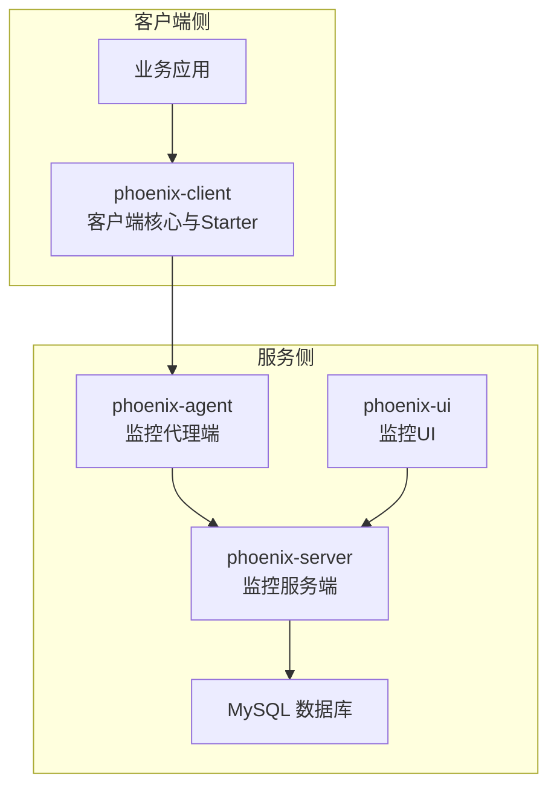
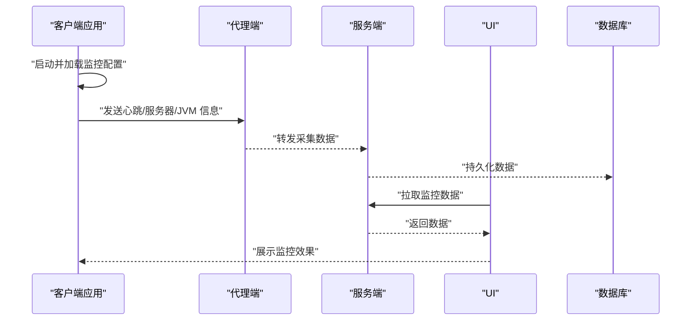
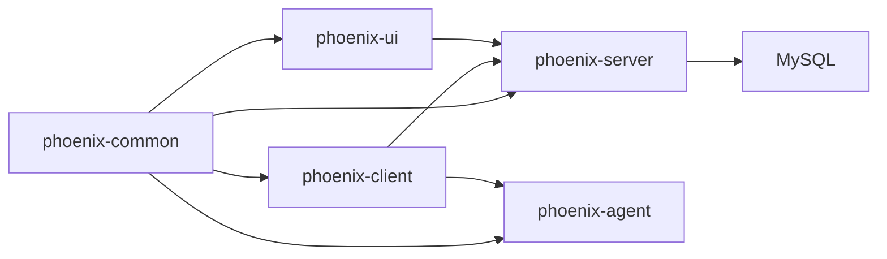

# 快速开始

<cite>
**本文引用的文件**   
- [pom.xml](file://pom.xml)
- [install.sh](file://doc/Docker/install.sh)
- [install.sh](file://doc/DockerCompose/install.sh)
- [monitoring.properties](file://phoenix-client/phoenix-client-core/src/main/resources/monitoring.properties)
- [MonitoringSpringBootProperties.java](file://phoenix-client/phoenix-client-spring-boot-starter/src/main/java/com/gitee/pifeng/monitoring/starter/property/MonitoringSpringBootProperties.java)
- [MonitoringPlugAutoConfiguration.java](file://phoenix-client/phoenix-client-spring-boot-starter/src/main/java/com/gitee/pifeng/monitoring/starter/autoconfigure/MonitoringPlugAutoConfiguration.java)
- [EnableMonitoring.java](file://phoenix-client/phoenix-client-spring-boot-starter/src/main/java/com/gitee/pifeng/monitoring/starter/annotation/EnableMonitoring.java)
- [MonitoringProperties.java](file://phoenix-common/phoenix-common-core/src/main/java/com/gitee/pifeng/monitoring/common/property/client/MonitoringProperties.java)
- [AgentApplication.java](file://phoenix-agent/src/main/java/com/gitee/pifeng/monitoring/agent/AgentApplication.java)
- [ServerApplication.java](file://phoenix-server/src/main/java/com/gitee/pifeng/monitoring/server/ServerApplication.java)
- [UiApplication.java](file://phoenix-ui/src/main/java/com/gitee/pifeng/monitoring/ui/UiApplication.java)
- [application.yml](file://phoenix-server/src/main/resources/application.yml)
- [application.yml](file://phoenix-ui/src/main/resources/application.yml)
- [application.yml](file://phoenix-agent/src/main/resources/application.yml)
- [phoenix.sql](file://doc/数据库设计/sql/mysql/phoenix.sql)
</cite>

## 目录
1. [简介](#简介)
2. [项目结构](#项目结构)
3. [核心组件](#核心组件)
4. [架构总览](#架构总览)
5. [详细组件分析](#详细组件分析)
6. [依赖关系分析](#依赖关系分析)
7. [性能注意事项](#性能注意事项)
8. [故障排除指南](#故障排除指南)
9. [结论](#结论)
10. [附录](#附录)

## 简介
本指南面向首次接触 Phoenix 监控系统的新用户，目标是在约 30 分钟内完成环境准备、安装部署与首个监控实例的创建，帮助您快速看到监控效果。内容覆盖：
- 环境准备：JDK 版本、数据库、网络与容器环境
- 安装部署：Docker 一键部署与 Docker Compose 部署
- 集成监控客户端：在现有 Spring Boot 应用中添加依赖、配置与启动类
- 第一个监控实例：从添加依赖到验证监控效果的完整步骤
- 初始化配置项：服务器地址、心跳间隔、监控级别等关键参数
- 故障排除：常见问题与排查思路

## 项目结构
Phoenix 是一个多模块 Maven 工程，包含服务端、UI、代理端与客户端等模块。核心模块职责：
- phoenix-server：监控服务端，提供 REST API、定时任务与数据库交互
- phoenix-ui：监控 UI，提供可视化界面与管理功能
- phoenix-agent：监控代理端，负责采集与上报
- phoenix-client：监控客户端，包含核心采集与 Spring Boot Starter 集成
- phoenix-common：公共模块，包含通用属性、领域模型与工具

图表来源
- [ServerApplication.java:1-48](file://phoenix-server/src/main/java/com/gitee/pifeng/monitoring/server/ServerApplication.java#L1-L48)
- [UiApplication.java:1-49](file://phoenix-ui/src/main/java/com/gitee/pifeng/monitoring/ui/UiApplication.java#L1-L49)
- [AgentApplication.java:1-40](file://phoenix-agent/src/main/java/com/gitee/pifeng/monitoring/agent/AgentApplication.java#L1-L40)
- [pom.xml:11-22](file://pom.xml#L11-L22)

章节来源
- [pom.xml:11-22](file://pom.xml#L11-L22)

## 核心组件
- 客户端配置与启动
  - 监控属性模型：[MonitoringProperties.java:1-56](file://phoenix-common/phoenix-common-core/src/main/java/com/gitee/pifeng/monitoring/common/property/client/MonitoringProperties.java#L1-L56)
  - Spring Boot 属性绑定：[MonitoringSpringBootProperties.java:1-23](file://phoenix-client/phoenix-client-spring-boot-starter/src/main/java/com/gitee/pifeng/monitoring/starter/property/MonitoringSpringBootProperties.java#L1-L23)
  - 自动装配入口：[MonitoringPlugAutoConfiguration.java:1-100](file://phoenix-client/phoenix-client-spring-boot-starter/src/main/java/com/gitee/pifeng/monitoring/starter/autoconfigure/MonitoringPlugAutoConfiguration.java#L1-L100)
  - 开启监控注解：[EnableMonitoring.java:1-61](file://phoenix-client/phoenix-client-spring-boot-starter/src/main/java/com/gitee/pifeng/monitoring/starter/annotation/EnableMonitoring.java#L1-L61)
- 服务端与 UI
  - 服务端启动类：[ServerApplication.java:1-48](file://phoenix-server/src/main/java/com/gitee/pifeng/monitoring/server/ServerApplication.java#L1-L48)
  - UI 启动类：[UiApplication.java:1-49](file://phoenix-ui/src/main/java/com/gitee/pifeng/monitoring/ui/UiApplication.java#L1-L49)
  - 代理端启动类：[AgentApplication.java:1-40](file://phoenix-agent/src/main/java/com/gitee/pifeng/monitoring/agent/AgentApplication.java#L1-L40)
- 默认客户端配置
  - 客户端默认配置文件：[monitoring.properties:1-41](file://phoenix-client/phoenix-client-core/src/main/resources/monitoring.properties#L1-L41)

章节来源
- [MonitoringProperties.java:1-56](file://phoenix-common/phoenix-common-core/src/main/java/com/gitee/pifeng/monitoring/common/property/client/MonitoringProperties.java#L1-L56)
- [MonitoringSpringBootProperties.java:1-23](file://phoenix-client/phoenix-client-spring-boot-starter/src/main/java/com/gitee/pifeng/monitoring/starter/property/MonitoringSpringBootProperties.java#L1-L23)
- [MonitoringPlugAutoConfiguration.java:1-100](file://phoenix-client/phoenix-client-spring-boot-starter/src/main/java/com/gitee/pifeng/monitoring/starter/autoconfigure/MonitoringPlugAutoConfiguration.java#L1-L100)
- [EnableMonitoring.java:1-61](file://phoenix-client/phoenix-client-spring-boot-starter/src/main/java/com/gitee/pifeng/monitoring/starter/annotation/EnableMonitoring.java#L1-L61)
- [monitoring.properties:1-41](file://phoenix-client/phoenix-client-core/src/main/resources/monitoring.properties#L1-L41)

## 架构总览
Phoenix 采用“客户端采集 → 代理端汇聚 → 服务端存储与处理 → UI 展示”的分层架构。客户端通过 HTTP 将心跳、服务器与 JVM 等指标上报至服务端或代理端。

图表来源
- [monitoring.properties:10-11](file://phoenix-client/phoenix-client-core/src/main/resources/monitoring.properties#L10-L11)
- [ServerApplication.java:1-48](file://phoenix-server/src/main/java/com/gitee/pifeng/monitoring/server/ServerApplication.java#L1-L48)
- [UiApplication.java:1-49](file://phoenix-ui/src/main/java/com/gitee/pifeng/monitoring/ui/UiApplication.java#L1-L49)
- [AgentApplication.java:1-40](file://phoenix-agent/src/main/java/com/gitee/pifeng/monitoring/agent/AgentApplication.java#L1-L40)

## 详细组件分析

### 环境准备
- JDK 版本
  - 项目属性中定义的 Java 版本为 1.8，建议使用 JDK 8 或更高兼容版本进行构建与运行。
- 数据库
  - 使用 MySQL 作为监控数据存储，初始化脚本位于 [phoenix.sql:1-200](file://doc/数据库设计/sql/mysql/phoenix.sql#L1-L200)。
- 网络环境
  - 服务端、UI、代理端均通过 Undertow 提供服务，需开放相应端口并确保网络连通性。
- 容器环境
  - 可使用 Docker 或 Docker Compose 进行一键部署，详见后续章节。

章节来源
- [pom.xml:38-41](file://pom.xml#L38-L41)
- [phoenix.sql:1-200](file://doc/数据库设计/sql/mysql/phoenix.sql#L1-L200)
- [application.yml:1-271](file://phoenix-server/src/main/resources/application.yml#L1-L271)
- [application.yml:1-238](file://phoenix-ui/src/main/resources/application.yml#L1-L238)
- [application.yml:1-111](file://phoenix-agent/src/main/resources/application.yml#L1-L111)

### 安装部署

#### Docker 一键部署
- 执行远程安装脚本，自动拉起 MySQL、服务端与 UI 容器：
  - [install.sh:1-22](file://doc/Docker/install.sh#L1-L22)
- 该脚本会依次下载并执行 MySQL、服务端与 UI 的容器运行脚本。

章节来源
- [install.sh:1-22](file://doc/Docker/install.sh#L1-L22)

#### Docker Compose 部署
- 使用统一的 docker-compose 文件进行编排，包含数据卷挂载、镜像拉取与服务启动：
  - [install.sh:1-99](file://doc/DockerCompose/install.sh#L1-L99)
- 该脚本会：
  - 选择 docker-compose 或 docker compose 命令
  - 下载 compose 文件并校验有效性
  - 创建宿主机数据目录并设置权限
  - 拉取镜像并启动服务

章节来源
- [install.sh:1-99](file://doc/DockerCompose/install.sh#L1-L99)

### 集成监控客户端（Spring Boot）

#### 添加 Maven 依赖
- 在业务应用的 pom.xml 中引入 Phoenix Spring Boot Starter：
  - 组件坐标与版本由顶层 POM 管理，具体见 [pom.xml:173-184](file://pom.xml#L173-L184) 中的 starter 与 integrator 依赖声明。

章节来源
- [pom.xml:173-184](file://pom.xml#L173-L184)

#### 配置文件设置
- 方式一：使用独立 monitoring.properties
  - 在资源目录放置 monitoring.properties，参考默认配置文件：[monitoring.properties:1-41](file://phoenix-client/phoenix-client-core/src/main/resources/monitoring.properties#L1-L41)
- 方式二：使用 application.yml（推荐）
  - 通过前缀 phoenix.monitoring 绑定属性，属性类为 [MonitoringSpringBootProperties.java:1-23](file://phoenix-client/phoenix-client-spring-boot-starter/src/main/java/com/gitee/pifeng/monitoring/starter/property/MonitoringSpringBootProperties.java#L1-L23)
  - 该属性类继承自 [MonitoringProperties.java:1-56](file://phoenix-common/phoenix-common-core/src/main/java/com/gitee/pifeng/monitoring/common/property/client/MonitoringProperties.java#L1-L56)

章节来源
- [monitoring.properties:1-41](file://phoenix-client/phoenix-client-core/src/main/resources/monitoring.properties#L1-L41)
- [MonitoringSpringBootProperties.java:1-23](file://phoenix-client/phoenix-client-spring-boot-starter/src/main/java/com/gitee/pifeng/monitoring/starter/property/MonitoringSpringBootProperties.java#L1-L23)
- [MonitoringProperties.java:1-56](file://phoenix-common/phoenix-common-core/src/main/java/com/gitee/pifeng/monitoring/common/property/client/MonitoringProperties.java#L1-L56)

#### 启动类配置
- 在业务应用的主类上添加注解 @EnableMonitoring，以启用监控客户端：
  - 注解定义：[EnableMonitoring.java:1-61](file://phoenix-client/phoenix-client-spring-boot-starter/src/main/java/com/gitee/pifeng/monitoring/starter/annotation/EnableMonitoring.java#L1-L61)
- 自动装配类负责根据注解参数决定使用独立配置文件还是共用 application.yml：
  - 自动装配逻辑：[MonitoringPlugAutoConfiguration.java:1-100](file://phoenix-client/phoenix-client-spring-boot-starter/src/main/java/com/gitee/pifeng/monitoring/starter/autoconfigure/MonitoringPlugAutoConfiguration.java#L1-L100)

章节来源
- [EnableMonitoring.java:1-61](file://phoenix-client/phoenix-client-spring-boot-starter/src/main/java/com/gitee/pifeng/monitoring/starter/annotation/EnableMonitoring.java#L1-L61)
- [MonitoringPlugAutoConfiguration.java:1-100](file://phoenix-client/phoenix-client-spring-boot-starter/src/main/java/com/gitee/pifeng/monitoring/starter/autoconfigure/MonitoringPlugAutoConfiguration.java#L1-L100)

#### 第一个监控实例的创建步骤
- 步骤 1：添加依赖
  - 引入 Phoenix Spring Boot Starter（见“添加 Maven 依赖”）
- 步骤 2：配置监控属性
  - 在 application.yml 中设置 phoenix.monitoring.comm.http.url 指向服务端地址（默认指向本地 16000 端口）
  - 可选：调整心跳间隔、采集开关等参数
- 步骤 3：启用监控
  - 在业务应用主类上添加 @EnableMonitoring
- 步骤 4：启动应用
  - 启动后客户端会按配置周期上报心跳与指标
- 步骤 5：查看监控效果
  - 登录 UI（默认上下文路径 /phoenix-ui），进入“实例”页面查看新增的监控实例

章节来源
- [monitoring.properties:10-11](file://phoenix-client/phoenix-client-core/src/main/resources/monitoring.properties#L10-L11)
- [application.yml:1-238](file://phoenix-ui/src/main/resources/application.yml#L1-L238)
- [EnableMonitoring.java:1-61](file://phoenix-client/phoenix-client-spring-boot-starter/src/main/java/com/gitee/pifeng/monitoring/starter/annotation/EnableMonitoring.java#L1-L61)

### 初始化配置项说明
以下为常用初始化配置项（来源于默认配置文件与属性类）：
- 通信配置
  - 服务器地址：phoenix.monitoring.comm.http.url（默认指向本地服务端）
  - 连接超时：phoenix.monitoring.comm.http.connect-timeout
  - 读取超时：phoenix.monitoring.comm.http.socket-timeout
  - 获取连接等待超时：phoenix.monitoring.comm.http.connection-request-timeout
- 实例配置
  - 实例次序：phoenix.monitoring.instance.order
  - 实例端点类型：phoenix.monitoring.instance.endpoint
  - 实例名称：phoenix.monitoring.instance.name
  - 实例描述：phoenix.monitoring.instance.desc
  - 程序语言：phoenix.monitoring.instance.language
- 心跳与采集
  - 心跳频率（秒）：phoenix.monitoring.heartbeat.rate（默认 60）
  - 服务器信息采集开关：phoenix.monitoring.server-info.enable（默认 true）
  - 服务器信息采集频率（秒）：phoenix.monitoring.server-info.rate（默认 300）
  - 服务器本机 IP：phoenix.monitoring.server-info.ip
  - 是否使用 Sigar：phoenix.monitoring.server-info.user-sigar-enable
  - JVM 信息采集开关：phoenix.monitoring.jvm-info.enable（默认 false）
  - JVM 信息采集频率（秒）：phoenix.monitoring.jvm-info.rate（默认 300）

章节来源
- [monitoring.properties:10-41](file://phoenix-client/phoenix-client-core/src/main/resources/monitoring.properties#L10-L41)
- [MonitoringSpringBootProperties.java:1-23](file://phoenix-client/phoenix-client-spring-boot-starter/src/main/java/com/gitee/pifeng/monitoring/starter/property/MonitoringSpringBootProperties.java#L1-L23)
- [MonitoringProperties.java:1-56](file://phoenix-common/phoenix-common-core/src/main/java/com/gitee/pifeng/monitoring/common/property/client/MonitoringProperties.java#L1-L56)

## 依赖关系分析
Phoenix 的模块间依赖清晰，客户端与公共模块为其他模块提供能力支撑。

图表来源
- [pom.xml:143-202](file://pom.xml#L143-L202)

章节来源
- [pom.xml:143-202](file://pom.xml#L143-L202)

## 性能注意事项
- 心跳与采集频率
  - 心跳与服务器/JVM 采集频率不宜过低（最小 30 秒），过高会增加网络与服务端压力
- 连接池与超时
  - 合理设置连接超时与 socket 超时，避免长链路阻塞
- 采集范围
  - JVM 信息采集默认关闭，如需开启请评估对业务的影响
- 数据库性能
  - 使用 Druid 连接池与 Quartz JDBC 存储，建议在高并发场景下优化数据库参数

## 故障排除指南
- 无法连接服务端
  - 检查服务端地址配置与网络连通性
  - 参考通信配置项：[monitoring.properties:10-17](file://phoenix-client/phoenix-client-core/src/main/resources/monitoring.properties#L10-L17)
- 心跳未上报
  - 确认心跳频率与服务端端口开放情况
  - 查看服务端日志定位异常
- UI 无法登录或接口异常
  - 检查 UI 启动类与上下文路径
  - 参考 UI 配置：[application.yml:1-238](file://phoenix-ui/src/main/resources/application.yml#L1-L238)
- 数据库初始化失败
  - 使用提供的初始化 SQL 进行建库建表
  - 参考数据库脚本：[phoenix.sql:1-200](file://doc/数据库设计/sql/mysql/phoenix.sql#L1-L200)
- Docker 部署失败
  - 使用官方安装脚本进行一键部署
  - 参考脚本：[install.sh:1-22](file://doc/Docker/install.sh#L1-L22)、[install.sh:1-99](file://doc/DockerCompose/install.sh#L1-L99)

章节来源
- [monitoring.properties:10-17](file://phoenix-client/phoenix-client-core/src/main/resources/monitoring.properties#L10-L17)
- [application.yml:1-238](file://phoenix-ui/src/main/resources/application.yml#L1-L238)
- [phoenix.sql:1-200](file://doc/数据库设计/sql/mysql/phoenix.sql#L1-L200)
- [install.sh:1-22](file://doc/Docker/install.sh#L1-L22)
- [install.sh:1-99](file://doc/DockerCompose/install.sh#L1-L99)

## 结论
通过本指南，您可以在 30 分钟内完成环境准备、安装部署与首个监控实例的创建。建议先使用 Docker 一键部署验证整体链路，再在业务应用中集成客户端并逐步调优配置项，最终实现稳定高效的监控体系。

## 附录

### 服务端与 UI 默认端口与上下文
- 服务端
  - 上下文路径：/phoenix-server
  - 日志目录：liblog4phoenix/logs/phoenix-server/undertow
- UI
  - 上下文路径：/phoenix-ui
  - 日志目录：liblog4phoenix/logs/phoenix-ui/undertow

章节来源
- [application.yml:1-271](file://phoenix-server/src/main/resources/application.yml#L1-L271)
- [application.yml:1-238](file://phoenix-ui/src/main/resources/application.yml#L1-L238)