# UI组件扩展开发

<cite>
**本文档引用的文件**
- [echarts.min.js](file://phoenix-ui/src/main/resources/static/js/echarts.min.js)
- [echarts.theme.infographic.js](file://phoenix-ui/src/main/resources/static/js/echarts.theme.infographic.js)
- [index.js](file://phoenix-ui/src/main/resources/static/lib/index.js)
- [view.js](file://phoenix-ui/src/main/resources/static/lib/view.js)
- [home.js](file://phoenix-ui/src/main/resources/static/modules/home.js)
- [myself.css](file://phoenix-ui/src/main/resources/static/style/myself.css)
- [HomeController.java](file://phoenix-ui/src/main/java/com/gitee/pifeng/monitoring/ui/business/web/controller/HomeController.java)
- [home.html](file://phoenix-ui/src/main/resources/templates/home.html)
- [config.js](file://phoenix-ui/src/main/resources/static/config.js)
- [admin.js](file://phoenix-ui/src/main/resources/static/lib/admin.js)
</cite>

## 目录
1. [简介](#简介)
2. [项目结构](#项目结构)
3. [核心组件](#核心组件)
4. [架构概览](#架构概览)
5. [详细组件分析](#详细组件分析)
6. [依赖关系分析](#依赖关系分析)
7. [性能考虑](#性能考虑)
8. [故障排除指南](#故障排除指南)
9. [结论](#结论)
10. [附录](#附录)

## 简介

Phoenix监控系统的UI组件扩展开发旨在为监控平台提供现代化的前端解决方案。该系统基于传统的jQuery+Layui架构，集成了ECharts图表库，实现了响应式布局和丰富的交互体验。

本技术文档详细介绍了如何在现有架构基础上开发新的监控视图组件，包括Vue.js组件创建、ECharts图表库集成、数据绑定、事件响应等前端开发技术。同时涵盖了第三方图表库集成方案、响应式设计实现、交互体验优化以及UI组件的可维护性设计。

## 项目结构

Phoenix UI采用经典的三层架构设计：

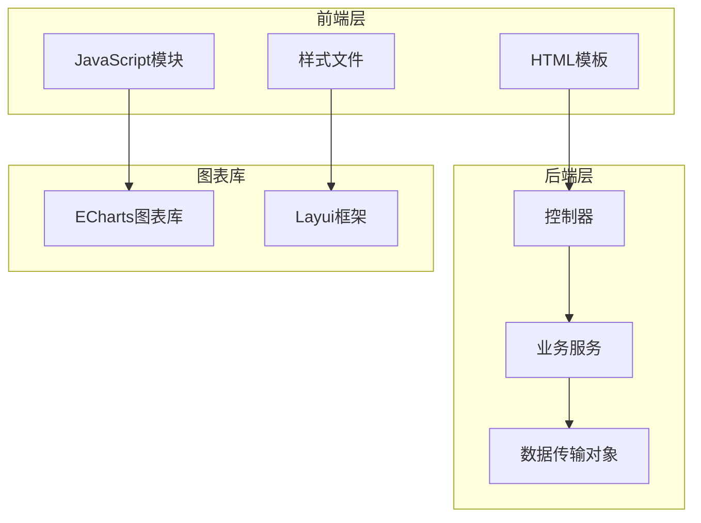

**图表来源**
- [home.html:1-360](file://phoenix-ui/src/main/resources/templates/home.html#L1-L360)
- [HomeController.java:1-208](file://phoenix-ui/src/main/java/com/gitee/pifeng/monitoring/ui/business/web/controller/HomeController.java#L1-L208)

**章节来源**
- [home.html:1-360](file://phoenix-ui/src/main/resources/templates/home.html#L1-L360)
- [HomeController.java:1-208](file://phoenix-ui/src/main/java/com/gitee/pifeng/monitoring/ui/business/web/controller/HomeController.java#L1-L208)

## 核心组件

### 图表组件架构

系统的核心是基于ECharts的可视化组件，主要包含以下组件：

1. **折线图组件** - 用于展示最近7天告警统计数据
2. **饼图组件** - 用于展示告警结果统计信息  
3. **进度条组件** - 用于展示各类监控指标的完成情况

### 数据流架构

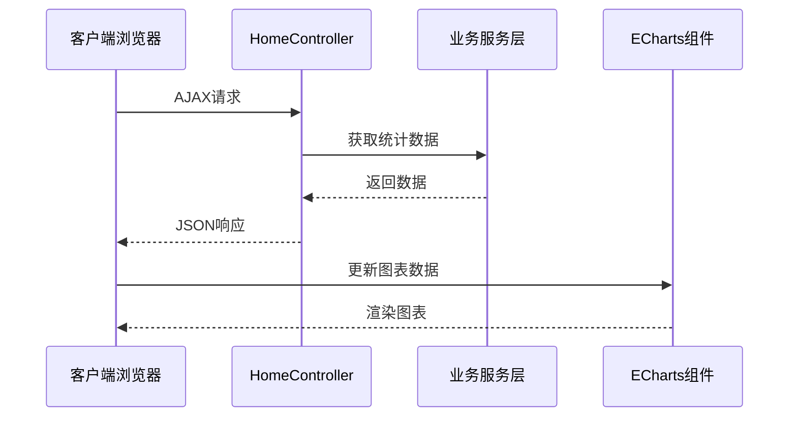

**图表来源**
- [home.js:40-196](file://phoenix-ui/src/main/resources/static/modules/home.js#L40-L196)
- [HomeController.java:151-156](file://phoenix-ui/src/main/java/com/gitee/pifeng/monitoring/ui/business/web/controller/HomeController.java#L151-L156)

**章节来源**
- [home.js:1-567](file://phoenix-ui/src/main/resources/static/modules/home.js#L1-L567)
- [HomeController.java:1-208](file://phoenix-ui/src/main/java/com/gitee/pifeng/monitoring/ui/business/web/controller/HomeController.java#L1-L208)

## 架构概览

### 前端架构设计

系统采用模块化的前端架构，主要包含以下层次：

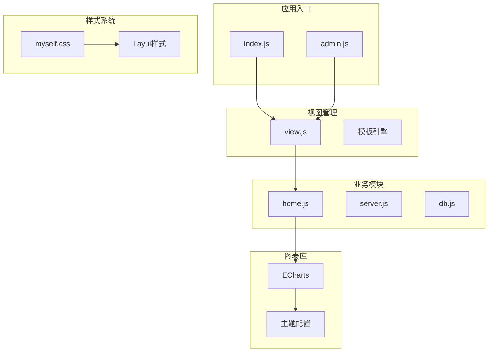

**图表来源**
- [index.js:1-21](file://phoenix-ui/src/main/resources/static/lib/index.js#L1-L21)
- [view.js:1-142](file://phoenix-ui/src/main/resources/static/lib/view.js#L1-L142)
- [config.js:1-132](file://phoenix-ui/src/main/resources/static/config.js#L1-L132)

### 后端架构设计

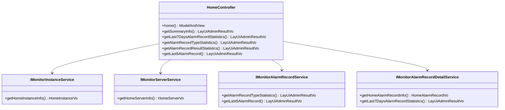

**图表来源**
- [HomeController.java:30-208](file://phoenix-ui/src/main/java/com/gitee/pifeng/monitoring/ui/business/web/controller/HomeController.java#L30-L208)

**章节来源**
- [HomeController.java:1-208](file://phoenix-ui/src/main/java/com/gitee/pifeng/monitoring/ui/business/web/controller/HomeController.java#L1-L208)

## 详细组件分析

### 折线图组件分析

折线图组件负责展示最近7天的告警统计数据，具有以下特点：

#### 数据结构设计

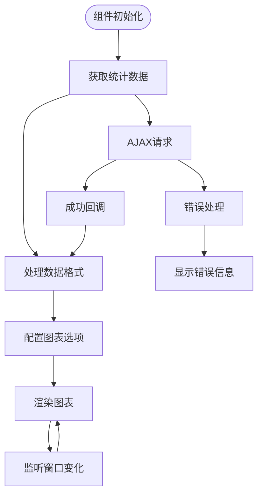

**图表来源**
- [home.js:40-196](file://phoenix-ui/src/main/resources/static/modules/home.js#L40-L196)

#### 图表配置详解

组件使用了多种ECharts特性来实现丰富的视觉效果：

1. **渐变填充** - 使用线性渐变实现平滑的区域填充
2. **平滑曲线** - 通过smooth参数实现流畅的线条过渡
3. **响应式布局** - 自动适配容器尺寸变化
4. **交互式工具** - 支持鼠标悬停显示详细信息

**章节来源**
- [home.js:68-190](file://phoenix-ui/src/main/resources/static/modules/home.js#L68-L190)

### 饼图组件分析

饼图组件用于展示告警结果的统计分布：

#### 数据映射机制

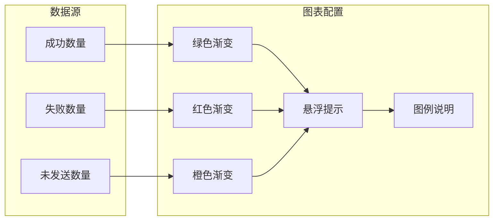

**图表来源**
- [home.js:257-320](file://phoenix-ui/src/main/resources/static/modules/home.js#L257-L320)

**章节来源**
- [home.js:235-326](file://phoenix-ui/src/main/resources/static/modules/home.js#L235-L326)

### 进度条组件分析

进度条组件用于展示各类监控指标的完成情况：

#### 动态更新机制

组件采用定时器实现数据的周期性更新：

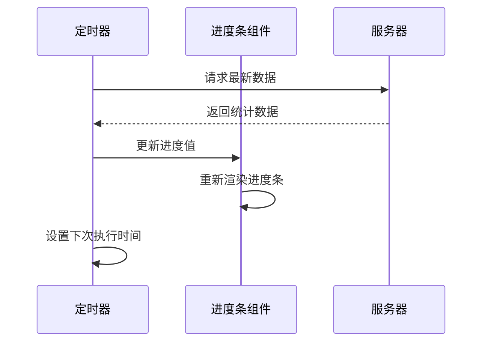

**图表来源**
- [home.js:552-564](file://phoenix-ui/src/main/resources/static/modules/home.js#L552-L564)

**章节来源**
- [home.js:198-233](file://phoenix-ui/src/main/resources/static/modules/home.js#L198-L233)

### 响应式布局设计

系统采用了多层次的响应式设计策略：

#### CSS媒体查询应用

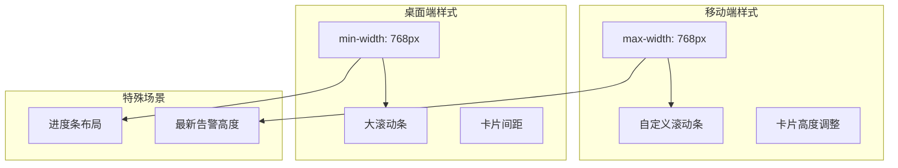

**图表来源**
- [myself.css:11-29](file://phoenix-ui/src/main/resources/static/style/myself.css#L11-L29)
- [myself.css:216-222](file://phoenix-ui/src/main/resources/static/style/myself.css#L216-L222)

**章节来源**
- [myself.css:1-223](file://phoenix-ui/src/main/resources/static/style/myself.css#L1-L223)

## 依赖关系分析

### 前端依赖关系

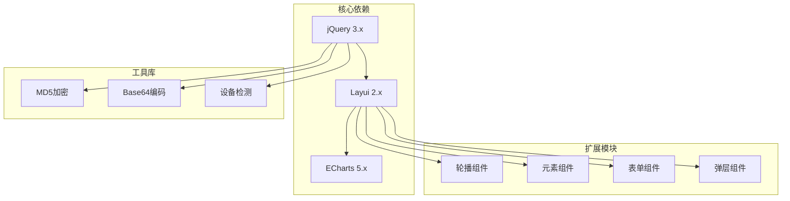

**图表来源**
- [config.js:42-47](file://phoenix-ui/src/main/resources/static/config.js#L42-L47)
- [home.html:343-358](file://phoenix-ui/src/main/resources/templates/home.html#L343-L358)

### 后端依赖关系

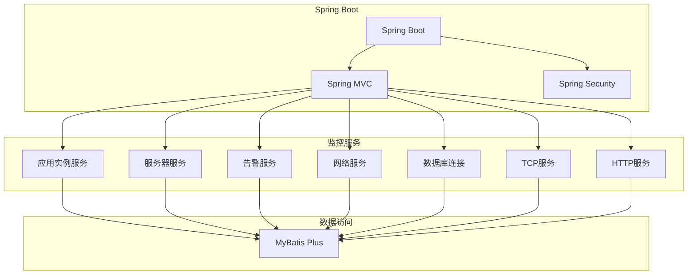

**图表来源**
- [HomeController.java:30-79](file://phoenix-ui/src/main/java/com/gitee/pifeng/monitoring/ui/business/web/controller/HomeController.java#L30-L79)

**章节来源**
- [config.js:1-132](file://phoenix-ui/src/main/resources/static/config.js#L1-L132)
- [HomeController.java:1-208](file://phoenix-ui/src/main/java/com/gitee/pifeng/monitoring/ui/business/web/controller/HomeController.java#L1-L208)

## 性能考虑

### 图表渲染优化

系统在图表渲染方面采用了多项优化策略：

1. **懒加载机制** - 图表组件仅在需要时初始化
2. **内存管理** - 及时清理不再使用的图表实例
3. **批量更新** - 合并多个数据更新操作
4. **防抖处理** - 避免频繁的窗口大小调整触发

### 数据加载优化

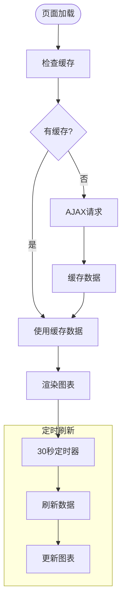

**图表来源**
- [home.js:552-564](file://phoenix-ui/src/main/resources/static/modules/home.js#L552-L564)

### 内存管理策略

系统实现了完善的内存管理机制：

1. **组件生命周期管理** - 确保组件正确销毁
2. **事件监听器清理** - 避免内存泄漏
3. **定时器管理** - 统一管理定时任务
4. **DOM元素回收** - 及时释放DOM引用

**章节来源**
- [home.js:30-38](file://phoenix-ui/src/main/resources/static/modules/home.js#L30-L38)

## 故障排除指南

### 常见问题诊断

#### 图表不显示问题

1. **检查ECharts库加载**
   - 确认echarts.min.js文件正确加载
   - 验证图表容器的尺寸设置

2. **验证数据格式**
   - 检查AJAX返回的数据格式
   - 确认数据转换逻辑正确

#### 响应式问题

1. **移动端适配**
   - 检查媒体查询规则
   - 验证触摸事件处理

2. **桌面端布局**
   - 确认CSS类名正确应用
   - 检查容器尺寸计算

### 错误处理机制

系统实现了多层次的错误处理：

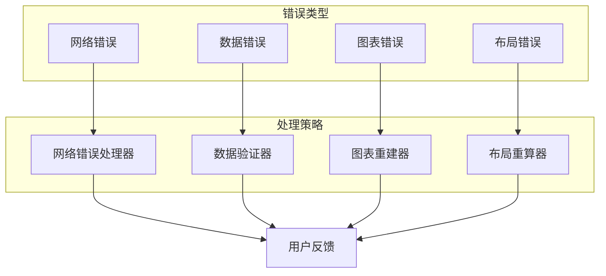

**图表来源**
- [view.js:26-47](file://phoenix-ui/src/main/resources/static/lib/view.js#L26-L47)

**章节来源**
- [view.js:1-142](file://phoenix-ui/src/main/resources/static/lib/view.js#L1-L142)

## 结论

Phoenix监控系统的UI组件扩展开发展现了传统与现代技术的有机结合。系统在保持稳定性的基础上，通过模块化设计和组件化架构，为后续的功能扩展奠定了坚实基础。

### 技术优势

1. **架构清晰** - 分层设计明确，职责分离合理
2. **扩展性强** - 模块化架构便于功能扩展
3. **性能优化** - 多层次的性能优化策略
4. **用户体验** - 丰富的交互效果和响应式设计

### 改进建议

1. **现代化迁移** - 考虑逐步迁移到Vue.js或React框架
2. **组件标准化** - 建立统一的组件开发规范
3. **测试覆盖** - 增加单元测试和集成测试
4. **文档完善** - 补充详细的API文档和开发指南

## 附录

### 开发环境配置

#### 前端开发环境

```javascript
// 开发配置示例
const developmentConfig = {
    debug: true,
    apiUrl: 'http://localhost:8080',
    chartTheme: 'infographic',
    autoRefresh: 30000
};
```

#### 后端开发环境

```java
// 开发配置示例
@Configuration
@Profile("dev")
public class DevelopmentConfig {
    @Value("${spring.datasource.url:jdbc:h2:mem:testdb}")
    private String dataSourceUrl;
    
    @Bean
    public DataSource dataSource() {
        return new HikariDataSource();
    }
}
```

### API接口规范

#### 图表数据接口

| 接口 | 方法 | 描述 | 参数 |
|------|------|------|------|
| `/home/get-summary-info` | POST | 获取主页摘要信息 | 无 |
| `/home/get-last-7-days-alarm-record-statistics` | POST | 获取最近7天告警统计 | 无 |
| `/home/get-alarm-record-type-statistics` | POST | 获取告警类型统计 | 无 |
| `/home/get-alarm-record-result-statistics` | POST | 获取告警结果统计 | 无 |
| `/home/get-last-5-alarm-record` | POST | 获取最新5条告警记录 | 无 |

**章节来源**
- [HomeController.java:120-205](file://phoenix-ui/src/main/java/com/gitee/pifeng/monitoring/ui/business/web/controller/HomeController.java#L120-L205)