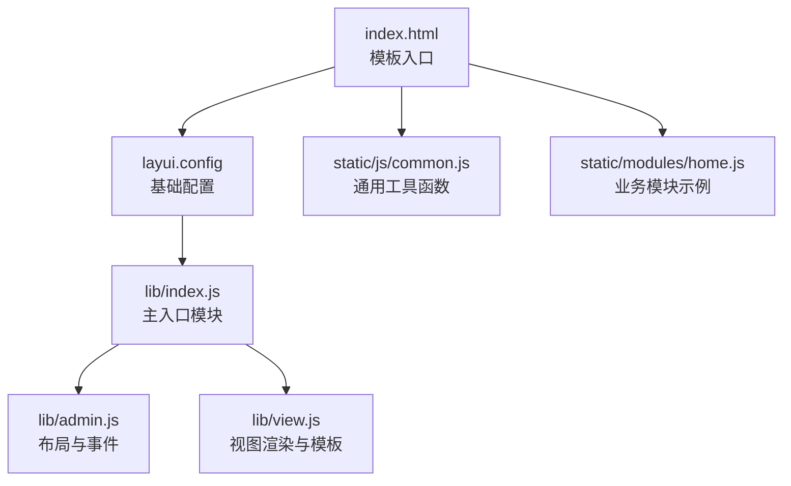
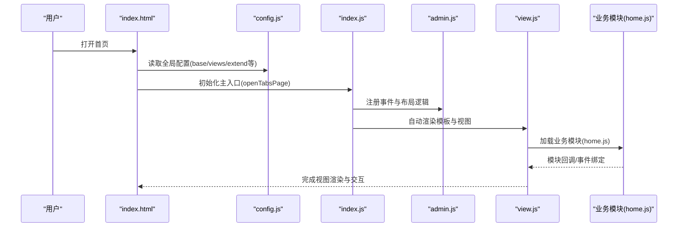
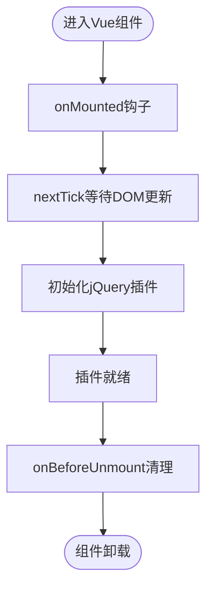
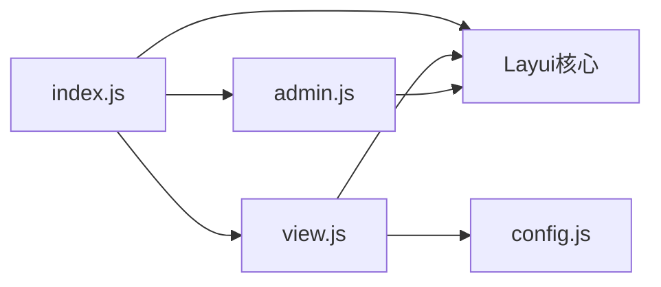

# Vue.js框架集成

<cite>
**本文引用的文件**
- [index.html](file://phoenix-ui/src/main/resources/templates/index.html)
- [common.js](file://phoenix-ui/src/main/resources/static/js/common.js)
- [config.js](file://phoenix-ui/src/main/resources/static/config.js)
- [index.js](file://phoenix-ui/src/main/resources/static/lib/index.js)
- [admin.js](file://phoenix-ui/src/main/resources/static/lib/admin.js)
- [view.js](file://phoenix-ui/src/main/resources/static/lib/view.js)
- [home.js](file://phoenix-ui/src/main/resources/static/modules/home.js)
</cite>

## 目录
1. [简介](#简介)
2. [项目结构](#项目结构)
3. [核心组件](#核心组件)
4. [架构总览](#架构总览)
5. [详细组件分析](#详细组件分析)
6. [依赖分析](#依赖分析)
7. [性能考虑](#性能考虑)
8. [故障排查指南](#故障排查指南)
9. [结论](#结论)
10. [附录](#附录)

## 简介
本技术文档面向Phoenix监控系统的前端现代化升级，聚焦于在现有jQuery+Layui架构基础上集成Vue.js框架。文档涵盖以下关键目标：
- Vue.js的引入方式、版本选择与CDN配置策略
- Vue组件的创建与注册（单文件组件.vue规范、生命周期管理、数据绑定）
- 与现有jQuery代码的兼容性处理（在Vue中使用jQuery插件、DOM操作与冲突规避）
- 具体集成示例与迁移路径（页面重构、状态管理、事件处理的最佳实践）

## 项目结构
Phoenix UI采用Thymeleaf模板引擎渲染HTML，前端资源位于静态目录，核心入口为index.html，配合Layui Admin体系完成页面布局、导航、标签页与模块加载。Vue.js集成可按“渐进式替换”策略进行，既保留现有Layui模块，又逐步引入Vue组件。

图表来源
- [index.html:1-318](file://phoenix-ui/src/main/resources/templates/index.html#L1-L318)
- [config.js:1-132](file://phoenix-ui/src/main/resources/static/config.js#L1-L132)
- [index.js:1-21](file://phoenix-ui/src/main/resources/static/lib/index.js#L1-L21)
- [admin.js:1-313](file://phoenix-ui/src/main/resources/static/lib/admin.js#L1-L313)
- [view.js:1-142](file://phoenix-ui/src/main/resources/static/lib/view.js#L1-L142)
- [common.js:1-333](file://phoenix-ui/src/main/resources/static/js/common.js#L1-L333)
- [home.js:1-2](file://phoenix-ui/src/main/resources/static/modules/home.js#L1-L2)

章节来源
- [index.html:1-318](file://phoenix-ui/src/main/resources/templates/index.html#L1-L318)
- [config.js:10-132](file://phoenix-ui/src/main/resources/static/config.js#L10-L132)

## 核心组件
- 模板入口与布局
  - index.html负责整体布局、头部导航、侧边菜单、标签页与主体iframe容器，以及Layui初始化与事件绑定。
- LAYUI Admin体系
  - config.js提供全局配置（视图目录、响应字段、扩展模块等）
  - index.js为主入口模块，负责标签页打开、模块加载与视图渲染桥接
  - admin.js负责布局切换、主题、全屏、标签页控制等交互
  - view.js负责模板渲染、ajax请求封装、错误处理与视图解析
- 通用工具
  - common.js提供合并单元格、空值判断、数组去重、格式化、UUID生成等通用方法

章节来源
- [index.html:35-318](file://phoenix-ui/src/main/resources/templates/index.html#L35-L318)
- [config.js:10-132](file://phoenix-ui/src/main/resources/static/config.js#L10-L132)
- [index.js:2-21](file://phoenix-ui/src/main/resources/static/lib/index.js#L2-L21)
- [admin.js:1-313](file://phoenix-ui/src/main/resources/static/lib/admin.js#L1-L313)
- [view.js:1-142](file://phoenix-ui/src/main/resources/static/lib/view.js#L1-L142)
- [common.js:43-333](file://phoenix-ui/src/main/resources/static/js/common.js#L43-L333)

## 架构总览
下图展示了从模板入口到模块加载、再到视图渲染的整体流程，体现jQuery/Layui与Vue集成的切入点与协作关系。

图表来源
- [index.html:297-316](file://phoenix-ui/src/main/resources/templates/index.html#L297-L316)
- [config.js:10-47](file://phoenix-ui/src/main/resources/static/config.js#L10-L47)
- [index.js:2-21](file://phoenix-ui/src/main/resources/static/lib/index.js#L2-L21)
- [admin.js:236-313](file://phoenix-ui/src/main/resources/static/lib/admin.js#L236-L313)
- [view.js:69-142](file://phoenix-ui/src/main/resources/static/lib/view.js#L69-L142)
- [home.js:1-2](file://phoenix-ui/src/main/resources/static/modules/home.js#L1-L2)

## 详细组件分析

### Vue.js引入与CDN配置
- 版本选择建议
  - 生产环境优先选择稳定长期支持版本（如LTS），确保生态兼容与安全补丁持续性
  - 开发阶段可选用带完整构建工具链的版本，便于热重载与源码映射
- CDN引入策略
  - 在模板入口中按需引入Vue运行时或完整版，结合按需加载策略减少首屏体积
  - 与Layui并存时，确保Vue挂载节点不在Layui已接管的DOM范围内，避免冲突
- 与Layui配置的协同
  - 可在config.js中新增extend项指向Vue相关脚本（如Vue Router/状态管理插件），由index.js统一加载

章节来源
- [index.html:297-316](file://phoenix-ui/src/main/resources/templates/index.html#L297-L316)
- [config.js:41-47](file://phoenix-ui/src/main/resources/static/config.js#L41-L47)

### 单文件组件(.vue)编写规范
- 文件组织
  - 使用独立目录存放.vue组件，按功能域划分（如monitoring、dashboard、common）
  - 组件命名采用PascalCase，导出默认对象并声明props/events/emits
- 模板与样式
  - 模板内尽量使用语义化标签，避免直接操作DOM
  - 样式作用域化，优先使用CSS Modules或scoped样式，避免污染Layui样式
- 脚本与状态
  - 使用Composition API风格，将副作用逻辑拆分为多个组合函数
  - 与后端交互统一通过封装的HTTP服务，避免在组件内直接调用原生fetch

### 生命周期管理与数据绑定
- 生命周期钩子
  - onMounted：执行DOM依赖操作（如初始化第三方图表、绑定事件）
  - onBeforeUnmount：清理定时器、解绑事件、释放资源
- 数据绑定
  - 响应式数据通过ref/reactive声明，避免直接修改DOM属性
  - 与jQuery插件交互时，使用nextTick确保DOM更新后再初始化插件

### 与jQuery代码的兼容性处理
- 在Vue组件中使用jQuery插件
  - 在onMounted中初始化插件，确保DOM可用
  - 使用nextTick等待Vue更新完成，再进行DOM选择与插件初始化
- DOM操作与冲突规避
  - Vue组件的根节点与Layui已接管区域保持隔离，避免同时操作同一DOM
  - 若必须共享DOM，采用事件代理或在组件销毁时解除插件绑定
- 兼容性示例（流程）

图表来源
- [common.js:147-159](file://phoenix-ui/src/main/resources/static/js/common.js#L147-L159)

### 集成示例：从jQuery到Vue组件化迁移
- 页面重构
  - 将Layui的iframe页面拆分为Vue单页应用路由，使用router-view承载组件
  - 保留Layui的布局与菜单，Vue组件仅负责内容区
- 状态管理
  - 使用轻量状态管理（如Pinia）集中管理全局状态，避免跨组件重复请求
  - 与后端API交互统一通过HTTP服务层，Vue组件只关心数据消费
- 事件处理
  - Vue组件内部事件通过组合函数封装，外部事件通过Layui admin.js桥接到Vue实例
  - 与jQuery插件的事件交互通过$emit/$on或自定义事件总线实现

章节来源
- [admin.js:285-294](file://phoenix-ui/src/main/resources/static/lib/admin.js#L285-L294)
- [view.js:111-121](file://phoenix-ui/src/main/resources/static/lib/view.js#L111-L121)

## 依赖分析
- 模块耦合
  - index.js依赖admin.js与view.js，形成“入口-布局-视图”的清晰分层
  - view.js与config.js强关联，视图路径与响应字段均来自全局配置
- 外部依赖
  - Layui作为UI与交互基础，Vue作为组件化与状态管理增强
  - 可选引入Vue Router与状态管理库，按需扩展

图表来源
- [index.js:2-21](file://phoenix-ui/src/main/resources/static/lib/index.js#L2-L21)
- [admin.js:1-313](file://phoenix-ui/src/main/resources/static/lib/admin.js#L1-L313)
- [view.js:1-142](file://phoenix-ui/src/main/resources/static/lib/view.js#L1-L142)
- [config.js:10-47](file://phoenix-ui/src/main/resources/static/config.js#L10-L47)

章节来源
- [index.js:2-21](file://phoenix-ui/src/main/resources/static/lib/index.js#L2-L21)
- [admin.js:1-313](file://phoenix-ui/src/main/resources/static/lib/admin.js#L1-L313)
- [view.js:1-142](file://phoenix-ui/src/main/resources/static/lib/view.js#L1-L142)
- [config.js:10-47](file://phoenix-ui/src/main/resources/static/config.js#L10-L47)

## 性能考虑
- 资源加载
  - 采用CDN与缓存策略，合理拆分Vue运行时与业务代码，按需加载
- 渲染优化
  - 使用keep-alive缓存非活跃组件，减少重复初始化
  - 避免在模板中进行复杂计算，将逻辑前置到组合函数中
- 事件与插件
  - jQuery插件初始化与销毁严格对称，防止内存泄漏
  - 大列表渲染使用虚拟滚动或分页策略

## 故障排查指南
- 请求与错误处理
  - view.js封装了统一的ajax请求与错误弹窗逻辑，当debug为true时才会弹出错误框
  - 登录页检测：若响应内容包含登录标题，将跳转到登录页
- 常见问题
  - DOM未就绪导致插件初始化失败：确保在onMounted与nextTick之后再初始化
  - 标签页切换导致插件状态异常：在onBeforeUnmount中清理插件实例
  - 主题切换样式冲突：确保Vue组件样式作用域化，避免覆盖Layui主题

章节来源
- [view.js:15-49](file://phoenix-ui/src/main/resources/static/lib/view.js#L15-L49)
- [view.js:42-47](file://phoenix-ui/src/main/resources/static/lib/view.js#L42-L47)
- [admin.js:53-59](file://phoenix-ui/src/main/resources/static/lib/admin.js#L53-L59)

## 结论
在Phoenix监控系统中集成Vue.js的关键在于“渐进式替换”。通过保留Layui的布局与交互能力，将业务页面逐步迁移到Vue组件化架构，既能提升开发效率与可维护性，又能平滑过渡到现代化前端工程化体系。建议先从内容区组件开始，逐步引入状态管理与路由，最终实现整体架构的现代化升级。

## 附录
- 关键文件清单
  - 模板入口：index.html
  - 全局配置：config.js
  - 主入口模块：index.js
  - 布局与事件：admin.js
  - 视图渲染：view.js
  - 通用工具：common.js
  - 业务模块示例：home.js