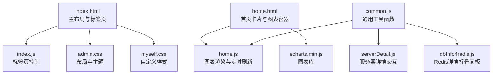
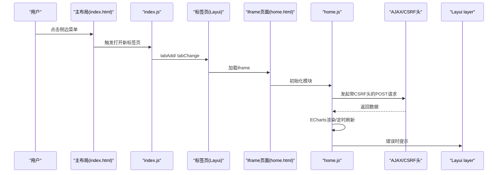
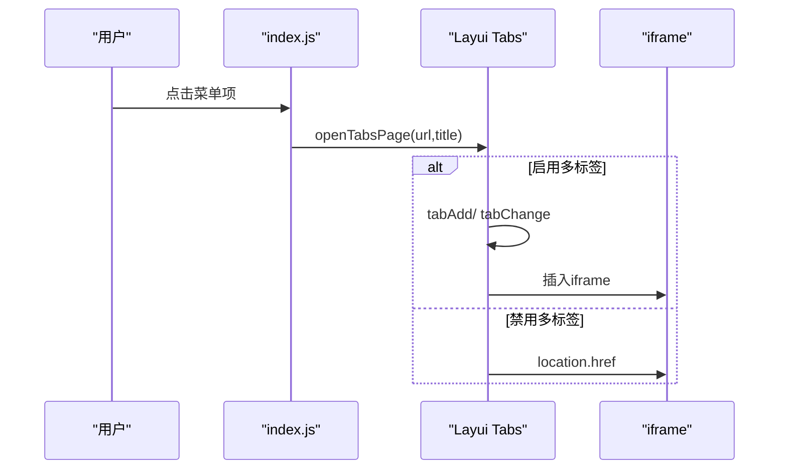
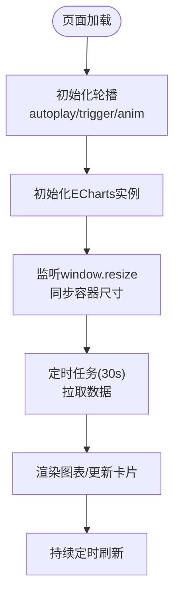
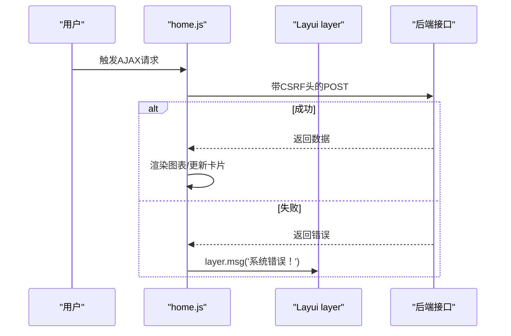
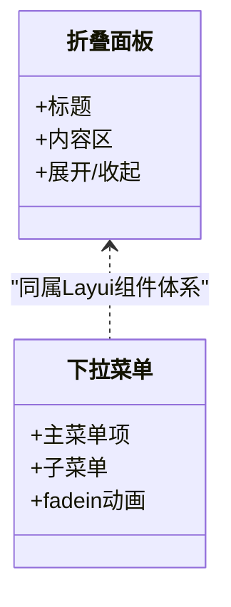
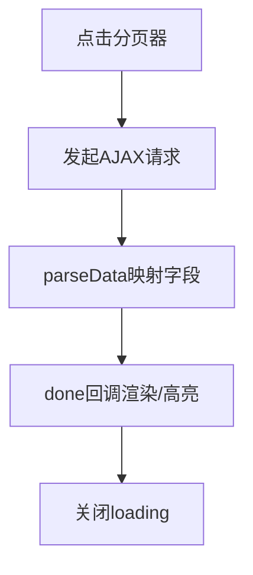
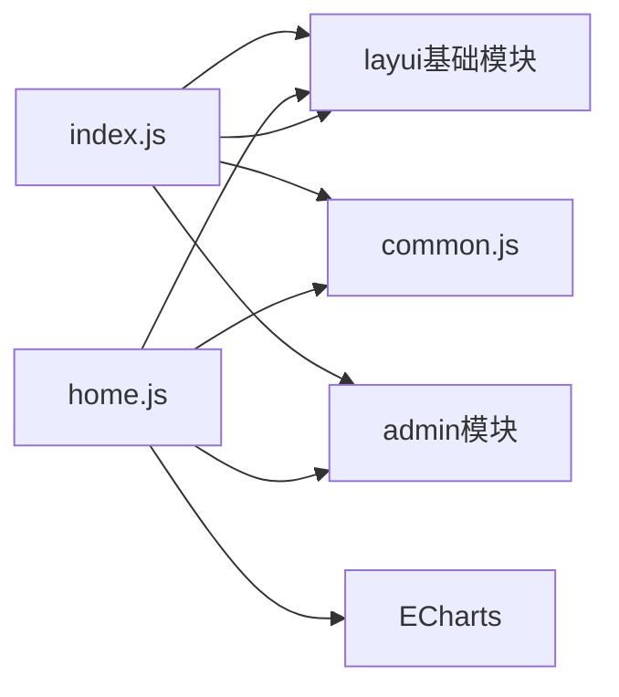

# 交互体验优化

<cite>
**本文引用的文件**
- [index.html](file://phoenix-ui/src/main/resources/templates/index.html)
- [home.html](file://phoenix-ui/src/main/resources/templates/home.html)
- [myself.css](file://phoenix-ui/src/main/resources/static/style/myself.css)
- [admin.css](file://phoenix-ui/src/main/resources/static/style/admin.css)
- [index.js](file://phoenix-ui/src/main/resources/static/lib/index.js)
- [common.js](file://phoenix-ui/src/main/resources/static/js/common.js)
- [home.js](file://phoenix-ui/src/main/resources/static/modules/home.js)
- [layui.css](file://phoenix-ui/src/main/resources/static/layui/css/layui.css)
- [login.html](file://phoenix-ui/src/main/resources/templates/user/login.html)
- [server.html](file://phoenix-ui/src/main/resources/templates/server/server.html)
- [serverDetail.js](file://phoenix-ui/src/main/resources/static/modules/server/serverDetail.js)
- [dbInfo4redis.js](file://phoenix-ui/src/main/resources/static/modules/db/dbInfo4redis.js)
- [alarm-definition.html](file://phoenix-ui/src/main/resources/templates/set/alarm-definition.html)
- [server.html（片段）](file://phoenix-ui/src/main/resources/templates/server/server.html)
- [login.html（片段）](file://phoenix-ui/src/main/resources/templates/user/login.html)
</cite>

## 目录
1. [简介](#简介)
2. [项目结构](#项目结构)
3. [核心组件](#核心组件)
4. [架构总览](#架构总览)
5. [详细组件分析](#详细组件分析)
6. [依赖关系分析](#依赖关系分析)
7. [性能考虑](#性能考虑)
8. [故障排查指南](#故障排查指南)
9. [结论](#结论)
10. [附录](#附录)

## 简介
本文件面向Phoenix监控系统的前端交互体验优化，围绕动画与过渡、用户反馈、无障碍支持、页面性能以及常用交互组件（模态框、下拉菜单、标签页、分页器）展开，结合现有代码实现，提供可落地的优化建议与最佳实践，帮助提升流畅度、可访问性与可维护性。

## 项目结构
Phoenix UI采用Thymeleaf模板 + Layui Admin框架 + 自定义样式与模块化JS的组合：
- 模板层：index.html承载主布局与全局导航、标签页、主体区域；home.html承载首页卡片与图表容器。
- 样式层：admin.css、myself.css提供布局、主题、滚动条与自定义尺寸等样式。
- 脚本层：index.js负责标签页打开与切换；home.js负责首页图表渲染与定时刷新；common.js提供通用工具函数；各业务模块（如serverDetail.js、dbInfo4redis.js）负责具体页面的交互与可视化。

**图表来源**
- [index.html:1-318](file://phoenix-ui/src/main/resources/templates/index.html#L1-L318)
- [index.js:1-21](file://phoenix-ui/src/main/resources/static/lib/index.js#L1-L21)
- [admin.css:1-2](file://phoenix-ui/src/main/resources/static/style/admin.css#L1-L2)
- [myself.css:1-223](file://phoenix-ui/src/main/resources/static/style/myself.css#L1-L223)
- [home.html:1-360](file://phoenix-ui/src/main/resources/templates/home.html#L1-L360)
- [home.js:1-567](file://phoenix-ui/src/main/resources/static/modules/home.js#L1-L567)
- [common.js:1-333](file://phoenix-ui/src/main/resources/static/js/common.js#L1-L333)
- [serverDetail.js:596-2133](file://phoenix-ui/src/main/resources/static/modules/server/serverDetail.js#L596-L2133)
- [dbInfo4redis.js:283-301](file://phoenix-ui/src/main/resources/static/modules/db/dbInfo4redis.js#L283-L301)

**章节来源**
- [index.html:1-318](file://phoenix-ui/src/main/resources/templates/index.html#L1-L318)
- [home.html:1-360](file://phoenix-ui/src/main/resources/templates/home.html#L1-L360)
- [admin.css:1-2](file://phoenix-ui/src/main/resources/static/style/admin.css#L1-L2)
- [myself.css:1-223](file://phoenix-ui/src/main/resources/static/style/myself.css#L1-L223)
- [index.js:1-21](file://phoenix-ui/src/main/resources/static/lib/index.js#L1-L21)
- [common.js:1-333](file://phoenix-ui/src/main/resources/static/js/common.js#L1-L333)
- [home.js:1-567](file://phoenix-ui/src/main/resources/static/modules/home.js#L1-L567)
- [serverDetail.js:596-2133](file://phoenix-ui/src/main/resources/static/modules/server/serverDetail.js#L596-L2133)
- [dbInfo4redis.js:283-301](file://phoenix-ui/src/main/resources/static/modules/db/dbInfo4redis.js#L283-L301)

## 核心组件
- 标签页系统：基于Layui Admin的标签页控件，支持左右切换、下拉菜单关闭当前/其它/全部标签页，配合index.js实现“新标签页”打开与切换。
- 首页数据看板：home.html提供多卡片与轮播图表容器，home.js通过ECharts渲染趋势、结果与类型统计，并定时刷新。
- 用户反馈：统一通过Layui layer弹层进行成功/失败/错误提示；登录页针对不同错误场景输出明确文案。
- 动画与过渡：Layui内置动画类（如fadein、scale）与过渡（transition），配合CSS动画实现平滑出现/消失与缩放效果。
- 无障碍基础：模板具备viewport、移动端适配与语义化HTML结构，但尚未覆盖键盘导航与ARIA细节。

**章节来源**
- [index.html:262-291](file://phoenix-ui/src/main/resources/templates/index.html#L262-L291)
- [index.js:3-15](file://phoenix-ui/src/main/resources/static/lib/index.js#L3-L15)
- [home.html:311-329](file://phoenix-ui/src/main/resources/templates/home.html#L311-L329)
- [home.js:13-21](file://phoenix-ui/src/main/resources/static/modules/home.js#L13-L21)
- [layui.css:5191-5401](file://phoenix-ui/src/main/resources/static/layui/css/layui.css#L5191-L5401)
- [login.html:65-96](file://phoenix-ui/src/main/resources/templates/user/login.html#L65-L96)

## 架构总览
整体交互流程：用户在侧边菜单点击进入页面，index.js根据配置打开新标签页并加载iframe；iframe内页面（如home.html）通过home.js发起AJAX请求，拉取数据并渲染图表；Layui layer统一处理提示与确认对话框；common.js提供通用工具。

**图表来源**
- [index.html:286-291](file://phoenix-ui/src/main/resources/templates/index.html#L286-L291)
- [index.js:3-15](file://phoenix-ui/src/main/resources/static/lib/index.js#L3-L15)
- [home.html:342-358](file://phoenix-ui/src/main/resources/templates/home.html#L342-L358)
- [home.js:40-196](file://phoenix-ui/src/main/resources/static/modules/home.js#L40-L196)
- [layui.css:5191-5401](file://phoenix-ui/src/main/resources/static/layui/css/layui.css#L5191-L5401)

## 详细组件分析

### 标签页组件（模态/下拉菜单）
- 打开新标签页：index.js封装openTabsPage，根据配置向标签页标题栏追加新项并切换；若禁用多标签则直接跳转。
- 关闭控制：标签页右上方下拉菜单提供“关闭当前/其它/全部”，触发相应事件。
- 动画与过渡：Layui提供fadein、scale等动画类，配合CSS transition实现平滑切换。

**图表来源**
- [index.js:3-15](file://phoenix-ui/src/main/resources/static/lib/index.js#L3-L15)
- [index.html:262-291](file://phoenix-ui/src/main/resources/templates/index.html#L262-L291)
- [layui.css:5191-5401](file://phoenix-ui/src/main/resources/static/layui/css/layui.css#L5191-L5401)

**章节来源**
- [index.html:262-291](file://phoenix-ui/src/main/resources/templates/index.html#L262-L291)
- [index.js:3-15](file://phoenix-ui/src/main/resources/static/lib/index.js#L3-L15)
- [layui.css:5191-5401](file://phoenix-ui/src/main/resources/static/layui/css/layui.css#L5191-L5401)

### 首页看板与图表（轮播+定时刷新）
- 轮播：首页卡片区域使用Layui Carousel，自动播放与悬停/点击切换，动画类型由data-anim控制。
- 图表：home.js基于ECharts渲染“最近7天告警趋势”、“结果比例”等图表；窗口resize时同步调整容器尺寸并重绘。
- 定时刷新：每30秒自动拉取最新数据，避免手动刷新。

**图表来源**
- [home.html:311-329](file://phoenix-ui/src/main/resources/templates/home.html#L311-L329)
- [home.js:13-21](file://phoenix-ui/src/main/resources/static/modules/home.js#L13-L21)
- [home.js:28-38](file://phoenix-ui/src/main/resources/static/modules/home.js#L28-L38)
- [home.js:544-564](file://phoenix-ui/src/main/resources/static/modules/home.js#L544-L564)

**章节来源**
- [home.html:311-329](file://phoenix-ui/src/main/resources/templates/home.html#L311-L329)
- [home.js:13-21](file://phoenix-ui/src/main/resources/static/modules/home.js#L13-L21)
- [home.js:28-38](file://phoenix-ui/src/main/resources/static/modules/home.js#L28-L38)
- [home.js:544-564](file://phoenix-ui/src/main/resources/static/modules/home.js#L544-L564)

### 用户反馈与错误提示
- 统一提示：home.js在AJAX失败时通过layer.msg输出错误信息；分页表格加载/完成时统一关闭loading。
- 登录页反馈：login.html针对不同错误参数（账号密码错误、验证码问题、会话超时等）输出明确提示文案。
- 确认对话框：index.html中退出登录使用layer.confirm进行二次确认。

**图表来源**
- [home.js:192-195](file://phoenix-ui/src/main/resources/static/modules/home.js#L192-L195)
- [server.html（片段）:543-549](file://phoenix-ui/src/main/resources/templates/server/server.html#L543-L549)
- [login.html（片段）:65-96](file://phoenix-ui/src/main/resources/templates/user/login.html#L65-L96)
- [index.html:305-314](file://phoenix-ui/src/main/resources/templates/index.html#L305-L314)

**章节来源**
- [home.js:192-195](file://phoenix-ui/src/main/resources/static/modules/home.js#L192-L195)
- [server.html（片段）:543-549](file://phoenix-ui/src/main/resources/templates/server/server.html#L543-L549)
- [login.html（片段）:65-96](file://phoenix-ui/src/main/resources/templates/user/login.html#L65-L96)
- [index.html:305-314](file://phoenix-ui/src/main/resources/templates/index.html#L305-L314)

### 折叠面板与下拉菜单
- 折叠面板：dbInfo4redis.js在详情页使用layui-collapse/lazy-colla-title/colla-content构建“Replication/Persistence/Keyspace”等折叠区块。
- 下拉菜单：index.html中的头部导航与侧边菜单大量使用layui-nav与layui-nav-child，配合fadein动画实现下拉展开。

**图表来源**
- [dbInfo4redis.js:283-301](file://phoenix-ui/src/main/resources/static/modules/db/dbInfo4redis.js#L283-L301)
- [index.html:79-90](file://phoenix-ui/src/main/resources/templates/index.html#L79-L90)
- [layui.css:5375-5378](file://phoenix-ui/src/main/resources/static/layui/css/layui.css#L5375-L5378)

**章节来源**
- [dbInfo4redis.js:283-301](file://phoenix-ui/src/main/resources/static/modules/db/dbInfo4redis.js#L283-L301)
- [index.html:79-90](file://phoenix-ui/src/main/resources/templates/index.html#L79-L90)
- [layui.css:5375-5378](file://phoenix-ui/src/main/resources/static/layui/css/layui.css#L5375-L5378)

### 分页器与表格交互
- 分页器：server.html中表格配置包含parseData与done回调，用于本地化字段映射与单元格高亮（如CPU/MEM超过阈值时标红）。
- 加载与完成：请求过程中显示loading，完成后统一关闭，保证交互一致性。

**图表来源**
- [server.html（片段）:299-323](file://phoenix-ui/src/main/resources/templates/server/server.html#L299-L323)
- [server.html（片段）:543-549](file://phoenix-ui/src/main/resources/templates/server/server.html#L543-L549)

**章节来源**
- [server.html（片段）:299-323](file://phoenix-ui/src/main/resources/templates/server/server.html#L299-L323)
- [server.html（片段）:543-549](file://phoenix-ui/src/main/resources/templates/server/server.html#L543-L549)

## 依赖关系分析
- 模板依赖：index.html依赖admin.css/myself.css与layui.css；home.html依赖admin.css/myself.css与layui.css。
- JS依赖：index.js依赖layui基础模块；home.js依赖admin、carousel、jquery、element与ECharts；common.js提供通用工具供各模块复用。
- CSRF与安全：模板中注入ctxPath与CSRF令牌，AJAX请求携带X-CSRF-TOKEN头。

**图表来源**
- [index.js:2-20](file://phoenix-ui/src/main/resources/static/lib/index.js#L2-L20)
- [home.js:3-5](file://phoenix-ui/src/main/resources/static/modules/home.js#L3-L5)
- [common.js:1-333](file://phoenix-ui/src/main/resources/static/js/common.js#L1-L333)

**章节来源**
- [index.js:2-20](file://phoenix-ui/src/main/resources/static/lib/index.js#L2-L20)
- [home.js:3-5](file://phoenix-ui/src/main/resources/static/modules/home.js#L3-L5)
- [common.js:1-333](file://phoenix-ui/src/main/resources/static/js/common.js#L1-L333)

## 性能考虑
- 资源压缩与按需加载：现有静态资源未见明显压缩与版本号策略，建议引入构建打包与CDN缓存，减少首屏体积。
- 懒加载：首页图表在窗口可见时再初始化，避免不必要的渲染；可结合IntersectionObserver延迟加载非首屏内容。
- 缓存策略：合理设置HTTP缓存头与ETag，减少重复请求；对静态资源启用长缓存。
- 动画性能：Layui动画与CSS transition默认使用硬件加速友好属性，建议避免在动画期间进行重排/重绘密集操作。
- 请求合并：定时刷新频率（30s）可按业务需求调整，避免频繁请求造成抖动。

[本节为通用指导，无需特定文件引用]

## 故障排查指南
- 登录失败提示：检查login.html中各错误参数分支，确认后端返回参数与模板匹配。
- AJAX错误提示：home.js在error回调中统一使用layer.msg('系统错误！')，可在控制台查看网络请求与返回状态。
- 分页表格无数据：确认parseData映射字段与后端返回一致，done回调中高亮逻辑是否正确执行。
- 退出登录：index.html中使用layer.confirm，确认CSRF令牌注入与隐藏表单提交流程。

**章节来源**
- [login.html（片段）:65-96](file://phoenix-ui/src/main/resources/templates/user/login.html#L65-L96)
- [home.js:192-195](file://phoenix-ui/src/main/resources/static/modules/home.js#L192-L195)
- [server.html（片段）:543-549](file://phoenix-ui/src/main/resources/templates/server/server.html#L543-L549)
- [index.html:305-314](file://phoenix-ui/src/main/resources/templates/index.html#L305-L314)

## 结论
Phoenix UI在标签页、图表渲染与统一提示方面已有良好基础，建议在以下方向持续优化：
- 动画与过渡：统一使用Layui动画类，保持一致的过渡时长与缓动曲线。
- 用户反馈：在关键操作（新增/编辑/删除/清空）增加成功/失败提示与轻提示反馈。
- 无障碍：补充键盘导航、ARIA标签与颜色对比度优化，提升可访问性。
- 性能：引入资源压缩、懒加载与缓存策略，降低首屏时间与带宽消耗。
- 交互组件：标准化模态框、下拉菜单、标签页、分页器的交互规范与视觉反馈。

[本节为总结，无需特定文件引用]

## 附录

### 无障碍支持建议
- 键盘导航：为下拉菜单、折叠面板与分页器提供Tab/Enter/ESC交互；为链接与按钮提供明确的焦点样式。
- 屏幕阅读器：为关键信息添加aria-label/aria-describedby；为图表提供简短描述与数据表。
- 颜色对比度：确保文本与背景对比度满足WCAG AA标准；为重要状态（如错误/警告）提供非颜色提示。

[本节为通用指导，无需特定文件引用]

### 交互组件开发指南（示例）
- 模态框：使用layer.open配置标题、按钮与回调；在提交前校验必填项，成功后layer.msg确认。
- 下拉菜单：使用layui-nav与layui-nav-child，配合fadein动画；为子菜单项绑定事件。
- 标签页：通过index.js的openTabsPage统一打开；为关闭按钮绑定事件，注意清理iframe与销毁图表实例。
- 分页器：在parseData中映射后端字段；在done中执行高亮与国际化；在complete中关闭loading。

[本节为通用指导，无需特定文件引用]