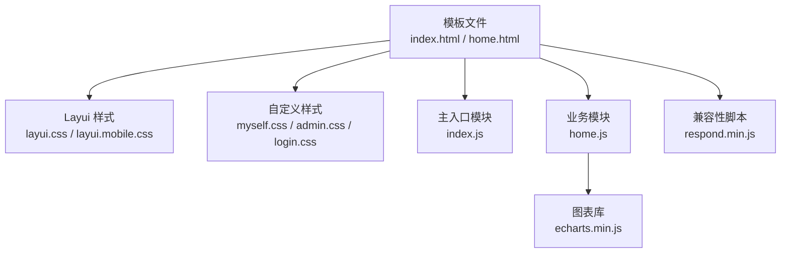
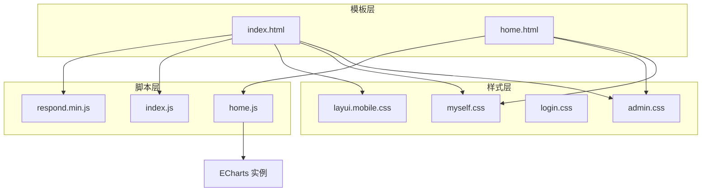
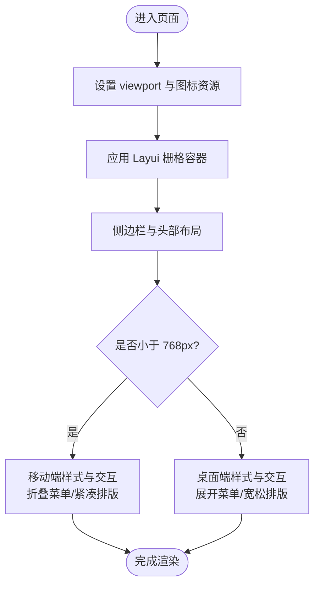
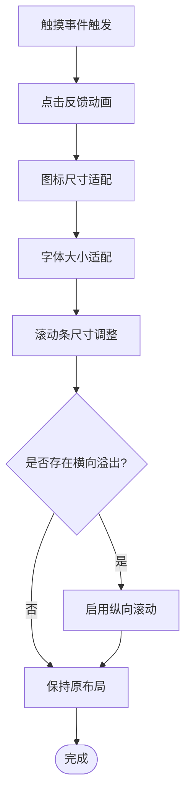
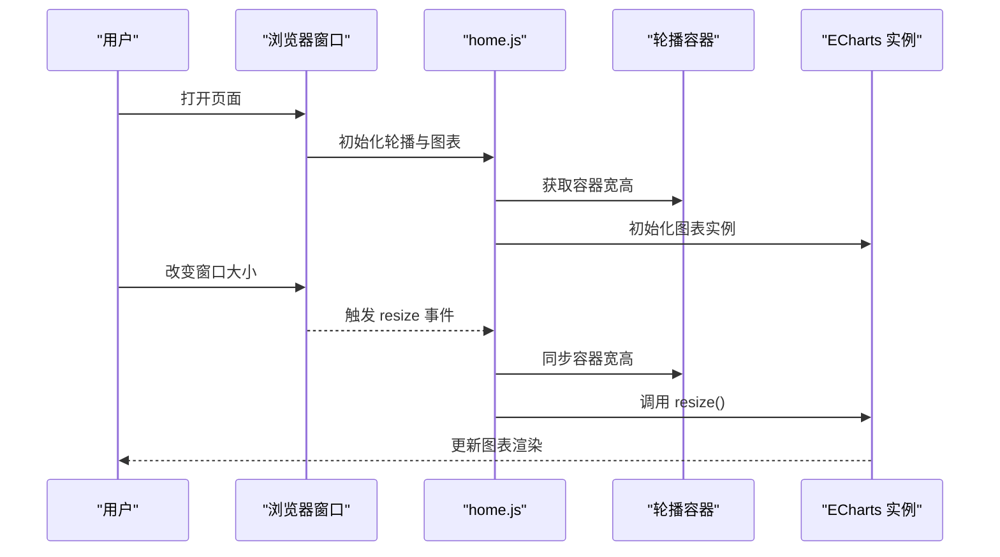
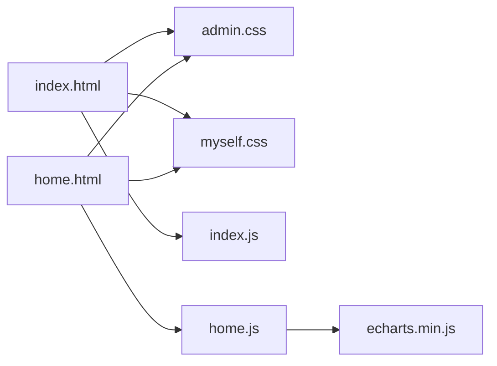

# 响应式设计实现

<cite>
**本文引用的文件**
- [index.html](file://phoenix-ui/src/main/resources/templates/index.html)
- [home.html](file://phoenix-ui/src/main/resources/templates/home.html)
- [myself.css](file://phoenix-ui/src/main/resources/static/style/myself.css)
- [login.css](file://phoenix-ui/src/main/resources/static/style/login.css)
- [admin.css](file://phoenix-ui/src/main/resources/static/style/admin.css)
- [layui.mobile.css](file://phoenix-ui/src/main/resources/static/layui/css/layui.mobile.css)
- [respond.min.js](file://phoenix-ui/src/main/resources/static/js/respond.min.js)
- [index.js](file://phoenix-ui/src/main/resources/static/lib/index.js)
- [home.js](file://phoenix-ui/src/main/resources/static/modules/home.js)
</cite>

## 目录
1. [简介](#简介)
2. [项目结构](#项目结构)
3. [核心组件](#核心组件)
4. [架构总览](#架构总览)
5. [详细组件分析](#详细组件分析)
6. [依赖关系分析](#依赖关系分析)
7. [性能考虑](#性能考虑)
8. [故障排查指南](#故障排查指南)
9. [结论](#结论)
10. [附录](#附录)

## 简介
本文件面向Phoenix监控系统的前端响应式设计实现，系统性梳理了布局与交互在多终端（桌面、平板、手机）的一致体验保障策略。重点覆盖以下方面：
- 布局框架与栅格体系：基于Layui Admin的栅格与容器体系，结合自定义样式实现响应式布局。
- 媒体查询与断点：统一采用768px作为主要断点，兼顾移动端与桌面端的差异化表现。
- 移动端适配：触摸事件、滚动行为、点击区域、字体与图标适配等移动端特性处理。
- 图表与容器自适应：轮播与ECharts图表在窗口变化时的尺寸同步与重绘机制。
- 兼容性处理：对旧版IE的媒体查询与基础样式兼容方案。

## 项目结构
Phoenix UI采用Thymeleaf模板与Layui Admin前端框架，配合自定义CSS与JS模块，形成“模板 + 组件 + 样式 + 脚本”的分层组织方式。响应式相关的关键文件分布如下：
- 模板层：页面骨架与容器结构，负责viewport与资源引入。
- 样式层：Layui默认样式、移动端样式、自定义样式（含媒体查询）。
- 脚本层：主入口模块、业务模块（如home.js），以及兼容性polyfill。

**图表来源**
- [index.html:1-318](file://phoenix-ui/src/main/resources/templates/index.html#L1-L318)
- [home.html:1-360](file://phoenix-ui/src/main/resources/templates/home.html#L1-L360)
- [layui.mobile.css:1-2](file://phoenix-ui/src/main/resources/static/layui/css/layui.mobile.css#L1-L2)
- [myself.css:1-223](file://phoenix-ui/src/main/resources/static/style/myself.css#L1-L223)
- [admin.css:1-2](file://phoenix-ui/src/main/resources/static/style/admin.css#L1-L2)
- [login.css:1-173](file://phoenix-ui/src/main/resources/static/style/login.css#L1-L173)
- [index.js:1-21](file://phoenix-ui/src/main/resources/static/lib/index.js#L1-L21)
- [home.js:1-567](file://phoenix-ui/src/main/resources/static/modules/home.js#L1-L567)
- [respond.min.js:1-5](file://phoenix-ui/src/main/resources/static/js/respond.min.js#L1-L5)

**章节来源**
- [index.html:1-318](file://phoenix-ui/src/main/resources/templates/index.html#L1-L318)
- [home.html:1-360](file://phoenix-ui/src/main/resources/templates/home.html#L1-L360)

## 核心组件
- 视口与容器
  - 模板中统一设置viewport，确保移动端按设备宽度渲染，并限制缩放以稳定布局。
  - 使用Layui的流式容器与栅格类，配合自定义卡片与轮播容器实现内容分区。
- 导航与侧边栏
  - 顶部导航与侧边菜单在不同断点下切换显示状态，移动端通过“更多”按钮收起次要功能。
- 表格与列表
  - 列表项在移动端采用紧凑排版，配合滚动容器避免横向滚动溢出。
- 图表与轮播
  - 轮播容器与ECharts实例在窗口resize时同步尺寸并触发重绘，保证图表自适应。

**章节来源**
- [index.html:11-25](file://phoenix-ui/src/main/resources/templates/index.html#L11-L25)
- [admin.css:1-2](file://phoenix-ui/src/main/resources/static/style/admin.css#L1-L2)
- [myself.css:102-134](file://phoenix-ui/src/main/resources/static/style/myself.css#L102-L134)
- [home.js:13-38](file://phoenix-ui/src/main/resources/static/modules/home.js#L13-L38)

## 架构总览
整体响应式架构围绕“模板 + 样式 + 脚本”的三层协同展开：
- 模板层负责语义化结构与资源引入，统一viewport与图标资源。
- 样式层提供栅格、组件与媒体查询，支撑不同屏幕尺寸的布局与视觉。
- 脚本层负责交互与动态内容，同时处理图表与容器的自适应逻辑。

**图表来源**
- [index.html:23-34](file://phoenix-ui/src/main/resources/templates/index.html#L23-L34)
- [home.html:10-22](file://phoenix-ui/src/main/resources/templates/home.html#L10-L22)
- [admin.css:1-2](file://phoenix-ui/src/main/resources/static/style/admin.css#L1-L2)
- [myself.css:1-223](file://phoenix-ui/src/main/resources/static/style/myself.css#L1-L223)
- [login.css:1-173](file://phoenix-ui/src/main/resources/static/style/login.css#L1-L173)
- [layui.mobile.css:1-2](file://phoenix-ui/src/main/resources/static/layui/css/layui.mobile.css#L1-L2)
- [index.js:1-21](file://phoenix-ui/src/main/resources/static/lib/index.js#L1-L21)
- [home.js:1-567](file://phoenix-ui/src/main/resources/static/modules/home.js#L1-L567)
- [respond.min.js:1-5](file://phoenix-ui/src/main/resources/static/js/respond.min.js#L1-L5)

## 详细组件分析

### 布局与栅格体系
- 容器与栅格
  - 使用Layui的流式容器与列类，配合自定义卡片间距与背景，实现内容区块的弹性布局。
  - 在首页模板中，主体区域采用两列布局，右侧为最新告警列表，左侧为统计轮播与图表区域。
- 侧边栏与头部
  - 顶部导航在移动端通过“更多”按钮折叠次要功能；侧边栏在窄屏下可平移展开，避免遮挡内容。
- 媒体查询断点
  - 统一以768px为断点，针对移动端与桌面端分别设置滚动条宽度、卡片高度与布局密度。

**图表来源**
- [index.html:11-25](file://phoenix-ui/src/main/resources/templates/index.html#L11-L25)
- [home.html:24-342](file://phoenix-ui/src/main/resources/templates/home.html#L24-L342)
- [admin.css:1-2](file://phoenix-ui/src/main/resources/static/style/admin.css#L1-L2)
- [myself.css:12-29](file://phoenix-ui/src/main/resources/static/style/myself.css#L12-L29)

**章节来源**
- [index.html:35-296](file://phoenix-ui/src/main/resources/templates/index.html#L35-L296)
- [home.html:24-342](file://phoenix-ui/src/main/resources/templates/home.html#L24-L342)
- [admin.css:1-2](file://phoenix-ui/src/main/resources/static/style/admin.css#L1-L2)
- [myself.css:12-29](file://phoenix-ui/src/main/resources/static/style/myself.css#L12-L29)

### 移动端适配策略
- 触摸与点击区域
  - 移动端样式中通过特定选择器与动画，提升点击反馈与交互体验。
- 字体与图标
  - 登录页与通用样式对字体大小与图标尺寸进行移动端优化，确保可读性与可触达性。
- 滚动与溢出
  - 自定义滚动条在移动端与桌面端采用不同尺寸，避免影响内容阅读。
  - 列表与卡片在移动端采用纵向滚动，减少横向滚动需求。

**图表来源**
- [layui.mobile.css:1-2](file://phoenix-ui/src/main/resources/static/layui/css/layui.mobile.css#L1-L2)
- [login.css:161-173](file://phoenix-ui/src/main/resources/static/style/login.css#L161-L173)
- [myself.css:11-29](file://phoenix-ui/src/main/resources/static/style/myself.css#L11-L29)

**章节来源**
- [layui.mobile.css:1-2](file://phoenix-ui/src/main/resources/static/layui/css/layui.mobile.css#L1-L2)
- [login.css:161-173](file://phoenix-ui/src/main/resources/static/style/login.css#L161-L173)
- [myself.css:11-29](file://phoenix-ui/src/main/resources/static/style/myself.css#L11-L29)

### 图表与容器自适应
- 轮播与图表联动
  - 首页统计轮播容器与两个ECharts图表在窗口resize时同步尺寸并调用resize，确保图表自适应。
- 设备判断与交互
  - 根据设备类型（iOS/Android）调整轮播触发方式（点击/悬停），提升移动端可用性。

**图表来源**
- [home.js:13-38](file://phoenix-ui/src/main/resources/static/modules/home.js#L13-L38)
- [home.html:317-327](file://phoenix-ui/src/main/resources/templates/home.html#L317-L327)

**章节来源**
- [home.js:13-38](file://phoenix-ui/src/main/resources/static/modules/home.js#L13-L38)
- [home.html:317-327](file://phoenix-ui/src/main/resources/templates/home.html#L317-L327)

### 登录页响应式适配
- 登录页在768px以下断点下，缩小主容器宽度、降低内边距，提升移动端可读性与可操作性。
- 通过媒体查询控制布局密度与元素间距，避免移动端拥挤。

**章节来源**
- [login.css:161-173](file://phoenix-ui/src/main/resources/static/style/login.css#L161-L173)

### 兼容性处理方案
- IE8/9兼容
  - 通过条件注释引入HTML5与Respond.js，使旧版IE支持媒体查询与基础HTML5语义标签。
- 移动端滚动与动画
  - 移动端样式中启用触摸滚动与动画，改善移动端交互体验。

**章节来源**
- [index.html:26-30](file://phoenix-ui/src/main/resources/templates/index.html#L26-L30)
- [respond.min.js:1-5](file://phoenix-ui/src/main/resources/static/js/respond.min.js#L1-L5)
- [layui.mobile.css:1-2](file://phoenix-ui/src/main/resources/static/layui/css/layui.mobile.css#L1-L2)

## 依赖关系分析
- 模板到样式的依赖
  - 模板统一引入Layui样式与自定义样式，确保布局与主题一致性。
- 模板到脚本的依赖
  - 主入口模块负责标签页与侧边栏交互，业务模块负责图表与数据加载。
- 脚本到图表的依赖
  - 业务模块初始化ECharts实例并在窗口变化时同步尺寸。

**图表来源**
- [index.html:23-34](file://phoenix-ui/src/main/resources/templates/index.html#L23-L34)
- [home.html:10-22](file://phoenix-ui/src/main/resources/templates/home.html#L10-L22)
- [admin.css:1-2](file://phoenix-ui/src/main/resources/static/style/admin.css#L1-L2)
- [myself.css:1-223](file://phoenix-ui/src/main/resources/static/style/myself.css#L1-L223)
- [index.js:1-21](file://phoenix-ui/src/main/resources/static/lib/index.js#L1-L21)
- [home.js:1-567](file://phoenix-ui/src/main/resources/static/modules/home.js#L1-L567)

**章节来源**
- [index.html:23-34](file://phoenix-ui/src/main/resources/templates/index.html#L23-L34)
- [home.html:10-22](file://phoenix-ui/src/main/resources/templates/home.html#L10-L22)
- [index.js:1-21](file://phoenix-ui/src/main/resources/static/lib/index.js#L1-L21)
- [home.js:1-567](file://phoenix-ui/src/main/resources/static/modules/home.js#L1-L567)

## 性能考虑
- 懒加载与延迟渲染
  - 通过模板按需引入样式与脚本，避免不必要的资源加载。
- 图表性能
  - 在窗口resize时仅同步容器尺寸并调用图表resize，避免重复初始化。
- 移动端交互
  - 根据设备类型调整轮播触发方式，减少无效交互与重绘。

[本节为通用建议，无需特定文件引用]

## 故障排查指南
- 媒体查询不生效（IE8/9）
  - 确认已正确引入respond.min.js与HTML5支持脚本，检查条件注释是否被正确解析。
- 移动端滚动异常
  - 检查自定义滚动条样式与移动端样式是否冲突，确认容器是否具备纵向滚动能力。
- 图表不随窗口变化而自适应
  - 确认窗口resize事件监听是否注册，图表实例是否在回调中调用resize。
- 标签页与侧边栏交互异常
  - 检查主入口模块是否正确初始化，侧边栏展开/折叠事件是否绑定。

**章节来源**
- [index.html:26-30](file://phoenix-ui/src/main/resources/templates/index.html#L26-L30)
- [respond.min.js:1-5](file://phoenix-ui/src/main/resources/static/js/respond.min.js#L1-L5)
- [myself.css:11-29](file://phoenix-ui/src/main/resources/static/style/myself.css#L11-L29)
- [home.js:30-38](file://phoenix-ui/src/main/resources/static/modules/home.js#L30-L38)
- [index.js:1-21](file://phoenix-ui/src/main/resources/static/lib/index.js#L1-L21)

## 结论
Phoenix监控系统通过Layui Admin的栅格与容器体系、统一的768px断点策略、自定义样式与脚本模块，实现了跨终端的一致体验。在移动端，系统通过触摸反馈、字体与图标适配、滚动行为优化与图表自适应等手段，确保可用性与可读性。对于旧版IE，通过respond.min.js与HTML5支持脚本提供了必要的兼容性保障。后续可在以下方向持续优化：
- 进一步细化断点与布局密度，提升不同尺寸设备的阅读体验。
- 对高频交互组件增加节流/防抖，降低resize与滚动带来的性能压力。
- 引入更完善的无障碍访问（ARIA）与键盘导航，提升可访问性。

[本节为总结性内容，无需特定文件引用]

## 附录
- 关键文件清单
  - 模板：index.html、home.html
  - 样式：admin.css、myself.css、login.css、layui.mobile.css
  - 脚本：index.js、home.js、respond.min.js

[本节为概览性内容，无需特定文件引用]