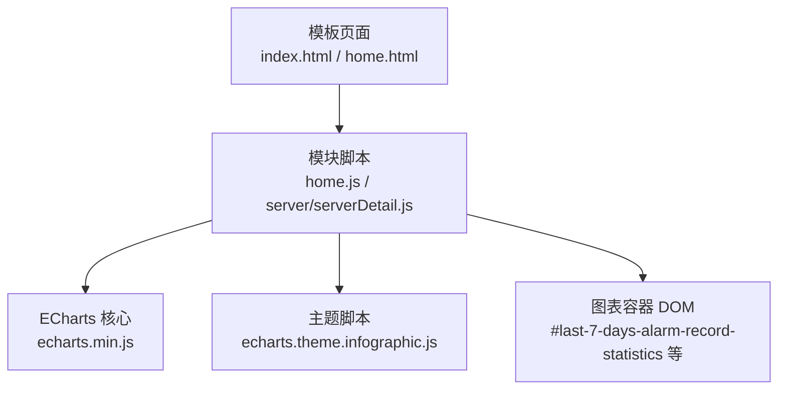
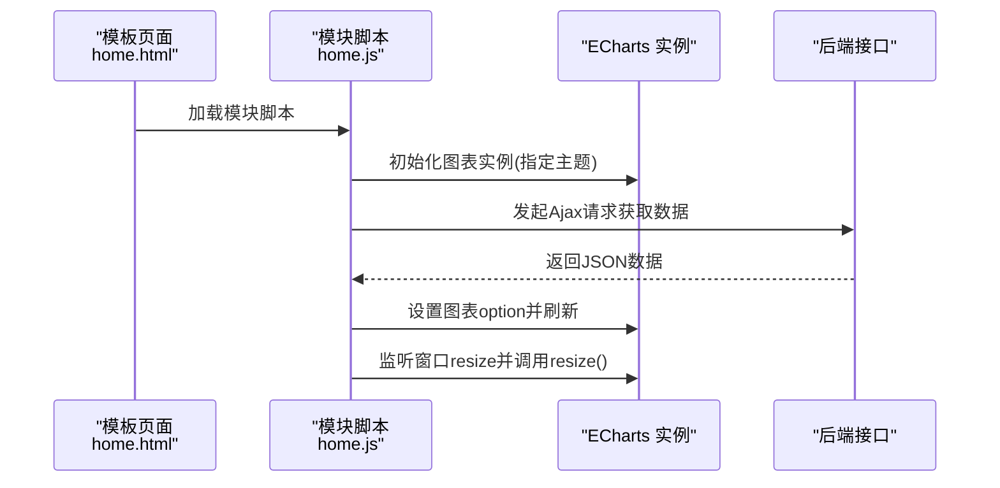
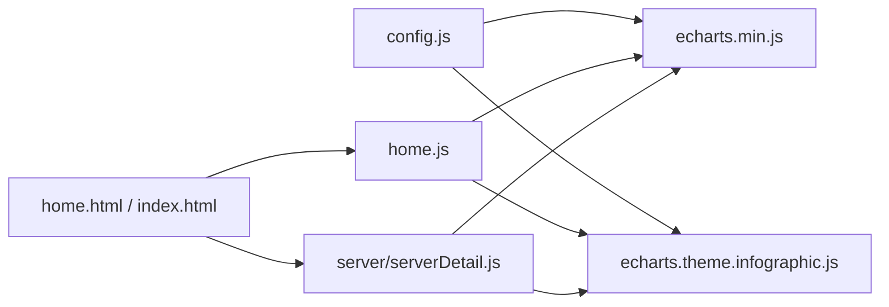

# 图表库集成

<cite>
**本文引用的文件**
- [echarts.min.js](file://phoenix-ui/src/main/resources/static/js/echarts.min.js)
- [echarts.theme.infographic.js](file://phoenix-ui/src/main/resources/static/js/echarts.theme.infographic.js)
- [home.js](file://phoenix-ui/src/main/resources/static/modules/home.js)
- [serverDetail.js](file://phoenix-ui/src/main/resources/static/modules/server/serverDetail.js)
- [config.js](file://phoenix-ui/src/main/resources/static/config.js)
- [index.html](file://phoenix-ui/src/main/resources/templates/index.html)
- [home.html](file://phoenix-ui/src/main/resources/templates/home.html)
</cite>

## 目录
1. [简介](#简介)
2. [项目结构](#项目结构)
3. [核心组件](#核心组件)
4. [架构总览](#架构总览)
5. [详细组件分析](#详细组件分析)
6. [依赖分析](#依赖分析)
7. [性能考虑](#性能考虑)
8. [故障排查指南](#故障排查指南)
9. [结论](#结论)
10. [附录](#附录)

## 简介
本文件面向Phoenix监控系统的前端图表库集成，聚焦ECharts在UI模块中的引入、主题配置与响应式适配，以及在监控场景中折线图、柱状图、饼图、散点图等典型图表的使用方式。同时，结合现有代码片段，给出大数据量渲染的优化思路（如分页、懒加载、虚拟滚动等通用策略），并对第三方图表库（D3.js、Highcharts、AntV）的引入与对比进行指导性说明，帮助开发者在Phoenix中构建高性能、可交互的监控可视化界面。

## 项目结构
Phoenix前端UI采用静态资源与模板页面分离的方式组织图表相关文件：
- 静态资源目录包含ECharts核心脚本与主题脚本
- 模块化JavaScript文件负责图表初始化、配置与交互
- 配置文件声明依赖，确保按需加载
- 模板页面提供图表容器与布局

**图表来源**
- [index.html](file://phoenix-ui/src/main/resources/templates/index.html)
- [home.html](file://phoenix-ui/src/main/resources/templates/home.html)
- [home.js](file://phoenix-ui/src/main/resources/static/modules/home.js)
- [serverDetail.js](file://phoenix-ui/src/main/resources/static/modules/server/serverDetail.js)
- [echarts.min.js](file://phoenix-ui/src/main/resources/static/js/echarts.min.js)
- [echarts.theme.infographic.js](file://phoenix-ui/src/main/resources/static/js/echarts.theme.infographic.js)

**章节来源**
- [config.js:42-43](file://phoenix-ui/src/main/resources/static/config.js#L42-L43)
- [echarts.min.js:1-22](file://phoenix-ui/src/main/resources/static/js/echarts.min.js#L1-L22)
- [echarts.theme.infographic.js:1-205](file://phoenix-ui/src/main/resources/static/js/echarts.theme.infographic.js#L1-L205)

## 核心组件
- ECharts核心库：提供图表渲染、动画、交互与事件处理能力
- 自定义主题：基于“infographic”风格的主题，统一颜色、控件与提示样式
- 模块化图表脚本：在具体业务页面中初始化图表、绑定数据与交互
- 响应式适配：监听窗口变化，动态调整图表尺寸

关键证据：
- 引入与注册主题：[echarts.theme.infographic.js:204](file://phoenix-ui/src/main/resources/static/js/echarts.theme.infographic.js#L204)
- 初始化图表并指定主题：[home.js:28-29](file://phoenix-ui/src/main/resources/static/modules/home.js#L28-L29)
- 响应式 resize 处理：[home.js:30-38](file://phoenix-ui/src/main/resources/static/modules/home.js#L30-L38)

**章节来源**
- [echarts.theme.infographic.js:204](file://phoenix-ui/src/main/resources/static/js/echarts.theme.infographic.js#L204)
- [home.js:28-38](file://phoenix-ui/src/main/resources/static/modules/home.js#L28-L38)

## 架构总览
下图展示了从模板到图表渲染的整体流程：模板提供容器，模块脚本通过ECharts初始化图表并应用主题，随后通过Ajax获取数据并更新图表配置。

**图表来源**
- [home.js:28-38](file://phoenix-ui/src/main/resources/static/modules/home.js#L28-L38)
- [home.js:40-47](file://phoenix-ui/src/main/resources/static/modules/home.js#L40-L47)

**章节来源**
- [home.js:28-47](file://phoenix-ui/src/main/resources/static/modules/home.js#L28-L47)

## 详细组件分析

### ECharts引入与主题配置
- 引入方式：通过模块脚本依赖配置加载ECharts核心与主题
- 主题注册：自定义主题以“infographic”命名，覆盖标题、工具箱、提示框、坐标轴、数据区域等样式
- 使用方式：在初始化图表时传入主题名，即可应用统一视觉风格

参考路径：
- [config.js:42-43](file://phoenix-ui/src/main/resources/static/config.js#L42-L43)
- [echarts.theme.infographic.js:204](file://phoenix-ui/src/main/resources/static/js/echarts.theme.infographic.js#L204)

**章节来源**
- [config.js:42-43](file://phoenix-ui/src/main/resources/static/config.js#L42-L43)
- [echarts.theme.infographic.js:204](file://phoenix-ui/src/main/resources/static/js/echarts.theme.infographic.js#L204)

### 响应式图表
- 监听浏览器窗口变化，动态计算容器宽高并调用图表resize
- 在模板或模块脚本中设置容器尺寸，保证图表随布局变化而自适应

参考路径：
- [home.js:30-38](file://phoenix-ui/src/main/resources/static/modules/home.js#L30-L38)

**章节来源**
- [home.js:30-38](file://phoenix-ui/src/main/resources/static/modules/home.js#L30-L38)

### 折线图在监控场景的应用
- 场景：CPU/内存趋势、告警统计等时间序列数据
- 关键配置：标题、提示框、图例、工具箱、数据区域缩放、格式化提示内容
- 交互：支持数据区域缩放、数据视图、动态切换系列显示

参考路径：
- [serverDetail.js:1157-1617](file://phoenix-ui/src/main/resources/static/modules/server/serverDetail.js#L1157-L1617)

**章节来源**
- [serverDetail.js:1157-1617](file://phoenix-ui/src/main/resources/static/modules/server/serverDetail.js#L1157-L1617)

### 柱状图在监控场景的应用
- 场景：资源使用率分布、实例数量统计等离散数据
- 关键配置：坐标轴类型、柱宽、堆叠/分组策略、数值轴范围与边界
- 交互：数据区域缩放、数据视图、工具箱

参考路径：
- [serverDetail.js:1157-1617](file://phoenix-ui/src/main/resources/static/modules/server/serverDetail.js#L1157-L1617)

**章节来源**
- [serverDetail.js:1157-1617](file://phoenix-ui/src/main/resources/static/modules/server/serverDetail.js#L1157-L1617)

### 饼图在监控场景的应用
- 场景：资源占比、告警类型分布等比例关系展示
- 关键配置：半径、中心位置、标签与引导线、高亮与选中状态
- 交互：点击切换、提示框格式化、图例联动

参考路径：
- [serverDetail.js:1157-1617](file://phoenix-ui/src/main/resources/static/modules/server/serverDetail.js#L1157-L1617)

**章节来源**
- [serverDetail.js:1157-1617](file://phoenix-ui/src/main/resources/static/modules/server/serverDetail.js#L1157-L1617)

### 散点图在监控场景的应用
- 场景：多维指标关联分析、异常点检测
- 关键配置：坐标系、符号形状与大小、数值轴范围、视觉映射
- 交互：缩放、平移、提示框、数据区域缩放

参考路径：
- [serverDetail.js:1157-1617](file://phoenix-ui/src/main/resources/static/modules/server/serverDetail.js#L1157-L1617)

**章节来源**
- [serverDetail.js:1157-1617](file://phoenix-ui/src/main/resources/static/modules/server/serverDetail.js#L1157-L1617)

### 大数据量渲染优化策略（通用）
以下为适用于Phoenix监控场景的通用优化建议（概念性说明，非特定代码实现）：
- 数据分页：按时间窗口分段加载，避免一次性渲染过多点位
- 懒加载：可视区域外的数据延迟渲染，滚动或缩放时再拉取
- 虚拟滚动：仅渲染可见区域内的元素，减少DOM节点数量
- 采样降采样：对高密度时间序列进行聚合或抽样，降低点数
- 渐进渲染：分批次绘制，避免主线程阻塞
- 动画与过渡：在大数据场景下适当关闭或简化动画
- 内存管理：及时释放不再使用的图表实例与数据引用

[本节为通用指导，不直接分析具体文件]

### 第三方图表库集成方案（概念性说明）
- D3.js：适合高度定制化的SVG图表与复杂交互，但学习成本较高，适合专业可视化需求
- Highcharts：商业友好、生态完善，适合快速搭建常见图表，但在大规模数据上需要配合分页/采样
- AntV：G2/G6等专注数据可视化，中文生态好，适合复杂交互与企业级应用
- 集成步骤（通用）：引入CDN或npm包 -> 注册主题/样式 -> 初始化图表容器 -> 绑定数据与交互 -> 响应式适配

[本节为概念性说明，不直接分析具体文件]

## 依赖分析
- 模块脚本依赖ECharts核心与主题
- 模板页面提供图表容器
- 后端接口提供数据源

**图表来源**
- [config.js:42-43](file://phoenix-ui/src/main/resources/static/config.js#L42-L43)
- [echarts.min.js:1-22](file://phoenix-ui/src/main/resources/static/js/echarts.min.js#L1-L22)
- [echarts.theme.infographic.js:1-205](file://phoenix-ui/src/main/resources/static/js/echarts.theme.infographic.js#L1-L205)
- [home.js:28-38](file://phoenix-ui/src/main/resources/static/modules/home.js#L28-L38)
- [serverDetail.js:1157-1617](file://phoenix-ui/src/main/resources/static/modules/server/serverDetail.js#L1157-L1617)

**章节来源**
- [config.js:42-43](file://phoenix-ui/src/main/resources/static/config.js#L42-L43)

## 性能考虑
- 控制数据规模：优先采用分页与采样策略
- 合理使用动画：大数据场景下关闭或简化动画
- 事件节流：对resize、缩放、拖拽等高频事件进行节流
- 批处理更新：合并多次option更新，减少重绘次数
- 可视区域优化：虚拟滚动与渐进渲染提升首屏与交互流畅度

[本节为通用指导，不直接分析具体文件]

## 故障排查指南
- 图表未显示
  - 检查容器是否存在且有宽高
  - 确认ECharts与主题已正确加载
  - 查看浏览器控制台是否有报错
- 主题未生效
  - 确认初始化时传入了正确的主题名
  - 检查主题脚本是否在核心脚本之后加载
- 响应式异常
  - 确认已监听窗口resize并调用图表resize
  - 检查容器尺寸计算逻辑

参考路径：
- [home.js:28-38](file://phoenix-ui/src/main/resources/static/modules/home.js#L28-L38)
- [echarts.theme.infographic.js:204](file://phoenix-ui/src/main/resources/static/js/echarts.theme.infographic.js#L204)

**章节来源**
- [home.js:28-38](file://phoenix-ui/src/main/resources/static/modules/home.js#L28-L38)
- [echarts.theme.infographic.js:204](file://phoenix-ui/src/main/resources/static/js/echarts.theme.infographic.js#L204)

## 结论
Phoenix前端已在UI模块中完成ECharts的引入与主题配置，并在监控场景中通过模块脚本实现了响应式图表的初始化与交互。结合分页、采样与虚拟滚动等通用优化策略，可在保证用户体验的同时支撑大规模监控数据的可视化呈现。对于更复杂的可视化需求，可评估引入D3.js、Highcharts或AntV等第三方库，按需选择合适的生态与性能特性。

[本节为总结性内容，不直接分析具体文件]

## 附录
- 模板页面示例：[index.html](file://phoenix-ui/src/main/resources/templates/index.html)，[home.html](file://phoenix-ui/src/main/resources/templates/home.html)
- 模块脚本示例：[home.js](file://phoenix-ui/src/main/resources/static/modules/home.js)，[server/serverDetail.js](file://phoenix-ui/src/main/resources/static/modules/server/serverDetail.js)
- 依赖配置：[config.js:42-43](file://phoenix-ui/src/main/resources/static/config.js#L42-L43)
- ECharts核心与主题：[echarts.min.js](file://phoenix-ui/src/main/resources/static/js/echarts.min.js)，[echarts.theme.infographic.js](file://phoenix-ui/src/main/resources/static/js/echarts.theme.infographic.js)