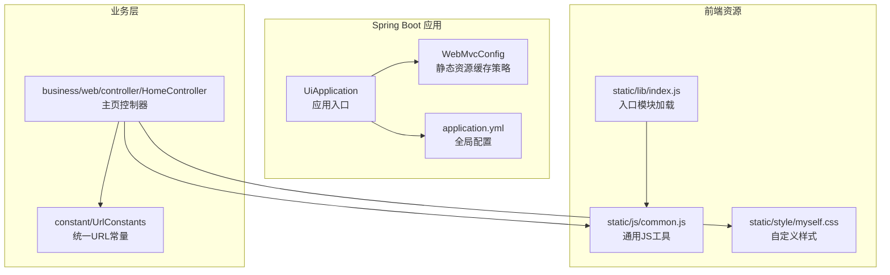
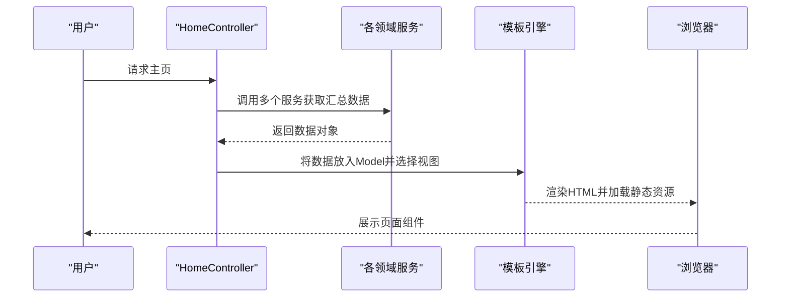
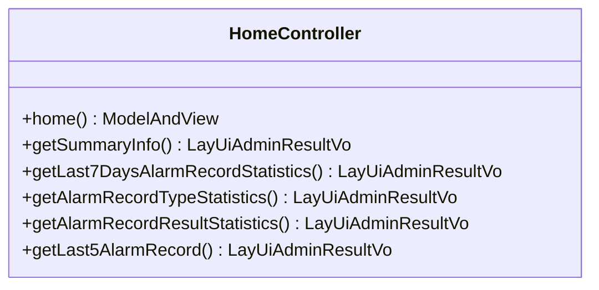
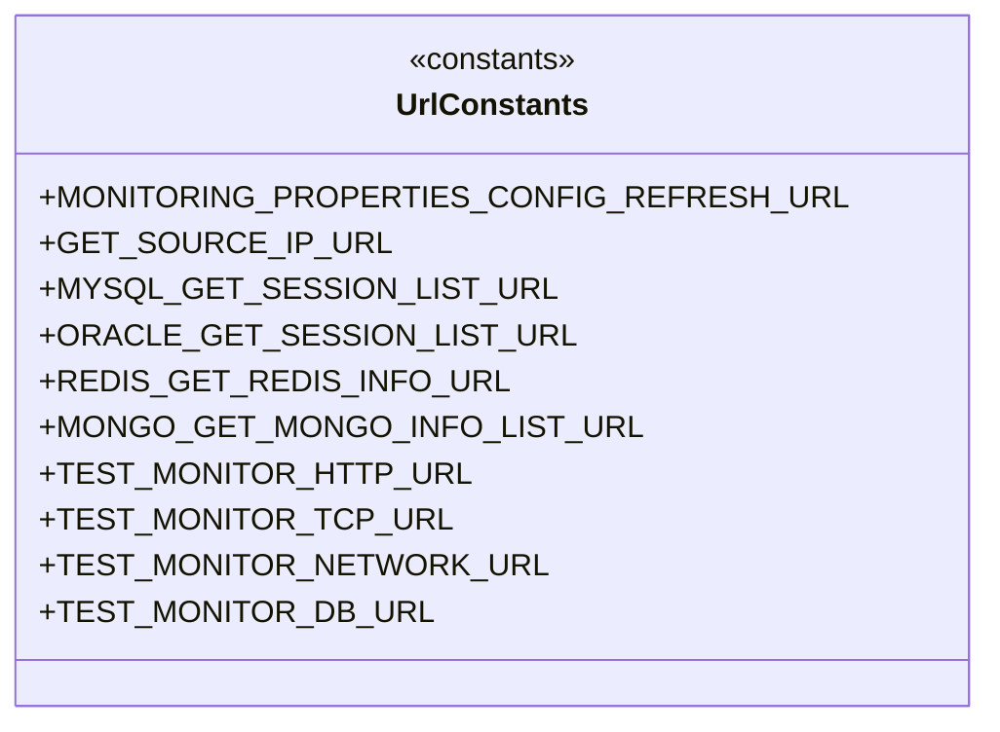
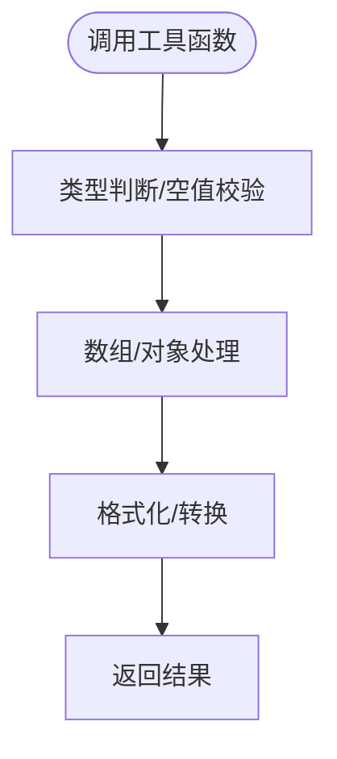
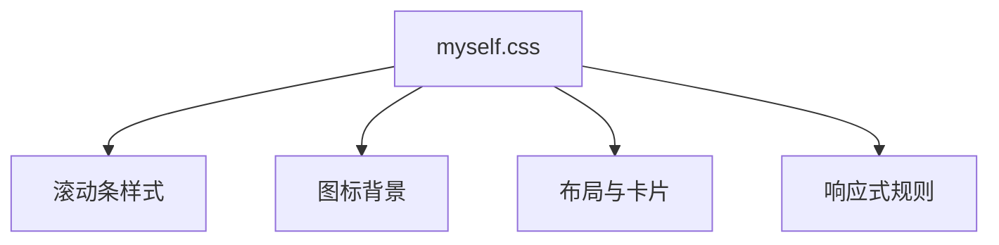
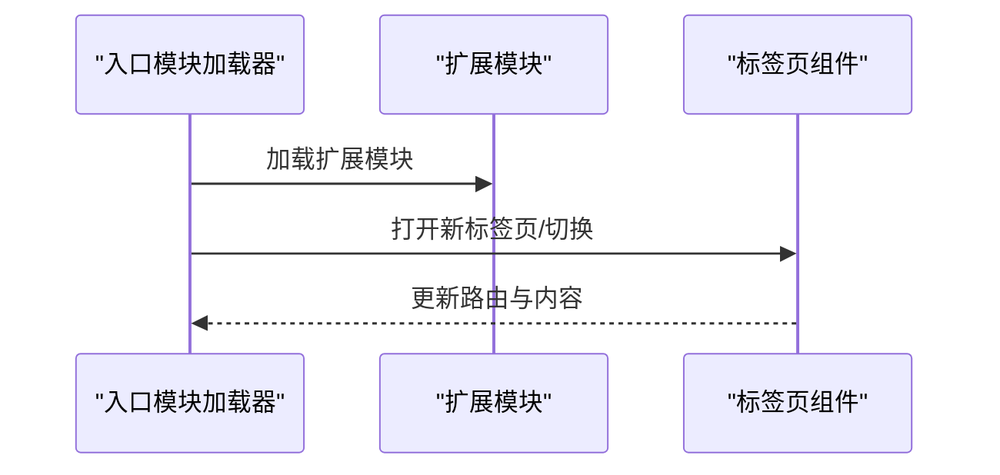
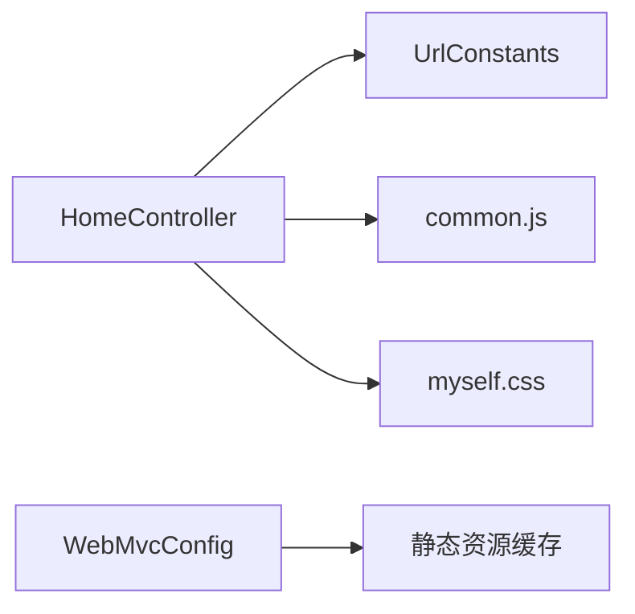

# 组件化架构设计

<cite>
**本文引用的文件**
- [UiApplication.java](file://phoenix-ui/src/main/java/com/gitee/pifeng/monitoring/ui/UiApplication.java)
- [application.yml](file://phoenix-ui/src/main/resources/application.yml)
- [WebMvcConfig.java](file://phoenix-ui/src/main/java/com/gitee/pifeng/monitoring/ui/config/WebMvcConfig.java)
- [UrlConstants.java](file://phoenix-ui/src/main/java/com/gitee/pifeng/monitoring/ui/constant/UrlConstants.java)
- [common.js](file://phoenix-ui/src/main/resources/static/js/common.js)
- [myself.css](file://phoenix-ui/src/main/resources/static/style/myself.css)
- [index.js](file://phoenix-ui/src/main/resources/static/lib/index.js)
- [HomeController.java](file://phoenix-ui/src/main/java/com/gitee/pifeng/monitoring/ui/business/web/controller/HomeController.java)
</cite>

## 目录
1. [简介](#简介)
2. [项目结构](#项目结构)
3. [核心组件](#核心组件)
4. [架构总览](#架构总览)
5. [组件详解](#组件详解)
6. [依赖关系分析](#依赖关系分析)
7. [性能考量](#性能考量)
8. [故障排查指南](#故障排查指南)
9. [结论](#结论)
10. [附录](#附录)

## 简介
本文件面向Phoenix监控系统的前端组件化架构设计，聚焦于组件的职责分离、数据流管理、状态共享、样式隔离与主题定制、组件开发规范与最佳实践、以及测试与可维护性保障。文档结合Phoenix UI模块的实际代码与配置，给出可落地的设计原则与实施路径，帮助开发者在保持系统一致性的同时提升扩展性与可维护性。

## 项目结构
Phoenix UI采用Spring Boot工程，前端静态资源与模板通过Spring MVC与Thymeleaf配合管理，控制器负责页面渲染与接口响应，常量集中管理URL，通用JS与CSS提供跨页面复用能力。

**图表来源**
- [UiApplication.java:37-46](file://phoenix-ui/src/main/java/com/gitee/pifeng/monitoring/ui/UiApplication.java#L37-L46)
- [WebMvcConfig.java:34-53](file://phoenix-ui/src/main/java/com/gitee/pifeng/monitoring/ui/config/WebMvcConfig.java#L34-L53)
- [application.yml:1-238](file://phoenix-ui/src/main/resources/application.yml#L1-L238)
- [common.js:1-333](file://phoenix-ui/src/main/resources/static/js/common.js#L1-L333)
- [myself.css:1-223](file://phoenix-ui/src/main/resources/static/style/myself.css#L1-L223)
- [index.js:1-21](file://phoenix-ui/src/main/resources/static/lib/index.js#L1-L21)
- [HomeController.java:28-208](file://phoenix-ui/src/main/java/com/gitee/pifeng/monitoring/ui/business/web/controller/HomeController.java#L28-L208)
- [UrlConstants.java:13-101](file://phoenix-ui/src/main/java/com/gitee/pifeng/monitoring/ui/constant/UrlConstants.java#L13-L101)

**章节来源**
- [UiApplication.java:19-46](file://phoenix-ui/src/main/java/com/gitee/pifeng/monitoring/ui/UiApplication.java#L19-L46)
- [WebMvcConfig.java:20-53](file://phoenix-ui/src/main/java/com/gitee/pifeng/monitoring/ui/config/WebMvcConfig.java#L20-L53)
- [application.yml:1-238](file://phoenix-ui/src/main/resources/application.yml#L1-L238)
- [HomeController.java:28-208](file://phoenix-ui/src/main/java/com/gitee/pifeng/monitoring/ui/business/web/controller/HomeController.java#L28-L208)
- [UrlConstants.java:13-101](file://phoenix-ui/src/main/java/com/gitee/pifeng/monitoring/ui/constant/UrlConstants.java#L13-L101)
- [common.js:1-333](file://phoenix-ui/src/main/resources/static/js/common.js#L1-L333)
- [myself.css:1-223](file://phoenix-ui/src/main/resources/static/style/myself.css#L1-L223)
- [index.js:1-21](file://phoenix-ui/src/main/resources/static/lib/index.js#L1-L21)

## 核心组件
- 应用入口与配置
  - 应用入口类承担启动、计时与组件扫描职责，启用缓存、事务、重试与AOP代理，便于后续组件化与横切关注点的集成。
  - 全局配置文件集中管理服务器、日志、缓存、数据源、MyBatis-Plus、管理端点、接口文档等，为组件化提供一致的运行环境。
- 控制器与视图
  - 控制器负责页面渲染与接口响应，聚合多领域服务数据，形成“页面级组件”的数据装配层。
- 前端资源与工具
  - 通用JS提供跨页面的工具函数，统一常量与行为，减少重复逻辑。
  - 自定义CSS提供主题与布局样式，支持图标、表格、卡片等组件级样式的统一管理。
  - 入口模块加载器负责模块化加载与标签页路由，支撑组件化页面导航。

**章节来源**
- [UiApplication.java:28-46](file://phoenix-ui/src/main/java/com/gitee/pifeng/monitoring/ui/UiApplication.java#L28-L46)
- [application.yml:40-238](file://phoenix-ui/src/main/resources/application.yml#L40-L238)
- [HomeController.java:89-140](file://phoenix-ui/src/main/java/com/gitee/pifeng/monitoring/ui/business/web/controller/HomeController.java#L89-L140)
- [common.js:1-333](file://phoenix-ui/src/main/resources/static/js/common.js#L1-L333)
- [myself.css:31-223](file://phoenix-ui/src/main/resources/static/style/myself.css#L31-L223)
- [index.js:1-21](file://phoenix-ui/src/main/resources/static/lib/index.js#L1-L21)

## 架构总览
Phoenix UI的前端组件化遵循“控制器装配数据 + 视图模板渲染 + 通用资源复用”的三层协作模式。控制器作为页面级组件的编排者，调用服务层获取数据并注入模板；通用JS与CSS提供跨页面的工具与样式；静态资源缓存策略提升加载性能。

**图表来源**
- [HomeController.java:89-140](file://phoenix-ui/src/main/java/com/gitee/pifeng/monitoring/ui/business/web/controller/HomeController.java#L89-L140)

**章节来源**
- [HomeController.java:89-140](file://phoenix-ui/src/main/java/com/gitee/pifeng/monitoring/ui/business/web/controller/HomeController.java#L89-L140)

## 组件详解

### 控制器组件：主页控制器
- 职责分离
  - 页面渲染：负责主页模板选择与数据装配。
  - 接口响应：提供摘要信息、统计信息等异步接口，供组件动态加载。
- 数据流管理
  - 通过服务层聚合实例、网络、服务器、数据库、TCP、HTTP等维度数据，形成页面级数据模型。
  - 异步接口返回统一响应体，便于前端组件按需消费。
- 状态共享
  - 控制器作为页面级状态的“汇聚点”，将分散的服务状态整合为页面状态，供模板与脚本使用。

**图表来源**
- [HomeController.java:28-208](file://phoenix-ui/src/main/java/com/gitee/pifeng/monitoring/ui/business/web/controller/HomeController.java#L28-L208)

**章节来源**
- [HomeController.java:28-208](file://phoenix-ui/src/main/java/com/gitee/pifeng/monitoring/ui/business/web/controller/HomeController.java#L28-L208)

### URL常量组件：统一接口地址
- 设计目的
  - 将服务端接口地址集中管理，避免硬编码，便于统一变更与维护。
- 使用方式
  - 通过常量类拼接服务端根路径与具体接口路径，形成稳定、可读的URL集合。

**图表来源**
- [UrlConstants.java:13-101](file://phoenix-ui/src/main/java/com/gitee/pifeng/monitoring/ui/constant/UrlConstants.java#L13-L101)

**章节来源**
- [UrlConstants.java:13-101](file://phoenix-ui/src/main/java/com/gitee/pifeng/monitoring/ui/constant/UrlConstants.java#L13-L101)

### 通用JS工具：组件化辅助
- 功能范围
  - 常量定义、数据校验、数组与对象处理、格式化工具、通用行为封装等。
- 组件化价值
  - 提供跨页面的统一工具集，减少重复实现，提升组件复用性与一致性。

**图表来源**
- [common.js:1-333](file://phoenix-ui/src/main/resources/static/js/common.js#L1-L333)

**章节来源**
- [common.js:1-333](file://phoenix-ui/src/main/resources/static/js/common.js#L1-L333)

### 样式组件：主题与布局
- 自定义样式
  - 提供滚动条、图标背景、表格、卡片、进度条等组件级样式，统一视觉风格。
- 响应式与移动端适配
  - 通过媒体查询适配不同屏幕尺寸，确保组件在桌面与移动设备上的一致体验。

**图表来源**
- [myself.css:1-223](file://phoenix-ui/src/main/resources/static/style/myself.css#L1-L223)

**章节来源**
- [myself.css:1-223](file://phoenix-ui/src/main/resources/static/style/myself.css#L1-L223)

### 入口模块：页面导航与模块加载
- 模块化加载
  - 通过入口模块加载器扩展模块、配置基础路径与模块目录，支撑组件化页面的动态加载。
- 标签页路由
  - 支持新标签页打开与现有标签页切换，提升多组件并行浏览体验。

**图表来源**
- [index.js:1-21](file://phoenix-ui/src/main/resources/static/lib/index.js#L1-L21)

**章节来源**
- [index.js:1-21](file://phoenix-ui/src/main/resources/static/lib/index.js#L1-L21)

## 依赖关系分析
- 控制器依赖服务层与常量类，形成清晰的单向依赖。
- 通用JS与CSS被页面与组件共享，构成跨页面的基础设施。
- 静态资源缓存策略由WebMvc配置统一管理，影响组件加载性能。

**图表来源**
- [HomeController.java:28-208](file://phoenix-ui/src/main/java/com/gitee/pifeng/monitoring/ui/business/web/controller/HomeController.java#L28-L208)
- [UrlConstants.java:13-101](file://phoenix-ui/src/main/java/com/gitee/pifeng/monitoring/ui/constant/UrlConstants.java#L13-L101)
- [common.js:1-333](file://phoenix-ui/src/main/resources/static/js/common.js#L1-L333)
- [myself.css:1-223](file://phoenix-ui/src/main/resources/static/style/myself.css#L1-L223)
- [WebMvcConfig.java:34-53](file://phoenix-ui/src/main/java/com/gitee/pifeng/monitoring/ui/config/WebMvcConfig.java#L34-L53)

**章节来源**
- [HomeController.java:28-208](file://phoenix-ui/src/main/java/com/gitee/pifeng/monitoring/ui/business/web/controller/HomeController.java#L28-L208)
- [UrlConstants.java:13-101](file://phoenix-ui/src/main/java/com/gitee/pifeng/monitoring/ui/constant/UrlConstants.java#L13-L101)
- [WebMvcConfig.java:34-53](file://phoenix-ui/src/main/java/com/gitee/pifeng/monitoring/ui/config/WebMvcConfig.java#L34-L53)

## 性能考量
- 静态资源缓存
  - 生产环境对静态资源设置长期缓存，显著降低带宽与延迟，提升组件加载速度。
- 响应压缩与异步处理
  - 启用Gzip压缩与异步请求超时配置，优化接口响应与并发处理能力。
- 缓存策略
  - 启用Caffeine缓存，减少重复查询与计算，提升组件渲染效率。

**章节来源**
- [WebMvcConfig.java:34-53](file://phoenix-ui/src/main/java/com/gitee/pifeng/monitoring/ui/config/WebMvcConfig.java#L34-L53)
- [application.yml:8-13](file://phoenix-ui/src/main/resources/application.yml#L8-L13)
- [application.yml:46-50](file://phoenix-ui/src/main/resources/application.yml#L46-L50)

## 故障排查指南
- 页面空白或资源加载失败
  - 检查静态资源映射与缓存配置，确认路径与缓存策略正确。
- 接口404或跨域问题
  - 核对URL常量与服务端接口路径，确保拼接正确；检查CORS与网关配置。
- 组件渲染异常
  - 检查控制器数据装配逻辑与模板变量绑定，确保数据结构一致。
- 性能瓶颈
  - 关注缓存命中率、静态资源缓存与接口响应时间，必要时调整缓存策略与压缩配置。

**章节来源**
- [WebMvcConfig.java:34-53](file://phoenix-ui/src/main/java/com/gitee/pifeng/monitoring/ui/config/WebMvcConfig.java#L34-L53)
- [UrlConstants.java:29-101](file://phoenix-ui/src/main/java/com/gitee/pifeng/monitoring/ui/constant/UrlConstants.java#L29-L101)
- [application.yml:8-13](file://phoenix-ui/src/main/resources/application.yml#L8-L13)

## 结论
Phoenix UI的组件化架构以“控制器编排 + 通用资源复用 + 统一配置”为核心，实现了职责清晰、可扩展、易维护的前端体系。通过URL常量、通用JS与CSS、入口模块加载器与静态资源缓存策略，系统在保证一致性的同时提升了组件的复用性与性能。建议在后续迭代中持续完善组件测试与主题定制能力，进一步提升可维护性与用户体验。

## 附录

### 开发规范与最佳实践
- 命名约定
  - 控制器类名以“...Controller”结尾；服务接口以“I...Service”开头；常量类以“...Constants”结尾。
- 文件组织
  - 控制器位于业务包内，常量集中于constant包，静态资源按功能划分至static子目录。
- 接口设计
  - 统一返回体结构，明确状态码与消息；接口路径采用REST风格，名词化资源。
- 样式管理
  - 组件样式尽量局部化，优先使用类选择器；通过CSS变量与主题文件实现主题定制。
- 状态管理
  - 页面级状态由控制器汇聚；组件内部状态通过事件与回调进行解耦。
- 测试与质量
  - 为关键控制器与工具函数编写单元测试；对异步接口进行集成测试；使用覆盖率工具评估测试质量。

### 主题定制指南
- 主题变量
  - 在CSS中定义颜色、字体、间距等变量，集中管理主题色板与层级。
- 动态切换
  - 通过切换CSS类或注入主题样式表实现动态主题切换，避免全量重绘。
- 品牌适配
  - 将品牌色与图标替换为定制资源，确保组件在不同主题下保持一致性。

### 组件开发示例（从需求到实现）
- 需求分析
  - 明确组件职责（展示某类监控指标）、输入输出、交互行为与样式边界。
- 接口对接
  - 在URL常量中新增接口地址；在控制器中新增接口方法，返回统一响应体。
- 视图与样式
  - 设计模板结构与样式类名；复用通用CSS与图标资源。
- 通用工具
  - 如需格式化或数据处理，优先使用通用JS工具，避免重复实现。
- 测试验证
  - 编写单元测试与集成测试，覆盖正常与异常场景；关注性能与兼容性。