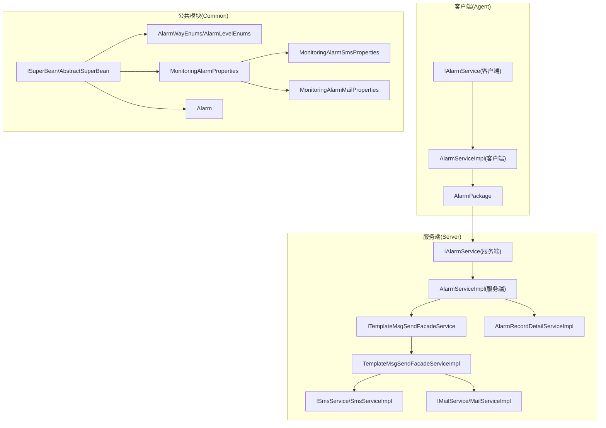
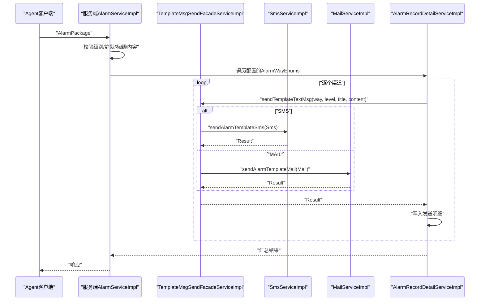
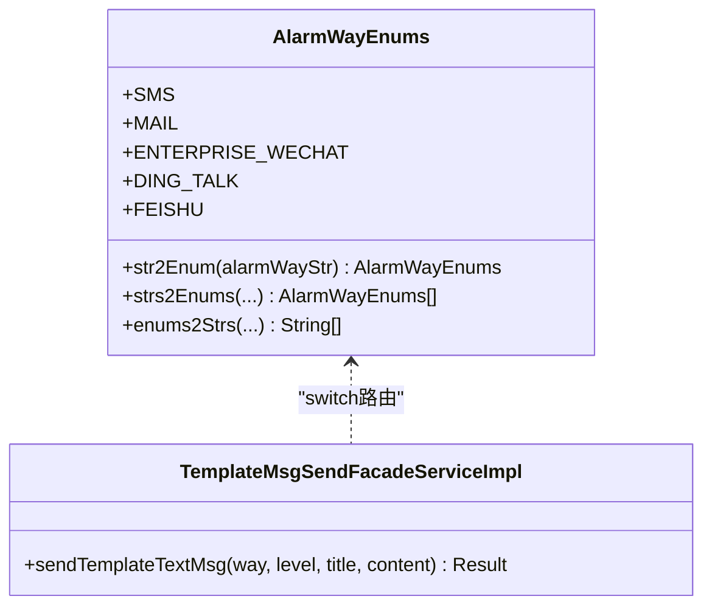
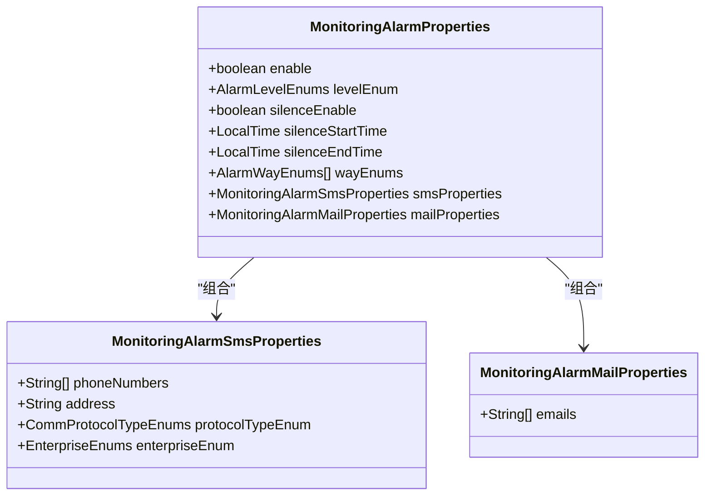
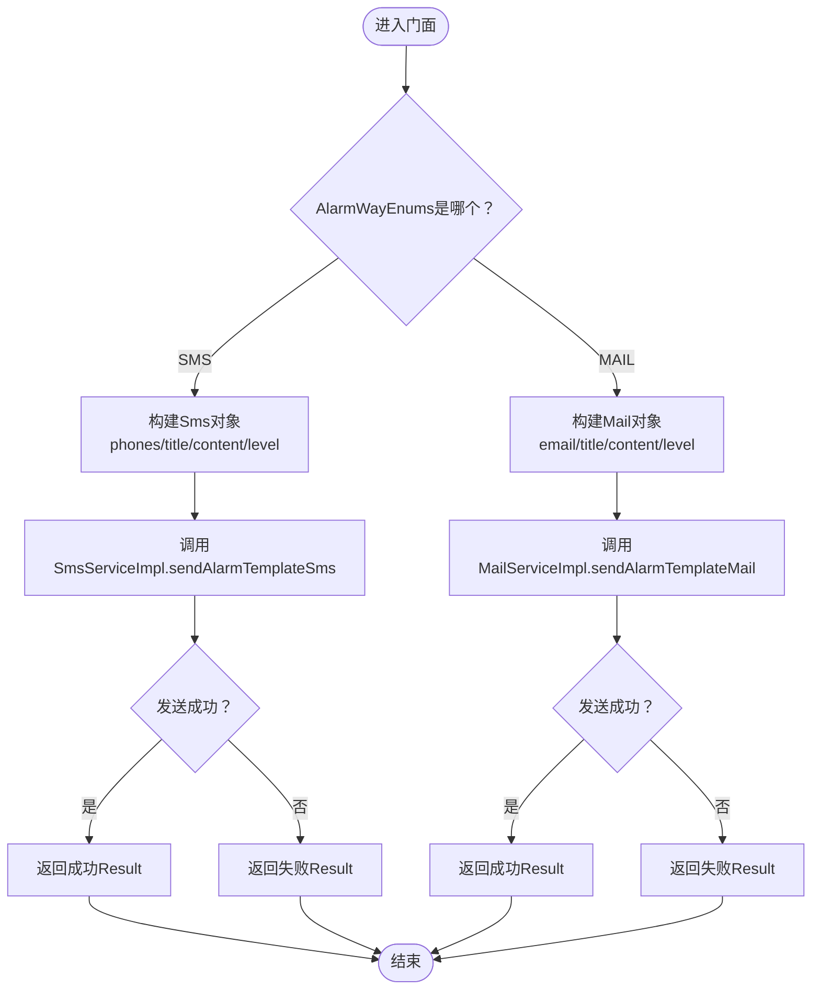
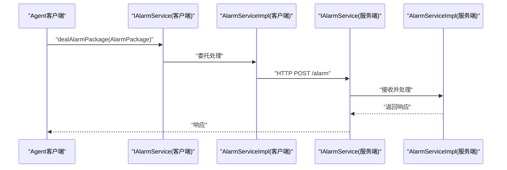
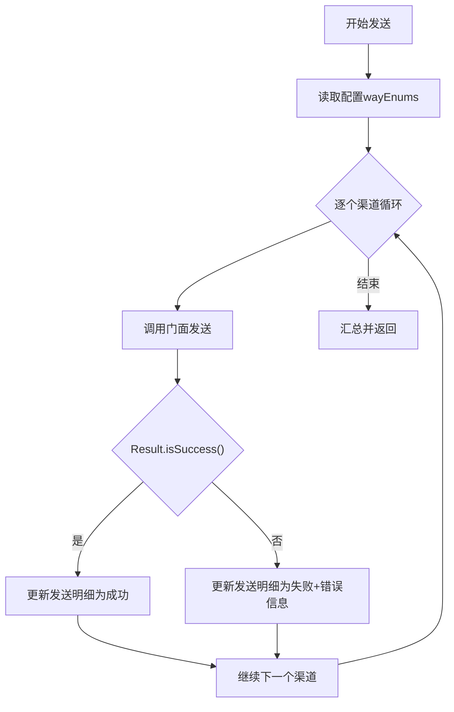
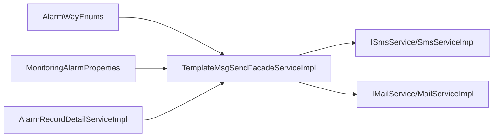

# 告警渠道扩展

<cite>
**本文引用的文件**
- [ISuperBean.java](file://phoenix-common/phoenix-common-core/src/main/java/com/gitee/pifeng/monitoring/common/inf/ISuperBean.java)
- [AbstractSuperBean.java](file://phoenix-common/phoenix-common-core/src/main/java/com/gitee/pifeng/monitoring/common/abs/AbstractSuperBean.java)
- [AlarmWayEnums.java](file://phoenix-common/phoenix-common-core/src/main/java/com/gitee/pifeng/monitoring/common/constant/alarm/AlarmWayEnums.java)
- [AlarmLevelEnums.java](file://phoenix-common/phoenix-common-core/src/main/java/com/gitee/pifeng/monitoring/common/constant/alarm/AlarmLevelEnums.java)
- [MonitoringAlarmProperties.java](file://phoenix-common/phoenix-common-core/src/main/java/com/gitee/pifeng/monitoring/common/property/server/MonitoringAlarmProperties.java)
- [MonitoringAlarmSmsProperties.java](file://phoenix-common/phoenix-common-core/src/main/java/com/gitee/pifeng/monitoring/common/property/server/MonitoringAlarmSmsProperties.java)
- [MonitoringAlarmMailProperties.java](file://phoenix-common/phoenix-common-core/src/main/java/com/gitee/pifeng/monitoring/common/property/server/MonitoringAlarmMailProperties.java)
- [Alarm.java](file://phoenix-common/phoenix-common-core/src/main/java/com/gitee/pifeng/monitoring/common/domain/Alarm.java)
- [AlarmPackage.java](file://phoenix-common/phoenix-common-core/src/main/java/com/gitee/pifeng/monitoring/common/dto/AlarmPackage.java)
- [IAlarmService.java（客户端）](file://phoenix-agent/src/main/java/com/gitee/pifeng/monitoring/agent/business/client/service/IAlarmService.java)
- [AlarmServiceImpl（客户端）](file://phoenix-agent/src/main/java/com/gitee/pifeng/monitoring/agent/business/client/service/impl/AlarmServiceImpl.java)
- [IAlarmService（服务端）](file://phoenix-server/src/main/java/com/gitee/pifeng/monitoring/server/business/server/service/IAlarmService.java)
- [AlarmServiceImpl（服务端）](file://phoenix-server/src/main/java/com/gitee/pifeng/monitoring/server/business/server/service/impl/AlarmServiceImpl.java)
- [ITemplateMsgSendFacadeService.java](file://phoenix-server/src/main/java/com/gitee/pifeng/monitoring/server/business/server/service/ITemplateMsgSendFacadeService.java)
- [TemplateMsgSendFacadeServiceImpl.java](file://phoenix-server/src/main/java/com/gitee/pifeng/monitoring/server/business/server/service/impl/TemplateMsgSendFacadeServiceImpl.java)
- [ISmsService.java](file://phoenix-server/src/main/java/com/gitee/pifeng/monitoring/server/business/server/service/ISmsService.java)
- [SmsServiceImpl.java](file://phoenix-server/src/main/java/com/gitee/pifeng/monitoring/server/business/server/service/impl/SmsServiceImpl.java)
- [IMailService.java](file://phoenix-server/src/main/java/com/gitee/pifeng/monitoring/server/business/server/service/IMailService.java)
- [MailServiceImpl.java](file://phoenix-server/src/main/java/com/gitee/pifeng/monitoring/server/business/server/service/impl/MailServiceImpl.java)
- [Sms.java](file://phoenix-server/src/main/java/com/gitee/pifeng/monitoring/server/business/server/domain/Sms.java)
- [Mail.java](file://phoenix-server/src/main/java/com/gitee/pifeng/monitoring/server/business/server/domain/Mail.java)
- [MonitoringSms.java](file://phoenix-server/src/main/java/com/gitee/pifeng/monitoring/server/business/server/domain/MonitoringSms.java)
- [AlarmRecordDetailServiceImpl.java](file://phoenix-server/src/main/java/com/gitee/pifeng/monitoring/server/business/server/service/impl/AlarmRecordDetailServiceImpl.java)
- [application.yml（服务端）](file://phoenix-server/src/main/resources/application.yml)
- [application.yml（UI）](file://phoenix-ui/src/main/resources/application.yml)
- [config.html](file://phoenix-ui/src/main/resources/templates/set/config.html)
</cite>

## 目录
1. [简介](#简介)
2. [项目结构](#项目结构)
3. [核心组件](#核心组件)
4. [架构总览](#架构总览)
5. [详细组件分析](#详细组件分析)
6. [依赖关系分析](#依赖关系分析)
7. [性能考虑](#性能考虑)
8. [故障排查指南](#故障排查指南)
9. [结论](#结论)
10. [附录](#附录)

## 简介
本指南面向希望为Phoenix监控系统扩展“告警渠道”的开发者，围绕以下目标展开：
- 如何实现新的告警渠道（以实现ISuperBean接口为起点）
- 如何在AlarmWayEnums中新增告警方式枚举
- 如何配置告警参数与渠道参数
- 如何编写告警发送逻辑并处理异常
- 如何在服务端注册与调度不同告警渠道
- 如何通过配置文件启用新渠道、设置参数、进行健康检查

本指南将结合代码级关系图与流程图，帮助你从零完成一个第三方告警渠道（如企业微信、钉钉、飞书）的集成。

## 项目结构
Phoenix的告警通道涉及三层：
- 客户端（Agent）：负责采集与打包告警，向服务端转发
- 服务端（Server）：接收告警包，解析后按配置选择渠道发送
- UI：提供配置页面，持久化告警配置

图表来源
- [IAlarmService.java（客户端）:1-28](file://phoenix-agent/src/main/java/com/gitee/pifeng/monitoring/agent/business/client/service/IAlarmService.java#L1-L28)
- [AlarmServiceImpl（客户端）:1-39](file://phoenix-agent/src/main/java/com/gitee/pifeng/monitoring/agent/business/client/service/impl/AlarmServiceImpl.java#L1-L39)
- [AlarmPackage.java](file://phoenix-common/phoenix-common-core/src/main/java/com/gitee/pifeng/monitoring/common/dto/AlarmPackage.java)
- [IAlarmService（服务端）](file://phoenix-server/src/main/java/com/gitee/pifeng/monitoring/server/business/server/service/IAlarmService.java)
- [AlarmServiceImpl（服务端）:22-82](file://phoenix-server/src/main/java/com/gitee/pifeng/monitoring/server/business/server/service/impl/AlarmServiceImpl.java#L22-L82)
- [ITemplateMsgSendFacadeService.java:1-34](file://phoenix-server/src/main/java/com/gitee/pifeng/monitoring/server/business/server/service/ITemplateMsgSendFacadeService.java#L1-L34)
- [TemplateMsgSendFacadeServiceImpl.java:1-86](file://phoenix-server/src/main/java/com/gitee/pifeng/monitoring/server/business/server/service/impl/TemplateMsgSendFacadeServiceImpl.java#L1-L86)
- [ISmsService.java:1-28](file://phoenix-server/src/main/java/com/gitee/pifeng/monitoring/server/business/server/service/ISmsService.java#L1-L28)
- [SmsServiceImpl.java:1-101](file://phoenix-server/src/main/java/com/gitee/pifeng/monitoring/server/business/server/service/impl/SmsServiceImpl.java#L1-L101)
- [IMailService.java:1-28](file://phoenix-server/src/main/java/com/gitee/pifeng/monitoring/server/business/server/service/IMailService.java#L1-L28)
- [MailServiceImpl.java:1-89](file://phoenix-server/src/main/java/com/gitee/pifeng/monitoring/server/business/server/service/impl/MailServiceImpl.java#L1-L89)
- [AlarmRecordDetailServiceImpl.java:168-198](file://phoenix-server/src/main/java/com/gitee/pifeng/monitoring/server/business/server/service/impl/AlarmRecordDetailServiceImpl.java#L168-L198)
- [ISuperBean.java:1-44](file://phoenix-common/phoenix-common-core/src/main/java/com/gitee/pifeng/monitoring/common/inf/ISuperBean.java#L1-L44)
- [AbstractSuperBean.java:1-14](file://phoenix-common/phoenix-common-core/src/main/java/com/gitee/pifeng/monitoring/common/abs/AbstractSuperBean.java#L1-L14)
- [AlarmWayEnums.java:1-94](file://phoenix-common/phoenix-common-core/src/main/java/com/gitee/pifeng/monitoring/common/constant/alarm/AlarmWayEnums.java#L1-L94)
- [MonitoringAlarmProperties.java:1-65](file://phoenix-common/phoenix-common-core/src/main/java/com/gitee/pifeng/monitoring/common/property/server/MonitoringAlarmProperties.java#L1-L65)
- [MonitoringAlarmSmsProperties.java:1-43](file://phoenix-common/phoenix-common-core/src/main/java/com/gitee/pifeng/monitoring/common/property/server/MonitoringAlarmSmsProperties.java#L1-L43)
- [MonitoringAlarmMailProperties.java:1-26](file://phoenix-common/phoenix-common-core/src/main/java/com/gitee/pifeng/monitoring/common/property/server/MonitoringAlarmMailProperties.java#L1-L26)
- [Alarm.java:1-42](file://phoenix-common/phoenix-common-core/src/main/java/com/gitee/pifeng/monitoring/common/domain/Alarm.java#L1-L42)

章节来源
- [IAlarmService.java（客户端）:1-28](file://phoenix-agent/src/main/java/com/gitee/pifeng/monitoring/agent/business/client/service/IAlarmService.java#L1-L28)
- [AlarmServiceImpl（客户端）:1-39](file://phoenix-agent/src/main/java/com/gitee/pifeng/monitoring/agent/business/client/service/impl/AlarmServiceImpl.java#L1-L39)
- [AlarmPackage.java](file://phoenix-common/phoenix-common-core/src/main/java/com/gitee/pifeng/monitoring/common/dto/AlarmPackage.java)
- [IAlarmService（服务端）](file://phoenix-server/src/main/java/com/gitee/pifeng/monitoring/server/business/server/service/IAlarmService.java)
- [AlarmServiceImpl（服务端）:22-82](file://phoenix-server/src/main/java/com/gitee/pifeng/monitoring/server/business/server/service/impl/AlarmServiceImpl.java#L22-L82)
- [ITemplateMsgSendFacadeService.java:1-34](file://phoenix-server/src/main/java/com/gitee/pifeng/monitoring/server/business/server/service/ITemplateMsgSendFacadeService.java#L1-L34)
- [TemplateMsgSendFacadeServiceImpl.java:1-86](file://phoenix-server/src/main/java/com/gitee/pifeng/monitoring/server/business/server/service/impl/TemplateMsgSendFacadeServiceImpl.java#L1-L86)
- [ISmsService.java:1-28](file://phoenix-server/src/main/java/com/gitee/pifeng/monitoring/server/business/server/service/ISmsService.java#L1-L28)
- [SmsServiceImpl.java:1-101](file://phoenix-server/src/main/java/com/gitee/pifeng/monitoring/server/business/server/service/impl/SmsServiceImpl.java#L1-L101)
- [IMailService.java:1-28](file://phoenix-server/src/main/java/com/gitee/pifeng/monitoring/server/business/server/service/IMailService.java#L1-L28)
- [MailServiceImpl.java:1-89](file://phoenix-server/src/main/java/com/gitee/pifeng/monitoring/server/business/server/service/impl/MailServiceImpl.java#L1-L89)
- [AlarmRecordDetailServiceImpl.java:168-198](file://phoenix-server/src/main/java/com/gitee/pifeng/monitoring/server/business/server/service/impl/AlarmRecordDetailServiceImpl.java#L168-L198)
- [ISuperBean.java:1-44](file://phoenix-common/phoenix-common-core/src/main/java/com/gitee/pifeng/monitoring/common/inf/ISuperBean.java#L1-L44)
- [AbstractSuperBean.java:1-14](file://phoenix-common/phoenix-common-core/src/main/java/com/gitee/pifeng/monitoring/common/abs/AbstractSuperBean.java#L1-L14)
- [AlarmWayEnums.java:1-94](file://phoenix-common/phoenix-common-core/src/main/java/com/gitee/pifeng/monitoring/common/constant/alarm/AlarmWayEnums.java#L1-L94)
- [MonitoringAlarmProperties.java:1-65](file://phoenix-common/phoenix-common-core/src/main/java/com/gitee/pifeng/monitoring/common/property/server/MonitoringAlarmProperties.java#L1-L65)
- [MonitoringAlarmSmsProperties.java:1-43](file://phoenix-common/phoenix-common-core/src/main/java/com/gitee/pifeng/monitoring/common/property/server/MonitoringAlarmSmsProperties.java#L1-L43)
- [MonitoringAlarmMailProperties.java:1-26](file://phoenix-common/phoenix-common-core/src/main/java/com/gitee/pifeng/monitoring/common/property/server/MonitoringAlarmMailProperties.java#L1-L26)
- [Alarm.java:1-42](file://phoenix-common/phoenix-common-core/src/main/java/com/gitee/pifeng/monitoring/common/domain/Alarm.java#L1-L42)

## 核心组件
- ISuperBean/AbstractSuperBean：定义统一的序列化能力与父类契约，所有告警相关领域对象均继承或实现该接口，确保可序列化与一致行为
- AlarmWayEnums：告警方式枚举（SMS、MAIL），提供字符串与枚举互转工具方法
- AlarmLevelEnums：告警级别比较与转换工具
- MonitoringAlarmProperties：告警配置聚合体，包含开关、级别、静默时段、渠道列表及各渠道参数
- Sms/Mail/MonitoringSms：短信/邮件/内部短信封装对象
- ITemplateMsgSendFacadeService + TemplateMsgSendFacadeServiceImpl：门面层，按告警方式路由到具体渠道
- ISmsService/SmsServiceImpl、IMailService/MailServiceImpl：短信与邮件发送实现
- AlarmRecordDetailServiceImpl：遍历配置的告警方式并调用门面发送，收集结果并落库

章节来源
- [ISuperBean.java:1-44](file://phoenix-common/phoenix-common-core/src/main/java/com/gitee/pifeng/monitoring/common/inf/ISuperBean.java#L1-L44)
- [AbstractSuperBean.java:1-14](file://phoenix-common/phoenix-common-core/src/main/java/com/gitee/pifeng/monitoring/common/abs/AbstractSuperBean.java#L1-L14)
- [AlarmWayEnums.java:1-94](file://phoenix-common/phoenix-common-core/src/main/java/com/gitee/pifeng/monitoring/common/constant/alarm/AlarmWayEnums.java#L1-L94)
- [AlarmLevelEnums.java:56-98](file://phoenix-common/phoenix-common-core/src/main/java/com/gitee/pifeng/monitoring/common/constant/alarm/AlarmLevelEnums.java#L56-L98)
- [MonitoringAlarmProperties.java:1-65](file://phoenix-common/phoenix-common-core/src/main/java/com/gitee/pifeng/monitoring/common/property/server/MonitoringAlarmProperties.java#L1-L65)
- [Sms.java:1-42](file://phoenix-server/src/main/java/com/gitee/pifeng/monitoring/server/business/server/domain/Sms.java#L1-L42)
- [Mail.java:1-42](file://phoenix-server/src/main/java/com/gitee/pifeng/monitoring/server/business/server/domain/Mail.java#L1-L42)
- [MonitoringSms.java:1-42](file://phoenix-server/src/main/java/com/gitee/pifeng/monitoring/server/business/server/domain/MonitoringSms.java#L1-L42)
- [ITemplateMsgSendFacadeService.java:1-34](file://phoenix-server/src/main/java/com/gitee/pifeng/monitoring/server/business/server/service/ITemplateMsgSendFacadeService.java#L1-L34)
- [TemplateMsgSendFacadeServiceImpl.java:1-86](file://phoenix-server/src/main/java/com/gitee/pifeng/monitoring/server/business/server/service/impl/TemplateMsgSendFacadeServiceImpl.java#L1-L86)
- [ISmsService.java:1-28](file://phoenix-server/src/main/java/com/gitee/pifeng/monitoring/server/business/server/service/ISmsService.java#L1-L28)
- [SmsServiceImpl.java:1-101](file://phoenix-server/src/main/java/com/gitee/pifeng/monitoring/server/business/server/service/impl/SmsServiceImpl.java#L1-L101)
- [IMailService.java:1-28](file://phoenix-server/src/main/java/com/gitee/pifeng/monitoring/server/business/server/service/IMailService.java#L1-L28)
- [MailServiceImpl.java:1-89](file://phoenix-server/src/main/java/com/gitee/pifeng/monitoring/server/business/server/service/impl/MailServiceImpl.java#L1-L89)
- [AlarmRecordDetailServiceImpl.java:168-198](file://phoenix-server/src/main/java/com/gitee/pifeng/monitoring/server/business/server/service/impl/AlarmRecordDetailServiceImpl.java#L168-L198)

## 架构总览
告警从客户端产生，经Agent打包后发送至服务端；服务端根据配置选择渠道并通过门面统一调度，最终由具体渠道实现发送，并记录发送结果。

图表来源
- [AlarmPackage.java](file://phoenix-common/phoenix-common-core/src/main/java/com/gitee/pifeng/monitoring/common/dto/AlarmPackage.java)
- [AlarmServiceImpl（服务端）:221-269](file://phoenix-server/src/main/java/com/gitee/pifeng/monitoring/server/business/server/service/impl/AlarmServiceImpl.java#L221-L269)
- [AlarmRecordDetailServiceImpl.java:168-198](file://phoenix-server/src/main/java/com/gitee/pifeng/monitoring/server/business/server/service/impl/AlarmRecordDetailServiceImpl.java#L168-L198)
- [TemplateMsgSendFacadeServiceImpl.java:57-83](file://phoenix-server/src/main/java/com/gitee/pifeng/monitoring/server/business/server/service/impl/TemplateMsgSendFacadeServiceImpl.java#L57-L83)
- [SmsServiceImpl.java:1-101](file://phoenix-server/src/main/java/com/gitee/pifeng/monitoring/server/business/server/service/impl/SmsServiceImpl.java#L1-L101)
- [MailServiceImpl.java:1-89](file://phoenix-server/src/main/java/com/gitee/pifeng/monitoring/server/business/server/service/impl/MailServiceImpl.java#L1-L89)

## 详细组件分析

### 组件一：告警方式枚举扩展（AlarmWayEnums）
- 新增方式：在AlarmWayEnums中添加新的枚举值（例如：ENTERPRISE_WECHAT、DING_TALK、FEISHU）
- 字符串互转：保持str2Enum、strs2Enums、enums2Strs的兼容性，确保配置文件与前端传参能正确映射
- 门面路由：在TemplateMsgSendFacadeServiceImpl的switch中增加对应分支，将AlarmWayEnums映射到具体渠道服务

图表来源
- [AlarmWayEnums.java:16-93](file://phoenix-common/phoenix-common-core/src/main/java/com/gitee/pifeng/monitoring/common/constant/alarm/AlarmWayEnums.java#L16-L93)
- [TemplateMsgSendFacadeServiceImpl.java:57-83](file://phoenix-server/src/main/java/com/gitee/pifeng/monitoring/server/business/server/service/impl/TemplateMsgSendFacadeServiceImpl.java#L57-L83)

章节来源
- [AlarmWayEnums.java:1-94](file://phoenix-common/phoenix-common-core/src/main/java/com/gitee/pifeng/monitoring/common/constant/alarm/AlarmWayEnums.java#L1-L94)
- [TemplateMsgSendFacadeServiceImpl.java:57-83](file://phoenix-server/src/main/java/com/gitee/pifeng/monitoring/server/business/server/service/impl/TemplateMsgSendFacadeServiceImpl.java#L57-L83)

### 组件二：告警配置属性扩展（MonitoringAlarmProperties）
- 在MonitoringAlarmProperties中新增渠道专属属性（如企业微信、钉钉、飞书的配置对象）
- 通过wayEnums控制启用哪些渠道
- 通过silenceEnable/silenceStartTime/silenceEndTime实现静默时段控制

图表来源
- [MonitoringAlarmProperties.java:23-65](file://phoenix-common/phoenix-common-core/src/main/java/com/gitee/pifeng/monitoring/common/property/server/MonitoringAlarmProperties.java#L23-L65)
- [MonitoringAlarmSmsProperties.java:21-43](file://phoenix-common/phoenix-common-core/src/main/java/com/gitee/pifeng/monitoring/common/property/server/MonitoringAlarmSmsProperties.java#L21-L43)
- [MonitoringAlarmMailProperties.java:19-26](file://phoenix-common/phoenix-common-core/src/main/java/com/gitee/pifeng/monitoring/common/property/server/MonitoringAlarmMailProperties.java#L19-L26)

章节来源
- [MonitoringAlarmProperties.java:1-65](file://phoenix-common/phoenix-common-core/src/main/java/com/gitee/pifeng/monitoring/common/property/server/MonitoringAlarmProperties.java#L1-L65)
- [MonitoringAlarmSmsProperties.java:1-43](file://phoenix-common/phoenix-common-core/src/main/java/com/gitee/pifeng/monitoring/common/property/server/MonitoringAlarmSmsProperties.java#L1-L43)
- [MonitoringAlarmMailProperties.java:1-26](file://phoenix-common/phoenix-common-core/src/main/java/com/gitee/pifeng/monitoring/common/property/server/MonitoringAlarmMailProperties.java#L1-L26)

### 组件三：门面与渠道实现（TemplateMsgSendFacadeServiceImpl + SmsServiceImpl/MailServiceImpl）
- 门面职责：根据AlarmWayEnums选择具体渠道服务，组装参数并调用
- SmsServiceImpl：读取配置中的手机号、接口地址、企业标识，拼装请求并调用RestTemplate发送
- MailServiceImpl：使用Thymeleaf模板渲染邮件正文，通过JavaMailSender发送

图表来源
- [TemplateMsgSendFacadeServiceImpl.java:57-83](file://phoenix-server/src/main/java/com/gitee/pifeng/monitoring/server/business/server/service/impl/TemplateMsgSendFacadeServiceImpl.java#L57-L83)
- [SmsServiceImpl.java:95-101](file://phoenix-server/src/main/java/com/gitee/pifeng/monitoring/server/business/server/service/impl/SmsServiceImpl.java#L95-L101)
- [MailServiceImpl.java:58-87](file://phoenix-server/src/main/java/com/gitee/pifeng/monitoring/server/business/server/service/impl/MailServiceImpl.java#L58-L87)

章节来源
- [TemplateMsgSendFacadeServiceImpl.java:1-86](file://phoenix-server/src/main/java/com/gitee/pifeng/monitoring/server/business/server/service/impl/TemplateMsgSendFacadeServiceImpl.java#L1-L86)
- [SmsServiceImpl.java:1-101](file://phoenix-server/src/main/java/com/gitee/pifeng/monitoring/server/business/server/service/impl/SmsServiceImpl.java#L1-L101)
- [MailServiceImpl.java:1-89](file://phoenix-server/src/main/java/com/gitee/pifeng/monitoring/server/business/server/service/impl/MailServiceImpl.java#L1-L89)

### 组件四：客户端与服务端交互（Agent -> Server）
- 客户端IAlarmService.dealAlarmPackage将AlarmPackage交给Agent内部处理器发送
- 服务端IAlarmService.sendAlarmPackage接收并转发到HTTP接口，再由AlarmServiceImpl处理

图表来源
- [IAlarmService.java（客户端）:14-26](file://phoenix-agent/src/main/java/com/gitee/pifeng/monitoring/agent/business/client/service/IAlarmService.java#L14-L26)
- [AlarmServiceImpl（客户端）:31-35](file://phoenix-agent/src/main/java/com/gitee/pifeng/monitoring/agent/business/client/service/impl/AlarmServiceImpl.java#L31-L35)
- [IAlarmService（服务端）](file://phoenix-server/src/main/java/com/gitee/pifeng/monitoring/server/business/server/service/IAlarmService.java)
- [AlarmServiceImpl（服务端）:46-54](file://phoenix-server/src/main/java/com/gitee/pifeng/monitoring/server/business/server/service/impl/AlarmServiceImpl.java#L46-L54)

章节来源
- [IAlarmService.java（客户端）:1-28](file://phoenix-agent/src/main/java/com/gitee/pifeng/monitoring/agent/business/client/service/IAlarmService.java#L1-L28)
- [AlarmServiceImpl（客户端）:1-39](file://phoenix-agent/src/main/java/com/gitee/pifeng/monitoring/agent/business/client/service/impl/AlarmServiceImpl.java#L1-L39)
- [IAlarmService（服务端）](file://phoenix-server/src/main/java/com/gitee/pifeng/monitoring/server/business/server/service/IAlarmService.java)
- [AlarmServiceImpl（服务端）:22-82](file://phoenix-server/src/main/java/com/gitee/pifeng/monitoring/server/business/server/service/impl/AlarmServiceImpl.java#L22-L82)

### 组件五：告警发送异常处理与落库
- AlarmRecordDetailServiceImpl遍历配置的AlarmWayEnums，逐个调用门面发送，并将结果写入发送明细表
- 异常捕获与错误信息包装在具体渠道实现中（如MailServiceImpl）

图表来源
- [AlarmRecordDetailServiceImpl.java:168-198](file://phoenix-server/src/main/java/com/gitee/pifeng/monitoring/server/business/server/service/impl/AlarmRecordDetailServiceImpl.java#L168-L198)
- [MailServiceImpl.java:83-86](file://phoenix-server/src/main/java/com/gitee/pifeng/monitoring/server/business/server/service/impl/MailServiceImpl.java#L83-L86)

章节来源
- [AlarmRecordDetailServiceImpl.java:168-198](file://phoenix-server/src/main/java/com/gitee/pifeng/monitoring/server/business/server/service/impl/AlarmRecordDetailServiceImpl.java#L168-L198)
- [MailServiceImpl.java:1-89](file://phoenix-server/src/main/java/com/gitee/pifeng/monitoring/server/business/server/service/impl/MailServiceImpl.java#L1-L89)

## 依赖关系分析
- 低耦合高内聚：门面层隔离了渠道差异，具体渠道实现仅依赖门面接口
- 配置驱动：AlarmWayEnums与MonitoringAlarmProperties决定发送路径与参数
- 可扩展性：新增渠道只需实现对应服务接口并在门面中注册

图表来源
- [AlarmWayEnums.java:16-93](file://phoenix-common/phoenix-common-core/src/main/java/com/gitee/pifeng/monitoring/common/constant/alarm/AlarmWayEnums.java#L16-L93)
- [TemplateMsgSendFacadeServiceImpl.java:57-83](file://phoenix-server/src/main/java/com/gitee/pifeng/monitoring/server/business/server/service/impl/TemplateMsgSendFacadeServiceImpl.java#L57-L83)
- [ISmsService.java:1-28](file://phoenix-server/src/main/java/com/gitee/pifeng/monitoring/server/business/server/service/ISmsService.java#L1-L28)
- [SmsServiceImpl.java:1-101](file://phoenix-server/src/main/java/com/gitee/pifeng/monitoring/server/business/server/service/impl/SmsServiceImpl.java#L1-L101)
- [IMailService.java:1-28](file://phoenix-server/src/main/java/com/gitee/pifeng/monitoring/server/business/server/service/IMailService.java#L1-L28)
- [MailServiceImpl.java:1-89](file://phoenix-server/src/main/java/com/gitee/pifeng/monitoring/server/business/server/service/impl/MailServiceImpl.java#L1-L89)
- [MonitoringAlarmProperties.java:23-65](file://phoenix-common/phoenix-common-core/src/main/java/com/gitee/pifeng/monitoring/common/property/server/MonitoringAlarmProperties.java#L23-L65)
- [AlarmRecordDetailServiceImpl.java:168-198](file://phoenix-server/src/main/java/com/gitee/pifeng/monitoring/server/business/server/service/impl/AlarmRecordDetailServiceImpl.java#L168-L198)

## 性能考虑
- 并发发送：AlarmRecordDetailServiceImpl对每个渠道独立发送，建议在渠道实现中复用连接池与线程池
- 静默时段：通过silenceEnable/silenceStartTime/silenceEndTime避免非工作时间打扰
- 级别过滤：AlarmLevelEnums提供快速比较，避免低级别告警占用带宽
- 日志与监控：短信/邮件发送异常需记录详细错误信息，便于定位

## 故障排查指南
- 邮件发送失败：检查MailServiceImpl中的异常捕获与日志输出，确认Thymeleaf模板是否存在、收件人配置是否正确
- 短信发送失败：检查SmsServiceImpl中的URL拼接、企业标识与手机号格式，确认RestTemplate超时与网络连通性
- 渠道未生效：确认MonitoringAlarmProperties中wayEnums是否包含新增渠道，以及配置文件是否正确加载
- 响应异常：查看AlarmServiceImpl（服务端）中的异常包装与返回

章节来源
- [MailServiceImpl.java:83-86](file://phoenix-server/src/main/java/com/gitee/pifeng/monitoring/server/business/server/service/impl/MailServiceImpl.java#L83-L86)
- [SmsServiceImpl.java:95-101](file://phoenix-server/src/main/java/com/gitee/pifeng/monitoring/server/business/server/service/impl/SmsServiceImpl.java#L95-L101)
- [AlarmServiceImpl（服务端）:221-269](file://phoenix-server/src/main/java/com/gitee/pifeng/monitoring/server/business/server/service/impl/AlarmServiceImpl.java#L221-L269)

## 结论
通过在AlarmWayEnums中新增枚举、在MonitoringAlarmProperties中配置参数、在门面中注册路由，并实现具体渠道服务，即可完成新告警渠道的无缝接入。该架构以配置驱动、门面解耦、异常可控为核心，既保证了扩展性，也兼顾了稳定性与可观测性。

## 附录

### 附录A：实现新告警渠道的步骤清单
- 在AlarmWayEnums中新增枚举值
- 在MonitoringAlarmProperties中新增渠道专属属性
- 实现渠道服务接口（如ISmsService/IMailService的扩展接口）
- 在TemplateMsgSendFacadeServiceImpl中增加分支路由
- 编写渠道实现类（如SmsServiceImpl/MailServiceImpl的扩展实现）
- 在配置文件中启用新渠道并填写参数
- 在UI页面或配置中心校验参数有效性
- 进行健康检查与回归测试

章节来源
- [AlarmWayEnums.java:1-94](file://phoenix-common/phoenix-common-core/src/main/java/com/gitee/pifeng/monitoring/common/constant/alarm/AlarmWayEnums.java#L1-L94)
- [MonitoringAlarmProperties.java:1-65](file://phoenix-common/phoenix-common-core/src/main/java/com/gitee/pifeng/monitoring/common/property/server/MonitoringAlarmProperties.java#L1-L65)
- [ITemplateMsgSendFacadeService.java:1-34](file://phoenix-server/src/main/java/com/gitee/pifeng/monitoring/server/business/server/service/ITemplateMsgSendFacadeService.java#L1-L34)
- [TemplateMsgSendFacadeServiceImpl.java:1-86](file://phoenix-server/src/main/java/com/gitee/pifeng/monitoring/server/business/server/service/impl/TemplateMsgSendFacadeServiceImpl.java#L1-L86)
- [ISmsService.java:1-28](file://phoenix-server/src/main/java/com/gitee/pifeng/monitoring/server/business/server/service/ISmsService.java#L1-L28)
- [IMailService.java:1-28](file://phoenix-server/src/main/java/com/gitee/pifeng/monitoring/server/business/server/service/IMailService.java#L1-L28)

### 附录B：第三方渠道集成要点（企业微信/钉钉/飞书）
- 企业微信：通常采用应用号/机器人Webhook，需在渠道实现中构造JSON并POST
- 钉钉：支持群机器人或微应用，注意签名/加签与消息格式
- 飞书：支持应用自建/机器人，需处理Token与消息卡片格式
- 参数配置：在MonitoringAlarmProperties中新增对应属性（如webhook地址、密钥、群ID等）
- 异常处理：统一捕获网络异常、HTTP状态码异常与业务错误码

章节来源
- [MonitoringAlarmProperties.java:1-65](file://phoenix-common/phoenix-common-core/src/main/java/com/gitee/pifeng/monitoring/common/property/server/MonitoringAlarmProperties.java#L1-L65)
- [TemplateMsgSendFacadeServiceImpl.java:57-83](file://phoenix-server/src/main/java/com/gitee/pifeng/monitoring/server/business/server/service/impl/TemplateMsgSendFacadeServiceImpl.java#L57-L83)

### 附录C：配置文件与UI启用新渠道
- 服务端配置文件：在application.yml中设置MonitoringAlarmProperties的enable、levelEnum、silence*、wayEnums及各渠道参数
- UI页面：在config.html中新增渠道参数输入项，提交后持久化到配置中心
- 加载验证：启动时由MonitoringConfigPropertiesLoader加载配置，确保参数合法

章节来源
- [application.yml（服务端）](file://phoenix-server/src/main/resources/application.yml)
- [application.yml（UI）](file://phoenix-ui/src/main/resources/application.yml)
- [config.html:146-160](file://phoenix-ui/src/main/resources/templates/set/config.html#L146-L160)