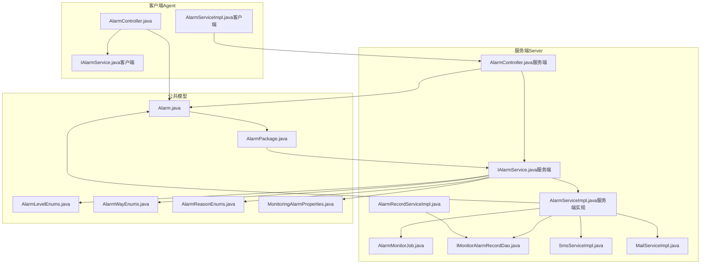
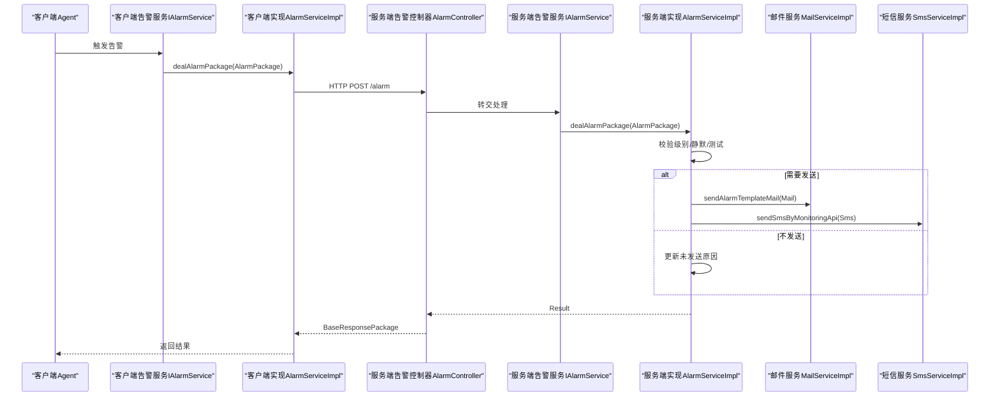
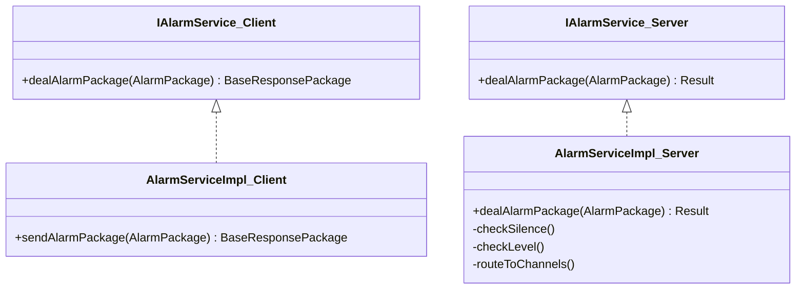
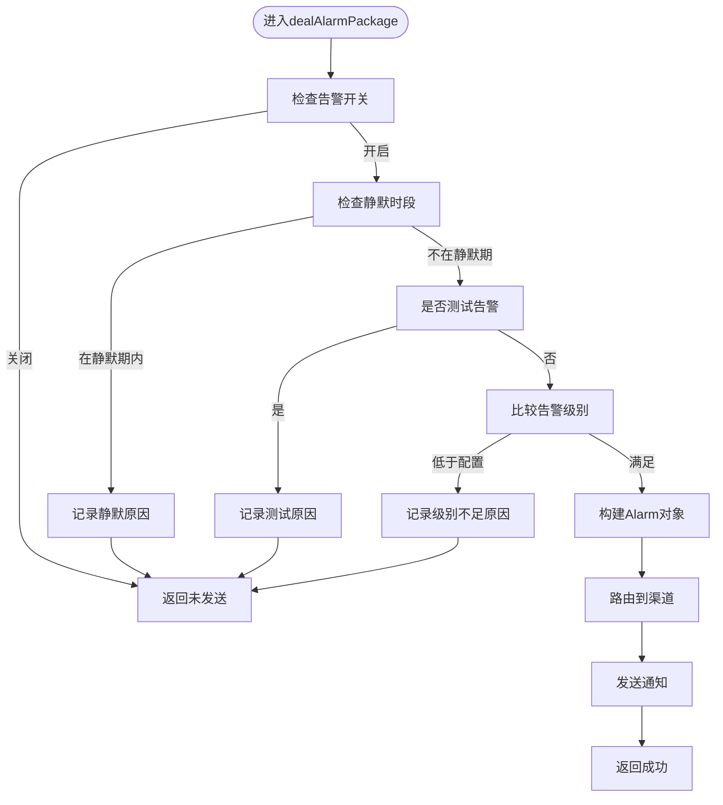
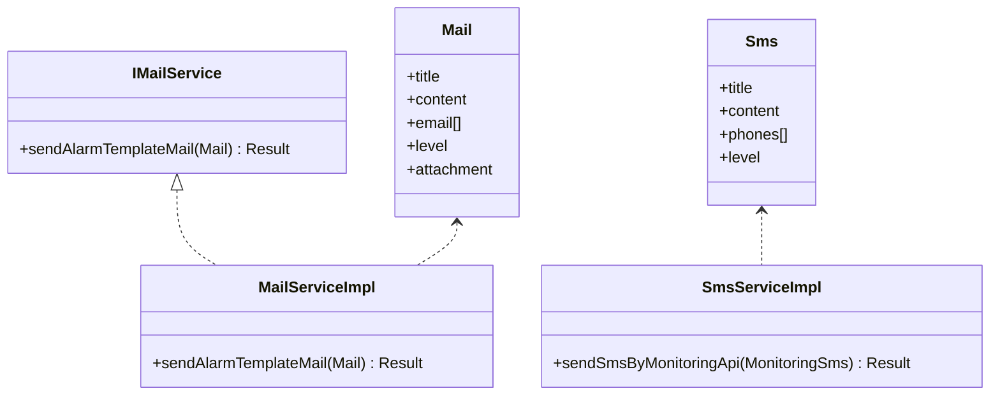
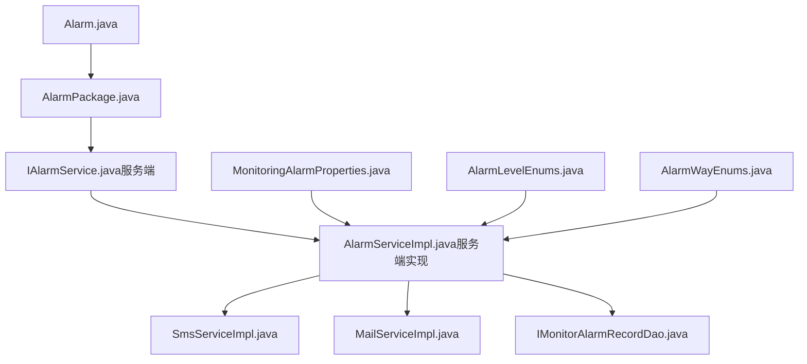

# 告警系统扩展

<cite>
**本文引用的文件**
- [Alarm.java](file://phoenix-common/phoenix-common-core/src/main/java/com/gitee/pifeng/monitoring/common/domain/Alarm.java)
- [AlarmPackage.java](file://phoenix-common/phoenix-common-core/src/main/java/com/gitee/pifeng/monitoring/common/dto/AlarmPackage.java)
- [AlarmLevelEnums.java](file://phoenix-common/phoenix-common-core/src/main/java/com/gitee/pifeng/monitoring/common/constant/alarm/AlarmLevelEnums.java)
- [AlarmWayEnums.java](file://phoenix-common/phoenix-common-core/src/main/java/com/gitee/pifeng/monitoring/common/constant/alarm/AlarmWayEnums.java)
- [AlarmReasonEnums.java](file://phoenix-common/phoenix-common-core/src/main/java/com/gitee/pifeng/monitoring/common/constant/alarm/AlarmReasonEnums.java)
- [MonitoringAlarmProperties.java](file://phoenix-common/phoenix-common-core/src/main/java/com/gitee/pifeng/monitoring/common/property/server/MonitoringAlarmProperties.java)
- [MonitoringAlarmSmsProperties.java](file://phoenix-common/phoenix-common-core/src/main/java/com/gitee/pifeng/monitoring/common/property/server/MonitoringAlarmSmsProperties.java)
- [IAlarmService.java（服务端）](file://phoenix-server/src/main/java/com/gitee/pifeng/monitoring/server/business/server/service/IAlarmService.java)
- [AlarmServiceImpl.java（服务端实现）](file://phoenix-server/src/main/java/com/gitee/pifeng/monitoring/server/business/server/service/impl/AlarmServiceImpl.java)
- [AlarmMonitorJob.java（服务端监控任务）](file://phoenix-server/src/main/java/com/gitee/pifeng/monitoring/server/business/server/monitor/AlarmMonitorJob.java)
- [IAlarmService.java（客户端）](file://phoenix-agent/src/main/java/com/gitee/pifeng/monitoring/agent/business/client/service/IAlarmService.java)
- [AlarmServiceImpl.java（客户端实现）](file://phoenix-agent/src/main/java/com/gitee/pifeng/monitoring/agent/business/server/service/impl/AlarmServiceImpl.java)
- [Mail.java（邮件实体）](file://phoenix-server/src/main/java/com/gitee/pifeng/monitoring/server/business/server/domain/Mail.java)
- [IMailService.java（邮件接口）](file://phoenix-server/src/main/java/com/gitee/pifeng/monitoring/server/business/server/service/IMailService.java)
- [MailServiceImpl.java（邮件实现）](file://phoenix-server/src/main/java/com/gitee/pifeng/monitoring/server/business/server/service/impl/MailServiceImpl.java)
- [Sms.java（短信实体）](file://phoenix-server/src/main/java/com/gitee/pifeng/monitoring/server/business/server/domain/Sms.java)
- [SmsServiceImpl.java（短信实现）](file://phoenix-server/src/main/java/com/gitee/pifeng/monitoring/server/business/server/service/impl/SmsServiceImpl.java)
- [IMonitorAlarmRecordDao.java（告警记录DAO）](file://phoenix-server/src/main/java/com/gitee/pifeng/monitoring/server/business/server/dao/IMonitorAlarmRecordDao.java)
- [AlarmRecordServiceImpl.java（告警记录服务）](file://phoenix-server/src/main/java/com/gitee/pifeng/monitoring/server/business/server/service/impl/AlarmRecordServiceImpl.java)
- [application.yml（服务端配置）](file://phoenix-server/src/main/resources/application.yml)
- [mail-alarm-template.html（邮件模板1）](file://phoenix-server/src/main/resources/templates/mail/mail-alarm-template.html)
- [mail-alarm-template2.html（邮件模板2）](file://phoenix-server/src/main/resources/templates/mail/mail-alarm-template2.html)
- [AlarmController.java（客户端控制器）](file://phoenix-agent/src/main/java/com/gitee/pifeng/monitoring/agent/business/client/controller/AlarmController.java)
- [AlarmController.java（服务端控制器）](file://phoenix-server/src/main/java/com/gitee/pifeng/monitoring/server/business/server/controller/AlarmController.java)
- [AlarmDefinitionServiceImpl.java（告警定义服务实现）](file://phoenix-server/src/main/java/com/gitee/pifeng/monitoring/server/business/server/service/impl/AlarmDefinitionServiceImpl.java)
- [IAlarmDefinitionService.java（告警定义服务接口）](file://phoenix-server/src/main/java/com/gitee/pifeng/monitoring/server/business/server/service/IAlarmDefinitionService.java)
- [IMonitorAlarmDefinitionDao.java（告警定义DAO）](file://phoenix-ui/src/main/java/com/gitee/pifeng/monitoring/ui/business/web/dao/IMonitorAlarmDefinitionDao.java)
- [MonitorAlarmRecord.java（告警记录实体-UI）](file://phoenix-ui/src/main/java/com/gitee/pifeng/monitoring/ui/business/web/entity/MonitorAlarmRecord.java)
- [config.html（UI配置页面-告警）](file://phoenix-ui/src/main/resources/templates/set/config.html)
- [alarm-record.html（UI告警记录页面）](file://phoenix-ui/src/main/resources/templates/alarm/alarm-record.html)
- [tagsinput-init.js（UI标签输入初始化）](file://phoenix-ui/src/main/resources/static/lib/jquery-tags-input/tagsinput-init.js)
- [phoenix.sql（数据库脚本）](file://doc/数据库设计/sql/mysql/phoenix.sql)
</cite>

## 目录
1. [简介](#简介)
2. [项目结构](#项目结构)
3. [核心组件](#核心组件)
4. [架构总览](#架构总览)
5. [详细组件分析](#详细组件分析)
6. [依赖分析](#依赖分析)
7. [性能考虑](#性能考虑)
8. [故障排查指南](#故障排查指南)
9. [结论](#结论)
10. [附录](#附录)

## 简介
本技术指南面向Phoenix监控系统的告警系统扩展开发，围绕“新增告警渠道”“自定义告警规则”“智能告警能力”“通知个性化配置”“性能优化策略”以及“完整扩展示例”六个维度，提供从需求分析到上线的全流程实践。读者将掌握如何在现有架构基础上，安全、稳定地扩展新的告警通道（如钉钉、飞书、Webhook、IM群聊等），并实现更强大的规则引擎、异常检测与趋势分析，同时优化告警的发送性能与用户体验。

## 项目结构
Phoenix告警体系由三部分组成：
- 客户端（Agent）：采集监控数据并触发告警，负责将告警封装为标准包并通过HTTP发送至服务端。
- 服务端（Server）：接收告警包，进行规则校验、状态跟踪、渠道路由与发送。
- UI（UI）：提供告警配置、记录查看、统计分析等功能。

图表来源
- [AlarmController.java（客户端）](file://phoenix-agent/src/main/java/com/gitee/pifeng/monitoring/agent/business/client/controller/AlarmController.java)
- [IAlarmService.java（客户端）](file://phoenix-agent/src/main/java/com/gitee/pifeng/monitoring/agent/business/client/service/IAlarmService.java)
- [AlarmServiceImpl.java（客户端实现）](file://phoenix-agent/src/main/java/com/gitee/pifeng/monitoring/agent/business/server/service/impl/AlarmServiceImpl.java)
- [AlarmController.java（服务端）](file://phoenix-server/src/main/java/com/gitee/pifeng/monitoring/server/business/server/controller/AlarmController.java)
- [IAlarmService.java（服务端）](file://phoenix-server/src/main/java/com/gitee/pifeng/monitoring/server/business/server/service/IAlarmService.java)
- [AlarmServiceImpl.java（服务端实现）](file://phoenix-server/src/main/java/com/gitee/pifeng/monitoring/server/business/server/service/impl/AlarmServiceImpl.java)
- [AlarmMonitorJob.java](file://phoenix-server/src/main/java/com/gitee/pifeng/monitoring/server/business/server/monitor/AlarmMonitorJob.java)
- [IMonitorAlarmRecordDao.java](file://phoenix-server/src/main/java/com/gitee/pifeng/monitoring/server/business/server/dao/IMonitorAlarmRecordDao.java)
- [AlarmRecordServiceImpl.java](file://phoenix-server/src/main/java/com/gitee/pifeng/monitoring/server/business/server/service/impl/AlarmRecordServiceImpl.java)
- [SmsServiceImpl.java](file://phoenix-server/src/main/java/com/gitee/pifeng/monitoring/server/business/server/service/impl/SmsServiceImpl.java)
- [MailServiceImpl.java](file://phoenix-server/src/main/java/com/gitee/pifeng/monitoring/server/business/server/service/impl/MailServiceImpl.java)
- [Alarm.java](file://phoenix-common/phoenix-common-core/src/main/java/com/gitee/pifeng/monitoring/common/domain/Alarm.java)
- [AlarmPackage.java](file://phoenix-common/phoenix-common-core/src/main/java/com/gitee/pifeng/monitoring/common/dto/AlarmPackage.java)
- [AlarmLevelEnums.java](file://phoenix-common/phoenix-common-core/src/main/java/com/gitee/pifeng/monitoring/common/constant/alarm/AlarmLevelEnums.java)
- [AlarmWayEnums.java](file://phoenix-common/phoenix-common-core/src/main/java/com/gitee/pifeng/monitoring/common/constant/alarm/AlarmWayEnums.java)
- [AlarmReasonEnums.java](file://phoenix-common/phoenix-common-core/src/main/java/com/gitee/pifeng/monitoring/common/constant/alarm/AlarmReasonEnums.java)
- [MonitoringAlarmProperties.java](file://phoenix-common/phoenix-common-core/src/main/java/com/gitee/pifeng/monitoring/common/property/server/MonitoringAlarmProperties.java)

章节来源
- [AlarmController.java（客户端）](file://phoenix-agent/src/main/java/com/gitee/pifeng/monitoring/agent/business/client/controller/AlarmController.java)
- [AlarmController.java（服务端）](file://phoenix-server/src/main/java/com/gitee/pifeng/monitoring/server/business/server/controller/AlarmController.java)
- [Alarm.java](file://phoenix-common/phoenix-common-core/src/main/java/com/gitee/pifeng/monitoring/common/domain/Alarm.java)
- [AlarmPackage.java](file://phoenix-common/phoenix-common-core/src/main/java/com/gitee/pifeng/monitoring/common/dto/AlarmPackage.java)

## 核心组件
- 告警领域模型
  - Alarm：告警实体，包含级别、原因、类型、标题、内容、编码、字符集、是否测试、是否忽略静默等字段。
  - AlarmPackage：传输载体，封装Alarm对象。
  - 枚举：AlarmLevelEnums（级别）、AlarmWayEnums（渠道）、AlarmReasonEnums（原因）。
- 服务接口与实现
  - IAlarmService：服务端告警处理接口。
  - AlarmServiceImpl：服务端告警处理实现，负责规则校验、静默过滤、级别判定、渠道路由与发送。
  - IAlarmService（客户端）与 AlarmServiceImpl（客户端）：负责将告警包封装并通过HTTP发送至服务端。
- 通知渠道
  - 邮件：Mail、IMailService、MailServiceImpl，使用Thymeleaf模板渲染。
  - 短信：Sms、SmsServiceImpl，调用外部短信接口。
- 配置与持久化
  - MonitoringAlarmProperties/MonitoringAlarmSmsProperties：服务端告警配置（开关、级别、静默、渠道参数）。
  - IMonitorAlarmRecordDao/AlarmRecordServiceImpl：告警记录DAO与服务，支持静默告警计数与未发送原因更新。
  - 数据库：MONITOR_ALARM_RECORD、MONITOR_ALARM_RECORD_DETAIL等表，记录告警发送状态与原因。

章节来源
- [Alarm.java:1-117](file://phoenix-common/phoenix-common-core/src/main/java/com/gitee/pifeng/monitoring/common/domain/Alarm.java#L1-117)
- [AlarmPackage.java:1-29](file://phoenix-common/phoenix-common-core/src/main/java/com/gitee/pifeng/monitoring/common/dto/AlarmPackage.java#L1-29)
- [AlarmLevelEnums.java:1-118](file://phoenix-common/phoenix-common-core/src/main/java/com/gitee/pifeng/monitoring/common/constant/alarm/AlarmLevelEnums.java#L1-118)
- [AlarmWayEnums.java:1-94](file://phoenix-common/phoenix-common-core/src/main/java/com/gitee/pifeng/monitoring/common/constant/alarm/AlarmWayEnums.java#L1-94)
- [AlarmReasonEnums.java:1-33](file://phoenix-common/phoenix-common-core/src/main/java/com/gitee/pifeng/monitoring/common/constant/alarm/AlarmReasonEnums.java#L1-33)
- [MonitoringAlarmProperties.java:1-65](file://phoenix-common/phoenix-common-core/src/main/java/com/gitee/pifeng/monitoring/common/property/server/MonitoringAlarmProperties.java#L1-65)
- [MonitoringAlarmSmsProperties.java:1-43](file://phoenix-common/phoenix-common-core/src/main/java/com/gitee/pifeng/monitoring/common/property/server/MonitoringAlarmSmsProperties.java#L1-43)
- [IAlarmService.java（服务端）:1-28](file://phoenix-server/src/main/java/com/gitee/pifeng/monitoring/server/business/server/service/IAlarmService.java#L1-28)
- [AlarmServiceImpl.java（服务端实现）:221-269](file://phoenix-server/src/main/java/com/gitee/pifeng/monitoring/server/business/server/service/impl/AlarmServiceImpl.java#L221-269)
- [IAlarmService.java（客户端）:1-29](file://phoenix-agent/src/main/java/com/gitee/pifeng/monitoring/agent/business/client/service/IAlarmService.java#L1-29)
- [AlarmServiceImpl.java（客户端实现）:42-56](file://phoenix-agent/src/main/java/com/gitee/pifeng/monitoring/agent/business/server/service/impl/AlarmServiceImpl.java#L42-56)
- [Mail.java:1-49](file://phoenix-server/src/main/java/com/gitee/pifeng/monitoring/server/business/server/domain/Mail.java#L1-49)
- [IMailService.java:1-28](file://phoenix-server/src/main/java/com/gitee/pifeng/monitoring/server/business/server/service/IMailService.java#L1-28)
- [MailServiceImpl.java:1-89](file://phoenix-server/src/main/java/com/gitee/pifeng/monitoring/server/business/server/service/impl/MailServiceImpl.java#L1-89)
- [Sms.java:1-42](file://phoenix-server/src/main/java/com/gitee/pifeng/monitoring/server/business/server/domain/Sms.java#L1-42)
- [SmsServiceImpl.java:72-101](file://phoenix-server/src/main/java/com/gitee/pifeng/monitoring/server/business/server/service/impl/SmsServiceImpl.java#L72-101)
- [IMonitorAlarmRecordDao.java:1-32](file://phoenix-server/src/main/java/com/gitee/pifeng/monitoring/server/business/server/dao/IMonitorAlarmRecordDao.java#L1-32)
- [AlarmRecordServiceImpl.java:88-119](file://phoenix-server/src/main/java/com/gitee/pifeng/monitoring/server/business/server/service/impl/AlarmRecordServiceImpl.java#L88-119)

## 架构总览
告警从客户端产生，经由HTTP传输到服务端，服务端进行规则校验与状态跟踪，再按配置路由到各通知渠道。

图表来源
- [AlarmController.java（客户端）](file://phoenix-agent/src/main/java/com/gitee/pifeng/monitoring/agent/business/client/controller/AlarmController.java)
- [IAlarmService.java（客户端）:1-29](file://phoenix-agent/src/main/java/com/gitee/pifeng/monitoring/agent/business/client/service/IAlarmService.java#L1-29)
- [AlarmServiceImpl.java（客户端实现）:42-56](file://phoenix-agent/src/main/java/com/gitee/pifeng/monitoring/agent/business/server/service/impl/AlarmServiceImpl.java#L42-56)
- [AlarmController.java（服务端）](file://phoenix-server/src/main/java/com/gitee/pifeng/monitoring/server/business/server/controller/AlarmController.java)
- [IAlarmService.java（服务端）:1-28](file://phoenix-server/src/main/java/com/gitee/pifeng/monitoring/server/business/server/service/IAlarmService.java#L1-28)
- [AlarmServiceImpl.java（服务端实现）:221-269](file://phoenix-server/src/main/java/com/gitee/pifeng/monitoring/server/business/server/service/impl/AlarmServiceImpl.java#L221-269)
- [MailServiceImpl.java:58-88](file://phoenix-server/src/main/java/com/gitee/pifeng/monitoring/server/business/server/service/impl/MailServiceImpl.java#L58-88)
- [SmsServiceImpl.java:95-101](file://phoenix-server/src/main/java/com/gitee/pifeng/monitoring/server/business/server/service/impl/SmsServiceImpl.java#L95-101)

## 详细组件分析

### 组件A：告警接口与发送流程
- 客户端
  - IAlarmService（客户端）定义告警处理入口。
  - AlarmServiceImpl（客户端）负责在发送前追加链路信息，再通过HTTP发送至服务端。
- 服务端
  - IAlarmService（服务端）定义统一处理入口。
  - AlarmServiceImpl（服务端）负责规则校验（静默、测试、级别）、构造告警包、路由到渠道并记录状态。

图表来源
- [IAlarmService.java（客户端）:1-29](file://phoenix-agent/src/main/java/com/gitee/pifeng/monitoring/agent/business/client/service/IAlarmService.java#L1-29)
- [AlarmServiceImpl.java（客户端实现）:42-56](file://phoenix-agent/src/main/java/com/gitee/pifeng/monitoring/agent/business/server/service/impl/AlarmServiceImpl.java#L42-56)
- [IAlarmService.java（服务端）:1-28](file://phoenix-server/src/main/java/com/gitee/pifeng/monitoring/server/business/server/service/IAlarmService.java#L1-28)
- [AlarmServiceImpl.java（服务端实现）:221-269](file://phoenix-server/src/main/java/com/gitee/pifeng/monitoring/server/business/server/service/impl/AlarmServiceImpl.java#L221-269)

章节来源
- [IAlarmService.java（客户端）:1-29](file://phoenix-agent/src/main/java/com/gitee/pifeng/monitoring/agent/business/client/service/IAlarmService.java#L1-29)
- [AlarmServiceImpl.java（客户端实现）:42-56](file://phoenix-agent/src/main/java/com/gitee/pifeng/monitoring/agent/business/server/service/impl/AlarmServiceImpl.java#L42-56)
- [IAlarmService.java（服务端）:1-28](file://phoenix-server/src/main/java/com/gitee/pifeng/monitoring/server/business/server/service/IAlarmService.java#L1-28)
- [AlarmServiceImpl.java（服务端实现）:221-269](file://phoenix-server/src/main/java/com/gitee/pifeng/monitoring/server/business/server/service/impl/AlarmServiceImpl.java#L221-269)

### 组件B：告警规则与状态跟踪
- 规则引擎
  - 级别判定：AlarmLevelEnums提供isAlarm比较逻辑，确保仅发送不低于配置级别的告警。
  - 静默时段：根据MonitoringAlarmProperties的silenceEnable/silenceStartTime/silenceEndTime进行过滤。
  - 测试告警：isTest为true时直接跳过发送。
- 状态跟踪
  - AlarmRecordServiceImpl根据告警编码更新未发送原因（如静默时段、级别不足、标题为空等）。
  - IMonitorAlarmRecordDao提供静默告警计数查询，便于统计与报表。

图表来源
- [AlarmServiceImpl.java（服务端实现）:221-269](file://phoenix-server/src/main/java/com/gitee/pifeng/monitoring/server/business/server/service/impl/AlarmServiceImpl.java#L221-269)
- [AlarmRecordServiceImpl.java:88-119](file://phoenix-server/src/main/java/com/gitee/pifeng/monitoring/server/business/server/service/impl/AlarmRecordServiceImpl.java#L88-119)
- [IMonitorAlarmRecordDao.java:19-30](file://phoenix-server/src/main/java/com/gitee/pifeng/monitoring/server/business/server/dao/IMonitorAlarmRecordDao.java#L19-30)
- [MonitoringAlarmProperties.java:25-48](file://phoenix-common/phoenix-common-core/src/main/java/com/gitee/pifeng/monitoring/common/property/server/MonitoringAlarmProperties.java#L25-48)
- [AlarmLevelEnums.java:41-81](file://phoenix-common/phoenix-common-core/src/main/java/com/gitee/pifeng/monitoring/common/constant/alarm/AlarmLevelEnums.java#L41-81)

章节来源
- [AlarmServiceImpl.java（服务端实现）:221-269](file://phoenix-server/src/main/java/com/gitee/pifeng/monitoring/server/business/server/service/impl/AlarmServiceImpl.java#L221-269)
- [AlarmRecordServiceImpl.java:88-119](file://phoenix-server/src/main/java/com/gitee/pifeng/monitoring/server/business/server/service/impl/AlarmRecordServiceImpl.java#L88-119)
- [MonitoringAlarmProperties.java:25-48](file://phoenix-common/phoenix-common-core/src/main/java/com/gitee/pifeng/monitoring/common/property/server/MonitoringAlarmProperties.java#L25-48)
- [AlarmLevelEnums.java:41-81](file://phoenix-common/phoenix-common-core/src/main/java/com/gitee/pifeng/monitoring/common/constant/alarm/AlarmLevelEnums.java#L41-81)

### 组件C：通知渠道（邮件与短信）
- 邮件
  - MailServiceImpl使用Thymeleaf模板渲染HTML邮件，支持附件变量注入。
  - 模板：mail-alarm-template.html、mail-alarm-template2.html。
- 短信
  - SmsServiceImpl拼装MonitoringSms对象，调用配置的短信接口地址发送。

图表来源
- [Mail.java:1-49](file://phoenix-server/src/main/java/com/gitee/pifeng/monitoring/server/business/server/domain/Mail.java#L1-49)
- [IMailService.java:1-28](file://phoenix-server/src/main/java/com/gitee/pifeng/monitoring/server/business/server/service/IMailService.java#L1-28)
- [MailServiceImpl.java:58-88](file://phoenix-server/src/main/java/com/gitee/pifeng/monitoring/server/business/server/service/impl/MailServiceImpl.java#L58-88)
- [Sms.java:1-42](file://phoenix-server/src/main/java/com/gitee/pifeng/monitoring/server/business/server/domain/Sms.java#L1-42)
- [SmsServiceImpl.java:72-101](file://phoenix-server/src/main/java/com/gitee/pifeng/monitoring/server/business/server/service/impl/SmsServiceImpl.java#L72-101)

章节来源
- [MailServiceImpl.java:58-88](file://phoenix-server/src/main/java/com/gitee/pifeng/monitoring/server/business/server/service/impl/MailServiceImpl.java#L58-88)
- [SmsServiceImpl.java:72-101](file://phoenix-server/src/main/java/com/gitee/pifeng/monitoring/server/business/server/service/impl/SmsServiceImpl.java#L72-101)
- [mail-alarm-template.html:1-33](file://phoenix-server/src/main/resources/templates/mail/mail-alarm-template.html#L1-33)
- [mail-alarm-template2.html:1-13](file://phoenix-server/src/main/resources/templates/mail/mail-alarm-template2.html#L1-13)

### 组件D：告警定义与UI配置
- 告警定义
  - IAlarmDefinitionService/AlarmDefinitionServiceImpl：基于MyBatis-Plus的通用服务，支持按编码查询级别、标题、内容等。
- UI配置
  - config.html：提供告警静默、级别、短信接口地址、协议、企业等配置项。
  - alarm-record.html：展示告警类型、级别、方式等，并做中文化处理。
  - tagsinput-init.js：支持收件人邮箱、短信号码的多值输入与分隔符配置。

章节来源
- [IAlarmDefinitionService.java:1-15](file://phoenix-server/src/main/java/com/gitee/pifeng/monitoring/server/business/server/service/IAlarmDefinitionService.java#L1-15)
- [AlarmDefinitionServiceImpl.java:1-19](file://phoenix-server/src/main/java/com/gitee/pifeng/monitoring/server/business/server/service/impl/AlarmDefinitionServiceImpl.java#L1-19)
- [config.html:59-115](file://phoenix-ui/src/main/resources/templates/set/config.html#L59-115)
- [config.html:100-177](file://phoenix-ui/src/main/resources/templates/set/config.html#L100-177)
- [alarm-record.html:225-260](file://phoenix-ui/src/main/resources/templates/alarm/alarm-record.html#L225-260)
- [tagsinput-init.js:1-19](file://phoenix-ui/src/main/resources/static/lib/jquery-tags-input/tagsinput-init.js#L1-19)

## 依赖分析
- 组件内聚与耦合
  - Alarm/AlarmPackage作为跨模块共享的数据载体，耦合度低，便于扩展新渠道。
  - 服务端AlarmServiceImpl对规则与渠道实现强依赖，可通过接口抽象进一步解耦。
- 外部依赖
  - Thymeleaf模板引擎用于邮件渲染。
  - Spring Mail用于邮件发送。
  - RestTemplate用于短信接口调用。
  - MyBatis-Plus用于告警记录持久化。
- 循环依赖
  - 当前未发现循环依赖；若新增渠道，建议通过接口隔离避免循环。

图表来源
- [Alarm.java:1-117](file://phoenix-common/phoenix-common-core/src/main/java/com/gitee/pifeng/monitoring/common/domain/Alarm.java#L1-117)
- [AlarmPackage.java:1-29](file://phoenix-common/phoenix-common-core/src/main/java/com/gitee/pifeng/monitoring/common/dto/AlarmPackage.java#L1-29)
- [IAlarmService.java（服务端）:1-28](file://phoenix-server/src/main/java/com/gitee/pifeng/monitoring/server/business/server/service/IAlarmService.java#L1-28)
- [AlarmServiceImpl.java（服务端实现）:221-269](file://phoenix-server/src/main/java/com/gitee/pifeng/monitoring/server/business/server/service/impl/AlarmServiceImpl.java#L221-269)
- [SmsServiceImpl.java:72-101](file://phoenix-server/src/main/java/com/gitee/pifeng/monitoring/server/business/server/service/impl/SmsServiceImpl.java#L72-101)
- [MailServiceImpl.java:58-88](file://phoenix-server/src/main/java/com/gitee/pifeng/monitoring/server/business/server/service/impl/MailServiceImpl.java#L58-88)
- [IMonitorAlarmRecordDao.java:1-32](file://phoenix-server/src/main/java/com/gitee/pifeng/monitoring/server/business/server/dao/IMonitorAlarmRecordDao.java#L1-32)
- [MonitoringAlarmProperties.java:1-65](file://phoenix-common/phoenix-common-core/src/main/java/com/gitee/pifeng/monitoring/common/property/server/MonitoringAlarmProperties.java#L1-65)
- [AlarmLevelEnums.java:1-118](file://phoenix-common/phoenix-common-core/src/main/java/com/gitee/pifeng/monitoring/common/constant/alarm/AlarmLevelEnums.java#L1-118)
- [AlarmWayEnums.java:1-94](file://phoenix-common/phoenix-common-core/src/main/java/com/gitee/pifeng/monitoring/common/constant/alarm/AlarmWayEnums.java#L1-94)

## 性能考虑
- 告警聚合与去重
  - 对相同告警编码在静默期内进行聚合，避免重复发送；通过AlarmRecordServiceImpl按code更新未发送原因。
- 批量发送
  - 可在SmsServiceImpl/MailServiceImpl中引入队列或批处理策略，减少频繁HTTP调用。
- 异步处理
  - 使用线程池或消息中间件异步发送通知，降低阻塞风险。
- 缓存机制
  - application.yml中配置Caffeine缓存，可用于缓存告警定义、渠道参数等热点数据。
- 并发与限流
  - 通过线程池大小、RestTemplate超时、Quartz并发配置等手段保障稳定性。

章节来源
- [AlarmRecordServiceImpl.java:88-119](file://phoenix-server/src/main/java/com/gitee/pifeng/monitoring/server/business/server/service/impl/AlarmRecordServiceImpl.java#L88-119)
- [application.yml:39-43](file://phoenix-server/src/main/resources/application.yml#L39-43)
- [SmsServiceImpl.java:95-101](file://phoenix-server/src/main/java/com/gitee/pifeng/monitoring/server/business/server/service/impl/SmsServiceImpl.java#L95-101)
- [MailServiceImpl.java:58-88](file://phoenix-server/src/main/java/com/gitee/pifeng/monitoring/server/business/server/service/impl/MailServiceImpl.java#L58-88)

## 故障排查指南
- 常见问题定位
  - 未发送告警：检查MonitoringAlarmProperties的enable、levelEnum、silenceEnable、silenceStartTime/End。
  - 邮件发送失败：检查Thymeleaf模板路径、Spring Mail配置、收件人邮箱格式。
  - 短信发送失败：检查短信接口地址、协议、企业标识、手机号格式。
- 日志与追踪
  - application.yml中已配置日志级别与Thymeleaf模板路径，便于定位模板渲染问题。
- 数据一致性
  - 通过IMonitorAlarmRecordDao的静默告警计数与AlarmRecordServiceImpl的未发送原因更新，核对数据库记录。

章节来源
- [application.yml:24-31](file://phoenix-server/src/main/resources/application.yml#L24-31)
- [MailServiceImpl.java:58-88](file://phoenix-server/src/main/java/com/gitee/pifeng/monitoring/server/business/server/service/impl/MailServiceImpl.java#L58-88)
- [SmsServiceImpl.java:95-101](file://phoenix-server/src/main/java/com/gitee/pifeng/monitoring/server/business/server/service/impl/SmsServiceImpl.java#L95-101)
- [IMonitorAlarmRecordDao.java:19-30](file://phoenix-server/src/main/java/com/gitee/pifeng/monitoring/server/business/server/dao/IMonitorAlarmRecordDao.java#L19-30)
- [AlarmRecordServiceImpl.java:88-119](file://phoenix-server/src/main/java/com/gitee/pifeng/monitoring/server/business/server/service/impl/AlarmRecordServiceImpl.java#L88-119)

## 结论
Phoenix告警系统以清晰的领域模型与职责分离为基础，提供了稳定的邮件与短信通知能力。通过本文档的扩展指南，开发者可在不破坏现有架构的前提下，快速接入新的告警渠道、完善规则引擎、增强智能告警能力，并持续优化性能与用户体验。

## 附录

### 新增告警渠道（以Webhook为例）的完整流程
- 设计阶段
  - 定义Webhook通知实体（如Webhook.java），包含URL、Headers、Body模板等字段。
  - 在AlarmWayEnums中新增WEBHOOK枚举。
  - 在MonitoringAlarmProperties中新增Webhook配置属性。
- 实现阶段
  - 新增IWebhookService接口与WebhookServiceImpl实现，负责序列化告警内容并发起HTTP请求。
  - 在AlarmServiceImpl中增加对WEBHOOK的路由分支。
  - 在UI配置页面（config.html）新增Webhook相关配置项。
- 测试与验证
  - 使用Mock Webhook服务验证请求格式与响应。
  - 通过AlarmController与AlarmServiceImpl联调，确保规则与发送流程正确。
- 上线与运维
  - 更新数据库脚本（如需新增表或字段），并在phoenix.sql中补充。
  - 配置灰度发布与回滚策略，监控发送成功率与失败原因。

章节来源
- [AlarmWayEnums.java:16-26](file://phoenix-common/phoenix-common-core/src/main/java/com/gitee/pifeng/monitoring/common/constant/alarm/AlarmWayEnums.java#L16-26)
- [MonitoringAlarmProperties.java:50-65](file://phoenix-common/phoenix-common-core/src/main/java/com/gitee/pifeng/monitoring/common/property/server/MonitoringAlarmProperties.java#L50-65)
- [AlarmServiceImpl.java（服务端实现）:221-269](file://phoenix-server/src/main/java/com/gitee/pifeng/monitoring/server/business/server/service/impl/AlarmServiceImpl.java#L221-269)
- [config.html:59-115](file://phoenix-ui/src/main/resources/templates/set/config.html#L59-115)
- [phoenix.sql:76-89](file://doc/数据库设计/sql/mysql/phoenix.sql#L76-89)