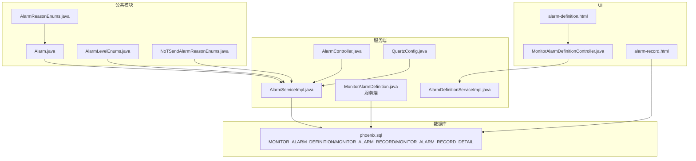
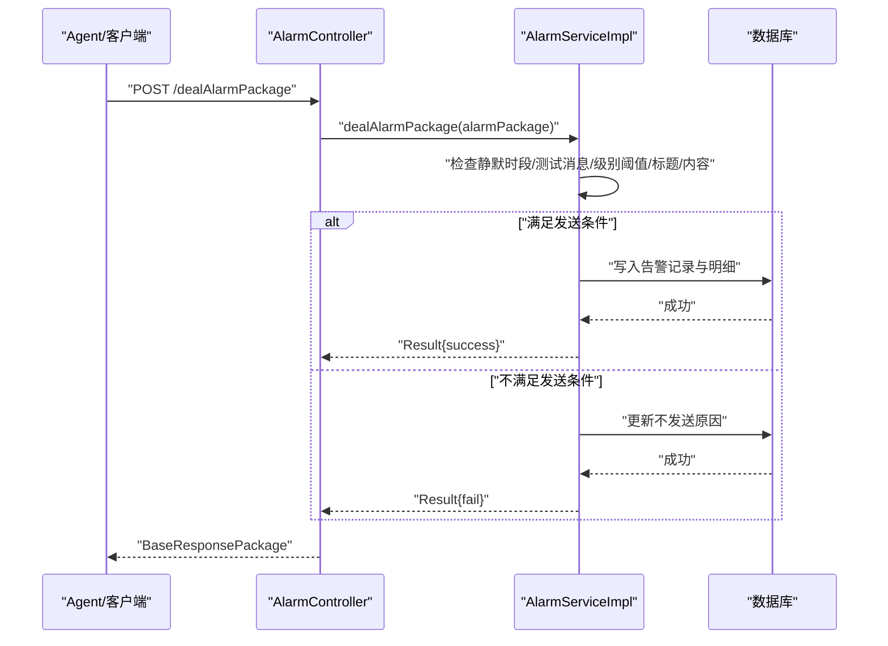
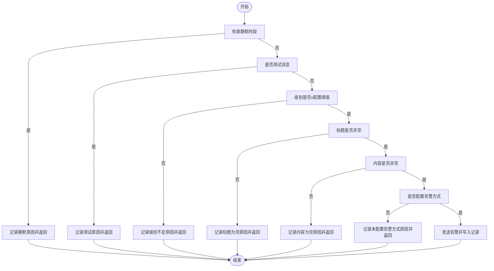
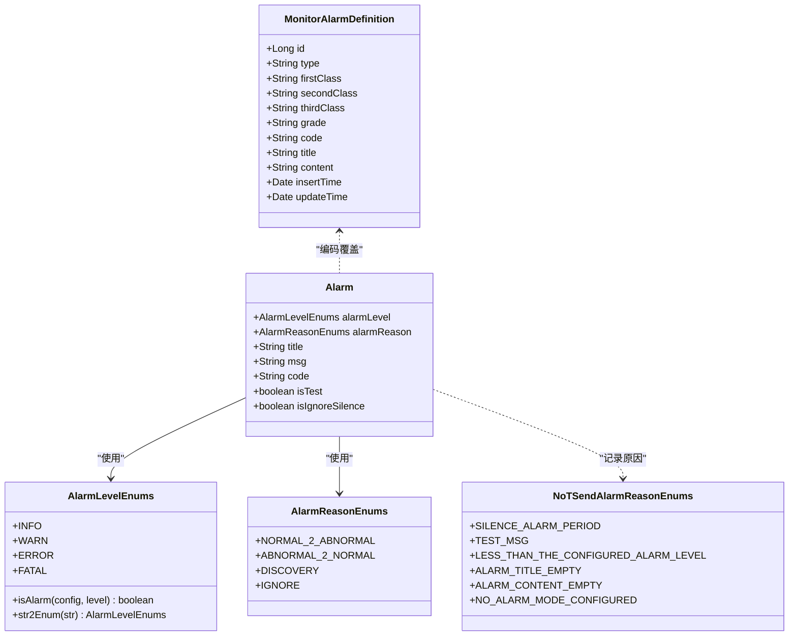
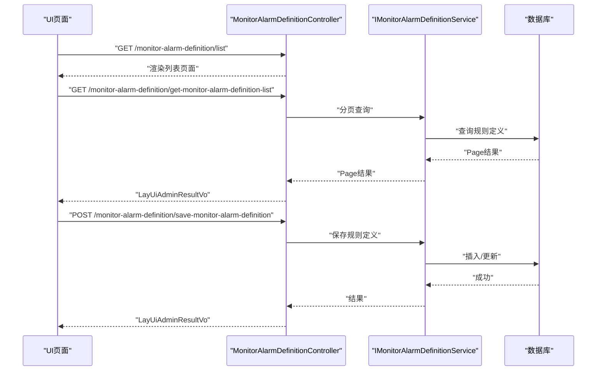
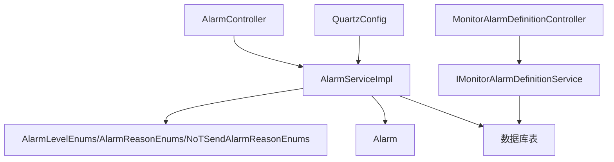

# 告警规则定制

<cite>
**本文引用的文件**
- [Alarm.java](file://phoenix-common\phoenix-common-core\src\main\java\com\gitee\pifeng\monitoring\common\domain\Alarm.java)
- [AlarmReasonEnums.java](file://phoenix-common\phoenix-common-core\src\main\java\com\gitee\pifeng\monitoring\common\constant\alarm\AlarmReasonEnums.java)
- [AlarmLevelEnums.java](file://phoenix-common\phoenix-common-core\src\main\java\com\gitee\pifeng\monitoring\common\constant\alarm\AlarmLevelEnums.java)
- [NoTSendAlarmReasonEnums.java](file://phoenix-common\phoenix-common-core\src\main\java\com\gitee\pifeng\monitoring\common\constant\alarm\NoTSendAlarmReasonEnums.java)
- [AlarmServiceImpl.java](file://phoenix-server\src\main\java\com\gitee\pifeng\monitoring\server\business\server\service\impl\AlarmServiceImpl.java)
- [AlarmController.java](file://phoenix-server\src\main\java\com\gitee\pifeng\monitoring\server\business\server\controller\AlarmController.java)
- [MonitorAlarmDefinition.java（服务端）](file://phoenix-server\src\main\java\com\gitee\pifeng\monitoring\server\business\server\entity\MonitorAlarmDefinition.java)
- [AlarmDefinitionServiceImpl.java](file://phoenix-server\src\main\java\com\gitee\pifeng\monitoring\server\business\server\service\impl\AlarmDefinitionServiceImpl.java)
- [MonitorAlarmDefinitionController.java](file://phoenix-ui\src\main\java\com\gitee\pifeng\monitoring\ui\business\web\controller\MonitorAlarmDefinitionController.java)
- [alarm-definition.html](file://phoenix-ui\src\main\resources\templates\set\alarm-definition.html)
- [alarm-record.html](file://phoenix-ui\src\main\resources\templates\alarm\alarm-record.html)
- [phoenix.sql](file://doc\数据库设计\sql\mysql\phoenix.sql)
- [QuartzConfig.java](file://phoenix-server\src\main\java\com\gitee\pifeng\monitoring\server\config\QuartzConfig.java)
</cite>

## 目录
1. [简介](#简介)
2. [项目结构](#项目结构)
3. [核心组件](#核心组件)
4. [架构总览](#架构总览)
5. [详细组件分析](#详细组件分析)
6. [依赖分析](#依赖分析)
7. [性能考虑](#性能考虑)
8. [故障排查指南](#故障排查指南)
9. [结论](#结论)
10. [附录](#附录)

## 简介
本技术指南围绕Phoenix监控系统的“告警规则定制”主题，系统化阐述告警规则引擎的设计与实现要点，涵盖规则解析器、条件判断逻辑、触发条件配置、动态规则与优先级管理、版本控制、以及可视化配置界面的开发思路。文档以仓库现有代码为依据，结合告警实体、规则定义实体、枚举体系、服务与控制器、前端模板与数据库表结构，给出可落地的实现路径与最佳实践。

## 项目结构
Phoenix由服务端、客户端、公共模块与UI四部分组成。与告警规则定制直接相关的关键位置如下：
- 公共模块：定义告警实体与枚举（告警级别、告警原因、不发送告警原因）
- 服务端：接收告警包、执行规则判定、持久化告警记录与明细
- UI：提供告警定义的增删改查、批量操作、导出、筛选与分页展示
- 数据库：存储告警定义、告警记录与明细

图表来源
- [Alarm.java:1-117](file://phoenix-common\phoenix-common-core\src\main\java\com\gitee\pifeng\monitoring\common\domain\Alarm.java#L1-L117)
- [AlarmLevelEnums.java:1-118](file://phoenix-common\phoenix-common-core\src\main\java\com\gitee\pifeng\monitoring\common\constant\alarm\AlarmLevelEnums.java#L1-L118)
- [AlarmReasonEnums.java:1-33](file://phoenix-common\phoenix-common-core\src\main\java\com\gitee\pifeng\monitoring\common\constant\alarm\AlarmReasonEnums.java#L1-L33)
- [NoTSendAlarmReasonEnums.java:1-77](file://phoenix-common\phoenix-common-core\src\main\java\com\gitee\pifeng\monitoring\common\constant\alarm\NoTSendAlarmReasonEnums.java#L1-L77)
- [AlarmController.java:65-77](file://phoenix-server\src\main\java\com\gitee\pifeng\monitoring\server\business\server\controller\AlarmController.java#L65-L77)
- [AlarmServiceImpl.java:221-269](file://phoenix-server\src\main\java\com\gitee\pifeng\monitoring\server\business\server\service\impl\AlarmServiceImpl.java#L221-L269)
- [MonitorAlarmDefinition.java（服务端）:1-95](file://phoenix-server\src\main\java\com\gitee\pifeng\monitoring\server\business\server\entity\MonitorAlarmDefinition.java#L1-L95)
- [AlarmDefinitionServiceImpl.java:1-19](file://phoenix-server\src\main\java\com\gitee\pifeng\monitoring\server\business\server\service\impl\AlarmDefinitionServiceImpl.java#L1-L19)
- [MonitorAlarmDefinitionController.java:1-192](file://phoenix-ui\src\main\java\com\gitee\pifeng\monitoring\ui\business\web\controller\MonitorAlarmDefinitionController.java#L1-L192)
- [alarm-definition.html:219-455](file://phoenix-ui\src\main\resources\templates\set\alarm-definition.html#L219-L455)
- [alarm-record.html:100-434](file://phoenix-ui\src\main\resources\templates\alarm\alarm-record.html#L100-L434)
- [phoenix.sql:76-89](file://doc\数据库设计\sql\mysql\phoenix.sql#L76-L89)
- [QuartzConfig.java:383-398](file://phoenix-server\src\main\java\com\gitee\pifeng\monitoring\server\config\QuartzConfig.java#L383-L398)

章节来源
- [Alarm.java:1-117](file://phoenix-common\phoenix-common-core\src\main\java\com\gitee\pifeng\monitoring\common\domain\Alarm.java#L1-L117)
- [MonitorAlarmDefinition.java（服务端）:1-95](file://phoenix-server\src\main\java\com\gitee\pifeng\monitoring\server\business\server\entity\MonitorAlarmDefinition.java#L1-L95)

## 核心组件
- 告警实体与枚举
  - 告警实体承载告警级别、告警原因、监控类型、标题、内容、编码、被告警主体ID、是否忽略静默等字段，用于统一描述一次告警事件。
  - 告警级别枚举提供级别比较与字符串转换能力，支撑“配置级别阈值”与“告警级别过滤”。
  - 告警原因枚举标识“正常变异常/异常变正常/发现/忽略”，用于记录告警触发背景。
  - 不发送告警原因枚举用于记录“静默时段、测试消息、级别不足、标题或内容为空、未配置告警方式”等拒绝发送的原因，便于审计与排障。
- 规则定义实体
  - 服务端的告警定义实体包含类型、分类层级、级别、编码、标题、内容及时间戳，作为“规则模板”存入数据库，供运行时匹配与覆盖。
- 服务与控制器
  - 服务端控制器负责接收告警包并委托服务处理；服务实现类承担规则判定、静默期检查、级别过滤、标题/内容校验、记录写入等核心逻辑。
  - UI控制器提供告警定义的列表、新增、编辑、删除、导出等接口；前端模板提供表格、筛选、分页、弹窗表单与批量操作。

章节来源
- [Alarm.java:30-116](file://phoenix-common\phoenix-common-core\src\main\java\com\gitee\pifeng\monitoring\common\domain\Alarm.java#L30-L116)
- [AlarmLevelEnums.java:40-115](file://phoenix-common\phoenix-common-core\src\main\java\com\gitee\pifeng\monitoring\common\constant\alarm\AlarmLevelEnums.java#L40-L115)
- [AlarmReasonEnums.java:11-33](file://phoenix-common\phoenix-common-core\src\main\java\com\gitee\pifeng\monitoring\common\constant\alarm\AlarmReasonEnums.java#L11-L33)
- [NoTSendAlarmReasonEnums.java:21-77](file://phoenix-common\phoenix-common-core\src\main\java\com\gitee\pifeng\monitoring\common\constant\alarm\NoTSendAlarmReasonEnums.java#L21-L77)
- [MonitorAlarmDefinition.java（服务端）:29-93](file://phoenix-server\src\main\java\com\gitee\pifeng\monitoring\server\business\server\entity\MonitorAlarmDefinition.java#L29-L93)
- [AlarmController.java:65-77](file://phoenix-server\src\main\java\com\gitee\pifeng\monitoring\server\business\server\controller\AlarmController.java#L65-L77)
- [AlarmServiceImpl.java:221-269](file://phoenix-server\src\main\java\com\gitee\pifeng\monitoring\server\business\server\service\impl\AlarmServiceImpl.java#L221-L269)
- [MonitorAlarmDefinitionController.java:44-188](file://phoenix-ui\src\main\java\com\gitee\pifeng\monitoring\ui\business\web\controller\MonitorAlarmDefinitionController.java#L44-L188)

## 架构总览
下图展示了从告警包进入系统到规则判定与记录落库的整体流程，以及UI对规则定义与告警记录的管理闭环。

图表来源
- [AlarmController.java:65-77](file://phoenix-server\src\main\java\com\gitee\pifeng\monitoring\server\business\server\controller\AlarmController.java#L65-L77)
- [AlarmServiceImpl.java:221-269](file://phoenix-server\src\main\java\com\gitee\pifeng\monitoring\server\business\server\service\impl\AlarmServiceImpl.java#L221-L269)
- [phoenix.sql:76-89](file://doc\数据库设计\sql\mysql\phoenix.sql#L76-L89)

## 详细组件分析

### 组件A：告警规则引擎与判定逻辑
- 规则解析与判定
  - 静默时段：基于配置的起止时间，若当前时间处于该区间则不发送告警，并记录“静默告警”原因。
  - 测试消息：标记为测试的告警直接跳过发送，记录“测试信息”原因。
  - 告警级别：通过级别枚举的比较函数判断是否达到配置阈值，未达则记录“小于配置级别”原因。
  - 标题与内容：均需非空，否则记录相应原因并终止发送。
  - 告警方式：若未配置告警方式，记录“未配置告警方式”原因。
- 动态规则与覆盖
  - 自定义业务告警支持通过编码关联数据库中的规则模板（标题、内容、级别），实现“规则模板化”与“运行时覆盖”。
- 触发条件配置
  - 规则模板字段（类型、分类、级别、编码、标题、内容）构成触发条件的基础；运行时可通过编码映射到具体模板，再结合级别与标题/内容进行最终判定。

图表来源
- [AlarmServiceImpl.java:221-269](file://phoenix-server\src\main\java\com\gitee\pifeng\monitoring\server\business\server\service\impl\AlarmServiceImpl.java#L221-L269)
- [NoTSendAlarmReasonEnums.java:21-57](file://phoenix-common\phoenix-common-core\src\main\java\com\gitee\pifeng\monitoring\common\constant\alarm\NoTSendAlarmReasonEnums.java#L21-L57)

章节来源
- [AlarmServiceImpl.java:221-269](file://phoenix-server\src\main\java\com\gitee\pifeng\monitoring\server\business\server\service\impl\AlarmServiceImpl.java#L221-L269)
- [AlarmLevelEnums.java:40-81](file://phoenix-common\phoenix-common-core\src\main\java\com\gitee\pifeng\monitoring\common\constant\alarm\AlarmLevelEnums.java#L40-L81)
- [Alarm.java:30-116](file://phoenix-common\phoenix-common-core\src\main\java\com\gitee\pifeng\monitoring\common\domain\Alarm.java#L30-L116)

### 组件B：告警规则数据模型
- 告警实体（Alarm）
  - 关键字段：告警级别、告警原因、监控类型、监控子类型、字符集、是否测试、标题、内容、编码、被告警主体ID、是否忽略静默。
  - 作用：统一承载一次告警事件的所有元信息，支持模板编码覆盖与级别比较。
- 规则定义实体（MonitorAlarmDefinition）
  - 关键字段：类型、一级/二级/三级分类、级别、编码、标题、内容、插入/更新时间。
  - 作用：规则模板的持久化载体，支持按编码检索与渲染最终告警内容。
- 枚举体系
  - 告警级别：IGNORE/INFO/WARN/ERROR/FATAL，提供级别比较与字符串转换。
  - 告警原因：NORMAL_2_ABNORMAL/ABNORMAL_2_NORMAL/DISCOVERY/IGNORE。
  - 不发送告警原因：多类拒绝场景的枚举化，便于统计与审计。

图表来源
- [Alarm.java:30-116](file://phoenix-common\phoenix-common-core\src\main\java\com\gitee\pifeng\monitoring\common\domain\Alarm.java#L30-L116)
- [MonitorAlarmDefinition.java（服务端）:29-93](file://phoenix-server\src\main\java\com\gitee\pifeng\monitoring\server\business\server\entity\MonitorAlarmDefinition.java#L29-L93)
- [AlarmLevelEnums.java:13-115](file://phoenix-common\phoenix-common-core\src\main\java\com\gitee\pifeng\monitoring\common\constant\alarm\AlarmLevelEnums.java#L13-L115)
- [AlarmReasonEnums.java:11-33](file://phoenix-common\phoenix-common-core\src\main\java\com\gitee\pifeng\monitoring\common\constant\alarm\AlarmReasonEnums.java#L11-L33)
- [NoTSendAlarmReasonEnums.java:21-77](file://phoenix-common\phoenix-common-core\src\main\java\com\gitee\pifeng\monitoring\common\constant\alarm\NoTSendAlarmReasonEnums.java#L21-L77)

章节来源
- [Alarm.java:30-116](file://phoenix-common\phoenix-common-core\src\main\java\com\gitee\pifeng\monitoring\common\domain\Alarm.java#L30-L116)
- [MonitorAlarmDefinition.java（服务端）:29-93](file://phoenix-server\src\main\java\com\gitee\pifeng\monitoring\server\business\server\entity\MonitorAlarmDefinition.java#L29-L93)
- [AlarmLevelEnums.java:40-115](file://phoenix-common\phoenix-common-core\src\main\java\com\gitee\pifeng\monitoring\common\constant\alarm\AlarmLevelEnums.java#L40-L115)
- [AlarmReasonEnums.java:11-33](file://phoenix-common\phoenix-common-core\src\main\java\com\gitee\pifeng\monitoring\common\constant\alarm\AlarmReasonEnums.java#L11-L33)
- [NoTSendAlarmReasonEnums.java:21-77](file://phoenix-common\phoenix-common-core\src\main\java\com\gitee\pifeng\monitoring\common\constant\alarm\NoTSendAlarmReasonEnums.java#L21-L77)

### 组件C：动态告警规则与优先级管理
- 动态规则
  - 通过“编码+模板”机制，运行时根据编码从规则定义表加载模板，再结合级别与标题/内容进行最终判定，实现规则的集中管理与灵活覆盖。
- 规则优先级
  - 可在规则模板中引入“优先级字段”，并在服务端判定前按优先级排序，优先匹配高优规则；或在同级规则冲突时采用“先匹配先生效”的策略。
- 版本控制
  - 在规则定义表中增加版本号字段，配合“启用/停用”状态，实现灰度发布与回滚；同时保留历史版本以便审计。

章节来源
- [MonitorAlarmDefinition.java（服务端）:29-93](file://phoenix-server\src\main\java\com\gitee\pifeng\monitoring\server\business\server\entity\MonitorAlarmDefinition.java#L29-L93)
- [AlarmDefinitionServiceImpl.java:1-19](file://phoenix-server\src\main\java\com\gitee\pifeng\monitoring\server\business\server\service\impl\AlarmDefinitionServiceImpl.java#L1-L19)

### 组件D：可视化配置界面开发
- 规则编辑器
  - 基于UI控制器提供的接口，前端通过弹窗表单实现新增/编辑规则定义；后端提供分页列表、搜索、排序、批量删除等能力。
- 规则测试工具
  - 前端可在“告警记录”页面按条件筛选并导出，结合“测试消息”开关验证规则有效性。
- 导入/导出
  - 前端提供导出按钮，后端可扩展批量导出规则定义与告警记录；导入建议采用模板文件格式，后端解析并批量保存。

图表来源
- [MonitorAlarmDefinitionController.java:83-93](file://phoenix-ui\src\main\java\com\gitee\pifeng\monitoring\ui\business\web\controller\MonitorAlarmDefinitionController.java#L83-L93)
- [alarm-definition.html:219-455](file://phoenix-ui\src\main\resources\templates\set\alarm-definition.html#L219-L455)

章节来源
- [MonitorAlarmDefinitionController.java:44-188](file://phoenix-ui\src\main\java\com\gitee\pifeng\monitoring\ui\business\web\controller\MonitorAlarmDefinitionController.java#L44-L188)
- [alarm-definition.html:219-455](file://phoenix-ui\src\main\resources\templates\set\alarm-definition.html#L219-L455)
- [alarm-record.html:100-434](file://phoenix-ui\src\main\resources\templates\alarm\alarm-record.html#L100-L434)

## 依赖分析
- 组件耦合
  - 服务端控制器仅负责请求转发与响应封装，核心判定逻辑集中在服务实现类，保持了良好的分层与低耦合。
  - 告警实体与枚举位于公共模块，被服务端与UI共享，确保规则语义一致。
- 外部依赖
  - 数据库：规则定义、告警记录、告警记录明细三张表，支持规则模板与告警轨迹的完整记录。
  - 定时任务：Quartz配置提供周期性任务调度能力，可用于规则扫描或清理任务。

图表来源
- [AlarmServiceImpl.java:221-269](file://phoenix-server\src\main\java\com\gitee\pifeng\monitoring\server\business\server\service\impl\AlarmServiceImpl.java#L221-L269)
- [AlarmLevelEnums.java:40-115](file://phoenix-common\phoenix-common-core\src\main\java\com\gitee\pifeng\monitoring\common\constant\alarm\AlarmLevelEnums.java#L40-L115)
- [AlarmReasonEnums.java:11-33](file://phoenix-common\phoenix-common-core\src\main\java\com\gitee\pifeng\monitoring\common\constant\alarm\AlarmReasonEnums.java#L11-L33)
- [NoTSendAlarmReasonEnums.java:21-77](file://phoenix-common\phoenix-common-core\src\main\java\com\gitee\pifeng\monitoring\common\constant\alarm\NoTSendAlarmReasonEnums.java#L21-L77)
- [AlarmController.java:65-77](file://phoenix-server\src\main\java\com\gitee\pifeng\monitoring\server\business\server\controller\AlarmController.java#L65-L77)
- [MonitorAlarmDefinitionController.java:83-93](file://phoenix-ui\src\main\java\com\gitee\pifeng\monitoring\ui\business\web\controller\MonitorAlarmDefinitionController.java#L83-L93)
- [QuartzConfig.java:383-398](file://phoenix-server\src\main\java\com\gitee\pifeng\monitoring\server\config\QuartzConfig.java#L383-L398)

章节来源
- [AlarmServiceImpl.java:221-269](file://phoenix-server\src\main\java\com\gitee\pifeng\monitoring\server\business\server\service\impl\AlarmServiceImpl.java#L221-L269)
- [AlarmController.java:65-77](file://phoenix-server\src\main\java\com\gitee\pifeng\monitoring\server\business\server\controller\AlarmController.java#L65-L77)
- [MonitorAlarmDefinitionController.java:83-93](file://phoenix-ui\src\main\java\com\gitee\pifeng\monitoring\ui\business\web\controller\MonitorAlarmDefinitionController.java#L83-L93)
- [QuartzConfig.java:383-398](file://phoenix-server\src\main\java\com\gitee\pifeng\monitoring\server\config\QuartzConfig.java#L383-L398)

## 性能考虑
- 规则判定路径短路
  - 在服务端判定中，尽量将“快速失败”分支前置（如静默时段、测试消息、级别不足），减少后续昂贵操作。
- 分页与缓存
  - 规则定义列表与告警记录列表应使用分页查询；热点规则可引入本地缓存，降低数据库压力。
- 并发与幂等
  - 告警发送与记录写入需保证幂等，避免重复告警；对并发写入使用数据库事务或分布式锁。
- 定时任务
  - Quartz任务应合理设置调度频率，避免对数据库造成过大压力；可拆分为多个细分任务。

## 故障排查指南
- 常见问题定位
  - 不发送告警：检查“不发送告警原因”枚举，确认是否处于静默时段、是否为测试消息、级别是否低于阈值、标题/内容是否为空、是否配置告警方式。
  - 规则未生效：核对规则定义表是否存在对应编码、模板字段是否正确、是否被其他更高优先级规则覆盖。
  - UI操作异常：检查控制器返回的响应体与前端弹窗提示，确认CSRF头与权限校验。
- 排查步骤
  - 后端：查看服务实现类的判定分支与日志输出，确认每个判定分支是否命中。
  - 数据库：核对MONITOR_ALARM_DEFINITION/MONITOR_ALARM_RECORD/MONITOR_ALARM_RECORD_DETAIL表数据一致性。
  - 前端：确认表格筛选参数、分页与导出请求是否正确提交。

章节来源
- [NoTSendAlarmReasonEnums.java:21-77](file://phoenix-common\phoenix-common-core\src\main\java\com\gitee\pifeng\monitoring\common\constant\alarm\NoTSendAlarmReasonEnums.java#L21-L77)
- [AlarmServiceImpl.java:221-269](file://phoenix-server\src\main\java\com\gitee\pifeng\monitoring\server\business\server\service\impl\AlarmServiceImpl.java#L221-L269)
- [phoenix.sql:76-89](file://doc\数据库设计\sql\mysql\phoenix.sql#L76-L89)

## 结论
Phoenix的告警规则定制以“模板化规则+运行时判定”为核心，通过公共模块的枚举与实体、服务端的严格判定逻辑、UI的可视化管理与导出能力，形成了完整的规则生命周期闭环。建议在此基础上进一步完善动态规则的优先级与版本控制机制，并在前端增强规则测试与可视化编辑体验，以提升规则的可维护性与可运维性。

## 附录
- 数据库表结构要点
  - MONITOR_ALARM_DEFINITION：规则模板表，包含类型、分类、级别、编码、标题、内容等字段。
  - MONITOR_ALARM_RECORD：告警记录主表，记录告警基本信息与状态。
  - MONITOR_ALARM_RECORD_DETAIL：告警记录明细表，记录不同告警方式的发送状态与异常信息。
- 定时任务参考
  - Quartz配置示例展示了基于Cron的定时触发器，可用于规则扫描或清理任务。

章节来源
- [phoenix.sql:76-89](file://doc\数据库设计\sql\mysql\phoenix.sql#L76-L89)
- [QuartzConfig.java:383-398](file://phoenix-server\src\main\java\com\gitee\pifeng\monitoring\server\config\QuartzConfig.java#L383-L398)