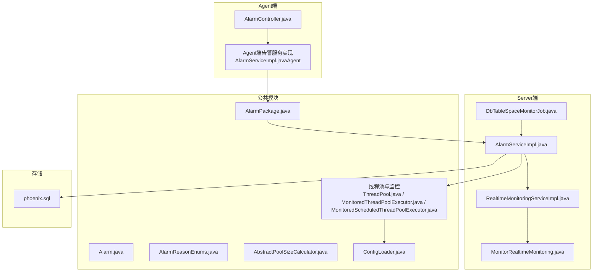
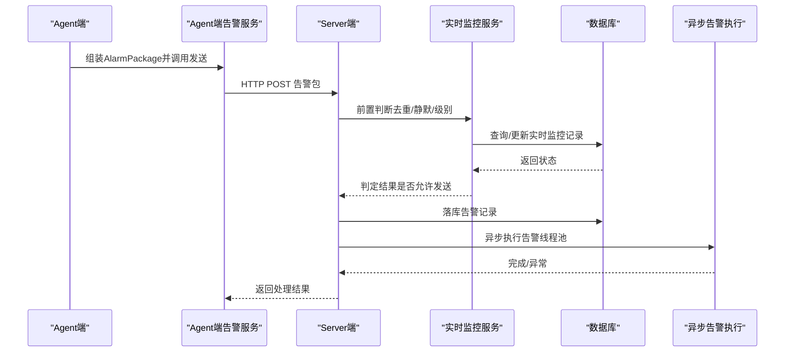
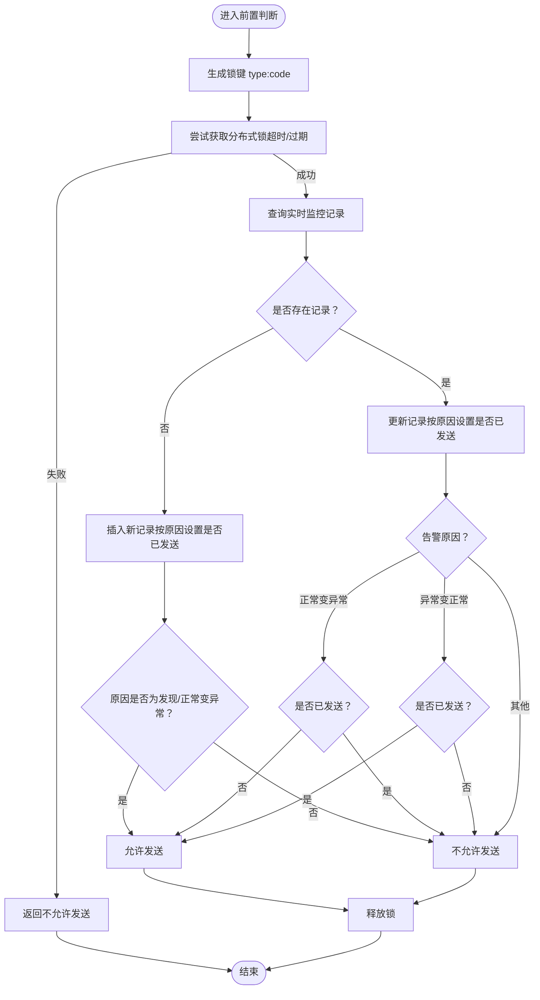
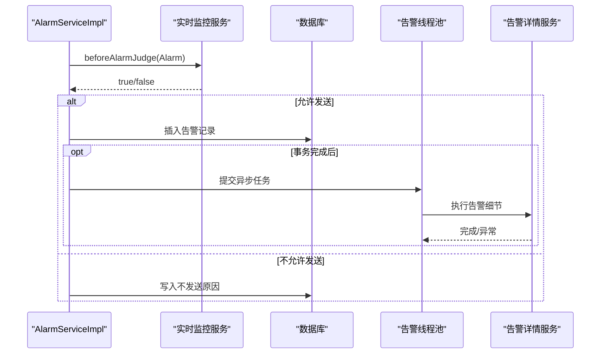
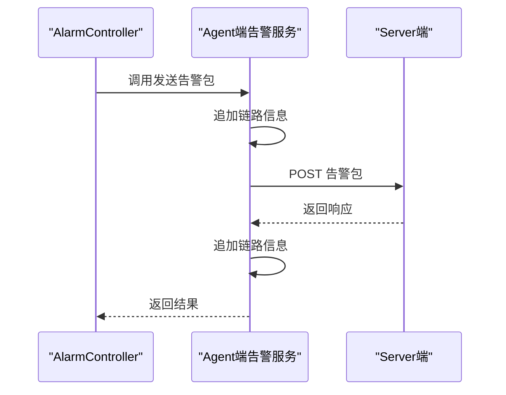
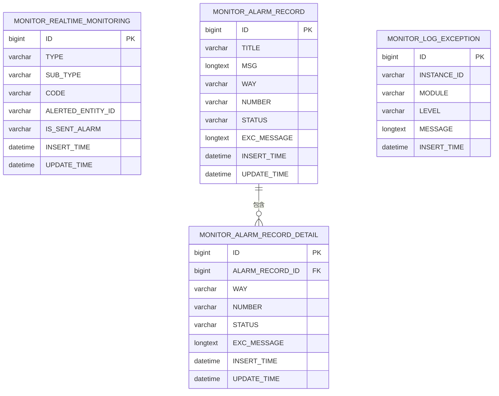
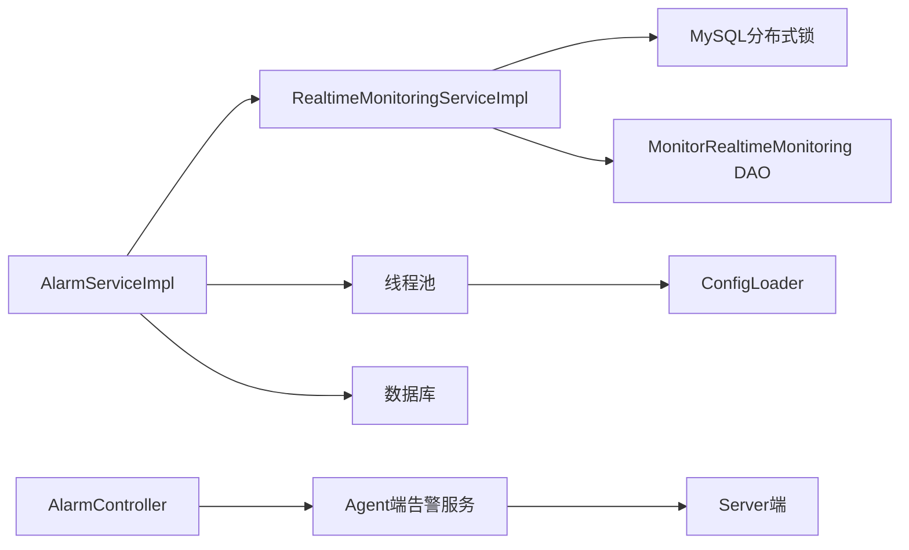

# 智能告警系统

<cite>
**本文引用的文件**
- [Alarm.java](file://phoenix-common\phoenix-common-core\src\main\java\com\gitee\pifeng\monitoring\common\domain\Alarm.java)
- [AlarmPackage.java](file://phoenix-common\phoenix-common-core\src\main\java\com\gitee\pifeng\monitoring\common\dto\AlarmPackage.java)
- [AlarmReasonEnums.java](file://phoenix-common\phoenix-common-core\src\main\java\com\gitee\pifeng\monitoring\common\constant\alarm\AlarmReasonEnums.java)
- [AlarmServiceImpl.java](file://phoenix-server\src\main\java\com\gitee\pifeng\monitoring\server\business\server\service\impl\AlarmServiceImpl.java)
- [RealtimeMonitoringServiceImpl.java](file://phoenix-server\src\main\java\com\gitee\pifeng\monitoring\server\business\server\service\impl\RealtimeMonitoringServiceImpl.java)
- [IRealtimeMonitoringService.java](file://phoenix-server\src\main\java\com\gitee\pifeng\monitoring\server\business\server\service\IRealtimeMonitoringService.java)
- [MonitorRealtimeMonitoring.java](file://phoenix-server\src\main\java\com\gitee\pifeng\monitoring\server\business\server\entity\MonitorRealtimeMonitoring.java)
- [DbTableSpaceMonitorJob.java](file://phoenix-server\src\main\java\com\gitee\pifeng\monitoring\server\business\server\monitor\db\DbTableSpaceMonitorJob.java)
- [phoenix.sql](file://doc\数据库设计\sql\mysql\phoenix.sql)
- [application.yml](file://phoenix-server\src\main\resources\application.yml)
- [AlarmController.java](file://phoenix-agent\src\main\java\com\gitee\pifeng\monitoring\agent\business\client\controller\AlarmController.java)
- [AlarmServiceImpl.java（Agent）](file://phoenix-agent\src\main\java\com\gitee\pifeng\monitoring\agent\business\server\service\impl\AlarmServiceImpl.java)
- [ThreadPool.java](file://phoenix-common\phoenix-common-core\src\main\java\com\gitee\pifeng\monitoring\common\threadpool\ThreadPool.java)
- [MonitoredThreadPoolExecutor.java](file://phoenix-common\phoenix-common-core\src\main\java\com\gitee\pifeng\monitoring\common\threadpool\MonitoredThreadPoolExecutor.java)
- [MonitoredScheduledThreadPoolExecutor.java](file://phoenix-common\phoenix-common-core\src\main\java\com\gitee\pifeng\monitoring\common\threadpool\MonitoredScheduledThreadPoolExecutor.java)
- [AbstractPoolSizeCalculator.java](file://phoenix-common\phoenix-common-core\src\main\java\com\gitee\pifeng\monitoring\common\abs\AbstractPoolSizeCalculator.java)
- [ConfigLoader.java](file://phoenix-client\phoenix-client-core\src\main\java\com\gitee\pifeng\monitoring\plug\core\ConfigLoader.java)
</cite>

## 目录
1. [简介](#简介)
2. [项目结构](#项目结构)
3. [核心组件](#核心组件)
4. [架构总览](#架构总览)
5. [详细组件分析](#详细组件分析)
6. [依赖分析](#依赖分析)
7. [性能考量](#性能考量)
8. [故障排查指南](#故障排查指南)
9. [结论](#结论)
10. [附录](#附录)

## 简介
本技术指南面向Phoenix监控系统的智能告警系统，围绕“异常检测、趋势预测、误报/漏报控制、实时处理、告警聚合与下发”的目标，系统性梳理现有代码中的告警数据模型、处理流程、并发与性能保障机制，并给出可扩展到机器学习算法的实践路径。当前代码库以规则驱动为主（如告警前置判断、分布式锁去重、配置化阈值与静默窗口），未直接包含深度学习模型实现；本指南在不虚构事实的前提下，提供基于历史数据与实时指标的ML集成建议，帮助读者构建“规则+学习”的混合智能告警体系。

## 项目结构
Phoenix监控系统由Agent采集端、Server服务端、UI前端与公共模块组成。智能告警的关键流转涉及Agent采集与上报、Server端接收与判定、数据库落盘与去重、异步线程池执行告警下发等环节。

**图表来源**
- [AlarmController.java](file://phoenix-agent\src\main\java\com\gitee\pifeng\monitoring\agent\business\client\controller\AlarmController.java)
- [AlarmServiceImpl.java（Agent）](file://phoenix-agent\src\main\java\com\gitee\pifeng\monitoring\agent\business\server\service\impl\AlarmServiceImpl.java)
- [AlarmPackage.java](file://phoenix-common\phoenix-common-core\src\main\java\com\gitee\pifeng\monitoring\common\dto\AlarmPackage.java)
- [AlarmServiceImpl.java](file://phoenix-server\src\main\java\com\gitee\pifeng\monitoring\server\business\server\service\impl\AlarmServiceImpl.java)
- [RealtimeMonitoringServiceImpl.java](file://phoenix-server\src\main\java\com\gitee\pifeng\monitoring\server\business\server\service\impl\RealtimeMonitoringServiceImpl.java)
- [MonitorRealtimeMonitoring.java](file://phoenix-server\src\main\java\com\gitee\pifeng\monitoring\server\business\server\entity\MonitorRealtimeMonitoring.java)
- [DbTableSpaceMonitorJob.java](file://phoenix-server\src\main\java\com\gitee\pifeng\monitoring\server\business\server\monitor\db\DbTableSpaceMonitorJob.java)
- [ThreadPool.java](file://phoenix-common\phoenix-common-core\src\main\java\com\gitee\pifeng\monitoring\common\threadpool\ThreadPool.java)
- [MonitoredThreadPoolExecutor.java](file://phoenix-common\phoenix-common-core\src\main\java\com\gitee\pifeng\monitoring\common\threadpool\MonitoredThreadPoolExecutor.java)
- [MonitoredScheduledThreadPoolExecutor.java](file://phoenix-common\phoenix-common-core\src\main\java\com\gitee\pifeng\monitoring\common\threadpool\MonitoredScheduledThreadPoolExecutor.java)
- [AbstractPoolSizeCalculator.java](file://phoenix-common\phoenix-common-core\src\main\java\com\gitee\pifeng\monitoring\common\abs\AbstractPoolSizeCalculator.java)
- [ConfigLoader.java](file://phoenix-client\phoenix-client-core\src\main\java\com\gitee\pifeng\monitoring\plug\core\ConfigLoader.java)
- [phoenix.sql](file://doc\数据库设计\sql\mysql\phoenix.sql)

**章节来源**
- [AlarmController.java](file://phoenix-agent\src\main\java\com\gitee\pifeng\monitoring\agent\business\client\controller\AlarmController.java)
- [AlarmServiceImpl.java（Agent）](file://phoenix-agent\src\main\java\com\gitee\pifeng\monitoring\agent\business\server\service\impl\AlarmServiceImpl.java)
- [AlarmPackage.java](file://phoenix-common\phoenix-common-core\src\main\java\com\gitee\pifeng\monitoring\common\dto\AlarmPackage.java)
- [AlarmServiceImpl.java](file://phoenix-server\src\main\java\com\gitee\pifeng\monitoring\server\business\server\service\impl\AlarmServiceImpl.java)
- [RealtimeMonitoringServiceImpl.java](file://phoenix-server\src\main\java\com\gitee\pifeng\monitoring\server\business\server\service\impl\RealtimeMonitoringServiceImpl.java)
- [MonitorRealtimeMonitoring.java](file://phoenix-server\src\main\java\com\gitee\pifeng\monitoring\server\business\server\entity\MonitorRealtimeMonitoring.java)
- [DbTableSpaceMonitorJob.java](file://phoenix-server\src\main\java\com\gitee\pifeng\monitoring\server\business\server\monitor\db\DbTableSpaceMonitorJob.java)
- [ThreadPool.java](file://phoenix-common\phoenix-common-core\src\main\java\com\gitee\pifeng\monitoring\common\threadpool\ThreadPool.java)
- [MonitoredThreadPoolExecutor.java](file://phoenix-common\phoenix-common-core\src\main\java\com\gitee\pifeng\monitoring\common\threadpool\MonitoredThreadPoolExecutor.java)
- [MonitoredScheduledThreadPoolExecutor.java](file://phoenix-common\phoenix-common-core\src\main\java\com\gitee\pifeng\monitoring\common\threadpool\MonitoredScheduledThreadPoolExecutor.java)
- [AbstractPoolSizeCalculator.java](file://phoenix-common\phoenix-common-core\src\main\java\com\gitee\pifeng\monitoring\common\abs\AbstractPoolSizeCalculator.java)
- [ConfigLoader.java](file://phoenix-client\phoenix-client-core\src\main\java\com\gitee\pifeng\monitoring\plug\core\ConfigLoader.java)
- [phoenix.sql](file://doc\数据库设计\sql\mysql\phoenix.sql)

## 核心组件
- 告警数据模型与封装
  - Alarm：告警实体，包含告警级别、原因、监控类型、标题、内容、编码、被告警主体ID、是否测试等字段。
  - AlarmPackage：传输载体，封装Alarm对象。
  - AlarmReasonEnums：告警原因枚举（正常变异常、异常变正常、发现、忽略）。
- 告警处理与判定
  - AlarmServiceImpl：接收告警包，前置校验、落库、异步执行告警、静默窗口与级别过滤。
  - RealtimeMonitoringServiceImpl：前置去重与幂等，基于数据库记录与分布式锁判断是否允许发送告警。
  - IRealtimeMonitoringService：前置判断接口。
  - MonitorRealtimeMonitoring：实时监控记录实体，用于去重与状态跟踪。
- Agent侧上报
  - AlarmController：Agent端控制器，负责组装告警包并调用Agent端告警服务。
  - Agent端AlarmServiceImpl：将告警包通过HTTP发送至Server端。
- 存储与配置
  - phoenix.sql：包含告警记录、告警记录详情、异常日志等表结构，支撑告警落库与查询。
  - application.yml：Server端配置，含线程池、Quartz、数据源、缓存等。
  - ConfigLoader：客户端配置加载，包含HTTP连接与超时参数，影响上报延迟与稳定性。
- 线程池与性能
  - ThreadPool、MonitoredThreadPoolExecutor、MonitoredScheduledThreadPoolExecutor：统一线程池管理与监控。
  - AbstractPoolSizeCalculator：线程池边界计算工具，辅助性能调优。

**章节来源**
- [Alarm.java](file://phoenix-common\phoenix-common-core\src\main\java\com\gitee\pifeng\monitoring\common\domain\Alarm.java)
- [AlarmPackage.java](file://phoenix-common\phoenix-common-core\src\main\java\com\gitee\pifeng\monitoring\common\dto\AlarmPackage.java)
- [AlarmReasonEnums.java](file://phoenix-common\phoenix-common-core\src\main\java\com\gitee\pifeng\monitoring\common\constant\alarm\AlarmReasonEnums.java)
- [AlarmServiceImpl.java](file://phoenix-server\src\main\java\com\gitee\pifeng\monitoring\server\business\server\service\impl\AlarmServiceImpl.java)
- [RealtimeMonitoringServiceImpl.java](file://phoenix-server\src\main\java\com\gitee\pifeng\monitoring\server\business\server\service\impl\RealtimeMonitoringServiceImpl.java)
- [IRealtimeMonitoringService.java](file://phoenix-server\src\main\java\com\gitee\pifeng\monitoring\server\business\server\service\IRealtimeMonitoringService.java)
- [MonitorRealtimeMonitoring.java](file://phoenix-server\src\main\java\com\gitee\pifeng\monitoring\server\business\server\entity\MonitorRealtimeMonitoring.java)
- [AlarmController.java](file://phoenix-agent\src\main\java\com\gitee\pifeng\monitoring\agent\business\client\controller\AlarmController.java)
- [AlarmServiceImpl.java（Agent）](file://phoenix-agent\src\main\java\com\gitee\pifeng\monitoring\agent\business\server\service\impl\AlarmServiceImpl.java)
- [phoenix.sql](file://doc\数据库设计\sql\mysql\phoenix.sql)
- [application.yml](file://phoenix-server\src\main\resources\application.yml)
- [ThreadPool.java](file://phoenix-common\phoenix-common-core\src\main\java\com\gitee\pifeng\monitoring\common\threadpool\ThreadPool.java)
- [MonitoredThreadPoolExecutor.java](file://phoenix-common\phoenix-common-core\src\main\java\com\gitee\pifeng\monitoring\common\threadpool\MonitoredThreadPoolExecutor.java)
- [MonitoredScheduledThreadPoolExecutor.java](file://phoenix-common\phoenix-common-core\src\main\java\com\gitee\pifeng\monitoring\common\threadpool\MonitoredScheduledThreadPoolExecutor.java)
- [AbstractPoolSizeCalculator.java](file://phoenix-common\phoenix-common-core\src\main\java\com\gitee\pifeng\monitoring\common\abs\AbstractPoolSizeCalculator.java)
- [ConfigLoader.java](file://phoenix-client\phoenix-client-core\src\main\java\com\gitee\pifeng\monitoring\plug\core\ConfigLoader.java)

## 架构总览
智能告警系统采用“Agent采集—Server判定—数据库落盘—异步下发”的分层架构。Agent端负责将采集到的指标封装为AlarmPackage并上报；Server端进行前置判断（去重、静默、级别过滤）、落库、异步执行具体告警动作（短信、邮件等）。数据库中MONITOR_REALTIME_MONITORING用于去重与状态跟踪，MONITOR_ALARM_RECORD与MONITOR_ALARM_RECORD_DETAIL支撑告警记录与详情。

**图表来源**
- [AlarmController.java](file://phoenix-agent\src\main\java\com\gitee\pifeng\monitoring\agent\business\client\controller\AlarmController.java)
- [AlarmServiceImpl.java（Agent）](file://phoenix-agent\src\main\java\com\gitee\pifeng\monitoring\agent\business\server\service\impl\AlarmServiceImpl.java)
- [AlarmPackage.java](file://phoenix-common\phoenix-common-core\src\main\java\com\gitee\pifeng\monitoring\common\dto\AlarmPackage.java)
- [AlarmServiceImpl.java](file://phoenix-server\src\main\java\com\gitee\pifeng\monitoring\server\business\server\service\impl\AlarmServiceImpl.java)
- [RealtimeMonitoringServiceImpl.java](file://phoenix-server\src\main\java\com\gitee\pifeng\monitoring\server\business\server\service\impl\RealtimeMonitoringServiceImpl.java)
- [MonitorRealtimeMonitoring.java](file://phoenix-server\src\main\java\com\gitee\pifeng\monitoring\server\business\server\entity\MonitorRealtimeMonitoring.java)

## 详细组件分析

### 组件A：实时监控与去重（前置判断）
- 设计要点
  - 使用MySQL分布式锁（基于业务键type:code）在事务内持锁，避免高并发重复告警。
  - 依据AlarmReasonEnums判断是否允许发送：发现/正常变异常直接放行；异常变正常需已发送过告警才放行。
  - 通过MonitorRealtimeMonitoring记录是否已发送告警，实现幂等。
- 关键流程
  - 生成锁键并尝试获取锁，超时则放弃本次判断。
  - 查询数据库是否存在相同type+code记录，不存在则插入并按原因决定是否发送。
  - 存在则更新状态，结合历史发送状态与原因决定是否发送。
- 复杂度与性能
  - 单次判断涉及一次查询、一次插入或更新，复杂度近似O(1)数据库操作；耗时超过阈值会记录告警。
- 优化建议
  - 高并发场景建议替换为Redisson分布式锁，降低MySQL锁竞争。
  - 对热点key增加缓存（如最近N秒内的去重结果），减少DB压力。

**图表来源**
- [RealtimeMonitoringServiceImpl.java](file://phoenix-server\src\main\java\com\gitee\pifeng\monitoring\server\business\server\service\impl\RealtimeMonitoringServiceImpl.java)
- [MonitorRealtimeMonitoring.java](file://phoenix-server\src\main\java\com\gitee\pifeng\monitoring\server\business\server\entity\MonitorRealtimeMonitoring.java)
- [AlarmReasonEnums.java](file://phoenix-common\phoenix-common-core\src\main\java\com\gitee\pifeng\monitoring\common\constant\alarm\AlarmReasonEnums.java)

**章节来源**
- [RealtimeMonitoringServiceImpl.java](file://phoenix-server\src\main\java\com\gitee\pifeng\monitoring\server\business\server\service\impl\RealtimeMonitoringServiceImpl.java)
- [IRealtimeMonitoringService.java](file://phoenix-server\src\main\java\com\gitee\pifeng\monitoring\server\business\server\service\IRealtimeMonitoringService.java)
- [MonitorRealtimeMonitoring.java](file://phoenix-server\src\main\java\com\gitee\pifeng\monitoring\server\business\server\entity\MonitorRealtimeMonitoring.java)
- [AlarmReasonEnums.java](file://phoenix-common\phoenix-common-core\src\main\java\com\gitee\pifeng\monitoring\common\constant\alarm\AlarmReasonEnums.java)

### 组件B：告警判定与异步执行
- 设计要点
  - 告警开关、静默窗口、级别阈值、标题/内容/告警方式完整性校验。
  - 事务完成后异步执行告警，避免阻塞主流程。
  - 使用专用线程池执行告警细节（短信、邮件等），隔离IO与CPU负载。
- 关键流程
  - 前置判断通过后，落库告警记录。
  - 若满足发送条件，注册事务完成后回调，异步执行告警细节服务。
- 性能与可靠性
  - 通过线程池拒绝计数与监控器观察吞吐与积压。
  - HTTP上报参数（连接/套接字/连接请求超时）影响整体延迟与稳定性。

**图表来源**
- [AlarmServiceImpl.java](file://phoenix-server\src\main\java\com\gitee\pifeng\monitoring\server\business\server\service\impl\AlarmServiceImpl.java)
- [RealtimeMonitoringServiceImpl.java](file://phoenix-server\src\main\java\com\gitee\pifeng\monitoring\server\business\server\service\impl\RealtimeMonitoringServiceImpl.java)
- [MonitoredThreadPoolExecutor.java](file://phoenix-common\phoenix-common-core\src\main\java\com\gitee\pifeng\monitoring\common\threadpool\MonitoredThreadPoolExecutor.java)

**章节来源**
- [AlarmServiceImpl.java](file://phoenix-server\src\main\java\com\gitee\pifeng\monitoring\server\business\server\service\impl\AlarmServiceImpl.java)
- [RealtimeMonitoringServiceImpl.java](file://phoenix-server\src\main\java\com\gitee\pifeng\monitoring\server\business\server\service\impl\RealtimeMonitoringServiceImpl.java)
- [MonitoredThreadPoolExecutor.java](file://phoenix-common\phoenix-common-core\src\main\java\com\gitee\pifeng\monitoring\common\threadpool\MonitoredThreadPoolExecutor.java)
- [ConfigLoader.java](file://phoenix-client\phoenix-client-core\src\main\java\com\gitee\pifeng\monitoring\plug\core\ConfigLoader.java)

### 组件C：Agent端上报与封装
- 设计要点
  - Agent端控制器负责将采集到的监控事件封装为AlarmPackage并通过HTTP发送。
  - Agent端告警服务在发送前后追加链路信息，便于全链路追踪。
- 关键流程
  - 组装AlarmPackage → 发送HTTP请求 → 返回响应并附加链路信息。

**图表来源**
- [AlarmController.java](file://phoenix-agent\src\main\java\com\gitee\pifeng\monitoring\agent\business\client\controller\AlarmController.java)
- [AlarmServiceImpl.java（Agent）](file://phoenix-agent\src\main\java\com\gitee\pifeng\monitoring\agent\business\server\service\impl\AlarmServiceImpl.java)
- [AlarmPackage.java](file://phoenix-common\phoenix-common-core\src\main\java\com\gitee\pifeng\monitoring\common\dto\AlarmPackage.java)

**章节来源**
- [AlarmController.java](file://phoenix-agent\src\main\java\com\gitee\pifeng\monitoring\agent\business\client\controller\AlarmController.java)
- [AlarmServiceImpl.java（Agent）](file://phoenix-agent\src\main\java\com\gitee\pifeng\monitoring\agent\business\server\service\impl\AlarmServiceImpl.java)
- [AlarmPackage.java](file://phoenix-common\phoenix-common-core\src\main\java\com\gitee\pifeng\monitoring\common\dto\AlarmPackage.java)

### 组件D：数据库模型与索引
- 关键表
  - MONITOR_REALTIME_MONITORING：实时监控记录，用于去重与状态跟踪。
  - MONITOR_ALARM_RECORD / MONITOR_ALARM_RECORD_DETAIL：告警记录与详情，支撑告警落库与查询。
  - MONITOR_LOG_EXCEPTION：异常日志，便于问题定位。
- 索引与约束
  - 对常用查询字段建立索引（如告警记录ID、告警方式、状态、插入时间等），提升查询效率。
- 建议
  - 对高频查询字段增加复合索引，缩短扫描范围。
  - 定期清理历史数据，控制表规模。

**图表来源**
- [phoenix.sql](file://doc\数据库设计\sql\mysql\phoenix.sql)

**章节来源**
- [phoenix.sql](file://doc\数据库设计\sql\mysql\phoenix.sql)

## 依赖分析
- 组件耦合
  - AlarmServiceImpl依赖实时监控服务、告警定义、告警记录、告警详情与线程池。
  - RealtimeMonitoringServiceImpl依赖分布式锁与DAO层，承担高并发下的去重职责。
  - Agent端通过AlarmPackage与Server端解耦，仅依赖HTTP通信。
- 外部依赖
  - 线程池与监控：ThreadPool、MonitoredThreadPoolExecutor、MonitoredScheduledThreadPoolExecutor。
  - 配置加载：ConfigLoader提供HTTP超时等参数，影响上报延迟。
  - 数据库：MyBatis-Plus、Druid连接池、Quartz定时任务。

**图表来源**
- [AlarmServiceImpl.java](file://phoenix-server\src\main\java\com\gitee\pifeng\monitoring\server\business\server\service\impl\AlarmServiceImpl.java)
- [RealtimeMonitoringServiceImpl.java](file://phoenix-server\src\main\java\com\gitee\pifeng\monitoring\server\business\server\service\impl\RealtimeMonitoringServiceImpl.java)
- [AlarmController.java](file://phoenix-agent\src\main\java\com\gitee\pifeng\monitoring\agent\business\client\controller\AlarmController.java)
- [AlarmServiceImpl.java（Agent）](file://phoenix-agent\src\main\java\com\gitee\pifeng\monitoring\agent\business\server\service\impl\AlarmServiceImpl.java)
- [ThreadPool.java](file://phoenix-common\phoenix-common-core\src\main\java\com\gitee\pifeng\monitoring\common\threadpool\ThreadPool.java)
- [ConfigLoader.java](file://phoenix-client\phoenix-client-core\src\main\java\com\gitee\pifeng\monitoring\plug\core\ConfigLoader.java)

**章节来源**
- [AlarmServiceImpl.java](file://phoenix-server\src\main\java\com\gitee\pifeng\monitoring\server\business\server\service\impl\AlarmServiceImpl.java)
- [RealtimeMonitoringServiceImpl.java](file://phoenix-server\src\main\java\com\gitee\pifeng\monitoring\server\business\server\service\impl\RealtimeMonitoringServiceImpl.java)
- [AlarmController.java](file://phoenix-agent\src\main\java\com\gitee\pifeng\monitoring\agent\business\client\controller\AlarmController.java)
- [AlarmServiceImpl.java（Agent）](file://phoenix-agent\src\main\java\com\gitee\pifeng\monitoring\agent\business\server\service\impl\AlarmServiceImpl.java)
- [ThreadPool.java](file://phoenix-common\phoenix-common-core\src\main\java\com\gitee\pifeng\monitoring\common\threadpool\ThreadPool.java)
- [ConfigLoader.java](file://phoenix-client\phoenix-client-core\src\main\java\com\gitee\pifeng\monitoring\plug\core\ConfigLoader.java)

## 性能考量
- 线程池与任务隔离
  - 使用独立的告警线程池，避免IO阻塞影响主业务线程。
  - 监控拒绝任务数与队列长度，动态调整核心/最大线程数与队列容量。
- 上报延迟与稳定性
  - ConfigLoader中的HTTP超时参数直接影响上报延迟与失败率，建议结合AbstractPoolSizeCalculator进行边界估算与调优。
- 数据库与锁
  - 去重逻辑依赖分布式锁与单条记录更新，建议热点key做缓存或迁移到Redisson锁。
  - 为高频查询字段建立索引，定期维护统计信息。
- 并发与重试
  - Retryable注解用于幂等重试，结合锁超时避免死锁。
- 配置参考
  - application.yml中线程池、Quartz、数据源、缓存等配置可作为性能调优入口。

**章节来源**
- [MonitoredThreadPoolExecutor.java](file://phoenix-common\phoenix-common-core\src\main\java\com\gitee\pifeng\monitoring\common\threadpool\MonitoredThreadPoolExecutor.java)
- [MonitoredScheduledThreadPoolExecutor.java](file://phoenix-common\phoenix-common-core\src\main\java\com\gitee\pifeng\monitoring\common\threadpool\MonitoredScheduledThreadPoolExecutor.java)
- [AbstractPoolSizeCalculator.java](file://phoenix-common\phoenix-common-core\src\main\java\com\gitee\pifeng\monitoring\common\abs\AbstractPoolSizeCalculator.java)
- [ConfigLoader.java](file://phoenix-client\phoenix-client-core\src\main\java\com\gitee\pifeng\monitoring\plug\core\ConfigLoader.java)
- [application.yml](file://phoenix-server\src\main\resources\application.yml)

## 故障排查指南
- 常见问题定位
  - 告警未发送：检查告警开关、静默窗口、级别阈值、标题/内容/告警方式是否配置完整。
  - 重复告警：确认分布式锁是否获取成功、实时监控记录是否正确更新。
  - 异步执行失败：查看线程池拒绝计数与异常日志，核对告警详情服务可用性。
- 日志与监控
  - application.yml中日志级别与监控配置，有助于定位异常。
  - MONITOR_LOG_EXCEPTION记录异常信息，便于回溯。
- 建议流程
  - 采集→封装→上报→Server前置判断→落库→异步执行→结果回传。

**章节来源**
- [AlarmServiceImpl.java](file://phoenix-server\src\main\java\com\gitee\pifeng\monitoring\server\business\server\service\impl\AlarmServiceImpl.java)
- [RealtimeMonitoringServiceImpl.java](file://phoenix-server\src\main\java\com\gitee\pifeng\monitoring\server\business\server\service\impl\RealtimeMonitoringServiceImpl.java)
- [phoenix.sql](file://doc\数据库设计\sql\mysql\phoenix.sql)
- [application.yml](file://phoenix-server\src\main\resources\application.yml)

## 结论
Phoenix监控系统的智能告警以规则为核心，结合分布式锁与数据库状态实现高并发下的去重与幂等；通过线程池与异步执行保障吞吐与稳定性。若需引入机器学习能力，可在现有规则基础上叠加“异常检测模型（如孤立森林、VAE）+趋势预测（如Prophet、LSTM）”，利用历史数据训练并在线推理，将ML输出作为阈值或权重融入现有判定流程，从而降低误报与漏报，提升智能化水平。

## 附录
- 智能告警实现示例（从数据收集到告警输出的完整流程）
  - Agent端采集指标并封装为AlarmPackage，通过HTTP发送至Server端。
  - Server端进行前置判断（去重、静默、级别），落库告警记录。
  - 满足发送条件时，异步执行告警细节（短信/邮件），并记录执行结果。
  - 数据库中保留告警记录与详情，便于审计与复盘。

**章节来源**
- [AlarmController.java](file://phoenix-agent\src\main\java\com\gitee\pifeng\monitoring\agent\business\client\controller\AlarmController.java)
- [AlarmServiceImpl.java（Agent）](file://phoenix-agent\src\main\java\com\gitee\pifeng\monitoring\agent\business\server\service\impl\AlarmServiceImpl.java)
- [AlarmPackage.java](file://phoenix-common\phoenix-common-core\src\main\java\com\gitee\pifeng\monitoring\common\dto\AlarmPackage.java)
- [AlarmServiceImpl.java](file://phoenix-server\src\main\java\com\gitee\pifeng\monitoring\server\business\server\service\impl\AlarmServiceImpl.java)
- [RealtimeMonitoringServiceImpl.java](file://phoenix-server\src\main\java\com\gitee\pifeng\monitoring\server\business\server\service\impl\RealtimeMonitoringServiceImpl.java)
- [MonitorRealtimeMonitoring.java](file://phoenix-server\src\main\java\com\gitee\pifeng\monitoring\server\business\server\entity\MonitorRealtimeMonitoring.java)
- [phoenix.sql](file://doc\数据库设计\sql\mysql\phoenix.sql)