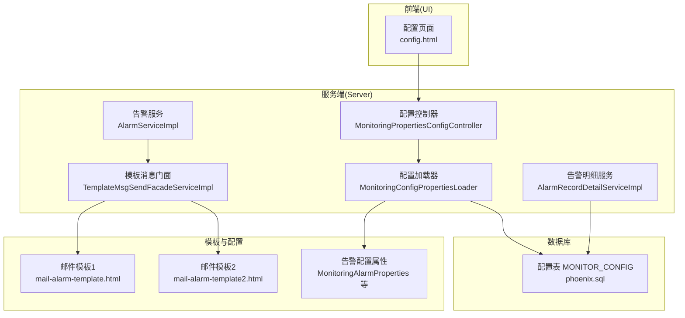
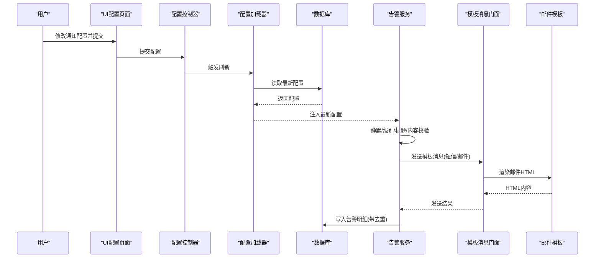
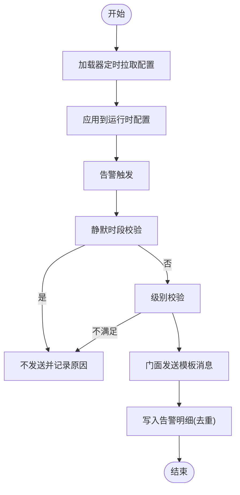
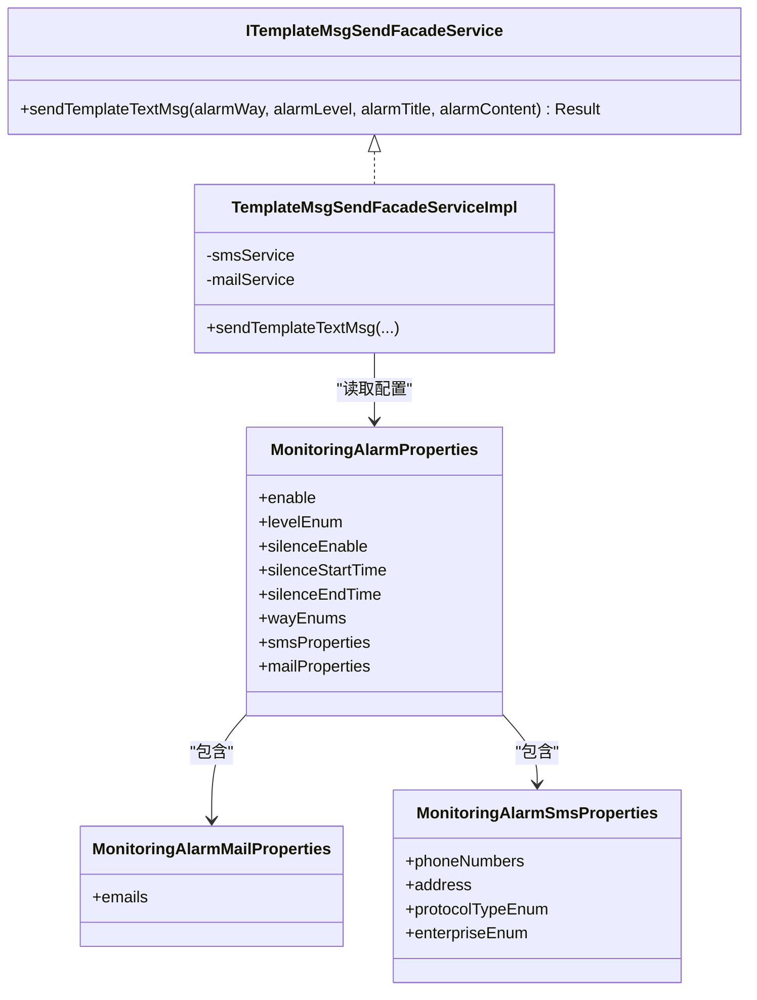
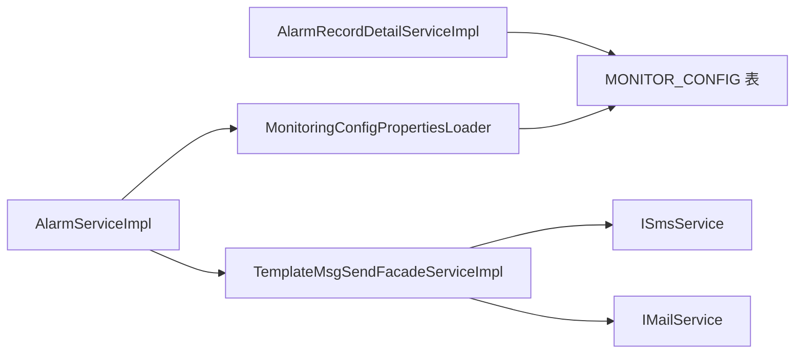

# 通知配置管理

<cite>
**本文引用的文件**
- [application.yml](file://phoenix-server/src/main/resources/application.yml)
- [application-dev.yml](file://phoenix-server/src/main/resources/application-dev.yml)
- [application-prod.yml](file://phoenix-server/src/main/resources/application-prod.yml)
- [mail-alarm-template.html](file://phoenix-server/src/main/resources/templates/mail/mail-alarm-template.html)
- [mail-alarm-template2.html](file://phoenix-server/src/main/resources/templates/mail/mail-alarm-template2.html)
- [MonitoringAlarmProperties.java](file://phoenix-common/Phoenix-common-core/src/main/java/com/gitee/pifeng/monitoring/common/property/server/MonitoringAlarmProperties.java)
- [MonitoringAlarmMailProperties.java](file://phoenix-common/Phoenix-common-core/src/main/java/com/gitee/pifeng/monitoring/common/property/server/MonitoringAlarmMailProperties.java)
- [MonitoringAlarmSmsProperties.java](file://phoenix-common/Phoenix-common-core/src/main/java/com/gitee/pifeng/monitoring/common/property/server/MonitoringAlarmSmsProperties.java)
- [AlarmWayEnums.java](file://phoenix-common/Phoenix-common-core/src/main/java/com/gitee/pifeng/monitoring/common/constant/alarm/AlarmWayEnums.java)
- [AlarmLevelEnums.java](file://phoenix-common/Phoenix-common-core/src/main/java/com/gitee/pifeng/monitoring/common/constant/alarm/AlarmLevelEnums.java)
- [MonitoringConfigPropertiesLoader.java](file://phoenix-server/src/main/java/com/gitee/pifeng/monitoring/server/business/server/core/MonitoringConfigPropertiesLoader.java)
- [MonitoringPropertiesConfigController.java](file://phoenix-server/src/main/java/com/gitee/pifeng/monitoring/server/business/server/controller/MonitoringPropertiesConfigController.java)
- [TemplateMsgSendFacadeServiceImpl.java](file://phoenix-server/src/main/java/com/gitee/pifeng/monitoring/server/business/server/service/impl/TemplateMsgSendFacadeServiceImpl.java)
- [ITemplateMsgSendFacadeService.java](file://phoenix-server/src/main/java/com/gitee/pifeng/monitoring/server/business/server/service/ITemplateMsgSendFacadeService.java)
- [AlarmRecordDetailServiceImpl.java](file://phoenix-server/src/main/java/com/gitee/pifeng/monitoring/server/business/server/service/impl/AlarmRecordDetailServiceImpl.java)
- [AlarmServiceImpl.java](file://phoenix-server/src/main/java/com/gitee/pifeng/monitoring/server/business/server/service/impl/AlarmServiceImpl.java)
- [config.html](file://phoenix-ui/src/main/resources/templates/set/config.html)
- [MonitorConfigServiceImpl.java](file://phoenix-ui/src/main/java/com/gitee/pifeng/monitoring/ui/business/web/service/impl/MonitorConfigServiceImpl.java)
- [phoenix.sql](file://doc/数据库设计/sql/mysql/phoenix.sql)
</cite>

## 目录
1. [简介](#简介)
2. [项目结构](#项目结构)
3. [核心组件](#核心组件)
4. [架构总览](#架构总览)
5. [详细组件分析](#详细组件分析)
6. [依赖分析](#依赖分析)
7. [性能考量](#性能考量)
8. [故障排查指南](#故障排查指南)
9. [结论](#结论)
10. [附录](#附录)

## 简介
本指南围绕Phoenix监控系统的“通知配置管理”，系统性讲解告警通知的个性化配置、多语言支持、通知样式优化、通知渠道（邮件、短信）的模板与格式配置、通知去重与限流机制、动态配置管理（热更新、校验、备份恢复）以及最佳实践。读者可据此在不同业务场景下制定合理的通知策略，确保告警既及时又不过度打扰。

## 项目结构
通知配置涉及前后端与服务端的关键模块：
- UI层：提供配置页面与表单，负责收集用户输入并提交至服务端
- 服务端：加载与持久化配置、执行告警判定、调用门面发送模板消息
- 模板层：邮件HTML模板，支持Thymeleaf渲染
- 配置持久化：数据库表存储配置快照，定时拉取实现热更新

图表来源
- [config.html:1-200](file://phoenix-ui/src/main/resources/templates/set/config.html#L1-L200)
- [MonitoringPropertiesConfigController.java:32-74](file://phoenix-server/src/main/java/com/gitee/pifeng/monitoring/server/business/server/controller/MonitoringPropertiesConfigController.java#L32-L74)
- [MonitoringConfigPropertiesLoader.java:1-202](file://phoenix-server/src/main/java/com/gitee/pifeng/monitoring/server/business/server/core/MonitoringConfigPropertiesLoader.java#L1-L202)
- [TemplateMsgSendFacadeServiceImpl.java:33-85](file://phoenix-server/src/main/java/com/gitee/pifeng/monitoring/server/business/server/service/impl/TemplateMsgSendFacadeServiceImpl.java#L33-L85)
- [mail-alarm-template.html:1-33](file://phoenix-server/src/main/resources/templates/mail/mail-alarm-template.html#L1-L33)
- [mail-alarm-template2.html:1-13](file://phoenix-server/src/main/resources/templates/mail/mail-alarm-template2.html#L1-L13)
- [phoenix.sql:76-89](file://doc/数据库设计/sql/mysql/phoenix.sql#L76-L89)

章节来源
- [config.html:1-200](file://phoenix-ui/src/main/resources/templates/set/config.html#L1-L200)
- [application.yml:1-271](file://phoenix-server/src/main/resources/application.yml#L1-L271)

## 核心组件
- 告警配置属性模型：封装告警开关、级别、静默时段、通知方式及各渠道配置
- 通知门面：统一封装短信/邮件发送流程，屏蔽渠道差异
- 配置加载器：从数据库加载配置，支持定时刷新与手动触发
- 邮件模板：基于Thymeleaf的HTML模板，支持标题、级别、内容渲染
- 告警服务：在发送前进行静默、级别、标题/内容等前置校验
- 告警明细服务：批量写入发送记录，含去重约束

章节来源
- [MonitoringAlarmProperties.java:1-65](file://phoenix-common/Phoenix-common-core/src/main/java/com/gitee/pifeng/monitoring/common/property/server/MonitoringAlarmProperties.java#L1-L65)
- [MonitoringAlarmMailProperties.java:1-27](file://phoenix-common/Phoenix-common-core/src/main/java/com/gitee/pifeng/monitoring/common/property/server/MonitoringAlarmMailProperties.java#L1-L27)
- [MonitoringAlarmSmsProperties.java:1-43](file://phoenix-common/Phoenix-common-core/src/main/java/com/gitee/pifeng/monitoring/common/property/server/MonitoringAlarmSmsProperties.java#L1-L43)
- [AlarmWayEnums.java:1-94](file://phoenix-common/Phoenix-common-core/src/main/java/com/gitee/pifeng/monitoring/common/constant/alarm/AlarmWayEnums.java#L1-L94)
- [AlarmLevelEnums.java:1-118](file://phoenix-common/Phoenix-common-core/src/main/java/com/gitee/pifeng/monitoring/common/constant/alarm/AlarmLevelEnums.java#L1-L118)
- [TemplateMsgSendFacadeServiceImpl.java:33-85](file://phoenix-server/src/main/java/com/gitee/pifeng/monitoring/server/business/server/service/impl/TemplateMsgSendFacadeServiceImpl.java#L33-L85)
- [MonitoringConfigPropertiesLoader.java:118-144](file://phoenix-server/src/main/java/com/gitee/pifeng/monitoring/server/business/server/core/MonitoringConfigPropertiesLoader.java#L118-L144)
- [mail-alarm-template.html:1-33](file://phoenix-server/src/main/resources/templates/mail/mail-alarm-template.html#L1-L33)
- [mail-alarm-template2.html:1-13](file://phoenix-server/src/main/resources/templates/mail/mail-alarm-template2.html#L1-L13)
- [AlarmServiceImpl.java:221-269](file://phoenix-server/src/main/java/com/gitee/pifeng/monitoring/server/business/server/service/impl/AlarmServiceImpl.java#L221-L269)
- [AlarmRecordDetailServiceImpl.java:136-198](file://phoenix-server/src/main/java/com/gitee/pifeng/monitoring/server/business/server/service/impl/AlarmRecordDetailServiceImpl.java#L136-L198)
- [phoenix.sql:76-89](file://doc/数据库设计/sql/mysql/phoenix.sql#L76-L89)

## 架构总览
通知配置管理采用“配置中心式”的设计：UI收集配置 → 服务端持久化 → 加载器定时/手动拉取 → 告警触发时按配置发送 → 明细落库并去重。

图表来源
- [MonitoringPropertiesConfigController.java:60-72](file://phoenix-server/src/main/java/com/gitee/pifeng/monitoring/server/business/server/controller/MonitoringPropertiesConfigController.java#L60-L72)
- [MonitoringConfigPropertiesLoader.java:197-200](file://phoenix-server/src/main/java/com/gitee/pifeng/monitoring/server/business/server/core/MonitoringConfigPropertiesLoader.java#L197-L200)
- [AlarmServiceImpl.java:221-269](file://phoenix-server/src/main/java/com/gitee/pifeng/monitoring/server/business/server/service/impl/AlarmServiceImpl.java#L221-L269)
- [TemplateMsgSendFacadeServiceImpl.java:57-83](file://phoenix-server/src/main/java/com/gitee/pifeng/monitoring/server/business/server/service/impl/TemplateMsgSendFacadeServiceImpl.java#L57-L83)
- [mail-alarm-template.html:1-33](file://phoenix-server/src/main/resources/templates/mail/mail-alarm-template.html#L1-L33)
- [AlarmRecordDetailServiceImpl.java:136-198](file://phoenix-server/src/main/java/com/gitee/pifeng/monitoring/server/business/server/service/impl/AlarmRecordDetailServiceImpl.java#L136-L198)
- [phoenix.sql:76-89](file://doc/数据库设计/sql/mysql/phoenix.sql#L76-L89)

## 详细组件分析

### 1) 告警通知个性化配置
- 告警级别与静默：通过配置属性控制最小告警级别与静默时段，未达级别的告警直接丢弃，静默时段内不发送
- 通知方式：支持短信与邮件两种方式，可同时启用
- 邮件模板：提供两套HTML模板，分别适配不同风格与兼容性需求
- 短信模板：由短信通道接口决定，系统侧提供手机号列表、接口地址、协议与企业类型

章节来源
- [AlarmLevelEnums.java:40-81](file://phoenix-common/Phoenix-common-core/src/main/java/com/gitee/pifeng/monitoring/common/constant/alarm/AlarmLevelEnums.java#L40-L81)
- [MonitoringAlarmProperties.java:25-65](file://phoenix-common/Phoenix-common-core/src/main/java/com/gitee/pifeng/monitoring/common/property/server/MonitoringAlarmProperties.java#L25-L65)
- [mail-alarm-template.html:1-33](file://phoenix-server/src/main/resources/templates/mail/mail-alarm-template.html#L1-L33)
- [mail-alarm-template2.html:1-13](file://phoenix-server/src/main/resources/templates/mail/mail-alarm-template2.html#L1-L13)
- [MonitoringAlarmSmsProperties.java:23-43](file://phoenix-common/Phoenix-common-core/src/main/java/com/gitee/pifeng/monitoring/common/property/server/MonitoringAlarmSmsProperties.java#L23-L43)

### 2) 多语言支持与通知样式优化
- 多语言：可通过邮件模板中的Thymeleaf变量渲染不同语言内容，模板中使用国际化占位符进行替换
- 样式优化：模板内嵌CSS样式，确保邮件在不同客户端的显示一致性；可按需扩展模板以适配品牌风格

章节来源
- [mail-alarm-template.html:6-10](file://phoenix-server/src/main/resources/templates/mail/mail-alarm-template.html#L6-L10)
- [mail-alarm-template2.html:5-11](file://phoenix-server/src/main/resources/templates/mail/mail-alarm-template2.html#L5-L11)

### 3) 通知渠道配置管理
- 邮件：配置收件人邮箱数组，结合模板渲染发送HTML内容
- 短信：配置手机号数组、接口地址、协议类型与企业类型，由短信通道实现发送
- UI配置页：提供表单字段，支持多邮箱、多手机号、接口地址、协议与企业选择

章节来源
- [MonitoringAlarmMailProperties.java:21-26](file://phoenix-common/Phoenix-common-core/src/main/java/com/gitee/pifeng/monitoring/common/property/server/MonitoringAlarmMailProperties.java#L21-L26)
- [MonitoringAlarmSmsProperties.java:23-43](file://phoenix-common/Phoenix-common-core/src/main/java/com/gitee/pifeng/monitoring/common/property/server/MonitoringAlarmSmsProperties.java#L23-L43)
- [config.html:105-163](file://phoenix-ui/src/main/resources/templates/set/config.html#L105-L163)
- [MonitorConfigServiceImpl.java:137-158](file://phoenix-ui/src/main/java/com/gitee/pifeng/monitoring/ui/business/web/service/impl/MonitorConfigServiceImpl.java#L137-L158)

### 4) 通知去重与限流机制
- 去重：数据库表对“告警记录ID+告警方式”建立唯一索引，避免重复发送同一渠道的相同告警
- 限流：可在短信通道侧实施频率限制；服务端层面通过静默时段与最小告警级别过滤低价值告警
- 发送记录：批量写入告警明细，包含发送状态、异常信息与时间戳，便于审计与重试

章节来源
- [phoenix.sql:82-87](file://doc/数据库设计/sql/mysql/phoenix.sql#L82-L87)
- [AlarmRecordDetailServiceImpl.java:136-198](file://phoenix-server/src/main/java/com/gitee/pifeng/monitoring/server/business/server/service/impl/AlarmRecordDetailServiceImpl.java#L136-L198)

### 5) 动态配置管理（热更新、校验、备份恢复）
- 热更新：配置加载器定时任务每5分钟从数据库拉取最新配置，也可通过控制器手动触发刷新
- 配置校验：告警服务在发送前进行静默时段、测试消息、告警级别、标题/内容等校验
- 备份恢复：配置持久化在数据库表中，可定期导出/导入该表实现备份与恢复

图表来源
- [MonitoringConfigPropertiesLoader.java:197-200](file://phoenix-server/src/main/java/com/gitee/pifeng/monitoring/server/business/server/core/MonitoringConfigPropertiesLoader.java#L197-L200)
- [AlarmServiceImpl.java:221-269](file://phoenix-server/src/main/java/com/gitee/pifeng/monitoring/server/business/server/service/impl/AlarmServiceImpl.java#L221-L269)
- [TemplateMsgSendFacadeServiceImpl.java:57-83](file://phoenix-server/src/main/java/com/gitee/pifeng/monitoring/server/business/server/service/impl/TemplateMsgSendFacadeServiceImpl.java#L57-L83)
- [AlarmRecordDetailServiceImpl.java:136-198](file://phoenix-server/src/main/java/com/gitee/pifeng/monitoring/server/business/server/service/impl/AlarmRecordDetailServiceImpl.java#L136-L198)

章节来源
- [MonitoringPropertiesConfigController.java:60-72](file://phoenix-server/src/main/java/com/gitee/pifeng/monitoring/server/business/server/controller/MonitoringPropertiesConfigController.java#L60-L72)
- [MonitoringConfigPropertiesLoader.java:197-200](file://phoenix-server/src/main/java/com/gitee/pifeng/monitoring/server/business/server/core/MonitoringConfigPropertiesLoader.java#L197-L200)
- [AlarmServiceImpl.java:221-269](file://phoenix-server/src/main/java/com/gitee/pifeng/monitoring/server/business/server/service/impl/AlarmServiceImpl.java#L221-L269)

### 6) 通知发送流程（类图）

图表来源
- [ITemplateMsgSendFacadeService.java:17-34](file://phoenix-server/src/main/java/com/gitee/pifeng/monitoring/server/business/server/service/ITemplateMsgSendFacadeService.java#L17-L34)
- [TemplateMsgSendFacadeServiceImpl.java:33-85](file://phoenix-server/src/main/java/com/gitee/pifeng/monitoring/server/business/server/service/impl/TemplateMsgSendFacadeServiceImpl.java#L33-L85)
- [MonitoringAlarmProperties.java:23-65](file://phoenix-common/Phoenix-common-core/src/main/java/com/gitee/pifeng/monitoring/common/property/server/MonitoringAlarmProperties.java#L23-L65)
- [MonitoringAlarmMailProperties.java:19-26](file://phoenix-common/Phoenix-common-core/src/main/java/com/gitee/pifeng/monitoring/common/property/server/MonitoringAlarmMailProperties.java#L19-L26)
- [MonitoringAlarmSmsProperties.java:21-43](file://phoenix-common/Phoenix-common-core/src/main/java/com/gitee/pifeng/monitoring/common/property/server/MonitoringAlarmSmsProperties.java#L21-L43)

## 依赖分析
- 组件耦合
  - 告警服务依赖配置加载器提供的运行时配置
  - 门面服务依赖短信/邮件服务实现具体发送
  - 告警明细服务依赖数据库表进行去重与审计
- 外部依赖
  - 邮件发送依赖Spring Boot的邮件配置（host、port、auth等）
  - 配置持久化依赖数据库表MONITOR_CONFIG

图表来源
- [AlarmServiceImpl.java:221-269](file://phoenix-server/src/main/java/com/gitee/pifeng/monitoring/server/business/server/service/impl/AlarmServiceImpl.java#L221-L269)
- [MonitoringConfigPropertiesLoader.java:197-200](file://phoenix-server/src/main/java/com/gitee/pifeng/monitoring/server/business/server/core/MonitoringConfigPropertiesLoader.java#L197-L200)
- [TemplateMsgSendFacadeServiceImpl.java:33-85](file://phoenix-server/src/main/java/com/gitee/pifeng/monitoring/server/business/server/service/impl/TemplateMsgSendFacadeServiceImpl.java#L33-L85)
- [AlarmRecordDetailServiceImpl.java:136-198](file://phoenix-server/src/main/java/com/gitee/pifeng/monitoring/server/business/server/service/impl/AlarmRecordDetailServiceImpl.java#L136-L198)
- [phoenix.sql:76-89](file://doc/数据库设计/sql/mysql/phoenix.sql#L76-L89)

章节来源
- [application-dev.yml:17-38](file://phoenix-server/src/main/resources/application-dev.yml#L17-L38)
- [application-prod.yml:17-38](file://phoenix-server/src/main/resources/application-prod.yml#L17-L38)

## 性能考量
- 配置拉取频率：默认每5分钟一次，可根据业务压力调整；手动刷新接口可用于紧急变更
- 发送并发：短信/邮件通道的并发与限流策略应在通道实现中配置，避免触发上游限流
- 模板渲染：邮件模板尽量简洁，减少复杂计算与外部资源加载
- 数据库存取：告警明细写入使用批量插入与去重索引，避免重复写入造成抖动

## 故障排查指南
- 邮件发送失败
  - 检查邮件配置（host、port、auth、ssl等）是否正确
  - 查看告警明细表中的异常信息字段，定位具体错误
- 短信发送失败
  - 校验接口地址、协议与企业类型是否匹配
  - 检查手机号列表格式与有效性
- 告警未发送
  - 确认告警级别是否低于配置级别
  - 检查是否处于静默时段
  - 校验告警标题/内容是否为空
- 配置未生效
  - 执行手动刷新接口或等待定时任务
  - 检查数据库MONITOR_CONFIG表是否正确写入

章节来源
- [application-dev.yml:17-38](file://phoenix-server/src/main/resources/application-dev.yml#L17-L38)
- [application-prod.yml:17-38](file://phoenix-server/src/main/resources/application-prod.yml#L17-L38)
- [AlarmServiceImpl.java:221-269](file://phoenix-server/src/main/java/com/gitee/pifeng/monitoring/server/business/server/service/impl/AlarmServiceImpl.java#L221-L269)
- [AlarmRecordDetailServiceImpl.java:136-198](file://phoenix-server/src/main/java/com/gitee/pifeng/monitoring/server/business/server/service/impl/AlarmRecordDetailServiceImpl.java#L136-L198)
- [MonitoringPropertiesConfigController.java:60-72](file://phoenix-server/src/main/java/com/gitee/pifeng/monitoring/server/business/server/controller/MonitoringPropertiesConfigController.java#L60-L72)

## 结论
Phoenix的通知配置管理通过“配置模型 + 门面发送 + 模板渲染 + 去重与限流 + 热更新”的组合，实现了灵活、可维护、可观测的通知体系。建议在生产环境中结合业务场景合理设置告警级别与静默时段，完善短信/邮件通道的限流与重试策略，并定期备份配置表，确保变更可控与可追溯。

## 附录
- 配置项一览
  - 告警开关、级别、静默开关与时段
  - 通知方式（短信/邮件）
  - 邮件收件人邮箱数组
  - 短信手机号数组、接口地址、协议、企业类型
- 最佳实践
  - 将高频告警提升到更高级别，利用静默时段错峰
  - 邮件模板保持简洁，优先使用内联样式
  - 对短信通道实施速率限制与熔断保护
  - 定期演练配置热更新与回滚流程