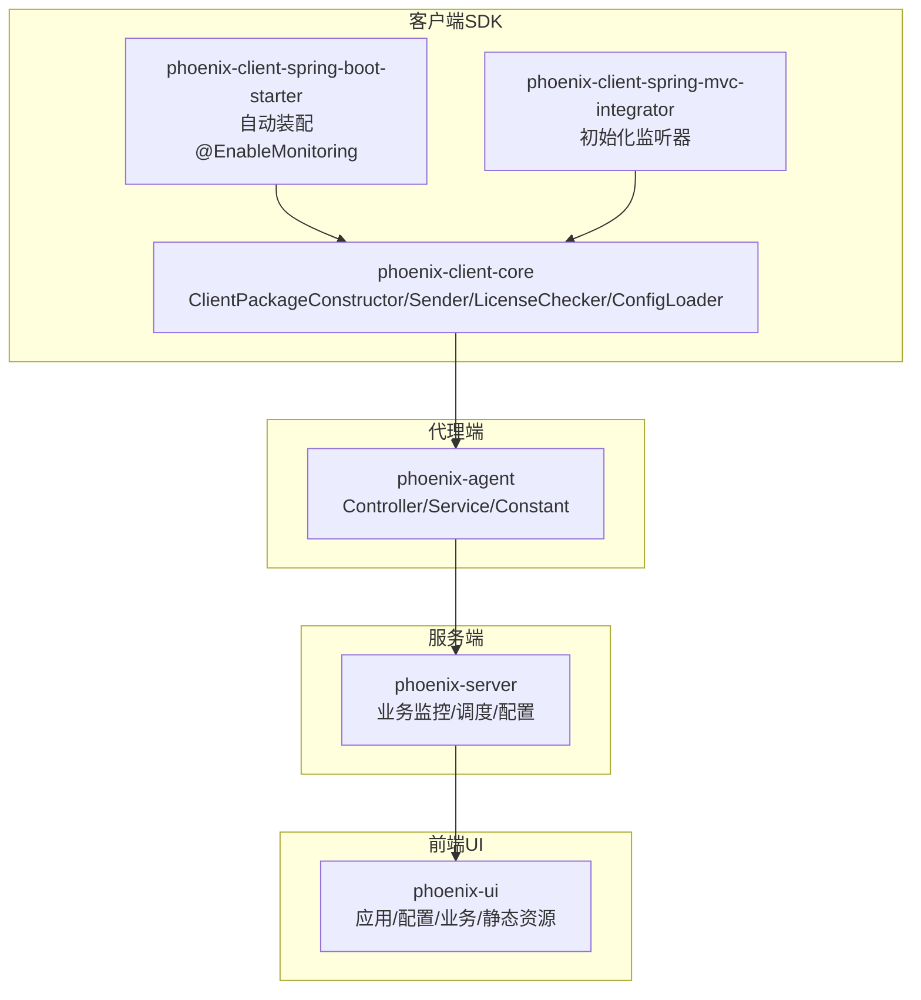
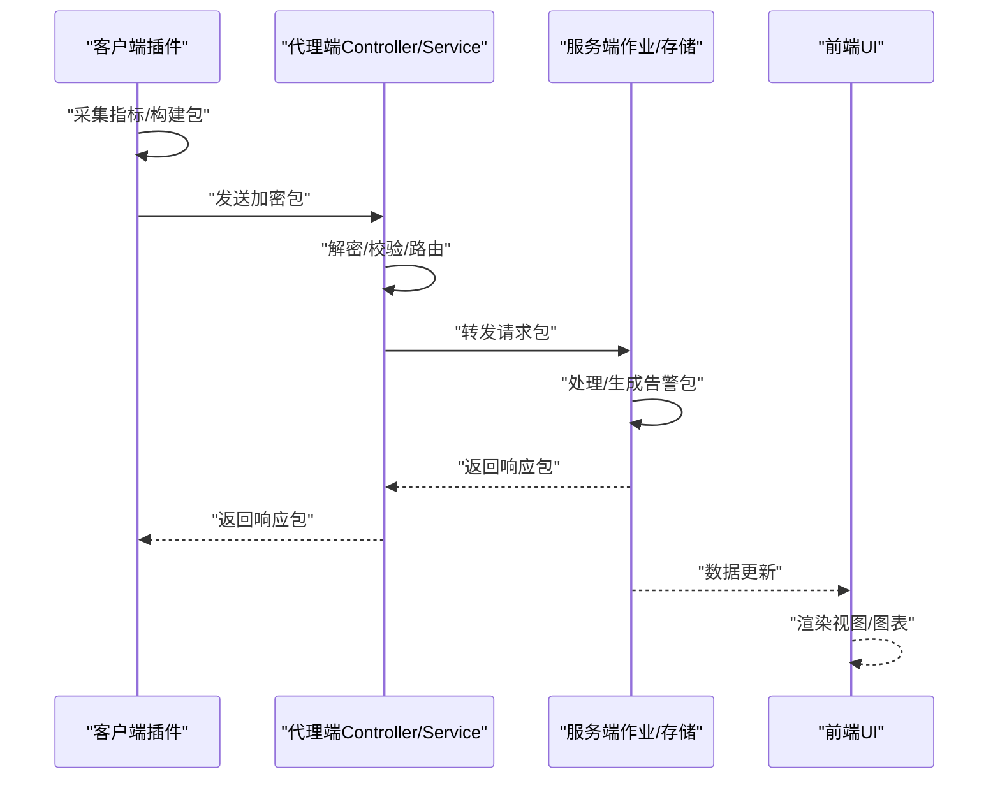
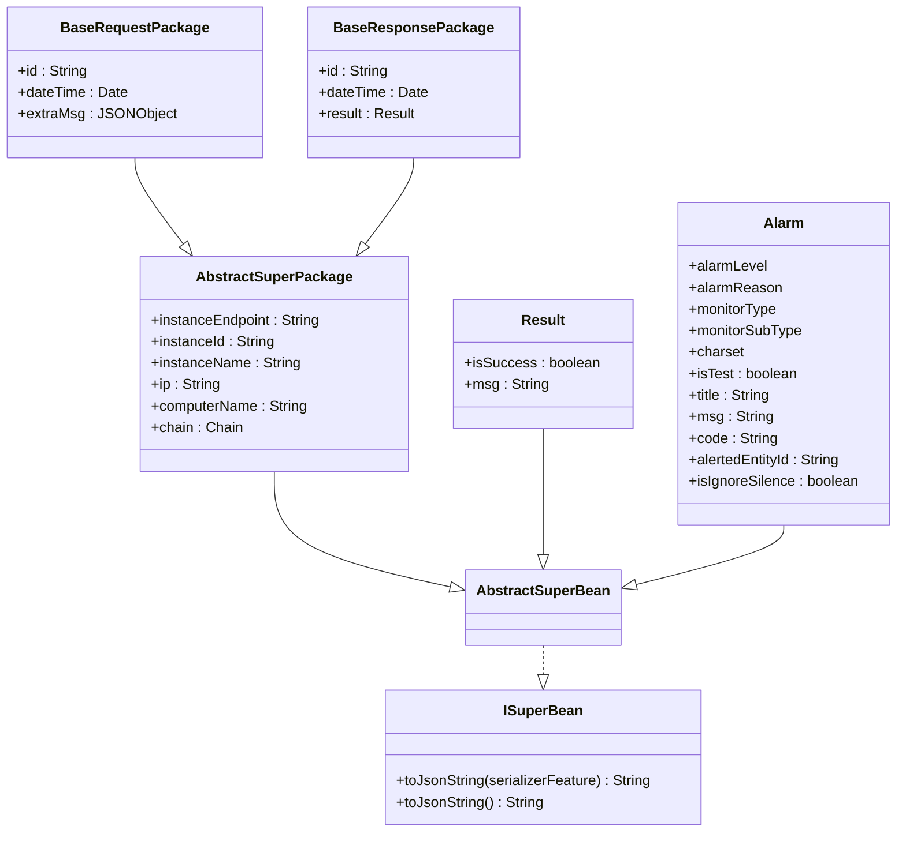
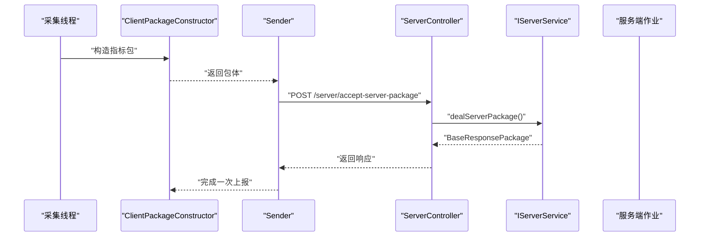
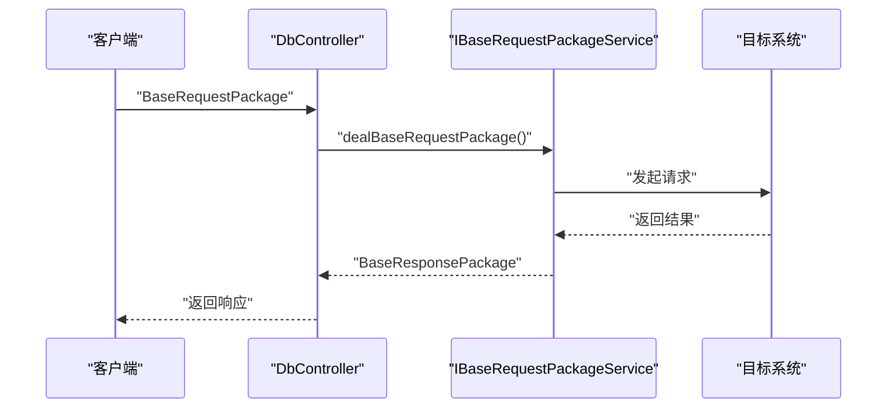
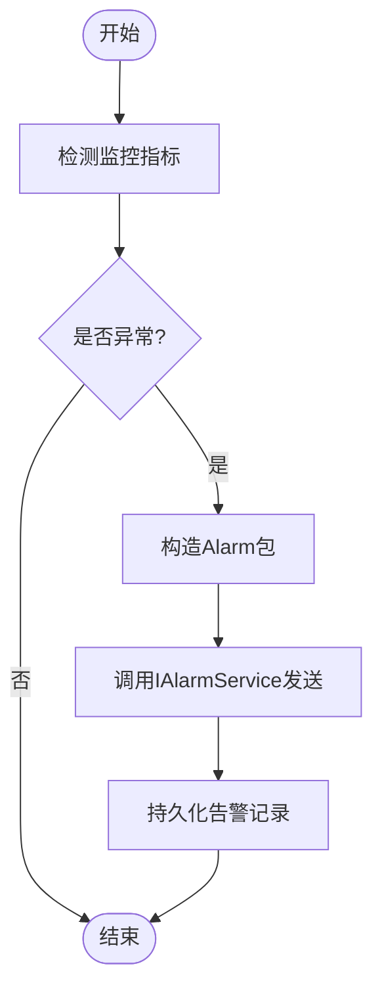
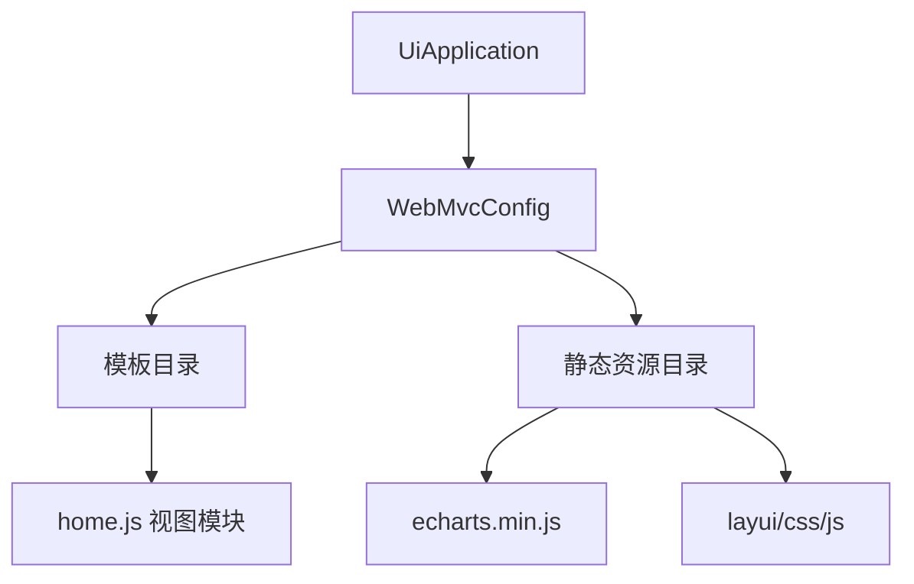
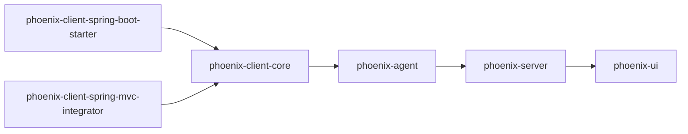

# 扩展开发

<cite>
**本文引用的文件**
- [ISuperBean.java](file://phoenix-common\phoenix-common-core\src\main\java\com\gitee\pifeng\monitoring\common\inf\ISuperBean.java)
- [AbstractSuperBean.java](file://phoenix-common\phoenix-common-core\src\main\java\com\gitee\pifeng\monitoring\common\abs\AbstractSuperBean.java)
- [AbstractSuperPackage.java](file://phoenix-common\phoenix-common-core\src\main\java\com\gitee\pifeng\monitoring\common\abs\AbstractSuperPackage.java)
- [Result.java](file://phoenix-common\phoenix-common-core\src\main\java\com\gitee\pifeng\monitoring\common\domain\Result.java)
- [BaseRequestPackage.java](file://phoenix-common\phoenix-common-core\src\main\java\com\gitee\pifeng\monitoring\common\dto\BaseRequestPackage.java)
- [BaseResponsePackage.java](file://phoenix-common\phoenix-common-core\src\main\java\com\gitee\pifeng\monitoring\common\dto\BaseResponsePackage.java)
- [Alarm.java](file://phoenix-common\phoenix-common-core\src\main\java\com\gitee\pifeng\monitoring\common\domain\Alarm.java)
- [AlarmReasonEnums.java](file://phoenix-common\phoenix-common-core\src\main\java\com\gitee\pifeng\monitoring\common\constant\alarm\AlarmReasonEnums.java)
- [ServerController.java](file://phoenix-agent\src\main\java\com\gitee\pifeng\monitoring\agent\business\client\controller\ServerController.java)
- [DbController.java](file://phoenix-agent\src\main\java\com\gitee\pifeng\monitoring\agent\business\client\controller\DbController.java)
- [DbSession4OracleController.java](file://phoenix-agent\src\main\java\com\gitee\pifeng\monitoring\agent\business\client\controller\DbSession4OracleController.java)
- [DbSession4MysqlController.java](file://phoenix-agent\src\main\java\com\gitee\pifeng\monitoring\agent\business\client\controller\DbSession4MysqlController.java)
- [DbTableSpace4OracleController.java](file://phoenix-agent\src\main\java\com\gitee\pifeng\monitoring\agent\business\client\controller\DbTableSpace4OracleController.java)
- [HttpMonitorJob.java](file://phoenix-server\src\main\java\com\gitee\pifeng\monitoring\server\business\server\monitor\http\HttpMonitorJob.java)
- [ServerPackage.java](file://phoenix-common\phoenix-common-core\src\main\java\com\gitee\pifeng\monitoring\common\dto\ServerPackage.java)
- [CiphertextPackage.java](file://phoenix-common\phoenix-common-core\src\main\java\com\gitee\pifeng\monitoring\common\dto\CiphertextPackage.java)
- [IAlarmService.java](file://phoenix-agent\src\main\java\com\gitee\pifeng\monitoring\agent\business\client\service\IAlarmService.java)
- [IServerService.java](file://phoenix-agent\src\main\java\com\gitee\pifeng\monitoring\agent\business\client\service\IServerService.java)
- [IBaseRequestPackageService.java](file://phoenix-agent\src\main\java\com\gitee\pifeng\monitoring\agent\business\client\service\IBaseRequestPackageService.java)
- [IHttpService.java](file://phoenix-agent\src\main\java\com\gitee\pifeng\monitoring\agent\business\server\service\IHttpService.java)
- [IJvmService.java](file://phoenix-agent\src\main\java\com\gitee\pifeng\monitoring\agent\business\server\service\IJvmService.java)
- [IOfflineService.java](file://phoenix-agent\src\main\java\com\gitee\pifeng\monitoring\agent\business\server\service\IOfflineService.java)
- [IHeartbeatService.java](file://phoenix-agent\src\main\java\com\gitee\pifeng\monitoring\agent\business\server\service\IHeartbeatService.java)
- [IAlarmService.java](file://phoenix-agent\src\main\java\com\gitee\pifeng\monitoring\agent\business\server\service\IAlarmService.java)
- [IHttpService.java](file://phoenix-agent\src\main\java\com\gitee\pifeng\monitoring\agent\business\client\service\IHttpService.java)
- [IJvmService.java](file://phoenix-agent\src\main\java\com\gitee\pifeng\monitoring\agent\business\client\service\IJvmService.java)
- [IOfflineService.java](file://phoenix-agent\src\main\java\com\gitee\pifeng\monitoring\agent\business\client\service\IOfflineService.java)
- [IHeartbeatService.java](file://phoenix-agent\src\main\java\com\gitee\pifeng\monitoring\agent\business\client\service\IHeartbeatService.java)
- [UiApplication.java](file://phoenix-ui\src\main\java\com\gitee\pifeng\monitoring\ui\UiApplication.java)
- [WebMvcConfig.java](file://phoenix-ui\src\main\java\com\gitee\pifeng\monitoring\ui\config\WebMvcConfig.java)
- [UiPackageConstructor.java](file://phoenix-ui\src\main\java\com\gitee\pifeng\monitoring\ui\core\UiPackageConstructor.java)
- [jquery.tagsinput.js](file://phoenix-ui\src\main\resources\static\lib\jquery-tags-input\jquery.tagsinput.js)
- [echarts.min.js](file://phoenix-ui\src\main\resources\static\js\echarts.min.js)
- [index.js](file://phoenix-ui\src\main\resources\static\lib\extend\index.js)
- [view.js](file://phoenix-ui\src\main\resources\static\lib\extend\view.js)
- [home.js](file://phoenix-ui\src\main\resources\static\modules\home.js)
- [phoenixAgent.xml](file://doc\WindowsServices\phoenix-agent\phoenixAgent.xml)
- [phoenixServer.xml](file://doc\WindowsServices\phoenix-server\phoenixServer.xml)
- [phoenixUI.xml](file://doc\WindowsServices\phoenix-ui\phoenixUI.xml)
- [MonitoringPlugAutoConfiguration.java](file://phoenix-client\phoenix-client-spring-boot-starter\src\main\java\com\gitee\pifeng\monitoring\starter\autoconfigure\MonitoringPlugAutoConfiguration.java)
- [EnableMonitoring.java](file://phoenix-client\phoenix-client-spring-boot-starter\src\main\java\com\gitee\pifeng\monitoring\starter\annotation\EnableMonitoring.java)
- [MonitoringSpringBootProperties.java](file://phoenix-client\phoenix-client-spring-boot-starter\src\main\java\com\gitee\pifeng\monitoring\starter\property\MonitoringSpringBootProperties.java)
- [MonitoringPlugInitializeListener.java](file://phoenix-client\phoenix-client-spring-mvc-integrator\src\main\java\com\gitee\pifeng\monitoring\integrator\listener\MonitoringPlugInitializeListener.java)
- [ClientPackageConstructor.java](file://phoenix-client\phoenix-client-core\src\main\java\com\gitee\pifeng\monitoring\plug\core\ClientPackageConstructor.java)
- [Sender.java](file://phoenix-client\phoenix-client-core\src\main\java\com\gitee\pifeng\monitoring\plug\core\Sender.java)
- [LicenseChecker.java](file://phoenix-client\phoenix-client-core\src\main\java\com\gitee\pifeng\monitoring\plug\core\LicenseChecker.java)
- [ConfigLoader.java](file://phoenix-client\phoenix-client-core\src\main\java\com\gitee\pifeng\monitoring\plug\core\ConfigLoader.java)
- [ThreadPoolAcquirer.java](file://phoenix-client\phoenix-client-core\src\main\java\com\gitee\pifeng\monitoring\plug\core\ThreadPoolAcquirer.java)
- [ShutdownHook.java](file://phoenix-client\phoenix-client-core\src\main\java\com\gitee\pifeng\monitoring\plug\core\ShutdownHook.java)
- [BusinessBuryingPointScheduler.java](file://phoenix-client\phoenix-client-core\src\main\java\com\gitee\pifeng\monitoring\plug\scheduler\BusinessBuryingPointScheduler.java)
- [HeartbeatTaskScheduler.java](file://phoenix-client\phoenix-client-core\src\main\java\com\gitee\pifeng\monitoring\plug\scheduler\HeartbeatTaskScheduler.java)
- [JvmTaskScheduler.java](file://phoenix-client\phoenix-client-core\src\main\java\com\gitee\pifeng\monitoring\plug\scheduler\JvmTaskScheduler.java)
- [ServerTaskScheduler.java](file://phoenix-client\phoenix-client-core\src\main\java\com\gitee\pifeng\monitoring\plug\scheduler\ServerTaskScheduler.java)
- [HeartbeatThread.java](file://phoenix-client\phoenix-client-core\src\main\java\com\gitee\pifeng\monitoring\plug\thread\HeartbeatThread.java)
- [JvmThread.java](file://phoenix-client\phoenix-client-core\src\main\java\com\gitee\pifeng\monitoring\plug\thread\JvmThread.java)
- [OfflineThread.java](file://phoenix-client\phoenix-client-core\src\main\java\com\gitee\pifeng\monitoring\plug\thread\OfflineThread.java)
- [ServerThread.java](file://phoenix-client\phoenix-client-core\src\main\java\com\gitee\pifeng\monitoring\plug\thread\ServerThread.java)
- [Monitor.java](file://phoenix-client\phoenix-client-core\src\main\java\com\gitee\pifeng\monitoring\plug\Monitor.java)
- [UrlConstants.java](file://phoenix-client\phoenix-client-core\src\main\java\com\gitee\pifeng\monitoring\plug\constant\UrlConstants.java)
- [UrlConstants.java](file://phoenix-agent\src\main\java\com\gitee\pifeng\monitoring\agent\constant\UrlConstants.java)
- [UrlConstants.java](file://phoenix-common\phoenix-common-core\src\main\java\com\gitee\pifeng\monitoring\common\constant\UrlConstants.java)
- [UrlConstants.java](file://phoenix-server\src\main\java\com\gitee\pifeng\monitoring\server\constant\phoenix\UrlConstants.java)
- [UrlConstants.java](file://phoenix-ui\src\main\java\com\gitee\pifeng\monitoring\ui\constant\UrlConstants.java)
</cite>

## 目录
1. [引言](#引言)
2. [项目结构](#项目结构)
3. [核心组件](#核心组件)
4. [架构总览](#架构总览)
5. [详细组件分析](#详细组件分析)
6. [依赖分析](#依赖分析)
7. [性能考虑](#性能考虑)
8. [故障排查指南](#故障排查指南)
9. [结论](#结论)
10. [附录](#附录)

## 引言
本文件面向Phoenix监控系统的扩展开发者，系统性阐述插件开发框架、监控指标与告警扩展、第三方系统集成、以及UI组件扩展的技术要点与最佳实践。重点围绕以下主题展开：
- 插件架构：ISuperBean接口设计理念、AbstractSuperBean抽象类继承体系、插件生命周期管理
- 自定义监控指标：数据模型设计、采集实现、上报机制、展示配置
- 第三方系统集成：现有监控系统对接、多数据格式适配、双向数据同步
- 告警扩展：新增告警渠道、自定义规则、智能告警
- UI扩展：自定义视图、第三方图表库集成、响应式设计
- 最佳实践：插件设计原则、性能优化、兼容性与版本管理

## 项目结构
Phoenix由四大部分组成：客户端SDK（phoenix-client）、代理端（phoenix-agent）、服务端（phoenix-server）、前端UI（phoenix-ui）。各模块通过统一的DTO/Domain模型进行数据交换，遵循“插件-代理-服务端-UI”的分层协作。

**图表来源**
- [MonitoringPlugAutoConfiguration.java](file://phoenix-client\phoenix-client-spring-boot-starter\src\main\java\com\gitee\pifeng\monitoring\starter\autoconfigure\MonitoringPlugAutoConfiguration.java)
- [MonitoringPlugInitializeListener.java](file://phoenix-client\phoenix-client-spring-mvc-integrator\src\main\java\com\gitee\pifeng\monitoring\integrator\listener\MonitoringPlugInitializeListener.java)
- [ClientPackageConstructor.java](file://phoenix-client\phoenix-client-core\src\main\java\com\gitee\pifeng\monitoring\plug\core\ClientPackageConstructor.java)
- [Sender.java](file://phoenix-client\phoenix-client-core\src\main\java\com\gitee\pifeng\monitoring\plug\core\Sender.java)
- [ServerController.java](file://phoenix-agent\src\main\java\com\gitee\pifeng\monitoring\agent\business\client\controller\ServerController.java)
- [UiApplication.java](file://phoenix-ui\src\main\java\com\gitee\pifeng\monitoring\ui\UiApplication.java)

**章节来源**
- [UiApplication.java](file://phoenix-ui\src\main\java\com\gitee\pifeng\monitoring\ui\UiApplication.java)
- [WebMvcConfig.java](file://phoenix-ui\src\main\java\com\gitee\pifeng\monitoring\ui\config\WebMvcConfig.java)
- [MonitoringPlugAutoConfiguration.java](file://phoenix-client\phoenix-client-spring-boot-starter\src\main\java\com\gitee\pifeng\monitoring\starter\autoconfigure\MonitoringPlugAutoConfiguration.java)
- [MonitoringPlugInitializeListener.java](file://phoenix-client\phoenix-client-spring-mvc-integrator\src\main\java\com\gitee\pifeng\monitoring\integrator\listener\MonitoringPlugInitializeListener.java)

## 核心组件
- 接口与抽象基类
  - ISuperBean：定义对象到JSON字符串的默认序列化能力，便于跨模块统一输出格式
  - AbstractSuperBean：继承ISuperBean，作为Domain/DTO的通用父类，提供统一的toString、equals/hashCode等契约
  - AbstractSuperPackage：继承AbstractSuperBean，封装实例标识、链路信息、IP、计算机名等通用包头字段，作为所有请求/响应包的基类
- 数据模型
  - Result：统一的成功/失败返回体
  - BaseRequestPackage/BaseResponsePackage：请求/响应包的通用结构
  - Alarm：告警实体，包含级别、原因、监控类型、标题、内容、编码、被告警主体ID等
- 控制器与服务
  - 代理端Controller负责接收客户端/服务端包，调用对应Service处理
  - 服务端通过调度器/作业执行监控任务，生成告警包并上报

**章节来源**
- [ISuperBean.java:14-43](file://phoenix-common\phoenix-common-core\src\main\java\com\gitee\pifeng\monitoring\common\inf\ISuperBean.java#L14-L43)
- [AbstractSuperBean.java:13-14](file://phoenix-common\phoenix-common-core\src\main\java\com\gitee\pifeng\monitoring\common\abs\AbstractSuperBean.java#L13-L14)
- [AbstractSuperPackage.java:19-71](file://phoenix-common\phoenix-common-core\src\main\java\com\gitee\pifeng\monitoring\common\abs\AbstractSuperPackage.java#L19-L71)
- [Result.java:15-34](file://phoenix-common\phoenix-common-core\src\main\java\com\gitee\pifeng\monitoring\common\domain\Result.java#L15-L34)
- [BaseRequestPackage.java:18-41](file://phoenix-common\phoenix-common-core\src\main\java\com\gitee\pifeng\monitoring\common\dto\BaseRequestPackage.java#L18-L41)
- [BaseResponsePackage.java:18-41](file://phoenix-common\phoenix-common-core\src\main\java\com\gitee\pifeng\monitoring\common\dto\BaseResponsePackage.java#L18-L41)
- [Alarm.java:21-116](file://phoenix-common\phoenix-common-core\src\main\java\com\gitee\pifeng\monitoring\common\domain\Alarm.java#L21-L116)

## 架构总览
Phoenix采用“客户端插件采集 -> 代理端收发 -> 服务端处理/存储 -> UI展示”的链路。客户端通过ClientPackageConstructor构造包体，经Sender发送；代理端Controller接收后交由Service处理；服务端作业生成告警包并持久化；UI通过WebMvcConfig暴露静态资源与模板，渲染监控视图。

**图表来源**
- [ClientPackageConstructor.java](file://phoenix-client\phoenix-client-core\src\main\java\com\gitee\pifeng\monitoring\plug\core\ClientPackageConstructor.java)
- [Sender.java](file://phoenix-client\phoenix-client-core\src\main\java\com\gitee\pifeng\monitoring\plug\core\Sender.java)
- [ServerController.java:50-53](file://phoenix-agent\src\main\java\com\gitee\pifeng\monitoring\agent\business\client\controller\ServerController.java#L50-L53)
- [IAlarmService.java](file://phoenix-agent\src\main\java\com\gitee\pifeng\monitoring\agent\business\server\service\IAlarmService.java)
- [UiApplication.java](file://phoenix-ui\src\main\java\com\gitee\pifeng\monitoring\ui\UiApplication.java)

## 详细组件分析

### 插件开发框架与生命周期
- 设计理念
  - ISuperBean提供统一的toJsonString能力，确保跨模块输出一致
  - AbstractSuperBean/AbstractSuperPackage作为所有Domain/DTO的基类，减少重复代码，增强契约一致性
- 生命周期管理
  - 客户端启动阶段通过@EnableMonitoring与自动装配完成初始化
  - 初始化监听器在Spring MVC容器启动时触发，确保线程池、定时任务、许可证检查等在应用启动后即位
  - 关闭钩子在JVM关闭时释放资源，保障优雅停机
- 关键路径
  - 启动注解与自动装配：[EnableMonitoring.java](file://phoenix-client\phoenix-client-spring-boot-starter\src\main\java\com\gitee\pifeng\monitoring\starter\annotation\EnableMonitoring.java)，[MonitoringPlugAutoConfiguration.java](file://phoenix-client\phoenix-client-spring-boot-starter\src\main\java\com\gitee\pifeng\monitoring\starter\autoconfigure\MonitoringPlugAutoConfiguration.java)
  - 初始化监听器：[MonitoringPlugInitializeListener.java](file://phoenix-client\phoenix-client-spring-mvc-integrator\src\main\java\com\gitee\pifeng\monitoring\integrator\listener\MonitoringPlugInitializeListener.java)
  - 包构造与发送：[ClientPackageConstructor.java](file://phoenix-client\phoenix-client-core\src\main\java\com\gitee\pifeng\monitoring\plug\core\ClientPackageConstructor.java)，[Sender.java](file://phoenix-client\phoenix-client-core\src\main\java\com\gitee\pifeng\monitoring\plug\core\Sender.java)
  - 线程与调度：[HeartbeatThread.java](file://phoenix-client\phoenix-client-core\src\main\java\com\gitee\pifeng\monitoring\plug\thread\HeartbeatThread.java)，[JvmThread.java](file://phoenix-client\phoenix-client-core\src\main\java\com\gitee\pifeng\monitoring\plug\thread\JvmThread.java)，[ServerThread.java](file://phoenix-client\phoenix-client-core\src\main\java\com\gitee\pifeng\monitoring\plug\thread\ServerThread.java)，[OfflineThread.java](file://phoenix-client\phoenix-client-core\src\main\java\com\gitee\pifeng\monitoring\plug\thread\OfflineThread.java)，[HeartbeatTaskScheduler.java](file://phoenix-client\phoenix-client-core\src\main\java\com\gitee\pifeng\monitoring\plug\scheduler\HeartbeatTaskScheduler.java)，[JvmTaskScheduler.java](file://phoenix-client\phoenix-client-core\src\main\java\com\gitee\pifeng\monitoring\plug\scheduler\JvmTaskScheduler.java)，[ServerTaskScheduler.java](file://phoenix-client\phoenix-client-core\src\main\java\com\gitee\pifeng\monitoring\plug\scheduler\ServerTaskScheduler.java)，[BusinessBuryingPointScheduler.java](file://phoenix-client\phoenix-client-core\src\main\java\com\gitee\pifeng\monitoring\plug\scheduler\BusinessBuryingPointScheduler.java)
  - 关闭钩子：[ShutdownHook.java](file://phoenix-client\phoenix-client-core\src\main\java\com\gitee\pifeng\monitoring\plug\core\ShutdownHook.java)
  - 配置与许可证：[ConfigLoader.java](file://phoenix-client\phoenix-client-core\src\main\java\com\gitee\pifeng\monitoring\plug\core\ConfigLoader.java)，[LicenseChecker.java](file://phoenix-client\phoenix-client-core\src\main\java\com\gitee\pifeng\monitoring\plug\core\LicenseChecker.java)

**图表来源**
- [ISuperBean.java:14-43](file://phoenix-common\phoenix-common-core\src\main\java\com\gitee\pifeng\monitoring\common\inf\ISuperBean.java#L14-L43)
- [AbstractSuperBean.java:13-14](file://phoenix-common\phoenix-common-core\src\main\java\com\gitee\pifeng\monitoring\common\abs\AbstractSuperBean.java#L13-L14)
- [AbstractSuperPackage.java:19-71](file://phoenix-common\phoenix-common-core\src\main\java\com\gitee\pifeng\monitoring\common\abs\AbstractSuperPackage.java#L19-L71)
- [Result.java:15-34](file://phoenix-common\phoenix-common-core\src\main\java\com\gitee\pifeng\monitoring\common\domain\Result.java#L15-L34)
- [BaseRequestPackage.java:18-41](file://phoenix-common\phoenix-common-core\src\main\java\com\gitee\pifeng\monitoring\common\dto\BaseRequestPackage.java#L18-L41)
- [BaseResponsePackage.java:18-41](file://phoenix-common\phoenix-common-core\src\main\java\com\gitee\pifeng\monitoring\common\dto\BaseResponsePackage.java#L18-L41)
- [Alarm.java:21-116](file://phoenix-common\phoenix-common-core\src\main\java\com\gitee\pifeng\monitoring\common\domain\Alarm.java#L21-L116)

**章节来源**
- [ISuperBean.java:14-43](file://phoenix-common\phoenix-common-core\src\main\java\com\gitee\pifeng\monitoring\common\inf\ISuperBean.java#L14-L43)
- [AbstractSuperBean.java:13-14](file://phoenix-common\phoenix-common-core\src\main\java\com\gitee\pifeng\monitoring\common\abs\AbstractSuperBean.java#L13-L14)
- [AbstractSuperPackage.java:19-71](file://phoenix-common\phoenix-common-core\src\main\java\com\gitee\pifeng\monitoring\common\abs\AbstractSuperPackage.java#L19-L71)
- [Result.java:15-34](file://phoenix-common\phoenix-common-core\src\main\java\com\gitee\pifeng\monitoring\common\domain\Result.java#L15-L34)
- [BaseRequestPackage.java:18-41](file://phoenix-common\phoenix-common-core\src\main\java\com\gitee\pifeng\monitoring\common\dto\BaseRequestPackage.java#L18-L41)
- [BaseResponsePackage.java:18-41](file://phoenix-common\phoenix-common-core\src\main\java\com\gitee\pifeng\monitoring\common\dto\BaseResponsePackage.java#L18-L41)
- [Alarm.java:21-116](file://phoenix-common\phoenix-common-core\src\main\java\com\gitee\pifeng\monitoring\common\domain\Alarm.java#L21-L116)

### 自定义监控指标开发指南
- 数据模型设计
  - 使用AbstractSuperBean作为父类，确保统一序列化与契约
  - 请求/响应包使用AbstractSuperPackage扩展，统一携带实例标识、链路信息、IP等
- 数据采集实现
  - 通过线程/调度器周期性采集指标，构造包体并通过ClientPackageConstructor封装
  - 采集线程：[HeartbeatThread.java](file://phoenix-client\phoenix-client-core\src\main\java\com\gitee\pifeng\monitoring\plug\thread\HeartbeatThread.java)，[JvmThread.java](file://phoenix-client\phoenix-client-core\src\main\java\com\gitee\pifeng\monitoring\plug\thread\JvmThread.java)，[ServerThread.java](file://phoenix-client\phoenix-client-core\src\main\java\com\gitee\pifeng\monitoring\plug\thread\ServerThread.java)，[OfflineThread.java](file://phoenix-client\phoenix-client-core\src\main\java\com\gitee\pifeng\monitoring\plug\thread\OfflineThread.java)
  - 采集调度：[HeartbeatTaskScheduler.java](file://phoenix-client\phoenix-client-core\src\main\java\com\gitee\pifeng\monitoring\plug\scheduler\HeartbeatTaskScheduler.java)，[JvmTaskScheduler.java](file://phoenix-client\phoenix-client-core\src\main\java\com\gitee\pifeng\monitoring\plug\scheduler\JvmTaskScheduler.java)，[ServerTaskScheduler.java](file://phoenix-client\phoenix-client-core\src\main\java\com\gitee\pifeng\monitoring\plug\scheduler\ServerTaskScheduler.java)，[BusinessBuryingPointScheduler.java](file://phoenix-client\phoenix-client-core\src\main\java\com\gitee\pifeng\monitoring\plug\scheduler\BusinessBuryingPointScheduler.java)
- 数据上报机制
  - 通过Sender发送到代理端，代理端Controller接收并调用Service处理
  - 示例：服务器包接收与响应 [ServerController.java:50-53](file://phoenix-agent\src\main\java\com\gitee\pifeng\monitoring\agent\business\client\controller\ServerController.java#L50-L53)
- 指标展示配置
  - UI通过WebMvcConfig暴露静态资源与模板，前端模块按需加载脚本与样式
  - 参考：[WebMvcConfig.java](file://phoenix-ui\src\main\java\com\gitee\pifeng\monitoring\ui\config\WebMvcConfig.java)，[home.js](file://phoenix-ui\src\main\resources\static\modules\home.js)

**图表来源**
- [ClientPackageConstructor.java](file://phoenix-client\phoenix-client-core\src\main\java\com\gitee\pifeng\monitoring\plug\core\ClientPackageConstructor.java)
- [Sender.java](file://phoenix-client\phoenix-client-core\src\main\java\com\gitee\pifeng\monitoring\plug\core\Sender.java)
- [ServerController.java:50-53](file://phoenix-agent\src\main\java\com\gitee\pifeng\monitoring\agent\business\client\controller\ServerController.java#L50-L53)
- [IServerService.java](file://phoenix-agent\src\main\java\com\gitee\pifeng\monitoring\agent\business\client\service\IServerService.java)

**章节来源**
- [ClientPackageConstructor.java](file://phoenix-client\phoenix-client-core\src\main\java\com\gitee\pifeng\monitoring\plug\core\ClientPackageConstructor.java)
- [Sender.java](file://phoenix-client\phoenix-client-core\src\main\java\com\gitee\pifeng\monitoring\plug\core\Sender.java)
- [ServerController.java:50-53](file://phoenix-agent\src\main\java\com\gitee\pifeng\monitoring\agent\business\client\controller\ServerController.java#L50-L53)
- [IServerService.java](file://phoenix-agent\src\main\java\com\gitee\pifeng\monitoring\agent\business\client\service\IServerService.java)
- [WebMvcConfig.java](file://phoenix-ui\src\main\java\com\gitee\pifeng\monitoring\ui\config\WebMvcConfig.java)
- [home.js](file://phoenix-ui\src\main\resources\static\modules\home.js)

### 第三方系统集成方法
- 集成现有监控系统
  - 通过IBaseRequestPackageService对接不同目标系统，如数据库、HTTP、TCP等
  - 示例：数据库连通性测试 [DbController.java:55-58](file://phoenix-agent\src\main\java\com\gitee\pifeng\monitoring\agent\business\client\controller\DbController.java#L55-L58)，Oracle会话列表 [DbSession4OracleController.java:54-56](file://phoenix-agent\src\main\java\com\gitee\pifeng\monitoring\agent\business\client\controller\DbSession4OracleController.java#L54-L56)，MySQL会话列表 [DbSession4MysqlController.java:32-36](file://phoenix-agent\src\main\java\com\gitee\pifeng\monitoring\agent\business\client\controller\DbSession4MysqlController.java#L32-L36)，Oracle表空间 [DbTableSpace4OracleController.java:31-36](file://phoenix-agent\src\main\java\com\gitee\pifeng\monitoring\agent\business\client\controller\DbTableSpace4OracleController.java#L31-L36)
- 适配不同数据格式
  - 统一使用BaseRequestPackage/BaseResponsePackage作为载体，内部通过JSONObject/枚举控制格式
  - 加解密通过CiphertextPackage与代理端的加解密切面配合
- 双向数据同步
  - 代理端Controller接收请求包，调用IBaseRequestPackageService处理后返回BaseResponsePackage
  - 服务端作业可基于相同包结构进行回传或持久化

**图表来源**
- [DbController.java:55-58](file://phoenix-agent\src\main\java\com\gitee\pifeng\monitoring\agent\business\client\controller\DbController.java#L55-L58)
- [DbSession4OracleController.java:54-56](file://phoenix-agent\src\main\java\com\gitee\pifeng\monitoring\agent\business\client\controller\DbSession4OracleController.java#L54-L56)
- [DbSession4MysqlController.java:32-36](file://phoenix-agent\src\main\java\com\gitee\pifeng\monitoring\agent\business\client\controller\DbSession4MysqlController.java#L32-L36)
- [DbTableSpace4OracleController.java:31-36](file://phoenix-agent\src\main\java\com\gitee\pifeng\monitoring\agent\business\client\controller\DbTableSpace4OracleController.java#L31-L36)
- [IBaseRequestPackageService.java](file://phoenix-agent\src\main\java\com\gitee\pifeng\monitoring\agent\business\client\service\IBaseRequestPackageService.java)

**章节来源**
- [DbController.java:55-58](file://phoenix-agent\src\main\java\com\gitee\pifeng\monitoring\agent\business\client\controller\DbController.java#L55-L58)
- [DbSession4OracleController.java:54-56](file://phoenix-agent\src\main\java\com\gitee\pifeng\monitoring\agent\business\client\controller\DbSession4OracleController.java#L54-L56)
- [DbSession4MysqlController.java:32-36](file://phoenix-agent\src\main\java\com\gitee\pifeng\monitoring\agent\business\client\controller\DbSession4MysqlController.java#L32-L36)
- [DbTableSpace4OracleController.java:31-36](file://phoenix-agent\src\main\java\com\gitee\pifeng\monitoring\agent\business\client\controller\DbTableSpace4OracleController.java#L31-L36)
- [IBaseRequestPackageService.java](file://phoenix-agent\src\main\java\com\gitee\pifeng\monitoring\agent\business\client\service\IBaseRequestPackageService.java)

### 告警扩展开发
- 新增告警渠道
  - 通过IAlarmService接口扩展告警发送逻辑，支持邮件、短信、IM等
  - 服务端作业在检测到异常时构造Alarm包并调用告警服务
- 自定义告警规则
  - Alarm实体支持级别、原因、监控类型、编码、标题、内容等字段，满足灵活配置
  - 告警原因枚举：[AlarmReasonEnums.java:11-33](file://phoenix-common\phoenix-common-core\src\main\java\com\gitee\pifeng\monitoring\common\constant\alarm\AlarmReasonEnums.java#L11-L33)
- 智能告警
  - 结合监控类型与子类型，服务端作业在异常/恢复场景下生成告警包并上报
  - 示例：HTTP服务监控作业在异常时构造告警包 [HttpMonitorJob.java:458-467](file://phoenix-server\src\main\java\com\gitee\pifeng\monitoring\server\business\server\monitor\http\HttpMonitorJob.java#L458-L467)

**图表来源**
- [Alarm.java:21-116](file://phoenix-common\phoenix-common-core\src\main\java\com\gitee\pifeng\monitoring\common\domain\Alarm.java#L21-L116)
- [AlarmReasonEnums.java:11-33](file://phoenix-common\phoenix-common-core\src\main\java\com\gitee\pifeng\monitoring\common\constant\alarm\AlarmReasonEnums.java#L11-L33)
- [HttpMonitorJob.java:458-467](file://phoenix-server\src\main\java\com\gitee\pifeng\monitoring\server\business\server\monitor\http\HttpMonitorJob.java#L458-L467)
- [IAlarmService.java](file://phoenix-agent\src\main\java\com\gitee\pifeng\monitoring\agent\business\server\service\IAlarmService.java)

**章节来源**
- [Alarm.java:21-116](file://phoenix-common\phoenix-common-core\src\main\java\com\gitee\pifeng\monitoring\common\domain\Alarm.java#L21-L116)
- [AlarmReasonEnums.java:11-33](file://phoenix-common\phoenix-common-core\src\main\java\com\gitee\pifeng\monitoring\common\constant\alarm\AlarmReasonEnums.java#L11-L33)
- [HttpMonitorJob.java:458-467](file://phoenix-server\src\main\java\com\gitee\pifeng\monitoring\server\business\server\monitor\http\HttpMonitorJob.java#L458-L467)
- [IAlarmService.java](file://phoenix-agent\src\main\java\com\gitee\pifeng\monitoring\agent\business\server\service\IAlarmService.java)

### 自定义UI组件开发
- 开发新的监控视图
  - 在phoenix-ui中新增模板与模块JS，通过WebMvcConfig注册静态资源与模板路径
  - 参考：[WebMvcConfig.java](file://phoenix-ui\src\main\java\com\gitee\pifeng\monitoring\ui\config\WebMvcConfig.java)，[home.js](file://phoenix-ui\src\main\resources\static\modules\home.js)
- 集成第三方图表库
  - ECharts已内置，可在页面中按需引入 [echarts.min.js](file://phoenix-ui\src\main\resources\static\js\echarts.min.js)
  - 支持通过模块JS调用ECharts进行可视化渲染
- 响应式设计
  - UI采用Layui等前端框架，结合CSS与JS实现响应式布局
  - 可通过扩展index.js/view.js等入口脚本实现组件化与交互增强
  - 参考：[index.js](file://phoenix-ui\src\main\resources\static\lib\extend\index.js)，[view.js](file://phoenix-ui\src\main\resources\static\lib\extend\view.js)

**图表来源**
- [UiApplication.java](file://phoenix-ui\src\main\java\com\gitee\pifeng\monitoring\ui\UiApplication.java)
- [WebMvcConfig.java](file://phoenix-ui\src\main\java\com\gitee\pifeng\monitoring\ui\config\WebMvcConfig.java)
- [echarts.min.js](file://phoenix-ui\src\main\resources\static\js\echarts.min.js)
- [index.js](file://phoenix-ui\src\main\resources\static\lib\extend\index.js)
- [view.js](file://phoenix-ui\src\main\resources\static\lib\extend\view.js)
- [home.js](file://phoenix-ui\src\main\resources\static\modules\home.js)

**章节来源**
- [UiApplication.java](file://phoenix-ui\src\main\java\com\gitee\pifeng\monitoring\ui\UiApplication.java)
- [WebMvcConfig.java](file://phoenix-ui\src\main\java\com\gitee\pifeng\monitoring\ui\config\WebMvcConfig.java)
- [echarts.min.js](file://phoenix-ui\src\main\resources\static\js\echarts.min.js)
- [index.js](file://phoenix-ui\src\main\resources\static\lib\extend\index.js)
- [view.js](file://phoenix-ui\src\main\resources\static\lib\extend\view.js)
- [home.js](file://phoenix-ui\src\main\resources\static\modules\home.js)

### 插件生命周期管理
- 启动阶段
  - @EnableMonitoring启用插件自动装配，初始化线程池与调度器
  - 监听器在容器启动时触发，确保插件在应用启动后即刻生效
- 运行阶段
  - 各采集线程与调度器按计划执行，定期上报指标
- 关闭阶段
  - 通过ShutdownHook释放资源，确保优雅停机

**章节来源**
- [EnableMonitoring.java](file://phoenix-client\phoenix-client-spring-boot-starter\src\main\java\com\gitee\pifeng\monitoring\starter\annotation\EnableMonitoring.java)
- [MonitoringPlugAutoConfiguration.java](file://phoenix-client\phoenix-client-spring-boot-starter\src\main\java\com\gitee\pifeng\monitoring\starter\autoconfigure\MonitoringPlugAutoConfiguration.java)
- [MonitoringPlugInitializeListener.java](file://phoenix-client\phoenix-client-spring-mvc-integrator\src\main\java\com\gitee\pifeng\monitoring\integrator\listener\MonitoringPlugInitializeListener.java)
- [ShutdownHook.java](file://phoenix-client\phoenix-client-core\src\main\java\com\gitee\pifeng\monitoring\plug\core\ShutdownHook.java)

## 依赖分析
- 模块间耦合
  - 客户端SDK与代理端通过统一DTO/Domain模型通信，降低耦合度
  - 代理端Controller仅负责路由与编排，具体业务由Service实现，职责清晰
  - 服务端作业与UI通过数据持久化与模板渲染间接耦合
- 外部依赖
  - FastJSON用于序列化，ECharts用于可视化，Layui用于UI组件
  - Windows服务配置文件用于服务化部署与扩展

**图表来源**
- [MonitoringPlugAutoConfiguration.java](file://phoenix-client\phoenix-client-spring-boot-starter\src\main\java\com\gitee\pifeng\monitoring\starter\autoconfigure\MonitoringPlugAutoConfiguration.java)
- [MonitoringPlugInitializeListener.java](file://phoenix-client\phoenix-client-spring-mvc-integrator\src\main\java\com\gitee\pifeng\monitoring\integrator\listener\MonitoringPlugInitializeListener.java)
- [ServerController.java:50-53](file://phoenix-agent\src\main\java\com\gitee\pifeng\monitoring\agent\business\client\controller\ServerController.java#L50-L53)
- [UiApplication.java](file://phoenix-ui\src\main\java\com\gitee\pifeng\monitoring\ui\UiApplication.java)

**章节来源**
- [MonitoringPlugAutoConfiguration.java](file://phoenix-client\phoenix-client-spring-boot-starter\src\main\java\com\gitee\pifeng\monitoring\starter\autoconfigure\MonitoringPlugAutoConfiguration.java)
- [MonitoringPlugInitializeListener.java](file://phoenix-client\phoenix-client-spring-mvc-integrator\src\main\java\com\gitee\pifeng\monitoring\integrator\listener\MonitoringPlugInitializeListener.java)
- [ServerController.java:50-53](file://phoenix-agent\src\main\java\com\gitee\pifeng\monitoring\agent\business\client\controller\ServerController.java#L50-L53)
- [UiApplication.java](file://phoenix-ui\src\main\java\com\gitee\pifeng\monitoring\ui\UiApplication.java)

## 性能考虑
- 序列化开销
  - 使用ISuperBean统一JSON序列化，避免重复实现，提升一致性与可维护性
- 线程与调度
  - 合理配置线程池大小与调度周期，避免频繁GC与上下文切换
- 网络传输
  - 通过CiphertextPackage与代理端加解密切面，减少明文传输风险与带宽浪费
- 前端渲染
  - 图表库按需加载，避免一次性加载过多资源导致首屏延迟

## 故障排查指南
- 插件初始化问题
  - 检查@EnableMonitoring与自动装配是否生效，确认初始化监听器是否触发
- 采集线程异常
  - 查看线程池状态与调度器日志，定位阻塞或异常抛出点
- 上报失败
  - 核对URL常量与目标地址，确认代理端Controller是否正确接收与返回
- 告警未达
  - 检查告警原因与级别配置，确认IAlarmService实现与外部通道可用性
- UI渲染异常
  - 检查静态资源路径与模板加载，确认ECharts脚本与模块JS加载顺序

**章节来源**
- [EnableMonitoring.java](file://phoenix-client\phoenix-client-spring-boot-starter\src\main\java\com\gitee\pifeng\monitoring\starter\annotation\EnableMonitoring.java)
- [MonitoringPlugAutoConfiguration.java](file://phoenix-client\phoenix-client-spring-boot-starter\src\main\java\com\gitee\pifeng\monitoring\starter\autoconfigure\MonitoringPlugAutoConfiguration.java)
- [MonitoringPlugInitializeListener.java](file://phoenix-client\phoenix-client-spring-mvc-integrator\src\main\java\com\gitee\pifeng\monitoring\integrator\listener\MonitoringPlugInitializeListener.java)
- [UrlConstants.java](file://phoenix-agent\src\main\java\com\gitee\pifeng\monitoring\agent\constant\UrlConstants.java)
- [UrlConstants.java](file://phoenix-common\phoenix-common-core\src\main\java\com\gitee\pifeng\monitoring\common\constant\UrlConstants.java)
- [UrlConstants.java](file://phoenix-server\src\main\java\com\gitee\pifeng\monitoring\server\constant\phoenix\UrlConstants.java)
- [UrlConstants.java](file://phoenix-ui\src\main\java\com\gitee\pifeng\monitoring\ui\constant\UrlConstants.java)

## 结论
Phoenix监控系统通过统一的接口与抽象基类、规范的数据包结构、清晰的插件生命周期与服务化架构，为扩展开发提供了稳定且可演进的基础。开发者可在此基础上快速实现自定义监控指标、接入第三方系统、扩展告警渠道与UI组件，并遵循最佳实践确保性能与稳定性。

## 附录
- 服务化部署参考
  - Windows服务配置：[phoenixAgent.xml](file://doc\WindowsServices\phoenix-agent\phoenixAgent.xml)，[phoenixServer.xml](file://doc\WindowsServices\phoenix-server\phoenixServer.xml)，[phoenixUI.xml](file://doc\WindowsServices\phoenix-ui\phoenixUI.xml)
- 前端组件示例
  - 标签输入组件：[jquery.tagsinput.js](file://phoenix-ui\src\main\resources\static\lib\jquery-tags-input\jquery.tagsinput.js)