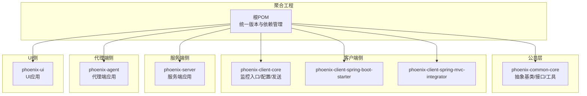
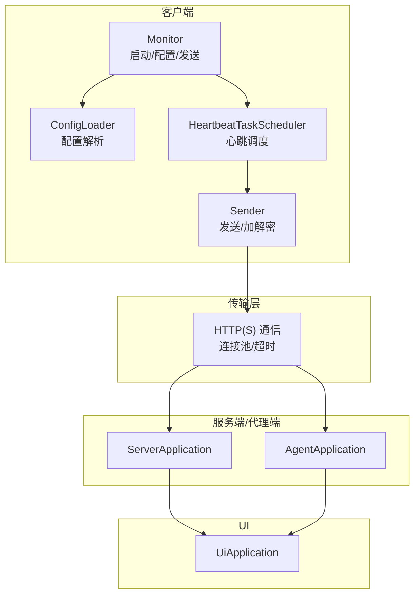
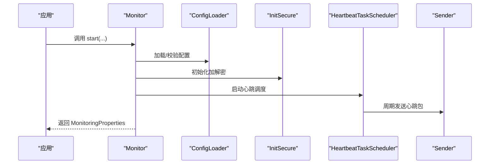
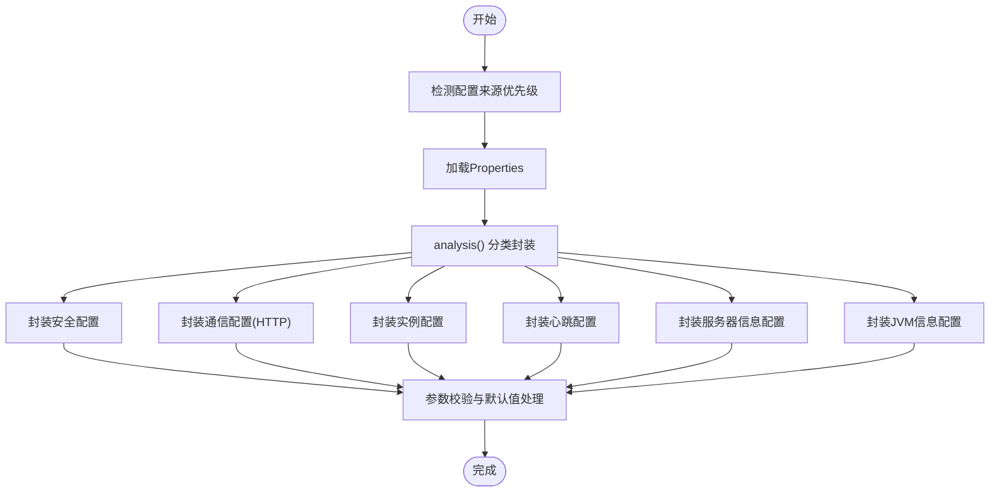
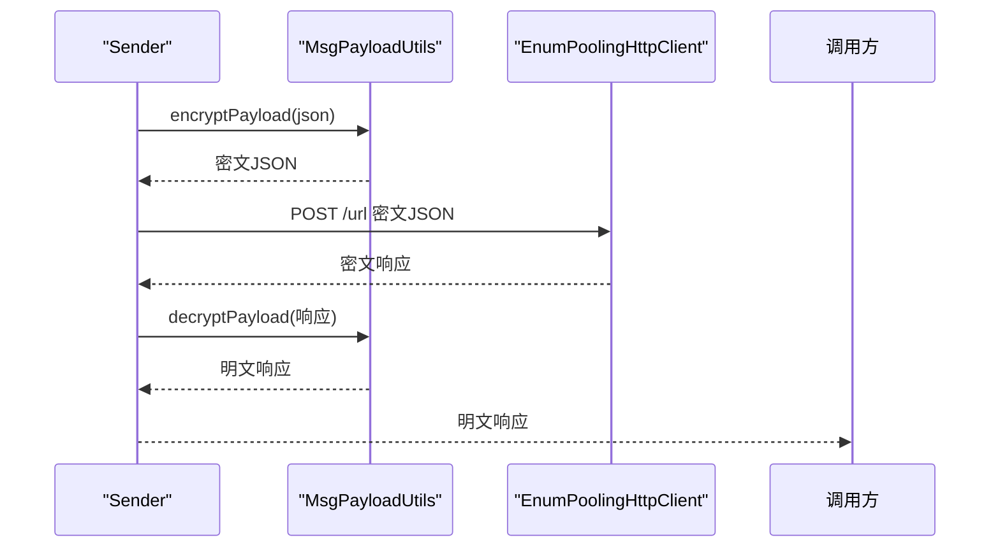
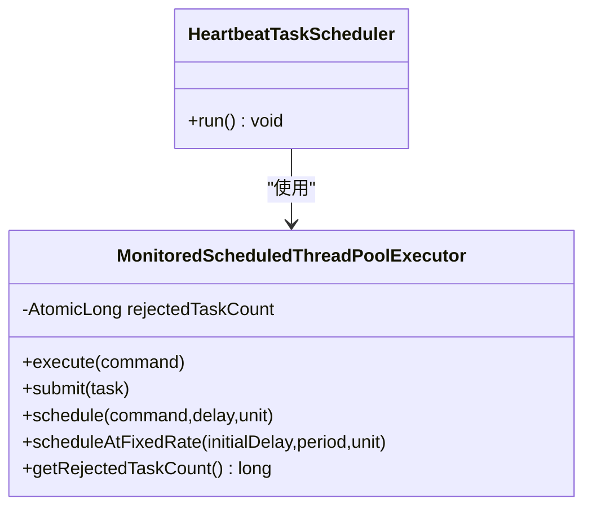
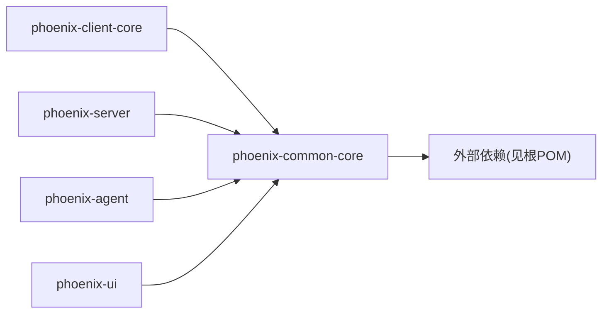

# 扩展开发最佳实践

<cite>
**本文档引用的文件**
- [pom.xml](file://pom.xml)
- [AgentApplication.java](file://phoenix-agent/src/main/java/com/gitee/pifeng/monitoring/agent/AgentApplication.java)
- [ServerApplication.java](file://phoenix-server/src/main/java/com/gitee/pifeng/monitoring/server/ServerApplication.java)
- [UiApplication.java](file://phoenix-ui/src/main/java/com/gitee/pifeng/monitoring/ui/UiApplication.java)
- [Monitor.java](file://phoenix-client/phoenix-client-core/src/main/java/com/gitee/pifeng/monitoring/plug/Monitor.java)
- [ConfigLoader.java](file://phoenix-client/phoenix-client-core/src/main/java/com/gitee/pifeng/monitoring/plug/core/ConfigLoader.java)
- [Sender.java](file://phoenix-client/phoenix-client-core/src/main/java/com/gitee/pifeng/monitoring/plug/core/Sender.java)
- [IPackageConstructor.java](file://phoenix-common/phoenix-common-core/src/main/java/com/gitee/pifeng/monitoring/common/inf/IPackageConstructor.java)
- [AbstractSuperBean.java](file://phoenix-common/phoenix-common-core/src/main/java/com/gitee/pifeng/monitoring/common/abs/AbstractSuperBean.java)
- [InitSecure.java](file://phoenix-common/phoenix-common-core/src/main/java/com/gitee/pifeng/monitoring/common/init/InitSecure.java)
- [MsgPayloadUtils.java](file://phoenix-common/phoenix-common-core/src/main/java/com/gitee/pifeng/monitoring/common/util/MsgPayloadUtils.java)
- [MonitoredScheduledThreadPoolExecutor.java](file://phoenix-common/phoenix-common-core/src/main/java/com/gitee/pifeng/monitoring/common/threadpool/MonitoredScheduledThreadPoolExecutor.java)
- [HeartbeatTaskScheduler.java](file://phoenix-client/phoenix-client-core/src/main/java/com/gitee/pifeng/monitoring/plug/scheduler/HeartbeatTaskScheduler.java)
- [LicenseCheckerTest.java](file://phoenix-client/phoenix-client-core/src/test/java/com/gitee/pifeng/monitoring/plug/core/LicenseCheckerTest.java)
</cite>

## 目录
1. [引言](#引言)
2. [项目结构](#项目结构)
3. [核心组件](#核心组件)
4. [架构总览](#架构总览)
5. [详细组件分析](#详细组件分析)
6. [依赖分析](#依赖分析)
7. [性能考虑](#性能考虑)
8. [兼容性保障](#兼容性保障)
9. [版本管理规范](#版本管理规范)
10. [代码质量保证](#代码质量保证)
11. [安全考虑](#安全考虑)
12. [调试与监控](#调试与监控)
13. [结论](#结论)

## 引言
本指南面向Phoenix监控系统的扩展开发者，围绕插件设计原则、性能优化、兼容性、版本管理、质量保证、安全与调试监控等方面，提供可落地的最佳实践。文档结合实际代码模块，给出架构视图、流程图与类图，帮助读者快速理解并高效扩展Phoenix生态。

## 项目结构
Phoenix采用多模块Maven聚合工程组织，包含公共模块、客户端、服务端、代理端与UI端，各模块职责清晰、边界明确，便于按需扩展与独立演进。

图表来源
- [pom.xml:11-22](file://pom.xml#L11-L22)

章节来源
- [pom.xml:11-22](file://pom.xml#L11-L22)

## 核心组件
- 应用入口：三端均提供独立Spring Boot入口，负责应用启动、组件扫描与基础配置。
- 客户端监控：Monitor作为统一入口，负责配置加载、许可证校验、定时任务调度与数据发送。
- 包构造与协议：IPackageConstructor定义跨端数据包构造契约；MsgPayloadUtils负责消息加解密与压缩。
- 线程池与调度：MonitoredScheduledThreadPoolExecutor提供受监控的调度线程池；HeartbeatTaskScheduler等负责周期任务。
- 安全初始化：InitSecure通过反射读取配置，完成加解密能力初始化。

章节来源
- [AgentApplication.java:28-37](file://phoenix-agent/src/main/java/com/gitee/pifeng/monitoring/agent/AgentApplication.java#L28-L37)
- [ServerApplication.java:36-45](file://phoenix-server/src/main/java/com/gitee/pifeng/monitoring/server/ServerApplication.java#L36-L45)
- [UiApplication.java:37-46](file://phoenix-ui/src/main/java/com/gitee/pifeng/monitoring/ui/UiApplication.java#L37-L46)
- [Monitor.java:67-151](file://phoenix-client/phoenix-client-core/src/main/java/com/gitee/pifeng/monitoring/plug/Monitor.java#L67-L151)
- [IPackageConstructor.java:22-113](file://phoenix-common/phoenix-common-core/src/main/java/com/gitee/pifeng/monitoring/common/inf/IPackageConstructor.java#L22-L113)
- [MsgPayloadUtils.java:42-73](file://phoenix-common/phoenix-common-core/src/main/java/com/gitee/pifeng/monitoring/common/util/MsgPayloadUtils.java#L42-L73)
- [MonitoredScheduledThreadPoolExecutor.java:34-91](file://phoenix-common/phoenix-common-core/src/main/java/com/gitee/pifeng/monitoring/common/threadpool/MonitoredScheduledThreadPoolExecutor.java#L34-L91)
- [HeartbeatTaskScheduler.java:39-43](file://phoenix-client/phoenix-client-core/src/main/java/com/gitee/pifeng/monitoring/plug/scheduler/HeartbeatTaskScheduler.java#L39-L43)

## 架构总览
Phoenix采用“客户端采集—代理/服务端传输—UI展示”的三层架构。客户端通过统一入口启动，按配置周期采集并发送数据；服务端/代理端接收、处理并持久化；UI端提供可视化与管理界面。

图表来源
- [Monitor.java:119-151](file://phoenix-client/phoenix-client-core/src/main/java/com/gitee/pifeng/monitoring/plug/Monitor.java#L119-L151)
- [ConfigLoader.java:95-154](file://phoenix-client/phoenix-client-core/src/main/java/com/gitee/pifeng/monitoring/plug/core/ConfigLoader.java#L95-L154)
- [Sender.java:42-59](file://phoenix-client/phoenix-client-core/src/main/java/com/gitee/pifeng/monitoring/plug/core/Sender.java#L42-L59)
- [HeartbeatTaskScheduler.java:39-43](file://phoenix-client/phoenix-client-core/src/main/java/com/gitee/pifeng/monitoring/plug/scheduler/HeartbeatTaskScheduler.java#L39-L43)
- [ServerApplication.java:36-45](file://phoenix-server/src/main/java/com/gitee/pifeng/monitoring/server/ServerApplication.java#L36-L45)
- [AgentApplication.java:28-37](file://phoenix-agent/src/main/java/com/gitee/pifeng/monitoring/agent/AgentApplication.java#L28-L37)
- [UiApplication.java:37-46](file://phoenix-ui/src/main/java/com/gitee/pifeng/monitoring/ui/UiApplication.java#L37-L46)

## 详细组件分析

### 组件A：Monitor（客户端入口）
- 职责：统一启动、加载配置、许可证校验、初始化安全、启动各类定时任务、注册关闭钩子。
- 设计要点：遵循单一职责，启动流程清晰；通过配置驱动行为，便于扩展新监控维度。
- 可扩展点：新增监控维度时，可在启动流程中增加相应调度器；通过包构造器扩展数据包类型。

图表来源
- [Monitor.java:67-151](file://phoenix-client/phoenix-client-core/src/main/java/com/gitee/pifeng/monitoring/plug/Monitor.java#L67-L151)
- [ConfigLoader.java:95-154](file://phoenix-client/phoenix-client-core/src/main/java/com/gitee/pifeng/monitoring/plug/core/ConfigLoader.java#L95-L154)
- [InitSecure.java:50-87](file://phoenix-common/phoenix-common-core/src/main/java/com/gitee/pifeng/monitoring/common/init/InitSecure.java#L50-L87)
- [HeartbeatTaskScheduler.java:39-43](file://phoenix-client/phoenix-client-core/src/main/java/com/gitee/pifeng/monitoring/plug/scheduler/HeartbeatTaskScheduler.java#L39-L43)
- [Sender.java:42-59](file://phoenix-client/phoenix-client-core/src/main/java/com/gitee/pifeng/monitoring/plug/core/Sender.java#L42-L59)

章节来源
- [Monitor.java:67-151](file://phoenix-client/phoenix-client-core/src/main/java/com/gitee/pifeng/monitoring/plug/Monitor.java#L67-L151)

### 组件B：配置加载（ConfigLoader）
- 职责：支持多种配置来源与路径解析，封装安全、通信、实例、心跳、服务器、JVM等属性。
- 设计要点：集中式解析与参数校验，确保配置合法性；对HTTP超时、心跳频率、采集频率等关键参数进行边界约束。
- 可扩展点：新增配置项时，在analysis分支中新增封装方法；对校验规则进行补充。

图表来源
- [ConfigLoader.java:95-154](file://phoenix-client/phoenix-client-core/src/main/java/com/gitee/pifeng/monitoring/plug/core/ConfigLoader.java#L95-L154)
- [ConfigLoader.java:170-179](file://phoenix-client/phoenix-client-core/src/main/java/com/gitee/pifeng/monitoring/plug/core/ConfigLoader.java#L170-L179)
- [ConfigLoader.java:194-328](file://phoenix-client/phoenix-client-core/src/main/java/com/gitee/pifeng/monitoring/plug/core/ConfigLoader.java#L194-L328)
- [ConfigLoader.java:377-427](file://phoenix-client/phoenix-client-core/src/main/java/com/gitee/pifeng/monitoring/plug/core/ConfigLoader.java#L377-L427)
- [ConfigLoader.java:442-495](file://phoenix-client/phoenix-client-core/src/main/java/com/gitee/pifeng/monitoring/plug/core/ConfigLoader.java#L442-L495)
- [ConfigLoader.java:509-531](file://phoenix-client/phoenix-client-core/src/main/java/com/gitee/pifeng/monitoring/plug/core/ConfigLoader.java#L509-L531)
- [ConfigLoader.java:545-591](file://phoenix-client/phoenix-client-core/src/main/java/com/gitee/pifeng/monitoring/plug/core/ConfigLoader.java#L545-L591)
- [ConfigLoader.java:605-634](file://phoenix-client/phoenix-client-core/src/main/java/com/gitee/pifeng/monitoring/plug/core/ConfigLoader.java#L605-L634)

章节来源
- [ConfigLoader.java:95-154](file://phoenix-client/phoenix-client-core/src/main/java/com/gitee/pifeng/monitoring/plug/core/ConfigLoader.java#L95-L154)

### 组件C：消息发送与加解密（Sender + MsgPayloadUtils）
- 职责：Sender负责将明文JSON加密后发送，并对响应进行解密；MsgPayloadUtils负责加解密与压缩判定。
- 设计要点：自动判断是否压缩，降低网络负载；统一加解密入口，便于替换算法。
- 可扩展点：新增加密算法时，在InitSecure与MsgPayloadUtils中扩展支持。

图表来源
- [Sender.java:42-59](file://phoenix-client/phoenix-client-core/src/main/java/com/gitee/pifeng/monitoring/plug/core/Sender.java#L42-L59)
- [MsgPayloadUtils.java:71-73](file://phoenix-common/phoenix-common-core/src/main/java/com/gitee/pifeng/monitoring/common/util/MsgPayloadUtils.java#L71-L73)
- [MsgPayloadUtils.java:114-118](file://phoenix-common/phoenix-common-core/src/main/java/com/gitee/pifeng/monitoring/common/util/MsgPayloadUtils.java#L114-L118)

章节来源
- [Sender.java:42-59](file://phoenix-client/phoenix-client-core/src/main/java/com/gitee/pifeng/monitoring/plug/core/Sender.java#L42-L59)
- [MsgPayloadUtils.java:42-73](file://phoenix-common/phoenix-common-core/src/main/java/com/gitee/pifeng/monitoring/common/util/MsgPayloadUtils.java#L42-L73)

### 组件D：线程池与调度（MonitoredScheduledThreadPoolExecutor + HeartbeatTaskScheduler）
- 职责：提供带监控的调度线程池，捕获拒绝任务并统计；心跳调度器根据配置周期调度心跳任务。
- 设计要点：统一线程池注册与管理；对拒绝策略进行可观测与告警。
- 可扩展点：新增周期任务时，复用调度器与线程池管理。

图表来源
- [MonitoredScheduledThreadPoolExecutor.java:18-91](file://phoenix-common/phoenix-common-core/src/main/java/com/gitee/pifeng/monitoring/common/threadpool/MonitoredScheduledThreadPoolExecutor.java#L18-L91)
- [HeartbeatTaskScheduler.java:39-43](file://phoenix-client/phoenix-client-core/src/main/java/com/gitee/pifeng/monitoring/plug/scheduler/HeartbeatTaskScheduler.java#L39-L43)

章节来源
- [MonitoredScheduledThreadPoolExecutor.java:18-91](file://phoenix-common/phoenix-common-core/src/main/java/com/gitee/pifeng/monitoring/common/threadpool/MonitoredScheduledThreadPoolExecutor.java#L18-L91)
- [HeartbeatTaskScheduler.java:39-43](file://phoenix-client/phoenix-client-core/src/main/java/com/gitee/pifeng/monitoring/plug/scheduler/HeartbeatTaskScheduler.java#L39-L43)

### 组件E：抽象与接口（IPackageConstructor、AbstractSuperBean）
- 职责：定义包构造契约与通用Bean能力，便于不同端点实现差异化包构造。
- 设计要点：接口隔离与职责单一，利于扩展新的数据包类型。

章节来源
- [IPackageConstructor.java:22-113](file://phoenix-common/phoenix-common-core/src/main/java/com/gitee/pifeng/monitoring/common/inf/IPackageConstructor.java#L22-L113)
- [AbstractSuperBean.java:13-14](file://phoenix-common/phoenix-common-core/src/main/java/com/gitee/pifeng/monitoring/common/abs/AbstractSuperBean.java#L13-L14)

## 依赖分析
- 模块间耦合：客户端依赖公共模块；服务端/代理端/ UI端均依赖公共模块；客户端与服务端通过HTTP协议交互。
- 外部依赖：Spring Boot、MyBatis-Plus、Knife4j、Hutool、BC加密库、Apache HttpClient连接池等。
- 版本管理：根POM统一管理版本与插件，确保一致性与可追溯性。

图表来源
- [pom.xml:132-391](file://pom.xml#L132-L391)

章节来源
- [pom.xml:132-391](file://pom.xml#L132-L391)

## 性能考虑
- 内存管理
  - 使用受监控线程池，及时发现任务拒绝与堆积，避免内存泄漏与OOM风险。
  - 通过压缩策略降低大包传输体积，减少GC压力。
- CPU优化
  - 周期任务频率配置化，避免过密采集造成CPU抖动。
  - 合理设置线程池大小与拒绝策略，平衡吞吐与延迟。
- 网络优化
  - HTTP连接池与超时参数可配置，避免阻塞与资源浪费。
  - 自动压缩与加解密在必要时开启，兼顾安全与带宽。
- 数据库优化
  - 服务端/代理端使用连接池与分页插件，避免长事务与连接泄露。
  - 对热点查询启用缓存，降低数据库压力。

章节来源
- [MonitoredScheduledThreadPoolExecutor.java:93-178](file://phoenix-common/phoenix-common-core/src/main/java/com/gitee/pifeng/monitoring/common/threadpool/MonitoredScheduledThreadPoolExecutor.java#L93-L178)
- [MsgPayloadUtils.java:44-58](file://phoenix-common/phoenix-common-core/src/main/java/com/gitee/pifeng/monitoring/common/util/MsgPayloadUtils.java#L44-L58)
- [ConfigLoader.java:396-427](file://phoenix-client/phoenix-client-core/src/main/java/com/gitee/pifeng/monitoring/plug/core/ConfigLoader.java#L396-L427)

## 兼容性保障
- 版本兼容性管理
  - 使用统一版本管理，确保各模块版本一致；对外部依赖进行锁定与升级策略规划。
- 向后兼容设计
  - 配置项新增时提供默认值与兼容解析逻辑；接口扩展采用非破坏性变更。
- API稳定性保证
  - 通过抽象接口与契约（如IPackageConstructor）隔离实现细节，降低变更影响面。
- 依赖版本控制
  - 在根POM中集中声明依赖版本，避免“幻影依赖”与冲突。

章节来源
- [pom.xml:29-129](file://pom.xml#L29-L129)
- [IPackageConstructor.java:16-17](file://phoenix-common/phoenix-common-core/src/main/java/com/gitee/pifeng/monitoring/common/inf/IPackageConstructor.java#L16-L17)

## 版本管理规范
- 语义化版本控制
  - 遵循主.次.补丁规则；重大变更/破坏性更新提升主版本；功能新增保持主版本不变。
- 发布策略
  - 采用快照与稳定版分离；稳定版打标签并发布至中央仓库。
- 回滚机制
  - 保留历史版本与变更日志；发布前进行回归测试，必要时提供一键回滚方案。
- 变更日志管理
  - 记录每个版本的功能、修复与破坏性变更，便于用户评估升级成本。

章节来源
- [pom.xml:10-10](file://pom.xml#L10-L10)

## 代码质量保证
- 单元测试
  - 使用JUnit编写核心流程测试，覆盖配置解析、加解密与发送流程。
- 集成测试
  - 通过Mock或容器化环境验证端到端流程，确保跨模块协作稳定。
- 代码审查
  - 强制PR审查，关注设计原则、性能与安全性。
- 持续集成
  - 集成覆盖率与静态分析工具，确保质量门槛。

章节来源
- [LicenseCheckerTest.java:27-34](file://phoenix-client/phoenix-client-core/src/test/java/com/gitee/pifeng/monitoring/plug/core/LicenseCheckerTest.java#L27-L34)

## 安全考虑
- 输入验证
  - 配置参数进行严格校验（如超时、频率、IP等），防止非法输入引发异常。
- 权限控制
  - 通过许可证校验与端点类型控制，限制非授权实例接入。
- 数据加密
  - 支持多种对称加密算法，密钥通过配置注入；初始化阶段通过反射读取，避免硬编码。
- 日志审计
  - 关键操作记录日志，敏感字段脱敏；异常与拒绝事件纳入审计范围。

章节来源
- [Monitor.java:129-138](file://phoenix-client/phoenix-client-core/src/main/java/com/gitee/pifeng/monitoring/plug/Monitor.java#L129-L138)
- [ConfigLoader.java:406-420](file://phoenix-client/phoenix-client-core/src/main/java/com/gitee/pifeng/monitoring/plug/core/ConfigLoader.java#L406-L420)
- [InitSecure.java:50-87](file://phoenix-common/phoenix-common-core/src/main/java/com/gitee/pifeng/monitoring/common/init/InitSecure.java#L50-L87)
- [MsgPayloadUtils.java:71-73](file://phoenix-common/phoenix-common-core/src/main/java/com/gitee/pifeng/monitoring/common/util/MsgPayloadUtils.java#L71-L73)

## 调试与监控
- 日志记录
  - 启动耗时、配置加载、加解密初始化、任务拒绝等关键节点均有日志输出。
- 性能监控
  - 线程池拒绝计数器可用于观测系统压力；心跳频率与采集频率可调。
- 错误追踪
  - 统一异常类型与错误码，便于定位问题；发送失败时返回Result便于上层处理。
- 问题诊断
  - 通过配置开关与日志级别快速定位问题；对网络超时、解密失败等场景提供明确提示。

章节来源
- [AgentApplication.java:30-36](file://phoenix-agent/src/main/java/com/gitee/pifeng/monitoring/agent/AgentApplication.java#L30-L36)
- [ServerApplication.java:38-44](file://phoenix-server/src/main/java/com/gitee/pifeng/monitoring/server/ServerApplication.java#L38-L44)
- [UiApplication.java:39-45](file://phoenix-ui/src/main/java/com/gitee/pifeng/monitoring/ui/UiApplication.java#L39-L45)
- [MonitoredScheduledThreadPoolExecutor.java:190-193](file://phoenix-common/phoenix-common-core/src/main/java/com/gitee/pifeng/monitoring/common/threadpool/MonitoredScheduledThreadPoolExecutor.java#L190-L193)
- [Sender.java:44-57](file://phoenix-client/phoenix-client-core/src/main/java/com/gitee/pifeng/monitoring/plug/core/Sender.java#L44-L57)

## 结论
Phoenix监控系统通过清晰的模块划分、统一的配置与协议、受监控的线程池与调度机制，以及完善的加解密与日志体系，为扩展开发提供了坚实基础。遵循本文档的设计原则与最佳实践，可在保证性能、安全与兼容性的前提下，高效扩展新的监控维度与功能模块。