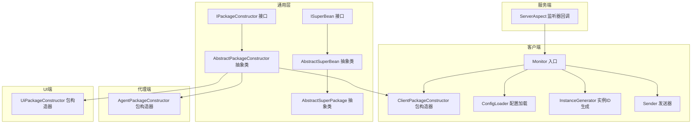
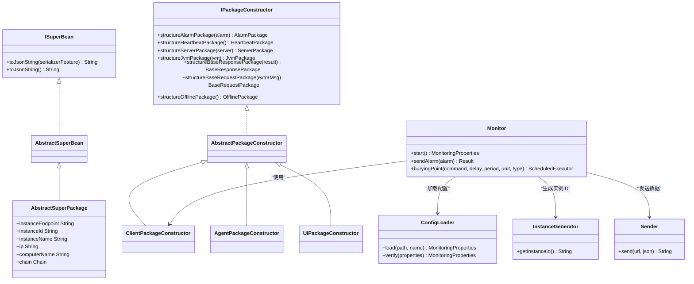
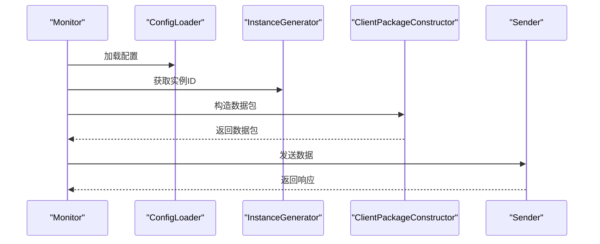
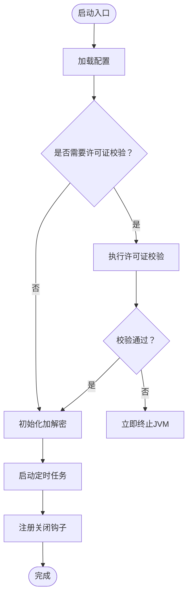
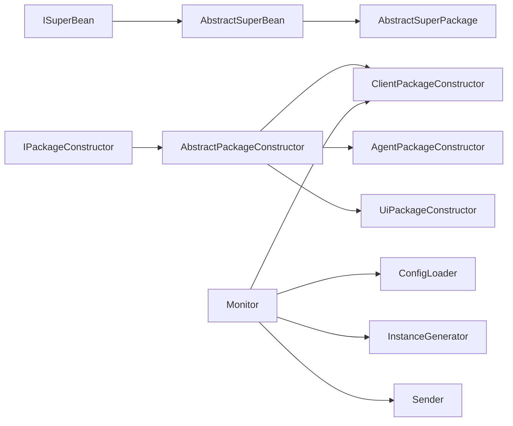

# 插件框架设计

<cite>
**本文引用的文件**   
- [ISuperBean.java](file://phoenix-common/phoenix-common-core/src/main/java/com/gitee/pifeng/monitoring/common/inf/ISuperBean.java)
- [AbstractSuperBean.java](file://phoenix-common/phoenix-common-core/src/main/java/com/gitee/pifeng/monitoring/common/abs/AbstractSuperBean.java)
- [AbstractPackageConstructor.java](file://phoenix-common/phoenix-common-core/src/main/java/com/gitee/pifeng/monitoring/common/abs/AbstractPackageConstructor.java)
- [IPackageConstructor.java](file://phoenix-common/phoenix-common-core/src/main/java/com/gitee/pifeng/monitoring/common/inf/IPackageConstructor.java)
- [AbstractSuperPackage.java](file://phoenix-common/phoenix-common-core/src/main/java/com/gitee/pifeng/monitoring/common/abs/AbstractSuperPackage.java)
- [ClientPackageConstructor.java](file://phoenix-client/phoenix-client-core/src/main/java/com/gitee/pifeng/monitoring/plug/core/ClientPackageConstructor.java)
- [AgentPackageConstructor.java](file://phoenix-agent/src/main/java/com/gitee/pifeng/monitoring/agent/core/AgentPackageConstructor.java)
- [UiPackageConstructor.java](file://phoenix-ui/src/main/java/com/gitee/pifeng/monitoring/ui/core/UiPackageConstructor.java)
- [Monitor.java](file://phoenix-client/phoenix-client-core/src/main/java/com/gitee/pifeng/monitoring/plug/Monitor.java)
- [ConfigLoader.java](file://phoenix-client/phoenix-client-core/src/main/java/com/gitee/pifeng/monitoring/plug/core/ConfigLoader.java)
- [InstanceGenerator.java](file://phoenix-client/phoenix-client-core/src/main/java/com/gitee/pifeng/monitoring/plug/core/InstanceGenerator.java)
- [Sender.java](file://phoenix-client/phoenix-client-core/src/main/java/com/gitee/pifeng/monitoring/plug/core/Sender.java)
- [MonitoringPlugInitializeListener.java](file://phoenix-client/phoenix-client-spring-mvc-integrator/src/main/java/com/gitee/pifeng/monitoring/integrator/listener/MonitoringPlugInitializeListener.java)
- [LicenseChecker.java](file://phoenix-client/phoenix-client-core/src/main/java/com/gitee/pifeng/monitoring/plug/core/LicenseChecker.java)
- [InitSigar.java](file://phoenix-common/phoenix-common-core/src/main/java/com/gitee/pifeng/monitoring/common/init/InitSigar.java)
- [InitOshi.java](file://phoenix-common/phoenix-common-core/src/main/java/com/gitee/pifeng/monitoring/common/init/InitOshi.java)
- [ServerAspect.java](file://phoenix-server/src/main/java/com/gitee/pifeng/monitoring/server/business/server/component/ServerAspect.java)
</cite>

## 目录
1. [引言](#引言)
2. [项目结构](#项目结构)
3. [核心组件](#核心组件)
4. [架构总览](#架构总览)
5. [详细组件分析](#详细组件分析)
6. [依赖关系分析](#依赖关系分析)
7. [性能考量](#性能考量)
8. [故障排查指南](#故障排查指南)
9. [结论](#结论)
10. [附录](#附录)

## 引言
本文件面向Phoenix监控系统的插件框架设计，围绕ISuperBean接口与AbstractSuperBean抽象类的默认方法设计、AbstractPackageConstructor抽象类在数据包构造中的职责、以及基于抽象工厂模式的包构造器实现展开，系统性阐述插件生命周期管理、初始化流程、销毁机制、插件注册与发现、配置管理、插件间通信与安全控制等主题，并提供可操作的插件开发示例与调试建议。

## 项目结构
Phoenix监控系统采用多模块分层组织，插件框架主要分布在以下模块：
- phoenix-common：通用抽象与接口（ISuperBean、AbstractSuperBean、AbstractPackageConstructor、AbstractSuperPackage、IPackageConstructor）
- phoenix-client：监控客户端（Monitor入口、包构造器、配置加载、实例ID生成、发送器、定时任务调度）
- phoenix-agent：监控代理端（AgentPackageConstructor）
- phoenix-ui：监控UI端（UiPackageConstructor）
- phoenix-server：服务端（接收端、监听器回调）
- 公共初始化：InitSigar、InitOshi等

**图表来源**
- [ISuperBean.java:14-44](file://phoenix-common/phoenix-common-core/src/main/java/com/gitee/pifeng/monitoring/common/inf/ISuperBean.java#L14-L44)
- [AbstractSuperBean.java:13-14](file://phoenix-common/phoenix-common-core/src/main/java/com/gitee/pifeng/monitoring/common/abs/AbstractSuperBean.java#L13-L14)
- [IPackageConstructor.java:22-113](file://phoenix-common/phoenix-common-core/src/main/java/com/gitee/pifeng/monitoring/common/inf/IPackageConstructor.java#L22-L113)
- [AbstractPackageConstructor.java:20-132](file://phoenix-common/phoenix-common-core/src/main/java/com/gitee/pifeng/monitoring/common/abs/AbstractPackageConstructor.java#L20-L132)
- [AbstractSuperPackage.java:24-71](file://phoenix-common/phoenix-common-core/src/main/java/com/gitee/pifeng/monitoring/common/abs/AbstractSuperPackage.java#L24-L71)
- [ClientPackageConstructor.java:37-282](file://phoenix-client/phoenix-client-core/src/main/java/com/gitee/pifeng/monitoring/plug/core/ClientPackageConstructor.java#L37-L282)
- [AgentPackageConstructor.java:41-202](file://phoenix-agent/src/main/java/com/gitee/pifeng/monitoring/agent/core/AgentPackageConstructor.java#L41-L202)
- [UiPackageConstructor.java:33-154](file://phoenix-ui/src/main/java/com/gitee/pifeng/monitoring/ui/core/UiPackageConstructor.java#L33-L154)
- [Monitor.java:40-195](file://phoenix-client/phoenix-client-core/src/main/java/com/gitee/pifeng/monitoring/plug/Monitor.java#L40-L195)
- [ConfigLoader.java:29-44](file://phoenix-client/phoenix-client-core/src/main/java/com/gitee/pifeng/monitoring/plug/core/ConfigLoader.java#L29-L44)
- [InstanceGenerator.java:29-179](file://phoenix-client/phoenix-client-core/src/main/java/com/gitee/pifeng/monitoring/plug/core/InstanceGenerator.java#L29-L179)
- [Sender.java:17-61](file://phoenix-client/phoenix-client-core/src/main/java/com/gitee/pifeng/monitoring/plug/core/Sender.java#L17-L61)
- [ServerAspect.java:89-104](file://phoenix-server/src/main/java/com/gitee/pifeng/monitoring/server/business/server/component/ServerAspect.java#L89-L104)

**章节来源**
- [ISuperBean.java:14-44](file://phoenix-common/phoenix-common-core/src/main/java/com/gitee/pifeng/monitoring/common/inf/ISuperBean.java#L14-L44)
- [AbstractSuperBean.java:13-14](file://phoenix-common/phoenix-common-core/src/main/java/com/gitee/pifeng/monitoring/common/abs/AbstractSuperBean.java#L13-L14)
- [AbstractPackageConstructor.java:20-132](file://phoenix-common/phoenix-common-core/src/main/java/com/gitee/pifeng/monitoring/common/abs/AbstractPackageConstructor.java#L20-L132)
- [IPackageConstructor.java:22-113](file://phoenix-common/phoenix-common-core/src/main/java/com/gitee/pifeng/monitoring/common/inf/IPackageConstructor.java#L22-L113)
- [AbstractSuperPackage.java:24-71](file://phoenix-common/phoenix-common-core/src/main/java/com/gitee/pifeng/monitoring/common/abs/AbstractSuperPackage.java#L24-L71)
- [ClientPackageConstructor.java:37-282](file://phoenix-client/phoenix-client-core/src/main/java/com/gitee/pifeng/monitoring/plug/core/ClientPackageConstructor.java#L37-L282)
- [AgentPackageConstructor.java:41-202](file://phoenix-agent/src/main/java/com/gitee/pifeng/monitoring/agent/core/AgentPackageConstructor.java#L41-L202)
- [UiPackageConstructor.java:33-154](file://phoenix-ui/src/main/java/com/gitee/pifeng/monitoring/ui/core/UiPackageConstructor.java#L33-L154)
- [Monitor.java:40-195](file://phoenix-client/phoenix-client-core/src/main/java/com/gitee/pifeng/monitoring/plug/Monitor.java#L40-L195)
- [ConfigLoader.java:29-44](file://phoenix-client/phoenix-client-core/src/main/java/com/gitee/pifeng/monitoring/plug/core/ConfigLoader.java#L29-L44)
- [InstanceGenerator.java:29-179](file://phoenix-client/phoenix-client-core/src/main/java/com/gitee/pifeng/monitoring/plug/core/InstanceGenerator.java#L29-L179)
- [Sender.java:17-61](file://phoenix-client/phoenix-client-core/src/main/java/com/gitee/pifeng/monitoring/plug/core/Sender.java#L17-L61)
- [ServerAspect.java:89-104](file://phoenix-server/src/main/java/com/gitee/pifeng/monitoring/server/business/server/component/ServerAspect.java#L89-L104)

## 核心组件
- ISuperBean接口：定义默认方法，提供对象转JSON字符串的能力，简化实现类的样板代码。
- AbstractSuperBean抽象类：实现ISuperBean，作为所有业务Bean的抽象父类，统一提供默认行为。
- AbstractSuperPackage抽象类：继承AbstractSuperBean，定义实例端点、实例ID、实例名、IP、计算机名、链路信息等公共字段，统一数据包元信息。
- IPackageConstructor接口：定义包构造器契约，声明多种数据包的构造方法，体现抽象工厂模式。
- AbstractPackageConstructor抽象类：为IPackageConstructor提供默认实现（部分返回空），便于按需覆盖。
- 各端包构造器：ClientPackageConstructor、AgentPackageConstructor、UiPackageConstructor分别针对客户端、代理端、UI端实现具体的数据包构造逻辑，统一填充AbstractSuperPackage的公共字段并按端点定制内容。
- Monitor入口：负责启动流程、加载配置、许可证校验、初始化加解密、启动定时任务、注册关闭钩子等。
- ConfigLoader：负责加载与校验监控配置。
- InstanceGenerator：负责生成与持久化实例ID，保证跨进程/重启的一致性。
- Sender：负责加密负载、发送HTTP请求、解密响应，屏蔽加解密细节。
- 监听器回调：ServerAspect在服务端对监控事件进行后置通知，触发监听器回调。

**章节来源**
- [ISuperBean.java:14-44](file://phoenix-common/phoenix-common-core/src/main/java/com/gitee/pifeng/monitoring/common/inf/ISuperBean.java#L14-L44)
- [AbstractSuperBean.java:13-14](file://phoenix-common/phoenix-common-core/src/main/java/com/gitee/pifeng/monitoring/common/abs/AbstractSuperBean.java#L13-L14)
- [AbstractSuperPackage.java:24-71](file://phoenix-common/phoenix-common-core/src/main/java/com/gitee/pifeng/monitoring/common/abs/AbstractSuperPackage.java#L24-L71)
- [IPackageConstructor.java:22-113](file://phoenix-common/phoenix-common-core/src/main/java/com/gitee/pifeng/monitoring/common/inf/IPackageConstructor.java#L22-L113)
- [AbstractPackageConstructor.java:20-132](file://phoenix-common/phoenix-common-core/src/main/java/com/gitee/pifeng/monitoring/common/abs/AbstractPackageConstructor.java#L20-L132)
- [ClientPackageConstructor.java:37-282](file://phoenix-client/phoenix-client-core/src/main/java/com/gitee/pifeng/monitoring/plug/core/ClientPackageConstructor.java#L37-L282)
- [AgentPackageConstructor.java:41-202](file://phoenix-agent/src/main/java/com/gitee/pifeng/monitoring/agent/core/AgentPackageConstructor.java#L41-L202)
- [UiPackageConstructor.java:33-154](file://phoenix-ui/src/main/java/com/gitee/pifeng/monitoring/ui/core/UiPackageConstructor.java#L33-L154)
- [Monitor.java:40-195](file://phoenix-client/phoenix-client-core/src/main/java/com/gitee/pifeng/monitoring/plug/Monitor.java#L40-L195)
- [ConfigLoader.java:29-44](file://phoenix-client/phoenix-client-core/src/main/java/com/gitee/pifeng/monitoring/plug/core/ConfigLoader.java#L29-L44)
- [InstanceGenerator.java:29-179](file://phoenix-client/phoenix-client-core/src/main/java/com/gitee/pifeng/monitoring/plug/core/InstanceGenerator.java#L29-L179)
- [Sender.java:17-61](file://phoenix-client/phoenix-client-core/src/main/java/com/gitee/pifeng/monitoring/plug/core/Sender.java#L17-L61)
- [ServerAspect.java:89-104](file://phoenix-server/src/main/java/com/gitee/pifeng/monitoring/server/business/server/component/ServerAspect.java#L89-L104)

## 架构总览
插件框架以“抽象父类 + 接口 + 抽象工厂”为核心，形成统一的数据包构造与生命周期管理：
- 抽象层：ISuperBean/AbstractSuperBean/AbstractSuperPackage统一默认行为与公共字段。
- 工厂层：IPackageConstructor/AbstractPackageConstructor定义工厂契约与默认实现。
- 实现层：各端包构造器按端点定制数据包内容，统一填充公共元信息。
- 生命周期：Monitor负责启动、配置加载、许可证校验、定时任务与关闭钩子。
- 通信：Sender封装加解密与HTTP传输，屏蔽细节。
- 回调：服务端通过监听器回调触发业务处理。

**图表来源**
- [ISuperBean.java:14-44](file://phoenix-common/phoenix-common-core/src/main/java/com/gitee/pifeng/monitoring/common/inf/ISuperBean.java#L14-L44)
- [AbstractSuperBean.java:13-14](file://phoenix-common/phoenix-common-core/src/main/java/com/gitee/pifeng/monitoring/common/abs/AbstractSuperBean.java#L13-L14)
- [AbstractSuperPackage.java:24-71](file://phoenix-common/phoenix-common-core/src/main/java/com/gitee/pifeng/monitoring/common/abs/AbstractSuperPackage.java#L24-L71)
- [IPackageConstructor.java:22-113](file://phoenix-common/phoenix-common-core/src/main/java/com/gitee/pifeng/monitoring/common/inf/IPackageConstructor.java#L22-L113)
- [AbstractPackageConstructor.java:20-132](file://phoenix-common/phoenix-common-core/src/main/java/com/gitee/pifeng/monitoring/common/abs/AbstractPackageConstructor.java#L20-L132)
- [ClientPackageConstructor.java:37-282](file://phoenix-client/phoenix-client-core/src/main/java/com/gitee/pifeng/monitoring/plug/core/ClientPackageConstructor.java#L37-L282)
- [AgentPackageConstructor.java:41-202](file://phoenix-agent/src/main/java/com/gitee/pifeng/monitoring/agent/core/AgentPackageConstructor.java#L41-L202)
- [UiPackageConstructor.java:33-154](file://phoenix-ui/src/main/java/com/gitee/pifeng/monitoring/ui/core/UiPackageConstructor.java#L33-L154)
- [Monitor.java:40-195](file://phoenix-client/phoenix-client-core/src/main/java/com/gitee/pifeng/monitoring/plug/Monitor.java#L40-L195)
- [ConfigLoader.java:29-44](file://phoenix-client/phoenix-client-core/src/main/java/com/gitee/pifeng/monitoring/plug/core/ConfigLoader.java#L29-L44)
- [InstanceGenerator.java:29-179](file://phoenix-client/phoenix-client-core/src/main/java/com/gitee/pifeng/monitoring/plug/core/InstanceGenerator.java#L29-L179)
- [Sender.java:17-61](file://phoenix-client/phoenix-client-core/src/main/java/com/gitee/pifeng/monitoring/plug/core/Sender.java#L17-L61)

## 详细组件分析

### ISuperBean接口与AbstractSuperBean抽象类
- 设计理念：通过接口默认方法减少实现类样板代码，统一对象到JSON的序列化策略。
- 默认方法：
  - 指定SerializerFeature的toJsonString方法
  - 默认写入空值的toJsonString方法
- 在AbstractSuperBean中直接实现ISuperBean，使所有业务Bean天然具备JSON序列化能力，便于日志与传输。

**章节来源**
- [ISuperBean.java:14-44](file://phoenix-common/phoenix-common-core/src/main/java/com/gitee/pifeng/monitoring/common/inf/ISuperBean.java#L14-L44)
- [AbstractSuperBean.java:13-14](file://phoenix-common/phoenix-common-core/src/main/java/com/gitee/pifeng/monitoring/common/abs/AbstractSuperBean.java#L13-L14)

### AbstractSuperPackage抽象类
- 统一公共字段：实例端点、实例ID、实例名、实例描述、语言、服务器类型、IP、计算机名、链路信息等。
- 通过继承AbstractSuperBean，自动获得JSON序列化能力。
- 作为所有数据包的抽象父类，确保跨端一致性与可扩展性。

**章节来源**
- [AbstractSuperPackage.java:24-71](file://phoenix-common/phoenix-common-core/src/main/java/com/gitee/pifeng/monitoring/common/abs/AbstractSuperPackage.java#L24-L71)

### IPackageConstructor接口与AbstractPackageConstructor抽象类
- IPackageConstructor定义多种数据包的构造方法，体现抽象工厂模式：使用者无需关心具体实现，只需通过工厂获取所需数据包。
- AbstractPackageConstructor提供默认实现（多数返回空），便于子类按需覆盖，降低实现成本。

**章节来源**
- [IPackageConstructor.java:22-113](file://phoenix-common/phoenix-common-core/src/main/java/com/gitee/pifeng/monitoring/common/inf/IPackageConstructor.java#L22-L113)
- [AbstractPackageConstructor.java:20-132](file://phoenix-common/phoenix-common-core/src/main/java/com/gitee/pifeng/monitoring/common/abs/AbstractPackageConstructor.java#L20-L132)

### 包构造器实现：客户端、代理端、UI端
- ClientPackageConstructor：客户端包构造器，实现多种数据包构造，统一填充AbstractSuperPackage公共字段，并按端点设置实例端点、速率等。
- AgentPackageConstructor：代理端包构造器，同样继承AbstractPackageConstructor，实现公共字段填充与链路信息维护。
- UiPackageConstructor：UI端包构造器，实现基础请求包构造，统一填充公共字段并设置端点类型。

**图表来源**
- [Monitor.java:119-151](file://phoenix-client/phoenix-client-core/src/main/java/com/gitee/pifeng/monitoring/plug/Monitor.java#L119-L151)
- [ConfigLoader.java:29-44](file://phoenix-client/phoenix-client-core/src/main/java/com/gitee/pifeng/monitoring/plug/core/ConfigLoader.java#L29-L44)
- [InstanceGenerator.java:94-136](file://phoenix-client/phoenix-client-core/src/main/java/com/gitee/pifeng/monitoring/plug/core/InstanceGenerator.java#L94-L136)
- [ClientPackageConstructor.java:179-282](file://phoenix-client/phoenix-client-core/src/main/java/com/gitee/pifeng/monitoring/plug/core/ClientPackageConstructor.java#L179-L282)
- [Sender.java:42-61](file://phoenix-client/phoenix-client-core/src/main/java/com/gitee/pifeng/monitoring/plug/core/Sender.java#L42-L61)

**章节来源**
- [ClientPackageConstructor.java:37-282](file://phoenix-client/phoenix-client-core/src/main/java/com/gitee/pifeng/monitoring/plug/core/ClientPackageConstructor.java#L37-L282)
- [AgentPackageConstructor.java:41-202](file://phoenix-agent/src/main/java/com/gitee/pifeng/monitoring/agent/core/AgentPackageConstructor.java#L41-L202)
- [UiPackageConstructor.java:33-154](file://phoenix-ui/src/main/java/com/gitee/pifeng/monitoring/ui/core/UiPackageConstructor.java#L33-L154)

### 插件生命周期与初始化流程
- 启动入口：Monitor.start支持三种重载，内部调用run执行完整启动流程。
- 流程步骤：
  1) 打印Banner
  2) 加载或校验配置
  3) 许可证校验（非客户端端点时）
  4) 初始化加解密
  5) 启动心跳、服务器、JVM等定时任务
  6) 注册关闭钩子
- Spring集成：通过MonitoringPlugInitializeListener在Servlet上下文初始化完成后启动Monitor。

**图表来源**
- [Monitor.java:119-151](file://phoenix-client/phoenix-client-core/src/main/java/com/gitee/pifeng/monitoring/plug/Monitor.java#L119-L151)
- [MonitoringPlugInitializeListener.java:32-44](file://phoenix-client/phoenix-client-spring-mvc-integrator/src/main/java/com/gitee/pifeng/monitoring/integrator/listener/MonitoringPlugInitializeListener.java#L32-L44)
- [LicenseChecker.java:32-39](file://phoenix-client/phoenix-client-core/src/main/java/com/gitee/pifeng/monitoring/plug/core/LicenseChecker.java#L32-L39)

**章节来源**
- [Monitor.java:67-151](file://phoenix-client/phoenix-client-core/src/main/java/com/gitee/pifeng/monitoring/plug/Monitor.java#L67-L151)
- [MonitoringPlugInitializeListener.java:21-46](file://phoenix-client/phoenix-client-spring-mvc-integrator/src/main/java/com/gitee/pifeng/monitoring/integrator/listener/MonitoringPlugInitializeListener.java#L21-L46)
- [LicenseChecker.java:32-39](file://phoenix-client/phoenix-client-core/src/main/java/com/gitee/pifeng/monitoring/plug/core/LicenseChecker.java#L32-L39)

### 插件注册机制与发现
- Spring Bean：AgentPackageConstructor、UiPackageConstructor标注@Component，纳入Spring容器管理，可通过依赖注入获取实例。
- 非Spring场景：各包构造器提供getInstance单例方法，避免频繁创建实例，节省资源。
- 插件发现：通过包构造器接口与实现类的约定，结合配置加载与端点类型，自动识别不同端点的包构造器实现。

**章节来源**
- [AgentPackageConstructor.java:40-59](file://phoenix-agent/src/main/java/com/gitee/pifeng/monitoring/agent/core/AgentPackageConstructor.java#L40-L59)
- [UiPackageConstructor.java:32-33](file://phoenix-ui/src/main/java/com/gitee/pifeng/monitoring/ui/core/UiPackageConstructor.java#L32-L33)

### 插件配置管理
- ConfigLoader负责加载与校验配置，支持自定义配置路径与名称，或直接传入MonitoringProperties对象进行校验。
- 配置项包括实例端点、实例名/描述、服务器信息、心跳/服务器/JVM采样率等。

**章节来源**
- [ConfigLoader.java:29-44](file://phoenix-client/phoenix-client-core/src/main/java/com/gitee/pifeng/monitoring/plug/core/ConfigLoader.java#L29-L44)

### 插件间通信与安全控制
- Sender封装加密/解密与HTTP发送，统一处理明文与密文转换，屏蔽加解密细节。
- 许可证校验：非客户端端点时，Monitor在启动阶段调用LicenseChecker进行校验，未通过则立即终止JVM。
- 初始化组件：InitSigar与InitOshi在系统启动时初始化底层硬件与OS检测能力，为监控采集提供基础。

**章节来源**
- [Sender.java:17-61](file://phoenix-client/phoenix-client-core/src/main/java/com/gitee/pifeng/monitoring/plug/core/Sender.java#L17-L61)
- [Monitor.java:129-140](file://phoenix-client/phoenix-client-core/src/main/java/com/gitee/pifeng/monitoring/plug/Monitor.java#L129-L140)
- [LicenseChecker.java:32-39](file://phoenix-client/phoenix-client-core/src/main/java/com/gitee/pifeng/monitoring/plug/core/LicenseChecker.java#L32-L39)
- [InitSigar.java:44-80](file://phoenix-common/phoenix-common-core/src/main/java/com/gitee/pifeng/monitoring/common/init/InitSigar.java#L44-L80)
- [InitOshi.java:32-38](file://phoenix-common/phoenix-common-core/src/main/java/com/gitee/pifeng/monitoring/common/init/InitOshi.java#L32-L38)

### 插件开发示例与最佳实践
- 实现自定义包构造器：继承AbstractPackageConstructor并覆盖所需方法，复用AbstractSuperPackage公共字段填充逻辑。
- 处理插件异常：在包构造器与Monitor中捕获网络与IO异常，返回标准化Result或记录错误日志，避免影响主流程。
- 插件调试：利用ISuperBean的toJsonString默认方法输出对象JSON，辅助定位问题；在Sender中可打印明文/密文数据包，便于联调。

**章节来源**
- [AbstractPackageConstructor.java:20-132](file://phoenix-common/phoenix-common-core/src/main/java/com/gitee/pifeng/monitoring/common/abs/AbstractPackageConstructor.java#L20-L132)
- [Monitor.java:163-174](file://phoenix-client/phoenix-client-core/src/main/java/com/gitee/pifeng/monitoring/plug/Monitor.java#L163-L174)
- [ISuperBean.java:26-41](file://phoenix-common/phoenix-common-core/src/main/java/com/gitee/pifeng/monitoring/common/inf/ISuperBean.java#L26-L41)
- [Sender.java:44-57](file://phoenix-client/phoenix-client-core/src/main/java/com/gitee/pifeng/monitoring/plug/core/Sender.java#L44-L57)

## 依赖关系分析
- 继承关系：AbstractSuperBean实现ISuperBean；AbstractSuperPackage继承AbstractSuperBean；各端包构造器继承AbstractPackageConstructor。
- 耦合度：Monitor通过静态单例获取ClientPackageConstructor，耦合度较低；AgentPackageConstructor、UiPackageConstructor通过Spring管理，便于替换与扩展。
- 外部依赖：Sender依赖HTTP池化客户端与加解密工具；包构造器依赖配置加载与实例ID生成；服务端通过监听器回调与客户端交互。

**图表来源**
- [ISuperBean.java:14-44](file://phoenix-common/phoenix-common-core/src/main/java/com/gitee/pifeng/monitoring/common/inf/ISuperBean.java#L14-L44)
- [AbstractSuperBean.java:13-14](file://phoenix-common/phoenix-common-core/src/main/java/com/gitee/pifeng/monitoring/common/abs/AbstractSuperBean.java#L13-L14)
- [AbstractSuperPackage.java:24-71](file://phoenix-common/phoenix-common-core/src/main/java/com/gitee/pifeng/monitoring/common/abs/AbstractSuperPackage.java#L24-L71)
- [IPackageConstructor.java:22-113](file://phoenix-common/phoenix-common-core/src/main/java/com/gitee/pifeng/monitoring/common/inf/IPackageConstructor.java#L22-L113)
- [AbstractPackageConstructor.java:20-132](file://phoenix-common/phoenix-common-core/src/main/java/com/gitee/pifeng/monitoring/common/abs/AbstractPackageConstructor.java#L20-L132)
- [ClientPackageConstructor.java:37-282](file://phoenix-client/phoenix-client-core/src/main/java/com/gitee/pifeng/monitoring/plug/core/ClientPackageConstructor.java#L37-L282)
- [AgentPackageConstructor.java:41-202](file://phoenix-agent/src/main/java/com/gitee/pifeng/monitoring/agent/core/AgentPackageConstructor.java#L41-L202)
- [UiPackageConstructor.java:33-154](file://phoenix-ui/src/main/java/com/gitee/pifeng/monitoring/ui/core/UiPackageConstructor.java#L33-L154)
- [Monitor.java:40-195](file://phoenix-client/phoenix-client-core/src/main/java/com/gitee/pifeng/monitoring/plug/Monitor.java#L40-L195)
- [ConfigLoader.java:29-44](file://phoenix-client/phoenix-client-core/src/main/java/com/gitee/pifeng/monitoring/plug/core/ConfigLoader.java#L29-L44)
- [InstanceGenerator.java:29-179](file://phoenix-client/phoenix-client-core/src/main/java/com/gitee/pifeng/monitoring/plug/core/InstanceGenerator.java#L29-L179)
- [Sender.java:17-61](file://phoenix-client/phoenix-client-core/src/main/java/com/gitee/pifeng/monitoring/plug/core/Sender.java#L17-L61)

**章节来源**
- [Monitor.java:40-195](file://phoenix-client/phoenix-client-core/src/main/java/com/gitee/pifeng/monitoring/plug/Monitor.java#L40-L195)
- [ClientPackageConstructor.java:37-282](file://phoenix-client/phoenix-client-core/src/main/java/com/gitee/pifeng/monitoring/plug/core/ClientPackageConstructor.java#L37-L282)
- [AgentPackageConstructor.java:41-202](file://phoenix-agent/src/main/java/com/gitee/pifeng/monitoring/agent/core/AgentPackageConstructor.java#L41-L202)
- [UiPackageConstructor.java:33-154](file://phoenix-ui/src/main/java/com/gitee/pifeng/monitoring/ui/core/UiPackageConstructor.java#L33-L154)

## 性能考量
- 单例与静态常量：包构造器采用饿汉式单例，避免频繁创建实例带来的开销。
- 双重检查锁定：InstanceGenerator的getInstanceId使用双重检查锁定与volatile，保证多线程安全与性能。
- 线程池与定时任务：Monitor启动多个定时任务，建议根据业务规模调整线程池与采样率，避免过度采集。
- I/O与网络：Sender对明文/密文转换与HTTP请求进行日志输出，调试期建议开启，生产环境可关闭以减少I/O。

[本节为通用指导，不直接分析具体文件]

## 故障排查指南
- 配置异常：NotFoundConfigFileException、ErrorConfigParamException、NotFoundConfigParamException由Monitor在启动阶段抛出，检查配置文件路径与参数。
- 网络异常：NetException在包构造器中可能抛出，检查网络连通性与链路信息填充逻辑。
- 许可证异常：非客户端端点时若LicenseChecker校验失败，JVM将被立即终止，检查许可证有效性。
- 监听器回调：服务端ServerAspect在后置通知中调用监听器回调，异常会被捕获并记录日志，检查回调实现与线程池配置。

**章节来源**
- [Monitor.java:119-151](file://phoenix-client/phoenix-client-core/src/main/java/com/gitee/pifeng/monitoring/plug/Monitor.java#L119-L151)
- [AbstractPackageConstructor.java:34-130](file://phoenix-common/phoenix-common-core/src/main/java/com/gitee/pifeng/monitoring/common/abs/AbstractPackageConstructor.java#L34-L130)
- [LicenseChecker.java:32-39](file://phoenix-client/phoenix-client-core/src/main/java/com/gitee/pifeng/monitoring/plug/core/LicenseChecker.java#L32-L39)
- [ServerAspect.java:89-104](file://phoenix-server/src/main/java/com/gitee/pifeng/monitoring/server/business/server/component/ServerAspect.java#L89-L104)

## 结论
Phoenix监控系统的插件框架通过ISuperBean与AbstractSuperBean提供默认行为，借助AbstractSuperPackage统一数据包元信息，采用IPackageConstructor与AbstractPackageConstructor实现抽象工厂模式，最终由各端包构造器完成具体数据包构造。Monitor负责完整的生命周期管理，Sender屏蔽通信细节，LicenseChecker与初始化组件保障安全与系统能力。该设计具备良好的扩展性与可维护性，适合在多端场景下统一数据包构造与生命周期管理。

[本节为总结性内容，不直接分析具体文件]

## 附录
- 开发要点清单
  - 新增包构造器：继承AbstractPackageConstructor并覆盖所需方法
  - 填充公共字段：复用structureAbstractSuperPackage逻辑
  - 单例与线程安全：使用饿汉式单例与双重检查锁定
  - 异常处理：捕获并记录异常，返回标准化结果
  - 调试技巧：利用ISuperBean的toJsonString输出对象JSON

[本节为补充性内容，不直接分析具体文件]