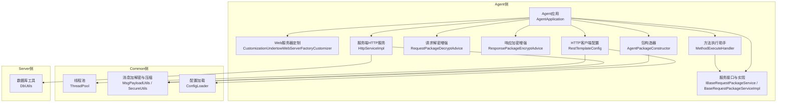
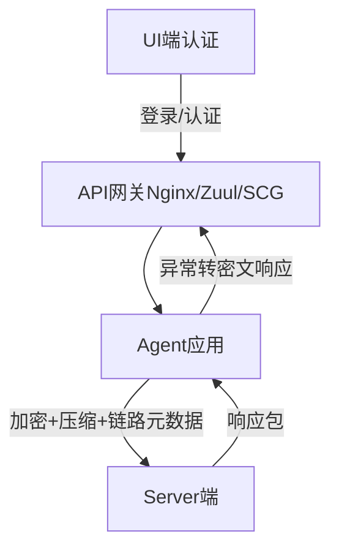
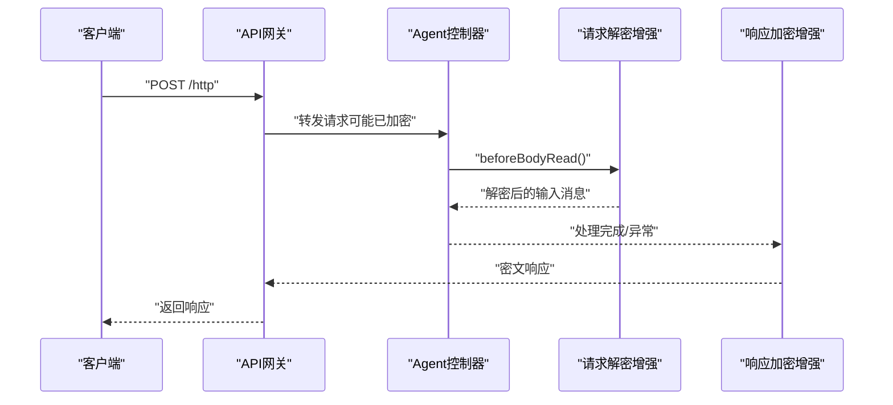
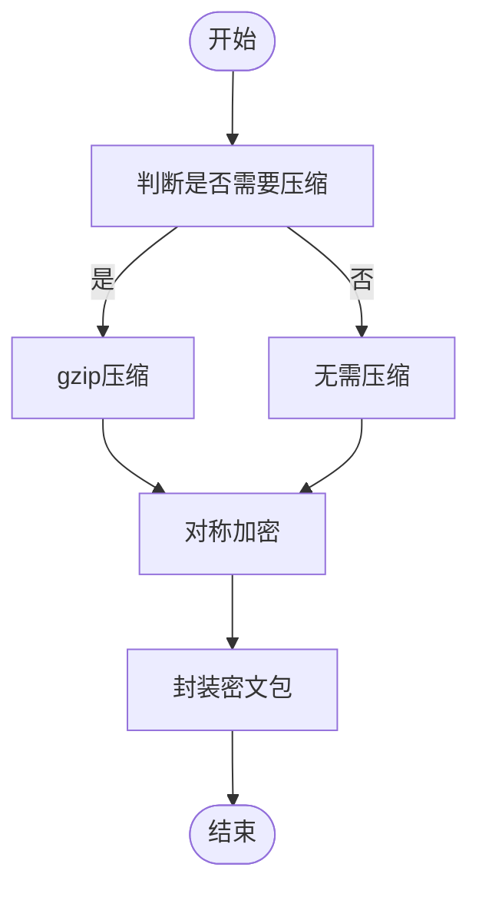
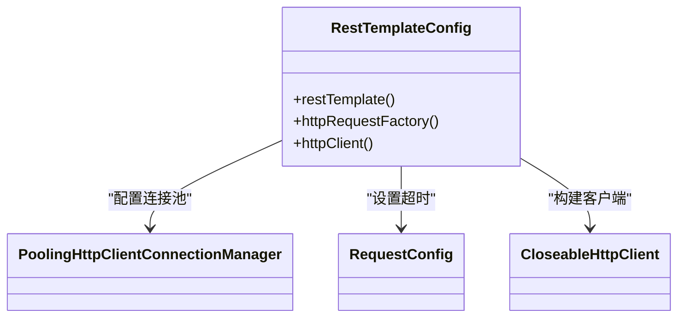
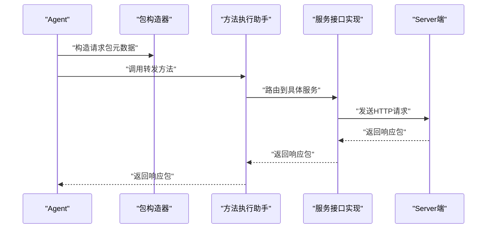
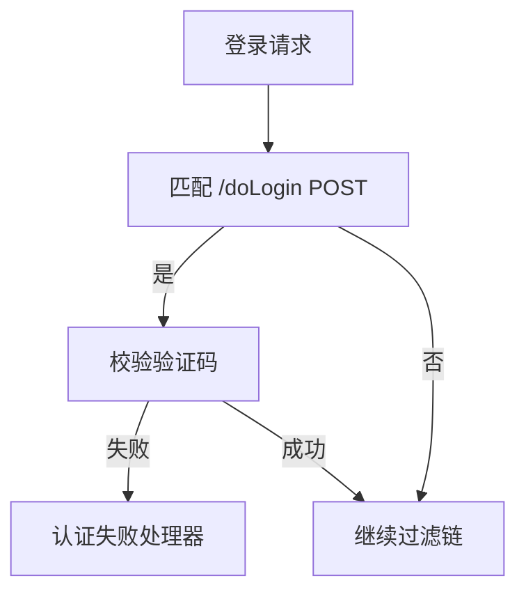
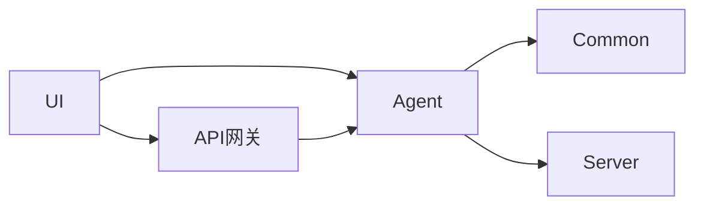

# API网关集成

<cite>
**本文引用的文件**
- [AgentApplication.java](file://phoenix-agent/src/main/java/com/gitee/pifeng/monitoring/agent/AgentApplication.java)
- [CustomizationUndertowWebServerFactoryCustomizer.java](file://phoenix-common/phoenix-common-web/src/main/java/com/gitee/pifeng/monitoring/common/web/core/CustomizationUndertowWebServerFactoryCustomizer.java)
- [RestTemplateConfig.java](file://phoenix-agent/src/main/java/com/gitee/pifeng/monitoring/agent/config/RestTemplateConfig.java)
- [UrlConstants.java](file://phoenix-agent/src/main/java/com/gitee/pifeng/monitoring/agent/constant/UrlConstants.java)
- [RequestPackageDecryptAdvice.java](file://phoenix-agent/src/main/java/com/gitee/pifeng/monitoring/agent/component/RequestPackageDecryptAdvice.java)
- [ResponsePackageEncryptAdvice.java](file://phoenix-agent/src/main/java/com/gitee/pifeng/monitoring/agent/component/ResponsePackageEncryptAdvice.java)
- [AgentPackageConstructor.java](file://phoenix-agent/src/main/java/com/gitee/pifeng/monitoring/agent/core/AgentPackageConstructor.java)
- [MethodExecuteHandler.java](file://phoenix-agent/src/main/java/com/gitee/pifeng/monitoring/agent/core/MethodExecuteHandler.java)
- [IBaseRequestPackageService.java](file://phoenix-agent/src/main/java/com/gitee/pifeng/monitoring/agent/business/client/service/IBaseRequestPackageService.java)
- [BaseRequestPackageServiceImpl.java](file://phoenix-agent/src/main/java/com/gitee/pifeng/monitoring/agent/business/client/service/impl/BaseRequestPackageServiceImpl.java)
- [HttpServiceImpl.java](file://phoenix-agent/src/main/java/com/gitee/pifeng/monitoring/agent/business/server/service/impl/HttpServiceImpl.java)
- [MsgPayloadUtils.java](file://phoenix-common/phoenix-common-core/src/main/java/com/gitee/pifeng/monitoring/common/util/MsgPayloadUtils.java)
- [SecureUtils.java](file://phoenix-common/phoenix-common-core/src/main/java/com/gitee/pifeng/monitoring/common/util/secure/SecureUtils.java)
- [ConfigLoader.java](file://phoenix-client/phoenix-client-core/src/main/java/com/gitee/pifeng/monitoring/plug/core/ConfigLoader.java)
- [DbUtils.java](file://phoenix-server/src/main/java/com/gitee/pifeng/monitoring/server/util/db/DbUtils.java)
- [SpringSecurityConfig.java](file://phoenix-ui/src/main/java/com/gitee/pifeng/monitoring/ui/config/springsecurity/SpringSecurityConfig.java)
- [SpringSecurityCasConfig.java](file://phoenix-ui/src/main/java/com/gitee/pifeng/monitoring/ui/config/springsecurity/SpringSecurityCasConfig.java)
- [SpringSecurityWebAuthenticationDetailsSource.java](file://phoenix-ui/src/main/java/com/gitee/pifeng/monitoring/ui/config/springsecurity/SpringSecurityWebAuthenticationDetailsSource.java)
- [SpringSecurityVerificationCodeFilter.java](file://phoenix-ui/src/main/java/com/gitee/pifeng/monitoring/ui/config/springsecurity/SpringSecurityVerificationCodeFilter.java)
- [ThreadPool.java](file://phoenix-common/phoenix-common-core/src/main/java/com/gitee/pifeng/monitoring/common/threadpool/ThreadPool.java)
</cite>

## 目录
1. [引言](#引言)
2. [项目结构](#项目结构)
3. [核心组件](#核心组件)
4. [架构总览](#架构总览)
5. [详细组件分析](#详细组件分析)
6. [依赖分析](#依赖分析)
7. [性能考虑](#性能考虑)
8. [故障排查指南](#故障排查指南)
9. [结论](#结论)
10. [附录](#附录)

## 引言
本文件面向Phoenix监控系统的API网关集成场景，围绕与Nginx、Zuul、Spring Cloud Gateway等主流网关的对接，系统性阐述请求路由、负载均衡、限流熔断、请求拦截与处理、安全验证、跨域支持、性能优化、监控与日志、故障处理与容错等关键技术点。文档以代码为依据，结合架构图与流程图，帮助开发者快速理解并实施网关集成。

## 项目结构
Phoenix采用多模块分层架构：agent侧负责采集与上报、server侧负责业务与存储、ui侧提供前端界面与安全认证、common侧提供通用能力（线程池、工具类、DTO等）。与API网关集成最相关的模块集中在agent与common：

- agent：对外暴露HTTP接口、内置连接池、请求解密/响应加密、包构造与转发、与server交互
- common：通用线程池、消息加解密与压缩、Web定制化（Undertow）、配置加载
- ui：安全认证（Spring Security/CAS）、验证码过滤
- server：数据库工具、业务服务（与agent交互）

图表来源
- [AgentApplication.java:1-39](file://phoenix-agent/src/main/java/com/gitee/pifeng/monitoring/agent/AgentApplication.java#L1-L39)
- [CustomizationUndertowWebServerFactoryCustomizer.java:1-37](file://phoenix-common/phoenix-common-web/src/main/java/com/gitee/pifeng/monitoring/common/web/core/CustomizationUndertowWebServerFactoryCustomizer.java#L1-L37)
- [RestTemplateConfig.java:1-155](file://phoenix-agent/src/main/java/com/gitee/pifeng/monitoring/agent/config/RestTemplateConfig.java#L1-L155)
- [RequestPackageDecryptAdvice.java:1-56](file://phoenix-agent/src/main/java/com/gitee/pifeng/monitoring/agent/component/RequestPackageDecryptAdvice.java#L1-L56)
- [ResponsePackageEncryptAdvice.java:30-63](file://phoenix-agent/src/main/java/com/gitee/pifeng/monitoring/agent/component/ResponsePackageEncryptAdvice.java#L30-L63)
- [AgentPackageConstructor.java:1-202](file://phoenix-agent/src/main/java/com/gitee/pifeng/monitoring/agent/core/AgentPackageConstructor.java#L1-L202)
- [MethodExecuteHandler.java:1-164](file://phoenix-agent/src/main/java/com/gitee/pifeng/monitoring/agent/core/MethodExecuteHandler.java#L1-L164)
- [IBaseRequestPackageService.java:1-30](file://phoenix-agent/src/main/java/com/gitee/pifeng/monitoring/agent/business/client/service/IBaseRequestPackageService.java#L1-L30)
- [BaseRequestPackageServiceImpl.java:1-38](file://phoenix-agent/src/main/java/com/gitee/pifeng/monitoring/agent/business/client/service/impl/BaseRequestPackageServiceImpl.java#L1-L38)
- [HttpServiceImpl.java:1-44](file://phoenix-agent/src/main/java/com/gitee/pifeng/monitoring/agent/business/server/service/impl/HttpServiceImpl.java#L1-L44)
- [ThreadPool.java:102-172](file://phoenix-common/phoenix-common-core/src/main/java/com/gitee/pifeng/monitoring/common/threadpool/ThreadPool.java#L102-L172)
- [MsgPayloadUtils.java:1-120](file://phoenix-common/phoenix-common-core/src/main/java/com/gitee/pifeng/monitoring/common/util/MsgPayloadUtils.java#L1-L120)
- [SecureUtils.java:1-113](file://phoenix-common/phoenix-common-core/src/main/java/com/gitee/pifeng/monitoring/common/util/secure/SecureUtils.java#L1-L113)
- [ConfigLoader.java:344-402](file://phoenix-client/phoenix-client-core/src/main/java/com/gitee/pifeng/monitoring/plug/core/ConfigLoader.java#L344-L402)
- [DbUtils.java:1-57](file://phoenix-server/src/main/java/com/gitee/pifeng/monitoring/server/util/db/DbUtils.java#L1-L57)

章节来源
- [AgentApplication.java:1-39](file://phoenix-agent/src/main/java/com/gitee/pifeng/monitoring/agent/AgentApplication.java#L1-L39)
- [RestTemplateConfig.java:1-155](file://phoenix-agent/src/main/java/com/gitee/pifeng/monitoring/agent/config/RestTemplateConfig.java#L1-L155)

## 核心组件
- Web服务器与连接池
  - Undertow定制：统一缓冲池、WebSocket部署信息配置，减少启动告警与资源浪费
  - HTTP客户端：基于Apache HttpClient的连接池、超时、重试、长连接策略
- 请求解密与响应加密
  - 控制器增强：请求体解密、异常转密文响应
  - 消息工具：自动判断压缩与加解密，支持gzip与对称加密
- 包构造与转发
  - 包构造器：统一注入实例、链路、时间戳等元数据
  - 方法执行助手：统一路由到具体服务接口，异常包装为响应包
- 配置加载
  - 从配置加载服务端URL与HTTP超时参数，动态拼接各路由URL

章节来源
- [CustomizationUndertowWebServerFactoryCustomizer.java:1-37](file://phoenix-common/phoenix-common-web/src/main/java/com/gitee/pifeng/monitoring/common/web/core/CustomizationUndertowWebServerFactoryCustomizer.java#L1-L37)
- [RestTemplateConfig.java:89-152](file://phoenix-agent/src/main/java/com/gitee/pifeng/monitoring/agent/config/RestTemplateConfig.java#L89-L152)
- [RequestPackageDecryptAdvice.java:22-56](file://phoenix-agent/src/main/java/com/gitee/pifeng/monitoring/agent/component/RequestPackageDecryptAdvice.java#L22-L56)
- [ResponsePackageEncryptAdvice.java:30-63](file://phoenix-agent/src/main/java/com/gitee/pifeng/monitoring/agent/component/ResponsePackageEncryptAdvice.java#L30-L63)
- [MsgPayloadUtils.java:32-120](file://phoenix-common/phoenix-common-core/src/main/java/com/gitee/pifeng/monitoring/common/util/MsgPayloadUtils.java#L32-L120)
- [AgentPackageConstructor.java:40-202](file://phoenix-agent/src/main/java/com/gitee/pifeng/monitoring/agent/core/AgentPackageConstructor.java#L40-L202)
- [MethodExecuteHandler.java:17-164](file://phoenix-agent/src/main/java/com/gitee/pifeng/monitoring/agent/core/MethodExecuteHandler.java#L17-L164)
- [UrlConstants.java:26-126](file://phoenix-agent/src/main/java/com/gitee/pifeng/monitoring/agent/constant/UrlConstants.java#L26-L126)
- [ConfigLoader.java:344-402](file://phoenix-client/phoenix-client-core/src/main/java/com/gitee/pifeng/monitoring/plug/core/ConfigLoader.java#L344-L402)

## 架构总览
Phoenix在agent侧提供REST接口，内部通过连接池向server端发送加密压缩后的数据包；同时通过包构造器统一注入链路与元数据，确保可追踪性与一致性。UI侧提供安全认证与验证码校验，便于网关前置的安全接入。

图表来源
- [AgentApplication.java:28-39](file://phoenix-agent/src/main/java/com/gitee/pifeng/monitoring/agent/AgentApplication.java#L28-L39)
- [RestTemplateConfig.java:89-152](file://phoenix-agent/src/main/java/com/gitee/pifeng/monitoring/agent/config/RestTemplateConfig.java#L89-L152)
- [ResponsePackageEncryptAdvice.java:55-63](file://phoenix-agent/src/main/java/com/gitee/pifeng/monitoring/agent/component/ResponsePackageEncryptAdvice.java#L55-L63)
- [SpringSecurityConfig.java:80-98](file://phoenix-ui/src/main/java/com/gitee/pifeng/monitoring/ui/config/springsecurity/SpringSecurityConfig.java#L80-L98)

## 详细组件分析

### 组件A：请求解密与响应加密（API网关前置场景）
- 请求解密增强：在进入控制器前对请求体进行解密，保证网关透传的密文被正确还原
- 响应加密增强：异常统一转为密文响应包，避免敏感信息泄露
- 适用场景：API网关作为TLS终止或反向代理，agent侧仅处理明文/密文转换

图表来源
- [RequestPackageDecryptAdvice.java:22-56](file://phoenix-agent/src/main/java/com/gitee/pifeng/monitoring/agent/component/RequestPackageDecryptAdvice.java#L22-L56)
- [ResponsePackageEncryptAdvice.java:30-63](file://phoenix-agent/src/main/java/com/gitee/pifeng/monitoring/agent/component/ResponsePackageEncryptAdvice.java#L30-L63)

章节来源
- [RequestPackageDecryptAdvice.java:1-56](file://phoenix-agent/src/main/java/com/gitee/pifeng/monitoring/agent/component/RequestPackageDecryptAdvice.java#L1-L56)
- [ResponsePackageEncryptAdvice.java:30-63](file://phoenix-agent/src/main/java/com/gitee/pifeng/monitoring/agent/component/ResponsePackageEncryptAdvice.java#L30-L63)

### 组件B：消息加解密与压缩（网关性能与安全）
- 自动压缩：根据负载大小自动判断是否gzip压缩
- 对称加密：支持配置的加密算法，统一加解密入口
- 明确边界：加密/解密/压缩/解压均在工具类中集中实现，便于替换与扩展

图表来源
- [MsgPayloadUtils.java:32-120](file://phoenix-common/phoenix-common-core/src/main/java/com/gitee/pifeng/monitoring/common/util/MsgPayloadUtils.java#L32-L120)
- [SecureUtils.java:20-113](file://phoenix-common/phoenix-common-core/src/main/java/com/gitee/pifeng/monitoring/common/util/secure/SecureUtils.java#L20-L113)

章节来源
- [MsgPayloadUtils.java:1-120](file://phoenix-common/phoenix-common-core/src/main/java/com/gitee/pifeng/monitoring/common/util/MsgPayloadUtils.java#L1-L120)
- [SecureUtils.java:1-113](file://phoenix-common/phoenix-common-core/src/main/java/com/gitee/pifeng/monitoring/common/util/secure/SecureUtils.java#L1-L113)

### 组件C：连接池与HTTP客户端（网关高并发与稳定性）
- 连接池参数：最大连接、每路由最大连接、空闲回收、连接存活时间
- 超时策略：连接超时、套接字超时、从池获取连接超时
- 重试与长连接：默认重试次数、连接复用与保活策略
- 动态配置：从配置加载HTTP超时参数，支持运行时调整

图表来源
- [RestTemplateConfig.java:89-152](file://phoenix-agent/src/main/java/com/gitee/pifeng/monitoring/agent/config/RestTemplateConfig.java#L89-L152)

章节来源
- [RestTemplateConfig.java:1-155](file://phoenix-agent/src/main/java/com/gitee/pifeng/monitoring/agent/config/RestTemplateConfig.java#L1-L155)
- [ConfigLoader.java:344-402](file://phoenix-client/phoenix-client-core/src/main/java/com/gitee/pifeng/monitoring/plug/core/ConfigLoader.java#L344-L402)

### 组件D：包构造与转发（请求追踪与一致性）
- 包构造器：注入实例ID、链路、时间戳、应用服务器类型等元数据
- 方法执行助手：统一路由到具体服务接口，异常包装为响应包
- URL常量：集中管理服务端各接口URL，便于网关路由映射

图表来源
- [AgentPackageConstructor.java:40-202](file://phoenix-agent/src/main/java/com/gitee/pifeng/monitoring/agent/core/AgentPackageConstructor.java#L40-L202)
- [MethodExecuteHandler.java:17-164](file://phoenix-agent/src/main/java/com/gitee/pifeng/monitoring/agent/core/MethodExecuteHandler.java#L17-L164)
- [IBaseRequestPackageService.java:14-30](file://phoenix-agent/src/main/java/com/gitee/pifeng/monitoring/agent/business/client/service/IBaseRequestPackageService.java#L14-L30)
- [BaseRequestPackageServiceImpl.java:17-38](file://phoenix-agent/src/main/java/com/gitee/pifeng/monitoring/agent/business/client/service/impl/BaseRequestPackageServiceImpl.java#L17-L38)
- [UrlConstants.java:26-126](file://phoenix-agent/src/main/java/com/gitee/pifeng/monitoring/agent/constant/UrlConstants.java#L26-L126)

章节来源
- [AgentPackageConstructor.java:1-202](file://phoenix-agent/src/main/java/com/gitee/pifeng/monitoring/agent/core/AgentPackageConstructor.java#L1-L202)
- [MethodExecuteHandler.java:1-164](file://phoenix-agent/src/main/java/com/gitee/pifeng/monitoring/agent/core/MethodExecuteHandler.java#L1-L164)
- [IBaseRequestPackageService.java:1-30](file://phoenix-agent/src/main/java/com/gitee/pifeng/monitoring/agent/business/client/service/IBaseRequestPackageService.java#L1-L30)
- [BaseRequestPackageServiceImpl.java:1-38](file://phoenix-agent/src/main/java/com/gitee/pifeng/monitoring/agent/business/client/service/impl/BaseRequestPackageServiceImpl.java#L1-L38)
- [UrlConstants.java:1-127](file://phoenix-agent/src/main/java/com/gitee/pifeng/monitoring/agent/constant/UrlConstants.java#L1-L127)

### 组件E：安全认证与验证码（网关前置鉴权）
- Spring Security全局忽略规则：静态资源与特定URL免认证
- CAS配置：支持CAS协议认证与会话仓库
- 验证码过滤：登录请求校验验证码，失败回调处理

图表来源
- [SpringSecurityVerificationCodeFilter.java:37-71](file://phoenix-ui/src/main/java/com/gitee/pifeng/monitoring/ui/config/springsecurity/SpringSecurityVerificationCodeFilter.java#L37-L71)
- [SpringSecurityConfig.java:80-98](file://phoenix-ui/src/main/java/com/gitee/pifeng/monitoring/ui/config/springsecurity/SpringSecurityConfig.java#L80-L98)
- [SpringSecurityCasConfig.java:81-94](file://phoenix-ui/src/main/java/com/gitee/pifeng/monitoring/ui/config/springsecurity/SpringSecurityCasConfig.java#L81-L94)

章节来源
- [SpringSecurityConfig.java:58-98](file://phoenix-ui/src/main/java/com/gitee/pifeng/monitoring/ui/config/springsecurity/SpringSecurityConfig.java#L58-L98)
- [SpringSecurityCasConfig.java:48-94](file://phoenix-ui/src/main/java/com/gitee/pifeng/monitoring/ui/config/springsecurity/SpringSecurityCasConfig.java#L48-L94)
- [SpringSecurityWebAuthenticationDetailsSource.java:17-26](file://phoenix-ui/src/main/java/com/gitee/pifeng/monitoring/ui/config/springsecurity/SpringSecurityWebAuthenticationDetailsSource.java#L17-L26)
- [SpringSecurityVerificationCodeFilter.java:37-71](file://phoenix-ui/src/main/java/com/gitee/pifeng/monitoring/ui/config/springsecurity/SpringSecurityVerificationCodeFilter.java#L37-L71)

## 依赖分析
- agent对common的依赖：线程池、消息加解密、Web定制、配置加载
- agent对server的依赖：通过HTTP客户端与server交互，使用URL常量集中管理
- ui对agent的依赖：通过网关访问agent接口，需配合安全认证与验证码

图表来源
- [RestTemplateConfig.java:1-155](file://phoenix-agent/src/main/java/com/gitee/pifeng/monitoring/agent/config/RestTemplateConfig.java#L1-L155)
- [UrlConstants.java:26-126](file://phoenix-agent/src/main/java/com/gitee/pifeng/monitoring/agent/constant/UrlConstants.java#L26-L126)
- [SpringSecurityConfig.java:80-98](file://phoenix-ui/src/main/java/com/gitee/pifeng/monitoring/ui/config/springsecurity/SpringSecurityConfig.java#L80-L98)

章节来源
- [ThreadPool.java:102-172](file://phoenix-common/phoenix-common-core/src/main/java/com/gitee/pifeng/monitoring/common/threadpool/ThreadPool.java#L102-L172)
- [DbUtils.java:1-57](file://phoenix-server/src/main/java/com/gitee/pifeng/monitoring/server/util/db/DbUtils.java#L1-L57)

## 性能考虑
- 连接池配置
  - 最大连接与每路由最大连接：避免高并发下的连接池等待超时
  - 空闲连接回收与过期连接清理：降低无效连接占用
  - 连接存活时间与保活策略：平衡资源与延迟
- 请求压缩
  - 自动gzip压缩：减少带宽与RTT，适合大负载场景
- 线程池策略
  - CPU密集型与IO密集型分离：避免相互干扰
  - 监控线程池：便于容量评估与调优
- 超时与重试
  - 合理设置连接/套接字/获取连接超时，避免请求堆积
  - 默认重试次数与幂等性设计：防止重复提交

章节来源
- [RestTemplateConfig.java:107-149](file://phoenix-agent/src/main/java/com/gitee/pifeng/monitoring/agent/config/RestTemplateConfig.java#L107-L149)
- [MsgPayloadUtils.java:42-73](file://phoenix-common/phoenix-common-core/src/main/java/com/gitee/pifeng/monitoring/common/util/MsgPayloadUtils.java#L42-L73)
- [ThreadPool.java:102-172](file://phoenix-common/phoenix-common-core/src/main/java/com/gitee/pifeng/monitoring/common/threadpool/ThreadPool.java#L102-L172)

## 故障排查指南
- 网关路由错误
  - 检查URL常量与网关路由规则是否一致
  - 确认服务端接口路径与agent端常量拼接逻辑
- 连接池问题
  - 观察连接池等待超时与空闲回收日志
  - 调整最大连接与每路由最大连接，避免阻塞
- 加解密异常
  - 核对加密算法配置与密钥生成策略
  - 检查压缩标志位与解压流程
- 安全认证失败
  - 验证验证码过滤是否生效
  - 检查CAS配置与会话仓库
- 异常响应
  - 确认异常增强是否正确转为密文响应包

章节来源
- [UrlConstants.java:26-126](file://phoenix-agent/src/main/java/com/gitee/pifeng/monitoring/agent/constant/UrlConstants.java#L26-L126)
- [RestTemplateConfig.java:107-149](file://phoenix-agent/src/main/java/com/gitee/pifeng/monitoring/agent/config/RestTemplateConfig.java#L107-L149)
- [SecureUtils.java:20-113](file://phoenix-common/phoenix-common-core/src/main/java/com/gitee/pifeng/monitoring/common/util/secure/SecureUtils.java#L20-L113)
- [SpringSecurityVerificationCodeFilter.java:37-71](file://phoenix-ui/src/main/java/com/gitee/pifeng/monitoring/ui/config/springsecurity/SpringSecurityVerificationCodeFilter.java#L37-L71)
- [ResponsePackageEncryptAdvice.java:55-63](file://phoenix-agent/src/main/java/com/gitee/pifeng/monitoring/agent/component/ResponsePackageEncryptAdvice.java#L55-L63)

## 结论
Phoenix通过统一的包构造、加解密与压缩、连接池与超时策略、以及安全认证与验证码机制，为API网关集成提供了完整的能力基座。结合Nginx/Zuul/SCG的路由与负载均衡，可在保证安全性与性能的前提下，实现稳定的监控数据上报与管理。

## 附录
- 与主流网关集成要点
  - Nginx：反向代理至agent端口，开启gzip/keepalive，路由规则与URL常量保持一致
  - Zuul：利用路由前缀与负载均衡，结合agent的连接池与超时配置
  - Spring Cloud Gateway：通过自定义过滤器实现请求预处理与安全校验，结合agent的解密/加密增强
- 限流与熔断
  - 网关侧：基于路由维度的限流与熔断策略
  - 应用侧：连接池饱和与重试策略，避免雪崩
- 日志与追踪
  - 包构造器注入链路与时间戳，便于跨服务追踪
  - 访问日志：网关层记录请求路径、状态码、耗时
  - 性能统计：结合线程池与连接池指标进行容量评估