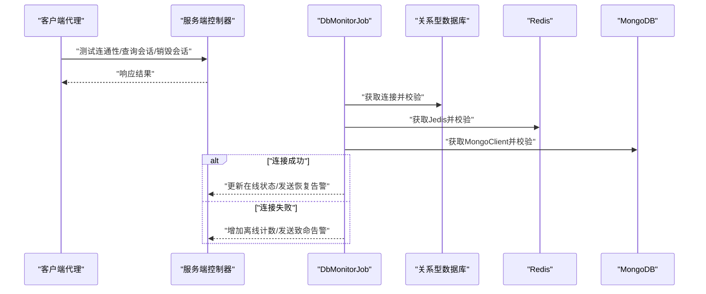
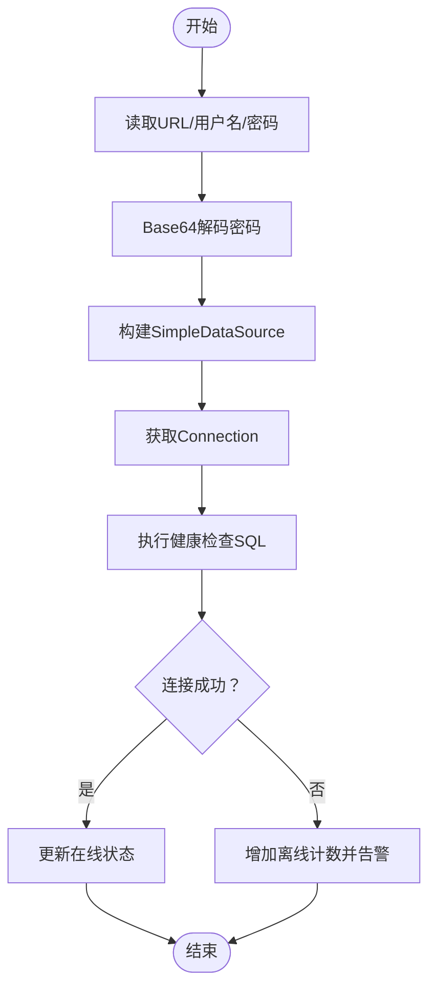
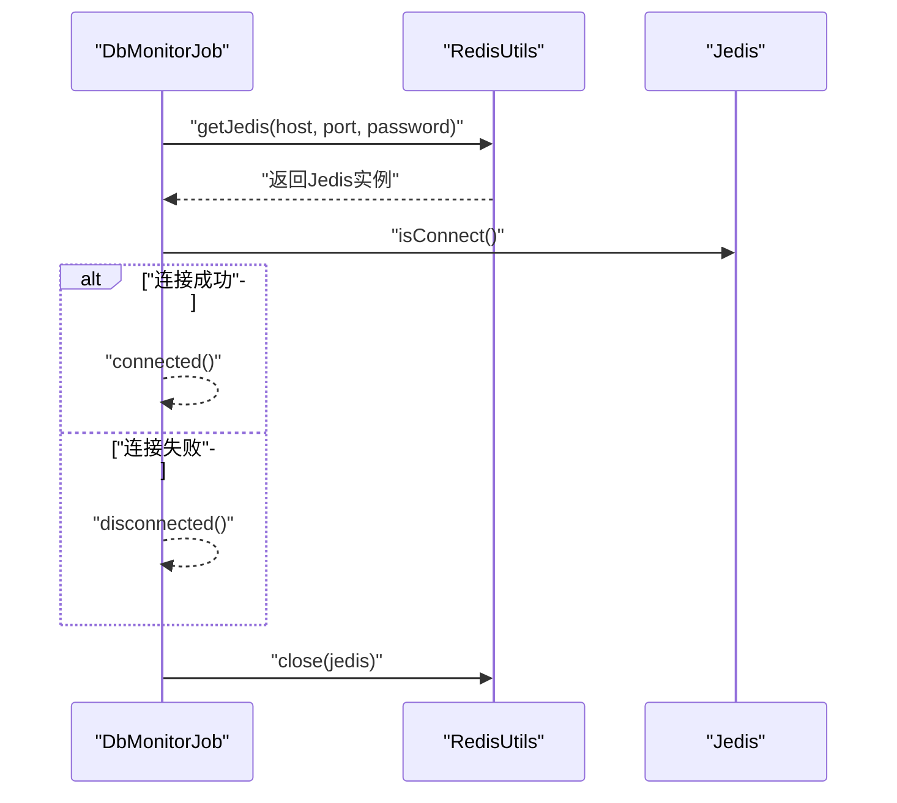
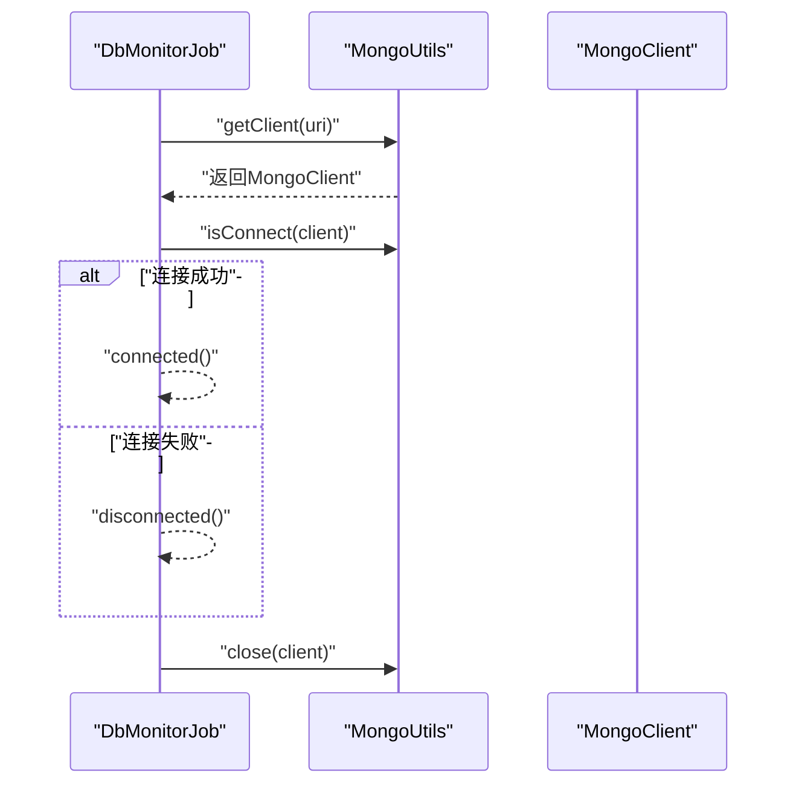
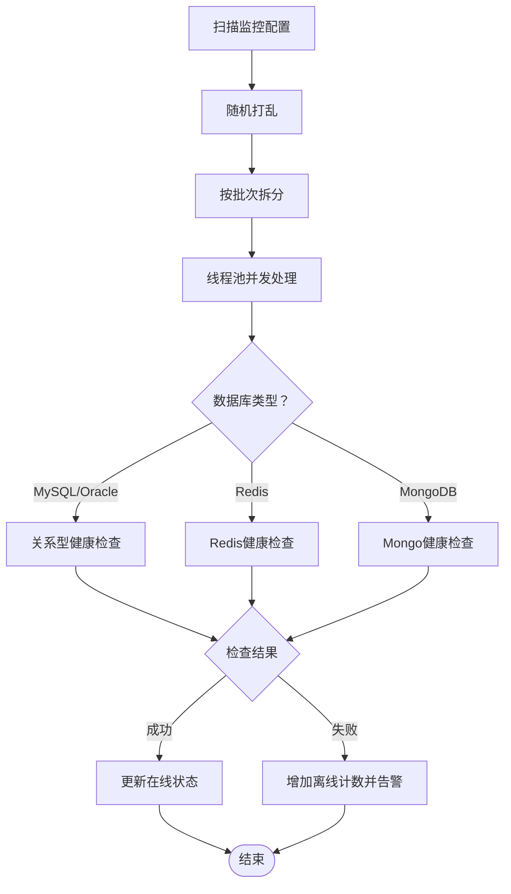
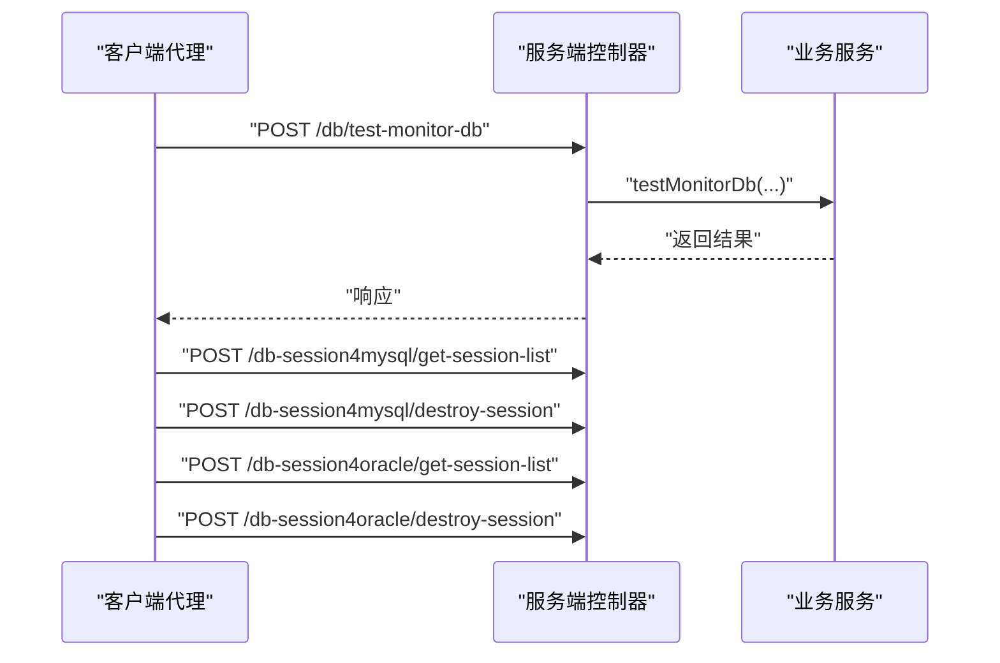
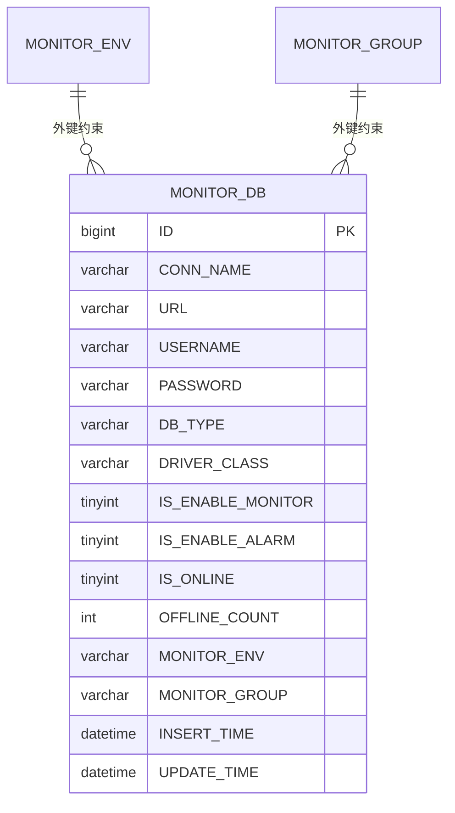
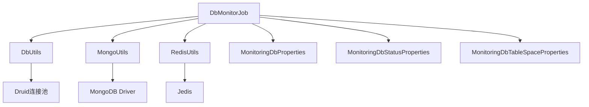

# 数据库系统集成

<cite>
**本文引用的文件**
- [DbMonitorJob.java](file://phoenix-server/src/main/java/com/gitee/pifeng/monitoring/server/business/server/monitor/db/DbMonitorJob.java)
- [DbUtils.java](file://phoenix-server/src/main/java/com/gitee/pifeng/monitoring/server/util/db/DbUtils.java)
- [MongoUtils.java](file://phoenix-server/src/main/java/com/gitee/pifeng/monitoring/server/util/db/MongoUtils.java)
- [RedisUtils.java](file://phoenix-server/src/main/java/com/gitee/pifeng/monitoring/server/util/db/RedisUtils.java)
- [DbController.java](file://phoenix-server/src/main/java/com/gitee/pifeng/monitoring/server/business/server/controller/DbController.java)
- [DbSession4MysqlController.java](file://phoenix-server/src/main/java/com/gitee/pifeng/monitoring/server/business/server/controller/DbSession4MysqlController.java)
- [DbSession4OracleController.java](file://phoenix-server/src/main/java/com/gitee/pifeng/monitoring/server/business/server/controller/DbSession4OracleController.java)
- [IDbService.java](file://phoenix-server/src/main/java/com/gitee/pifeng/monitoring/server/business/server/service/IDbService.java)
- [IDbSession4MysqlService.java](file://phoenix-server/src/main/java/com/gitee/pifeng/monitoring/server/business/server/service/IDbSession4MysqlService.java)
- [IDbSession4OracleService.java](file://phoenix-server/src/main/java/com/gitee/pifeng/monitoring/server/business/server/service/IDbSession4OracleService.java)
- [DbServiceImpl.java](file://phoenix-server/src/main/java/com/gitee/pifeng/monitoring/server/business/server/service/impl/DbServiceImpl.java)
- [application.yml](file://phoenix-server/src/main/resources/application.yml)
- [DbDriverClassConstants.java](file://phoenix-ui/src/main/java/com/gitee/pifeng/monitoring/ui/constant/DbDriverClassConstants.java)
- [DbController.java](file://phoenix-agent/src/main/java/com/gitee/pifeng/monitoring/agent/business/client/controller/DbController.java)
- [DbSession4MysqlController.java](file://phoenix-agent/src/main/java/com/gitee/pifeng/monitoring/agent/business/client/controller/DbSession4MysqlController.java)
- [DbSession4OracleController.java](file://phoenix-agent/src/main/java/com/gitee/pifeng/monitoring/agent/business/client/controller/DbSession4OracleController.java)
- [DbInfo4MongoServiceController.java](file://phoenix-agent/src/main/java/com/gitee/pifeng/monitoring/agent/business/client/controller/DbInfo4MongoServiceController.java)
- [DbInfo4RedisServiceController.java](file://phoenix-agent/src/main/java/com/gitee/pifeng/monitoring/agent/business/client/controller/DbInfo4RedisServiceController.java)
- [application.yml](file://phoenix-agent/src/main/resources/application.yml)
- [MonitoringDbProperties.java](file://phoenix-common/phoenix-common-core/src/main/java/com/gitee/pifeng/monitoring/common/property/server/MonitoringDbProperties.java)
- [MonitoringDbStatusProperties.java](file://phoenix-common/phoenix-common-core/src/main/java/com/gitee/pifeng/monitoring/common/property/server/MonitoringDbStatusProperties.java)
- [MonitoringDbTableSpaceProperties.java](file://phoenix-common/phoenix-common-core/src/main/java/com/gitee/pifeng/monitoring/common/property/server/MonitoringDbTableSpaceProperties.java)
- [MonitorDb.java](file://phoenix-server/src/main/java/com/gitee/pifeng/monitoring/server/business/server/entity/MonitorDb.java)
- [phoenix.sql](file://doc/数据库设计/sql/mysql/phoenix.sql)
</cite>

## 目录
1. [简介](#简介)
2. [项目结构](#项目结构)
3. [核心组件](#核心组件)
4. [架构总览](#架构总览)
5. [详细组件分析](#详细组件分析)
6. [依赖分析](#依赖分析)
7. [性能考量](#性能考量)
8. [故障排查指南](#故障排查指南)
9. [结论](#结论)
10. [附录](#附录)

## 简介
本文件面向Phoenix监控系统的数据库系统集成功能，围绕MySQL、Oracle、Redis、MongoDB四类数据库，系统化阐述连接配置、驱动加载、连接池管理、监控采集、性能分析与优化、异常处理与故障恢复等关键技术点。文档以代码级分析为基础，辅以可视化图表，帮助开发者与运维人员快速理解与落地数据库监控能力。

## 项目结构
Phoenix采用前后端分离与多模块协作的架构：
- phoenix-agent：客户端代理，负责向服务端发起数据库连通性测试、会话查询与销毁等请求。
- phoenix-server：服务端，负责定时扫描数据库监控配置、执行连接健康检查、告警与状态更新。
- phoenix-ui：前端管理界面，提供数据库配置与监控视图。
- phoenix-common：公共模块，包含通用属性、枚举、异常与工具接口。
- doc：数据库设计脚本与部署说明。

```mermaid
graph TB
subgraph "客户端代理(pheonix-agent)"
AG_DB["DbController"]
AG_MYSQL["DbSession4MysqlController"]
AG_ORACLE["DbSession4OracleController"]
AG_MONGO["DbInfo4MongoServiceController"]
AG_REDIS["DbInfo4RedisServiceController"]
end
subgraph "服务端(pheonix-server)"
SV_JOB["DbMonitorJob"]
SV_DBUTIL["DbUtils"]
SV_MONGO["MongoUtils"]
SV_REDIS["RedisUtils"]
SV_CTRL_DB["DbController"]
SV_CTRL_MYSQL["DbSession4MysqlController"]
SV_CTRL_ORACLE["DbSession4OracleController"]
end
subgraph "公共模块(phoenix-common)"
CM_PROP_DB["MonitoringDbProperties"]
CM_PROP_DB_STATUS["MonitoringDbStatusProperties"]
CM_PROP_DB_TSPACE["MonitoringDbTableSpaceProperties"]
end
subgraph "前端(pheonix-ui)"
UI_CONST["DbDriverClassConstants"]
end
AG_DB --> SV_CTRL_DB
AG_MYSQL --> SV_CTRL_MYSQL
AG_ORACLE --> SV_CTRL_ORACLE
AG_MONGO --> SV_MONGO
AG_REDIS --> SV_REDIS
SV_JOB --> SV_DBUTIL
SV_JOB --> SV_MONGO
SV_JOB --> SV_REDIS
SV_JOB --> CM_PROP_DB
SV_JOB --> CM_PROP_DB_STATUS
SV_JOB --> CM_PROP_DB_TSPACE
```

**图表来源**
- [DbMonitorJob.java:1-449](file://phoenix-server/src/main/java/com/gitee/pifeng/monitoring/server/business/server/monitor/db/DbMonitorJob.java#L1-L449)
- [DbUtils.java:1-58](file://phoenix-server/src/main/java/com/gitee/pifeng/monitoring/server/util/db/DbUtils.java#L1-L58)
- [MongoUtils.java:1-95](file://phoenix-server/src/main/java/com/gitee/pifeng/monitoring/server/util/db/MongoUtils.java#L1-L95)
- [RedisUtils.java:1-58](file://phoenix-server/src/main/java/com/gitee/pifeng/monitoring/server/util/db/RedisUtils.java#L1-L58)
- [DbController.java:1-68](file://phoenix-server/src/main/java/com/gitee/pifeng/monitoring/server/business/server/controller/DbController.java#L1-L68)
- [DbSession4MysqlController.java:1-77](file://phoenix-server/src/main/java/com/gitee/pifeng/monitoring/server/business/server/controller/DbSession4MysqlController.java#L1-L77)
- [DbSession4OracleController.java:1-77](file://phoenix-server/src/main/java/com/gitee/pifeng/monitoring/server/business/server/controller/DbSession4OracleController.java#L1-L77)
- [MonitoringDbProperties.java:1-36](file://phoenix-common/phoenix-common-core/src/main/java/com/gitee/pifeng/monitoring/common/property/server/MonitoringDbProperties.java#L1-L36)
- [MonitoringDbStatusProperties.java:1-32](file://phoenix-common/phoenix-common-core/src/main/java/com/gitee/pifeng/monitoring/common/property/server/MonitoringDbStatusProperties.java#L1-L32)
- [MonitoringDbTableSpaceProperties.java:1-43](file://phoenix-common/phoenix-common-core/src/main/java/com/gitee/pifeng/monitoring/common/property/server/MonitoringDbTableSpaceProperties.java#L1-L43)
- [DbController.java:1-61](file://phoenix-agent/src/main/java/com/gitee/pifeng/monitoring/agent/business/client/controller/DbController.java#L1-L61)
- [DbSession4MysqlController.java:1-77](file://phoenix-agent/src/main/java/com/gitee/pifeng/monitoring/agent/business/client/controller/DbSession4MysqlController.java#L1-L77)
- [DbSession4OracleController.java:1-77](file://phoenix-agent/src/main/java/com/gitee/pifeng/monitoring/agent/business/client/controller/DbSession4OracleController.java#L1-L77)
- [DbInfo4MongoServiceController.java:1-59](file://phoenix-agent/src/main/java/com/gitee/pifeng/monitoring/agent/business/client/controller/DbInfo4MongoServiceController.java#L1-L59)
- [DbInfo4RedisServiceController.java:1-61](file://phoenix-agent/src/main/java/com/gitee/pifeng/monitoring/agent/business/client/controller/DbInfo4RedisServiceController.java#L1-L61)

**章节来源**
- [application.yml:116-184](file://phoenix-server/src/main/resources/application.yml#L116-L184)
- [application.yml:31-57](file://phoenix-agent/src/main/resources/application.yml#L31-L57)

## 核心组件
- 定时监控任务：DbMonitorJob按配置周期扫描数据库监控项，分别处理关系型数据库、Redis与MongoDB，执行连通性校验与状态更新。
- 连接工具：DbUtils提供关系型数据库连接获取；MongoUtils提供MongoClient获取与连通性检测；RedisUtils提供Jedis获取与连通性检测。
- 控制器层：服务端与客户端均提供数据库连通性测试、会话查询与销毁接口，形成完整的监控闭环。
- 属性配置：MonitoringDbProperties、MonitoringDbStatusProperties、MonitoringDbTableSpaceProperties定义数据库监控开关、告警与表空间阈值等配置。
- 数据模型：MonitorDb映射数据库监控配置表，承载连接名、URL、用户名、密码、类型等字段。

**章节来源**
- [DbMonitorJob.java:101-156](file://phoenix-server/src/main/java/com/gitee/pifeng/monitoring/server/business/server/monitor/db/DbMonitorJob.java#L101-L156)
- [DbUtils.java:46-55](file://phoenix-server/src/main/java/com/gitee/pifeng/monitoring/server/util/db/DbUtils.java#L46-L55)
- [MongoUtils.java:41-77](file://phoenix-server/src/main/java/com/gitee/pifeng/monitoring/server/util/db/MongoUtils.java#L41-L77)
- [RedisUtils.java:44-57](file://phoenix-server/src/main/java/com/gitee/pifeng/monitoring/server/util/db/RedisUtils.java#L44-L57)
- [MonitoringDbProperties.java:19-36](file://phoenix-common/phoenix-common-core/src/main/java/com/gitee/pifeng/monitoring/common/property/server/MonitoringDbProperties.java#L19-L36)
- [MonitoringDbStatusProperties.java:19-31](file://phoenix-common/phoenix-common-core/src/main/java/com/gitee/pifeng/monitoring/common/property/server/MonitoringDbStatusProperties.java#L19-L31)
- [MonitoringDbTableSpaceProperties.java:20-42](file://phoenix-common/phoenix-common-core/src/main/java/com/gitee/pifeng/monitoring/common/property/server/MonitoringDbTableSpaceProperties.java#L20-L42)
- [MonitorDb.java:26-68](file://phoenix-server/src/main/java/com/gitee/pifeng/monitoring/server/business/server/entity/MonitorDb.java#L26-L68)

## 架构总览
数据库监控整体流程如下：
- 客户端代理通过REST接口向服务端发起数据库连通性测试、会话查询与销毁请求。
- 服务端定时任务扫描数据库配置，按类型分别建立连接并进行健康检查。
- 成功则更新在线状态并发送恢复告警；失败则增加离线计数并发送致命告警。
- 对于关系型数据库，使用Druid连接池；对于Redis与MongoDB，分别使用Jedis与MongoClient进行连接管理。

**图表来源**
- [DbMonitorJob.java:167-300](file://phoenix-server/src/main/java/com/gitee/pifeng/monitoring/server/business/server/monitor/db/DbMonitorJob.java#L167-L300)
- [DbController.java:62-68](file://phoenix-server/src/main/java/com/gitee/pifeng/monitoring/server/business/server/controller/DbController.java#L62-L68)
- [DbSession4MysqlController.java:68-71](file://phoenix-server/src/main/java/com/gitee/pifeng/monitoring/server/business/server/controller/DbSession4MysqlController.java#L68-L71)
- [DbSession4OracleController.java:68-71](file://phoenix-server/src/main/java/com/gitee/pifeng/monitoring/server/business/server/controller/DbSession4OracleController.java#L68-L71)

## 详细组件分析

### 关系型数据库（MySQL/Oracle）连接与监控
- 连接获取：通过DbUtils基于URL、用户名与Base64解码后的密码构建SimpleDataSource并获取Connection。
- 健康检查：DbMonitorJob对关系型数据库执行SQL查询以验证连通性，MySQL与Oracle分别使用对应CHECK_CONN语句。
- 连接池：服务端使用Druid连接池，配置初始大小、最大活跃、最大等待、空闲检测等参数，确保高并发下的稳定性与可观测性。

**图表来源**
- [DbUtils.java:46-55](file://phoenix-server/src/main/java/com/gitee/pifeng/monitoring/server/util/db/DbUtils.java#L46-L55)
- [DbMonitorJob.java:262-300](file://phoenix-server/src/main/java/com/gitee/pifeng/monitoring/server/business/server/monitor/db/DbMonitorJob.java#L262-L300)

**章节来源**
- [DbUtils.java:1-58](file://phoenix-server/src/main/java/com/gitee/pifeng/monitoring/server/util/db/DbUtils.java#L1-L58)
- [DbMonitorJob.java:262-300](file://phoenix-server/src/main/java/com/gitee/pifeng/monitoring/server/business/server/monitor/db/DbMonitorJob.java#L262-L300)
- [application.yml:116-184](file://phoenix-server/src/main/resources/application.yml#L116-L184)

### Redis连接与监控
- 连接获取：RedisUtils根据host、port与password创建Jedis实例，密码同样采用Base64解码后认证。
- 健康检查：通过ping或简单命令验证连通性，多次尝试以降低瞬时抖动影响。
- 资源释放：统一在finally中关闭Jedis，避免连接泄漏。

**图表来源**
- [DbMonitorJob.java:211-251](file://phoenix-server/src/main/java/com/gitee/pifeng/monitoring/server/business/server/monitor/db/DbMonitorJob.java#L211-L251)
- [RedisUtils.java:44-57](file://phoenix-server/src/main/java/com/gitee/pifeng/monitoring/server/util/db/RedisUtils.java#L44-L57)

**章节来源**
- [RedisUtils.java:1-58](file://phoenix-server/src/main/java/com/gitee/pifeng/monitoring/server/util/db/RedisUtils.java#L1-L58)
- [DbMonitorJob.java:211-251](file://phoenix-server/src/main/java/com/gitee/pifeng/monitoring/server/business/server/monitor/db/DbMonitorJob.java#L211-L251)

### MongoDB连接与监控
- 连接获取：MongoUtils基于MongoClientURI创建MongoClient。
- 健康检查：通过listDatabaseNames迭代首个数据库名以验证可用性。
- 资源释放：统一关闭MongoClient，防止资源泄露。

**图表来源**
- [DbMonitorJob.java:167-200](file://phoenix-server/src/main/java/com/gitee/pifeng/monitoring/server/business/server/monitor/db/DbMonitorJob.java#L167-L200)
- [MongoUtils.java:41-92](file://phoenix-server/src/main/java/com/gitee/pifeng/monitoring/server/util/db/MongoUtils.java#L41-L92)

**章节来源**
- [MongoUtils.java:1-95](file://phoenix-server/src/main/java/com/gitee/pifeng/monitoring/server/util/db/MongoUtils.java#L1-L95)
- [DbMonitorJob.java:167-200](file://phoenix-server/src/main/java/com/gitee/pifeng/monitoring/server/business/server/monitor/db/DbMonitorJob.java#L167-L200)

### 数据库监控采集与告警
- 采集策略：定时任务按配置批量扫描监控项，打乱顺序后分批提交线程池并发处理，提升吞吐。
- 告警策略：根据配置决定是否启用数据库状态监控与告警；异常时发送致命告警，恢复时发送普通告警；告警内容包含连接名、URL/地址、类型、描述、环境、分组与时间等。
- 状态更新：在线状态与离线计数由服务端统一维护，便于前端展示与历史追踪。

**图表来源**
- [DbMonitorJob.java:114-156](file://phoenix-server/src/main/java/com/gitee/pifeng/monitoring/server/business/server/monitor/db/DbMonitorJob.java#L114-L156)
- [DbMonitorJob.java:312-352](file://phoenix-server/src/main/java/com/gitee/pifeng/monitoring/server/business/server/monitor/db/DbMonitorJob.java#L312-L352)

**章节来源**
- [DbMonitorJob.java:101-156](file://phoenix-server/src/main/java/com/gitee/pifeng/monitoring/server/business/server/monitor/db/DbMonitorJob.java#L101-L156)
- [DbMonitorJob.java:312-446](file://phoenix-server/src/main/java/com/gitee/pifeng/monitoring/server/business/server/monitor/db/DbMonitorJob.java#L312-L446)

### 客户端代理与服务端控制器交互
- 客户端代理提供数据库连通性测试、会话查询与销毁接口，服务端控制器接收请求并转发至相应服务。
- 会话查询：MySQL与Oracle分别提供获取会话列表与销毁会话的接口，便于运维快速定位与处理阻塞会话。

**图表来源**
- [DbController.java:52-58](file://phoenix-agent/src/main/java/com/gitee/pifeng/monitoring/agent/business/client/controller/DbController.java#L52-L58)
- [DbSession4MysqlController.java:50-74](file://phoenix-agent/src/main/java/com/gitee/pifeng/monitoring/agent/business/client/controller/DbSession4MysqlController.java#L50-L74)
- [DbSession4OracleController.java:50-74](file://phoenix-agent/src/main/java/com/gitee/pifeng/monitoring/agent/business/client/controller/DbSession4OracleController.java#L50-L74)
- [DbController.java:62-68](file://phoenix-server/src/main/java/com/gitee/pifeng/monitoring/server/business/server/controller/DbController.java#L62-L68)
- [DbSession4MysqlController.java:68-71](file://phoenix-server/src/main/java/com/gitee/pifeng/monitoring/server/business/server/controller/DbSession4MysqlController.java#L68-L71)
- [DbSession4OracleController.java:68-71](file://phoenix-server/src/main/java/com/gitee/pifeng/monitoring/server/business/server/controller/DbSession4OracleController.java#L68-L71)

**章节来源**
- [DbController.java:1-61](file://phoenix-agent/src/main/java/com/gitee/pifeng/monitoring/agent/business/client/controller/DbController.java#L1-L61)
- [DbSession4MysqlController.java:1-77](file://phoenix-agent/src/main/java/com/gitee/pifeng/monitoring/agent/business/client/controller/DbSession4MysqlController.java#L1-L77)
- [DbSession4OracleController.java:1-77](file://phoenix-agent/src/main/java/com/gitee/pifeng/monitoring/agent/business/client/controller/DbSession4OracleController.java#L1-L77)
- [DbController.java:1-68](file://phoenix-server/src/main/java/com/gitee/pifeng/monitoring/server/business/server/controller/DbController.java#L1-L68)
- [DbSession4MysqlController.java:1-77](file://phoenix-server/src/main/java/com/gitee/pifeng/monitoring/server/business/server/controller/DbSession4MysqlController.java#L1-L77)
- [DbSession4OracleController.java:1-77](file://phoenix-server/src/main/java/com/gitee/pifeng/monitoring/server/business/server/controller/DbSession4OracleController.java#L1-L77)

### 数据模型与数据库表设计
- MonitorDb实体映射数据库监控配置表MONITOR_DB，包含主键、连接名、URL、用户名、密码、类型、驱动类、是否启用监控/告警、在线状态、离线计数、环境与分组等字段。
- 表结构定义了外键约束与索引，确保环境与分组的完整性与查询效率。

**图表来源**
- [MonitorDb.java:26-68](file://phoenix-server/src/main/java/com/gitee/pifeng/monitoring/server/business/server/entity/MonitorDb.java#L26-L68)
- [phoenix.sql:126-144](file://doc/数据库设计/sql/mysql/phoenix.sql#L126-L144)

**章节来源**
- [MonitorDb.java:1-68](file://phoenix-server/src/main/java/com/gitee/pifeng/monitoring/server/business/server/entity/MonitorDb.java#L1-L68)
- [phoenix.sql:126-144](file://doc/数据库设计/sql/mysql/phoenix.sql#L126-L144)

## 依赖分析
- 组件耦合：DbMonitorJob依赖DbUtils、MongoUtils、RedisUtils与配置属性，体现清晰的职责分离。
- 外部依赖：Druid连接池、Jedis、MongoDB Java Driver、Quartz调度器。
- 配置依赖：服务端application.yml集中管理连接池与监控属性，客户端application.yml提供轻量配置。

**图表来源**
- [DbMonitorJob.java:27-41](file://phoenix-server/src/main/java/com/gitee/pifeng/monitoring/server/business/server/monitor/db/DbMonitorJob.java#L27-L41)
- [DbUtils.java:3-9](file://phoenix-server/src/main/java/com/gitee/pifeng/monitoring/server/util/db/DbUtils.java#L3-L9)
- [application.yml:116-184](file://phoenix-server/src/main/resources/application.yml#L116-L184)

**章节来源**
- [DbMonitorJob.java:1-449](file://phoenix-server/src/main/java/com/gitee/pifeng/monitoring/server/business/server/monitor/db/DbMonitorJob.java#L1-L449)
- [application.yml:116-184](file://phoenix-server/src/main/resources/application.yml#L116-L184)

## 性能考量
- 连接池调优
  - 初始连接数、最大活跃连接数、最大等待时间、空闲回收周期需结合业务QPS与峰值合理配置，避免频繁创建/销毁连接。
  - 开启连接有效性检测与PSCache，有助于减少无效连接与SQL解析开销。
- 并发与批处理
  - 定时任务对监控项进行随机打乱与分批并发处理，可显著提升大规模数据库实例的扫描效率。
- 健康检查策略
  - 对Redis/MongoDB采用多次尝试策略，降低瞬时抖动导致的误报。
- 观测性
  - Druid提供慢SQL统计与合并SQL统计，便于定位性能瓶颈。

**章节来源**
- [application.yml:116-184](file://phoenix-server/src/main/resources/application.yml#L116-L184)
- [DbMonitorJob.java:114-156](file://phoenix-server/src/main/java/com/gitee/pifeng/monitoring/server/business/server/monitor/db/DbMonitorJob.java#L114-L156)

## 故障排查指南
- 连接断开与重连
  - Redis/MongoDB连接异常时，统一进入disconnected流程，增加离线计数并发送致命告警；随后在下次调度周期再次尝试连接。
- 超时处理
  - Jedis构造时设置超时时间；服务端接口访问超时配置为毫秒级，避免长尾请求拖垮线程池。
- 数据一致性
  - 在线状态与离线计数更新采用原子操作，配合数据库外键与索引保障数据完整性。
- 告警策略
  - 恢复告警仅在从异常转为正常时发送，避免重复告警；告警内容包含关键上下文，便于快速定位问题。

**章节来源**
- [DbMonitorJob.java:312-352](file://phoenix-server/src/main/java/com/gitee/pifeng/monitoring/server/business/server/monitor/db/DbMonitorJob.java#L312-L352)
- [application.yml:44-47](file://phoenix-server/src/main/resources/application.yml#L44-L47)
- [application.yml:36-39](file://phoenix-agent/src/main/resources/application.yml#L36-L39)

## 结论
Phoenix监控系统通过统一的定时任务与工具层，实现了对MySQL、Oracle、Redis、MongoDB的标准化接入与监控。结合Druid连接池、多线程并发与告警策略，能够在高并发场景下稳定地提供数据库连通性与状态监控能力。建议在生产环境中结合业务流量特征进一步调优连接池参数与健康检查策略，持续提升系统稳定性与可观测性。

## 附录
- 驱动类常量：UI侧提供Redis与Mongo驱动类常量，便于前端展示与配置提示。
- 接口文档：服务端与客户端均提供Swagger接口文档，便于联调与测试。

**章节来源**
- [DbDriverClassConstants.java:1-22](file://phoenix-ui/src/main/java/com/gitee/pifeng/monitoring/ui/constant/DbDriverClassConstants.java#L1-L22)